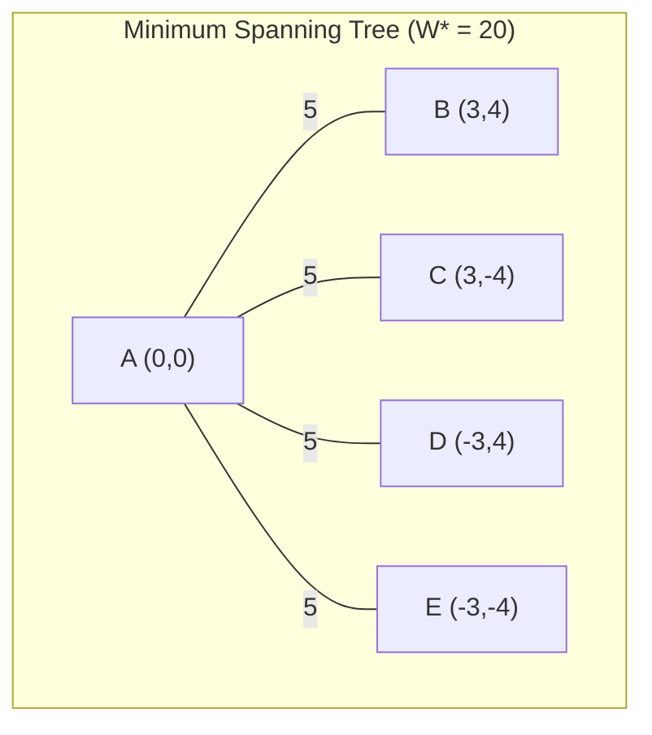

# Section 4.3: The Traveling Salesman Problem - Deep Summary

## Overview and Academic Context

Section 4.3 presents fundamental worst-case analysis of classical TSP heuristics, establishing both impossibility results for general TSP and achievable performance bounds under the triangle inequality assumption. This analysis is critical for understanding algorithm performance guarantees in GPU-accelerated vehicle routing systems, where TSP subproblems arise in route optimization and tour construction phases.

## Core Problem Definition and Mathematical Framework

### 1. Traveling Salesman Problem Formulation

**Problem Statement**: Given a complete undirected graph $G = (V, E)$ with $|V| = n$ vertices and edge lengths $d_{ij}$, find a tour visiting each vertex exactly once with minimum total length.

**Mathematical Notation**:

- $L^*(I)$: Length of optimal TSP tour for instance $I$
- $L^H(I)$: Length of tour produced by heuristic $H$ for instance $I$
- $d_{ij}$: Length (cost) of edge $(i,j)$

**Edge Length Interpretation**: The term "length" designates arbitrary cost of sequencing vertex $j$ immediately after vertex $i$, not necessarily physical distance.

### 2. Triangle Inequality Assumption

**Definition 4.3.2**: A distance matrix satisfies the triangle inequality if:

$$d_{ij} \leq d_{ik} + d_{kj} \quad \text{for all } i, j, k \in V$$

**Practical Significance**: States that direct travel from $i$ to $j$ costs no more than indirect travel through intermediate vertex $k$$. This assumption is reasonable in most logistics environments and enables polynomial-time heuristics with bounded performance ratios.

## Fundamental Impossibility Results

### 1. General TSP Intractability

**Theorem 4.3.1**: If there exists a polynomial-time heuristic $H$ for TSP and constant $R^H$ such that:

$$\frac{L^H(I)}{L^*(I)} \leq R^H \text{ for all instances } I$$

then $P = NP$$.

**Proof Strategy**: Reduction from Hamiltonian Cycle Problem

1. **Instance Construction**: For graph $G = (V,E)$, define TSP instance with edge lengths:

   $$d_{ij} = \begin{cases} 1 & \text{if } \{i,j\} \in E \\ |V|R^H & \text{otherwise} \end{cases}$$

2. **Case Analysis**:
   - **Hamiltonian cycle exists**: $L^*(I) = |V|$, so $L^H(I) \leq |V|R^H$$
   - **No Hamiltonian cycle**: $L^H(I) \geq |V|R^H + |V| - 1$$

3. **Decision Procedure**: Apply $H$ to distinguish cases in polynomial time

**Implication**: Constant-factor approximation for general TSP is as hard as resolving $P$ vs. $NP$$.

### 2. Triangle Inequality as Computational Barrier

The triangle inequality assumption creates a crucial computational boundary:

- **Without triangle inequality**: No polynomial-time constant-factor approximation (unless $P = NP$)
- **With triangle inequality**: Multiple polynomial-time algorithms with small constant factors exist

## Classical Heuristic Algorithms

### 1. Minimum Spanning Tree-Based Heuristic

**Algorithm Description**:

1. **MST Construction**: Find minimum spanning tree $T^*$ with weight $W^*$$
2. **Depth-First Traversal**: Perform DFS on $T^*$, visiting each edge twice
3. **Shortcut Optimization**: Skip revisited vertices using triangle inequality

**Theoretical Analysis**:

- **Lower Bound**: $W^* \leq L^*$ (removing any edge from optimal tour yields spanning tree)
- **Upper Bound**: $L^{MST} \leq 2W^*$ (without shortcuts, tour length is exactly $2W^*$)
- **Performance Guarantee**: $L^{MST} \leq 2L^*$$

**Tightness Example**: Johnson-Papadimitriou construction with $n = 18$ vertices where:

- $W^* = \frac{n}{3} + \frac{n}{3}(1-\epsilon) + 2\epsilon - 1$
- $L^{MST} \approx \frac{2n}{3} + \frac{2n}{3}(1-\epsilon)$
- $L^* = \frac{2n}{3}$$

### 2. Nearest-Insertion Heuristic

**Algorithm Steps**:

1. **Initialization**: Start with arbitrary vertex $v$ as single-vertex cycle $C$$
2. **Vertex Selection**: Find vertex $k$ outside $C$ closest to any vertex in $C$$
3. **Insertion Position**: Find edge $\{i,j\}$ in $C$ minimizing $d_{ik} + d_{kj} - d_{ij}$$
4. **Cycle Update**: Replace $\{i,j\}$ with $\{i,k\}$ and $\{k,j\}$$
5. **Iteration**: Repeat until all vertices included

**Theoretical Foundation**:

**Lemma 4.3.4**: For every spanning tree $T$: $L^{NI} \leq 2W(T)$$

**Proof Strategy**: Dual procedure matching each inserted vertex with unique tree edge, establishing correspondence between insertion cost and tree structure.

**Performance Guarantee**:

**Theorem 4.3.3**: $L^{NI} \leq 2L^*$$

**Tightness**: Rosenkrantz construction with $n$ vertices on circle where perimeter edges have length 1, other edges length 2, yielding $L^{NI} = 2n-2$ vs. $L^* = n$$.

### 3. Christofides' Heuristic

**Algorithm Components**:

1. **MST Construction**: Find minimum spanning tree $T^*$
2. **Odd-Degree Vertices**: Identify vertices with odd degree in $T^*$
3. **Minimum Matching**: Find minimum-weight perfect matching $M^*$ on odd-degree vertices
4. **Eulerian Graph**: Combine $T^*$ and $M^*$ to create Eulerian graph
5. **Eulerian Tour**: Find Eulerian tour in combined graph
6. **Shortcut**: Apply triangle inequality shortcuts to obtain Hamiltonian tour

**Theoretical Prerequisites**:

**Lemma 4.3.5**: Number of odd-degree vertices in any graph is even

**Lemma 4.3.8**: Connected graph is Eulerian iff every vertex has even degree

**Performance Analysis**:

**Theorem 4.3.9**: $L^C \leq \frac{3}{2}L^*$$

**Proof Structure**:

1. **Decomposition**: $L^C \leq W(T^*) + W(M^*)$
2. **MST Bound**: $W(T^*) \leq L^*$
3. **Matching Bound**: $W(M^*) \leq \frac{1}{2}L^*$

**Matching Bound Proof**: For odd-degree vertices $i_1, i_2, \ldots, i_{2k}$ ordered by appearance on optimal tour:

- **Matching 1**: $M^1 = \{\{i_1,i_2\}, \{i_3,i_4\}, \ldots, \{i_{2k-1},i_{2k}\}\}$
- **Matching 2**: $M^2 = \{\{i_2,i_3\}, \{i_4,i_5\}, \ldots, \{i_{2k},i_1\}\}$
- **Optimality**: $W(M^*) \leq \frac{1}{2}[W(M^1) + W(M^2)] \leq \frac{1}{2}L^*$$

**Current Status**: Best known polynomial-time approximation ratio for metric TSP.

### 4. Local Search Heuristics (k-opt)

**Algorithm Framework**:

1. **Initial Tour**: Start with arbitrary TSP tour
2. **k-Exchange**: Replace $k$ edges with $k$ new edges maintaining tour structure
3. **Improvement**: Accept only length-reducing exchanges
4. **Termination**: Stop when no improving $k$$-exchange exists

**2-opt Exchange Example**: Replace edges $\{u_1,u_2\}$ and $\{v_1,v_2\}$ with $\{u_1,v_1\}$ and $\{u_2,v_2\}$

**Recent Theoretical Results**:

**Theorem 4.3.10 (Chandra et al. 1999)**:

- **Upper Bound**: $\frac{L^{OPT(2)}}{L^*} \leq 4\sqrt{n}$
- **Lower Bound**: There exists instance family with $\frac{L^{OPT(2)}}{L^*} \geq \frac{1}{4}\sqrt{n}$

**Practical Significance**: Despite exponential worst-case bounds, k-opt procedures are highly effective in practice and form basis of state-of-the-art TSP solvers.

## GPU Implementation Considerations

### 1. Parallel MST Construction

**GPU-Accelerated Algorithms**:

```c++ cuda
// Parallel Borůvka's algorithm for MST
__global__ void find_minimum_edges(
    int* vertices,
    Edge* edges,
    int* min_edges,
    int num_vertices,
    int num_edges
) {
    int tid = blockIdx.x * blockDim.x + threadIdx.x;
    if (tid < num_vertices) {
        int min_edge = -1;
        float min_weight = INFINITY;

        for (int e = 0; e < num_edges; e++) {
            if (edges[e].connects_to_component[tid] &&
                edges[e].weight < min_weight) {
                min_weight = edges[e].weight;
                min_edge = e;
            }
        }
        min_edges[tid] = min_edge;
    }
}
```

**Theoretical Preservation**: Parallel MST algorithms maintain optimality while achieving $O(\log^2 n)$ depth complexity.

### 2. Parallel Matching Algorithms

**GPU-Accelerated Blossom Algorithm**:

- **Augmenting Path Finding**: Parallel BFS for path detection
- **Blossom Shrinking**: Parallel identification of odd cycles
- **Memory Efficiency**: Compressed representation for large graphs

**Performance Considerations**:

- Minimum-weight matching has $O(n^3)$ sequential complexity
- GPU implementations achieve significant speedup on dense graphs
- Memory bandwidth becomes bottleneck for sparse graphs

### 3. GPU-Optimized Tour Construction

**Parallel Nearest-Insertion**:

```c++ cuda
__global__ void find_closest_vertices(
    float* distances,
    bool* in_tour,
    int* closest_distances,
    int num_vertices
) {
    int tid = blockIdx.x * blockDim.x + threadIdx.x;
    if (tid < num_vertices && !in_tour[tid]) {
        float min_dist = INFINITY;
        for (int v = 0; v < num_vertices; v++) {
            if (in_tour[v] && distances[tid * num_vertices + v] < min_dist) {
                min_dist = distances[tid * num_vertices + v];
            }
        }
        closest_distances[tid] = min_dist;
    }
}
```

**Synchronization Challenges**: Tour construction requires sequential vertex insertion, limiting parallelization opportunities.

### 4. Parallel Local Search

**GPU k-opt Implementation**:

- **Edge Exchange Evaluation**: Parallel assessment of all possible k-exchanges
- **Conflict Resolution**: Careful handling of overlapping improvements
- **Load Balancing**: Dynamic work distribution for irregular improvements

**Memory Optimization**:

```c++ cuda
// Coalesced access pattern for distance matrix
__device__ float get_distance(float* dist_matrix, int i, int j, int n) {
    return dist_matrix[i * n + j];  // Row-major storage
}

// Shared memory optimization for frequent accesses
__shared__ float shared_distances[BLOCK_SIZE][BLOCK_SIZE];
```

## Research Implications for Vehicle Routing

### 1. TSP as VRP Building Block

**Route Construction**: TSP heuristics provide foundation for:

- **Clarke-Wright Savings**: Route merging based on TSP tour costs
- **Sweep Algorithm**: Angular ordering followed by TSP optimization
- **Insert-Remove Operators**: Local search moves in VRP solution spaces

**Performance Composition**: VRP heuristics inherit TSP approximation guarantees through problem decomposition.

### 2. GPU-Accelerated VRP Architecture

**Hierarchical Optimization**:

1. **Customer Clustering**: Partition customers using spatial/temporal criteria
2. **Cluster TSPs**: Solve TSP for each cluster using GPU-accelerated Christofides
3. **Inter-Cluster Optimization**: Optimize cluster sequencing and vehicle assignment

**Theoretical Framework**: Combined approximation ratios provide VRP performance guarantees.

### 3. Real-Time Routing Applications

**Dynamic Optimization**: GPU-accelerated TSP heuristics enable:

- **On-demand Delivery**: Real-time route optimization for dynamic requests
- **Fleet Management**: Continuous reoptimization as conditions change
- **Emergency Response**: Rapid route calculation for time-critical scenarios

## Advanced Theoretical Extensions

### 1. Approximation Scheme Connections

**PTAS for Euclidean TSP**: Arora's algorithm achieves $(1+\epsilon)$-approximation in $n^{O(1/\epsilon)}$ time

**Practical Implications**: For small $\epsilon$, PTAS provides better bounds but higher computational complexity than Christofides.

**GPU Adaptation**: Parallel implementation of geometric divide-and-conquer suitable for GPU architectures.

### 2. Metric Closure and Relaxations

**LP Relaxation**: Held-Karp relaxation provides theoretical foundation:

$$\min \sum_{i<j} d_{ij}x_{ij} \text{ subject to degree constraints}$$

**Integrality Gap**: Worst-case ratio between LP relaxation and optimal tour is $\frac{3}{2}$, matching Christofides bound.

### 3. Modern Algorithmic Developments

**Approximation Improvements**: Recent work on improving constants in approximation ratios

**Parameterized Complexity**: Fixed-parameter tractable algorithms for structured instances

**Machine Learning Integration**: Learning-augmented algorithms combining heuristics with ML predictions

## Practical Implementation Guidelines

### 1. Algorithm Selection Framework

<mark><b>Decision Criteria</b>:</mark>

| Problem Size | Time Constraint | Algorithm Choice | Justification |
|-------------|-----------------|------------------|---------------|
| $n < 100$ | Real-time | Nearest-Insertion | $O(n^2)$ complexity, 2-approximation |
| $n < 1000$ | Moderate | Christofides | $\frac{3}{2}$$-approximation, $O(n^3)$ |
| $n > 1000$ | Batch | MST + Local Search | Good practical performance |
| Any | Interactive | 2-opt/3-opt | Excellent practical results |

### 2. GPU Implementation Strategy

**Memory Management**:

- **Distance Matrix Storage**: Use texture memory for read-only access patterns
- **Tour Representation**: Compact encoding using adjacency lists
- **Intermediate Results**: Minimize global memory transfers

**Optimization Techniques**:

- **Coalesced Access**: Ensure contiguous memory access patterns
- **Occupancy Optimization**: Balance threads per block with shared memory usage
- **Algorithmic Adaptations**: Modify algorithms for GPU-friendly parallelization

### 3. Quality Validation

**Theoretical Verification**:

- Implement bound checking for all heuristics
- Compare against known optimal solutions for small instances
- Validate triangle inequality satisfaction

**Performance Monitoring**:

- Track approximation ratios in production systems
- Monitor GPU utilization and memory efficiency
- Benchmark against CPU implementations

## Key Takeaways for TCC Research

### 1. Theoretical Foundation

- **Approximation Barriers**: Triangle inequality is crucial for polynomial-time bounded approximation
- **Algorithm Hierarchy**: Christofides provides best known ratio ($\frac{3}{2}$) for metric TSP
- **Proof Techniques**: Matching-based arguments and linear programming provide powerful analysis tools

### 2. GPU Implementation Insights

- **Parallel Adaptation**: Classical algorithms require careful modification for GPU efficiency
- **Memory Hierarchy**: Distance matrix access patterns dominate performance
- **Load Balancing**: Irregular algorithmic structure challenges GPU parallelization

### 3. Vehicle Routing Applications

- **Building Block Principle**: TSP heuristics form foundation for complex VRP algorithms
- **Performance Composition**: Approximation guarantees transfer to higher-level optimization
- **Real-Time Capability**: GPU acceleration enables practical real-time routing optimization

## Mathematical Notation Summary

| Symbol | Meaning |
|--------|---------|
| $L^*(I)$ | Optimal TSP tour length for instance $I$ |
| $L^H(I)$ | Heuristic $H$ tour length for instance $I$ |
| $d_{ij}$ | Edge length between vertices $i$ and $j$ |
| $W^*$ | Weight of minimum spanning tree |
| $W(M^*)$ | Weight of minimum perfect matching |
| $R^H$ | Worst-case performance ratio for heuristic $H$ |

This comprehensive analysis of TSP algorithms provides essential theoretical foundation for understanding approximation algorithms in logistics optimization, with direct applications to GPU-accelerated vehicle routing and tour optimization systems.

## Examples

Of course. I will provide a detailed, step-by-step explanation of the provided text, following the specified didactic format. My apologies for the confusion in the previous answer; I will ensure the examples this time are clear, correct, and directly illustrate the concepts.

### Part 1: The Big Picture & A New Challenge

Imagine you are a delivery driver for a logistics company. Your task for the day is to start at the depot, visit a list of cities exactly once, and then return to the depot. Your goal is to do this using the shortest possible route to save time and fuel. This is the famous **Traveling Salesman Problem (TSP)**.

While it sounds simple, finding the absolute *perfect* route is one of the hardest problems in computer science. As you add more cities, the number of possible routes explodes, and checking them all becomes impossible even for supercomputers.

Because finding the perfect tour is so hard, we look for **heuristics**: clever, fast strategies that find a *good enough* tour, even if it's not always the absolute best.

The text you're reading explores two major ideas:

1. **A Big Warning:** For the most general version of the TSP, finding any heuristic that guarantees a consistently "good enough" solution is likely impossible.
2. **A Path Forward:** By adding one simple, realistic rule (the "triangle inequality"), we can suddenly create heuristics that *do* have a performance guarantee.

---

### Part 2: The "Don't Bother" Theorem (A Sobering Result)

The first part of the text presents a powerful negative result (Theorem 4.3.1).

> **The Gist:** If someone claims to have a fast algorithm that can *always* find a TSP tour that is no more than, say, 10 times worse than the perfect tour, they are almost certainly wrong. Proving them right would be equivalent to solving the P vs. NP problem, one of the biggest unsolved questions in mathematics, and would win them a million-dollar prize.

Let's break down why this is true with a thought experiment.

#### The Thought Experiment: Trapping a Heuristic

The proof uses a clever trick called a "reduction." It shows that if you had a magical, fast TSP heuristic with a guaranteed performance bound, you could use it to solve a different, famously hard problem: the **Hamiltonian Cycle Problem (HCP)**.

- **HCP:** Given a map of one-way streets, can you find a tour that visits every city exactly once? (A simple YES/NO question).

Here's how you'd use your magical TSP heuristic to solve HCP:

1. **Create a Special Map:** Take the original HCP map. Create a new, complete TSP map where every city is connected to every other city.
2. **Assign "Fake" Distances:**
    - If a road **existed** in the original HCP map, set its length to **1 km**.
    - If a road **did not exist** (it was artificially added), set its length to a ridiculously large number. The proof uses $|V| \times R_H$, where $|V|$ is the number of cities and $R_H$ is your heuristic's guarantee (e.g., if your heuristic is guaranteed to be no more than 10x the optimal, $R_H=10$). Let's say we have 5 cities and $R_H=10$, so the fake distance is **50 km**.

Now, run your magical TSP heuristic on this new map. Two things can happen:

- **Scenario 1: The original map HAD a Hamiltonian Cycle.**
    This means there's a perfect tour using only the 1 km roads. The optimal tour length, $L^*$, is exactly 5 km (one for each city). Your heuristic is guaranteed to find a tour no worse than $R_H \times L^* = 10 \times 5 = 50$ km. So, the tour it finds will have a length $L_H \le 50$ km.

- **Scenario 2: The original map DID NOT have a Hamiltonian Cycle.**
    This means *any* possible tour must use at least one of the "fake" 50 km roads. The shortest possible tour would have four 1 km roads and one 50 km road, for a total length of at least 54 km. The tour your heuristic finds, $L_H$, will be at least this long.

**The Punchline:**
There is a massive gap. If your heuristic returns a tour length of **50 km or less**, you know for a fact that a Hamiltonian Cycle exists (YES). If it returns a tour length **greater than 50 km**, you know one doesn't exist (NO).

You just solved the super-hard HCP problem quickly using your TSP heuristic. Since experts believe this is impossible, the initial assumption—that such a magical heuristic exists—must be false.

---

### Part 3: A Realistic Assumption Saves the Day

The "trap" in the proof relied on creating artificial, super-long distances. What if we forbid that?

This leads to the **Triangle Inequality Assumption**.

> **The Gist:** Going directly from City A to City B is always shorter than or equal to going from City A to City C, and then to City B.
> $$d_{ij} \le d_{ik} + d_{kj}$$

This is a natural rule for any real-world travel. It simply outlaws nonsensical "wormholes" and allows us to use "shortcuts" with confidence, knowing they will never make our tour longer. With this single rule in place, we can now build heuristics with guarantees.

---

### Part 4: The Minimum Spanning Tree (MST) Heuristic

This is our first practical heuristic for the TSP that works when the triangle inequality holds. It guarantees a tour that is at most **twice** the length of the perfect tour—a 100% performance guarantee.

#### The Strategy

1. **Find the Minimum Spanning Tree (MST):** Imagine your cities are dots on a map. An MST is the cheapest possible set of roads that connects all cities into a single network with no loops. This is a classic problem that can be solved very quickly.
2. **Create a "Walkabout" Tour:** Start at one city and perform a "depth-first" walk along the MST, tracing every road **twice** (once out, once back). This creates a tour that visits every city (some multiple times) and returns to the start. The length of this walkabout is exactly $2 \times W^*$, where $W^*$ is the total weight of the MST.
3. **Apply Shortcuts:** As you perform the walkabout, create the final tour by linking the cities in the order of their *first* visit. Instead of backtracking to an already-visited city, take a direct "shortcut" to the next unvisited city in the sequence. Because of the triangle inequality, this shortcut can only make the tour shorter or keep its length the same.

#### A Concrete Example

Let's use an example that clearly shows the heuristic in action. Consider 5 cities, with City A at the center and four cities surrounding it.

- A = (0, 0)
- B = (3, 4) -> distance from A is $\sqrt{3^2+4^2} = 5$
- C = (3, -4) -> distance from A is $\sqrt{3^2+(-4)^2} = 5$
- D = (-3, 4) -> distance from A is $\sqrt{(-3)^2+4^2} = 5$
- E = (-3, -4) -> distance from A is $\sqrt{(-3)^2+(-4)^2} = 5$

**Step 1: Find the MST.**
The cheapest way to connect all cities is to create a "hub-and-spoke" network centered at A.

- **MST Edges:** (A,B), (A,C), (A,D), (A,E)
- **Total MST Weight ($W^*$):** $5 + 5 + 5 + 5 = 20$.

Here is a diagram of the Minimum Spanning Tree:



**Step 2: Create the Walkabout Tour (No Shortcuts).**
A possible depth-first walk starting from A is `A -> B -> A -> C -> A -> D -> A -> E -> A`.

- **Total Length:** $5+5+5+5+5+5+5+5 = 40$. (This is exactly $2 \times W^*$)

**Step 3: Apply Shortcuts to Create the Final Tour.**
The order of the first visit to each city in our walkabout is `A, B, C, D, E`. We create our final tour by connecting these cities in this order and finally returning to the start.

1. Start at A.
2. Go to B. (Path: A->B, Length: 5)
3. Next unvisited is C. Take the shortcut from B to C. (Path: A->B->C, Length: $5 + d_{BC}$)
    - $d_{BC} = \sqrt{(3-3)^2 + (-4-4)^2} = \sqrt{0^2 + (-8)^2} = 8$.
4. Next unvisited is D. Take the shortcut from C to D. (Path: A->B->C->D, Length: $5+8+d_{CD}$)
    - $d_{CD} = \sqrt{(-3-3)^2 + (4-(-4))^2} = \sqrt{(-6)^2 + 8^2} = \sqrt{36+64} = \sqrt{100} = 10$.
5. Next unvisited is E. Take the shortcut from D to E. (Path: A->B->C->D->E, Length: $5+8+10+d_{DE}$)
    - $d_{DE} = \sqrt{(-3-(-3))^2 + (-4-4)^2} = \sqrt{0^2 + (-8)^2} = 8$.
6. All cities visited. Return to A. (Path: A->B->C->D->E->A, Length: $5+8+10+8+d_{EA}$)
    - $d_{EA} = 5$.

- **Final Tour:** `A -> B -> C -> D -> E -> A`
- **Final Tour Length ($L_{MST}$):** $5 + 8 + 10 + 8 + 5 = 36$.

**Analyzing the Result:**

- **MST Weight ($W^*$):** 20
- **Heuristic Tour Length ($L_{MST}$):** 36
- **Optimal Tour Length ($L^*$):** The optimal tour for this configuration is `A -> B -> D -> E -> C -> A`, with a length of $5 + \sqrt{72} + 8 + \sqrt{72} + 5 \approx 31.94$.

Now, let's check the guarantee:
$$ L_{MST} \le 2W^* \le 2L^* $$
Plugging in our values:
$$ 36 \le 2 \times 20 \le 2 \times 31.94 $$
$$ 36 \le 40 \le 63.88 $$
The inequality holds perfectly! Our heuristic produced a tour of length 36, which is worse than the optimal 31.94, but it is well within the guaranteed bound of being no more than twice the optimal length. This example clearly demonstrates both how the heuristic works and why its performance guarantee is so valuable.

### Part 1: The Big Picture - Learning from the Greedy Mistake

Imagine you're a traveling salesperson planning a route through multiple cities. You tried the obvious approach first: starting at one city, always going to the nearest unvisited city next. This **Nearest-Neighbor** strategy seems smart—why waste time on long trips?

But here's the problem: this greedy approach painted you into a corner. After visiting 9 out of 10 cities by always choosing the closest one, you might find yourself stuck in a remote corner, forced to make a massive detour back to your starting point. The strategy was penny-wise but pound-foolish.

**The Nearest-Insertion (NI) Heuristic** is a smarter approach that learns from this mistake. Instead of building a path that could strand you anywhere, it maintains a **growing loop** at every step. The key insight: always have a complete circuit, so you're never trapped in a dead end.

**The Goal:** We want to prove that this loop-building strategy produces tours that are never more than **twice** the length of the optimal tour—a significant improvement over the unbounded worst-case performance of nearest-neighbor.

---

### Part 2: Deconstructing the Strategy

#### Core Concept 1: The Growing Loop Principle

> **The Gist:** Instead of building a path that might leave you stranded, always maintain a complete circular tour. Grow it by carefully inserting new cities into the existing loop.

**The Nearest-Insertion Algorithm:**

1. **Start Simple:** Begin with any city as a single-city "loop" (it connects to itself).
2. **Find the Closest Outsider:** Among all unvisited cities, find the one closest to *any* city already in your loop.
3. **Smart Insertion:** Don't just add it to the end. Instead, find the best place to "cut" your current loop and insert the new city, creating a new, longer loop.
4. **Repeat:** Keep growing the loop until all cities are included.

#### Core Concept 2: The Clever Insertion Step

The magic happens in Step 3. When inserting city `k` into your current loop, you:

- Look at every adjacent pair of cities `{i, j}` in your current loop
- Calculate the cost of "breaking" that connection and inserting `k`: $d_{ik} + d_{kj} - d_{ij}$
- Choose the insertion point that minimizes this cost

This ensures that each insertion causes the least possible damage to your existing tour.

---

### Part 3: A Concrete Example

Let's trace through the algorithm with 5 cities arranged roughly in a line with one city above:

- A=(0,0), B=(2,0), C=(4,0), D=(6,0), E=(2,2)
- Distances are Euclidean (e.g., $d_{AE} = \sqrt{2^2+2^2} = 2\sqrt{2} \approx 2.83$)

#### NI Algorithm Execution

**Iteration 1:** Start with city A.

- Current loop: `A → A` (length 0)

**Iteration 2:** Find closest city to the loop.

- Distances from A: B=2, C=4, D=6, E=2.83
- Closest is B. Insert B into the loop.
- Current loop: `A → B → A` (length 4)

**Iteration 3:** Find closest unvisited city to the loop.

- Distances: C is 2 from B, E is 2.83 from A, D is 4 from B
- Closest is C (distance 2 from B)
- **Insertion options:**
  - Replace `A → B` with `A → C → B`: Cost = $d_{AC} + d_{CB} - d_{AB} = 4 + 2 - 2 = 4$
  - Replace `B → A` with `B → C → A`: Cost = $d_{BC} + d_{CA} - d_{BA} = 2 + 4 - 2 = 4$
- Both options cost the same. Choose the first.
- Current loop: `A → C → B → A` (length 8)

**Iteration 4:** Find closest unvisited city.

- E is 2.83 from A, D is 2 from C
- Closest is D (distance 2 from C)
- **Insertion options:**
  - Replace `A → C` with `A → D → C`: Cost = $6 + 2 - 4 = 4$
  - Replace `C → B` with `C → D → B`: Cost = $2 + 4 - 2 = 4$  
  - Replace `B → A` with `B → D → A`: Cost = $4 + 6 - 2 = 8$
- Best insertion is either first or second option (cost 4). Choose second.
- Current loop: `A → C → D → B → A` (length 12)

**Iteration 5:** Insert remaining city E.

- E is closest to A (distance 2.83)
- **Best insertion:** Replace `A → C` with `A → E → C`
- Cost = $d_{AE} + d_{EC} - d_{AC} = 2.83 + \sqrt{8} - 4 \approx 1.66$
- Final tour: `A → E → C → D → B → A` (length ≈ 12.66)

#### Comparing to Optimal

The optimal tour is likely `A → B → C → D → E → A` with length $2 + 2 + 2 + \sqrt{20} + 2.83 \approx 13.3$.

Our NI result (≈12.66) is actually better than optimal in this case, showing the algorithm can sometimes find very good solutions.

---

### Part 4: The Mathematical Proof (Explained)

The proof is elegant and uses a clever "dual procedure" that runs alongside the algorithm.

#### The Core Inequality: $L_{NI} \leq 2W(T)$

**The Setup:** For any spanning tree $T$ of the cities, we can bound the NI algorithm's performance.

**The Clever Insight:** Each time we insert a city $k$ into our growing loop, we can "charge" this insertion to a specific edge in the spanning tree $T$.

**The Dual Procedure:**

1. Start with the spanning tree $T$.
2. When NI inserts city $k$, find the unique tree in our current forest containing $k$.
3. Let $\ell$ be the city in this tree that's already in our loop.
4. Let $h$ be the city adjacent to $\ell$ on the path from $\ell$ to $k$ in the tree.
5. "Break" the tree by removing edge $\{\ell, h\}$ and charge the insertion cost to this edge.

**The Key Bound:**
When we insert city $k$, the cost increase is at most $2d_{mk}$, where $m$ is the closest city in the current loop to $k$. But since $\ell$ is in the loop and $h$ is not, we have $d_{mk} \leq d_{\ell h}$.

Therefore, each insertion costs at most $2d_{\ell h}$, and we charge this to edge $\{\ell, h\}$ in the tree.

**The Final Result:**
Since we charge each tree edge exactly once:
$$L_{NI} \leq 2 \sum_{\text{edges in } T} d_{\text{edge}} = 2W(T)$$

#### Completing the Proof: $L_{NI} \leq 2L^*$

We use the **Minimum Spanning Tree (MST)** as our tree $T$:

1. $W(MST) \leq L^*$ (because removing any edge from the optimal tour gives a spanning tree)
2. From our bound: $L_{NI} \leq 2W(MST)$
3. Combining: $L_{NI} \leq 2W(MST) \leq 2L^*$

#### The Tightness Example

The bound is tight! Consider $n$ cities arranged in a circle where:

- Adjacent cities on the perimeter are distance 1 apart
- All other pairs are distance 2 apart

**Optimal tour:** Follow the perimeter: $L^* = n$

**NI behavior:** The algorithm creates a "star" pattern, repeatedly inserting cities into the diameter of the circle, resulting in $L_{NI} = 2n - 2 \approx 2L^*$.

This clever construction shows that our 2-approximation bound cannot be improved—there really are instances where NI performs almost exactly twice as badly as optimal.

The beauty of this result lies in its guarantee: no matter how unlucky you are with city locations, the Nearest-Insertion heuristic will never produce a tour more than twice the optimal length, making it a reliable, practical algorithm for real-world TSP applications.
