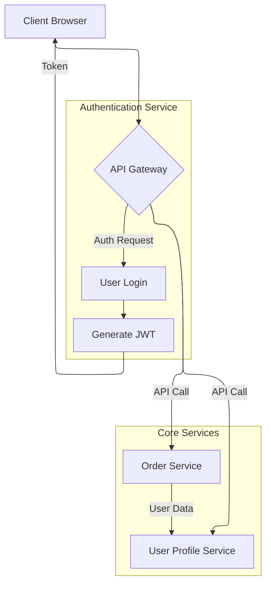
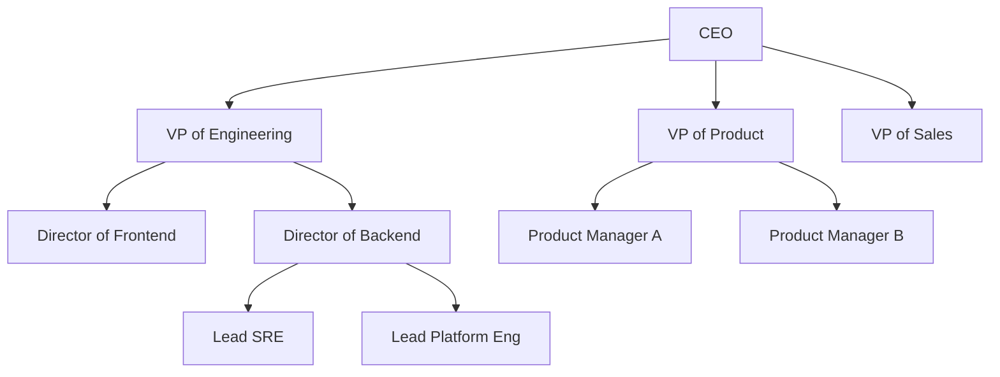

# chapter 4 insights

How should we properly implement chapter 4?

```tree
.
├── examples
│   └── exercise_implementations
│       ├── COMPLETE_USAGE_TUTORIAL.md
│       ├── cvrp_examples.py
│       ├── __init__.py
│       ├── probabilistic_examples.py
│       ├── README.md
│       ├── set_partitioning_examples.py
│       └── tsp_examples.py
├── src
│   ├── algorithms
│   │   ├── bin_packing/
│   │   │   ├── online_heuristics/
│   │   │   │   ├── __init__.py
│   │   │   │   ├── next_fit.py
│   │   │   │   ├── first_fit.py
│   │   │   │   ├── best_fit.py
│   │   │   │   └── performance_analysis/
│   │   │   │       ├── __init__.py
│   │   │   │       ├── next_fit_bounds.py          # R = 2 (unique)
│   │   │   │       ├── ff_bf_shared_bounds.py      # R ≤ 17/10 (shared)
│   │   │   │       └── worst_case_examples.py      # Adversarial instances
│   │   │   ├── offline_heuristics/
│   │   │   │   ├── __init__.py
│   │   │   │   ├── first_fit_decreasing.py
│   │   │   │   ├── best_fit_decreasing.py
│   │   │   │   ├── harmonic_heuristic.py
│   │   │   │   └── performance_analysis/
│   │   │   │       ├── __init__.py
│   │   │   │       ├── ffd_bfd_shared_bounds.py   # R ≤ 11/9 (shared)
│   │   │   │       ├── harmonic_bounds.py         # R ≤ 1.691... (unique)
│   │   │   │       └── asymptotic_optimality.py   # Average-case analysis
│   │   │   └── probabilistic_methods/
│   │   │       ├── __init__.py
│   │   │       ├── sliced_interval_partitioning.py
│   │   │       └── performance_analysis/
│   │   │           ├── __init__.py
│   │   │           ├── concentration_bounds.py     # Chernoff bounds
│   │   │           └── convergence_rates.py       # Average-case analysis
│   │   └── tsp/
│   │       ├── construction_heuristics/
│   │       │   ├── __init__.py
│   │       │   ├── nearest_neighbor.py
│   │       │   ├── minimum_spanning_tree.py
│   │       │   ├── christofides.py
│   │       │   └── performance_analysis/
│   │       │       ├── __init__.py
│   │       │       ├── nearest_neighbor_bounds.py  # O(log n) ratio (unique)
│   │       │       ├── mst_bounds.py              # R = 2 (unique)
│   │       │       ├── christofides_bounds.py     # R = 3/2 (unique)
│   │       │       └── metric_requirements.py     # Triangle inequality analysis
│   │       ├── improvement_heuristics/
│   │       │   ├── __init__.py
│   │       │   ├── k_opt.py
│   │       │   ├── local_search.py
│   │       │   └── performance_analysis/
│   │       │       ├── __init__.py
│   │       │       ├── k_opt_shared_bounds.py     # Shared degradation analysis
│   │       │       ├── local_optima_analysis.py   # Worst-case examples
│   │       │       └── convergence_guarantees.py  # Average-case behavior
│   │       └── probabilistic_methods/
│   │           ├── __init__.py
│   │           ├── region_partitioning.py
│   │           ├── strips_method.py
│   │           └── performance_analysis/
│   │               ├── __init__.py
│   │               ├── bhh_convergence.py         # β√n scaling law
│   │               ├── geometric_bounds.py        # Few's bound analysis
│   │               └── concentration_inequalities.py  # Azuma-Hoeffding
│   ├── backends
│   │   └── __init__.py
│   ├── __init__.py
│   ├── protocols
│   │   └── __init__.py
│   └── utils
│       └── __init__.py
└── tests
    ├── benchmarks
    │   └── __init__.py
    ├── __init__.py
    ├── integration
    │   └── __init__.py
    └── unit
        └── __init__.py
```

```mermaid
---
config:
  layout: cose-bilkent
  "cose-bilkent":
    # --- Physics Parameters ---
    nodeRepulsion: 7000
    # nodeRepulsion: 4500
    idealEdgeLength: 120
    # idealEdgeLength: 180

    # Factor for how tightly nodes in a subgraph are packed.
    # Higher value = tighter cluster.
    nestingFactor: 0.8
    # nestingFactor: 0.2

    # A force that pulls all nodes towards the center.
    # Prevents disconnected subgraphs from flying apart.
    # gravity: 0.1
    gravity: 0.5
---
graph LR
    A[Start] --> B{Data Processing};
    B --> C[Module 1];
    B --> D[Module 2];
    C --> E[End];
    D --> E;
```




```mermaid
---
config:
  layout: cose-bilkent
  "cose-bilkent":
    nodeRepulsion: 4500
    idealEdgeLength: 120
    edgeElasticity: 0.45
    nestingFactor: 0.1
---
flowchart TD
    subgraph "Cluster A"
        A -- "friends" --> B
        B -- "works with" --> C
        A -- "family" --> C
    end

    subgraph "Cluster B"
        D -- "colleagues" --> E
        E -- "shares data with" --> F
    end

    A -- "connects to" --> F
    C -- "connects to" --> D
```


