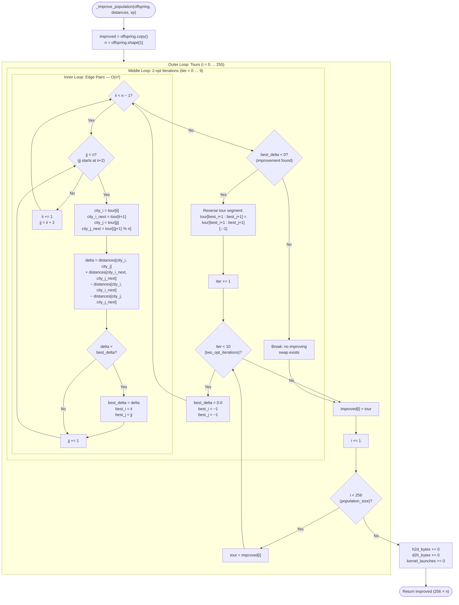

# Genetic Algorithm — CPU Variant (`GeneticAlgorithmCPU`)

## Overview

`GeneticAlgorithmCPU` is the **baseline CPU-only** implementation of a memetic algorithm
(Genetic Algorithm + 2-opt local search) for solving the Traveling Salesman Problem (TSP).
It inherits from `GeneticAlgorithmBase` using the **Template Method** design pattern and
implements the two abstract methods — `_improve_population()` and `_evaluate_population()` —
with pure **NumPy** sequential loops.

Because every GA variant (CPU, Hybrid-Naive, Hybrid-Optimized, Full-GPU) shares the
**identical** algorithm skeleton defined in the base class, this CPU variant serves as the
**ground-truth baseline** for measuring GPU speedup. The only degrees of freedom are
*where* 2-opt improvement and fitness evaluation execute: here, both run entirely on the
CPU with zero memory transfers and zero kernel launches.

| Parameter | Value | Description |
|---|---|---|
| `population_size` | 256 | μ = λ (parent and offspring size) |
| `mutation_rate` | 0.02 | Per-individual swap mutation probability |
| `tournament_size` | 5 | *k*-tournament selection pressure |
| `two_opt_iterations` | 10 | 2-opt passes per tour per generation |
| `seed` | 42 | Deterministic random seed |

**Source files:**

| File | Role |
|---|---|
| `code/src/algorithms/metaheuristics/genetic_algorithm_cpu.py` | CPU variant (this doc) |
| `code/src/algorithms/metaheuristics/genetic_algorithm_base.py` | Template Method base class |
| `code/src/algorithms/strategies/selection_strategies.py` | `TournamentSelection` |
| `code/src/algorithms/strategies/crossover_strategies.py` | `OrderCrossover` |
| `code/src/algorithms/strategies/mutation_strategies.py` | `SwapMutation` |

---

## Sequence Diagram — Complete Execution Flow

```mermaid
sequenceDiagram
    participant Client
    participant GA as GeneticAlgorithmCPU
    participant Base as GeneticAlgorithmBase
    participant TS as TournamentSelection
    participant OX as OrderCrossover
    participant SM as SwapMutation
    participant NP as NumPy

    Client->>GA: evolve(context, customers, max_generations, optimal_cost, patience)
    activate GA
    Note right of GA: Execution enters<br/>GeneticAlgorithmBase.evolve()<br/>(Template Method)

    %% ── Setup Phase ──────────────────────────────────────────
    rect rgb(230, 245, 255)
        Note over GA, NP: Setup Phase
        GA->>Base: n = len(customers)
        GA->>Base: xp = context.xp
        GA->>Base: distances = context.get_cpu_distances()
        Base-->>GA: distances: np.ndarray (n × n)

        alt patience is None
            GA->>GA: patience = int(2 × √n)
        end

        GA->>GA: Reset statistics (generation=0, h2d=0, d2h=0, kernels=0)

        Note over GA, NP: Initialize Random Population
        GA->>Base: _initialize_population(n)
        activate Base
        loop i = 0 … 255 (population_size)
            Base->>NP: rng.permutation(n)
            NP-->>Base: random tour (1 × n)
        end
        Base-->>GA: population: np.ndarray (256 × n)
        deactivate Base

        Note over GA, NP: Initial Fitness Evaluation
        GA->>GA: _evaluate_population(population, distances, xp)
        activate GA
        loop i = 0 … 255 (population_size)
            loop j = 0 … n−1 (edges)
                GA->>NP: distances[tour[j], tour[(j+1) % n]]
                NP-->>GA: edge cost
            end
            GA->>GA: costs[i] = Σ edge costs
        end
        GA-->>GA: fitness: np.ndarray (256,)
        deactivate GA

        GA->>GA: initial_best_cost = min(fitness)
        GA->>GA: best_cost_history.append(initial_best_cost)
    end

    %% ── Evolution Loop ───────────────────────────────────────
    rect rgb(255, 245, 230)
        Note over GA, NP: Evolution Loop
        loop gen = 0 … max_generations−1

            %% ── 3a. Tournament Selection ─────────────────────
            rect rgb(240, 255, 240)
                Note over GA, TS: 3a. Tournament Selection (k=5)
                GA->>Base: _select_parents(population, fitness)
                activate Base
                loop i = 0 … 255 (256 tournaments)
                    Base->>NP: rng.choice(256, size=5, replace=False)
                    NP-->>Base: tournament_indices (5 candidates)
                    Base->>NP: fitness[tournament_indices]
                    NP-->>Base: tournament_fitness
                    Base->>NP: argmin(tournament_fitness)
                    NP-->>Base: winner_local_idx
                    Base->>Base: parent_indices[i] = tournament_indices[winner]
                end
                Base-->>GA: parent_indices: np.ndarray (256,)
                deactivate Base
            end

            %% ── 3b. Crossover + Mutation ─────────────────────
            rect rgb(255, 240, 255)
                Note over GA, SM: 3b. Crossover + Mutation
                GA->>Base: _create_offspring(population, parent_indices)
                activate Base
                loop pair = 0, 2, 4, … 254 (128 pairs)
                    Base->>OX: crossover(parent1, parent2, None)
                    activate OX
                    Note right of OX: Select cut1, cut2<br/>Copy segment from parent2<br/>Fill remaining from parent1
                    OX-->>Base: child1 (1 × n)
                    deactivate OX

                    Base->>OX: crossover(parent2, parent1, None)
                    activate OX
                    OX-->>Base: child2 (1 × n)
                    deactivate OX

                    alt rng.rand() < 0.02
                        Base->>SM: mutate(child1, None)
                        activate SM
                        Note right of SM: Swap two random<br/>cities (not depot)
                        SM-->>Base: mutated child1
                        deactivate SM
                    end

                    alt rng.rand() < 0.02
                        Base->>SM: mutate(child2, None)
                        activate SM
                        SM-->>Base: mutated child2
                        deactivate SM
                    end

                    Base->>Base: offspring[pair] = child1
                    Base->>Base: offspring[pair+1] = child2
                end
                Base-->>GA: offspring: np.ndarray (256 × n)
                deactivate Base
            end

            %% ── 3c. 2-opt Improvement ───────────────────────
            rect rgb(255, 255, 230)
                Note over GA, NP: 3c. 2-opt Improvement (CPU sequential)
                GA->>GA: _improve_population(offspring, distances, xp)
                activate GA
                GA->>NP: improved = offspring.copy()
                NP-->>GA: improved (256 × n)
                loop i = 0 … 255 (population_size tours)
                    loop iter = 0 … 9 (two_opt_iterations)
                        GA->>GA: best_delta = 0.0, best_i = -1, best_j = -1
                        loop ii = 0 … n−2
                            loop jj = ii+2 … n−1
                                GA->>NP: distances[tour[ii], tour[jj]]
                                GA->>NP: distances[tour[ii+1], tour[(jj+1)%n]]
                                GA->>NP: distances[tour[ii], tour[ii+1]]
                                GA->>NP: distances[tour[jj], tour[(jj+1)%n]]
                                NP-->>GA: 4 edge costs
                                GA->>GA: delta = new_edges − old_edges
                                opt delta < best_delta
                                    GA->>GA: best_delta = delta, best_i = ii, best_j = jj
                                end
                            end
                        end
                        alt best_delta < 0 (improvement found)
                            GA->>NP: tour[best_i+1 : best_j+1] = reversed
                            NP-->>GA: segment reversed in-place
                        else no improvement
                            Note right of GA: break (exit 2-opt loop early)
                        end
                    end
                end
                GA->>GA: h2d_bytes += 0, d2h_bytes += 0, kernel_launches += 0
                GA-->>GA: improved: np.ndarray (256 × n)
                deactivate GA
            end

            %% ── 3d. Fitness Evaluation ──────────────────────
            rect rgb(230, 240, 255)
                Note over GA, NP: 3d. Fitness Evaluation (CPU sequential)
                GA->>GA: _evaluate_population(offspring_improved, distances, xp)
                activate GA
                GA->>NP: costs = np.zeros(256, dtype=float32)
                loop i = 0 … 255 (population_size)
                    loop j = 0 … n−1 (edges)
                        GA->>NP: distances[tour[j], tour[(j+1)%n]]
                        NP-->>GA: edge cost
                    end
                    GA->>GA: costs[i] = Σ edge costs
                end
                GA->>GA: h2d_bytes += 0, d2h_bytes += 0, kernel_launches += 0
                GA-->>GA: offspring_fitness: np.ndarray (256,)
                deactivate GA
            end

            %% ── 3e. Survival Selection ──────────────────────
            rect rgb(245, 240, 245)
                Note over GA, NP: 3e. (μ+λ) Survival Selection
                GA->>Base: _survival_selection(population, offspring, fitness, off_fitness)
                activate Base
                Base->>NP: combined = np.vstack([population, offspring])
                NP-->>Base: combined (512 × n)
                Base->>NP: combined_fitness = np.concatenate([pop_fitness, off_fitness])
                NP-->>Base: combined_fitness (512,)
                Base->>NP: sorted_indices = np.argsort(combined_fitness)
                NP-->>Base: sorted_indices (512,)
                Base->>NP: best_indices = sorted_indices[:256]
                Base->>NP: combined[best_indices], combined_fitness[best_indices]
                NP-->>Base: new_population (256 × n), new_fitness (256,)
                Base-->>GA: (new_population, new_fitness)
                deactivate Base
            end

            %% ── Early Stopping ──────────────────────────────
            GA->>GA: best_cost = min(fitness)
            GA->>GA: best_cost_history.append(best_cost)

            opt best_cost < best_ever_cost
                GA->>GA: best_ever_cost = best_cost
                GA->>GA: last_improvement_gen = gen
            end

            alt optimal_cost provided AND gap < 1%
                GA->>GA: stop_reason = "hit_optimal"
                Note right of GA: break
            else stagnation: gen − last_improvement_gen ≥ patience
                GA->>GA: stop_reason = "no_improvements"
                Note right of GA: break
            else continue
                opt (gen+1) % 100 == 0
                    GA->>GA: log progress (best, avg)
                end
            end
        end
    end

    %% ── Post-Evolution ───────────────────────────────────────
    rect rgb(240, 240, 240)
        Note over GA, NP: Post-Evolution — Extract Results
        GA->>NP: final_best_cost = min(fitness)
        NP-->>GA: final_best_cost
        GA->>NP: best_idx = argmin(fitness)
        NP-->>GA: best_idx
        GA->>GA: best_tour = population[best_idx]
        GA->>GA: improvement_pct = (initial − final) / initial × 100
        GA->>GA: Build stats dict
        Note right of GA: stats = {best_fitness, initial_fitness,<br/>improvement_pct, best_cost_history,<br/>h2d_bytes=0, d2h_bytes=0,<br/>kernel_launches=0,<br/>generations_completed, stop_reason}
    end

    GA-->>Client: (best_tour: np.ndarray, stats: Dict)
    deactivate GA
```

---

## Flowchart — Complete Control Flow

```mermaid
flowchart TD
    Start([Client calls evolve]) --> Setup

    subgraph Setup["Setup Phase"]
        S1[/"n = len(customers)<br/>distances = context.get_cpu_distances()<br/>xp = context.xp"/]
        S2{"patience<br/>provided?"}
        S3["patience = int(2 × √n)"]
        S4["Reset counters<br/>generation=0, h2d=0, d2h=0, kernels=0"]
        S5["Initialize population<br/>256 random permutations of n cities"]
        S6["Initial fitness evaluation<br/>_evaluate_population(population, distances, xp)"]
        S7["initial_best_cost = min(fitness)<br/>best_ever_cost = ∞<br/>last_improvement_gen = 0<br/>stop_reason = 'max_generations'"]

        S1 --> S2
        S2 -- No --> S3
        S2 -- Yes --> S4
        S3 --> S4
        S4 --> S5
        S5 --> S6
        S6 --> S7
    end

    S7 --> LoopStart

    subgraph Evolution["Evolution Loop (gen = 0 … max_generations−1)"]
        LoopStart{"gen <<br/>max_generations?"}

        subgraph Selection["3a. Tournament Selection"]
            SEL1["For each of 256 slots:<br/>Sample 5 random individuals<br/>Select lowest-cost as parent"]
            SEL2["parent_indices (256,)"]
            SEL1 --> SEL2
        end

        subgraph Crossover["3b. Crossover + Mutation"]
            CX1["For 128 parent pairs:<br/>Order Crossover (OX) → child1, child2"]
            CX2{"rand() < 0.02?"}
            CX3["Swap Mutation on child"]
            CX4["offspring (256 × n)"]
            CX1 --> CX2
            CX2 -- Yes --> CX3
            CX2 -- No --> CX4
            CX3 --> CX4
        end

        subgraph TwoOpt["3c. 2-opt Improvement (CPU)"]
            TO1["improved = offspring.copy()"]
            TO2["For each of 256 tours:<br/>Up to 10 iterations of 2-opt"]
            TO3["Find best (ii, jj) edge swap<br/>in O(n²) comparisons"]
            TO4{"best_delta < 0?"}
            TO5["Reverse tour segment<br/>tour[ii+1 : jj+1]"]
            TO6["Break early<br/>(no improvement)"]
            TO7["improved (256 × n)"]
            TO1 --> TO2
            TO2 --> TO3
            TO3 --> TO4
            TO4 -- Yes --> TO5
            TO5 --> TO2
            TO4 -- No --> TO6
            TO6 --> TO7
        end

        subgraph Fitness["3d. Fitness Evaluation (CPU)"]
            FIT1["For each of 256 tours:<br/>Sum n edge costs from distance matrix"]
            FIT2["offspring_fitness (256,)"]
            FIT1 --> FIT2
        end

        subgraph Survival["3e. (μ+λ) Survival Selection"]
            SV1["Combine parents + offspring → 512 individuals"]
            SV2["Sort by fitness (ascending cost)"]
            SV3["Keep best 256"]
            SV4["new_population (256 × n)<br/>new_fitness (256,)"]
            SV1 --> SV2
            SV2 --> SV3
            SV3 --> SV4
        end

        subgraph EarlyStop["Early Stopping Checks"]
            ES1["best_cost = min(fitness)"]
            ES2{"best_cost <<br/>best_ever_cost?"}
            ES3["Update best_ever_cost<br/>last_improvement_gen = gen"]
            ES4{"optimal_cost given<br/>AND gap < 1%?"}
            ES5["stop_reason = 'hit_optimal'"]
            ES6{"gen − last_improvement<br/>≥ patience?"}
            ES7["stop_reason = 'no_improvements'"]
            ES8{"(gen+1) % 100 == 0?"}
            ES9["Log progress"]
            ES10["Continue to next gen"]

            ES1 --> ES2
            ES2 -- Yes --> ES3
            ES2 -- No --> ES4
            ES3 --> ES4
            ES4 -- Yes --> ES5
            ES4 -- No --> ES6
            ES6 -- Yes --> ES7
            ES6 -- No --> ES8
            ES8 -- Yes --> ES9
            ES8 -- No --> ES10
        end

        LoopStart -- Yes --> SEL1
        SEL2 --> CX1
        CX4 --> TO1
        TO7 --> FIT1
        FIT2 --> SV1
        SV4 --> ES1
        ES10 --> LoopStart
    end

    LoopStart -- No --> PostEvo
    ES5 --> PostEvo
    ES7 --> PostEvo

    subgraph PostEvo["Post-Evolution"]
        PE1["final_best_cost = min(fitness)"]
        PE2["best_tour = population[argmin(fitness)]"]
        PE3["improvement_pct =<br/>(initial − final) / initial × 100"]
        PE4["Build stats dict:<br/>best_fitness, initial_fitness,<br/>improvement_pct, best_cost_history,<br/>h2d_bytes=0, d2h_bytes=0,<br/>kernel_launches=0,<br/>generations_completed, stop_reason"]
        PE1 --> PE2
        PE2 --> PE3
        PE3 --> PE4
    end

    PE4 --> Return(["Return (best_tour, stats)"])
```

---

## 2-opt Detail Flowchart — Triple-Nested Loop Structure

This flowchart details the CPU-sequential 2-opt improvement showing
exactly how the three nested loops interact.

---

## Memory and Performance Analysis

### Memory Transfer Profile

| Metric | CPU Variant | Notes |
|---|---|---|
| **Host-to-Device (H2D) bytes** | **0** | No GPU; all data stays in host RAM |
| **Device-to-Host (D2H) bytes** | **0** | No GPU |
| **Kernel launches** | **0** | Pure NumPy — no CUDA kernels |
| **GPU memory allocated** | **0** | Not applicable |

### Time Complexity per Generation

| Operation | Calls per gen | Complexity per call | Total per generation |
|---|---|---|---|
| Tournament Selection | 256 | O(k) = O(5) | **O(256 × 5) = O(1 280)** |
| Order Crossover (OX) | 128 pairs × 2 children | O(n) | **O(256 × n)** |
| Swap Mutation | ≤ 256 (rate = 0.02) | O(1) | **O(256 × 0.02) ≈ O(5)** |
| **2-opt improvement** | 256 tours | O(10 × n²) | **O(256 × 10 × n²) = O(2 560 n²)** |
| **Fitness evaluation** | 256 tours | O(n) | **O(256 × n)** |
| Survival selection | 1 | O(512 log 512) | **O(512 log 512) ≈ O(4 608)** |

> **Dominant term:** The 2-opt improvement at **O(2 560 n²)** per generation dwarfs all
> other operations and is the primary bottleneck targeted by GPU acceleration.

### Space Complexity

| Structure | Shape | Dtype | Size (for n cities) |
|---|---|---|---|
| `population` | (256, n) | int32 | 256 × n × 4 bytes |
| `offspring` | (256, n) | int32 | 256 × n × 4 bytes |
| `improved` | (256, n) | int32 | 256 × n × 4 bytes (copy) |
| `distances` | (n, n) | float64 | n² × 8 bytes |
| `fitness` | (256,) | float32 | 1 024 bytes |
| `combined` (survival) | (512, n) | int32 | 512 × n × 4 bytes (transient) |
| **Total peak** | — | — | **≈ 8 n² + 5 120 n + 1 024 bytes** ¹ |

> ¹ Peak includes the transient `combined` array during survival selection (2 048 n bytes)
> added to the three persistent population arrays (3 072 n bytes).

### Concrete Example — n = 100 cities

| Metric | Value |
|---|---|
| Distance matrix | 100 × 100 × 8 = 80 000 bytes (78 KB) |
| Population (one) | 256 × 100 × 4 = 102 400 bytes (100 KB) |
| 2-opt comparisons / gen | 256 × 10 × (99×98/2) = 256 × 10 × 4 851 ≈ **12.4 M** |
| Fitness distance lookups / gen | 256 × 100 = **25 600** |
| Memory transfers | **0 bytes** |

### Why the CPU Variant Is the Bottleneck Baseline

The sequential nature of the CPU 2-opt loop means:

1. **No parallelism across tours** — each of the 256 tours is processed one after another.
2. **No parallelism across edge pairs** — the O(n²) inner scan for the best swap is a
   single-threaded double loop.
3. **Early termination helps** — if no improving swap exists, the iteration breaks early,
   but in practice most iterations find improvements for the first several passes.
4. **Cache-friendly** — distance matrix lookups benefit from CPU cache locality, which
   partially compensates for the lack of parallelism on small problem sizes.

GPU variants accelerate specifically the 2-opt and fitness-evaluation steps by exploiting
massive parallelism across tours (and within tours for edge-pair scanning), which is why
those two operations are the abstract methods in the Template Method pattern.
