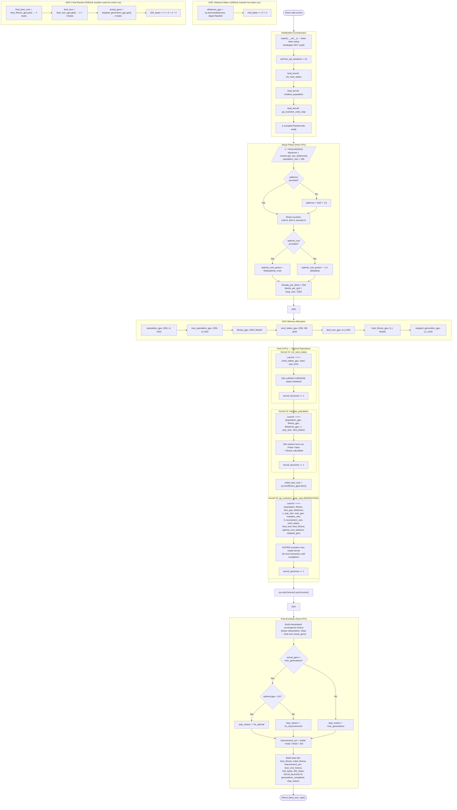
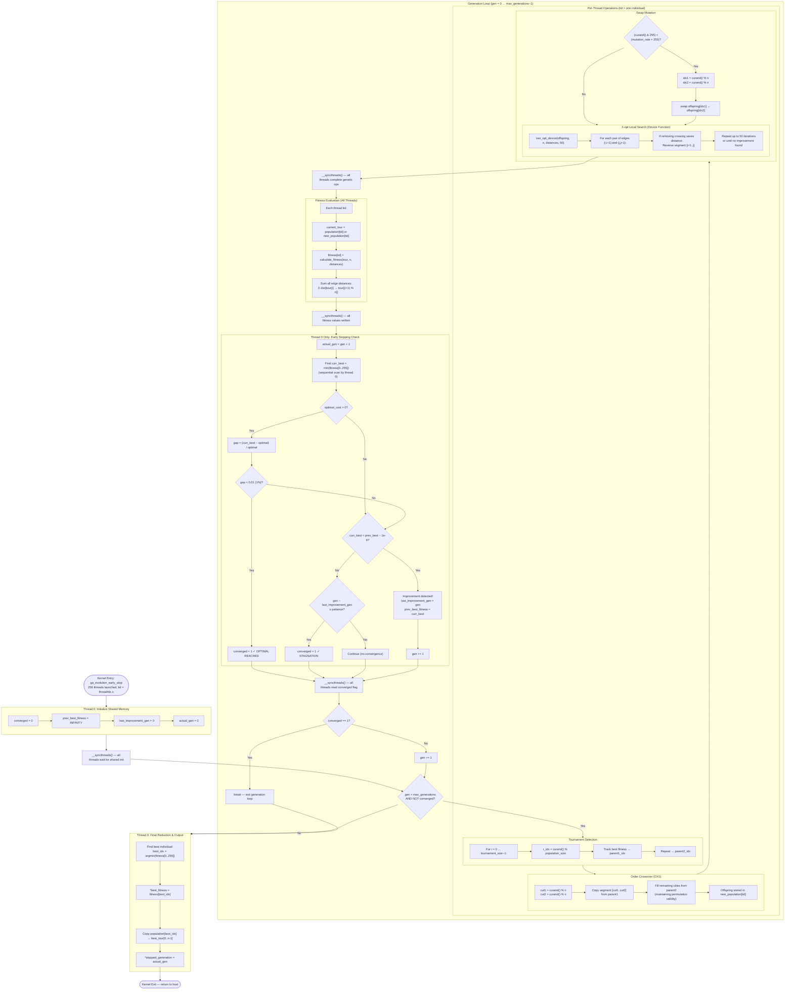
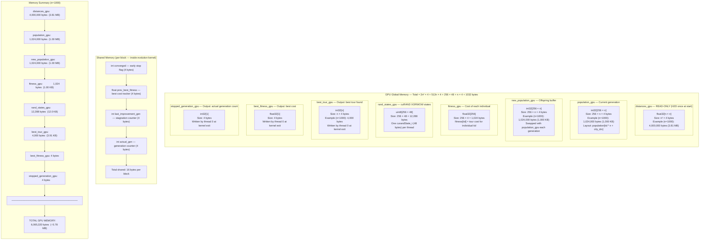

# Genetic Algorithm — Full GPU Early Stop Variant (`GeneticAlgorithmFullGPUEarlyStop`)

## Overview

`GeneticAlgorithmFullGPUEarlyStop` is the **most GPU-intensive** implementation of the
memetic algorithm (Genetic Algorithm + 2-opt local search) for solving the Traveling
Salesman Problem (TSP). Unlike the Hybrid Naive and Hybrid Optimized variants that follow
the **Template Method** pattern from `GeneticAlgorithmBase`, this variant **completely
overrides** the `evolve()` method with a monolithic GPU execution strategy based on
**Fujimoto's kernel design**.

### Why "Full GPU"?

The term *Full GPU* reflects the fact that the **entire evolutionary process** — selection,
crossover, mutation, 2-opt local search, fitness evaluation, survival selection, and early
stopping — runs inside a **single CUDA kernel** (`ga_evolution_early_stop`). The host CPU
does almost no computation: it allocates memory, launches three kernels, and collects the
final result. There is **no per-generation host–device communication**.

### The Fujimoto Monolithic Kernel Design

Traditional GPU-accelerated genetic algorithms launch separate kernels for each genetic
operator (selection, crossover, mutation, evaluation) and synchronize between them on the
host. Each kernel launch incurs ~5–10 μs of overhead, and any data that must be read by
the host requires a D2H transfer (~5–15 μs per call). For 5,000 generations with 6
operators each, this means 30,000 kernel launches and potentially thousands of PCIe
transfers.

The Fujimoto approach eliminates this by placing the **entire generational loop** inside
one persistent kernel. GPU threads synchronize with `__syncthreads()` barriers instead of
returning to the host. The result: **3 total kernel launches** regardless of the number of
generations, and **2 total PCIe transfer events** (one H2D at start, one D2H at end).

### Why Early Stopping Is Critical

Because the evolution kernel runs autonomously on the GPU without host intervention, the
host cannot inspect intermediate results to decide when to stop. The early stopping logic
must therefore be **embedded inside the kernel itself**. Thread 0 acts as a coordinator:
after each generation it checks two convergence criteria and sets a shared `converged` flag
that all threads read via `__syncthreads()`. When converged, the kernel writes the actual
generation count to `stopped_generation` so the host knows how many generations ran.

Without in-kernel early stopping, the monolithic kernel would always execute all
`max_generations` — wasting GPU cycles after convergence. The early stop mechanism turns
the monolithic design from a rigid fixed-cost execution into an **adaptive** one that
exits as soon as the solution quality plateau is reached.

### Relationship to Base Class

`GeneticAlgorithmFullGPUEarlyStop` inherits from `GeneticAlgorithmBase` but **does not use
the Template Method pattern**:

- `evolve()` is **completely overridden** — the base class `evolve()` is never called.
- `_improve_population()` returns the population unchanged (stub).
- `_evaluate_population()` returns a zero-filled array (stub).
- No CPU-side selection, crossover, mutation, or survival strategies are used.
- All genetic operators are implemented **inside the CUDA kernel** in device code.

| Parameter | Value | Description |
|---|---|---|
| `population_size` | 256 | μ = λ (parent and offspring size) |
| `mutation_rate` | 0.02 | Per-individual swap mutation probability |
| `tournament_size` | 5 | *k*-tournament selection pressure |
| `two_opt_iterations` | 50 | 2-opt passes per individual per generation (device-side) |
| `threads_per_block` | 256 | CUDA block size (= population size) |
| `elite_size` | 0 | Elitism disabled (ISO-algorithmic) |
| `seed` | 42 | Deterministic random seed |
| `optimal_gap_threshold` | 1% | Gap to optimal cost that triggers early stop |
| `patience` (default) | 2 × √n | Adaptive stagnation tolerance |

**Source files:**

| File | Role |
|---|---|
| `code/src/algorithms/metaheuristics/genetic_algorithm_full_gpu_early_stop.py` | Full GPU Early Stop variant (this doc) |
| `code/src/algorithms/metaheuristics/genetic_algorithm_base.py` | Abstract base class (stubs only) |
| `code/src/algorithms/kernels/ga_fujimoto_early_stop.cu` | CUDA kernels (init_rand, init_pop, evolution) |
| `code/src/utils/gpu_helpers.py` | `load_kernel()` — CUDA compilation via CuPy `RawKernel` |

---

## Sequence Diagram — Complete Execution Flow

```mermaid
sequenceDiagram
    participant Client
    participant FGES as FullGPUEarlyStop
    participant Base as GeneticAlgorithmBase
    participant CP as CuPy
    participant IRK as InitRandKernel
    participant IPK as InitPopKernel
    participant EK as EvolutionKernel
    participant GM as GPU_Memory

    %% ── Initialization (constructor) ────────────────────────
    Client->>FGES: __init__(population_size=256, mutation_rate=0.02, tournament_size=5, two_opt_iterations=10, seed=42)
    activate FGES
    FGES->>Base: super().__init__(population_size, mutation_rate, tournament_size, seed)
    activate Base
    Note right of Base: Base class stores parameters<br/>but strategies are NOT used<br/>(no TournamentSelection,<br/>OrderCrossover, SwapMutation)
    Base-->>FGES: base initialized
    deactivate Base

    FGES->>FGES: self.two_opt_iterations = 10

    rect rgb(255, 235, 235)
        Note over FGES, EK: Kernel Compilation Phase — THREE kernels from ga_fujimoto_early_stop.cu
        FGES->>FGES: load_kernel("ga_fujimoto_early_stop.cu", "init_rand_states", __file__)
        FGES->>CP: cp.RawKernel(source, "init_rand_states")
        activate CP
        Note right of CP: NVRTC compile kernel #1:<br/>cuRAND state initialization
        CP-->>FGES: self.init_rand_kernel
        deactivate CP

        FGES->>FGES: load_kernel("ga_fujimoto_early_stop.cu", "initialize_population", __file__)
        FGES->>CP: cp.RawKernel(source, "initialize_population")
        activate CP
        Note right of CP: NVRTC compile kernel #2:<br/>random tour generation + fitness
        CP-->>FGES: self.init_pop_kernel
        deactivate CP

        FGES->>FGES: load_kernel("ga_fujimoto_early_stop.cu", "ga_evolution_early_stop", __file__)
        FGES->>CP: cp.RawKernel(source, "ga_evolution_early_stop")
        activate CP
        Note right of CP: NVRTC compile kernel #3:<br/>MONOLITHIC evolution kernel
        CP-->>FGES: self.ga_kernel
        deactivate CP
    end
    FGES-->>Client: GeneticAlgorithmFullGPUEarlyStop instance
    deactivate FGES

    %% ── evolve() call (OVERRIDES base class entirely) ────────
    Client->>FGES: evolve(context, customers, max_generations, optimal_cost, patience)
    activate FGES
    Note right of FGES: evolve() is COMPLETELY OVERRIDDEN<br/>Base class evolve() is NEVER called<br/>No Template Method pattern used

    %% ── Setup Phase ─────────────────────────────────────────
    rect rgb(230, 245, 255)
        Note over FGES, GM: Setup Phase (Host-side)
        FGES->>FGES: n = len(customers)
        FGES->>FGES: distances = context.get_cpu_distances() → (n × n, float32)
        FGES->>FGES: population_size = self.population_size (256)
        FGES->>FGES: mutation_rate = self.mutation_rate (0.02)
        FGES->>FGES: tournament_size = self.tournament_size (5)

        alt patience is None
            FGES->>FGES: patience = int(2 × √n)
            Note right of FGES: Adaptive patience:<br/>n=100 → 20 gens<br/>n=500 → 44 gens<br/>n=1000 → 63 gens
        end

        alt optimal_cost is None
            FGES->>FGES: optimal_cost_param = -1.0 (disabled)
        else optimal_cost provided
            FGES->>FGES: optimal_cost_param = float(optimal_cost)
        end

        FGES->>FGES: Reset counters: h2d_bytes=0, d2h_bytes=0, kernel_launches=0
        FGES->>FGES: threads_per_block = 256
        FGES->>FGES: blocks_per_grid = (population_size + 255) // 256
    end

    %% ── H2D: Distance Matrix ────────────────────────────────
    rect rgb(255, 230, 230)
        Note over FGES, GM: H2D Transfer: Distance Matrix (ONCE — the only H2D transfer)
        FGES->>CP: cp.asarray(distances, dtype=float32)
        activate CP
        Note right of CP: PCIe H2D transfer<br/>n² × 4 bytes<br/>(e.g., n=1000 → 4,000,000 bytes)
        CP-->>FGES: distances_gpu (n × n, float32)
        deactivate CP
        FGES->>FGES: h2d_bytes += n² × 4
    end

    %% ── GPU Memory Allocation ────────────────────────────────
    rect rgb(245, 245, 220)
        Note over FGES, GM: GPU Memory Allocation (all arrays allocated before any kernel launch)

        FGES->>GM: population_gpu = cp.empty((256, n), dtype=int32)
        Note right of GM: 256 × n × 4 bytes<br/>(e.g., n=1000 → 1,024,000 bytes)

        FGES->>GM: new_population_gpu = cp.empty((256, n), dtype=int32)
        Note right of GM: 256 × n × 4 bytes (offspring buffer)

        FGES->>GM: fitness_gpu = cp.empty(256, dtype=float32)
        Note right of GM: 256 × 4 = 1,024 bytes

        FGES->>GM: rand_states_gpu = cp.empty((256, 48), dtype=uint8)
        Note right of GM: 256 × 48 = 12,288 bytes<br/>(cuRAND XORWOW state per thread)

        FGES->>GM: best_tour_gpu = cp.empty(n, dtype=int32)
        Note right of GM: n × 4 bytes (output)

        FGES->>GM: best_fitness_gpu = cp.empty(1, dtype=float32)
        Note right of GM: 4 bytes (output)

        FGES->>GM: stopped_generation_gpu = cp.empty(1, dtype=int32)
        Note right of GM: 4 bytes (output: actual gen count)
    end

    %% ── Kernel #1: Initialize Random States ─────────────────
    rect rgb(255, 245, 230)
        Note over FGES, IRK: Kernel Launch #1: init_rand_states
        FGES->>IRK: init_rand_states<<<(blocks_per_grid,), (256,)>>>(rand_states_gpu, seed, population_size)
        activate IRK
        Note right of IRK: 256 threads, each initializes<br/>curand_init(seed + tid, 0, 0, &states[tid])<br/>48 bytes of XORWOW state per thread
        IRK-->>FGES: rand_states_gpu initialized
        deactivate IRK
        FGES->>FGES: kernel_launches += 1
    end

    %% ── Kernel #2: Initialize Population ─────────────────────
    rect rgb(230, 255, 230)
        Note over FGES, IPK: Kernel Launch #2: initialize_population
        FGES->>IPK: initialize_population<<<(blocks_per_grid,), (256,)>>>(population_gpu, fitness_gpu, distances_gpu, n, population_size, rand_states_gpu)
        activate IPK
        Note right of IPK: Each thread (tid):<br/>1. Create sequential tour [0,1,2,...,n-1]<br/>2. Fisher-Yates shuffle using cuRAND<br/>3. calculate_fitness() → sum all edge distances<br/>4. Store tour in population_gpu[tid]<br/>5. Store cost in fitness_gpu[tid]
        IPK-->>FGES: population_gpu + fitness_gpu initialized
        deactivate IPK
        FGES->>FGES: kernel_launches += 1
    end

    %% ── D2H: Initial Best Cost ───────────────────────────────
    rect rgb(240, 230, 255)
        Note over FGES, CP: D2H: Read initial best cost (minimal transfer)
        FGES->>CP: cp.min(fitness_gpu).item()
        activate CP
        Note right of CP: GPU reduction → D2H scalar<br/>4 bytes
        CP-->>FGES: initial_best_cost (float)
        deactivate CP
    end

    %% ── Kernel #3: MONOLITHIC EVOLUTION ──────────────────────
    rect rgb(255, 200, 200)
        Note over FGES, EK: Kernel Launch #3: ga_evolution_early_stop (MONOLITHIC)
        FGES->>EK: ga_evolution_early_stop<<<(blocks_per_grid,), (256,)>>><br/>(population_gpu, fitness_gpu, new_population_gpu,<br/>distances_gpu, n, population_size, max_generations,<br/>mutation_rate, 0, tournament_size, rand_states_gpu,<br/>best_tour_gpu, best_fitness_gpu, optimal_cost_param,<br/>patience, stopped_generation_gpu)
        activate EK

        Note over EK: Entire evolution runs inside this kernel

        rect rgb(255, 220, 220)
            Note over EK: KERNEL INTERNALS — Runs autonomously on GPU
            Note over EK: Shared memory: converged, prev_best_fitness,<br/>last_improvement_gen, actual_gen
            Note over EK: Thread 0 initializes shared vars

            loop gen = 0 … max_generations−1 (ALL inside kernel)
                Note over EK: [All 256 threads] Tournament Selection<br/>→ select 2 parents from k=5 random individuals
                Note over EK: [All 256 threads] Order Crossover (OX1)<br/>→ copy segment from parent1, fill from parent2
                Note over EK: [All 256 threads] Swap Mutation<br/>→ if rand < 0.02: swap 2 random cities
                Note over EK: [All 256 threads] 2-opt Local Search<br/>→ 50 iterations of edge-pair improvement
                Note over EK: __syncthreads() — barrier
                Note over EK: [All 256 threads] Fitness Evaluation<br/>→ calculate_fitness() for new offspring
                Note over EK: __syncthreads() — barrier
                Note over EK: [Thread 0 only] Population swap (new ↔ current)
                Note over EK: [Thread 0 only] Early Stop Check:<br/>1. Optimal gap < 1%? → converged=1<br/>2. Stagnation ≥ patience? → converged=1
                Note over EK: __syncthreads() — read converged flag
                Note over EK: if (converged) break — ALL threads exit loop
            end

            Note over EK: [Thread 0] Final reduction:<br/>Find best individual across population<br/>Copy best tour → best_tour_gpu<br/>Copy best cost → best_fitness_gpu<br/>Write actual_gen → stopped_generation_gpu
        end

        EK-->>FGES: Kernel completes (all results in GPU memory)
        deactivate EK
        FGES->>FGES: kernel_launches += 1
    end

    %% ── GPU Synchronize ──────────────────────────────────────
    FGES->>CP: cp.cuda.Device().synchronize()
    Note right of CP: Ensure kernel has fully completed<br/>before reading results

    %% ── D2H: Final Results ───────────────────────────────────
    rect rgb(230, 240, 255)
        Note over FGES, CP: D2H Transfer: Final Results (the only D2H transfer)
        FGES->>CP: best_fitness_gpu.get()
        activate CP
        Note right of CP: PCIe D2H: 4 bytes (float32)
        CP-->>FGES: final_best_cost (float)
        deactivate CP

        FGES->>CP: best_tour_gpu.get()
        activate CP
        Note right of CP: PCIe D2H: n × 4 bytes (int32)<br/>(e.g., n=1000 → 4,000 bytes)
        CP-->>FGES: best_tour (np.ndarray, shape=(n,))
        deactivate CP

        FGES->>CP: stopped_generation_gpu.get()
        activate CP
        Note right of CP: PCIe D2H: 4 bytes (int32)
        CP-->>FGES: actual_generations (int)
        deactivate CP

        FGES->>FGES: d2h_bytes += n × 4 + 4 + 4
    end

    %% ── Post-Evolution (Host-side) ───────────────────────────
    rect rgb(240, 240, 240)
        Note over FGES, CP: Post-Evolution — Build Results (Host-side)

        Note over FGES: Build INTERPOLATED convergence history
        FGES->>FGES: for gen = 1 … actual_generations:<br/>  interpolated = initial_best − (initial_best − final_best) × gen / actual_gen<br/>  best_cost_history.append(interpolated)
        Note right of FGES: Linear interpolation only!<br/>Kernel does not report<br/>per-generation data

        alt actual_generations < max_generations AND optimal_cost given AND gap < 1%
            FGES->>FGES: stop_reason = "hit_optimal"
        else actual_generations < max_generations (stagnation)
            FGES->>FGES: stop_reason = "no_improvements"
        else actual_generations == max_generations
            FGES->>FGES: stop_reason = "max_generations"
        end

        FGES->>FGES: improvement_pct = (initial − final) / initial × 100
        FGES->>FGES: Build stats dict
        Note right of FGES: stats = {<br/>  best_fitness, initial_fitness,<br/>  improvement_pct, best_cost_history,<br/>  h2d_bytes, d2h_bytes,<br/>  kernel_launches=3,<br/>  generations_completed=actual_generations,<br/>  stop_reason<br/>}
    end

    FGES-->>Client: (best_tour: np.ndarray, stats: Dict)
    deactivate FGES
```



---

## Flowchart — Complete Control Flow



---

## GPU Kernel Internal Flowchart — `ga_evolution_early_stop`

This diagram details what happens **inside** the monolithic evolution kernel. Once launched,
this kernel runs autonomously on the GPU with no host interaction until it completes.



---

## Memory Layout Diagram — GPU Memory Allocation



### Memory Formula

```
GPU_memory(n) = n² × 4                     (distance matrix)
              + 256 × n × 4                (population)
              + 256 × n × 4                (new population)
              + 256 × 4                    (fitness)
              + 256 × 48                   (cuRAND states)
              + n × 4                      (best tour output)
              + 4                          (best fitness output)
              + 4                          (stopped generation output)

Simplified:  = 4n² + 2048n + 13,320 bytes
```

| Problem Size (n) | GPU Memory | Notes |
|---|---|---|
| 100 | ~244 KB | Trivially small |
| 500 | ~1.98 MB | Easily fits any GPU |
| 1,000 | ~5.78 MB | Minimal GPU footprint |
| 2,000 | ~20.1 MB | Well within budget |
| 5,000 | ~110 MB | Comfortably fits modern GPUs |
| 10,000 | ~419 MB | Approaches mid-range GPU limits |

---

## Performance Analysis

### Transfer Profile — Entire Run (NOT per Generation)

The defining characteristic of the Full GPU variant is that **all transfers happen at the
boundary**, not during evolution. The kernel runs autonomously for the entire evolution.

| Metric | Formula | Value (n=1,000) | Notes |
|---|---|---|---|
| **H2D: Distance matrix** | n² × 4 bytes | 4,000,000 bytes (3.81 MB) | **Once for entire run** |
| **D2H: Best tour** | n × 4 bytes | 4,000 bytes (3.91 KB) | **Once at end** |
| **D2H: Best fitness** | 4 bytes | 4 bytes | Once at end |
| **D2H: Stopped generation** | 4 bytes | 4 bytes | Once at end |
| **D2H: Initial best cost** | 4 bytes | 4 bytes | After init kernel (scalar) |
| **Total H2D (entire run)** | n² × 4 | 4,000,000 bytes (3.81 MB) | **1 transfer** |
| **Total D2H (entire run)** | n × 4 + 12 | 4,012 bytes (~3.92 KB) | **1 transfer event** |
| **Total bytes transferred** | n² × 4 + n × 4 + 12 | ~4,004,012 bytes (~3.82 MB) | **For the ENTIRE run** |
| **Kernel launches (entire run)** | 3 | **3** | Regardless of generations |

### Kernel Launch Summary

| Kernel | Count | Grid | Block | Purpose |
|---|---|---|---|---|
| `init_rand_states` | **1** | (⌈256/256⌉,) = (1,) | (256,) | Initialize 256 cuRAND states |
| `initialize_population` | **1** | (1,) | (256,) | Generate 256 random tours + fitness |
| `ga_evolution_early_stop` | **1** | (1,) | (256,) | **ALL generations** — selection, crossover, mutation, 2-opt, fitness, survival, early stop |
| **Total** | **3** | — | — | Fixed regardless of max_generations |

### Transfer Overhead (Entire Run)

| Overhead Source | Count | Latency Each | Total |
|---|---|---|---|
| H2D transfers | 1 | ~10 μs | ~10 μs |
| D2H transfers | 1 | ~10 μs | ~10 μs |
| Kernel launches | 3 | ~7 μs | ~21 μs |
| **Total fixed overhead** | — | — | **~41 μs for entire run** |

### Comparison with Other Variants

| Metric | Hybrid Naive (G gens) | Hybrid Optimized (G gens) | Full GPU Early Stop |
|---|---|---|---|
| **Kernel launches** | 2,560 × G | 11 × G | **3** (total) |
| **H2D transfers** | 257 × G | 1 × G + 1 | **1** (total) |
| **D2H transfers** | 256 × G | 2 × G | **1** (total) |
| **Total transfers** | 513 × G | 3 × G + 1 | **2** (total) |
| **H2D bytes (entire run)** | (n²×4 + 256×n×4) × G | 256×n×4 × G + n²×4 | **n² × 4** |
| **D2H bytes (entire run)** | 256×n×4 × G | (256×4 + 256×n×4) × G | **n × 4 + 12** |
| **Transfer overhead** | ~23 ms × G | ~107 μs × G | **~41 μs total** |
| **Selection/crossover/mutation** | CPU (Python) | CPU (Python) | **GPU (CUDA C)** |
| **Fitness evaluation** | CPU (Python) | GPU (cached) | **GPU (in-kernel)** |
| **2-opt improvement** | GPU (individual) | GPU (batch) | **GPU (in-kernel)** |
| **Convergence check** | CPU (per gen) | CPU (per gen) | **GPU (thread 0)** |
| **Convergence history** | Exact (per gen) | Exact (per gen) | **Interpolated** (approx.) |

### Transfer Reduction vs. Naive Variant (G = 500 generations, n = 1,000)

```
Naive:     513 × 500 = 256,500 PCIe transfers     Full GPU: 2 transfers
           2,560 × 500 = 1,280,000 kernel launches            3 kernel launches

Transfer reduction:  256,500 / 2 = 128,250× fewer transfers
Kernel reduction:    1,280,000 / 3 = 426,667× fewer launches

Transfer overhead:
  Naive:    256,500 × ~10 μs = ~2.57 seconds
  Full GPU: 2 × ~10 μs       = ~20 μs

Launch overhead:
  Naive:    1,280,000 × ~7 μs = ~8.96 seconds
  Full GPU: 3 × ~7 μs         = ~21 μs

Total fixed overhead:
  Naive:    ~11.5 seconds
  Full GPU: ~41 μs

Overhead reduction: ~11.5s / ~41μs ≈ 280,000× less overhead
```

### Transfer Reduction vs. Optimized Variant (G = 500 generations, n = 1,000)

```
Optimized: 3 × 500 + 1 = 1,501 PCIe transfers    Full GPU: 2 transfers
           11 × 500 = 5,500 kernel launches                  3 kernel launches

Transfer reduction:  1,501 / 2 = 750× fewer transfers
Kernel reduction:    5,500 / 3 = 1,833× fewer launches

Transfer overhead:
  Optimized: 1,501 × ~10 μs = ~15 ms
  Full GPU:  2 × ~10 μs     = ~20 μs

Launch overhead:
  Optimized: 5,500 × ~7 μs = ~38.5 ms
  Full GPU:  3 × ~7 μs     = ~21 μs

Total fixed overhead:
  Optimized: ~53.5 ms
  Full GPU:  ~41 μs

Overhead reduction: ~53.5ms / ~41μs ≈ 1,305× less overhead
```

### Concrete Example — n = 1,000 cities, max_generations = 5,000, early stop at gen 500

| Metric | Hybrid Naive | Hybrid Optimized | Full GPU Early Stop |
|---|---|---|---|
| Generations executed | 500 | 500 | 500 |
| Kernel launches | 1,280,000 | 5,500 | **3** |
| H2D transfers | 128,500 | 501 | **1** |
| D2H transfers | 128,000 | 1,000 | **1** |
| Total PCIe transfers | 256,500 | 1,501 | **2** |
| H2D bytes | ~2.39 GB | ~488 MB | **3.81 MB** |
| D2H bytes | ~488 MB | ~489 MB | **~3.92 KB** |
| Total bytes transferred | ~2.87 GB | ~977 MB | **~3.82 MB** |
| Transfer overhead | ~2.57 s | ~15 ms | **~20 μs** |
| Launch overhead | ~8.96 s | ~38.5 ms | **~21 μs** |
| **Total fixed overhead** | **~11.5 s** | **~53.5 ms** | **~41 μs** |

### Time Complexity per Generation (Inside Kernel)

| Operation | Threads | Complexity per Thread | Effective Complexity |
|---|---|---|---|
| Tournament Selection | 256 | O(k) = O(5) | **O(5)** GPU-parallel |
| Order Crossover (OX1) | 256 | O(n) | **O(n)** GPU-parallel |
| Swap Mutation | 256 | O(1) | **O(1)** GPU-parallel |
| 2-opt Local Search | 256 | O(50 × n²) worst case | **O(50 × n²)** GPU-parallel |
| Fitness Evaluation | 256 | O(n) | **O(n)** GPU-parallel |
| Early Stop Check | 1 (thread 0) | O(256) scan | **O(256)** sequential |
| `__syncthreads()` barriers | 256 | O(1) | 3 barriers per generation |

### Trade-offs

| Advantage | Disadvantage |
|---|---|
| **Minimal overhead**: 3 kernel launches, 2 PCIe transfers total | **No exact convergence history**: only interpolated |
| **Maximum GPU utilization**: all operations on GPU | **No per-generation host logging**: cannot inspect intermediate state |
| **Adaptive early stopping**: in-kernel convergence detection | **Fixed population size**: must match CUDA block size (256) |
| **Lowest transfer volume**: only distance matrix in, tour out | **Single-block execution**: limited to 256 individuals |
| **All genetic operators in CUDA C**: faster than Python | **Debug difficulty**: entire evolution is opaque to host |
| **Scales with GPU clock, not PCIe bandwidth** | **Stack arrays limited**: 2048 max cities (kernel `#define`) |

### Convergence History — Interpolation Limitation

Because the monolithic kernel does not report per-generation fitness data, the convergence
history is approximated via linear interpolation:

```
For gen = 1 … actual_generations:
    history[gen] = initial_best − (initial_best − final_best) × gen / actual_generations
```

This produces a straight line from `initial_best_cost` to `final_best_cost`, which does
**not** capture the typical rapid-improvement-then-plateau curve of actual GA convergence.
The history is useful for approximate progress tracking but should not be used for detailed
convergence analysis.

```
Actual convergence (typical GA):          Interpolated (Full GPU):
Cost ▲                                    Cost ▲
     │╲                                        │╲
     │  ╲                                      │  ╲
     │    ╲╲                                   │    ╲
     │      ╲╲╲                                │      ╲
     │         ╲╲╲╲                            │        ╲
     │             ╲╲╲╲╲╲____                  │          ╲
     │                       ╲___──            │            ╲
     └─────────────────────────── gen          └────────────── gen
     Rapid early improvement                   Straight line (approximation)
     then plateau                              from initial to final
```
