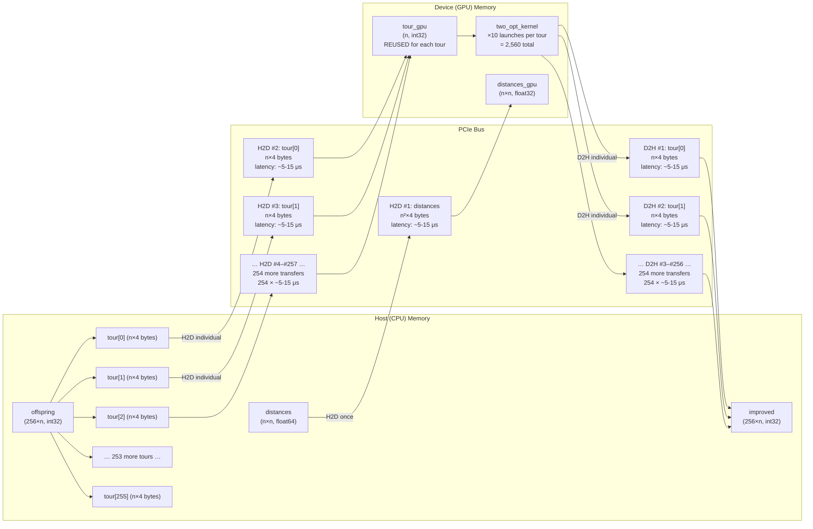
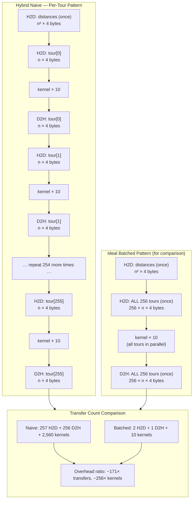

# Genetic Algorithm — Hybrid Naive Variant (`GeneticAlgorithmHybridNaive`)

## Overview

`GeneticAlgorithmHybridNaive` is the **first GPU-accelerated** implementation of the memetic
algorithm (Genetic Algorithm + 2-opt local search) for solving the Traveling Salesman Problem
(TSP). It inherits from `GeneticAlgorithmBase` using the **Template Method** design pattern
and implements the two abstract methods — `_improve_population()` and `_evaluate_population()`
— with a **naively parallelized** GPU strategy that processes each tour **individually**.

### Why "Naive"?

The term *naive* refers to the **individual tour transfer bottleneck**. Instead of batching
all 256 tours into a single Host-to-Device (H2D) transfer and launching one kernel for the
entire population, this variant:

1. **Transfers each tour individually** — 256 separate `cp.asarray()` calls per generation.
2. **Launches 10 kernel invocations per tour** — one per 2-opt iteration, yielding
   256 × 10 = **2,560 kernel launches** per generation.
3. **Transfers each improved tour back individually** — 256 separate `.get()` (D2H) calls.

This pattern **maximizes PCIe bus overhead**: each transfer incurs a fixed latency cost
(~5–15 μs) regardless of payload size, so 256 small transfers are far more expensive than
one large transfer carrying the same total bytes. The kernel launch overhead (~5–10 μs each)
further compounds the problem, as 2,560 launches per generation dominate wall-clock time on
small-to-medium problem sizes.

Despite using GPU hardware for the computationally expensive 2-opt improvement, the Hybrid
Naive variant often performs **worse than the pure CPU variant** on small instances (n < 200)
because the transfer and launch overhead exceeds the GPU compute savings.

| Parameter | Value | Description |
|---|---|---|
| `population_size` | 256 | μ = λ (parent and offspring size) |
| `mutation_rate` | 0.02 | Per-individual swap mutation probability |
| `tournament_size` | 5 | *k*-tournament selection pressure |
| `two_opt_iterations` | 10 | 2-opt passes per tour per generation |
| `seed` | 42 | Deterministic random seed |

**Source files:**

| File | Role |
|---|---|
| `code/src/algorithms/metaheuristics/genetic_algorithm_hybrid_naive.py` | Hybrid Naive variant (this doc) |
| `code/src/algorithms/metaheuristics/genetic_algorithm_base.py` | Template Method base class |
| `code/src/algorithms/kernels/two_opt_single.cu` | CUDA kernel for single-tour 2-opt |
| `code/src/algorithms/strategies/selection_strategies.py` | `TournamentSelection` |
| `code/src/algorithms/strategies/crossover_strategies.py` | `OrderCrossover` |
| `code/src/algorithms/strategies/mutation_strategies.py` | `SwapMutation` |

---

## Sequence Diagram — Complete Execution Flow

```mermaid
sequenceDiagram
    participant Client
    participant HN as HybridNaive
    participant Base as GeneticAlgorithmBase
    participant TS as TournamentSelection
    participant OX as OrderCrossover
    participant SM as SwapMutation
    participant CP as CuPy
    participant GK as GPU_Kernel
    participant NP as NumPy

    %% ── Initialization (constructor) ────────────────────────
    Client->>HN: __init__(*args, **kwargs)
    activate HN
    HN->>Base: super().__init__(*args, **kwargs)
    activate Base
    Base->>TS: TournamentSelection(k=5)
    Base->>OX: OrderCrossover()
    Base->>SM: SwapMutation()
    Base-->>HN: base initialized
    deactivate Base

    rect rgb(255, 235, 235)
        Note over HN, GK: Kernel Compilation Phase
        HN->>HN: _compile_kernel()
        HN->>HN: kernel_path = Path("kernels/two_opt_single.cu")
        HN->>HN: open(kernel_path, "r").read()
        Note right of HN: Load raw CUDA C source<br/>from .cu file
        HN->>CP: cp.RawKernel(kernel_source, "two_opt_kernel")
        activate CP
        Note right of CP: Compile CUDA kernel<br/>via NVRTC (runtime compilation)
        CP-->>HN: self.two_opt_kernel (compiled RawKernel)
        deactivate CP
    end
    HN-->>Client: GeneticAlgorithmHybridNaive instance
    deactivate HN

    %% ── evolve() call ───────────────────────────────────────
    Client->>HN: evolve(context, customers, max_generations, optimal_cost, patience)
    activate HN
    Note right of HN: Execution enters<br/>GeneticAlgorithmBase.evolve()<br/>(Template Method)

    %% ── Setup Phase ─────────────────────────────────────────
    rect rgb(230, 245, 255)
        Note over HN, NP: Setup Phase
        HN->>Base: n = len(customers)
        HN->>Base: xp = context.xp
        HN->>Base: distances = context.get_cpu_distances()
        Base-->>HN: distances: np.ndarray (n × n, float64)

        alt patience is None
            HN->>HN: patience = int(2 × √n)
        end

        HN->>HN: Reset statistics (generation=0, h2d=0, d2h=0, kernels=0)

        Note over HN, NP: Initialize Random Population
        HN->>Base: _initialize_population(n)
        activate Base
        loop i = 0 … 255 (population_size)
            Base->>NP: rng.permutation(n)
            NP-->>Base: random tour (1 × n)
        end
        Base-->>HN: population: np.ndarray (256 × n)
        deactivate Base

        Note over HN, NP: Initial Fitness Evaluation
        HN->>HN: _evaluate_population(population, distances, xp)
        activate HN
        loop i = 0 … 255 (population_size)
            loop j = 0 … n−1 (edges)
                HN->>NP: distances[tour[j], tour[(j+1) % n]]
                NP-->>HN: edge cost
            end
            HN->>HN: costs[i] = Σ edge costs
        end
        HN-->>HN: fitness: np.ndarray (256,)
        deactivate HN

        HN->>HN: initial_best_cost = min(fitness)
        HN->>HN: best_cost_history.append(initial_best_cost)
    end

    %% ── Evolution Loop ──────────────────────────────────────
    rect rgb(255, 245, 230)
        Note over HN, NP: Evolution Loop
        loop gen = 0 … max_generations−1

            %% ── 3a. Tournament Selection ────────────────────
            rect rgb(240, 255, 240)
                Note over HN, TS: 3a. Tournament Selection (k=5)
                HN->>Base: _select_parents(population, fitness)
                activate Base
                loop i = 0 … 255 (256 tournaments)
                    Base->>NP: rng.choice(256, size=5, replace=False)
                    NP-->>Base: tournament_indices (5 candidates)
                    Base->>NP: fitness[tournament_indices]
                    NP-->>Base: tournament_fitness
                    Base->>NP: argmin(tournament_fitness)
                    NP-->>Base: winner_local_idx
                    Base->>Base: parent_indices[i] = tournament_indices[winner]
                end
                Base-->>HN: parent_indices: np.ndarray (256,)
                deactivate Base
            end

            %% ── 3b. Crossover + Mutation ────────────────────
            rect rgb(255, 240, 255)
                Note over HN, SM: 3b. Crossover + Mutation
                HN->>Base: _create_offspring(population, parent_indices)
                activate Base
                loop pair = 0, 2, 4, … 254 (128 pairs)
                    Base->>OX: crossover(parent1, parent2, None)
                    activate OX
                    Note right of OX: Select cut1, cut2<br/>Copy segment from parent2<br/>Fill remaining from parent1
                    OX-->>Base: child1 (1 × n)
                    deactivate OX

                    Base->>OX: crossover(parent2, parent1, None)
                    activate OX
                    OX-->>Base: child2 (1 × n)
                    deactivate OX

                    alt rng.rand() < 0.02
                        Base->>SM: mutate(child1, None)
                        activate SM
                        Note right of SM: Swap two random<br/>cities (not depot)
                        SM-->>Base: mutated child1
                        deactivate SM
                    end

                    alt rng.rand() < 0.02
                        Base->>SM: mutate(child2, None)
                        activate SM
                        SM-->>Base: mutated child2
                        deactivate SM
                    end

                    Base->>Base: offspring[pair] = child1
                    Base->>Base: offspring[pair+1] = child2
                end
                Base-->>HN: offspring: np.ndarray (256 × n)
                deactivate Base
            end

            %% ── 3c. 2-opt Improvement (GPU — NAIVE) ────────
            rect rgb(255, 230, 230)
                Note over HN, GK: 3c. 2-opt Improvement (GPU — Naive Individual Processing)
                HN->>HN: _improve_population(offspring, distances, xp)
                activate HN
                HN->>NP: improved = np.zeros_like(offspring)
                NP-->>HN: improved (256 × n)

                Note over HN, CP: H2D: Distance matrix (ONCE per generation)
                HN->>CP: cp.asarray(distances, dtype=float32)
                activate CP
                Note right of CP: PCIe H2D transfer<br/>n² × 4 bytes
                CP-->>HN: distances_gpu (n × n, float32)
                deactivate CP
                HN->>HN: h2d_bytes += distances.nbytes

                HN->>HN: threads = min(256, n − 2)
                HN->>HN: shared_mem = threads×4 + threads×4 + threads×4 + n×4

                loop i = 0 … 255 (256 tours — INDIVIDUAL processing)
                    HN->>NP: tour_np = offspring[i]
                    NP-->>HN: tour_np (1 × n, int32)

                    Note over HN, CP: H2D: Single tour transfer
                    HN->>CP: cp.asarray(tour_np, dtype=int32)
                    activate CP
                    Note right of CP: PCIe H2D transfer<br/>n × 4 bytes (one tour)
                    CP-->>HN: tour_gpu (1 × n, int32)
                    deactivate CP
                    HN->>HN: h2d_bytes += n × 4

                    loop iter = 0 … 9 (10 two_opt_iterations)
                        HN->>GK: two_opt_kernel(grid=(1,), block=(threads,), args=(tour_gpu, distances_gpu, n, 0), shared_mem=shared_mem)
                        activate GK
                        Note right of GK: GPU: Parallel edge-pair scan<br/>Find best 2-opt swap<br/>Apply reversal in-place
                        GK-->>HN: tour_gpu modified in-place
                        deactivate GK
                        HN->>HN: kernel_launches += 1
                    end

                    Note over HN, CP: D2H: Retrieve improved tour
                    HN->>CP: tour_gpu.get()
                    activate CP
                    Note right of CP: PCIe D2H transfer<br/>n × 4 bytes (one tour)
                    CP-->>HN: improved_tour_np (1 × n)
                    deactivate CP
                    HN->>HN: d2h_bytes += n × 4

                    HN->>HN: improved[i] = improved_tour_np
                end

                Note over HN, GK: Per generation totals:<br/>kernel_launches += 2,560<br/>H2D: n²×4 + 256×n×4 bytes<br/>D2H: 256×n×4 bytes
                HN-->>HN: improved: np.ndarray (256 × n)
                deactivate HN
            end

            %% ── 3d. Fitness Evaluation (CPU) ────────────────
            rect rgb(230, 240, 255)
                Note over HN, NP: 3d. Fitness Evaluation (CPU sequential)
                HN->>HN: _evaluate_population(improved, distances, xp)
                activate HN
                HN->>NP: costs = np.zeros(256, dtype=float64)
                loop i = 0 … 255 (population_size)
                    loop j = 0 … n−1 (edges)
                        HN->>NP: distances[tour[j], tour[(j+1) % n]]
                        NP-->>HN: edge cost
                    end
                    HN->>HN: costs[i] = Σ edge costs
                end
                Note right of HN: No additional GPU transfers<br/>(tours already on CPU from D2H)
                HN-->>HN: offspring_fitness: np.ndarray (256,)
                deactivate HN
            end

            %% ── 3e. Survival Selection ──────────────────────
            rect rgb(245, 240, 245)
                Note over HN, NP: 3e. (μ+λ) Survival Selection
                HN->>Base: _survival_selection(population, offspring, fitness, off_fitness)
                activate Base
                Base->>NP: combined = np.vstack([population, offspring])
                NP-->>Base: combined (512 × n)
                Base->>NP: combined_fitness = np.concatenate([pop_fitness, off_fitness])
                NP-->>Base: combined_fitness (512,)
                Base->>NP: sorted_indices = np.argsort(combined_fitness)
                NP-->>Base: sorted_indices (512,)
                Base->>NP: best_indices = sorted_indices[:256]
                Base->>NP: combined[best_indices], combined_fitness[best_indices]
                NP-->>Base: new_population (256 × n), new_fitness (256,)
                Base-->>HN: (new_population, new_fitness)
                deactivate Base
            end

            %% ── Early Stopping ──────────────────────────────
            HN->>HN: best_cost = min(fitness)
            HN->>HN: best_cost_history.append(best_cost)

            opt best_cost < best_ever_cost
                HN->>HN: best_ever_cost = best_cost
                HN->>HN: last_improvement_gen = gen
            end

            alt optimal_cost provided AND gap < 1%
                HN->>HN: stop_reason = "hit_optimal"
                Note right of HN: break
            else stagnation: gen − last_improvement_gen ≥ patience
                HN->>HN: stop_reason = "no_improvements"
                Note right of HN: break
            else continue
                opt (gen+1) % 100 == 0
                    HN->>HN: log progress (best, avg, kernel_launches)
                end
            end
        end
    end

    %% ── Post-Evolution ──────────────────────────────────────
    rect rgb(240, 240, 240)
        Note over HN, NP: Post-Evolution — Extract Results
        HN->>NP: final_best_cost = min(fitness)
        NP-->>HN: final_best_cost
        HN->>NP: best_idx = argmin(fitness)
        NP-->>HN: best_idx
        HN->>HN: best_tour = population[best_idx]
        HN->>HN: improvement_pct = (initial − final) / initial × 100
        HN->>HN: Build stats dict
        Note right of HN: stats = {best_fitness, initial_fitness,<br/>improvement_pct, best_cost_history,<br/>h2d_bytes, d2h_bytes,<br/>kernel_launches=2560×G,<br/>generations_completed, stop_reason}
    end

    HN-->>Client: (best_tour: np.ndarray, stats: Dict)
    deactivate HN
```



---

## Flowchart — Complete Control Flow

```mermaid
flowchart TD
    Start([Client calls evolve]) --> Init

    subgraph Init["Initialization (Constructor)"]
        I1["super().__init__() — base class setup"]
        I2["_compile_kernel()"]
        I3["Load two_opt_single.cu from disk"]
        I4["cp.RawKernel(source, 'two_opt_kernel')"]
        I5["self.two_opt_kernel ready"]
        I1 --> I2
        I2 --> I3
        I3 --> I4
        I4 --> I5
    end

    I5 --> Setup

    subgraph Setup["Setup Phase"]
        S1[/"n = len(customers)<br/>distances = context.get_cpu_distances()<br/>xp = context.xp"/]
        S2{"patience<br/>provided?"}
        S3["patience = int(2 × √n)"]
        S4["Reset counters<br/>generation=0, h2d=0, d2h=0, kernels=0"]
        S5["Initialize population<br/>256 random permutations of n cities"]
        S6["Initial fitness evaluation<br/>_evaluate_population on CPU"]
        S7["initial_best_cost = min(fitness)<br/>best_ever_cost = ∞<br/>last_improvement_gen = 0<br/>stop_reason = 'max_generations'"]

        S1 --> S2
        S2 -- No --> S3
        S2 -- Yes --> S4
        S3 --> S4
        S4 --> S5
        S5 --> S6
        S6 --> S7
    end

    S7 --> LoopStart

    subgraph Evolution["Evolution Loop (gen = 0 … max_generations−1)"]
        LoopStart{"gen <<br/>max_generations?"}

        subgraph Selection["3a. Tournament Selection (CPU)"]
            SEL1["For each of 256 slots:<br/>Sample 5 random individuals<br/>Select lowest-cost as parent"]
            SEL2["parent_indices (256,)"]
            SEL1 --> SEL2
        end

        subgraph Crossover["3b. Crossover + Mutation (CPU)"]
            CX1["For 128 parent pairs:<br/>Order Crossover (OX) → child1, child2"]
            CX2{"rand() < 0.02?"}
            CX3["Swap Mutation on child"]
            CX4["offspring (256 × n)"]
            CX1 --> CX2
            CX2 -- Yes --> CX3
            CX2 -- No --> CX4
            CX3 --> CX4
        end

        subgraph GPU_Ops["3c. 2-opt Improvement (GPU — Naive)"]
            direction TB
            TO0["improved = np.zeros_like(offspring)"]

            subgraph H2D_Dist["H2D: Distance Matrix (once)"]
                HD1["distances_gpu = cp.asarray(distances)"]
                HD2["h2d_bytes += n² × 4"]
                HD1 --> HD2
            end

            TO1["threads = min(256, n − 2)<br/>Compute shared_mem size"]

            subgraph TourLoop["Individual Tour Loop (i = 0 … 255)"]
                TL_Check{"i < 256?"}

                subgraph H2D_Tour["H2D: Single Tour"]
                    HT1["tour_gpu = cp.asarray(offspring[i])"]
                    HT2["h2d_bytes += n × 4"]
                    HT1 --> HT2
                end

                subgraph KernelLoop["Kernel Iterations (iter = 0 … 9)"]
                    KL_Check{"iter < 10?"}
                    KL_Launch["two_opt_kernel<br/>grid=(1,), block=(threads,)<br/>Parallel edge scan + reversal"]
                    KL_Count["kernel_launches += 1"]
                    KL_Next["iter += 1"]
                    KL_Check -- Yes --> KL_Launch
                    KL_Launch --> KL_Count
                    KL_Count --> KL_Next
                    KL_Next --> KL_Check
                end

                subgraph D2H_Tour["D2H: Improved Tour"]
                    DT1["improved[i] = tour_gpu.get()"]
                    DT2["d2h_bytes += n × 4"]
                    DT1 --> DT2
                end

                TL_Next["i += 1"]

                TL_Check -- Yes --> HT1
                HT2 --> KL_Check
                KL_Check -- No --> DT1
                DT2 --> TL_Next
                TL_Next --> TL_Check
            end

            TO0 --> HD1
            HD2 --> TO1
            TO1 --> TL_Check
        end

        subgraph CPU_Ops["3d. Fitness Evaluation (CPU)"]
            FIT1["For each of 256 tours:<br/>Sum n edge costs from distance matrix<br/>(tours already on CPU from D2H)"]
            FIT2["offspring_fitness (256,)"]
            FIT1 --> FIT2
        end

        subgraph Survival["3e. (μ+λ) Survival Selection"]
            SV1["Combine parents + offspring → 512 individuals"]
            SV2["Sort by fitness (ascending cost)"]
            SV3["Keep best 256"]
            SV4["new_population (256 × n)<br/>new_fitness (256,)"]
            SV1 --> SV2
            SV2 --> SV3
            SV3 --> SV4
        end

        subgraph EarlyStop["Early Stopping Checks"]
            ES1["best_cost = min(fitness)"]
            ES2{"best_cost <<br/>best_ever_cost?"}
            ES3["Update best_ever_cost<br/>last_improvement_gen = gen"]
            ES4{"optimal_cost given<br/>AND gap < 1%?"}
            ES5["stop_reason = 'hit_optimal'"]
            ES6{"gen − last_improvement<br/>≥ patience?"}
            ES7["stop_reason = 'no_improvements'"]
            ES8{"(gen+1) % 100 == 0?"}
            ES9["Log progress"]
            ES10["Continue to next gen"]

            ES1 --> ES2
            ES2 -- Yes --> ES3
            ES2 -- No --> ES4
            ES3 --> ES4
            ES4 -- Yes --> ES5
            ES4 -- No --> ES6
            ES6 -- Yes --> ES7
            ES6 -- No --> ES8
            ES8 -- Yes --> ES9
            ES8 -- No --> ES10
        end

        LoopStart -- Yes --> SEL1
        SEL2 --> CX1
        CX4 --> TO0
        TL_Check -- No --> FIT1
        FIT2 --> SV1
        SV4 --> ES1
        ES10 --> LoopStart
    end

    LoopStart -- No --> PostEvo
    ES5 --> PostEvo
    ES7 --> PostEvo

    subgraph PostEvo["Post-Evolution"]
        PE1["final_best_cost = min(fitness)"]
        PE2["best_tour = population[argmin(fitness)]"]
        PE3["improvement_pct =<br/>(initial − final) / initial × 100"]
        PE4["Build stats dict:<br/>best_fitness, initial_fitness,<br/>improvement_pct, best_cost_history,<br/>h2d_bytes, d2h_bytes,<br/>kernel_launches, stop_reason"]
        PE1 --> PE2
        PE2 --> PE3
        PE3 --> PE4
    end

    PE4 --> Return(["Return (best_tour, stats)"])
```



---

## Memory Transfer Flowchart — PCIe Bus Transfer Pattern

This diagram details **why** the Hybrid Naive variant is inefficient by visualizing the
per-tour PCIe transfer pattern compared to the ideal batched approach.



### Transfer Overhead Breakdown

The core inefficiency is the **fixed latency per transfer**. Each PCIe transfer has:

- **Setup overhead**: ~5–15 μs for DMA engine programming, TLB shootdown, etc.
- **Payload transfer**: proportional to data size at PCIe bandwidth (~12 GB/s for Gen3 ×16).

For n = 1,000 cities, each tour is 4,000 bytes (1,000 × 4). At 12 GB/s, the payload
transfer takes ~0.33 μs — **dwarfed by the ~10 μs setup overhead**. This means:

```
Naive approach:    257 H2D + 256 D2H = 513 transfers × ~10 μs = ~5,130 μs of overhead
Batched approach:    2 H2D +   1 D2H =   3 transfers × ~10 μs =    ~30 μs of overhead

Overhead ratio: 513 / 3 = 171× more PCIe overhead in Naive variant
```

Similarly, the 2,560 kernel launches (vs. 10 in a batched approach) add:

```
Naive approach:  2,560 launches × ~7 μs = ~17,920 μs of launch overhead
Batched approach:   10 launches × ~7 μs =     ~70 μs of launch overhead

Launch overhead ratio: 2,560 / 10 = 256× more kernel launch overhead
```



---

## Memory and Performance Analysis

### Memory Transfer Profile per Generation

| Metric | Formula | Value (n=1,000) | Notes |
|---|---|---|---|
| **H2D: Distance matrix** | n² × 4 bytes | 4,000,000 bytes (3.81 MB) | Once per generation |
| **H2D: Individual tours** | 256 × n × 4 bytes | 1,024,000 bytes (1,000 KB) | 256 separate transfers |
| **H2D total** | n² × 4 + 256 × n × 4 | 5,024,000 bytes (4.79 MB) | 257 transfers |
| **D2H: Individual tours** | 256 × n × 4 bytes | 1,024,000 bytes (1,000 KB) | 256 separate transfers |
| **Total transfers per gen** | — | **513 transfers** | 257 H2D + 256 D2H |
| **Total bytes per gen** | n²×4 + 512×n×4 | 6,048,000 bytes (5.77 MB) | — |
| **Kernel launches per gen** | 256 × 10 | **2,560** | 10 iterations per tour |
| **GPU memory allocated** | n²×4 + n×4 | ~4,004,000 bytes (3.82 MB) | Distance matrix + 1 tour buffer |

### Transfer Overhead per Generation (estimated)

| Overhead Source | Count | Latency Each | Total |
|---|---|---|---|
| H2D transfers | 257 | ~10 μs | ~2,570 μs |
| D2H transfers | 256 | ~10 μs | ~2,560 μs |
| Kernel launches | 2,560 | ~7 μs | ~17,920 μs |
| **Total overhead** | — | — | **~23,050 μs (~23 ms)** |

### Kernel Launches Per Generation

| Component | Count | Grid | Block | Total Threads |
|---|---|---|---|---|
| `two_opt_kernel` per tour per iteration | 1 | (1,) | (min(256, n−2),) | min(256, n−2) |
| Per tour (10 iterations) | 10 | — | — | — |
| Per generation (256 tours × 10 iters) | **2,560** | — | — | — |
| Per run (G generations) | **2,560 × G** | — | — | — |

### Time Complexity per Generation

| Operation | Calls per gen | Complexity per call | Total per generation |
|---|---|---|---|
| Tournament Selection | 256 | O(k) = O(5) | **O(256 × 5) = O(1,280)** |
| Order Crossover (OX) | 128 pairs × 2 children | O(n) | **O(256 × n)** |
| Swap Mutation | ≤ 256 (rate = 0.02) | O(1) | **O(256 × 0.02) ≈ O(5)** |
| **2-opt improvement** | 256 tours × 10 iters | O(n) per kernel | **O(2,560 × n)** GPU-parallel |
| H2D/D2H overhead | 513 transfers | O(1) per transfer | **O(513) fixed latency** |
| Kernel launch overhead | 2,560 launches | O(1) per launch | **O(2,560) fixed latency** |
| **Fitness evaluation** | 256 tours | O(n) | **O(256 × n)** CPU sequential |
| Survival selection | 1 | O(512 log 512) | **O(512 log 512) ≈ O(4,608)** |

> **Dominant terms:** While the GPU 2-opt kernel itself runs in O(n) per launch (vs. O(n²)
> on CPU), the **2,560 kernel launches** and **513 memory transfers** impose a large constant
> overhead that dominates wall-clock time on small problem sizes.

### Space Complexity

| Structure | Shape | Dtype | Size (for n cities) |
|---|---|---|---|
| `population` (CPU) | (256, n) | int32 | 256 × n × 4 bytes |
| `offspring` (CPU) | (256, n) | int32 | 256 × n × 4 bytes |
| `improved` (CPU) | (256, n) | int32 | 256 × n × 4 bytes |
| `distances` (CPU) | (n, n) | float64 | n² × 8 bytes |
| `distances_gpu` (GPU) | (n, n) | float32 | n² × 4 bytes |
| `tour_gpu` (GPU) | (n,) | int32 | n × 4 bytes (reused) |
| `fitness` (CPU) | (256,) | float64 | 2,048 bytes |
| `combined` (CPU, transient) | (512, n) | int32 | 512 × n × 4 bytes |
| **Total peak (CPU)** | — | — | **≈ 8n² + 5,120n + 2,048 bytes** |
| **Total peak (GPU)** | — | — | **≈ 4n² + 4n bytes** |

### Comparison with CPU Baseline

| Metric | CPU Variant | Hybrid Naive | Ratio |
|---|---|---|---|
| **H2D bytes/gen** | 0 | n²×4 + 256×n×4 | — |
| **D2H bytes/gen** | 0 | 256×n×4 | — |
| **Kernel launches/gen** | 0 | 2,560 | — |
| **Memory transfers/gen** | 0 | 513 | — |
| **2-opt complexity** | O(2,560 × n²) CPU | O(2,560 × n) GPU + overhead | GPU parallel |
| **Fitness eval** | O(256 × n) CPU | O(256 × n) CPU | Same |
| **GPU memory** | 0 | ~4n² bytes | — |

### Concrete Example — n = 1,000 cities, G = 500 generations

| Metric | Value |
|---|---|
| Distance matrix (CPU) | 1,000 × 1,000 × 8 = 8,000,000 bytes (7.63 MB) |
| Distance matrix (GPU) | 1,000 × 1,000 × 4 = 4,000,000 bytes (3.81 MB) |
| Population (CPU) | 256 × 1,000 × 4 = 1,024,000 bytes (1,000 KB) |
| H2D per generation | 4,000,000 + 1,024,000 = 5,024,000 bytes (4.79 MB) |
| D2H per generation | 1,024,000 bytes (1,000 KB) |
| **Total transfers per generation** | 6,048,000 bytes (5.77 MB) in 513 transfers |
| **Total transfers (500 gens)** | ~3,024,000,000 bytes (~2.82 GB) in 256,500 transfers |
| **Total kernel launches (500 gens)** | 1,280,000 |
| **Transfer overhead (500 gens)** | ~256,500 × 10 μs ≈ 2.57 seconds (pure overhead) |
| **Launch overhead (500 gens)** | ~1,280,000 × 7 μs ≈ 8.96 seconds (pure overhead) |
| **Combined fixed overhead** | **~11.5 seconds** (before any actual compute) |

### Why the Hybrid Naive Variant Is a Pedagogical Baseline

The Hybrid Naive variant exists to demonstrate the **anti-pattern** of naively offloading
computation to the GPU without considering memory transfer patterns:

1. **Per-tour transfers dominate** — Each of the 256 tours is transferred individually,
   incurring 513 PCIe round-trips per generation where 3 would suffice.
2. **Per-tour kernel launches dominate** — 2,560 launches vs. 10 in a batched approach.
   Each launch has ~7 μs of overhead regardless of work done.
3. **GPU underutilization** — The kernel runs with `grid=(1,)` (a single thread block),
   using at most 256 threads. Modern GPUs have thousands of CUDA cores sitting idle.
4. **No overlap** — Transfers and computation are fully serialized: H2D → compute → D2H
   for each tour, with no pipelining or asynchronous execution.
5. **Fitness still on CPU** — Tours must travel back across PCIe for fitness evaluation,
   adding yet another round-trip that a full-GPU variant could avoid entirely.

The Hybrid Optimized variant addresses all five issues by batching tours into a single
transfer, using `grid=(256,)` to process all tours in parallel, and minimizing the number
of kernel launches to just 10 per generation.
