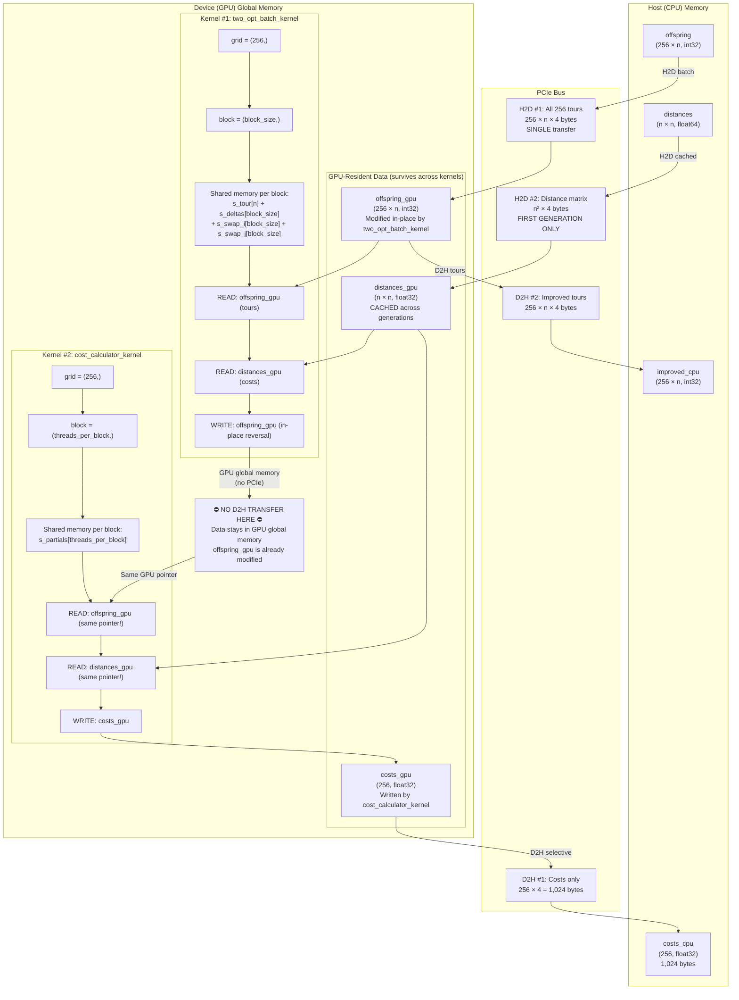
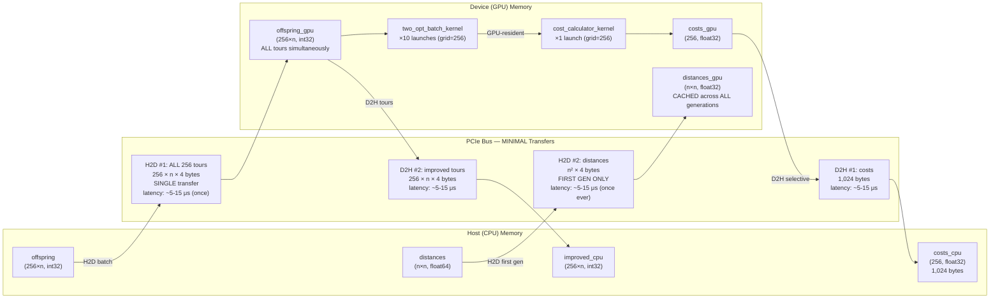

# Genetic Algorithm — Hybrid Optimized Variant (`GeneticAlgorithmHybridOptimized`)

## Overview

`GeneticAlgorithmHybridOptimized` is the **fully optimized GPU-accelerated** implementation
of the memetic algorithm (Genetic Algorithm + 2-opt local search) for solving the Traveling
Salesman Problem (TSP). It inherits from `GeneticAlgorithmBase` using the **Template Method**
design pattern and implements the two abstract methods — `_improve_population()` and
`_evaluate_population()` — with a **batch-parallel GPU strategy** that eliminates every major
bottleneck present in the Hybrid Naive variant.

### Why "Hybrid Optimized"?

The term *hybrid* indicates the combination of a genetic algorithm (global search) with
2-opt local search (local improvement) — a memetic algorithm. The term *optimized* refers
to four GPU-specific optimizations that collectively deliver order-of-magnitude improvements
over the Naive variant:

1. **Batch Processing** — All 256 tours are transferred to the GPU in a **single H2D
   transfer** and processed by a single kernel launch with `grid=(256,)`, one CUDA block
   per tour. This replaces 256 individual transfers and 2,560 individual kernel launches.

2. **Kernel Chaining** — After the batch 2-opt kernel completes, the cost calculator
   kernel runs **immediately on the same GPU-resident data** without any intermediate
   Device-to-Host transfer. Tours stay in GPU global memory between kernels.

3. **Selective Transfer** — On D2H, only the **costs array** (256 × 4 = 1,024 bytes) is
   transferred first, followed by the improved tours needed for survival selection. The
   Naive variant transferred each tour individually across 256 separate D2H calls.

4. **Distance Matrix Caching** — The distance matrix is transferred to the GPU **once on
   the first generation** and reused across all subsequent generations, eliminating a
   redundant n² × 4 byte H2D transfer per generation.

These optimizations reduce per-generation memory transfers from ~6 MB to ~2 MB (for
n=1,000), kernel launches from 2,560 to 11, and PCIe transfer count from 513 to 3–4.

| Parameter | Value | Description |
|---|---|---|
| `population_size` | 256 | μ = λ (parent and offspring size) |
| `mutation_rate` | 0.02 | Per-individual swap mutation probability |
| `tournament_size` | 5 | *k*-tournament selection pressure |
| `two_opt_iterations` | 10 | 2-opt passes per batch per generation |
| `threads_per_block` | 256 | CUDA block size (configurable) |
| `seed` | 42 | Deterministic random seed |

**Source files:**

| File | Role |
|---|---|
| `code/src/algorithms/metaheuristics/genetic_algorithm_hybrid_optimized.py` | Hybrid Optimized variant (this doc) |
| `code/src/algorithms/metaheuristics/genetic_algorithm_base.py` | Template Method base class |
| `code/src/algorithms/kernels/two_opt_batch.cu` | CUDA kernel for batch 2-opt (all tours in parallel) |
| `code/src/algorithms/kernels/cost_calculator.cu` | CUDA kernel for batch cost calculation (chained) |
| `code/src/algorithms/strategies/selection_strategies.py` | `TournamentSelection` |
| `code/src/algorithms/strategies/crossover_strategies.py` | `OrderCrossover` |
| `code/src/algorithms/strategies/mutation_strategies.py` | `SwapMutation` |

---

## Sequence Diagram — Complete Execution Flow

```mermaid
sequenceDiagram
    participant Client
    participant HO as HybridOptimized
    participant Base as GeneticAlgorithmBase
    participant TS as TournamentSelection
    participant OX as OrderCrossover
    participant SM as SwapMutation
    participant CP as CuPy
    participant TOK as TwoOptBatchKernel
    participant CCK as CostCalculatorKernel
    participant NP as NumPy

    %% ── Initialization (constructor) ────────────────────────
    Client->>HO: __init__(*args, threads_per_block=256, **kwargs)
    activate HO
    HO->>Base: super().__init__(*args, **kwargs)
    activate Base
    Base->>TS: TournamentSelection(k=5)
    Base->>OX: OrderCrossover()
    Base->>SM: SwapMutation()
    Base-->>HO: base initialized
    deactivate Base

    rect rgb(255, 235, 235)
        Note over HO, CCK: Kernel Compilation Phase — TWO kernels
        HO->>HO: _compile_kernels()
        HO->>HO: kernel_path_1 = Path("kernels/two_opt_batch.cu")
        HO->>HO: open(kernel_path_1, "r").read()
        Note right of HO: Load batch 2-opt CUDA source
        HO->>CP: cp.RawKernel(source_1, "two_opt_batch_kernel")
        activate CP
        Note right of CP: NVRTC compile kernel #1:<br/>batch 2-opt (1 block per tour)
        CP-->>HO: self.two_opt_kernel (compiled RawKernel)
        deactivate CP

        HO->>HO: kernel_path_2 = Path("kernels/cost_calculator.cu")
        HO->>HO: open(kernel_path_2, "r").read()
        Note right of HO: Load cost calculator CUDA source
        HO->>CP: cp.RawKernel(source_2, "cost_calculator_kernel")
        activate CP
        Note right of CP: NVRTC compile kernel #2:<br/>batch cost calculator
        CP-->>HO: self.cost_kernel (compiled RawKernel)
        deactivate CP
    end

    HO->>HO: self._distances_gpu = None (distance cache empty)
    HO->>HO: self._cached_offspring_costs = None
    HO-->>Client: GeneticAlgorithmHybridOptimized instance
    deactivate HO

    %% ── evolve() call ───────────────────────────────────────
    Client->>HO: evolve(context, customers, max_generations, optimal_cost, patience)
    activate HO
    Note right of HO: Execution enters<br/>GeneticAlgorithmBase.evolve()<br/>(Template Method)

    %% ── Setup Phase ─────────────────────────────────────────
    rect rgb(230, 245, 255)
        Note over HO, NP: Setup Phase
        HO->>Base: n = len(customers)
        HO->>Base: xp = context.xp
        HO->>Base: distances = context.get_cpu_distances()
        Base-->>HO: distances: np.ndarray (n × n, float64)

        alt patience is None
            HO->>HO: patience = int(2 × √n)
        end

        HO->>HO: Reset statistics (generation=0, h2d=0, d2h=0, kernels=0)

        Note over HO, NP: Initialize Random Population
        HO->>Base: _initialize_population(n)
        activate Base
        loop i = 0 … 255 (population_size)
            Base->>NP: rng.permutation(n)
            NP-->>Base: random tour (1 × n)
        end
        Base-->>HO: population: np.ndarray (256 × n)
        deactivate Base

        Note over HO, NP: Initial Fitness Evaluation (CPU — no cache yet)
        HO->>HO: _evaluate_population(population, distances, xp)
        activate HO
        Note right of HO: _cached_offspring_costs is None<br/>→ CPU fallback path
        loop i = 0 … 255 (population_size)
            loop j = 0 … n−1 (edges)
                HO->>NP: distances[tour[j], tour[(j+1) % n]]
                NP-->>HO: edge cost
            end
            HO->>HO: costs[i] = Σ edge costs
        end
        HO-->>HO: fitness: np.ndarray (256,)
        deactivate HO

        HO->>HO: initial_best_cost = min(fitness)
        HO->>HO: best_cost_history.append(initial_best_cost)
    end

    %% ── Evolution Loop ──────────────────────────────────────
    rect rgb(255, 245, 230)
        Note over HO, NP: Evolution Loop
        loop max_generations

            %% ── 3a. Tournament Selection ────────────────────
            rect rgb(240, 255, 240)
                Note over HO, TS: 3a. Tournament Selection (k=5)
                HO->>Base: _select_parents(population, fitness)
                activate Base
                loop i = 0 … 255 (256 tournaments)
                    Base->>NP: rng.choice(256, size=5, replace=False)
                    NP-->>Base: tournament_indices (5 candidates)
                    Base->>NP: fitness[tournament_indices]
                    NP-->>Base: tournament_fitness
                    Base->>NP: argmin(tournament_fitness)
                    NP-->>Base: winner_local_idx
                    Base->>Base: parent_indices[i] = tournament_indices[winner]
                end
                Base-->>HO: parent_indices: np.ndarray (256,)
                deactivate Base
            end

            %% ── 3b. Crossover + Mutation ────────────────────
            rect rgb(255, 240, 255)
                Note over HO, SM: 3b. Crossover + Mutation
                HO->>Base: _create_offspring(population, parent_indices)
                activate Base
                loop pair = 0, 2, 4, … 254 (128 pairs)
                    Base->>OX: crossover(parent1, parent2, None)
                    activate OX
                    Note right of OX: Select cut1, cut2<br/>Copy segment from parent2<br/>Fill remaining from parent1
                    OX-->>Base: child1 (1 × n)
                    deactivate OX

                    Base->>OX: crossover(parent2, parent1, None)
                    activate OX
                    OX-->>Base: child2 (1 × n)
                    deactivate OX

                    alt rng.rand() < 0.02
                        Base->>SM: mutate(child1, None)
                        activate SM
                        Note right of SM: Swap two random<br/>cities (not depot)
                        SM-->>Base: mutated child1
                        deactivate SM
                    end

                    alt rng.rand() < 0.02
                        Base->>SM: mutate(child2, None)
                        activate SM
                        SM-->>Base: mutated child2
                        deactivate SM
                    end

                    Base->>Base: offspring[pair] = child1
                    Base->>Base: offspring[pair+1] = child2
                end
                Base-->>HO: offspring: np.ndarray (256 × n)
                deactivate Base
            end

            %% ── 3c. 2-opt Improvement (GPU — BATCH OPTIMIZED) ──
            rect rgb(230, 255, 230)
                Note over HO, CCK: 3c. 2-opt Improvement (GPU — Batch Optimized + Kernel Chaining)
                HO->>HO: _improve_population(offspring, distances, xp)
                activate HO

                Note over HO, CP: H2D: Batch transfer ALL 256 tours at once
                HO->>CP: cp.asarray(offspring, dtype=int32)
                activate CP
                Note right of CP: PCIe H2D transfer<br/>256 × n × 4 bytes<br/>(SINGLE transfer for all tours)
                CP-->>HO: offspring_gpu (256 × n, int32)
                deactivate CP
                HO->>HO: h2d_bytes += 256 × n × 4

                opt First generation only
                    Note over HO, CP: H2D: Distance matrix (cached for all future generations)
                    HO->>CP: cp.asarray(distances, dtype=float32)
                    activate CP
                    Note right of CP: PCIe H2D transfer<br/>n² × 4 bytes<br/>(ONCE — cached in self._distances_gpu)
                    CP-->>HO: self._distances_gpu (n × n, float32)
                    deactivate CP
                    HO->>HO: h2d_bytes += n² × 4
                end

                HO->>HO: batch_size = 256
                HO->>HO: block_size = min(threads_per_block, n − 2)
                HO->>HO: shared_mem = block_size×12 + n×4

                Note over HO, TOK: Batch 2-opt: 10 iterations, ALL tours in parallel
                loop 10 iterations
                    HO->>TOK: two_opt_batch_kernel<<<grid=(256,), block=(block_size,)>>><br/>(offspring_gpu, distances_gpu, n, 256, shared_mem)
                    activate TOK
                    Note right of TOK: 256 CUDA blocks execute in parallel<br/>Each block: 1 tour<br/>Shared memory: local tour + reduction buffers<br/>Parallel edge-pair scan → find best swap<br/>Apply reversal in-place
                    TOK-->>HO: offspring_gpu modified in-place (GPU-resident)
                    deactivate TOK
                    HO->>HO: kernel_launches += 1
                end

                Note over HO, CCK: KERNEL CHAINING: Cost calculation on GPU<br/>(NO intermediate D2H — data stays on GPU)
                HO->>HO: costs_gpu = cp.zeros(256, dtype=float32)
                HO->>CCK: cost_calculator_kernel<<<grid=(256,), block=(threads_per_block,)>>><br/>(offspring_gpu, distances_gpu, costs_gpu, n, 256)
                activate CCK
                Note right of CCK: 256 CUDA blocks execute in parallel<br/>Each block: sum edges of 1 tour<br/>Parallel reduction → single cost value<br/>READS offspring_gpu that was JUST<br/>modified by two_opt_batch_kernel<br/>(no PCIe transfer between kernels!)
                CCK-->>HO: costs_gpu (256,) filled on GPU
                deactivate CCK
                HO->>HO: kernel_launches += 1

                HO->>CP: cp.cuda.Device().synchronize()
                Note right of CP: Ensure all GPU work complete<br/>before D2H transfers

                Note over HO, CP: D2H: Costs ONLY (selective transfer)
                HO->>CP: costs_gpu.get()
                activate CP
                Note right of CP: PCIe D2H transfer<br/>256 × 4 = 1,024 bytes<br/>(ONLY costs — not tours!)
                CP-->>HO: costs_cpu: np.ndarray (256,)
                deactivate CP
                HO->>HO: d2h_bytes += 256 × 4

                Note over HO, CP: D2H: Improved tours (for survival selection)
                HO->>CP: offspring_gpu.get()
                activate CP
                Note right of CP: PCIe D2H transfer<br/>256 × n × 4 bytes<br/>(improved tours needed for CPU survival)
                CP-->>HO: improved_cpu: np.ndarray (256 × n)
                deactivate CP
                HO->>HO: d2h_bytes += 256 × n × 4

                Note over HO: Cache costs to avoid redundant evaluation
                HO->>HO: self._cached_offspring_costs = costs_cpu

                HO-->>HO: improved_cpu: np.ndarray (256 × n)
                deactivate HO
            end

            %% ── 3d. Fitness Evaluation (Cached from GPU) ────
            rect rgb(230, 240, 255)
                Note over HO, NP: 3d. Fitness Evaluation (GPU-cached or CPU fallback)
                HO->>HO: _evaluate_population(improved, distances, xp)
                activate HO

                alt Cached costs available (self._cached_offspring_costs is not None)
                    HO->>HO: costs = self._cached_offspring_costs
                    HO->>HO: self._cached_offspring_costs = None (delete cache)
                    Note right of HO: Zero computation!<br/>Costs already computed by GPU<br/>cost_calculator_kernel during<br/>_improve_population()
                    HO-->>HO: costs: np.ndarray (256,)
                else No cache (initial population only)
                    loop i = 0 … 255 (population_size)
                        loop j = 0 … n−1 (edges)
                            HO->>NP: distances[tour[j], tour[(j+1) % n]]
                            NP-->>HO: edge cost
                        end
                        HO->>HO: costs[i] = Σ edge costs
                    end
                    HO-->>HO: costs: np.ndarray (256,)
                end
                deactivate HO
            end

            %% ── 3e. Survival Selection ──────────────────────
            rect rgb(245, 240, 245)
                Note over HO, NP: 3e. (μ+λ) Survival Selection
                HO->>Base: _survival_selection(population, offspring, fitness, off_fitness)
                activate Base
                Base->>NP: combined = np.vstack([population, offspring])
                NP-->>Base: combined (512 × n)
                Base->>NP: combined_fitness = np.concatenate([pop_fitness, off_fitness])
                NP-->>Base: combined_fitness (512,)
                Base->>NP: sorted_indices = np.argsort(combined_fitness)
                NP-->>Base: sorted_indices (512,)
                Base->>NP: best_indices = sorted_indices[:256]
                Base->>NP: combined[best_indices], combined_fitness[best_indices]
                NP-->>Base: new_population (256 × n), new_fitness (256,)
                Base-->>HO: (new_population, new_fitness)
                deactivate Base
            end

            %% ── Early Stopping ──────────────────────────────
            HO->>HO: best_cost = min(fitness)
            HO->>HO: best_cost_history.append(best_cost)

            opt best_cost < best_ever_cost
                HO->>HO: best_ever_cost = best_cost
                HO->>HO: last_improvement_gen = gen
            end

            alt optimal_cost provided AND gap < 1%
                HO->>HO: stop_reason = "hit_optimal"
                Note right of HO: break
            else stagnation: gen − last_improvement_gen ≥ patience
                HO->>HO: stop_reason = "no_improvements"
                Note right of HO: break
            else continue
                opt (gen+1) % 100 == 0
                    HO->>HO: log progress (best, avg, kernel_launches)
                end
            end
        end
    end

    %% ── Post-Evolution ──────────────────────────────────────
    rect rgb(240, 240, 240)
        Note over HO, NP: Post-Evolution — Extract Results
        HO->>NP: final_best_cost = min(fitness)
        NP-->>HO: final_best_cost
        HO->>NP: best_idx = argmin(fitness)
        NP-->>HO: best_idx
        HO->>HO: best_tour = population[best_idx]
        HO->>HO: improvement_pct = (initial − final) / initial × 100
        HO->>HO: Build stats dict
        Note right of HO: stats = {best_fitness, initial_fitness,<br/>improvement_pct, best_cost_history,<br/>h2d_bytes, d2h_bytes,<br/>kernel_launches=11×G,<br/>generations_completed, stop_reason}
    end

    HO-->>Client: (best_tour: np.ndarray, stats: Dict)
    deactivate HO
```



---

## Flowchart — Complete Control Flow

```mermaid
flowchart TD
    Start([Client calls evolve]) --> Init

    subgraph Init["Initialization (Constructor)"]
        I1["super().__init__() — base class setup"]
        I2["_compile_kernels()"]
        I3["Load two_opt_batch.cu from disk"]
        I4["cp.RawKernel(source, 'two_opt_batch_kernel')"]
        I5["Load cost_calculator.cu from disk"]
        I6["cp.RawKernel(source, 'cost_calculator_kernel')"]
        I7["self.two_opt_kernel + self.cost_kernel ready"]
        I8["self._distances_gpu = None<br/>self._cached_offspring_costs = None"]
        I1 --> I2
        I2 --> I3
        I3 --> I4
        I4 --> I5
        I5 --> I6
        I6 --> I7
        I7 --> I8
    end

    I8 --> Setup

    subgraph Setup["Setup Phase"]
        S1[/"n = len(customers)<br/>distances = context.get_cpu_distances()<br/>xp = context.xp"/]
        S2{"patience<br/>provided?"}
        S3["patience = int(2 × √n)"]
        S4["Reset counters<br/>generation=0, h2d=0, d2h=0, kernels=0"]
        S5["Initialize population<br/>256 random permutations of n cities"]
        S6["Initial fitness evaluation<br/>_evaluate_population on CPU<br/>(no cache exists yet)"]
        S7["initial_best_cost = min(fitness)<br/>best_ever_cost = ∞<br/>last_improvement_gen = 0<br/>stop_reason = 'max_generations'"]

        S1 --> S2
        S2 -- No --> S3
        S2 -- Yes --> S4
        S3 --> S4
        S4 --> S5
        S5 --> S6
        S6 --> S7
    end

    S7 --> LoopStart

    subgraph Evolution["Evolution Loop (gen = 0 … max_generations−1)"]
        LoopStart{"gen <<br/>max_generations?"}

        subgraph Selection["3a. Tournament Selection (CPU)"]
            SEL1["For each of 256 slots:<br/>Sample 5 random individuals<br/>Select lowest-cost as parent"]
            SEL2["parent_indices (256,)"]
            SEL1 --> SEL2
        end

        subgraph Crossover["3b. Crossover + Mutation (CPU)"]
            CX1["For 128 parent pairs:<br/>Order Crossover (OX) → child1, child2"]
            CX2{"rand() < 0.02?"}
            CX3["Swap Mutation on child"]
            CX4["offspring (256 × n)"]
            CX1 --> CX2
            CX2 -- Yes --> CX3
            CX2 -- No --> CX4
            CX3 --> CX4
        end

        subgraph GPU_Ops["3c. 2-opt Improvement (GPU — BATCH OPTIMIZED)"]
            direction TB
            TO0["_improve_population(offspring, distances, xp)"]

            subgraph H2D_Batch["H2D: Batch Transfer (SINGLE call)"]
                HB1["offspring_gpu = cp.asarray(offspring)<br/>256 × n × 4 bytes — ONE transfer"]
                HB2["h2d_bytes += 256 × n × 4"]
                HB1 --> HB2
            end

            CacheCheck{"self._distances_gpu<br/>is None?"}

            subgraph H2D_Dist["H2D: Distance Matrix (FIRST GENERATION ONLY)"]
                HD1["self._distances_gpu = cp.asarray(distances)"]
                HD2["h2d_bytes += n² × 4"]
                HD1 --> HD2
            end

            CacheHit["Reuse cached self._distances_gpu<br/>(zero bytes transferred)"]

            subgraph BatchKernel["Batch 2-opt Kernel (ALL tours in parallel)"]
                BK_Check{"iter < 10?"}
                BK_Launch["two_opt_batch_kernel<br/>grid=(256,) block=(block_size,)<br/>256 blocks × block_size threads<br/>Each block processes 1 tour"]
                BK_Count["kernel_launches += 1"]
                BK_Next["iter += 1"]
                BK_Check -- Yes --> BK_Launch
                BK_Launch --> BK_Count
                BK_Count --> BK_Next
                BK_Next --> BK_Check
            end

            subgraph ChainedCost["KERNEL CHAINING: Cost Calculator (NO D2H between!)"]
                KC1["cost_calculator_kernel<br/>grid=(256,) block=(threads_per_block,)<br/>Reads GPU-resident offspring_gpu directly"]
                KC2["kernel_launches += 1"]
                KC1 --> KC2
            end

            Sync["cp.cuda.Device().synchronize()"]

            subgraph D2H_Selective["D2H: Selective Transfer"]
                DS1["costs_cpu = costs_gpu.get()<br/>256 × 4 = 1,024 bytes"]
                DS2["d2h_bytes += 1,024"]
                DS3["improved_cpu = offspring_gpu.get()<br/>256 × n × 4 bytes"]
                DS4["d2h_bytes += 256 × n × 4"]
                DS1 --> DS2
                DS2 --> DS3
                DS3 --> DS4
            end

            CacheCosts["self._cached_offspring_costs = costs_cpu"]

            TO0 --> HB1
            HB2 --> CacheCheck
            CacheCheck -- Yes --> HD1
            CacheCheck -- No --> CacheHit
            HD2 --> BK_Check
            CacheHit --> BK_Check
            BK_Check -- No --> KC1
            KC2 --> Sync
            Sync --> DS1
            DS4 --> CacheCosts
        end

        subgraph CPU_Ops["3d. Fitness Evaluation (Cached / CPU Fallback)"]
            FIT_Check{"_cached_offspring_costs<br/>is not None?"}
            FIT_Cached["Return cached costs<br/>Delete cache (set to None)<br/>ZERO computation"]
            FIT_CPU["For each of 256 tours:<br/>Sum n edge costs (CPU)<br/>Only used for initial population"]
            FIT_Result["offspring_fitness (256,)"]
            FIT_Check -- Yes --> FIT_Cached
            FIT_Check -- No --> FIT_CPU
            FIT_Cached --> FIT_Result
            FIT_CPU --> FIT_Result
        end

        subgraph Survival["3e. (μ+λ) Survival Selection"]
            SV1["Combine parents + offspring → 512 individuals"]
            SV2["Sort by fitness (ascending cost)"]
            SV3["Keep best 256"]
            SV4["new_population (256 × n)<br/>new_fitness (256,)"]
            SV1 --> SV2
            SV2 --> SV3
            SV3 --> SV4
        end

        subgraph EarlyStop["Early Stopping Checks"]
            ES1["best_cost = min(fitness)"]
            ES2{"best_cost <<br/>best_ever_cost?"}
            ES3["Update best_ever_cost<br/>last_improvement_gen = gen"]
            ES4{"optimal_cost given<br/>AND gap < 1%?"}
            ES5["stop_reason = 'hit_optimal'"]
            ES6{"gen − last_improvement<br/>≥ patience?"}
            ES7["stop_reason = 'no_improvements'"]
            ES8{"(gen+1) % 100 == 0?"}
            ES9["Log progress"]
            ES10["Continue to next gen"]

            ES1 --> ES2
            ES2 -- Yes --> ES3
            ES2 -- No --> ES4
            ES3 --> ES4
            ES4 -- Yes --> ES5
            ES4 -- No --> ES6
            ES6 -- Yes --> ES7
            ES6 -- No --> ES8
            ES8 -- Yes --> ES9
            ES8 -- No --> ES10
        end

        LoopStart -- Yes --> SEL1
        SEL2 --> CX1
        CX4 --> TO0
        CacheCosts --> FIT_Check
        FIT_Result --> SV1
        SV4 --> ES1
        ES10 --> LoopStart
    end

    LoopStart -- No --> PostEvo
    ES5 --> PostEvo
    ES7 --> PostEvo

    subgraph PostEvo["Post-Evolution"]
        PE1["final_best_cost = min(fitness)"]
        PE2["best_tour = population[argmin(fitness)]"]
        PE3["improvement_pct =<br/>(initial − final) / initial × 100"]
        PE4["Build stats dict:<br/>best_fitness, initial_fitness,<br/>improvement_pct, best_cost_history,<br/>h2d_bytes, d2h_bytes,<br/>kernel_launches=11×G, stop_reason"]
        PE1 --> PE2
        PE2 --> PE3
        PE3 --> PE4
    end

    PE4 --> Return(["Return (best_tour, stats)"])
```



---

## Kernel Chaining Flowchart — GPU Data Residency

This diagram details how data stays on the GPU between the batch 2-opt kernel and the
cost calculator kernel, eliminating the intermediate D2H transfer that a non-chained
approach would require.



### Kernel Chaining — Timing Breakdown

The critical insight is that between `two_opt_batch_kernel` and `cost_calculator_kernel`,
the data **never leaves the GPU**. In a non-chained approach, you would need:

```
Non-chained:  2-opt → D2H (tours) → CPU cost calc → next step
              ≈ 256×n×4 bytes D2H + O(256×n) CPU compute

Kernel-chained:  2-opt → cost_calc (GPU) → D2H (costs only)
                 ≈ 1,024 bytes D2H + zero CPU compute for costs
```

For n = 1,000: the non-chained D2H would be 1,024,000 bytes; kernel chaining transfers
only 1,024 bytes — a **1,000× reduction** in the intermediate transfer.

---

## Memory Transfer Flowchart — PCIe Bus Transfer Pattern



---

## Performance Analysis

### Memory Transfer Profile per Generation

| Metric | Formula | Value (n=1,000) | Notes |
|---|---|---|---|
| **H2D: All tours (batch)** | 256 × n × 4 bytes | 1,024,000 bytes (1,000 KB) | Single transfer |
| **H2D: Distance matrix** | n² × 4 bytes | 4,000,000 bytes (3.81 MB) | First generation only (cached) |
| **H2D total (gen 1)** | 256×n×4 + n²×4 | 5,024,000 bytes (4.79 MB) | 2 transfers |
| **H2D total (gen 2+)** | 256×n×4 | 1,024,000 bytes (1,000 KB) | 1 transfer (distance cached) |
| **D2H: Costs only** | 256 × 4 bytes | 1,024 bytes (1 KB) | Selective transfer |
| **D2H: Improved tours** | 256 × n × 4 bytes | 1,024,000 bytes (1,000 KB) | For survival selection |
| **D2H total** | 256×4 + 256×n×4 | 1,025,024 bytes (~1,001 KB) | 2 transfers |
| **Total bytes per gen (gen 2+)** | 256×n×4 + 256×4 + 256×n×4 | ~2,049,024 bytes (~2 MB) | 3 transfers |
| **Kernel launches per gen** | 10 + 1 | **11** | 10 two-opt + 1 cost |
| **GPU memory allocated** | n²×4 + 256×n×4 + 256×4 | ~5,049,024 bytes (4.81 MB) | Distance + tours + costs |

### Transfer Overhead per Generation (estimated)

| Overhead Source | Count | Latency Each | Total |
|---|---|---|---|
| H2D transfers (gen 2+) | 1 | ~10 μs | ~10 μs |
| D2H transfers | 2 | ~10 μs | ~20 μs |
| Kernel launches | 11 | ~7 μs | ~77 μs |
| **Total overhead (gen 2+)** | — | — | **~107 μs per gen** |

### Comparison with Naive Variant

| Metric | Hybrid Naive | Hybrid Optimized | Improvement |
|---|---|---|---|
| **H2D transfers per gen** | 257 (1 dist + 256 tours) | 1 (batch) + 0 (dist cached) | **257× fewer** |
| **D2H transfers per gen** | 256 (individual tours) | 2 (costs + tours batch) | **128× fewer** |
| **Total transfers per gen** | 513 | 3 | **171× fewer** |
| **Kernel launches per gen** | 2,560 (256 × 10) | 11 (10 + 1) | **~233× fewer** (2,560 / 11) |
| **H2D bytes per gen (gen 2+)** | n²×4 + 256×n×4 | 256×n×4 | **n²×4 bytes saved** |
| **D2H bytes per gen** | 256×n×4 | 256×4 + 256×n×4 | Similar total, but 128× fewer calls |
| **Distance matrix transfers** | Every generation | Once (cached) | **G× fewer** (G = total generations) |
| **Fitness computation** | CPU O(256 × n) | GPU-cached (zero CPU) | **Eliminated** |
| **Total overhead per gen** | ~23,050 μs (~23 ms) | ~107 μs (~0.1 ms) | **~215× less overhead** |

### Kernel Launch Overhead Analysis

The single largest improvement is the reduction in kernel launches:

```
Naive:     256 tours × 10 iterations = 2,560 launches × ~7 μs = ~17,920 μs
Optimized: 1 batch × 10 iterations + 1 cost = 11 launches × ~7 μs = ~77 μs

Launch overhead ratio: 2,560 / 11 = 232.7× reduction
```

This matters because kernel launch overhead is **fixed** — it does not scale with problem
size. For small instances (n < 200), the Naive variant's 17.9 ms of pure launch overhead
per generation exceeds the actual GPU compute time, making it slower than the CPU variant.
The Optimized variant's 77 μs overhead is negligible at any problem size.

### GPU Utilization Comparison

| Aspect | Hybrid Naive | Hybrid Optimized |
|---|---|---|
| **Grid size** | (1,) — single block | (256,) — full population |
| **Active blocks** | 1 at a time | 256 simultaneously |
| **Active threads** | min(256, n−2) | 256 × min(256, n−2) |
| **GPU occupancy** | < 1% of SMs | ~100% of SMs |
| **Block scheduling** | Sequential (256 launches) | Parallel (1 launch) |

### Kernel Launches Per Generation

| Component | Count | Grid | Block | Total Threads |
|---|---|---|---|---|
| `two_opt_batch_kernel` per iteration | 1 | (256,) | (min(256, n−2),) | 256 × min(256, n−2) |
| 10 iterations | **10** | — | — | — |
| `cost_calculator_kernel` (chained) | **1** | (256,) | (256,) | 256 × 256 = 65,536 |
| **Total per generation** | **11** | — | — | — |
| **Total per run (G generations)** | **11 × G** | — | — | — |

### Time Complexity per Generation

| Operation | Calls per gen | Complexity per call | Total per generation |
|---|---|---|---|
| Tournament Selection | 256 | O(k) = O(5) | **O(256 × 5) = O(1,280)** |
| Order Crossover (OX) | 128 pairs × 2 children | O(n) | **O(256 × n)** |
| Swap Mutation | ≤ 256 (rate = 0.02) | O(1) | **O(256 × 0.02) ≈ O(5)** |
| **2-opt improvement** | 10 batch iterations | O(n) per kernel, 256 parallel | **O(10 × n)** GPU-parallel |
| **Cost calculation** | 1 batch kernel | O(n) per block, 256 parallel | **O(n)** GPU-parallel |
| H2D/D2H overhead | 3 transfers | O(1) per transfer | **O(3) fixed latency** |
| Kernel launch overhead | 11 launches | O(1) per launch | **O(11) fixed latency** |
| **Fitness evaluation** | 256 tours | O(1) — cached | **O(1)** (cache return) |
| Survival selection | 1 | O(512 log 512) | **O(512 log 512) ≈ O(4,608)** |

### Space Complexity

| Structure | Shape | Dtype | Size (for n cities) |
|---|---|---|---|
| `population` (CPU) | (256, n) | int32 | 256 × n × 4 bytes |
| `offspring` (CPU) | (256, n) | int32 | 256 × n × 4 bytes |
| `improved_cpu` (CPU) | (256, n) | int32 | 256 × n × 4 bytes |
| `distances` (CPU) | (n, n) | float64 | n² × 8 bytes |
| `_distances_gpu` (GPU, cached) | (n, n) | float32 | n² × 4 bytes |
| `offspring_gpu` (GPU) | (256, n) | int32 | 256 × n × 4 bytes |
| `costs_gpu` (GPU) | (256,) | float32 | 1,024 bytes |
| `_cached_offspring_costs` (CPU) | (256,) | float32 | 1,024 bytes |
| `fitness` (CPU) | (256,) | float64 | 2,048 bytes |
| `combined` (CPU, transient) | (512, n) | int32 | 512 × n × 4 bytes |
| **Total peak (CPU)** | — | — | **≈ 8n² + 5,120n + 3,072 bytes** |
| **Total peak (GPU)** | — | — | **≈ 4n² + 1,024n + 1,024 bytes** |

### Concrete Example — n = 1,000 cities, G = 500 generations

| Metric | Hybrid Naive | Hybrid Optimized | Savings |
|---|---|---|---|
| Distance matrix (GPU) | 4,000,000 bytes (3.81 MB) | 4,000,000 bytes (3.81 MB) | Same |
| H2D per generation (gen 2+) | 5,024,000 bytes (4.79 MB) | 1,024,000 bytes (1,000 KB) | **4.79× less** |
| D2H per generation | 1,024,000 bytes (1,000 KB) | 1,025,024 bytes (~1,001 KB) | ~Same bytes, 128× fewer calls |
| **Total bytes per gen (gen 2+)** | 6,048,000 bytes (5.77 MB) | ~2,049,024 bytes (~2 MB) | **~2.95× less** |
| Transfers per generation | 513 | 3 | **171× fewer** |
| Kernel launches per generation | 2,560 | 11 | **233× fewer** |
| **Total transfers (500 gens)** | 256,500 | 1,500 | **171× fewer** |
| **Total kernel launches (500 gens)** | 1,280,000 | 5,500 | **233× fewer** |
| **Transfer overhead (500 gens)** | ~2.57 seconds | ~0.015 seconds | **171× less** |
| **Launch overhead (500 gens)** | ~8.96 seconds | ~0.039 seconds | **230× less** |
| **Combined fixed overhead** | **~11.5 seconds** | **~0.054 seconds** | **~215× less** |
| Distance matrix H2D (total run) | 500 × 4 MB = 2 GB | 1 × 4 MB = 4 MB | **500× less** |

### Memory per Generation Summary (n=1,000)

```
Naive:     ~6 MB transferred in 513 calls + 2,560 kernel launches
Optimized: ~2 MB transferred in   3 calls +    11 kernel launches

Memory reduction:   ~3× fewer bytes, ~171× fewer transfers
Kernel reduction:   ~233× fewer launches (2,560 / 11)
Overhead reduction: ~215× less fixed overhead
```

### Why the Hybrid Optimized Variant Is the Production Choice

The Hybrid Optimized variant addresses all five inefficiencies of the Naive variant:

1. **Batch transfers replace individual transfers** — A single `cp.asarray()` call moves
   all 256 tours to the GPU, replacing 256 individual calls. The fixed PCIe latency (~10 μs)
   is paid once instead of 256 times.

2. **Batch kernel launches replace individual launches** — `grid=(256,)` runs 256 blocks
   in parallel on a single launch, replacing 2,560 sequential launches. GPU occupancy jumps
   from < 1% to ~100% of available SMs.

3. **Kernel chaining eliminates intermediate D2H** — The cost calculator reads the same
   GPU-resident tours that the 2-opt kernel just modified, without any PCIe transfer. This
   saves an entire D2H + CPU computation cycle per generation.

4. **Distance matrix caching eliminates redundant H2D** — The n² × 4 byte distance matrix
   is transferred once and reused across all G generations, saving (G − 1) × n² × 4 bytes
   of redundant transfers.

5. **Cost caching eliminates redundant CPU evaluation** — The `_cached_offspring_costs`
   attribute carries GPU-computed costs to `_evaluate_population()`, which returns them
   directly without recomputing on CPU.
