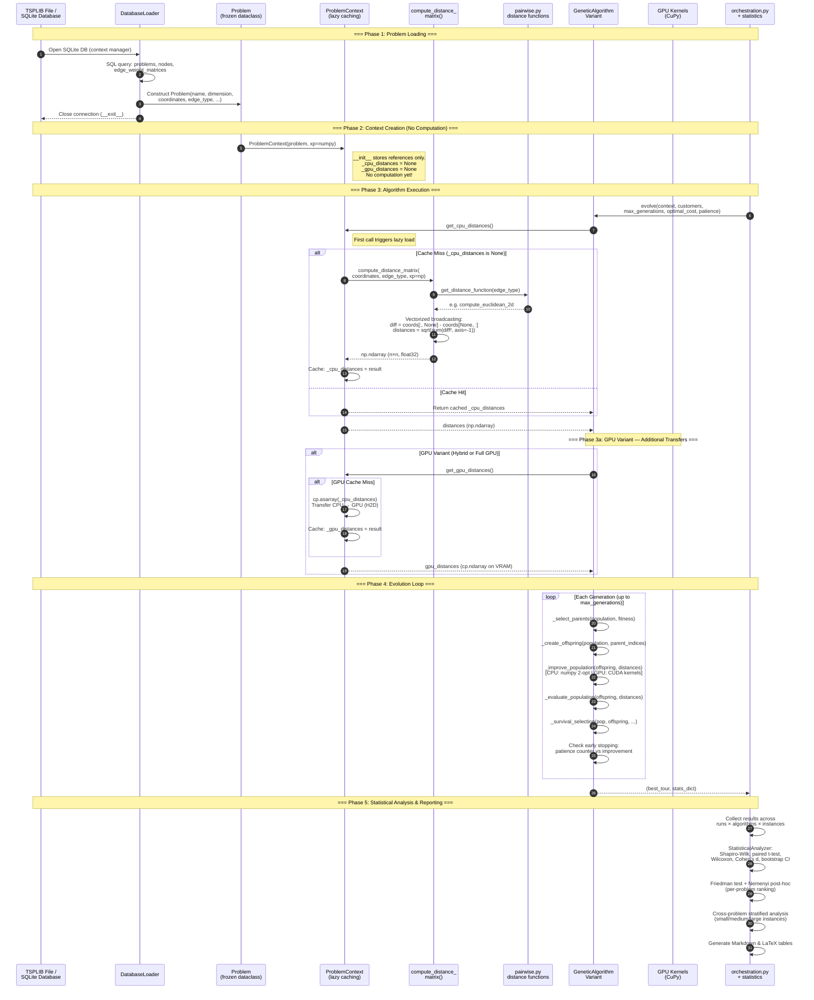
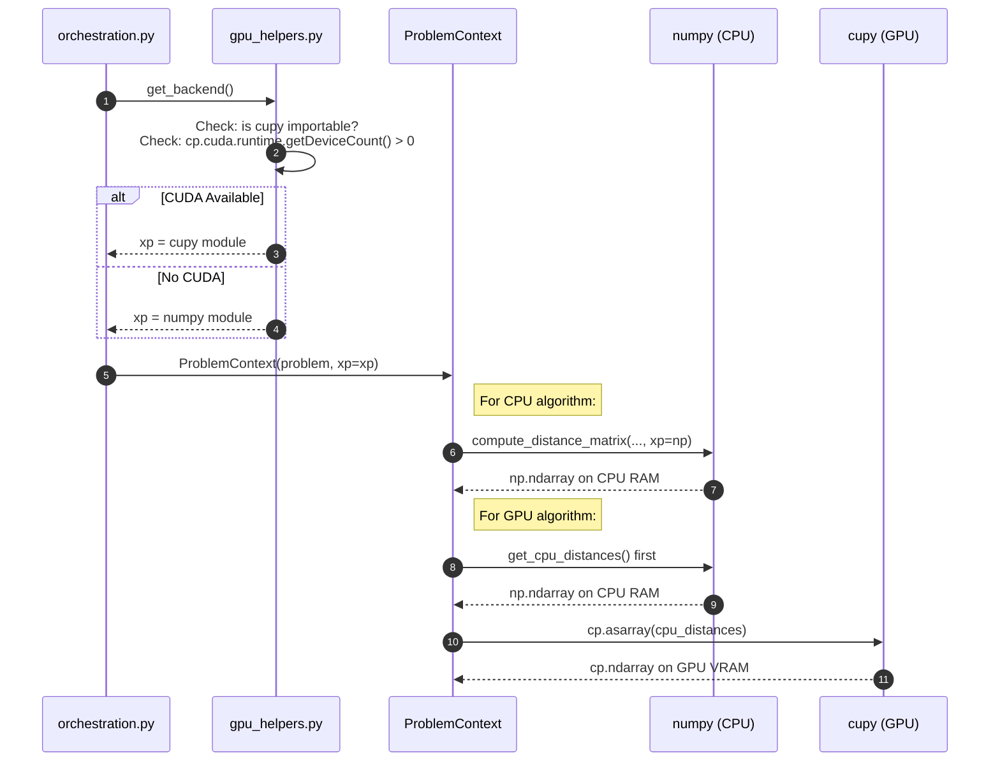
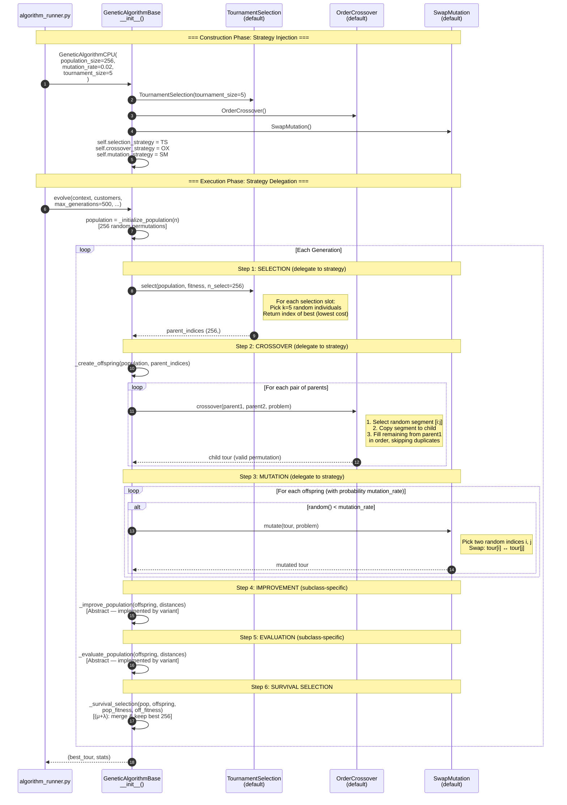
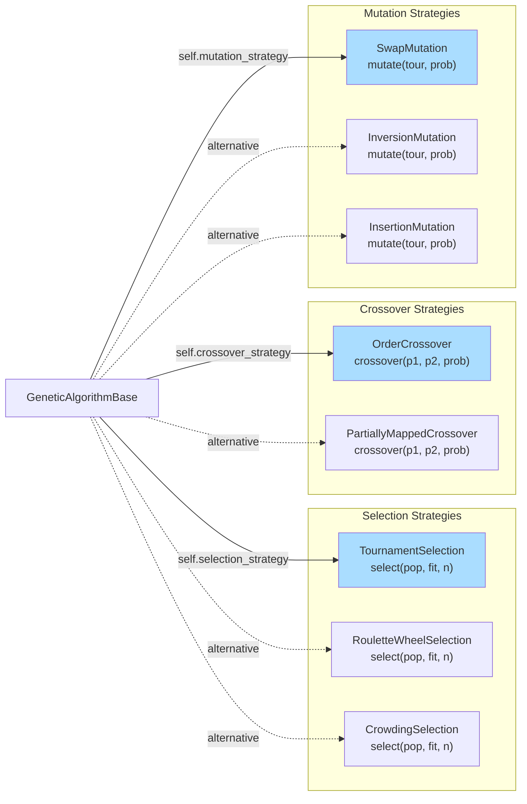
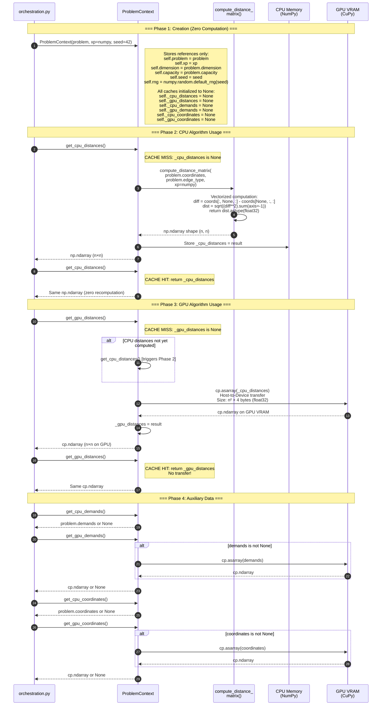
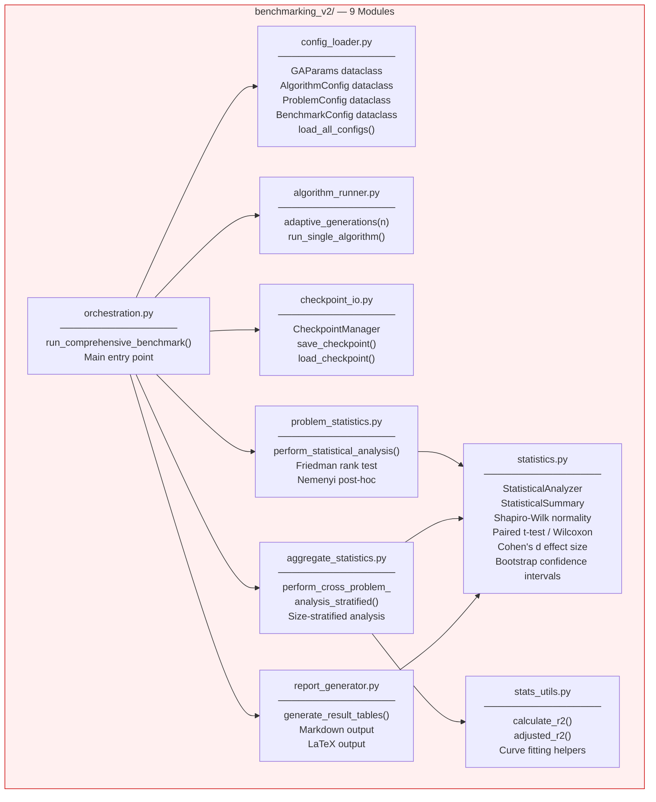

# Module Interactions — `code/src` Architecture

> Comprehensive documentation of how all modules in `code/src` collaborate to deliver CPU and GPU-accelerated genetic algorithm benchmarking for TSP instances.

---

## Table of Contents

1. [Overview — Layered Architecture](#1-overview--layered-architecture)
2. [Module Dependency Diagram](#2-module-dependency-diagram)
3. [Data Flow Sequence Diagram](#3-data-flow-sequence-diagram)
4. [Strategy Pattern Sequence Diagram](#4-strategy-pattern-sequence-diagram)
5. [ProblemContext Lifecycle Sequence Diagram](#5-problemcontext-lifecycle-sequence-diagram)
6. [Protocol Architecture Diagram](#6-protocol-architecture-diagram)
7. [GPU Helper Utilities Flowchart](#7-gpu-helper-utilities-flowchart)

---

## 1. Overview — Layered Architecture

The codebase is organized into **six distinct layers**, each with a clear responsibility boundary. Dependencies flow **downward only** — higher layers depend on lower layers, never the reverse.

| Layer | Directory | Responsibility |
|-------|-----------|----------------|
| **Benchmarking** | `benchmarking_v2/` | Orchestration, config management, statistical analysis, reporting |
| **Algorithm** | `algorithms/metaheuristics/` | GA variants (CPU, Hybrid Naive, Hybrid Optimized, Full GPU) |
| **Strategy** | `algorithms/strategies/` | Pluggable selection, crossover, and mutation operators |
| **Protocol** | `protocols/` | Interface contracts (PEP 544 structural subtyping), context management |
| **Data & Distance** | `data_models/`, `distances/`, `loaders/` | Problem representation, distance computation, TSPLIB loading |
| **Utility** | `utils/` | GPU detection, kernel compilation, backend abstraction |

### Key Design Patterns

- **Template Method** — `GeneticAlgorithmBase` defines the `evolve()` skeleton; subclasses override `_improve_population()` and `_evaluate_population()`.
- **Strategy** — Selection, crossover, and mutation are injected as composable strategy objects.
- **Protocol (Structural Subtyping)** — `BackendModule` abstracts NumPy/CuPy; algorithm strategies define duck-typed interfaces via `typing.Protocol`.
- **Lazy Loading** — `ProblemContext` defers distance matrix computation and GPU transfers until first access.
- **Context Manager** — `DatabaseLoader` manages SQLite connections via `__enter__`/`__exit__`.

---

## 2. Module Dependency Diagram

```mermaid
flowchart TB
    subgraph Benchmarking["🔴 Benchmarking Layer"]
        style Benchmarking fill:#ffe0e0,stroke:#cc0000
        ORCH["orchestration.py<br/><i>run_comprehensive_benchmark()</i>"]
        CONF["config_loader.py<br/><i>GAParams, BenchmarkConfig</i>"]
        RUNNER["algorithm_runner.py<br/><i>run_single_algorithm()</i>"]
        CKPT["checkpoint_io.py<br/><i>CheckpointManager</i>"]
        STATS["statistics.py<br/><i>StatisticalAnalyzer</i>"]
        PSTATS["problem_statistics.py<br/><i>Friedman, Nemenyi</i>"]
        ASTATS["aggregate_statistics.py<br/><i>Cross-problem stratified</i>"]
        REPORT["report_generator.py<br/><i>Markdown & LaTeX</i>"]
        SUTILS["stats_utils.py<br/><i>R², curve fitting</i>"]
    end

    subgraph Algorithm["🟢 Algorithm Layer"]
        style Algorithm fill:#e0ffe0,stroke:#008800
        BASE["genetic_algorithm_base.py<br/><i>GeneticAlgorithmBase (ABC)</i>"]
        CPU["genetic_algorithm_cpu.py<br/><i>GeneticAlgorithmCPU</i>"]
        HN["genetic_algorithm_hybrid_naive.py<br/><i>GeneticAlgorithmHybridNaive</i>"]
        HO["genetic_algorithm_hybrid_optimized.py<br/><i>GeneticAlgorithmHybridOptimized</i>"]
        FG["genetic_algorithm_full_gpu_early_stop.py<br/><i>GeneticAlgorithmFullGPUEarlyStop</i>"]
    end

    subgraph Strategy["🔵 Strategy Layer"]
        style Strategy fill:#e0e0ff,stroke:#0000cc
        SEL["selection_strategies.py<br/><i>Tournament, Roulette, Crowding</i>"]
        CRO["crossover_strategies.py<br/><i>OrderCrossover, PMX</i>"]
        MUT["mutation_strategies.py<br/><i>Swap, Inversion, Insertion</i>"]
    end

    subgraph Protocol["🟣 Protocol Layer"]
        style Protocol fill:#f0e0ff,stroke:#8800aa
        ALGP["algorithm_strategies.py<br/><i>BinPacking, TspConstruction,<br/>TspImprovement, TspMetaheuristic</i>"]
        BACK["backend.py<br/><i>BackendModule protocol</i>"]
        PCTX["problem_context.py<br/><i>ProblemContext (lazy caching)</i>"]
    end

    subgraph DataLayer["🟠 Data & Distance Layer"]
        style DataLayer fill:#fff0e0,stroke:#cc8800
        PROB["problem.py<br/><i>Problem (frozen dataclass)</i>"]
        EXC["exceptions.py<br/><i>ProblemLoaderError hierarchy</i>"]
        MAT["matrix.py<br/><i>compute_distance_matrix()</i>"]
        PAIR["pairwise.py<br/><i>Pairwise distance functions</i>"]
        LOAD["database_loader.py<br/><i>DatabaseLoader (context mgr)</i>"]
    end

    subgraph Utility["⬜ Utility Layer"]
        style Utility fill:#f0f0f0,stroke:#888888
        GPU["gpu_helpers.py<br/><i>load_kernel, get_backend,<br/>is_gpu_available</i>"]
    end

    %% Benchmarking internal dependencies
    ORCH --> CONF
    ORCH --> RUNNER
    ORCH --> CKPT
    ORCH --> PSTATS
    ORCH --> ASTATS
    ORCH --> REPORT
    PSTATS --> STATS
    ASTATS --> STATS
    ASTATS --> SUTILS
    REPORT --> STATS

    %% Benchmarking → Algorithm
    RUNNER --> CPU
    RUNNER --> HN
    RUNNER --> HO
    RUNNER --> FG

    %% Benchmarking → Data
    RUNNER --> PCTX
    ORCH --> LOAD

    %% Algorithm inheritance
    CPU --> BASE
    HN --> BASE
    HO --> BASE
    FG --> BASE

    %% Algorithm → Strategy
    BASE --> SEL
    BASE --> CRO
    BASE --> MUT

    %% Algorithm → Protocol/Context
    BASE --> PCTX

    %% GPU variants → Utility
    HN --> GPU
    HO --> GPU
    FG --> GPU

    %% Protocol → Data
    PCTX --> PROB
    PCTX --> MAT
    PCTX --> BACK

    %% Data internal
    MAT --> PAIR
    LOAD --> PROB
    LOAD --> EXC

    %% External backends
    NP["numpy"]:::external
    CP["cupy"]:::external
    BACK -.->|"abstracts"| NP
    BACK -.->|"abstracts"| CP

    classDef external fill:#ffffff,stroke:#aaaaaa,stroke-dasharray: 5 5
```



### Dependency Summary Table

| Module | Depends On | Depended On By |
|--------|-----------|----------------|
| `GeneticAlgorithmBase` | `ProblemContext`, `TournamentSelection`, `OrderCrossover`, `SwapMutation` | All 4 GA variants |
| `GeneticAlgorithmCPU` | `GeneticAlgorithmBase`, `numpy` | `algorithm_runner` |
| `GeneticAlgorithmHybridNaive` | `GeneticAlgorithmBase`, `numpy`, `cupy`, `load_kernel` | `algorithm_runner` |
| `GeneticAlgorithmHybridOptimized` | `GeneticAlgorithmBase`, `numpy`, `cupy`, `load_kernel` | `algorithm_runner` |
| `GeneticAlgorithmFullGPUEarlyStop` | `GeneticAlgorithmBase`, `numpy`, `cupy`, `load_kernel` | `algorithm_runner` |
| `ProblemContext` | `Problem`, `compute_distance_matrix`, `BackendModule` | All GA variants, `algorithm_runner` |
| `DatabaseLoader` | `Problem`, exceptions | `orchestration` |
| `compute_distance_matrix` | `pairwise` distance functions | `ProblemContext` |

---

## 3. Data Flow Sequence Diagram



### Backend Switching Flow



---

## 4. Strategy Pattern Sequence Diagram



### Strategy Interchangeability



> **Default strategies** (solid arrows) are `TournamentSelection`, `OrderCrossover`, and `SwapMutation`. Alternatives (dashed arrows) can be swapped in without modifying the base class, thanks to duck-typed protocol compatibility.

---

## 5. ProblemContext Lifecycle Sequence Diagram



### How Each Algorithm Variant Uses ProblemContext

```mermaid
flowchart TB
    CTX["ProblemContext"]

    subgraph CPU_Variant["GeneticAlgorithmCPU"]
        CPU_D["get_cpu_distances() only<br/>All computation on CPU<br/>H2D: 0 bytes | D2H: 0 bytes"]
    end

    subgraph HN_Variant["GeneticAlgorithmHybridNaive"]
        HN_CD["get_cpu_distances() — for GA ops"]
        HN_GD["get_gpu_distances() — for 2-opt kernel"]
        HN_T["256 individual H2D transfers per gen<br/>256 individual D2H transfers per gen<br/>~20 MB/gen for n=1000"]
    end

    subgraph HO_Variant["GeneticAlgorithmHybridOptimized"]
        HO_CD["get_cpu_distances() — initial only"]
        HO_GD["get_gpu_distances() — batch kernel"]
        HO_T["1 batch H2D transfer per gen<br/>D2H: costs only (2 KB)<br/>Kernel chaining: 2-opt → cost calc"]
    end

    subgraph FG_Variant["GeneticAlgorithmFullGPUEarlyStop"]
        FG_GD["get_gpu_distances() — once at start"]
        FG_T["H2D: n²×8 bytes (distance matrix, once)<br/>D2H: n×4 bytes (best tour, once)<br/>3 kernel launches total"]
    end

    CTX --> CPU_D
    CTX --> HN_CD
    CTX --> HN_GD
    CTX --> HO_CD
    CTX --> HO_GD
    CTX --> FG_GD

    style CPU_Variant fill:#e8ffe8
    style HN_Variant fill:#fff0e0
    style HO_Variant fill:#e0f0ff
    style FG_Variant fill:#ffe0e0
```



### Memory Transfer Comparison

| Variant | H2D per Generation | D2H per Generation | Kernel Launches/Gen | Total H2D (500 gen, n=1000) |
|---------|-------------------|-------------------|--------------------|-----------------------------|
| **CPU** | 0 | 0 | 0 | 0 |
| **Hybrid Naive** | 256 × n × 4B × 10 | 256 × n × 4B × 10 | 256 | ~5 GB |
| **Hybrid Optimized** | 256 × n × 4B × 1 | 256 × 4B (costs) | 2 (batch 2-opt + cost) | ~500 MB |
| **Full GPU** | 0 (data stays on GPU) | 0 (data stays on GPU) | 0 (monolithic) | n² × 8B once (~8 MB) |

---

## 6. Protocol Architecture Diagram

```mermaid
classDiagram
    class BackendModule {
        <<Protocol>>
        +array(object, dtype) ndarray
        +asarray(a, dtype) ndarray
        +zeros(shape, dtype) ndarray
        +ones(shape, dtype) ndarray
        +empty(shape, dtype) ndarray
        +arange(start, stop, step) ndarray
        +sum(a, axis) ndarray
        +min(a, axis) ndarray
        +max(a, axis) ndarray
        +argmin(a, axis) int
        +argmax(a, axis) int
        +sqrt(x) ndarray
        +exp(x) ndarray
        +random RandomState
    }

    class numpy {
        +array()
        +asarray()
        +zeros()
        +ones()
        +empty()
        +arange()
        +sum()
        +min()
        +max()
        +argmin()
        +argmax()
        +sqrt()
        +exp()
        +random
    }

    class cupy {
        +array()
        +asarray()
        +zeros()
        +ones()
        +empty()
        +arange()
        +sum()
        +min()
        +max()
        +argmin()
        +argmax()
        +sqrt()
        +exp()
        +random
    }

    BackendModule <|.. numpy : satisfies (structural)
    BackendModule <|.. cupy : satisfies (structural)

    class BinPackingStrategy {
        <<Protocol>>
        +pack(context: ProblemContext, customer_indices: List~int~) List~List~int~~
    }

    class TspConstructionStrategy {
        <<Protocol>>
        +construct(context: ProblemContext, customers: ndarray) ndarray
    }

    class ClusteringStrategy {
        <<Protocol>>
        +cluster(context: ProblemContext, customers: ndarray) List~List~int~~
    }

    class TspImprovementStrategy {
        <<Protocol>>
        +improve(tour: ndarray, distances: ndarray) ndarray
    }

    class TspMetaheuristicStrategy {
        <<Protocol>>
        +evolve(context: ProblemContext, customers: ndarray, max_generations: int, optimal_cost: float, patience: int) tuple
    }

    class TournamentSelection {
        -tournament_size: int
        +select(population, fitness, n_select) ndarray
    }

    class RouletteWheelSelection {
        -epsilon: float
        +select(population, fitness, n_select) ndarray
    }

    class CrowdingSelection {
        +select(population, fitness, n_select) ndarray
    }

    class OrderCrossover {
        +crossover(parent1, parent2, problem) ndarray
    }

    class PartiallyMappedCrossover {
        +crossover(parent1, parent2, problem) ndarray
    }

    class SwapMutation {
        +mutate(tour, problem) ndarray
    }

    class InversionMutation {
        +mutate(tour, problem) ndarray
    }

    class InsertionMutation {
        +mutate(tour, problem) ndarray
    }

    class GeneticAlgorithmBase {
        <<Abstract>>
        #selection_strategy: TournamentSelection
        #crossover_strategy: OrderCrossover
        #mutation_strategy: SwapMutation
        #population_size: int
        #mutation_rate: float
        +evolve(context, customers, max_gen, optimal, patience) tuple
        +_initialize_population(n)* ndarray
        +_select_parents(pop, fitness)* ndarray
        +_create_offspring(pop, parents)* ndarray
        +_improve_population(offspring, distances, xp)* ndarray
        +_evaluate_population(pop, distances, xp)* ndarray
        +_survival_selection(pop, off, pf, of)* ndarray
    }

    class GeneticAlgorithmCPU {
        +_improve_population() ndarray
        +_evaluate_population() ndarray
    }

    class GeneticAlgorithmHybridNaive {
        -two_opt_kernel: RawKernel
        +_improve_population() ndarray
        +_evaluate_population() ndarray
    }

    class GeneticAlgorithmHybridOptimized {
        -two_opt_batch_kernel: RawKernel
        -cost_kernel: RawKernel
        +_improve_population() ndarray
        +_evaluate_population() ndarray
    }

    class GeneticAlgorithmFullGPUEarlyStop {
        -init_rand_kernel: RawKernel
        -init_pop_kernel: RawKernel
        -evolution_kernel: RawKernel
        +evolve() tuple
    }

    GeneticAlgorithmBase <|-- GeneticAlgorithmCPU
    GeneticAlgorithmBase <|-- GeneticAlgorithmHybridNaive
    GeneticAlgorithmBase <|-- GeneticAlgorithmHybridOptimized
    GeneticAlgorithmBase <|-- GeneticAlgorithmFullGPUEarlyStop

    TspMetaheuristicStrategy <|.. GeneticAlgorithmBase : satisfies (structural)

    class ProblemContext {
        +problem: Problem
        +xp: BackendModule
        +dimension: int
        +capacity: Optional~int~
        +seed: Optional~int~
        +rng: Generator
        -_cpu_distances: Optional~ndarray~
        -_gpu_distances: Optional~ndarray~
        -_cpu_demands: Optional~ndarray~
        -_gpu_demands: Optional~ndarray~
        -_cpu_coordinates: Optional~ndarray~
        -_gpu_coordinates: Optional~ndarray~
        +get_cpu_distances() ndarray
        +get_gpu_distances() ndarray
        +get_cpu_demands() Optional~ndarray~
        +get_gpu_demands() Optional~ndarray~
        +get_cpu_coordinates() Optional~ndarray~
        +get_gpu_coordinates() Optional~ndarray~
    }

    class Problem {
        <<frozen dataclass>>
        +name: str
        +dimension: int
        +problem_type: str
        +edge_type: str
        +coordinates: Optional~ndarray~
        +distances: Optional~ndarray~
        +capacity: Optional~int~
        +demands: Optional~ndarray~
    }

    ProblemContext --> Problem : contains
    ProblemContext --> BackendModule : uses xp
```



### Structural Subtyping (PEP 544) Key Concept

Unlike nominal inheritance, protocols use **structural subtyping**:

```
# No explicit inheritance needed!
# numpy satisfies BackendModule because it HAS the right attributes/methods:
#   numpy.array ✓  numpy.zeros ✓  numpy.sum ✓  ...

# Similarly, GeneticAlgorithmBase satisfies TspMetaheuristicStrategy
# because it HAS the evolve() method with the right signature.
```

This means:
- `numpy` and `cupy` **never** import `BackendModule`
- `GeneticAlgorithmBase` **never** imports `TspMetaheuristicStrategy`
- Type checkers (mypy) verify compatibility at check time, not at runtime

---

## 7. GPU Helper Utilities Flowchart

```mermaid
flowchart TB
    subgraph load_kernel["load_kernel(kernel_filename, kernel_function_name, caller_file_path)"]
        LK_START([Start]) --> LK_RESOLVE["Resolve kernel directory:<br/>caller_dir = Path(caller_file_path).parent<br/>kernel_dir = caller_dir / 'kernels'"]
        LK_RESOLVE --> LK_PATH["kernel_path = kernel_dir / kernel_filename<br/>e.g., 'two_opt_batch.cu'"]
        LK_PATH --> LK_EXISTS{kernel_path<br/>exists?}
        LK_EXISTS -->|No| LK_ERROR["Raise FileNotFoundError:<br/>'Kernel file not found: {kernel_path}'"]
        LK_EXISTS -->|Yes| LK_READ["Read kernel source:<br/>source = kernel_path.read_text()"]
        LK_READ --> LK_COMPILE["Compile with CuPy:<br/>kernel = cp.RawKernel(<br/>  source,<br/>  kernel_function_name,<br/>  options=('--std=c++11',)<br/>)"]
        LK_COMPILE --> LK_RETURN(["Return cp.RawKernel"])
    end

    subgraph get_backend["get_backend()"]
        GB_START([Start]) --> GB_TRY["Try: import cupy as cp"]
        GB_TRY --> GB_IMPORT{Import<br/>succeeded?}
        GB_IMPORT -->|No (ImportError)| GB_NP["Return numpy module"]
        GB_IMPORT -->|Yes| GB_DEVICE["Try: cp.cuda.runtime<br/>.getDeviceCount()"]
        GB_DEVICE --> GB_COUNT{Device<br/>count > 0?}
        GB_COUNT -->|No| GB_NP
        GB_COUNT -->|Yes| GB_CP["Return cupy module"]
    end

    subgraph is_gpu_available["is_gpu_available()"]
        IG_START([Start]) --> IG_TRY["Try: import cupy as cp"]
        IG_TRY --> IG_IMPORT{Import<br/>succeeded?}
        IG_IMPORT -->|No| IG_FALSE["Return False"]
        IG_IMPORT -->|Yes| IG_PROBE["Try: cp.cuda.runtime<br/>.getDeviceCount()"]
        IG_PROBE --> IG_AVAIL{count > 0 and<br/>no exception?}
        IG_AVAIL -->|No| IG_FALSE
        IG_AVAIL -->|Yes| IG_TRUE["Return True"]
    end

    subgraph Usage["Usage by Algorithm Variants"]
        HN_USE["GeneticAlgorithmHybridNaive.__init__():<br/>self.kernel = load_kernel(<br/>  'two_opt_single.cu',<br/>  'two_opt_single',<br/>  __file__<br/>)"]

        HO_USE["GeneticAlgorithmHybridOptimized.__init__():<br/>self.two_opt_kernel = load_kernel(<br/>  'two_opt_batch.cu',<br/>  'two_opt_batch',<br/>  __file__<br/>)<br/>self.cost_kernel = load_kernel(<br/>  'cost_calculator.cu',<br/>  'calculate_costs',<br/>  __file__<br/>)"]

        FG_USE["GeneticAlgorithmFullGPUEarlyStop.__init__():<br/>self.init_rand = load_kernel(<br/>  'ga_fujimoto_early_stop.cu',<br/>  'init_rand_states', __file__<br/>)<br/>self.init_pop = load_kernel(<br/>  'ga_fujimoto_early_stop.cu',<br/>  'initialize_population', __file__<br/>)<br/>self.evolve_kernel = load_kernel(<br/>  'ga_fujimoto_early_stop.cu',<br/>  'ga_evolution_early_stop', __file__<br/>)"]
    end

    load_kernel --> HN_USE
    load_kernel --> HO_USE
    load_kernel --> FG_USE
    get_backend --> ORCH_USE["orchestration.py:<br/>xp = get_backend()"]
    is_gpu_available --> CHECK_USE["config / runner:<br/>if is_gpu_available(): ..."]

    style load_kernel fill:#f9f9f9,stroke:#333
    style get_backend fill:#f9f9f9,stroke:#333
    style is_gpu_available fill:#f9f9f9,stroke:#333
    style Usage fill:#fffff0,stroke:#999
```

### Kernel File Resolution

```
code/src/algorithms/metaheuristics/
├── genetic_algorithm_hybrid_naive.py      ← caller (__file__)
├── genetic_algorithm_hybrid_optimized.py  ← caller (__file__)
├── genetic_algorithm_full_gpu_early_stop.py ← caller (__file__)
└── kernels/                               ← resolved via Path(__file__).parent / 'kernels'
    ├── two_opt_single.cu                  ← Used by HybridNaive
    ├── two_opt_batch.cu                   ← Used by HybridOptimized
    ├── cost_calculator.cu                 ← Used by HybridOptimized
    └── ga_fujimoto_early_stop.cu          ← Used by FullGPUEarlyStop (3 functions)
```

---

## Appendix: Benchmarking Orchestration Module Map



---

*Generated for the `gpu_accelerated` project — documenting the complete module interaction architecture of `code/src/`.*
