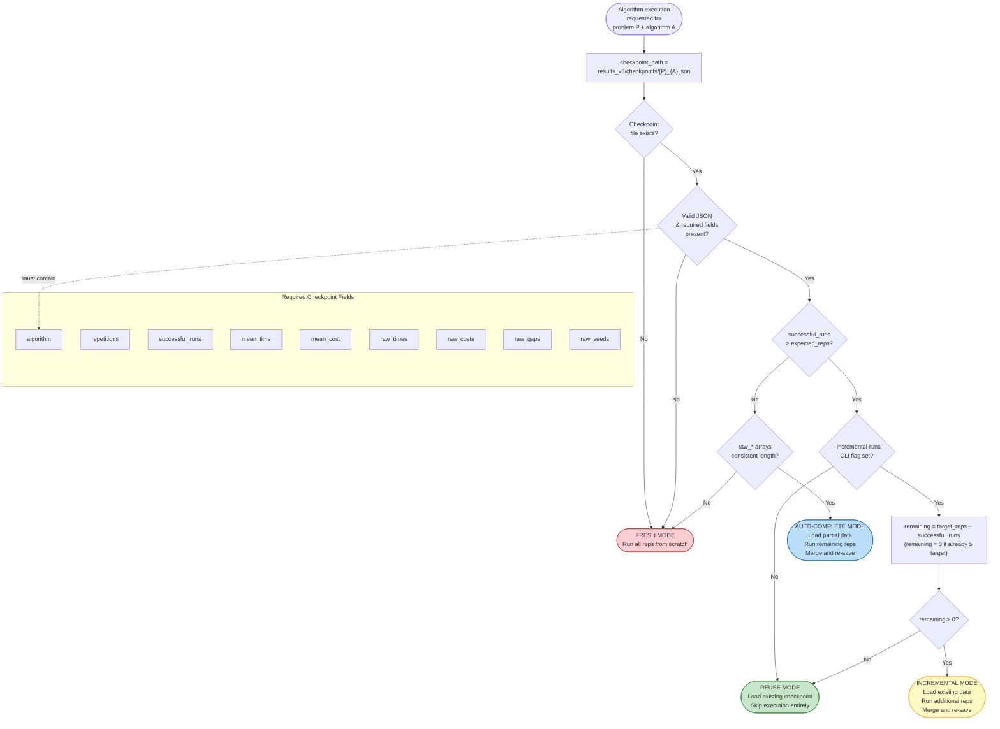
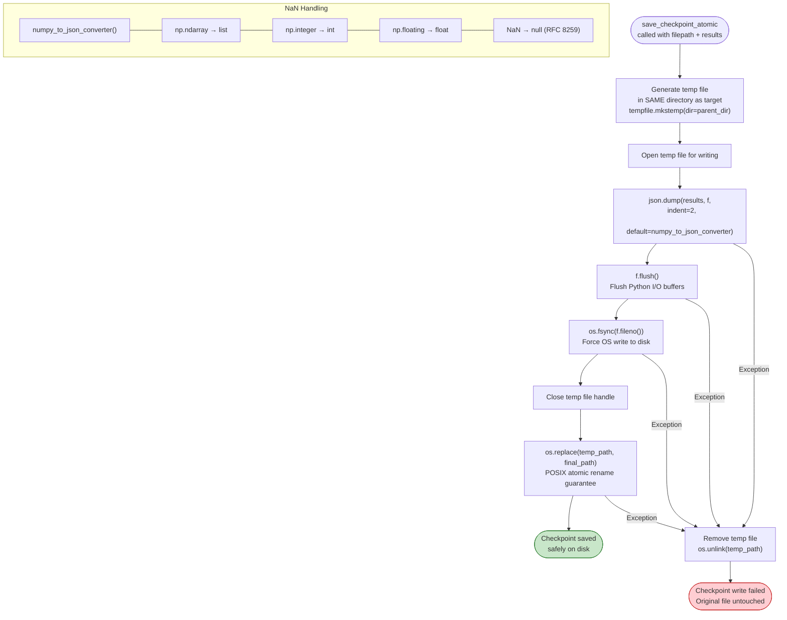
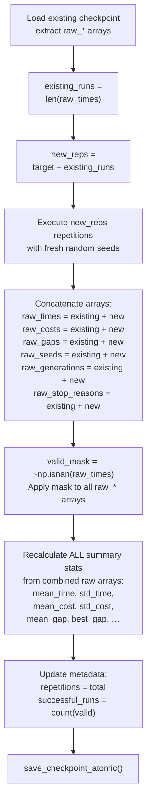
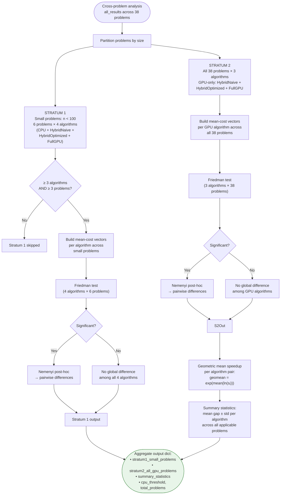
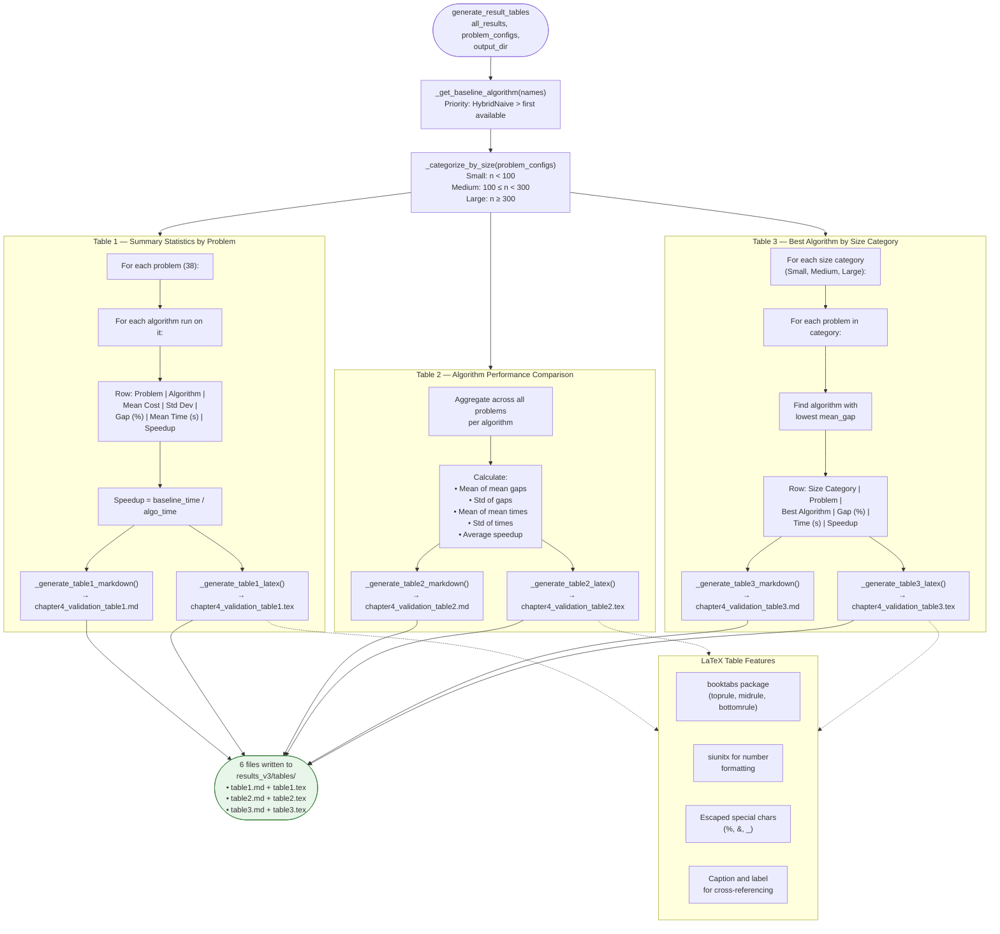

# Benchmarking V2 System — Comprehensive Documentation

> **System purpose:** Orchestrate rigorous, reproducible benchmarks of four Genetic Algorithm
> variants (CPU, HybridNaive, HybridOptimized, FullGPU) across 38 TSPLIB instances with
> 30 repetitions per configuration, followed by multi-level statistical analysis and
> automated report generation.

---

## Table of Contents

1. [Overview](#1-overview)
2. [Full Pipeline Sequence Diagram](#2-full-pipeline-sequence-diagram)
3. [Checkpoint System Flowchart](#3-checkpoint-system-flowchart)
4. [Statistical Analysis Flowchart](#4-statistical-analysis-flowchart)
5. [Configuration Loading Flowchart](#5-configuration-loading-flowchart)
6. [Report Generation Flowchart](#6-report-generation-flowchart)
7. [Module Interaction Diagram](#7-module-interaction-diagram)

---

## 1. Overview

### 1.1 Purpose

The benchmarking_v2 system measures and compares four GPU-acceleration strategies for the
Genetic Algorithm (GA) applied to the Travelling Salesman Problem (TSP). It collects
execution time, solution quality, convergence behaviour, and GPU transfer metrics, then
applies a rigorous statistical testing pipeline to determine whether observed differences
are statistically significant.

### 1.2 Architecture

```text
run_chapter4_benchmark.py          CLI entry point (argument parsing, environment validation)
  └→ orchestration.py              Main coordinator — drives the full pipeline
       ├→ config_loader.py         Load & validate JSON configs (algorithms, benchmark, problems)
       ├→ algorithm_runner.py      Execute individual algorithm repetitions with adaptive scaling
       ├→ checkpoint_io.py         Atomic checkpoint save / load / resume / incremental
       ├→ statistics.py            Core statistical primitives (Shapiro-Wilk, t-test, Wilcoxon,
       │                           Cohen's d, Friedman, Nemenyi, Holm-Bonferroni, bootstrap CI)
       ├→ problem_statistics.py    Per-problem statistical analysis across algorithms
       ├→ aggregate_statistics.py  Cross-problem stratified analysis (small+all vs GPU-only)
       └→ report_generator.py     Markdown + LaTeX table generation (3 table types)
```

### 1.3 Key Numbers

| Dimension | Value |
|-----------|-------|
| Algorithm variants | 4 (CPU, HybridNaive, HybridOptimized, FullGPU) |
| TSPLIB instances | 38 (eil51 … pr1002, sizes 51–1002) |
| Default repetitions | 30 per algorithm per problem |
| GA population size | 256 |
| Mutation rate | 0.02 |
| Tournament size | 5 |
| 2-opt iterations | 10 |
| Base seed | 42 |
| CPU size threshold | 100 (CPU algorithm only runs on problems with n ≤ 100) |
| Max generations | adaptive: `2 × n × √n` |
| Early-stop patience | adaptive: `2 × √n` |

### 1.4 Adaptive Scaling Formulas

**Max generations** — scales with problem complexity to balance convergence time and
solution quality:

```
generations(n) = 2 × n × √n

  n = 51   →   728
  n = 100  →  2000
  n = 318  → 11 324
  n = 1002 → 63 456
```

**Early-stop patience** — stagnation window before halting:

```
patience(n) = 2 × √n

  n = 51  → 14
  n = 100 → 20
  n = 318 → 36
  n = 1002→ 63
```

### 1.5 Metrics Collected per Repetition

| Metric | Description |
|--------|-------------|
| `elapsed_time` | Wall-clock time via `time.perf_counter()` |
| `initial_cost` | Tour cost after construction heuristic |
| `final_cost` | Best tour cost after GA evolution |
| `gap` | `(final_cost − optimal) / optimal × 100` (%) |
| `improvement` | `(initial_cost − final_cost) / initial_cost × 100` (%) |
| `generations_completed` | Generations actually executed before stopping |
| `stop_reason` | `"completed"` or `"early_stop"` |
| `h2d_bytes` | Host-to-device transfer volume (GPU only) |
| `d2h_bytes` | Device-to-host transfer volume (GPU only) |
| `kernel_launches` | Number of GPU kernel invocations (GPU only) |

### 1.6 Algorithm Variants

| Name | Module | Class | GPU |
|------|--------|-------|-----|
| CPU | `genetic_algorithm_cpu` | `GeneticAlgorithmCPU` | No |
| HybridNaive | `genetic_algorithm_hybrid_naive` | `GeneticAlgorithmHybridNaive` | Yes |
| HybridOptimized | `genetic_algorithm_hybrid_optimized` | `GeneticAlgorithmHybridOptimized` | Yes |
| FullGPU | `genetic_algorithm_full_gpu_early_stop` | `GeneticAlgorithmFullGPUEarlyStop` | Yes |

### 1.7 Problem Set (38 TSPLIB Instances)

| # | Name | Size (n) | Optimal | Category |
|---|------|----------|---------|----------|
| 1 | eil51 | 51 | 426 | Small |
| 2 | berlin52 | 52 | 7 542 | Small |
| 3 | st70 | 70 | 675 | Small |
| 4 | eil76 | 76 | 538 | Small |
| 5 | pr76 | 76 | 108 159 | Small |
| 6 | rat99 | 99 | 1 211 | Small |
| 7 | kroA100 | 100 | 21 282 | Medium |
| 8 | kroB100 | 100 | 22 141 | Medium |
| 9 | kroC100 | 100 | 20 749 | Medium |
| 10 | kroD100 | 100 | 21 294 | Medium |
| 11 | kroE100 | 100 | 22 068 | Medium |
| 12 | rd100 | 100 | 7 910 | Medium |
| 13 | eil101 | 101 | 629 | Medium |
| 14 | lin105 | 105 | 14 379 | Medium |
| 15 | pr107 | 107 | 44 303 | Medium |
| 16 | pr124 | 124 | 59 030 | Medium |
| 17 | bier127 | 127 | 118 282 | Medium |
| 18 | ch130 | 130 | 6 110 | Medium |
| 19 | pr136 | 136 | 96 772 | Medium |
| 20 | pr144 | 144 | 58 537 | Medium |
| 21 | ch150 | 150 | 6 528 | Medium |
| 22 | kroA150 | 150 | 26 524 | Medium |
| 23 | kroB150 | 150 | 26 130 | Medium |
| 24 | pr152 | 152 | 73 682 | Medium |
| 25 | u159 | 159 | 42 080 | Medium |
| 26 | rat195 | 195 | 2 323 | Medium |
| 27 | d198 | 198 | 15 780 | Medium |
| 28 | kroA200 | 200 | 29 368 | Medium |
| 29 | ts225 | 225 | 126 643 | Medium |
| 30 | pr264 | 264 | 49 135 | Medium |
| 31 | pr299 | 299 | 48 191 | Medium |
| 32 | lin318 | 318 | 42 029 | Large |
| 33 | rd400 | 400 | 15 281 | Large |
| 34 | fl417 | 417 | 11 861 | Large |
| 35 | pr439 | 439 | 107 217 | Large |
| 36 | pcb442 | 442 | 50 778 | Large |
| 37 | rat783 | 783 | 8 806 | Large |
| 38 | pr1002 | 1 002 | 259 045 | Large |

> **Size categories:** Small (n < 100), Medium (100 ≤ n < 300), Large (n ≥ 300)

---

## 2. Full Pipeline Sequence Diagram

```mermaid
sequenceDiagram
    autonumber

    participant CLI as CLI<br/>(run_chapter4_benchmark.py)
    participant Orch as Orchestrator<br/>(orchestration.py)
    participant CfgL as ConfigLoader<br/>(config_loader.py)
    participant CkptM as CheckpointManager<br/>(checkpoint_io.py)
    participant Runner as AlgorithmRunner<br/>(algorithm_runner.py)
    participant Algo as Algorithm<br/>(GA variant)
    participant Stats as StatisticalAnalyzer<br/>(statistics.py)
    participant PStats as ProblemStats<br/>(problem_statistics.py)
    participant AggStats as AggregateStats<br/>(aggregate_statistics.py)
    participant Report as ReportGenerator<br/>(report_generator.py)

    %% ── Phase 1: Initialisation ──────────────────────────
    rect rgb(240, 248, 255)
        Note over CLI,Report: Phase 1 — Initialisation
        CLI->>CLI: parse_arguments()
        CLI->>CLI: setup_logging(INFO)
        CLI->>CLI: validate_environment()<br/>check configs, database, output dirs

        CLI->>+Orch: run_comprehensive_benchmark(args)
        Orch->>+CfgL: load_all_configs(config_dir)
        CfgL->>CfgL: load_algorithms_config()<br/>→ GAParams + Dict[str, AlgorithmConfig]
        CfgL->>CfgL: load_benchmark_config()<br/>→ BenchmarkConfig
        CfgL->>CfgL: load_problems_config()<br/>→ List[ProblemConfig] (38 items)
        CfgL->>CfgL: validate_configs() → warnings
        CfgL-->>-Orch: configs dict

        Orch->>Orch: _log_benchmark_configuration()
        Orch->>+CkptM: CheckpointManager(checkpoint_dir, problem_stats_dir)
        CkptM->>CkptM: ensure_directories()
        CkptM-->>-Orch: manager instance
        Orch->>CkptM: count_completed_checkpoints(problems, algorithms, reps)
        CkptM-->>Orch: (completed, total) — progress summary
        Orch->>Stats: StatisticalAnalyzer(alpha=0.05)
    end

    %% ── Phase 2: Benchmark Execution Loop ────────────────
    rect rgb(255, 255, 240)
        Note over CLI,Report: Phase 2 — Benchmark Execution (Problems × Algorithms)

        loop 38 TSPLIB problems
            Orch->>Orch: _determine_problem_algorithms(problem_size, cpu_threshold)
            Note right of Orch: n ≤ 100 → [CPU, HybridNaive,<br/>HybridOptimized, FullGPU]<br/>n > 100 → [HybridNaive,<br/>HybridOptimized, FullGPU]

            Orch->>Orch: adaptive_generations(n) = 2·n·√n
            Orch->>Orch: adaptive_patience(n) = 2·√n
            Orch->>Orch: DatabaseLoader.load(problem_name)

            loop Up to 4 algorithms per problem
                Orch->>CkptM: get_checkpoint_path(problem, algorithm)
                CkptM-->>Orch: filepath

                alt REUSE — checkpoint valid & complete
                    Orch->>CkptM: is_valid_checkpoint(path, expected_reps)
                    CkptM-->>Orch: true
                    Orch->>CkptM: load_checkpoint(path)
                    CkptM-->>Orch: existing data
                    Note right of Orch: Skip execution —<br/>reuse cached results

                else INCREMENTAL — checkpoint valid but incomplete
                    Orch->>CkptM: can_resume_checkpoint(path, expected_reps)
                    CkptM-->>Orch: true
                    Orch->>CkptM: get_remaining_repetitions(path, expected_reps)
                    CkptM-->>Orch: remaining_reps
                    Orch->>CkptM: load_checkpoint(path)
                    CkptM-->>Orch: existing_checkpoint

                    Orch->>+Runner: run_single_algorithm(<br/>  algorithm, problem, remaining_reps,<br/>  existing_checkpoint, incremental=true)

                    loop remaining_reps repetitions
                        Runner->>Runner: seed = np.random.randint(0, 2³¹−1)
                        Runner->>Runner: ProblemContext(problem, xp, seed)
                        Runner->>+Algo: evolve(context, customers,<br/>  max_generations, patience)
                        Algo-->>-Runner: stats dict
                        Runner->>Runner: Extract metrics:<br/>time, cost, gap,<br/>improvement, generations,<br/>stop_reason, h2d/d2h bytes,<br/>kernel_launches
                        Runner->>Runner: Append to raw_* arrays

                        alt Run succeeds
                            Runner->>Runner: Append valid metrics
                        else Run raises exception
                            Runner->>Runner: Log error
                            Runner->>Runner: Append NaN to all metrics
                        end

                        Runner->>Runner: cleanup_gpu_memory()
                    end

                    Runner->>Runner: Merge existing + new raw_* arrays
                    Runner->>Runner: Recalculate summary statistics<br/>(mean, std, min, max from combined data)
                    Runner-->>-Orch: results dict (merged)

                    Orch->>CkptM: save_checkpoint_atomic(path, results)

                else FRESH — no valid checkpoint
                    Orch->>+Runner: run_single_algorithm(<br/>  algorithm, problem, all_reps,<br/>  existing_checkpoint=None,<br/>  incremental=false)

                    loop all repetitions (e.g. 30)
                        Runner->>Runner: seed = np.random.randint(0, 2³¹−1)
                        Runner->>Runner: ProblemContext(problem, xp, seed)
                        Runner->>+Algo: evolve(context, customers,<br/>  max_generations, patience)
                        Algo-->>-Runner: stats dict
                        Runner->>Runner: Extract metrics
                        Runner->>Runner: Append to raw_* arrays

                        alt Run succeeds
                            Runner->>Runner: Append valid metrics
                        else Run raises exception
                            Runner->>Runner: Log error
                            Runner->>Runner: Append NaN to all metrics
                        end

                        Runner->>Runner: cleanup_gpu_memory()
                    end

                    Runner->>Runner: Filter valid runs (non-NaN mask)
                    Runner->>Runner: Calculate summary statistics
                    Runner-->>-Orch: results dict

                    Orch->>CkptM: save_checkpoint_atomic(path, results)
                end

                Orch->>Orch: cleanup_resources(use_gpu)<br/>gc.collect() + free CuPy pool
            end

            %% ── Per-problem statistics ──
            Orch->>+PStats: perform_statistical_analysis(<br/>  problem_name, optimal_cost,<br/>  results, analyzer)

            PStats->>Stats: friedman_test(cost_arrays) [k ≥ 3]
            Stats-->>PStats: {statistic, p_value, significant}

            opt Friedman significant (p < 0.05)
                PStats->>Stats: nemenyi_posthoc(cost_arrays, names)
                Stats-->>PStats: {p_values_matrix, significant_pairs,<br/>  critical_distance, mean_ranks}
            end

            loop All algorithm pairs
                PStats->>Stats: test_normality(data_a) → Shapiro-Wilk
                PStats->>Stats: test_normality(data_b) → Shapiro-Wilk

                alt Both normal (p ≥ 0.05)
                    PStats->>Stats: paired t-test
                else At least one non-normal
                    PStats->>Stats: Wilcoxon signed-rank test
                end

                PStats->>Stats: cohens_d(data_a, data_b)
                PStats->>Stats: 95% CI (t-distribution)
            end

            PStats->>Stats: holm_bonferroni_correction(p_values)
            Stats-->>PStats: corrected p-values + significance flags

            PStats-->>-Orch: problem_stats dict

            Orch->>Orch: _save_problem_statistics_file(problem_stats)
        end
    end

    %% ── Phase 3: Cross-Problem Analysis ──────────────────
    rect rgb(245, 255, 245)
        Note over CLI,Report: Phase 3 — Cross-Problem Stratified Analysis

        Orch->>+AggStats: perform_cross_problem_analysis_stratified(<br/>  all_results, problem_configs,<br/>  analyzer, cpu_threshold=100)

        Note over AggStats: STRATUM 1 — Small problems (n < 100)<br/>All 4 algorithms (CPU + GPU)
        AggStats->>Stats: friedman_test(4 cost arrays × 6 problems)
        Stats-->>AggStats: Friedman result
        opt Friedman significant
            AggStats->>Stats: nemenyi_posthoc(cost_arrays, names)
            Stats-->>AggStats: pairwise significance
        end

        Note over AggStats: STRATUM 2 — All 38 problems<br/>GPU-only: HybridNaive, HybridOptimized, FullGPU
        AggStats->>Stats: friedman_test(3 cost arrays × 38 problems)
        Stats-->>AggStats: Friedman result
        opt Friedman significant
            AggStats->>Stats: nemenyi_posthoc(cost_arrays, names)
            Stats-->>AggStats: pairwise significance
        end

        AggStats->>AggStats: Compute geometric mean speedups<br/>per algorithm pair across problems
        AggStats->>AggStats: Compute summary statistics<br/>(mean gap, std gap per algorithm)
        AggStats-->>-Orch: aggregate_stats dict
    end

    %% ── Phase 4: Report Generation ──────────────────────
    rect rgb(255, 245, 245)
        Note over CLI,Report: Phase 4 — Report Generation

        Orch->>+Report: generate_result_tables(<br/>  all_results, problem_configs, output_dir)

        Report->>Report: Table 1 — Summary by Problem<br/>(Problem | Algo | Mean Cost | Std | Gap% | Time | Speedup)
        Report->>Report: _generate_table1_markdown()
        Report->>Report: _generate_table1_latex()

        Report->>Report: Table 2 — Algorithm Comparison<br/>(Algo | Mean Gap% | Std Gap | Mean Time | Std Time | Avg Speedup)
        Report->>Report: _generate_table2_markdown()
        Report->>Report: _generate_table2_latex()

        Report->>Report: Table 3 — Best by Size Category<br/>(Category | Problem | Best Algo | Gap% | Time | Speedup)
        Report->>Report: _generate_table3_markdown()
        Report->>Report: _generate_table3_latex()

        Report-->>-Orch: (files written to results_v3/tables/)
    end

    Orch-->>-CLI: all_results dict
    CLI->>CLI: Log completion summary
```



---

## 3. Checkpoint System Flowchart



### 3.1 Atomic Write Process



### 3.2 Resume / Incremental Merge Logic



---

## 4. Statistical Analysis Flowchart

### 4.1 Per-Problem Analysis Pipeline

```mermaid
flowchart TD
    Input([Per-problem analysis<br/>problem_name + optimal_cost +<br/>algorithm_results dict])

    Input --> ExtractCosts["Extract raw_costs array<br/>per algorithm<br/>(filter NaN)"]
    ExtractCosts --> CountAlgos{Number of<br/>algorithms ≥ 3?}

    %% ── Friedman Test ──
    CountAlgos -- Yes --> Friedman["Friedman Test<br/>(non-parametric k-sample)<br/>H₀: All algorithms equivalent<br/>χ² statistic"]
    CountAlgos -- No --> SkipFriedman["Skip Friedman test<br/>(need k ≥ 3 related samples)"]
    SkipFriedman --> Pairwise

    Friedman --> FriedSig{p-value < α<br/>(α = 0.05)?}

    FriedSig -- Yes --> Nemenyi["Nemenyi Post-Hoc Test<br/>CD = q_α × √(k·(k+1) / (6·n))<br/>Significant if |rank_i − rank_j| > CD"]
    Nemenyi --> NemResult["Output:<br/>• p-values matrix (k × k)<br/>• significant pairs<br/>• critical distance<br/>• mean ranks per algorithm"]
    NemResult --> Pairwise

    FriedSig -- No --> FriedNS["No significant global<br/>difference detected"]
    FriedNS --> Pairwise

    %% ── Pairwise Comparisons ──
    Pairwise["Begin pairwise comparisons<br/>for all C(k,2) algorithm pairs"]

    Pairwise --> PairLoop

    subgraph PairLoop [For each algorithm pair A vs B]
        direction TB
        NormA["Shapiro-Wilk test on data_A<br/>H₀: data_A is normally distributed<br/>p_A = shapiro(data_A)"]
        NormB["Shapiro-Wilk test on data_B<br/>H₀: data_B is normally distributed<br/>p_B = shapiro(data_B)"]
        NormA --> NormCheck{Both normal?<br/>p_A ≥ 0.05 AND<br/>p_B ≥ 0.05}
        NormB --> NormCheck

        NormCheck -- Yes --> TTest["Paired t-test<br/>(parametric)<br/>scipy.stats.ttest_rel()"]
        NormCheck -- No --> Wilcoxon["Wilcoxon signed-rank<br/>(non-parametric)<br/>scipy.stats.wilcoxon()"]

        TTest --> EffectSize
        Wilcoxon --> EffectSize

        EffectSize["Cohen's d effect size<br/>d = (μ_A − μ_B) / σ_pooled<br/>σ_pooled = √((σ_A² + σ_B²) / 2)"]
        EffectSize --> Interpret{"Interpret |d|"}

        Interpret --> |"< 0.2"| Neg["Negligible"]
        Interpret --> |"0.2 – 0.5"| Sml["Small"]
        Interpret --> |"0.5 – 0.8"| Med["Medium"]
        Interpret --> |"≥ 0.8"| Lrg["Large"]

        Neg --> CI95
        Sml --> CI95
        Med --> CI95
        Lrg --> CI95

        CI95["95% Confidence Interval<br/>for mean difference<br/>(t-distribution based)"]
        CI95 --> PairResult["Output per pair:<br/>test_used, p_value,<br/>cohens_d, CI_95,<br/>normality p-values,<br/>effect interpretation"]
    end

    PairResult --> CollectP["Collect all pairwise p-values"]
    CollectP --> HolmBonf

    %% ── Multiple Comparison Correction ──
    subgraph HolmBonf [Holm-Bonferroni Correction]
        direction TB
        Sort["1. Sort p-values ascending<br/>p₁ ≤ p₂ ≤ … ≤ p_m"]
        Sort --> Compare["2. For i = 1 to m:<br/>threshold_i = α / (m − i + 1)"]
        Compare --> Reject{"p_i ≤ threshold_i?"}
        Reject -- Yes --> RejectH0["Reject H₀_i<br/>(significant difference)"]
        RejectH0 --> NextI["Continue to i + 1"]
        NextI --> Reject
        Reject -- No --> StopReject["Stop rejecting<br/>All remaining H₀ retained"]
    end

    HolmBonf --> Output([Per-problem statistics output:<br/>• Friedman test result<br/>• Nemenyi post-hoc (if applicable)<br/>• Pairwise comparisons with<br/>  corrected p-values<br/>• Effect sizes and CIs])
    style Output fill:#e8f5e9,stroke:#2e7d32
```

### 4.2 Cross-Problem Stratified Analysis



---

## 5. Configuration Loading Flowchart

```mermaid
flowchart TD
    Start([load_all_configs<br/>config_dir path])

    Start --> LoadAlgo["load_algorithms_config(config_dir)"]
    Start --> LoadBench["load_benchmark_config(config_dir)"]
    Start --> LoadProb["load_problems_config(config_dir)"]

    %% ── Algorithms Config ──
    subgraph AlgoLoad [algorithms.json Loading]
        direction TB
        A1["Read algorithms.json"]
        A1 --> A2["Parse ga_params section →<br/>GAParams dataclass:<br/>• population_size: 256<br/>• mutation_rate: 0.02<br/>• tournament_size: 5<br/>• two_opt_iterations: 10<br/>• seed: 42"]
        A2 --> A3["Parse algorithm_configs section →<br/>Dict[str, AlgorithmConfig]"]
        A3 --> A4["For each algorithm entry:<br/>AlgorithmConfig(<br/>  name, class_module,<br/>  class_name, use_gpu,<br/>  description)"]
        A4 --> A5["AlgorithmConfig.get_class()<br/>→ dynamic import via<br/>importlib.import_module()"]
    end

    LoadAlgo --> A1

    %% ── Benchmark Config ──
    subgraph BenchLoad [benchmark.json Loading]
        direction TB
        B1["Read benchmark.json"]
        B1 --> B2["Parse → BenchmarkConfig:<br/>• repetitions: 15 (default)<br/>• patience: null (→ adaptive)<br/>• cpu_size_threshold: 100<br/>• skip_cpu_default: false<br/>• incremental_runs: false<br/>• line_width: 80"]
        B2 --> B3["Properties:<br/>separator = '=' × line_width<br/>short_sep = '-' × line_width"]
    end

    LoadBench --> B1

    %% ── Problems Config ──
    subgraph ProbLoad [problems.json Loading]
        direction TB
        P1["Read problems.json"]
        P1 --> P2["Parse JSON array (38 entries)"]
        P2 --> P3["For each entry →<br/>ProblemConfig(name, optimal, size)"]
        P3 --> P4["Return List[ProblemConfig]<br/>ordered by file order"]
    end

    LoadProb --> P1

    %% ── Validation ──
    A5 --> Validate
    B3 --> Validate
    P4 --> Validate

    Validate["validate_configs(configs)"]
    Validate --> V1{"population_size > 0?"}
    V1 -- No --> Warn1["Warning: Invalid population_size"]
    V1 -- Yes --> V2{"0 ≤ mutation_rate ≤ 1?"}
    V2 -- No --> Warn2["Warning: Invalid mutation_rate"]
    V2 -- Yes --> V3{"tournament_size > 0?"}
    V3 -- No --> Warn3["Warning: Invalid tournament_size"]
    V3 -- Yes --> V4{"All problem sizes > 0?"}
    V4 -- No --> Warn4["Warning: Invalid problem size"]
    V4 -- Yes --> V5{"No duplicate problem names?"}
    V5 -- No --> Warn5["Warning: Duplicate problems"]
    V5 -- Yes --> Valid

    Warn1 --> Valid
    Warn2 --> Valid
    Warn3 --> Valid
    Warn4 --> Valid
    Warn5 --> Valid

    Valid([Validated configs dict:<br/>• ga_params: GAParams<br/>• algorithms: Dict[str, AlgorithmConfig]<br/>• benchmark: BenchmarkConfig<br/>• problems: List[ProblemConfig]])
    style Valid fill:#e8f5e9,stroke:#2e7d32

    %% ── Algorithm Selection per Problem ──
    subgraph AlgoSelect [_determine_problem_algorithms]
        direction TB
        D1{"problem_size ≤<br/>cpu_size_threshold?"}
        D1 -- Yes --> D2["All algorithms:<br/>CPU + HybridNaive +<br/>HybridOptimized + FullGPU"]
        D1 -- No --> D3["GPU only:<br/>HybridNaive +<br/>HybridOptimized + FullGPU"]
        D4{"--skip-cpu flag set?"}
        D4 -- Yes --> D5["Remove CPU from list"]
        D4 -- No --> D6["Keep algorithm list as-is"]
    end
```

---

## 6. Report Generation Flowchart



---

## 7. Module Interaction Diagram

```mermaid
classDiagram
    direction TB

    class CLI {
        +main()
        +parse_arguments() Namespace
        +setup_logging()
        +validate_environment()
    }

    class Orchestrator {
        +run_comprehensive_benchmark(args) Dict
        -_log_benchmark_configuration()
        -_determine_problem_algorithms() List~str~
        -_save_problem_statistics_file()
    }

    class ConfigLoader {
        +load_all_configs(config_dir) Dict
        +load_algorithms_config() Tuple~GAParams_Dict~
        +load_benchmark_config() BenchmarkConfig
        +load_problems_config() List~ProblemConfig~
        +validate_configs() List~str~
    }

    class GAParams {
        +population_size: int = 256
        +mutation_rate: float = 0.02
        +tournament_size: int = 5
        +two_opt_iterations: int = 10
        +seed: int = 42
        +to_dict() Dict
    }

    class AlgorithmConfig {
        +name: str
        +class_module: str
        +class_name: str
        +use_gpu: bool
        +description: str
        +get_class() Type
    }

    class BenchmarkConfig {
        +repetitions: int = 15
        +patience: Optional~int~
        +cpu_size_threshold: int = 100
        +skip_cpu_default: bool
        +incremental_runs: bool
        +line_width: int = 80
        +separator: str
        +short_sep: str
    }

    class ProblemConfig {
        +name: str
        +optimal: float
        +size: int
    }

    class AlgorithmRunner {
        +adaptive_generations(n) int
        +adaptive_patience(n) int
        +run_single_algorithm() Dict
        +cleanup_gpu_memory()
        +cleanup_resources(use_gpu)
    }

    class CheckpointManager {
        +checkpoint_dir: Path
        +problem_stats_dir: Path
        +ensure_directories()
        +get_checkpoint_path(problem, algo) Path
        +get_problem_stats_path(problem) Path
        +is_valid_checkpoint(problem, algo, reps) bool
        +can_resume_checkpoint(problem, algo, reps) bool
        +get_remaining_repetitions(problem, algo, reps) int
        +count_completed_checkpoints() Tuple~int_int~
    }

    class CheckpointIO {
        +save_checkpoint(filepath, results, atomic)
        +save_checkpoint_atomic(filepath, results)
        +load_checkpoint(filepath) Dict
        +is_valid_checkpoint(filepath, reps) bool
        +can_resume_checkpoint(filepath, reps) bool
        +get_remaining_repetitions(filepath, reps) int
        +numpy_to_json_converter(obj)
    }

    class StatisticalAnalyzer {
        +alpha: float = 0.05
        +test_normality(data) Tuple~float_bool~
        +paired_comparison(a, b, label, metric) StatisticalSummary
        +cohens_d(a, b) float
        +bootstrap_ci(data, func, level, n) Tuple
        +holm_bonferroni_correction(pvals, alpha) List
        +friedman_test(data_sets) Dict
        +nemenyi_posthoc(data_sets, names) Dict
    }

    class StatisticalSummary {
        +comparison_label: str
        +metric_name: str
        +sample_size: int
        +mean_a: float
        +mean_b: float
        +std_a: float
        +std_b: float
        +ci_95_a: Tuple
        +ci_95_b: Tuple
        +mean_difference: float
        +ci_95_difference: Tuple
        +p_value: float
        +effect_size: float
        +test_used: str
        +normality_p_value_a: float
        +normality_p_value_b: float
        +is_normal: bool
        +get_speedup() float
        +is_significant(alpha) bool
    }

    class ProblemStatistics {
        +perform_statistical_analysis(problem, optimal, results, analyzer) Dict
    }

    class AggregateStatistics {
        +perform_cross_problem_analysis_stratified(results, configs, analyzer, threshold) Dict
    }

    class ReportGenerator {
        +generate_result_tables(results, configs, output_dir)
        -_get_baseline_algorithm(names) str
        -_get_problem_size(name, configs) int
        -_categorize_by_size(configs) Dict
        -_generate_table1_markdown()
        -_generate_table1_latex()
        -_generate_table2_markdown()
        -_generate_table2_latex()
        -_generate_table3_markdown()
        -_generate_table3_latex()
    }

    %% ── Relationships ──
    CLI --> Orchestrator : calls run_comprehensive_benchmark
    Orchestrator --> ConfigLoader : loads configuration
    Orchestrator --> CheckpointManager : manages checkpoints
    Orchestrator --> AlgorithmRunner : executes algorithms
    Orchestrator --> ProblemStatistics : per-problem analysis
    Orchestrator --> AggregateStatistics : cross-problem analysis
    Orchestrator --> ReportGenerator : generates tables

    ConfigLoader --> GAParams : creates
    ConfigLoader --> AlgorithmConfig : creates
    ConfigLoader --> BenchmarkConfig : creates
    ConfigLoader --> ProblemConfig : creates

    CheckpointManager --> CheckpointIO : delegates I/O
    AlgorithmRunner --> CheckpointIO : saves results

    ProblemStatistics --> StatisticalAnalyzer : uses for tests
    AggregateStatistics --> StatisticalAnalyzer : uses for tests
    StatisticalAnalyzer --> StatisticalSummary : produces
```



---

## Appendix A — File Locations

| Module | Path | Lines |
|--------|------|-------|
| CLI Entry | `code/benchmarks_v2/run_chapter4_benchmark.py` | ~243 |
| Orchestration | `code/src/benchmarking_v2/orchestration.py` | ~589 |
| Config Loader | `code/src/benchmarking_v2/config_loader.py` | ~404 |
| Algorithm Runner | `code/src/benchmarking_v2/algorithm_runner.py` | ~478 |
| Checkpoint I/O | `code/src/benchmarking_v2/checkpoint_io.py` | ~586 |
| Statistics | `code/src/benchmarking_v2/statistics.py` | ~622 |
| Problem Statistics | `code/src/benchmarking_v2/problem_statistics.py` | ~441 |
| Aggregate Statistics | `code/src/benchmarking_v2/aggregate_statistics.py` | ~381 |
| Report Generator | `code/src/benchmarking_v2/report_generator.py` | ~750 |
| Stats Utilities | `code/src/benchmarking_v2/stats_utils.py` | ~155 |

**Config files:**

| File | Path |
|------|------|
| algorithms.json | `code/benchmarks_v2/configs/algorithms.json` |
| benchmark.json | `code/benchmarks_v2/configs/benchmark.json` |
| problems.json | `code/benchmarks_v2/configs/problems.json` |

## Appendix B — Key Formulas Reference

| Formula | Expression | Purpose |
|---------|------------|---------|
| Adaptive generations | `2 × n × √n` | Scale computation budget with problem size |
| Adaptive patience | `2 × √n` | Scale early-stop stagnation window |
| Optimality gap | `(cost − optimal) / optimal × 100` | Solution quality vs known optimum (%) |
| Improvement | `(initial − final) / initial × 100` | GA improvement over initial solution (%) |
| Cohen's d | `(μ_A − μ_B) / √((σ_A² + σ_B²) / 2)` | Standardised effect size between algorithms |
| Holm-Bonferroni | `α / (m − i + 1)` for sorted p_i | Adjusted significance threshold |
| Nemenyi CD | `q_α × √(k(k+1) / (6n))` | Critical distance for rank differences |
| Geometric mean speedup | `exp(mean(ln(s_1), …, ln(s_n)))` | Aggregate speedup across problems |
| Bootstrap CI | Percentile method, 10 000 resamples | Non-parametric confidence intervals |

## Appendix C — Checkpoint JSON Schema

```json
{
  "algorithm": "string",
  "problem_name": "string",
  "problem_size": "int",
  "optimal_cost": "float",
  "backend": "CPU | GPU",
  "repetitions": "int",
  "successful_runs": "int",

  "mean_time": "float", "std_time": "float",
  "min_time": "float",  "max_time": "float",

  "mean_cost": "float", "std_cost": "float",
  "best_cost": "float", "worst_cost": "float",

  "mean_gap": "float",  "std_gap": "float",  "best_gap": "float",
  "mean_initial_cost": "float", "std_initial_cost": "float",
  "mean_improvement": "float",

  "mean_generations": "float", "std_generations": "float",
  "min_generations": "float",  "max_generations": "float",

  "mean_h2d_mb": "float", "mean_d2h_mb": "float",
  "total_transfer_mb": "float", "mean_kernels": "float",

  "raw_times": ["float"],
  "raw_costs": ["float"],
  "raw_initial_costs": ["float"],
  "raw_gaps": ["float"],
  "raw_generations": ["int"],
  "raw_stop_reasons": ["string"],
  "raw_seeds": ["int"],

  "algorithm_config": {
    "population_size": "int",
    "mutation_rate": "float",
    "tournament_size": "int",
    "two_opt_iterations": "int"
  },
  "timestamp": "ISO 8601"
}
```
