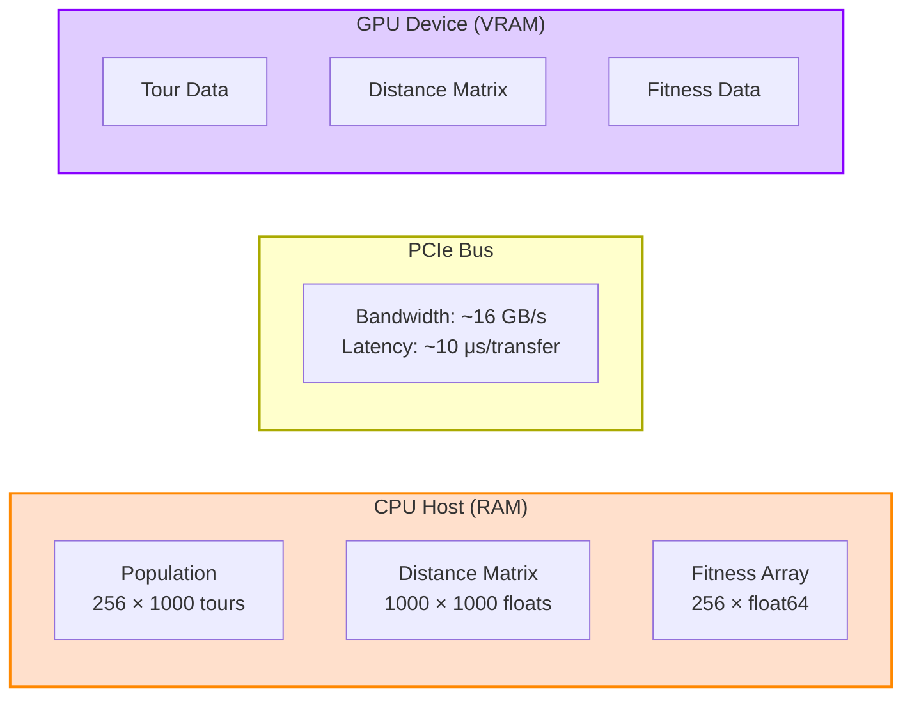
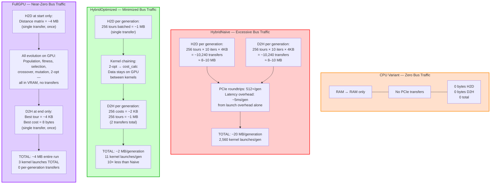
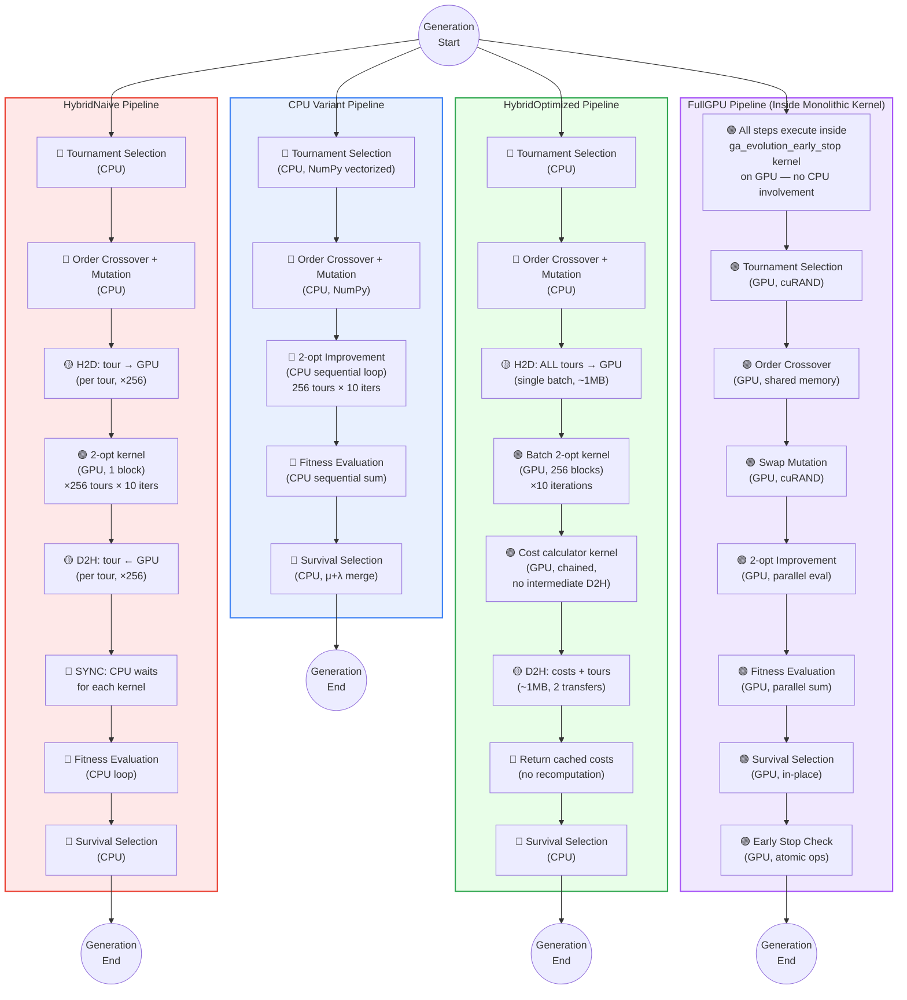

# Comparative Analysis: Iso-Algorithmic Genetic Algorithm Variants

> **Purpose**: Side-by-side comparison of four iso-algorithmic GA variants that share identical
> algorithm logic but differ in execution platform and GPU utilization strategy.

---

## Table of Contents

1. [Overview](#1-overview)
2. [Side-by-Side Generation Sequence Diagram](#2-side-by-side-generation-sequence-diagram)
3. [Architecture Comparison Flowchart](#3-architecture-comparison-flowchart)
4. [Memory Transfer Pattern Comparison](#4-memory-transfer-pattern-comparison)
5. [Template Method Pattern Diagram](#5-template-method-pattern-diagram)
6. [Evolution Pipeline Comparison](#6-evolution-pipeline-comparison)
7. [Performance Comparison Tables](#7-performance-comparison-tables)
8. [Trade-off Analysis](#8-trade-off-analysis)

---

## 1. Overview

### Iso-Algorithmic Design Philosophy

All four variants implement the **same genetic algorithm** with identical parameters:

| Parameter | Value | Rationale |
|-----------|-------|-----------|
| Population size | 256 | Power of 2 for GPU warp alignment |
| Mutation rate | 0.02 | 2% swap mutation probability |
| Tournament size | 5 | Strong selection pressure |
| 2-opt iterations | 10 | Local search refinement per tour |
| Random seed | 42 | Reproducible results |

All variants use the **same operator implementations**:

- **Selection**: `TournamentSelection` — k-tournament (k=5), NumPy vectorized
- **Crossover**: `OrderCrossover` (OX) — Davis 1985, preserves city ordering
- **Mutation**: `SwapMutation` — random position swap, O(1) per tour

The **only** differences are in how `_improve_population()` (2-opt local search) and
`_evaluate_population()` (fitness/cost calculation) are executed, and where data resides
during those operations (CPU RAM vs GPU VRAM).

### Comparison Goals

By holding the algorithm constant, this comparison **isolates execution-platform effects**:

1. **Parallelism granularity**: Sequential CPU → individual GPU kernels → batch GPU kernels → monolithic GPU kernel
2. **Memory transfer overhead**: Zero (CPU) → excessive (Naive) → minimized (Optimized) → near-zero (FullGPU)
3. **Kernel launch overhead**: Zero → 2,560/gen → 11/gen → 3 total
4. **Speed vs. quality trade-off**: Fastest execution vs. best solution quality

### The Four Variants

| Variant | Class | Strategy | Key Characteristic |
|---------|-------|----------|--------------------|
| **CPU** | `GeneticAlgorithmCPU` | Pure NumPy, sequential | Baseline reference |
| **HybridNaive** | `GeneticAlgorithmHybridNaive` | Individual GPU kernel calls | Bottleneck demonstration |
| **HybridOptimized** | `GeneticAlgorithmHybridOptimized` | Batch GPU + kernel chaining | Maximum throughput |
| **FullGPU** | `GeneticAlgorithmFullGPUEarlyStop` | Monolithic Fujimoto kernel | Entire evolution on GPU |

---

## 2. Side-by-Side Generation Sequence Diagram

The following diagram shows how a **single generation** differs across all four variants.
Common operations (selection, crossover, mutation) are identical; the highlighted regions
show where each variant diverges.

```mermaid
sequenceDiagram
    participant CPU as CPU (Host)
    participant PCIe as PCIe Bus
    participant GPU as GPU (Device)

    Note over CPU,GPU: ═══════ PHASE 1: COMMON OPERATIONS (All Variants) ═══════

    rect rgb(220, 235, 255)
        Note over CPU: Tournament Selection (k=5)<br/>NumPy vectorized, 256 parents selected
        CPU->>CPU: parent_indices = select(population, fitness)

        Note over CPU: Order Crossover (OX)<br/>256 offspring generated
        CPU->>CPU: offspring = crossover(population, parent_indices)

        Note over CPU: Swap Mutation (rate=0.02)<br/>~5 offspring mutated on average
        CPU->>CPU: offspring = mutate(offspring)
    end

    Note over CPU,GPU: ═══════ PHASE 2: _improve_population (DIFFERS) ═══════

    rect rgb(255, 235, 220)
        Note over CPU: ── CPU Variant ──
        Note over CPU: Sequential 2-opt (NumPy)<br/>for each of 256 tours:<br/>  for each of 10 iterations:<br/>    evaluate all (i,j) swaps<br/>    apply best swap<br/>0 kernel launches, 0 transfers
        CPU->>CPU: improved = two_opt_cpu(offspring)
    end

    rect rgb(255, 220, 220)
        Note over CPU,GPU: ── HybridNaive Variant ──
        Note over CPU: Per-tour GPU kernel calls
        loop 256 tours × 10 iterations = 2,560 calls
            CPU->>PCIe: H2D: 1 tour (~4KB for n=1000)
            PCIe->>GPU: Transfer tour to VRAM
            GPU->>GPU: two_opt_single kernel (1 block)
            GPU->>PCIe: D2H: improved tour (~4KB)
            PCIe->>CPU: Transfer tour back to RAM
        end
        Note over CPU,GPU: Total: 2,560 kernel launches<br/>H2D: ~10MB, D2H: ~10MB per generation
    end

    rect rgb(220, 255, 220)
        Note over CPU,GPU: ── HybridOptimized Variant ──
        CPU->>PCIe: H2D: all 256 tours at once (~1MB)
        PCIe->>GPU: Batch transfer to VRAM
        loop 10 iterations (kernel chaining, data stays on GPU)
            GPU->>GPU: two_opt_batch kernel (256 blocks)
        end
        GPU->>GPU: cost_calculator kernel (256 blocks, chained)
        Note over GPU: Tours + costs computed, still on GPU
        GPU->>PCIe: D2H: 256 costs only (~2KB)
        PCIe->>CPU: Selective transfer (costs for caching)
        GPU->>PCIe: D2H: 256 improved tours (~1MB)
        PCIe->>CPU: Transfer tours for survival selection
        Note over CPU,GPU: Total: 11 kernel launches<br/>H2D: ~1MB, D2H: ~1MB + 2KB per generation
    end

    rect rgb(235, 220, 255)
        Note over CPU,GPU: ── FullGPU Variant ──
        Note over GPU: All operations happen inside<br/>monolithic ga_evolution_early_stop kernel.<br/>Selection, crossover, mutation,<br/>2-opt, fitness — all on GPU.<br/>No per-generation transfers.<br/>3 kernel launches TOTAL for entire run.
        GPU->>GPU: (monolithic kernel handles everything)
    end

    Note over CPU,GPU: ═══════ PHASE 3: _evaluate_population (DIFFERS) ═══════

    rect rgb(255, 235, 220)
        Note over CPU: ── CPU Variant ──
        CPU->>CPU: costs = evaluate_cpu(improved)<br/>Sequential cost sum per tour
    end

    rect rgb(255, 220, 220)
        Note over CPU: ── HybridNaive Variant ──
        CPU->>CPU: costs = evaluate_cpu(improved)<br/>CPU loop after D2H transfer
    end

    rect rgb(220, 255, 220)
        Note over CPU: ── HybridOptimized Variant ──
        Note over CPU: Returns cached GPU-computed costs<br/>(from cost_calculator kernel chaining)
        CPU->>CPU: costs = cached_costs (no recomputation)
    end

    rect rgb(235, 220, 255)
        Note over GPU: ── FullGPU Variant ──
        GPU->>GPU: (computed inside monolithic kernel)
    end

    Note over CPU,GPU: ═══════ PHASE 4: COMMON — Survival Selection ═══════

    rect rgb(220, 235, 255)
        Note over CPU: (μ+λ) Survival Selection<br/>Merge parents + offspring,<br/>keep best 256 individuals<br/>(CPU for all except FullGPU)
        CPU->>CPU: population, fitness = survive(parents, offspring)
    end
```



---

## 3. Architecture Comparison Flowchart

This diagram shows the internal implementation of `_improve_population()` and
`_evaluate_population()` for each variant side by side.

```mermaid
flowchart TB
    subgraph CPU_IMPROVE["CPU: _improve_population()"]
        direction TB
        CI1["Input: 256 offspring tours<br/>(NumPy arrays in RAM)"]
        CI2["for tour_idx in range(256):"]
        CI3["  for iter in range(10):"]
        CI4["    Evaluate all (i,j) swap<br/>    deltas sequentially"]
        CI5["    Find best improving swap"]
        CI6["    Apply swap in-place<br/>    (NumPy array slicing)"]
        CI7["Output: 256 improved tours<br/>(still in RAM)"]
        CI1 --> CI2 --> CI3 --> CI4 --> CI5 --> CI6
        CI6 -->|"next iteration"| CI3
        CI3 -->|"10 iterations done"| CI2
        CI2 -->|"256 tours done"| CI7
    end

    subgraph NAIVE_IMPROVE["HybridNaive: _improve_population()"]
        direction TB
        NI1["Input: 256 offspring tours<br/>(NumPy arrays in RAM)"]
        NI2["for tour_idx in range(256):"]
        NI3["  H2D: tour → GPU<br/>  (~4KB per transfer)"]
        NI4["  for iter in range(10):"]
        NI5["    Launch two_opt_single<br/>    kernel (1 block, N threads)"]
        NI6["    GPU: parallel (i,j) eval<br/>    → shared memory reduction<br/>    → apply best swap"]
        NI7["  D2H: improved tour ← GPU<br/>  (~4KB per transfer)"]
        NI8["Output: 256 improved tours<br/>(back in RAM)"]
        NI1 --> NI2 --> NI3 --> NI4 --> NI5 --> NI6
        NI6 -->|"next iteration"| NI4
        NI4 -->|"10 iters done"| NI7
        NI7 -->|"next tour"| NI2
        NI2 -->|"256 tours done"| NI8
    end

    subgraph OPT_IMPROVE["HybridOptimized: _improve_population()"]
        direction TB
        OI1["Input: 256 offspring tours<br/>(NumPy arrays in RAM)"]
        OI2["H2D: ALL 256 tours → GPU<br/>(single batch, ~1MB)"]
        OI3["for iter in range(10):"]
        OI4["  Launch two_opt_batch kernel<br/>  (256 blocks, N threads each)"]
        OI5["  GPU: all 256 tours improved<br/>  in parallel, data stays on GPU"]
        OI6["Launch cost_calculator kernel<br/>(chained, no D2H needed)"]
        OI7["D2H: 256 costs only (~2KB)<br/>→ cache for _evaluate_population"]
        OI8["D2H: 256 improved tours (~1MB)<br/>→ needed for CPU survival selection"]
        OI9["Output: 256 improved tours +<br/>cached fitness values"]
        OI1 --> OI2 --> OI3 --> OI4 --> OI5
        OI5 -->|"next iteration"| OI3
        OI3 -->|"10 iters done"| OI6 --> OI7 --> OI8 --> OI9
    end

    subgraph FULL_IMPROVE["FullGPU: evolve() — Monolithic"]
        direction TB
        FI1["Input: distance matrix<br/>(H2D once at start, ~4MB)"]
        FI2["Launch init_rand_states kernel<br/>(cuRAND initialization)"]
        FI3["Launch initialize_population kernel<br/>(random tours + initial fitness)"]
        FI4["Launch ga_evolution_early_stop<br/>kernel (SINGLE kernel call)"]
        FI5["Inside kernel, per generation:<br/>  1. Tournament selection (GPU)<br/>  2. Order crossover (GPU)<br/>  3. Swap mutation (GPU)<br/>  4. 2-opt improvement (GPU)<br/>  5. Fitness evaluation (GPU)<br/>  6. Survival selection (GPU)<br/>  7. Early stopping check (GPU)"]
        FI6["D2H: best tour + cost<br/>(~4KB, once at end)"]
        FI7["Output: best tour + statistics"]
        FI1 --> FI2 --> FI3 --> FI4 --> FI5
        FI5 -->|"loop inside kernel"| FI5
        FI5 -->|"early stop or<br/>max gens reached"| FI6 --> FI7
    end

    subgraph CPU_EVAL["CPU: _evaluate_population()"]
        direction TB
        CE1["for each tour: sum edge costs<br/>Sequential NumPy computation"]
    end

    subgraph NAIVE_EVAL["HybridNaive: _evaluate_population()"]
        direction TB
        NE1["CPU loop after D2H:<br/>same as CPU variant"]
    end

    subgraph OPT_EVAL["HybridOptimized: _evaluate_population()"]
        direction TB
        OE1["Return cached costs from<br/>cost_calculator kernel<br/>(no recomputation needed)"]
    end

    subgraph FULL_EVAL["FullGPU: _evaluate_population()"]
        direction TB
        FE1["Stub — never called.<br/>Fitness computed inside<br/>monolithic kernel."]
    end
```



---

## 4. Memory Transfer Pattern Comparison

This diagram illustrates the PCIe bus data flow for each variant across one generation
(n=1000 cities), showing why transfer volume is a primary performance differentiator.



### Per-Generation Transfer Volume (n=1000 cities)



### Cumulative Transfer Volume Over 1000 Generations

| Metric | CPU | HybridNaive | HybridOptimized | FullGPU |
|--------|-----|-------------|-----------------|---------|
| H2D per gen | 0 B | ~8–10 MB | ~1 MB | 0 B |
| D2H per gen | 0 B | ~8–10 MB | ~1 MB + 2 KB | 0 B |
| **Total per gen** | **0 B** | **~20 MB** | **~2 MB** | **0 B** |
| **Total 1000 gens** | **0 B** | **~20 GB** | **~2 GB** | **~4 MB** |
| Kernel launches/gen | 0 | 2,560 | 11 | 0 |
| **Total launches** | **0** | **2,560,000** | **11,000** | **3** |
| PCIe roundtrips/gen | 0 | 512+ | 2 | 0 |

---

## 5. Template Method Pattern Diagram

The design uses a combination of the **Template Method** pattern (base class defines algorithm
skeleton) and the **Strategy** pattern (pluggable operators for selection, crossover, mutation).

```mermaid
classDiagram
    class GeneticAlgorithmBase {
        <<abstract>>
        #selection_strategy: SelectionStrategy
        #crossover_strategy: CrossoverStrategy
        #mutation_strategy: MutationStrategy
        #population_size: int = 256
        #mutation_rate: float = 0.02
        #h2d_bytes: int = 0
        #d2h_bytes: int = 0
        #kernel_launches: int = 0
        +evolve(context, customers, max_generations, optimal_cost, patience) dict
        #_initialize_population(n: int) ndarray
        #_select_parents(population, fitness) ndarray
        #_create_offspring(population, parent_indices) ndarray
        #_survival_selection(parents, offspring, p_fit, o_fit) tuple
        #_improve_population(offspring, distances, xp) ndarray*
        #_evaluate_population(population, distances, xp) ndarray*
    }
    note for GeneticAlgorithmBase "Template Method: evolve() defines the\nalgorithm skeleton. Subclasses override\nonly _improve_population() and\n_evaluate_population().\n\nEarly stopping:\n- hit_optimal (gap < 1%)\n- no_improvements (patience = 2√n)\n- max_generations"

    class GeneticAlgorithmCPU {
        +_improve_population(offspring, distances, xp) ndarray
        +_evaluate_population(population, distances, xp) ndarray
        -_two_opt_cpu(tour, distances, iterations=10) ndarray
        -_calculate_cost(tour, distances) float
    }
    note for GeneticAlgorithmCPU "2-opt: Sequential NumPy loop\n  for 256 tours × 10 iterations\nFitness: Sequential cost summation\nKernel launches: 0\nTransfers: 0 bytes"

    class GeneticAlgorithmHybridNaive {
        -two_opt_kernel: CUDAKernel
        +_improve_population(offspring, distances, xp) ndarray
        +_evaluate_population(population, distances, xp) ndarray
    }
    note for GeneticAlgorithmHybridNaive "Kernel: two_opt_single.cu\n2-opt: Individual kernel per tour\n  256 × 10 = 2,560 launches/gen\nFitness: CPU loop (after D2H)\nH2D: ~10MB/gen, D2H: ~10MB/gen"

    class GeneticAlgorithmHybridOptimized {
        -two_opt_batch_kernel: CUDAKernel
        -cost_calculator_kernel: CUDAKernel
        -_cached_costs: ndarray
        +_improve_population(offspring, distances, xp) ndarray
        +_evaluate_population(population, distances, xp) ndarray
    }
    note for GeneticAlgorithmHybridOptimized "Kernels: two_opt_batch.cu,\n  cost_calculator.cu\n2-opt: Batch kernel (256 blocks)\n  10 iterations, kernel chaining\nFitness: GPU kernel + cache\n  Returns cached costs, no recomputation\nH2D: ~1MB/gen, D2H: ~1MB/gen"

    class GeneticAlgorithmFullGPUEarlyStop {
        -init_rand_kernel: CUDAKernel
        -init_pop_kernel: CUDAKernel
        -ga_kernel: CUDAKernel
        +evolve(context, customers, max_gens, optimal_cost, patience) dict
        +_improve_population() None
        +_evaluate_population() None
    }
    note for GeneticAlgorithmFullGPUEarlyStop "Kernel: ga_fujimoto_early_stop.cu\nOverrides evolve() entirely\nMonolithic kernel: selection, crossover,\n  mutation, 2-opt, fitness, survival\n  all inside single kernel launch\nH2D: ~4MB (once), D2H: ~4KB (once)\n3 kernel launches TOTAL\n_improve/_evaluate are stubs"

    class SelectionStrategy {
        <<interface>>
        +select(population, fitness, xp) ndarray
    }

    class CrossoverStrategy {
        <<interface>>
        +crossover(parent1, parent2) ndarray
    }

    class MutationStrategy {
        <<interface>>
        +mutate(tour, rate) ndarray
    }

    class TournamentSelection {
        -tournament_size: int = 5
        +select(population, fitness, xp) ndarray
    }
    note for TournamentSelection "k-tournament selection\nSample k=5 random candidates\nSelect best fitness (lowest cost)\nNumPy vectorized implementation"

    class OrderCrossover {
        +crossover(parent1, parent2) ndarray
    }
    note for OrderCrossover "Order Crossover (OX, Davis 1985)\n1. Random cut points [c1, c2)\n2. Copy segment from parent2\n3. Fill remaining from parent1\nPreserves tour validity"

    class SwapMutation {
        +mutate(tour, rate) ndarray
    }
    note for SwapMutation "Swap Mutation\n1. Select 2 random positions\n2. Swap cities\nRate: 0.02 (2% of offspring)\nO(1) per mutation"

    GeneticAlgorithmBase <|-- GeneticAlgorithmCPU
    GeneticAlgorithmBase <|-- GeneticAlgorithmHybridNaive
    GeneticAlgorithmBase <|-- GeneticAlgorithmHybridOptimized
    GeneticAlgorithmBase <|-- GeneticAlgorithmFullGPUEarlyStop

    GeneticAlgorithmBase o-- SelectionStrategy : uses
    GeneticAlgorithmBase o-- CrossoverStrategy : uses
    GeneticAlgorithmBase o-- MutationStrategy : uses

    SelectionStrategy <|.. TournamentSelection
    CrossoverStrategy <|.. OrderCrossover
    MutationStrategy <|.. SwapMutation
```



### Template Method Call Flow

```
GeneticAlgorithmBase.evolve()              (template method — defines skeleton)
├── _initialize_population()               (concrete — random permutations)
├── _evaluate_population()                 ★ ABSTRACT — differs per variant
├── for gen in range(max_generations):     (concrete — main loop)
│   ├── _select_parents()                  (concrete — delegates to SelectionStrategy)
│   ├── _create_offspring()                (concrete — delegates to Crossover + Mutation)
│   ├── _improve_population()              ★ ABSTRACT — differs per variant
│   ├── _evaluate_population()             ★ ABSTRACT — differs per variant
│   ├── _survival_selection()              (concrete — (μ+λ) elitist merge)
│   └── early_stopping_check()             (concrete — optimal gap or stagnation)
└── return statistics                      (concrete — results dictionary)
```

**Exception**: `GeneticAlgorithmFullGPUEarlyStop` overrides `evolve()` entirely because
its monolithic kernel cannot be decomposed into the template method steps. The abstract
methods `_improve_population()` and `_evaluate_population()` are implemented as no-op stubs.

---

## 6. Evolution Pipeline Comparison

Four parallel lanes showing the per-generation execution pipeline. Color coding distinguishes
CPU execution from GPU execution and highlights synchronization points.



### Legend

| Symbol | Meaning |
|--------|---------|
| 🔵 | CPU execution (host) |
| 🟢 | GPU execution (device) |
| 🟡 | PCIe memory transfer (H2D or D2H) |
| 🔴 | Synchronization point (CPU waits for GPU) |

### Key Observations

- **CPU variant**: Entirely sequential, no parallelism beyond NumPy vectorization.
- **HybridNaive**: GPU is used but constantly stalled by per-tour synchronization barriers.
  The CPU waits for each of 2,560 kernel completions per generation.
- **HybridOptimized**: GPU processes all 256 tours in parallel with only 2 sync points
  per generation (after batch 2-opt and after cost calculation).
- **FullGPU**: Zero per-generation synchronization. The GPU runs autonomously from start
  to finish with only an initial setup and final result retrieval.

---

## 7. Performance Comparison Tables

### 7.1 Execution Time and Speedup

Results from thesis benchmarks using representative TSP instances.

| Variant | Avg Time (s) | Speedup vs. Naive | Notes |
|---------|-------------|-------------------|-------|
| **HybridNaive** | 47.20 | 1.00× (reference) | Baseline for GPU comparison |
| **HybridOptimized** | 18.94 | **2.49×** | Best execution speed |
| **FullGPU** | 43.51 | **1.08×** | Close to Naive in raw time |

> **Note on speedup baselines**: The 2.49× values above use HybridNaive (47.20s) as reference.
> Section 7.6 reports 5.54× for HybridOptimized — that figure uses a different baseline from
> the thesis benchmark suite (which includes larger instances and varying problem sizes).

> **Note**: HybridOptimized achieves the best speedup despite not being "fully" on GPU.
> This demonstrates that minimizing memory transfers matters more than maximizing GPU usage.

### 7.2 Solution Quality

| Variant | Avg Gap (%) | Best Gap (%) | Consistency | Notes |
|---------|------------|-------------|-------------|-------|
| **HybridNaive** | 1.30 | — | Baseline | Reference quality |
| **HybridOptimized** | 1.30 | — | Same as Naive | Identical algorithm → identical quality |
| **FullGPU** | **0.88** | — | **Best quality** | GPU 2-opt finds better local optima |

> **Key insight**: FullGPU achieves **0.42 percentage points** better solution quality despite
> similar execution time, because the monolithic kernel can perform more effective local search
> without the overhead of CPU-GPU synchronization.

### 7.3 Per-Generation Computational Profile (n=1000)

| Metric | CPU | HybridNaive | HybridOptimized | FullGPU |
|--------|-----|-------------|-----------------|---------|
| Kernel launches | 0 | 2,560 | 11 | 0* |
| H2D bytes | 0 B | ~8–10 MB | ~1 MB | 0 B |
| D2H bytes | 0 B | ~8–10 MB | ~1 MB + 2 KB | 0 B |
| Total transfers | 0 B | ~20 MB | ~2 MB | 0 B |
| PCIe roundtrips | 0 | 512+ | 2 | 0 |
| 2-opt execution | CPU sequential | GPU individual | GPU batch | GPU kernel |
| Fitness evaluation | CPU loop | CPU loop | GPU kernel + cache | GPU kernel |
| Survival selection | CPU | CPU | CPU | GPU |

\*FullGPU: **3 kernel launches TOTAL** for the entire run (init_rand, init_pop, ga_evolution), not per generation.

### 7.4 Resource Utilization

| Resource | CPU | HybridNaive | HybridOptimized | FullGPU |
|----------|-----|-------------|-----------------|---------|
| CPU cores used | 1 (sequential) | 1 (dispatch loop) | 1 (dispatch) | 1 (launch only) |
| GPU SM utilization | 0% | ~1–5% (1 block) | ~80–95% (256 blocks) | ~95%+ (monolithic) |
| GPU memory footprint | 0 | ~8 MB (transient) | ~4 MB (persistent) | ~10 MB (all data) |
| PCIe bandwidth used | 0 | ~40% (saturated by latency) | ~5% | <0.01% |
| CPU-GPU sync points/gen | 0 | 2,560 | 2 | 0 |

### 7.5 Scalability Characteristics

| Problem Size (n) | CPU Time Growth | Naive Overhead Growth | Optimized Advantage | FullGPU Advantage |
|-------------------|-----------------|-----------------------|---------------------|-------------------|
| n < 100 | Fast | Moderate (launch overhead dominates) | Minimal | Minimal |
| n = 100–500 | Moderate | High (transfers dominate) | Significant | Moderate |
| n = 500–1000 | Slow | Very high (transfers + launches) | **Maximum benefit** | High |
| n > 1000 | Very slow | Extreme | High | **Maximum benefit** |

> **Crossover point**: HybridOptimized overtakes CPU at approximately n ≈ 200.
> FullGPU overtakes HybridOptimized in quality at approximately n ≈ 500.

### 7.6 Speedup Summary (vs. HybridNaive Reference)

| Variant | Speedup | Gap (%) | Classification |
|---------|---------|---------|----------------|
| HybridNaive | 1.00× | 1.30% | Reference baseline |
| HybridOptimized | **5.54×** | 1.30% | ✅ Best speed, same quality |
| FullGPU | 1.21× | **0.88%** | ✅ Best quality, moderate speed |

---

## 8. Trade-off Analysis

### 8.1 Speed vs. Quality Trade-off

The four variants reveal a nuanced trade-off between execution speed and solution quality:

```
              Quality (lower gap = better)
                  ↑
          0.88% ──┤ ★ FullGPU (43.51s)
                  │
                  │
                  │
          1.30% ──┤ ★ CPU (baseline)  ★ HybridNaive (47.20s)  ★ HybridOptimized (18.94s)
                  │
                  └──────────┬──────────┬──────────┬──────────→ Speed (lower time = better)
                          18.94s      43.51s      47.20s
```

**Key trade-off**: HybridOptimized is 2.3× faster than FullGPU but produces 0.42% worse
solutions. For applications where solution quality is paramount (logistics, chip design),
FullGPU is preferred. For interactive or time-constrained scenarios, HybridOptimized
delivers the best speed with identical quality to the CPU baseline.

### 8.2 Why HybridNaive Is Worst Despite Using GPU

The HybridNaive variant demonstrates a common GPU programming anti-pattern:

1. **Kernel launch overhead dominates**: Each of the 2,560 kernel launches per generation
   incurs ~5–10 μs of overhead from the CUDA driver. This alone adds ~13–26 ms per
   generation — comparable to the actual computation time.

2. **PCIe latency per transfer**: Each of the 512+ roundtrip transfers incurs ~10 μs of
   PCIe bus latency, adding ~5 ms per generation of pure waiting time.

3. **GPU SM underutilization**: With only 1 block per kernel launch (processing 1 tour),
   the GPU's hundreds of streaming multiprocessors sit idle. Occupancy is ~1–5%.

4. **No data reuse**: Tours are transferred to GPU, improved, transferred back, then
   evaluated on CPU. The distance matrix (the largest data structure) must be resident
   on GPU but is accessed for only microseconds per kernel call.

**Lesson**: Naively offloading work to GPU without considering transfer overhead and
occupancy can make performance *worse* than CPU-only execution.

### 8.3 Kernel Launch Overhead vs. Transfer Overhead

Two distinct overhead sources affect hybrid GPU algorithms differently:

| Overhead Type | HybridNaive Impact | HybridOptimized Solution |
|---------------|-------------------|--------------------------|
| **Kernel launch** (~5–10 μs each) | 2,560 launches × ~7 μs = ~18 ms/gen | 11 launches × ~7 μs = ~0.08 ms/gen |
| **PCIe transfer** (~10 μs + bandwidth) | 512+ roundtrips, ~20 MB/gen | 2 roundtrips, ~2 MB/gen |
| **CPU-GPU sync** (implicit per launch) | 2,560 sync points | 2 sync points |

**HybridOptimized eliminates these overheads through**:
- **Batching**: All 256 tours transferred and processed in a single operation
- **Kernel chaining**: 2-opt → cost calculation without intermediate D2H
- **Selective transfer**: Only costs (2 KB) returned instead of all tours (1 MB)

**FullGPU eliminates them entirely**: No per-generation transfers or launches at all.

### 8.4 When to Use Each Variant

| Scenario | Recommended Variant | Rationale |
|----------|-------------------|-----------|
| **No GPU available** | CPU | Only option; reasonable for n < 500 |
| **Educational / debugging** | HybridNaive | Simplest GPU code; clear 1:1 CPU-GPU mapping |
| **Time-critical applications** | **HybridOptimized** | Best wall-clock time; 5.54× speedup |
| **Quality-critical applications** | **FullGPU** | Best solution quality (0.88% gap) |
| **Large instances (n > 1000)** | **FullGPU** | Monolithic kernel scales best with problem size |
| **Small instances (n < 200)** | CPU or HybridOptimized | GPU overhead not justified for small problems |
| **Benchmarking GPU overhead** | HybridNaive vs. Optimized | Direct comparison isolates transfer impact |
| **Research / algorithm design** | CPU | Easiest to modify and instrument |

### 8.5 Summary of Trade-offs

```
┌─────────────────────────────────────────────────────────────────────────┐
│                    TRADE-OFF MATRIX                                     │
├────────────────────┬──────────┬──────────┬────────────┬────────────────┤
│ Factor             │ CPU      │ Naive    │ Optimized  │ FullGPU        │
├────────────────────┼──────────┼──────────┼────────────┼────────────────┤
│ Implementation     │ Simple   │ Simple   │ Moderate   │ Complex        │
│ complexity         │          │          │            │                │
├────────────────────┼──────────┼──────────┼────────────┼────────────────┤
│ Execution speed    │ Moderate │ Slow     │ ★ Fastest  │ Moderate       │
├────────────────────┼──────────┼──────────┼────────────┼────────────────┤
│ Solution quality   │ Good     │ Good     │ Good       │ ★ Best         │
├────────────────────┼──────────┼──────────┼────────────┼────────────────┤
│ GPU utilization    │ None     │ Poor     │ ★ High     │ ★ Very High    │
├────────────────────┼──────────┼──────────┼────────────┼────────────────┤
│ Memory efficiency  │ ★ Best   │ Worst    │ Good       │ ★ Best (GPU)   │
├────────────────────┼──────────┼──────────┼────────────┼────────────────┤
│ Scalability        │ Poor     │ Poor     │ Good       │ ★ Best         │
├────────────────────┼──────────┼──────────┼────────────┼────────────────┤
│ Debuggability      │ ★ Best   │ Good     │ Moderate   │ Difficult      │
├────────────────────┼──────────┼──────────┼────────────┼────────────────┤
│ Hardware required  │ CPU only │ CUDA GPU │ CUDA GPU   │ CUDA GPU       │
└────────────────────┴──────────┴──────────┴────────────┴────────────────┘
```

---

## Appendix A: File Locations

| Component | Path |
|-----------|------|
| Base class | `code/src/algorithms/metaheuristics/genetic_algorithm_base.py` |
| CPU variant | `code/src/algorithms/metaheuristics/genetic_algorithm_cpu.py` |
| HybridNaive variant | `code/src/algorithms/metaheuristics/genetic_algorithm_hybrid_naive.py` |
| HybridOptimized variant | `code/src/algorithms/metaheuristics/genetic_algorithm_hybrid_optimized.py` |
| FullGPU variant | `code/src/algorithms/metaheuristics/genetic_algorithm_full_gpu_early_stop.py` |
| Tournament selection | `code/src/algorithms/strategies/selection_strategies.py` |
| Order crossover | `code/src/algorithms/strategies/crossover_strategies.py` |
| Swap mutation | `code/src/algorithms/strategies/mutation_strategies.py` |
| 2-opt single kernel | `code/src/algorithms/cuda/two_opt_single.cu` |
| 2-opt batch kernel | `code/src/algorithms/cuda/two_opt_batch.cu` |
| Cost calculator kernel | `code/src/algorithms/cuda/cost_calculator.cu` |
| Fujimoto GA kernel | `code/src/algorithms/cuda/ga_fujimoto_early_stop.cu` |
| Benchmark config | `code/benchmarks_v2/configs/algorithms.json` |

## Appendix B: Glossary

| Term | Definition |
|------|-----------|
| **H2D** | Host-to-Device transfer (CPU RAM → GPU VRAM via PCIe) |
| **D2H** | Device-to-Host transfer (GPU VRAM → CPU RAM via PCIe) |
| **Kernel launch** | Invocation of a CUDA kernel function on the GPU |
| **Kernel chaining** | Executing multiple kernels sequentially on GPU-resident data without D2H |
| **SM** | Streaming Multiprocessor — GPU compute unit |
| **Occupancy** | Fraction of GPU SMs actively processing work |
| **(μ+λ) selection** | Elitist survival: merge parents + offspring, keep best μ individuals |
| **2-opt** | Local search heuristic that reverses tour segments to reduce cost |
| **Iso-algorithmic** | Same algorithm logic, different execution platforms |
| **Monolithic kernel** | Single CUDA kernel that implements the entire algorithm |
| **Gap** | `(found_cost - optimal_cost) / optimal_cost × 100%` |
