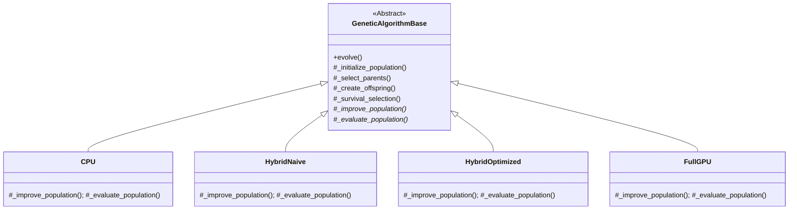

# Introdução

## Contexto e Motivação

### O Problema do Caixeiro Viajante (TSP)

- Um dos problemas mais estudados em otimização combinatória [@cook2012pursuit]
- **Objetivo:** encontrar o menor ciclo hamiltoniano — visitar todas as cidades e retornar
- Classificado como **NP-difícil**: sem solução eficiente conhecida para grandes instâncias
- Estrutura fundamental para problemas reais de logística e roteamento

### Aplicações práticas

- Roteirização de veículos (VRP) e suas variantes [@tan2021vehicle]
- Localização de instalações (p-medianos)
- Manufatura (perfuração de circuitos, escalonamento de tarefas)
- Aeronáutica (otimização de trajetórias — ex.: modeFRONTIER)

---

## Por que GPUs?

### Computação em GPU

- GPUs modernas oferecem **milhares de núcleos** de execução paralela [@nvidia2024cuda]
- Arquitetura SIMT (*Single Instruction, Multiple Threads*)
- Ideal para algoritmos populacionais: avaliar ou melhorar **muitas soluções simultaneamente**

### O desafio

- Migrar para GPU **não garante** ganho automático
- Transferências CPU $\leftrightarrow$ GPU podem **reduzir** o ganho de paralelismo
- Comparações na literatura frequentemente comparam **algoritmos diferentes** em plataformas diferentes [@schulz2013gpu; @van2013gpu]

### Proposta deste trabalho

> Implementar e comparar de forma **justa e controlada** quatro variantes isoalgorítmicas de um algoritmo memético (GA+2-opt) para o TSP, diferindo apenas na estratégia de paralelização em GPU, a fim de isolar o impacto da plataforma de execução sobre o desempenho.

---

## Problema de Pesquisa

\begin{block}{Pergunta Central}
\textbf{Como comparar, de forma fiel, o impacto de diferentes estratégias de paralelização utilizando GPU no desempenho de um algoritmo memético (GA+2-opt) para o TSP?}
\end{block}

### Requisitos para responder:

1. Implementações **isoalgorítmicas** — mesma lógica, mesmos parâmetros
2. Conjunto diversificado de instâncias de teste
3. Número adequado de repetições
4. Testes estatísticos rigorosos

---

## Objetivos

### Objetivo Geral

Investigar e quantificar o impacto de diferentes estratégias de paralelização em GPU sobre:

- **Tempo de execução**
- **Qualidade das soluções** (gap em relação ao ótimo)

### Objetivos Específicos

1. Implementar **4 variantes isoalgorítmicas** do GA+2-opt
2. Selecionar instâncias TSPLIB [@reinelt1991tsplib] de diferentes tamanhos
3. Definir protocolo experimental reprodutível
4. Aplicar testes estatísticos adequados [@demsar2006statistical]
5. Analisar compromissos entre velocidade e qualidade

---

# Fundamentação Teórica

## O Algoritmo Memético: GA + 2-opt

### Algoritmo Genético (GA)

- **Meta-heurística** baseada em evolução biológica [@goldberg1989genetic; @larranaga1999genetic]
- Mantém uma **população** de soluções candidatas
- Operadores: **seleção**, **cruzamento**, **mutação**
- Exploração global do espaço de busca

### Busca Local 2-opt

- Heurística de **melhoria** para rotas [@croes1958method]
- Em cada iteração, avalia sistematicamente pares de arestas $(i, i+1)$ e $(j, j+1)$
- Se a reconexão cruzada reduz o custo ($\Delta C < 0$), a troca é aplicada e o segmento entre $i+1$ e $j$ é invertido
- Truncada a 10 iterações por indivíduo para controlar custo computacional

### Algoritmo Memético — inspirado em Fujimoto e Tsutsui

- **Combinação** de GA (exploração global) com 2-opt (intensificação local) [@fujimoto2011highly]
- Cada indivíduo é melhorado por 2-opt a cada geração
- Equilíbrio entre **diversificação** e **intensificação**

---

## Paralelização em GPU: Taxonomia de Crainic--Toulouse

A taxonomia de @crainic2003parallel classifica estratégias de paralelização de meta-heurísticas:

### Tipo 1 — Paralelismo de Baixo Nível (Decomposição de Dados)

- Paraleliza tarefas intensivas **dentro** de uma iteração da meta-heurística
- Fluxo de controle do algoritmo permanece **centralizado**
- Ideal para arquiteturas **SIMD/SIMT (GPUs)**
- Ex.: @tsp_gpu avaliam movimentos 2-opt em paralelo; cada thread calcula o ganho de uma troca de arestas

### Tipo 2 — Decomposição do Domínio

- **Particiona** variáveis de decisão em subconjuntos otimizados independentemente
- Mais adequado para **MIMD** (clusters, CPUs multicore) — subproblemas com tempos distintos causam divergência em GPUs

### Tipo 3 — Múltiplas Trajetórias

- **Múltiplas instâncias** da meta-heurística exploram o espaço simultaneamente
- Independentes (*multi-start*) ou cooperativas (*island models*) [@luong2013gpu]

\begin{alertblock}{Neste trabalho}
Todas as 4 variantes enquadram-se predominantemente no \textbf{Tipo 1}: paralelismo de dados na avaliação de vizinhança 2-opt e nos operadores genéticos via GPU.
\end{alertblock}

---

## Gargalo de Comunicação CPU $\leftrightarrow$ GPU

### Largura de banda

| Interface | Largura de Banda |
|:----------|:----------------:|
| Memória interna GPU | aprox. 112 GB/s |
| Barramento PCIe | aprox. 16 GB/s |

### Implicação

$$T_{total} = T_{cpu} + T_{gpu} + T_{transf}$$

- Se $T_{transf}$ for grande, **reduz** o ganho de $T_{gpu}$
- Minimizar transferências é **crítico** para desempenho
- A forma como dados são transferidos (**padrão** de transferência) diferencia as variantes, conforme detalhado nos slides seguintes

---

# Materiais e Métodos

## Hardware e Software

### Ambiente Computacional

| Componente | Especificação |
|:-----------|:-------------|
| **CPU** | Intel Core i7-7700HQ (4 cores, 8 threads) |
| **GPU** | NVIDIA GTX 1050 Mobile (640 CUDA cores) |
| **VRAM** | 4 GB |
| **SO** | Linux |
| **Linguagem** | Python 3.10 |
| **Backend CPU** | NumPy |
| **Backend GPU** | CuPy + kernels CUDA customizados |
| **Estatística** | SciPy, scikit-posthocs |

### Nota sobre o hardware

- GPU de **entrada** (arquitetura Pascal, 2016)
- Diferenças de eficiência tornam-se **mais evidentes** em hardware limitado
- Contraste entre CPU relativamente capaz e GPU modesta acentua desafios de delegação de processamento à GPU

---

## O Algoritmo Base (Idêntico em Todas as Variantes)

### Parâmetros Fixos

| Parâmetro | Valor | Referência |
|:----------|:-----:|:----------:|
| Representação | Permutação de inteiros | @larranaga1999genetic |
| $n_{pop}$ (população) | $2 \times n_{coords}$ | @eiben2015introduction |
| Seleção | Torneio | @goldberg1989genetic |
| Cruzamento | *Order Crossover* (OX) | @larranaga1999genetic |
| Mutação | *Swap Mutation* | @eiben2015introduction |
| Iterações 2-opt | 10 (truncado) | @fujimoto2011highly |
| Paciência | $2 \times \sqrt{n_{coords}}$ | Configuração experimental |
| Max gerações | $2 \times n_{coords} \times \sqrt{n_{coords}}$ | Configuração experimental |

### Critérios de parada

1. Atingir ótimo conhecido (gap < 1%)
2. Estagnação (sem melhoria por *paciência* gerações)
3. Limite de gerações

---

## As 4 Variantes Isoalgorítmicas

### 1. GeneticAlgorithmCPU (Baseline)

- Tudo na CPU com NumPy; 2-opt vetorizado com instruções SIMD do processador
- Processamento **sequencial** dos indivíduos
- Referência para instâncias pequenas ($n \le 100$)

### 2. GeneticAlgorithmHybridNaive (Híbrido Ingênuo)

- Operadores genéticos na CPU
- **Apenas 2-opt** executado na GPU, mas **indivíduo a indivíduo** (um kernel por tour)
- Transferência H2D e D2H para **cada** indivíduo, **cada** geração
- Nota: o cálculo de aptidão (*fitness*) permanece na CPU. Transferi-lo individualmente para GPU introduziria ainda mais latência de comunicação, agravando o gargalo

### 3. GeneticAlgorithmHybridOptimized (Híbrido Otimizado)

- Operadores genéticos na CPU
- 2-opt **e** cálculo de aptidão na GPU **em lote**, encadeados em sequência (sem transferência intermediária)
- Matriz de distâncias armazenada em cache na GPU; população inteira transferida de uma só vez
- Retorna **apenas o vetor de custos** para a CPU (aprox. 2 KB para 256 tours)

### 4. GeneticAlgorithmFullGPU (Totalmente em GPU) — inspirado em @fujimoto2011highly

- **Tudo** reside na GPU durante a evolução: população, operadores genéticos, 2-opt e aptidão
- Transferência única no início (população e distâncias) e no fim (melhor solução)
- Kernel CUDA monolítico com barreiras de sincronização (`__syncthreads()`)

---

## Padrão de Transferência por Variante

| Métrica | CPU | Naive | Otimizado | FullGPU |
|:--------|:---:|:-----:|:---------:|:-------:|
| Lançamentos de kernel/ger. | 0 | aprox. 2.560 | aprox. 11 | 0* |
| Transf. H2D/ger. | 0 | aprox. 8 MB | aprox. 1 MB | 0 |
| Transf. D2H/ger. | 0 | aprox. 1 MB | aprox. 2 KB | 0 |
| Total transf./ger. | 0 | aprox. 9 MB | aprox. 1 MB | 0 |

\* FullGPU: 3 lançamentos de kernel no total (independente do número de gerações).

### Implicação no tempo

- Na variante **Naive**, a sobrecarga de aprox. 9 MB/geração no barramento PCIe (aprox. 16 GB/s) domina o tempo total, especialmente em instâncias pequenas e médias
- Na **Otimizada**, o encadeamento de kernels reduz a transferência em ~$9\times$ vs Naive, resultando em ganho médio de $5{,}54\times$
- Na **FullGPU**, a ausência de transferências por geração elimina o gargalo de comunicação — porém o kernel monolítico pode ter menor eficiência computacional que kernels especializados

---

## Arquitetura do Framework

### Padrão *Template Method*

### Princípio

- A lógica do algoritmo é **idêntica** em todas as variantes
- Apenas **onde** e **como** as operações intensivas são executadas varia
- Garante comparação **justa**

---

## Instâncias de Teste

### TSPLIB — 38 instâncias selecionadas [@reinelt1991tsplib]

| Categoria | Faixa ($n_{coords}$) | Quantidade | Exemplos |
|:----------|:---------------------:|:----------:|:---------|
| **Pequenas** | $\le 100$ | 12 | eil51, berlin52, kroA100 |
| **Médias** | $100$–$400$ | 21 | ch150, pr264, rd400 |
| **Grandes** | $> 400$ | 5 | fl417, pr1002 |

### Protocolo experimental

- **30 repetições** independentes por par (algoritmo, instância)
- Sementes aleatórias registradas para **reprodutibilidade**
- CPU executada apenas para $n \le 100$ (tempo proibitivo acima)

---

## Protocolo Estatístico

### Metodologia [@demsar2006statistical]

1. **Normalidade:** Shapiro-Wilk
2. **2 algoritmos:** Teste t pareado (normal) ou Wilcoxon (não-normal)
3. **$\ge$ 3 algoritmos:** Teste de Friedman
4. **Pós-teste:** Nemenyi (pares significativos)
5. **Correção múltipla:** Holm-Bonferroni
6. **Tamanho de efeito:** $d$ de Cohen

\begin{block}{Por que isso importa?}
Sem testes estatísticos, diferenças observadas podem ser fruto do acaso. Com 30 repetições e testes formais, atribuímos significância aos resultados.
\end{block}

---

# Resultados

## Resultados por Instância (Seleção)

### Instâncias Pequenas

| Instância | Algoritmo | Tempo (s) | Gap (%) | Ganho |
|:----------|:----------|----------:|--------:|------:|
| berlin52 | CPU | 25,14 | 0,00 | $1{,}00\times$ |
| | HybridNaive | 1,85 | 0,00 | $13{,}59\times$ |
| | HybridOptimized | 0,11 | 0,00 | $228{,}55\times$ |
| | FullGPU | 0,45 | 0,00 | $55{,}87\times$ |
| kroA100 | CPU | 142,30 | 0,02 | $1{,}00\times$ |
| | HybridNaive | 6,50 | 0,02 | $21{,}89\times$ |
| | HybridOptimized | 0,35 | 0,15 | $406{,}57\times$ |
| | FullGPU | 1,20 | 0,00 | $118{,}58\times$ |

- Ganhos de até $400\times$ para HybridOptimized vs CPU
- FullGPU atinge **gap 0,00%** em kroA100

---

## Resultados por Instância — Grandes

### Instância Grande: pr1002 (1002 cidades)

| Instância | Algoritmo | Tempo (s) | Gap (%) | Ganho |
|:----------|:----------|----------:|--------:|------:|
| pr1002 | HybridNaive | 696,12 | 1,85 | $1{,}00\times$ |
| | HybridOptimized | 374,25 | 2,10 | $1{,}86\times$ |
| | FullGPU | 758,40 | **1,15** | $0{,}92\times$ |

### Observações

- HybridOptimized continua **mais rápida** ($1{,}86\times$)
- FullGPU é a **melhor em qualidade** (1,15% vs 2,10%)
- Compromisso claro: **velocidade** vs **qualidade**
- Nota: para instâncias grandes, a variante Naive ainda permite execução viável — o gargalo de comunicação reduz o ganho, mas não inviabiliza a variante

---

## Análise Agregada (38 instâncias)

### Médias Gerais

| Algoritmo | Tempo Médio (s) | Gap Médio (%) | Ganho (vs Naive) |
|:----------|----------------:|--------------:|-----------------:|
| HybridNaive | 47,20 | 1,30 | $1{,}00\times$ |
| HybridOptimized | 18,94 | 1,30 | $5{,}54\times$ |
| FullGPU | 43,51 | **0,88** | $1{,}21\times$ |

### Observações principais

1. **HybridOptimized** é a mais rápida ($5{,}54\times$ vs Naive) com mesma qualidade
2. **FullGPU** apresenta menor gap médio (**0,88%** — 32% inferior aos demais)
3. **HybridNaive** apresenta desempenho próximo à CPU em instâncias pequenas, mas permanece funcional para instâncias maiores
4. Nota: os desvios-padrão entre repetições são relativamente pequenos, mas serão formalmente avaliados nos testes estatísticos a seguir

---

## Melhor Algoritmo por Categoria de Tamanho

### Critério: menor gap (qualidade)

| Categoria | Melhor Algoritmo | Gap Médio |
|:----------|:-----------------|----------:|
| Pequeno ($n \le 100$) | **FullGPU** | 0,00% |
| Médio ($100 < n \le 400$) | **FullGPU** | 0,65% |
| Grande ($n > 400$) | **FullGPU** | 1,85% |

\begin{alertblock}{Resultado-chave}
FullGPU apresenta os menores gaps em \textbf{todas} as categorias de tamanho. Para instâncias pequenas, encontra soluções ótimas em 100\% dos casos.
\end{alertblock}

---

## Análise Estatística: Resultados

### Teste de Friedman — Comparação Múltipla

| Estrato | p-valor | Resultado |
|:--------|--------:|:----------|
| Pequenas + todos os alg. | $0{,}07$ | Inconclusivo (poder estatístico baixo) |
| Todas + apenas GPU | $< 0{,}001$ | **Significativo** |

### Pós-teste de Nemenyi (variantes GPU)

- Diferença entre FullGPU e variantes híbridas é **estatisticamente significativa**
- Confirmado por **$d$ de Cohen** (tamanho de efeito prático relevante)
- Ganho do HybridOptimized é **significativo** após correção de Holm-Bonferroni
- Ressalva: para instâncias pequenas, as diferenças de qualidade entre variantes são reduzidas e o teste de Friedman não rejeita $H_0$ — o que pode refletir tanto semelhança real quanto poder estatístico insuficiente

---

## Compromisso: Velocidade vs Qualidade

### Cenários de uso

| Se você precisa... | Use | Por quê |
|:-------------------|:----|:--------|
| Iteração rápida / muitas execuções | HybridOptimized | $5{,}54\times$ mais rápido |
| Melhor solução possível | FullGPU | 32% melhor gap |
| Simplicidade / instâncias pequenas | CPU Baseline | Sem complexidade de GPU |

### Por que essa diferença?

- **Naive**: transferências individuais (uma por tour) introduzem latência de comunicação PCIe que domina o tempo total
- **Otimizado**: processamento em lote com encadeamento de kernels elimina o gargalo de comunicação $\rightarrow$ **maior velocidade**
- **FullGPU**: dados residentes na GPU eliminam transferências; porém o kernel monolítico (que executa seleção, cruzamento, mutação e 2-opt em uma única chamada) pode ser menos eficiente computacionalmente do que kernels especializados da versão otimizada — isso explica por que FullGPU é **mais lento** que HybridOptimized apesar de não ter custo de comunicação

---

# Discussão

## O que Aprendemos

### GPU acelera — mas a estratégia importa

- "Usar GPU" não é solução automática
- A **forma** de comunicação CPU $\leftrightarrow$ GPU define o resultado

### Lição 1: Transferências em lote são essenciais

- A abordagem **Naive** (indivíduo por indivíduo) resulta em ganho inferior ao esperado
- Processamento em **lote** é requisito mínimo para obter benefício significativo

### Lição 2: Residência em GPU favorece qualidade

- Manter dados na GPU permite exploração mais **eficiente** do espaço de busca
- A hipótese é que a ausência de interrupções de transferência permite que o algoritmo explore melhor a vizinhança 2-opt dentro do mesmo orçamento de gerações

### Lição 3: Não existe "melhor" universal

- **Velocidade**: HybridOptimized
- **Qualidade**: FullGPU
- Escolha depende do **cenário de aplicação**

---

## Comparação com a Literatura

### Contexto

- Muitos estudos comparam CPU vs GPU usando **algoritmos diferentes** [@schulz2013gpu; @benaini2018genetic]
- Isso confunde o efeito da **plataforma** com o efeito do **algoritmo**

### Contribuição deste trabalho

- Comparação **isoalgorítmica**: mesma lógica em todas as variantes
- Diferenças observadas são atribuíveis **predominantemente** à estratégia de paralelização
- Ressalva importante: a implementação GPU, embora isoalgorítmica, poderia potencialmente ser otimizada para melhor desempenho — as diferenças refletem não apenas a estratégia de paralelização, mas também a maturidade da implementação em cada plataforma

### Alinhamento com a taxonomia de Crainic-Toulouse

- Todas as variantes GPU deste trabalho enquadram-se no **Tipo 1** (paralelismo de dados): paralelizam a avaliação de vizinhança 2-opt e/ou operadores genéticos via GPU
- A variação entre as variantes está no **grau e na forma** de explorar esse paralelismo de dados, não no tipo de paralelismo

---

# Limitações e Trabalhos Futuros

## Limitações

### Hardware

- GPU de entrada (GTX 1050 Mobile, 640 cores)
- GPUs mais potentes (RTX 3000/4000) amplificariam os ganhos
- VRAM de 4 GB limita instâncias a aprox. 13.000 cidades

### Metodológicas

- **2-opt** funciona apenas para **grafos não orientados** (simétricos)
  - Não consegue reverter direção de sub-rotas
  - Grafos dirigidos requerem **3-opt** ou métodos adaptados
- Apenas uma busca local testada (2-opt)
- Apenas um tipo de problema (TSP)
- A implementação GPU pode não estar totalmente otimizada — diferenças de desempenho podem refletir tanto a estratégia quanto detalhes de implementação

---

## Trabalhos Futuros

### Extensões propostas

1. **3-opt para grafos dirigidos**
   - Permite TSP assimétrico (ruas de mão única)
   - Amplia aplicabilidade prática

2. **Instâncias maiores** (5.000+ cidades)
   - Explorar como vantagens GPU escalam com tamanho

3. **Múltiplas trajetórias em GPU** (Tipo 3 de Crainic-Toulouse)
   - Manter diversas populações evoluindo em paralelo na GPU (*island model*)
   - Distribuir entre múltiplas GPUs para problemas de grande porte

4. **Outros problemas combinatórios**
   - VRP (Problema de Roteirização de Veículos)
   - Escalonamento de tarefas
   - Localização de instalações

5. **GPUs modernas** (RTX 3000/4000)
   - Quantificar impacto de hardware mais recente

---

# Conclusões

## Conclusões Principais

### Resposta à pergunta de pesquisa

A estratégia de paralelização em GPU **influencia significativamente** o compromisso entre tempo e qualidade:

| Variante | Ganho de Performance | Gap Médio |
|:---------|:--------------------:|----------:|
| HybridOptimized | $5{,}54\times$ | 1,30% |
| FullGPU | $1{,}21\times$ | **0,88%** |

### Contribuições

1. **Framework isoalgorítmico** — comparação justa e reprodutível
2. **Evidência estatística** — 30 repetições $\times$ 38 instâncias $\times$ 4 variantes com testes formais
3. **Guia prático** — quando usar cada estratégia de paralelização
4. **Código aberto** — reprodutibilidade total

\begin{block}{Mensagem final}
GPU é uma ferramenta poderosa para otimização combinatória, mas o \textbf{como} se paraleliza importa tanto quanto o \textbf{se} se paraleliza.
\end{block}

---

## Obrigado!

\begin{center}
\Large
Perguntas?
\end{center}

\vfill

\begin{center}
\small
Lucas Galdino \\
Universidade Federal de Santa Catarina \\
Engenharia Mecânica \\
\vspace{1em}
Código disponível no repositório do projeto
\end{center}

---

## Referências {.allowframebreaks}
