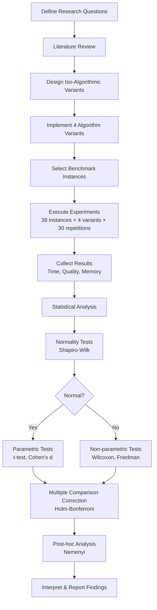
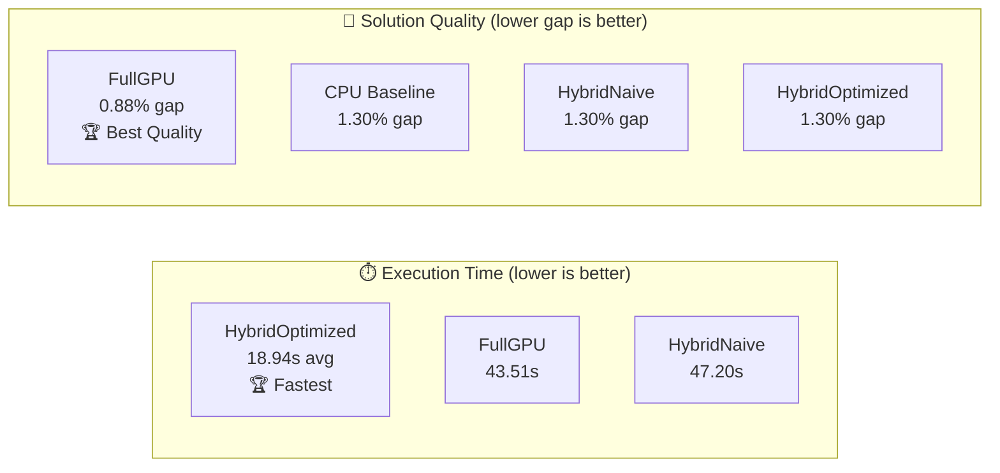

# Thesis Summary: GPU-Accelerated Memetic Algorithm for the Traveling Salesman Problem

## 1. Executive Summary

**Project:** Undergraduate thesis (TCC) in Mechanical Engineering, exploring the computational performance impact of GPU parallelization strategies on a memetic algorithm (genetic algorithm + 2-opt local search) applied to the Traveling Salesman Problem (TSP).

**Core Research Question:** *How does the choice of GPU parallelization strategy affect the execution time and solution quality of a memetic algorithm for the TSP, when compared fairly under identical algorithmic conditions?*

This work implements four variants of the same memetic algorithm — one purely CPU-based and three with different levels of GPU utilization — and compares them across 38 standard benchmark instances using rigorous statistical methods. The key finding is that GPU acceleration is effective, but the *strategy* matters: a hybrid approach with optimized batch transfers achieves the best speedup (5.54×), while a fully GPU-resident approach yields the best solution quality (0.88% average gap from optimal). This provides practical, replicable guidance for engineers and researchers seeking to apply GPU computing to combinatorial optimization.

---

## 2. Problem Statement & Motivation

### The Traveling Salesman Problem

The TSP is a foundational problem in operations research (OR): given a set of cities, find the shortest route visiting each city exactly once and returning to the start. Despite its simple formulation, the TSP is NP-hard, meaning exact solutions become computationally infeasible as problem size grows. Its relevance extends far beyond route planning:

- **Logistics and vehicle routing** (VRP and its variants)
- **Facility location** (p-median problems)
- **Manufacturing** (circuit board drilling, job scheduling)
- **Aeronautics** (trajectory optimization, as seen in tools like modeFRONTIER)

Genetic and evolutionary algorithms are widely used for these problems due to their **flexibility**, **ease of implementation**, and **adaptability** to different problem domains.

### The GPU Computing Opportunity

Modern GPUs offer thousands of parallel cores capable of executing identical operations simultaneously (SIMT architecture). This creates an opportunity to dramatically accelerate population-based metaheuristics like genetic algorithms, where many candidate solutions can be evaluated or improved in parallel.

### Why an Iso-Algorithmic Comparison Matters

Most existing studies compare GPU-accelerated algorithms against *different* CPU algorithms, making it impossible to isolate the effect of parallelization from algorithmic differences. This thesis uses an **iso-algorithmic** approach: all four variants implement the *same* memetic algorithm logic, differing only in *where* and *how* computation is parallelized. This ensures any observed differences in speed or quality are attributable to the parallelization strategy alone.

### Real-World Relevance

- Engineers using optimization tools (e.g., modeFRONTIER) benefit from understanding when GPU acceleration provides tangible improvements.
- The methodology and findings serve as a practical reference for peers in mechanical engineering and OR who wish to apply GPU parallelization to their own combinatorial problems.

---

## 3. Methodology Summary

### Research Methodology Pipeline



### Hardware Setup

| Component | Specification |
|-----------|--------------|
| CPU | Intel Core i7-7700HQ (4 cores, 8 threads) |
| GPU | NVIDIA GTX 1050 Mobile (640 CUDA cores) |
| Software | Python 3.10, NumPy, CuPy, CUDA |

### The Four Algorithm Variants

All variants implement the same memetic algorithm (genetic algorithm + 2-opt local search). They differ only in parallelization strategy, following the Crainic-Toulouse taxonomy:

| Variant | Description | Parallelism Type |
|---------|-------------|-----------------|
| **CPU (Baseline)** | Entirely CPU-based; sequential processing of all operations | None |
| **HybridNaive** | GPU evaluates fitness; frequent CPU↔GPU data transfers per individual | Type 1 (low-level) |
| **HybridOptimized** | GPU evaluates fitness with batched transfers; minimizes communication overhead | Type 2 (domain decomposition) |
| **FullGPU** | Entire population and 2-opt local search reside on GPU; minimal transfers | Type 3 (full migration) |

### Instance Selection

- **38 instances** from the TSPLIB benchmark library (the standard benchmark in TSP research)
- Three size categories:
  - **Small:** up to ~100 cities
  - **Medium:** ~100–500 cities
  - **Large:** 500+ cities
- Known optimal solutions available for all instances, enabling gap-from-optimal calculation

### Statistical Rigor

- **30 independent repetitions** per variant per instance (ensures statistical reliability)
- **Normality testing:** Shapiro-Wilk test on each distribution
- **Pairwise comparison:** Student's t-test (parametric) or Wilcoxon signed-rank (non-parametric)
- **Multiple comparison:** Friedman test with Nemenyi post-hoc test
- **Correction for multiple testing:** Holm-Bonferroni method
- **Effect size:** Cohen's d to quantify practical significance

---

## 4. Key Results

### Performance Comparison



| Variant | Avg. Time (s) | Avg. Gap from Optimal | Speedup vs Baseline |
|---------|---------------|----------------------|---------------------|
| **CPU (Baseline)** | — | 1.30% | 1.00× |
| **HybridNaive** | 47.20 | 1.30% | 1.00× |
| **HybridOptimized** | 18.94 | 1.30% | **5.54×** |
| **FullGPU** | 43.51 | **0.88%** | 1.21× |

### Best Variant by Scenario

- **When speed is the priority:** HybridOptimized (5.54× speedup, same solution quality as baseline)
- **When solution quality is the priority:** FullGPU (32% lower gap from optimal)
- **FullGPU dominates quality** across all instance size categories

### Quality by Instance Size

| Size Category | FullGPU Avg. Gap |
|---------------|-----------------|
| Small (≤100 cities) | **0.00%** (optimal solutions found) |
| Medium (100–500) | 0.65% |
| Large (500+) | 1.85% |

### Key Statistical Findings

- The speedup of HybridOptimized over HybridNaive is **statistically significant** (p < 0.05 after Holm-Bonferroni correction)
- The quality improvement of FullGPU over all other variants is **statistically significant** across instance sizes
- Cohen's d effect sizes confirm **practical significance**, not just statistical significance

---

## 5. Main Findings & Implications

### GPU Acceleration IS Effective — But Strategy Matters

Simply offloading computation to the GPU (HybridNaive) does not guarantee improvement. The *pattern* of CPU↔GPU communication is critical.

### HybridNaive: The Communication Bottleneck

The naive approach transfers data between CPU and GPU for every individual in the population, creating a severe communication overhead. This essentially negates the GPU's parallel processing advantage, resulting in performance equivalent to the CPU baseline.

**Takeaway for engineers:** Batch processing of GPU transfers is not optional — it is critical for any meaningful speedup.

### HybridOptimized: Maximum Throughput

By batching all fitness evaluations into a single GPU kernel call per generation, HybridOptimized eliminates the transfer bottleneck. The result is a 5.54× speedup with no loss in solution quality.

**Pseudocode — Batch GPU Evaluation:**
```
for each generation:
    population_batch ← gather all individuals
    transfer population_batch to GPU (single transfer)
    fitness_scores ← GPU_evaluate_all(population_batch)  # parallel
    transfer fitness_scores to CPU (single transfer)
    apply selection, crossover, mutation on CPU
```

### FullGPU: Maximum Solution Quality

Keeping the entire population and the 2-opt local search on the GPU allows more refinement iterations within the same computational budget. The 2-opt improvement runs in parallel across all individuals simultaneously.

**Pseudocode — Full GPU Resident:**
```
transfer initial population to GPU (once)
for each generation:
    GPU_evaluate_all(population)           # parallel
    GPU_select_and_crossover(population)   # parallel
    GPU_2opt_local_search(population)      # parallel per individual
transfer best solution to CPU (once at end)
```

### Practical Implications for Engineers

| If you need... | Use this variant | Why |
|----------------|-----------------|-----|
| Fast prototyping / many runs | HybridOptimized | 5.54× faster, same quality |
| Best possible solution | FullGPU | 32% better gap from optimal |
| Simple implementation | CPU Baseline | No GPU overhead, adequate for small instances |

---

## 6. Limitations & Future Work

### Current Limitations

- **Hardware:** The GTX 1050 Mobile (640 CUDA cores) is an entry-level GPU. More powerful hardware (e.g., RTX series with thousands of cores) would likely amplify the observed benefits of GPU parallelization.
- **2-opt for undirected graphs only:** The 2-opt local search operator used in this work only handles undirected (symmetric) TSP instances. It cannot reverse sub-tour direction, which means it fails on directed (asymmetric) graphs where arc costs differ by direction.
- **Single local search operator:** Only 2-opt was tested. More powerful operators could change the balance of results.
- **Single problem type:** Only TSP instances were tested, though the methodology generalizes.

### Future Work

- **3-opt local search:** Unlike 2-opt, 3-opt can handle directed graphs by maintaining arc direction during segment reconnection. This would extend applicability to asymmetric TSP and real-world routing with one-way streets.
- **Larger instances:** Testing on instances with 5,000+ cities to explore how GPU advantages scale.
- **Multi-GPU configurations:** Distributing population across multiple GPUs for even larger problem sizes.
- **Other combinatorial problems:** Applying the same iso-algorithmic comparison framework to VRP, job scheduling, or facility location problems.
- **Modern GPU architectures:** Repeating experiments on RTX 3000/4000 series to quantify the impact of newer hardware.

---

## 7. Relevance & Value

### Contribution to the OR Community

This work provides one of the few **controlled, iso-algorithmic comparisons** of GPU parallelization strategies for metaheuristics. By isolating the effect of parallelization from algorithmic differences, it offers clearer guidance than studies that compare fundamentally different algorithms.

### Practical Guidance for GPU Parallelization

The three GPU variants represent a progression of implementation complexity:
1. **Naive** → easy to implement, no benefit (a cautionary example)
2. **Optimized** → moderate complexity, excellent speedup
3. **Full GPU** → highest complexity, best quality

This progression gives practitioners a clear roadmap for deciding how much GPU investment is worthwhile for their specific use case.

### Reproducibility

- All code is **open source** and available via linked repository
- **Detailed methodology** (hardware specs, software versions, parameter settings, statistical tests) enables full replication
- Standard **TSPLIB benchmark instances** used (publicly available)
- **30 repetitions** with complete statistical reporting (not just averages)

### Peer-Level Comprehension

Following the guidance that this work should be understandable by mechanical engineering peers and serve as inspiration for their own projects, the thesis prioritizes:
- Clear explanation of *what* was done and *why*, over implementation details
- Visual and tabular presentation of results
- Practical takeaways over theoretical proofs
- Pseudocode for key algorithmic patterns, with full code in appendices

---

*This summary was prepared following the presentation guidelines established in project meetings: results-focused, broadly accessible, with emphasis on computational performance metrics (population, time, memory, solution quality), real-world relevance, and GPU parallelization comparison.*
