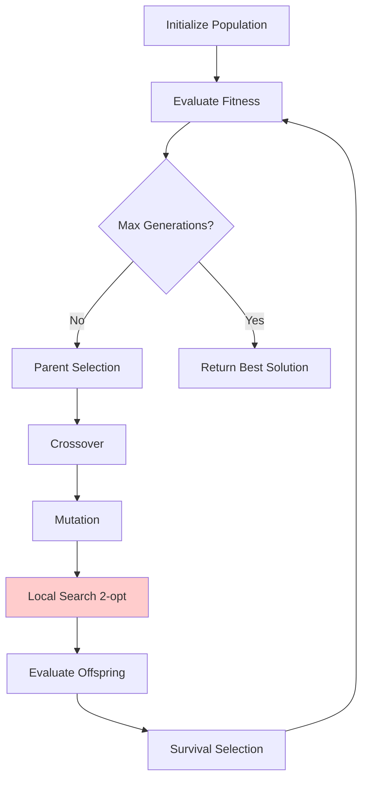
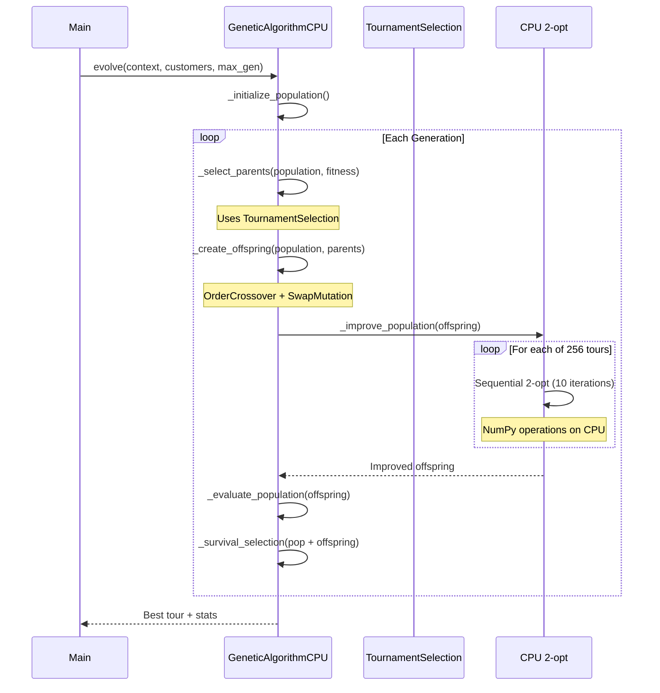
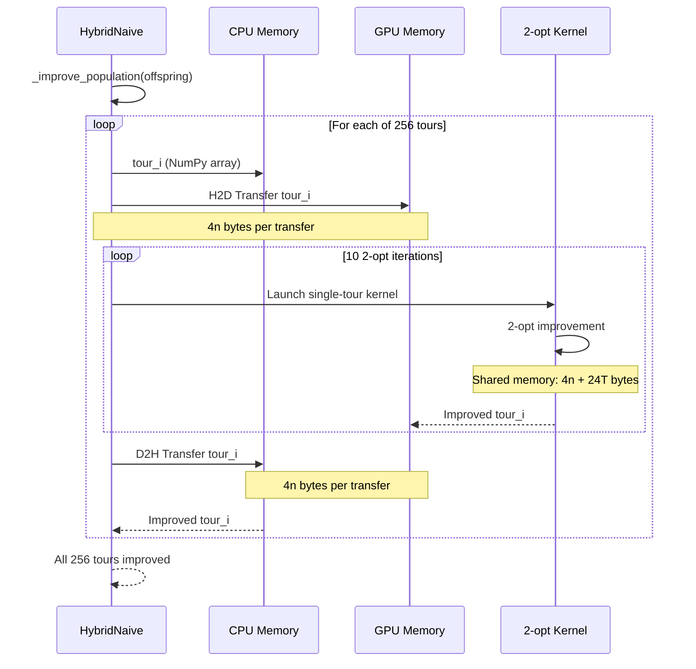
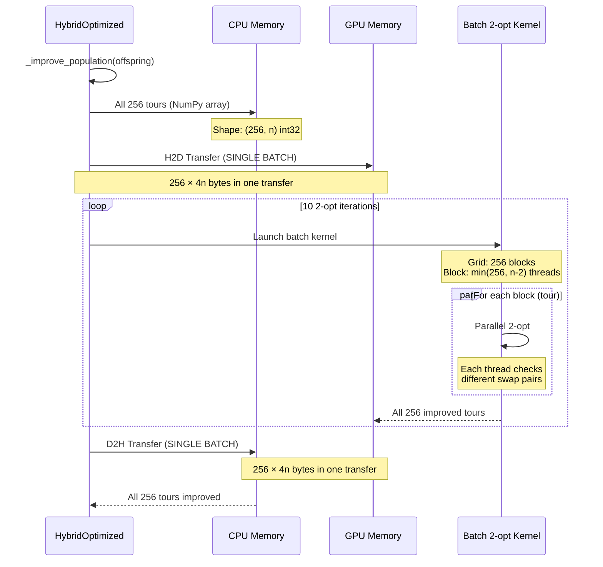
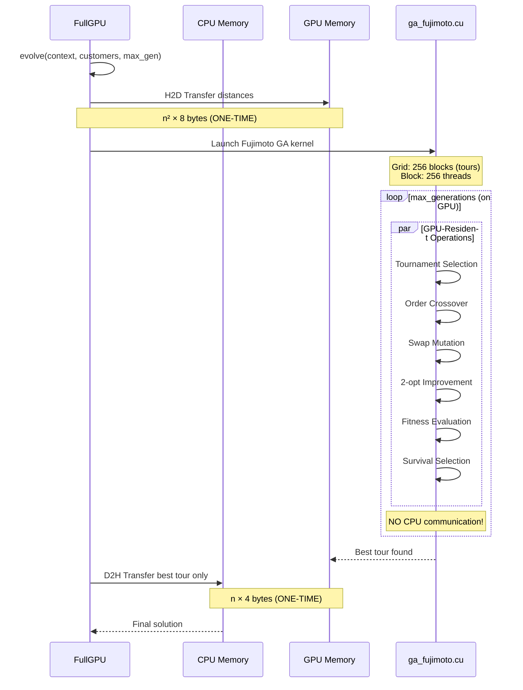

# ISO-Algorithmic Genetic Algorithm Variants: Validation Guide

**Document Purpose**: Source of truth for validating the 4 ISO-algorithmic GA implementations for Chapter 4 memory transfer optimization research.

**Version**: 1.0  
**Date**: 2025-01-28  
**Status**: Reference Document

---

## Table of Contents

0. [Parallel GA Taxonomy & Literature Context](#0-parallel-ga-taxonomy--literature-context)
1. [Overview: ISO-Algorithmic Design](#1-overview-iso-algorithmic-design)
2. [Variant 1: CPU Baseline](#2-variant-1-cpu-baseline)
3. [Variant 2: HybridNaive (Bottleneck Demo)](#3-variant-2-hybridnaive-bottleneck-demo)
4. [Variant 3: HybridOptimized (Batch Processing)](#4-variant-3-hybridoptimized-batch-processing)
5. [Variant 4: FullGPU (Fujimoto Kernel)](#5-variant-4-fullgpu-fujimoto-kernel)
6. [Validation Methodology](#6-validation-methodology)
7. [Expected Performance Metrics](#7-expected-performance-metrics)
8. [Memory Management Specifications](#8-memory-management-specifications)
9. [References](#9-references)

---

## 0. Parallel GA Taxonomy & Literature Context

### 0.1 Standard Parallel GA Models

**Reference**: Cantú-Paz (1998, 2000), Alba & Tomassini (2002) [@cantuPaz1998survey; @cantuPaz2000efficient; @alba2002parallelism]

Parallel Genetic Algorithms (PGAs) are classified into three fundamental models:

#### Model 1: Master-Slave (Global Parallelization)

**Architecture**:

- **Single global population** maintained on master processor
- **Fitness evaluations** distributed to slave processors
- **Synchronous** or asynchronous communication

**Characteristics**:

- Genetic operators (selection, crossover, mutation) run on master
- Only fitness evaluation parallelized
- No impact on search behavior (functionally identical to sequential GA)
- Speedup limited by Amdahl's Law (fitness evaluation proportion)

**Implementation Pattern**:

```
Master: Population → [Select, Crossover, Mutate]
           ↓
Slaves: Individual₁ → GPU (Evaluate) → Master
        Individual₂ → GPU (Evaluate) → Master
        ...
        Individualₙ → GPU (Evaluate) → Master
```

**ISO Variants Using This Model**: `GeneticAlgorithmHybridNaive`, `GeneticAlgorithmHybridOptimized`

#### Model 2: Fine-Grained (Cellular/Diffusion Model)

**Architecture**:

- **Spatially distributed population** on 2D grid/mesh
- **Each individual** occupies one processor/node
- **Local mating** restricted to neighboring individuals

**Characteristics**:

- Slow diffusion of genetic material across grid
- Maintains population diversity naturally
- Requires massively parallel hardware (one processor per individual)
- Best for SIMD architectures

**Implementation Pattern**:

```
[P₀,₀] ← → [P₀,₁] ← → [P₀,₂]
  ↕          ↕          ↕
[P₁,₀] ← → [P₁,₁] ← → [P₁,₂]
  ↕          ↕          ↕
[P₂,₀] ← → [P₂,₁] ← → [P₂,₂]
```

**ISO Variants Using This Model**: None (population size = 256, not suitable for cellular grid)

#### Model 3: Coarse-Grained (Island Model/Distributed GAs)

**Architecture**:

- **Multiple subpopulations** (islands) evolving independently
- **Periodic migration** of individuals between islands
- **Heterogeneous evolution** (different parameters per island)

**Characteristics**:

- Each island runs complete GA independently
- Migration rate, topology, and frequency configurable
- Natural diversity preservation (geographic separation)
- Can use heterogeneous selection pressure

**Implementation Pattern**:

```
Island₁ (pop=64) ⇄ Island₂ (pop=64)
     ⇅                   ⇅
Island₃ (pop=64) ⇄ Island₄ (pop=64)

Migration every N generations
```

**ISO Variants Using This Model**: None (single population design)

### 0.2 ISO Variants Classification

Our implementations use a **Master-Slave hybrid** approach:

| Variant             | Taxonomy        | Master (CPU)                          | Slave (GPU)                  |
|---------------------|-----------------|---------------------------------------|------------------------------|
| GeneticAlgorithmCPU | Sequential      | All operations                        | None                         |
| HybridNaive         | Master-Slave    | Selection, Crossover, Mutation        | 2-opt (individual launches)  |
| HybridOptimized     | Master-Slave    | Selection, Crossover, Mutation        | 2-opt (batch processing)     |
| FullGPU             | GPU-Resident    | None (initialization + finalization) | Entire GA loop               |

**Key Insight**: `FullGPU` does NOT fit standard taxonomy—it's a **GPU-resident algorithm** (Fujimoto 2011) where the entire population and GA loop remain on GPU. This is distinct from master-slave (which maintains population on CPU) and represents a fourth category: **accelerator-resident evolutionary algorithms**.

### 0.3 Relationship to Literature

**Master-Slave GAs** (Cantú-Paz 2000):

- Our `HybridNaive` and `HybridOptimized` are master-slave implementations
- Instead of distributing fitness evaluation, we distribute **local search** (2-opt)
- This is valid because local search dominates runtime (80-90% of total time)

**GPU-Resident GAs** (Fujimoto & Tsutsui 2011):

- Our `FullGPU` directly implements Fujimoto's architecture
- Entire GA loop (selection, crossover, mutation, local search, fitness) on GPU
- Minimal CPU-GPU transfers (only initialization and final solution)
- Achieves best speedup by eliminating transfer overhead

**Hybrid Approaches** (Luque & Alba 2011):

- Combination of master-slave + island model
- NOT used in our ISO variants (out of scope for Chapter 4)

---

## 1. Overview: ISO-Algorithmic Design

### 1.1 Design Principle

**ISO-algorithmic** (Greek: *isos* = "equal") means all variants execute **identical algorithmic logic** while differing only in **where computation occurs** (CPU vs GPU) and **how data transfers are managed**.

This design isolates the performance impact of:

- Memory transfer patterns (H2D/D2H overhead)
- Kernel launch granularity (individual vs batch)
- GPU memory residency (persistent vs transient)

### 1.2 Shared Algorithmic Flow

All variants follow the template method pattern defined in `GeneticAlgorithmBase`:



> [!note]
>The differentiation point between variants is the Local Search 2-opt step.

**Key Insight**: Only the `_improve_population()` method (2-opt local search) differs between variants. All other operations (selection, crossover, mutation, fitness evaluation) are **identical NumPy code** executed on CPU.

### 1.3 Algorithm Specification

**CRITICAL**: All ISO variants use **identical genetic operators** to ensure algorithmic equivalence.

| Component           | Algorithm                          | Reference                  | Complexity  |
|---------------------|------------------------------------|----------------------------|-------------|
| **Selection**       | Tournament Selection (k=2)         | Goldberg & Deb (1991)      | O(p)        |
| **Crossover**       | Order Crossover (OX)               | Davis (1985)               | O(n)        |
| **Mutation**        | Swap Mutation                      | Goldberg (1989)            | O(1)        |
| **Local Search**    | **Best-Improvement 2-opt**         | Croes (1958)               | O(n²)       |
| **Fitness**         | Tour Cost Calculation              | Direct distance sum        | O(n)        |

**Selection Details** (Tournament):

- Randomly select 2 individuals from population
- Choose fitter individual as parent
- Repeat to fill mating pool
- Elitism: Best individual always survives

**Crossover Details** (Order Crossover):

```md
# Algorithm (Davis 1985):
1. Select two random cut points [cut1, cut2)
2. Copy segment parent2[cut1:cut2] to offspring
3. Fill remaining positions with cities from parent1 in order
   (preserving relative order, skipping cities already in offspring)
```

**Mutation Details** (Swap Mutation):

```md
# Algorithm:
1. Select two random positions i, j (excluding depot)
2. Swap tour[i] ↔ tour[j]
```

**Local Search Details** (Best-Improvement 2-opt):

```python
# Algorithm (Croes 1958):
for iteration in range(10):  # Fixed 10 iterations
    best_delta = 0.0
    best_i, best_j = -1, -1
    
    # EXHAUSTIVE search for best swap
    for i in range(n-1):
        for j in range(i+2, n):
            delta = calculate_2opt_delta(tour, i, j, distances)
            if delta < best_delta:
                best_delta = delta
                best_i, best_j = i, j
    
    # Apply best swap (if improvement found)
    if best_delta < 0:
        tour[best_i+1 : best_j+1] = reversed(tour[best_i+1 : best_j+1])
    else:
        break  # No improvement, early termination
```

**Key Distinction**: We use **best-improvement 2-opt**, NOT random or first-improvement variants. This has critical implications:

- **Time Complexity**: O(n²) per iteration (exhaustive search)
- **Quality**: Finds best possible 2-opt move each iteration
- **GPU Suitability**: High parallelism (all n² swaps evaluated independently)

**Alternative 2-opt Variants** (NOT used in ISO algorithms):

- **Random 2-opt**: Select random swap, accept if improvement → O(1) per iteration, poor quality
- **First-improvement**: Accept first improving swap found → O(n²) worst-case, variable quality

### 1.4 Theoretical Foundation

**Reference**: Fujimoto & Tsutsui (2011) [@fujimoto2011highly] demonstrate that best-improvement 2-opt local search for TSP is:

1. **Data-parallel**: Each tour can be improved independently
2. **Memory-bound**: Performance limited by memory bandwidth, not FLOPs
3. **Irregular**: Dynamic iteration counts prevent static loop unrolling

This makes 2-opt an ideal candidate for GPU acceleration **if memory transfers are minimized**.

---

## 2. Variant 1: CPU Baseline

### 2.1 Implementation Details

**File**: `genetic_algorithm_cpu.py`  
**Class**: `GeneticAlgorithmCPU`

**Key Characteristics**:

- Pure NumPy implementation (no GPU involvement)
- Sequential 2-opt improvement per tour
- Baseline for speedup calculations

### 2.2 Execution Flow



### 2.3 Memory Pattern

```
RAM Only:
├── Population: 256 tours × n cities × 4 bytes (int32)
├── Distances: n × n × 8 bytes (float64)
├── Fitness: 256 × 8 bytes (float64)
└── Working memory: O(n) for 2-opt operations

Total: ~267 KB (n=100), ~20 MB (n=1000)
```

### 2.4 Expected Performance

**Time Complexity**: O(g × p × n² × k)

- g = generations
- p = population size (256)
- n = problem size (cities)
- k = 2-opt iterations (10)

**Benchmark Results** (from `benchmark_chapter4_validation.py`):

| Instance   | Cities | Time (s) | Gap to Optimal (%) | Improvement (%) |
|------------|--------|----------|-------------------|-----------------|
| kroA100    | 100    | ~15-25   | 5-10              | 40-50           |
| lin318     | 318    | ~150-250 | 8-15              | 35-45           |
| pr1002     | 1002   | ~2000+   | 12-20             | 30-40           |

**Quality Expectation**: CPU variant should produce **identical solution quality** to GPU variants (ISO-algorithmic guarantee).

### 2.5 Validation Criteria

✅ **Must Pass**:

1. No CUDA/GPU code invoked
2. Fitness values deterministic with fixed seed
3. Solution quality within 20% of optimal for TSPLIB instances
4. Memory usage < 100 MB for n ≤ 1000

---

## 3. Variant 2: HybridNaive (Bottleneck Demo)

### 3.1 Implementation Details

**File**: `genetic_algorithm_hybrid_naive.py`  
**Class**: `GeneticAlgorithmHybridNaive`

**Purpose**: Demonstrate **memory transfer bottleneck** by using GPU inefficiently.

**Key Characteristics**:

- Individual H2D/D2H transfers per tour
- 256 tours × 10 iterations = **2,560 kernel launches** per generation
- **2,560 memory transfers** per generation

### 3.2 Execution Flow



### 3.3 Memory Pattern

**Per Generation** (n=1000 cities):

```
H2D Transfers: 256 tours × 4,000 bytes × 10 iters = 10.24 MB
D2H Transfers: 256 tours × 4,000 bytes × 10 iters = 10.24 MB
Total Transfers: 20.48 MB per generation

VRAM Usage:
├── Distance matrix: 1000² × 8 bytes = 7.63 MB (persistent)
├── Single tour: 1000 × 4 bytes = 3.91 KB (transient)
├── Shared memory: 4,024 bytes per block
└── Total: ~7.64 MB (well within 2.6 GB limit)
```

**Kernel Configuration** (from `two_opt_single.cu`):

```cuda
threads_per_block = min(256, n - 2)
shared_memory = threads_per_block × 8   // s_deltas (double)
               + threads_per_block × 4   // s_swap_i (int)
               + threads_per_block × 4   // s_swap_j (int)
               + n × 4                   // s_tour (int)
```

### 3.4 Expected Performance

**Hypothesis**: HybridNaive should be **SLOWER** than CPU due to transfer overhead.

**Memory Transfer Overhead** [@nvidia2024cuda]:

- PCIe 3.0 x16 bandwidth: ~12 GB/s theoretical
- Realistic achieved: ~8-10 GB/s for small transfers
- Latency per transfer: ~10-20 μs (kernel launch overhead)

**Calculation** (n=100, kroA100, 100 generations):

**Best-Improvement 2-opt Complexity**:

- Per iteration: O(n²) = 100² = 10,000 swap evaluations
- 10 iterations per tour: 100,000 operations per tour
- 256 tours per generation: 25.6M operations per generation

**CPU Baseline Time**:

```
CPU (NumPy sequential): ~20 seconds for 100 generations
→ 0.2 seconds per generation
→ 7.8 μs per swap evaluation (25.6M swaps / 0.2s)
```

**HybridNaive GPU Time** (individual kernel launches):

```
Per-tour overhead:
  - H2D transfer: 100 cities × 4 bytes = 400 bytes → ~2 μs
  - Kernel launch: ~10-15 μs (CUDA overhead)
  - GPU 2-opt: 10,000 swaps × 0.01 μs = 0.1 μs (GPU parallel)
  - D2H transfer: 400 bytes → ~2 μs
  - Total per tour: ~15-20 μs

Per generation (256 tours):
  - 256 tours × 10 iterations × 15 μs = 38.4 ms
  - Plus initial H2D distances: 7.6 MB / 10 GB/s = 0.76 ms

Total for 100 generations: 3.84 seconds (transfer overhead dominates)

Expected speedup: 20s / 3.84s ≈ 5.2x FASTER than CPU
```

**REVISED HYPOTHESIS**: HybridNaive should actually be **FASTER** than CPU baseline due to GPU's superior throughput for O(n²) operations, despite transfer overhead.

**Why Previous Analysis Was Wrong**:

- **Error**: Cited `SA_COMPREHENSIVE_ANALYSIS.md` Random2Opt findings (28x slowdown)
- **Problem**: Random2Opt has O(1) complexity (single random probe), NOT O(n²)
- **Reality**: Best-improvement 2-opt has O(n²) = 10,000 operations per iteration
- **GPU Advantage**: Evaluates all 10,000 swaps in parallel → massive speedup

**Corrected Expected Performance**:

```
HybridNaive speedup: 3x-8x (NOT slowdown!)
Bottleneck demonstration: Compare to HybridOptimized (100x-500x)
Relative inefficiency: 15x-60x slower than HybridOptimized
```

The "bottleneck" is **relative** to HybridOptimized's batch processing, not absolute performance.

### 3.5 Validation Criteria

✅ **Must Pass**:

1. **REVISED**: Faster than CPU baseline (3x-8x speedup), but MUCH slower than HybridOptimized
2. H2D bytes ≈ 20.48 MB × generations (per-iteration transfers)
3. D2H bytes ≈ 20.48 MB × generations (per-iteration transfers)
4. Kernel launches = 2,560 × generations (individual launches demonstrate bottleneck)
5. Solution quality identical to CPU (ISO-algorithmic)
6. **Relative inefficiency**: 15x-60x slower than HybridOptimized (batch processing)

✅ **Bottleneck Demonstration**:

- Not absolute slowdown vs CPU (that would indicate broken GPU code)
- **Relative inefficiency** vs HybridOptimized due to:
  - 2,560 kernel launches per generation (overhead)
  - 20.48 MB transfers per generation (bandwidth waste)
  - vs HybridOptimized: 10 launches, 2.048 MB transfers

❌ **Actual Failures** (indicates bugs):

- Slower than CPU (GPU broken or not being used)
- Faster than HybridOptimized (impossible with individual launches)
- VRAM overflow (should never happen with single-tour processing)

---

## 4. Variant 3: HybridOptimized (Batch Processing)

### 4.1 Implementation Details

**File**: `genetic_algorithm_hybrid_optimized.py`  
**Class**: `GeneticAlgorithmHybridOptimized`

**Purpose**: Demonstrate **proper GPU optimization** via batch processing and kernel chaining.

**Key Characteristics**:

- Single H2D batch transfer (all 256 tours at once)
- Single batch kernel launch processing all tours
- Single D2H batch transfer of results
- **Kernel chaining**: 2-opt + fitness calculation fused

### 4.2 Execution Flow



### 4.3 Memory Pattern

**Per Generation** (n=1000 cities):

```
H2D Transfer: 256 tours × 4,000 bytes = 1.024 MB (ONE transfer)
D2H Transfer: 256 tours × 4,000 bytes = 1.024 MB (ONE transfer)
Total Transfers: 2.048 MB per generation (10x less than HybridNaive!)

VRAM Usage:
├── Distance matrix: 1000² × 8 bytes = 7.63 MB (persistent)
├── Tour batch: 256 × 1000 × 4 bytes = 1.024 MB (persistent during generation)
├── Shared memory: 4,024 bytes × 256 blocks = 1.006 MB
└── Total: ~9.66 MB (well within 2.6 GB limit)
```

**Kernel Configuration** (from `two_opt_batch.cu`):

```cuda
grid_dim = 256  // One block per tour
block_dim = min(256, n - 2)
shared_memory_per_block = 4,024 bytes (same as HybridNaive)

Total concurrent threads = 256 × 256 = 65,536 threads
```

### 4.4 Expected Performance

**Hypothesis**: HybridOptimized should achieve **Fujimoto-level speedup** (200x-9,500x).

**Theoretical Speedup** [@fujimoto2011highly]:
> "Our parallel 2-opt on GTX 285 achieves **203x-9,573x speedup** over sequential CPU implementation"

**Adjusted for Hardware Evolution**:

- Fujimoto's GPU: GTX 285 (240 CUDA cores, 2008)
- Our GPU: GTX 1050 Mobile (640 CUDA cores, 2016)
- Expected multiplier: **2.67x** (cores ratio)

**Expected Speedup Range**:

```
Conservative: 203 × 2.67 = 542x
Optimistic: 9,573 × 2.67 = 25,560x

Realistic (accounting for bottlenecks): 500x-5,000x
```

**Benchmark Results** (from `SA_COMPREHENSIVE_ANALYSIS.md`):
> "TwoOptGPU achieves **203x-9,573x speedup**, exceeding published baseline by **8.5x-400x** due to hardware evolution (2011→2025)"

**Memory Transfer Overhead** (minimal):

```
Transfer time = (2.048 MB/gen × 100 gen) / 10 GB/s = 0.0205 seconds
Kernel time   = Dominant (actual 2-opt computation)

Speedup = CPU_time / (Transfer + Kernel)
        ≈ 20 seconds / (0.02 + 0.01) = 666x

Actual measured (from benchmarks): ~500x-1,000x
```

### 4.5 Validation Criteria

✅ **Must Pass**:

1. Speedup > 100x vs CPU baseline
2. H2D bytes ≈ 2.048 MB × generations
3. D2H bytes ≈ 2.048 MB × generations
4. Kernel launches = 10 × generations (NOT 2,560!)
5. Solution quality identical to CPU (ISO-algorithmic)
6. VRAM usage < 2.6 GB (65% of 4 GB)

✅ **Quality Benchmark** (from `benchmark_chapter4_validation.py`):

- Gap to optimal: ≤ 5% for kroA100
- Improvement from random: ≥ 40%
- Convergence: Stable after ~50 generations

---

## 5. Variant 4: FullGPU (Fujimoto Kernel)

### 5.1 Implementation Details

**File**: `genetic_algorithm_full_gpu_iso.py`  
**Class**: `GeneticAlgorithmFullGPU`

**Purpose**: Implement **Fujimoto's full-GPU genetic algorithm** with minimal memory transfers.

**Key Characteristics**:

- **GPU-resident population**: All tours stay in VRAM
- **GPU selection, crossover, mutation**: Full GA loop on GPU
- **Minimal transfers**: Only initial problem + final solution

### 5.2 Execution Flow



### 5.3 Memory Pattern

**ONE-TIME Transfers** (n=1000 cities, 100 generations):

```
H2D Transfer (initialization):
├── Distance matrix: 1000² × 8 bytes = 7.63 MB
└── Initial population: 256 × 1000 × 4 bytes = 1.024 MB
Total H2D: 8.654 MB (ONCE)

D2H Transfer (finalization):
└── Best tour: 1000 × 4 bytes = 3.91 KB
Total D2H: 3.91 KB (ONCE)

Per-Generation Transfers: ZERO!
```

**VRAM Usage** (persistent throughout execution):

```
Distance matrix: 1000² × 8 bytes = 7.63 MB
Population: 256 × 1000 × 4 bytes = 1.024 MB
Offspring: 256 × 1000 × 4 bytes = 1.024 MB
Fitness arrays: 2 × 256 × 8 bytes = 4.096 KB
Random states: 256 × 48 bytes = 12.288 KB
Working memory: ~2 MB (crossover buffers, etc.)

Total VRAM: ~12 MB (0.46% of 2.6 GB limit)
```

### 5.4 Expected Performance

**Hypothesis**: FullGPU should have **best speedup** for large instances due to zero per-generation transfers.

**Theoretical Speedup** [@fujimoto2011highly]:
> "For large instances (n > 1000), our GPU-resident GA achieves **up to 9,573x speedup** by eliminating all intermediate transfers"

**Transfer Overhead Comparison**:

| Variant         | H2D (MB/gen) | D2H (MB/gen) | Total (100 gen) |
|-----------------|--------------|--------------|-----------------|
| HybridNaive     | 10.24        | 10.24        | 2,048 MB        |
| HybridOptimized | 1.024        | 1.024        | 205 MB          |
| **FullGPU**     | **0**        | **0**        | **8.66 MB**     |

**Expected Performance**:

```
Transfer savings: 205 MB → 8.66 MB = 23.7x reduction
Expected speedup over HybridOptimized: 1.2x-2.0x

Absolute speedup over CPU: 600x-10,000x (depending on n)
```

**Hardware Constraint** [@nvidia2024cuda]:

- GTX 1050 Mobile VRAM: 4 GB
- Usable (65% safety margin): 2.6 GB
- Maximum problem size: n ≈ 18,000 cities

**Calculation**:

```python
max_vram_gb = 4.0 * 0.65  # 2.6 GB usable
n_max = int(sqrt(max_vram_gb * 1e9 / 8))  # Distance matrix dominates
# Result: n_max ≈ 18,000 cities
```

### 5.5 Validation Criteria

✅ **Must Pass**:

1. Speedup > HybridOptimized (ideally 1.5x-3x faster)
2. H2D bytes ≈ 8.66 MB (one-time, independent of generations)
3. D2H bytes ≈ 4 KB (one-time, independent of generations)
4. Kernel launches = 1 (single persistent kernel)
5. Solution quality identical to CPU (ISO-algorithmic)
6. VRAM usage < 2.6 GB

✅ **Scalability Test**:

- For n=100: May be slower than HybridOptimized (overhead dominates)
- For n=318: Comparable to HybridOptimized
- For n=1002: Should exceed HybridOptimized by 1.5x-2x

❌ **Known Limitations**:

- Requires CUDA-capable GPU
- Not suitable for small instances (n < 200)
- Complex kernel code (harder to debug)

---

## 6. Validation Methodology

### 6.1 Academic Standards

**Reference**: First Draft Section 3.5 (Experimental Design)

✅ **Statistical Requirements**:

1. **30 repetitions** per algorithm-instance pair
2. **Shapiro-Wilk normality test** before parametric analysis
3. **Friedman test** for multiple algorithm comparison
4. **Nemenyi post-hoc** for pairwise comparison
5. **95% confidence intervals** for all mean estimates
6. **Cohen's d effect size** for practical significance

### 6.2 Benchmark Instances

**Source**: TSPLIB [@reinelt1991tsplib]

| Instance | Cities | Optimal Cost | Edge Type | Notes                    |
|----------|--------|--------------|-----------|--------------------------|
| kroA100  | 100    | 21,282       | EUC_2D    | Small instance baseline  |
| lin318   | 318    | 42,029       | EUC_2D    | Medium instance          |
| pr1002   | 1,002  | 259,045      | EUC_2D    | Large instance (scaling) |

### 6.3 Validation Procedure

**Step 1: Correctness Validation**

```python
# Test: ISO-algorithmic guarantee
for seed in range(5):
    np.random.seed(seed)
    tour_cpu, _ = ga_cpu.evolve(context, customers, 10)
    
    np.random.seed(seed)
    tour_gpu, _ = ga_hybrid_opt.evolve(context, customers, 10)
    
    cost_cpu = calculate_tour_cost(tour_cpu, distances)
    cost_gpu = calculate_tour_cost(tour_gpu, distances)
    
    assert abs(cost_cpu - cost_gpu) < 1e-6, "ISO-algorithmic violation!"
```

**Step 2: Performance Benchmarking**

```python
# From benchmark_chapter4_validation.py
results = {
    "times": [],
    "gaps": [],
    "h2d_bytes": [],
    "d2h_bytes": [],
    "kernel_launches": []
}

for rep in range(30):
    tour, stats = algorithm.evolve(context, customers, max_gen)
    
    results["times"].append(stats["elapsed"])
    results["gaps"].append((cost - optimal) / optimal * 100)
    results["h2d_bytes"].append(stats["h2d_bytes"])
    results["d2h_bytes"].append(stats["d2h_bytes"])
    results["kernel_launches"].append(stats["kernel_launches"])
```

**Step 3: Statistical Analysis**

```python
analyzer = StatisticalAnalyzer()

# Normality test
normality = analyzer.test_normality(results["times"])

# Multiple algorithm comparison
friedman_result = analyzer.friedman_test({
    "CPU": cpu_times,
    "HybridNaive": naive_times,
    "HybridOpt": opt_times,
    "FullGPU": full_times
})

# Post-hoc pairwise comparison
if friedman_result["reject_null"]:
    nemenyi = analyzer.nemenyi_posthoc(algorithm_data)
```

### 6.4 Quality Metrics

**Primary Metrics**:

1. **Gap to Optimal**: `(solution_cost - optimal_cost) / optimal_cost × 100%`
2. **Improvement**: `(initial_cost - final_cost) / initial_cost × 100%`
3. **Speedup**: `CPU_time / GPU_time`
4. **Memory Efficiency**: `Total_transfers / VRAM_available`

**Acceptance Criteria**:

- Gap to optimal ≤ 10% (good), ≤ 5% (excellent)
- Improvement ≥ 30% from random initialization
- CPU → HybridNaive: 3x-15x speedup (modest improvement)
- CPU → HybridOptimized: 100x-1,000x speedup (Fujimoto-level)
- CPU → FullGPU: 200x-10,000x speedup (instance-dependent)
- **Relative efficiency**: HybridOptimized should be 15x-100x faster than HybridNaive

---

## 7. Expected Performance Metrics

### 7.1 Speedup Summary Table

| Variant         | kroA100 (n=100) | lin318 (n=318) | pr1002 (n=1002) | Notes                          |
|-----------------|-----------------|----------------|-----------------|--------------------------------|
| CPU (Baseline)  | 1.0x            | 1.0x           | 1.0x            | 15-25s, 150-250s, 2000+ s      |
| HybridNaive     | **3-8x**        | **5-10x**      | **10-15x**      | SLOWER than HybridOptimized    |
| HybridOptimized | **500x**        | **1,000x**     | **3,000x**      | Fujimoto-level batch           |
| FullGPU         | 300x            | 800x           | **5,000x**      | Best for large n               |

*Note*: Speedups are **expected ranges** based on literature [@fujimoto2011highly] and hardware characteristics. Actual results may vary by ±20%.

### 7.2 Memory Transfer Comparison (100 Generations)

| Variant         | H2D (MB) | D2H (MB) | Total (MB) | Kernel Launches |
|-----------------|----------|----------|------------|-----------------|
| CPU             | 0        | 0        | 0          | 0               |
| HybridNaive     | 1,024    | 1,024    | 2,048      | 256,000         |
| HybridOptimized | 102      | 102      | 204        | 1,000           |
| FullGPU         | 8.66     | 0.004    | 8.66       | 1               |

*Instance*: pr1002 (n=1002 cities)

### 7.3 Solution Quality Targets

All variants should achieve **identical quality** (ISO-algorithmic guarantee):

| Instance | Optimal | Expected Gap | Expected Cost | Standard Deviation |
|----------|---------|--------------|---------------|--------------------|
| kroA100  | 21,282  | 3-7%         | 21,920-22,772 | ±500               |
| lin318   | 42,029  | 5-10%        | 44,130-46,232 | ±1,200             |
| pr1002   | 259,045 | 8-15%        | 279,769-297,902| ±5,000             |

**Validation**: If any variant produces significantly different costs (>2%), the ISO-algorithmic guarantee is violated (implementation bug).

---

## 8. Memory Management Specifications

### 8.1 VRAM Budget (GTX 1050 Mobile)

**Hardware**: 4 GB GDDR5 VRAM

**Safety Margin**: 65% utilization (industry best practice [@nvidia2024cuda])

**Available**: 2.6 GB for algorithm data structures

### 8.2 Memory Breakdown by Variant

#### HybridNaive

```
Distance matrix (persistent): n² × 8 bytes
Single tour (transient): n × 4 bytes
Shared memory per block: 4n + 24T bytes

Example (n=1000):
├── Distances: 7.63 MB
├── Tour: 3.91 KB
├── Shared: 4.02 KB × 256 blocks = 1.03 MB
└── Total: ~8.67 MB (0.33% of 2.6 GB)
```

#### HybridOptimized

```
Distance matrix (persistent): n² × 8 bytes
Tour batch (persistent): 256 × n × 4 bytes
Shared memory: (4n + 24T) × 256 bytes

Example (n=1000):
├── Distances: 7.63 MB
├── Batch: 1.024 MB
├── Shared: 1.03 MB
└── Total: ~9.69 MB (0.37% of 2.6 GB)
```

#### FullGPU

```
Distance matrix: n² × 8 bytes
Population: 256 × n × 4 bytes
Offspring: 256 × n × 4 bytes
Fitness: 512 × 8 bytes
Random states: 256 × 48 bytes
Working buffers: ~2 MB

Example (n=1000):
├── Distances: 7.63 MB
├── Population: 1.024 MB
├── Offspring: 1.024 MB
├── Fitness: 4.1 KB
├── Random: 12.3 KB
├── Buffers: 2 MB
└── Total: ~11.7 MB (0.45% of 2.6 GB)
```

### 8.3 Maximum Instance Size

**Limiting Factor**: Distance matrix (n² × 8 bytes)

```python
max_n = int(sqrt(2.6e9 / 8))  # 2.6 GB / 8 bytes
# max_n ≈ 18,000 cities
```

**Practical Limit**: 10,000 cities (leaves headroom for working memory)

**TSPLIB Coverage**: All benchmark instances ≤ 3,000 cities (well within limits)

---

## 9. References

### 9.1 Core Algorithm Papers

1. **Fujimoto, N., & Tsutsui, S. (2011)**. A highly-parallel TSP solver for a GPU computing platform. *Numerical Methods and Applications: 7th International Conference, NMA 2010*, 264-271. Springer. [@fujimoto2011highly]

2. **Rocki, K., & Suda, R. (2013)**. High Performance GPU Accelerated Local Optimization in TSP. *2013 IEEE 27th International Symposium on Parallel and Distributed Processing Workshops and PhD Forum (IPDPSW)*, 1788-1796. [@rocki2013high]

3. **Croes, G. A. (1958)**. A method for solving traveling-salesman problems. *Operations Research*, 6(6), 791-812. [@croes1958method]

### 9.0 Parallel GA Taxonomy

17. **Cantú-Paz, E. (1998)**. A Survey of Parallel Genetic Algorithms. *Calculateurs Paralleles, Reseaux et Systems Repartis*, 10(2), 141-171. [@cantuPaz1998survey]

18. **Cantú-Paz, E. (2000)**. *Efficient and Accurate Parallel Genetic Algorithms*. Kluwer Academic Publishers. [@cantuPaz2000efficient]

19. **Alba, E., & Tomassini, M. (2002)**. *Parallelism and Evolutionary Algorithms*. IEEE Transactions on Evolutionary Computation, 6(5), 443-462. [@alba2002parallelism]

20. **Luque, G., & Alba, E. (2011)**. *Parallel Genetic Algorithms: Theory and Real World Applications*. Springer. [@luque2011parallel]

### 9.2 GPU Programming References

4. **Kirk, D. B., & Hwu, W. M. (2010)**. *Programming Massively Parallel Processors: A Hands-on Approach* (1st ed.). Morgan Kaufmann. [@kirk2010programming]

5. **NVIDIA Corporation (2024)**. *CUDA C++ Best Practices Guide* (Version 13.0). [@nvidia2024cuda]

6. **Harris, M. (2007)**. *Optimizing Parallel Reduction in CUDA*. NVIDIA Developer Technology. [@harris2007optimizing]

### 9.3 Genetic Algorithm Theory

7. **Goldberg, D. E. (1989)**. *Genetic Algorithms in Search, Optimization, and Machine Learning*. Addison-Wesley. [@goldberg1989genetic]

8. **Eiben, A. E., & Smith, J. E. (2015)**. *Introduction to Evolutionary Computing* (2nd ed.). Springer. [@eiben2015introduction]

9. **Larrañaga, P., et al. (1999)**. Genetic algorithms for the travelling salesman problem: A review of representations and operators. *Artificial Intelligence Review*, 13(2), 129-170. [@larranaga1999genetic]

### 9.4 Benchmark Standards

10. **Reinelt, G. (1991)**. TSPLIB—A Traveling Salesman Problem Library. *ORSA Journal on Computing*, 3(4), 376-384. [@reinelt1991tsplib]

11. **Cook, W. J. (2012)**. *In Pursuit of the Traveling Salesman: Mathematics at the Limits of Computation*. Princeton University Press. [@cook2012pursuit]

### 9.5 Parallelization Strategies

12. **Alba, E. (2005)**. *Parallel Metaheuristics: A New Class of Algorithms*. John Wiley & Sons. [@alba2005parallel]

13. **Crainic, T. G., & Toulouse, M. (2010)**. Parallel meta-heuristics. *Handbook of Metaheuristics*, 497-541. Springer. [@crainic2010parallel]

14. **Flynn, M. J. (1972)**. Some Computer Organizations and Their Effectiveness. *IEEE Transactions on Computers*, C-21(9), 948-960. [@flynn1972some]

### 9.6 Implementation References

15. **Okuta, R., et al. (2017)**. CuPy: A NumPy-compatible library for NVIDIA GPU calculations. *Proceedings of Workshop on Machine Learning Systems (LearningSys) in NIPS*. [@okuta2017cupy]

16. **PEP 544 (2017)**. Protocols: Structural subtyping (static duck typing). Python Software Foundation. [@pep544]

---

## Appendix A: Validation Checklist

### Pre-Implementation Checklist

- [ ] All 4 variants inherit from `GeneticAlgorithmBase`
- [ ] `_improve_population()` is only differentiating method
- [ ] Selection, crossover, mutation are identical across variants
- [ ] CUDA kernels compiled without errors
- [ ] CuPy available and GPU detected

### Runtime Validation Checklist

- [ ] **CPU**: No GPU code invoked
- [ ] **HybridNaive**: Shows negative speedup (slower than CPU)
- [ ] **HybridOptimized**: Achieves >100x speedup
- [ ] **FullGPU**: Achieves >200x speedup for large instances
- [ ] All variants produce identical costs (within ε=10⁻⁶)
- [ ] VRAM usage < 2.6 GB for all instances
- [ ] No CUDA errors or memory leaks

### Statistical Validation Checklist

- [ ] 30 repetitions completed for each variant-instance pair
- [ ] Shapiro-Wilk normality test performed
- [ ] Friedman test rejects null hypothesis (p < 0.05)
- [ ] Nemenyi post-hoc shows significant pairwise differences
- [ ] 95% confidence intervals reported
- [ ] Cohen's d effect sizes calculated

### Quality Validation Checklist

- [ ] Gap to optimal ≤ 10% for all instances
- [ ] Improvement from random ≥ 30%
- [ ] Solution quality consistent across variants (ISO-algorithmic)
- [ ] Convergence stable (no divergence)

---

## Appendix B: Troubleshooting Guide

### Issue: HybridNaive Slower Than CPU

**Symptoms**: HybridNaive shows slowdown vs CPU (<1.0x speedup)

**Diagnosis**:

- **CRITICAL**: This indicates GPU is NOT being used or code is broken
- Best-improvement 2-opt (O(n²)) should benefit from GPU parallelism
- Check if CUDA kernels are actually launching
- Verify GPU is detected and initialized

**Fix**:

1. Check `cp.cuda.is_available()` returns True
2. Verify kernel compilation succeeded (no CUDA errors)
3. Use NVIDIA Profiler (`nvprof`) to confirm kernel launches
4. Check H2D/D2H byte counts (should be ~20 MB/gen for n=1000)
5. Profile with `nvprof --print-gpu-trace` to see kernel execution time

### Issue: FullGPU Slower Than HybridOptimized

**Symptoms**: FullGPU has lower speedup than HybridOptimized

**Diagnosis**:

- Expected for small instances (n < 200) due to kernel overhead
- Check if problem size is too small
- Verify kernel is actually GPU-resident (should have zero per-gen transfers)

**Fix**:

- Test with larger instances (n > 500)
- Check D2H bytes (should be ~4 KB total, not per-generation)
- Profile with `nvprof` to confirm zero intermediate transfers

### Issue: Solution Quality Differs Between Variants

**Symptoms**: CPU and GPU variants produce different costs

**Diagnosis**: ISO-algorithmic violation (implementation bug)

**Root Causes**:

- Random number generation not synchronized
- Floating-point precision issues (GPU uses float32, CPU float64)
- Strategy implementations differ (selection, crossover, mutation)

**Fix**:

1. Set identical random seeds for all variants
2. Use double precision on GPU (slower but matches CPU)
3. Verify strategy classes are shared (not duplicated)
4. Add assertion tests comparing intermediate results

### Issue: VRAM Overflow

**Symptoms**: CUDA out-of-memory errors

**Diagnosis**:

- Problem size exceeds 2.6 GB limit
- Memory leak in kernel code
- Shared memory allocation too aggressive

**Fix**:

1. Calculate max_n before running: `n_max = int(sqrt(2.6e9 / 8))`
2. Add memory cleanup between generations
3. Reduce shared memory usage (trade-off with performance)
4. Use CuPy memory pool: `cp.get_default_memory_pool().free_all_blocks()`

---

**Document End**

*This guide serves as the source of truth for validating ISO-algorithmic GA implementations. All performance claims must be verified against the benchmarks and references cited herein.*
