# Architecture Diagram: Codebase Module Structure

This diagram shows the overall architecture of the `code/src` module, including all layers, dependencies, and module interactions.

```mermaid
flowchart TB
    subgraph External["🌐 External Dependencies"]
        numpy["NumPy<br/>(CPU Backend)"]
        cupy["CuPy<br/>(GPU Backend)"]
        cuda["CUDA Runtime<br/>(GPU Execution)"]
    end
    
    subgraph DataLayer["📦 Data Layer (code/src/data_models)"]
        Problem["Problem<br/>(frozen dataclass)<br/>---<br/>• name, dimension<br/>• coordinates, distances<br/>• capacity, demands"]
        Exceptions["Exceptions<br/>---<br/>• Custom error types"]
    end
    
    subgraph ProtocolLayer["🔌 Protocol Layer (code/src/protocols)"]
        BackendModule["BackendModule<br/>(Protocol)<br/>---<br/>• array(), asarray()<br/>• zeros(), ones()<br/>• sum(), min(), max()"]
        ProblemContext["ProblemContext<br/>(Concrete Class)<br/>---<br/>• Wraps Problem<br/>• Lazy distance matrix<br/>• get_cpu_distances()<br/>• get_gpu_distances()"]
        AlgorithmProtocols["Strategy Protocols<br/>---<br/>• SelectionStrategy<br/>• CrossoverStrategy<br/>• MutationStrategy"]
    end
    
    subgraph UtilityLayer["🔧 Utility Layer (code/src/utils)"]
        gpu_helpers["gpu_helpers<br/>---<br/>• load_kernel()<br/>• Compiles CUDA kernels"]
        distances_module["distances<br/>---<br/>• compute_distance_matrix()<br/>• EUC_2D, GEO, ATT"]
    end
    
    subgraph StrategyLayer["🎯 Strategy Layer (code/src/algorithms/strategies)"]
        TournamentSelection["TournamentSelection<br/>---<br/>• k-tournament<br/>• select()"]
        OrderCrossover["OrderCrossover<br/>---<br/>• OX operator<br/>• crossover()"]
        SwapMutation["SwapMutation<br/>---<br/>• Swap mutation<br/>• mutate()"]
    end
    
    subgraph AlgorithmLayer["🧬 Algorithm Layer (code/src/algorithms/metaheuristics)"]
        GABase["GeneticAlgorithmBase<br/>(Abstract)<br/>---<br/>• Template Method<br/>• evolve()<br/>• _improve_population()*<br/>• _evaluate_population()*"]
        
        subgraph Variants["Concrete Implementations"]
            GACPU["GeneticAlgorithmCPU<br/>---<br/>• Pure NumPy<br/>• Sequential 2-opt<br/>• CPU fitness"]
            GAHybridNaive["GeneticAlgorithmHybridNaive<br/>---<br/>• 256 GPU calls<br/>• CPU fitness<br/>• High transfers"]
            GAHybridOptimized["GeneticAlgorithmHybridOptimized<br/>---<br/>• Batch GPU kernel<br/>• GPU fitness (chained)<br/>• Moderate transfers"]
            GAFullGPU["GeneticAlgorithmFullGPU<br/>---<br/>• Fujimoto kernel<br/>• GPU-resident<br/>• Minimal transfers"]
            GAFullGPUEarlyStop["GeneticAlgorithmFullGPUEarlyStop<br/>---<br/>• Early stopping<br/>• Convergence detection"]
        end
    end
    
    subgraph KernelLayer["⚡ CUDA Kernel Layer (code/src/algorithms/kernels)"]
        TwoOptKernel["two_opt_single.cu<br/>two_opt_batch.cu<br/>---<br/>• Parallel 2-opt<br/>• GPU improvement"]
        CostKernel["cost_calculator.cu<br/>---<br/>• Parallel fitness<br/>• Tour cost calculation"]
        GAKernel["ga_fujimoto.cu<br/>ga_fujimoto_early_stop.cu<br/>---<br/>• Monolithic GA<br/>• Complete evolution"]
    end
    
    subgraph LoaderLayer["📂 Loader Layer (code/src/loaders)"]
        DatabaseLoader["DatabaseLoader<br/>---<br/>• load(problem_name)<br/>• DuckDB access<br/>• Returns Problem"]
    end
    
    subgraph BenchmarkLayer["📊 Benchmarking Layer (code/src/benchmarking)"]
        Statistics["statistics<br/>---<br/>• Statistical analysis<br/>• Shapiro-Wilk<br/>• Cohen's d"]
        FixNaN["fix_nan_values<br/>---<br/>• Data cleaning"]
    end
    
    %% External Dependencies
    numpy -.-> BackendModule
    cupy -.-> BackendModule
    cupy -.-> cuda
    
    %% Protocol Layer Dependencies
    BackendModule -.-> ProblemContext
    Problem --> ProblemContext
    ProblemContext --> distances_module
    
    %% Strategy Layer Dependencies
    TournamentSelection -.-> AlgorithmProtocols
    OrderCrossover -.-> AlgorithmProtocols
    SwapMutation -.-> AlgorithmProtocols
    
    %% Algorithm Layer Dependencies
    GABase --> ProblemContext
    GABase --> TournamentSelection
    GABase --> OrderCrossover
    GABase --> SwapMutation
    GABase -.-> BackendModule
    
    GABase -->|inherits| GACPU
    GABase -->|inherits| GAHybridNaive
    GABase -->|inherits| GAHybridOptimized
    GABase -->|inherits| GAFullGPU
    GABase -->|inherits| GAFullGPUEarlyStop
    
    %% Kernel Dependencies
    GAHybridOptimized --> gpu_helpers
    GAFullGPU --> gpu_helpers
    GAFullGPUEarlyStop --> gpu_helpers
    
    gpu_helpers --> TwoOptKernel
    gpu_helpers --> CostKernel
    gpu_helpers --> GAKernel
    
    TwoOptKernel -.-> cuda
    CostKernel -.-> cuda
    GAKernel -.-> cuda
    
    %% Loader Dependencies
    DatabaseLoader --> Problem
    
    %% Benchmarking Dependencies
    Statistics -.-> numpy
    
    %% Styling
    classDef dataClass fill:#e1f5ff,stroke:#0288d1,stroke-width:2px
    classDef protocolClass fill:#fff3e0,stroke:#f57c00,stroke-width:2px
    classDef algorithmClass fill:#f3e5f5,stroke:#7b1fa2,stroke-width:2px
    classDef strategyClass fill:#e8f5e9,stroke:#388e3c,stroke-width:2px
    classDef kernelClass fill:#fce4ec,stroke:#c2185b,stroke-width:2px
    classDef utilClass fill:#fff9c4,stroke:#f9a825,stroke-width:2px
    classDef externalClass fill:#eceff1,stroke:#546e7a,stroke-width:2px
    
    class Problem,Exceptions dataClass
    class BackendModule,ProblemContext,AlgorithmProtocols protocolClass
    class GABase,GACPU,GAHybridNaive,GAHybridOptimized,GAFullGPU,GAFullGPUEarlyStop algorithmClass
    class TournamentSelection,OrderCrossover,SwapMutation strategyClass
    class TwoOptKernel,CostKernel,GAKernel kernelClass
    class gpu_helpers,distances_module,DatabaseLoader,Statistics,FixNaN utilClass
    class numpy,cupy,cuda externalClass
```



## Architecture Layers Explained

### 1. External Dependencies Layer (🌐)

- **NumPy**: CPU backend for array operations
- **CuPy**: GPU backend (NumPy-compatible API)
- **CUDA**: GPU execution runtime

### 2. Data Layer (📦)

**Location**: `code/src/data_models/`

- **Problem**: Immutable dataclass holding problem definition
  - Frozen to prevent accidental modification
  - Contains all data needed for routing optimization
  - Supports TSP, ATSP, and CVRP problem types

### 3. Protocol Layer (🔌)

**Location**: `code/src/protocols/`

- **BackendModule**: Protocol defining backend interface (NumPy/CuPy compatibility)
- **ProblemContext**: Concrete class wrapping Problem with backend-specific data
  - Lazy loading of distance matrices
  - Prevents O(n³) anti-pattern from repeated computation
  - Caches CPU/GPU distance matrices separately
- **Strategy Protocols**: Interfaces for algorithm strategies

### 4. Utility Layer (🔧)

**Location**: `code/src/utils/` and `code/src/distances/`

- **gpu_helpers**: CUDA kernel loading and compilation
- **distances**: Distance matrix computation (EUC_2D, GEO, ATT)

### 5. Strategy Layer (🎯)

**Location**: `code/src/algorithms/strategies/`

Implements the Strategy Pattern for genetic algorithm operations:

- **TournamentSelection**: k-tournament parent selection
- **OrderCrossover**: OX operator for TSP
- **SwapMutation**: Swap two random cities

All strategies are **identical** across GA variants to ensure ISO-algorithmic comparison.

### 6. Algorithm Layer (🧬)

**Location**: `code/src/algorithms/metaheuristics/`

Implements Template Method Pattern:

- **GeneticAlgorithmBase**: Abstract base defining algorithm skeleton
- **Concrete Variants**: Differ only in computation location
  - **CPU**: Pure NumPy baseline
  - **HybridNaive**: 256 individual GPU calls per generation
  - **HybridOptimized**: Single batch GPU call with kernel chaining
  - **FullGPU**: Fujimoto's monolithic GPU kernel
  - **FullGPUEarlyStop**: FullGPU with convergence detection

**Important**: 2-opt improvement is **NOT hardcoded** in variants. Each variant implements the abstract method `_improve_population()` with different strategies:
- CPU: Sequential NumPy 2-opt
- HybridNaive: 256 individual GPU kernel launches
- HybridOptimized: Batch GPU kernel with operator chaining
- FullGPU: 2-opt integrated inside Fujimoto's monolithic kernel

This is **dependency injection** via abstract methods, ensuring ISO-algorithmic behavior while varying execution backend.

### 7. CUDA Kernel Layer (⚡)

**Location**: `code/src/algorithms/kernels/`

CUDA C++ implementations:

- **two_opt_single.cu / two_opt_batch.cu**: Parallel 2-opt improvement
- **cost_calculator.cu**: Parallel tour cost calculation
- **ga_fujimoto.cu / ga_fujimoto_early_stop.cu**: Complete GA on GPU

### 8. Loader Layer (📂)

**Location**: `code/src/loaders/`

- **DatabaseLoader**: Loads problems from DuckDB database
  - Returns immutable Problem instances
  - Supports TSPLIB/CVRPLIB standard benchmarks

### 9. Benchmarking Layer (📊)

**Location**: `code/src/benchmarking/`

- **statistics**: Statistical analysis tools (Shapiro-Wilk, Cohen's d)
- **fix_nan_values**: Data cleaning utilities

## Key Architectural Patterns

### 1. Dependency Injection

The `xp` parameter (BackendModule) is injected throughout the call chain:

```
User → Algorithm → Strategy
  |        |          |
  xp  →    xp    →   xp  (NumPy or CuPy)
```

### 2. Lazy Loading

`ProblemContext` prevents premature allocation:

- No matrices created in `__init__`
- Computed only on explicit `get_cpu_distances()` or `get_gpu_distances()` call
- Prevents 14.4GB crashes on large problems (n=30,000)

### 3. Template Method

`GeneticAlgorithmBase` defines algorithm skeleton:

- Concrete methods: selection, crossover, mutation (same for all)
- Abstract methods: `_improve_population`, `_evaluate_population` (variant-specific)

### 4. Strategy Pattern

GA uses composition with strategy objects:

- Strategies are interchangeable at runtime
- All variants use the same strategy instances
- Ensures algorithmic equivalence

## Module Import Flow

```
benchmarks/chapter4_validation.py
    ↓
GeneticAlgorithmCPU/FullGPU/...
    ↓
GeneticAlgorithmBase
    ↓
TournamentSelection, OrderCrossover, SwapMutation
    ↓
ProblemContext
    ↓
Problem
```

## Memory Transfer Patterns

| Variant | H2D (per gen) | D2H (per gen) | Total (1000 gens) |
|---------|---------------|---------------|-------------------|
| CPU | 0 | 0 | 0 (no GPU) |
| HybridNaive | ~10MB | ~10MB | ~20GB |
| HybridOptimized | ~5MB | ~5MB | ~10GB |
| FullGPU | 0 | 0 | ~8MB (one-time) |

**Legend**:

- H2D: Host-to-Device (CPU → GPU)
- D2H: Device-to-Host (GPU → CPU)

## Academic References

- **Clean Architecture**: Martin (2017) - "Clean Architecture: A Craftsman's Guide to Software Structure"
- **Protocol-Based Design**: PEP 544 - "Protocols: Structural subtyping (static duck typing)"
- **Template Method**: Gamma et al. (1994) - "Design Patterns: Elements of Reusable Object-Oriented Software"
- **Strategy Pattern**: Gamma et al. (1994) - "Design Patterns"
- **Lazy Loading**: Fowler (2002) - "Patterns of Enterprise Application Architecture"
