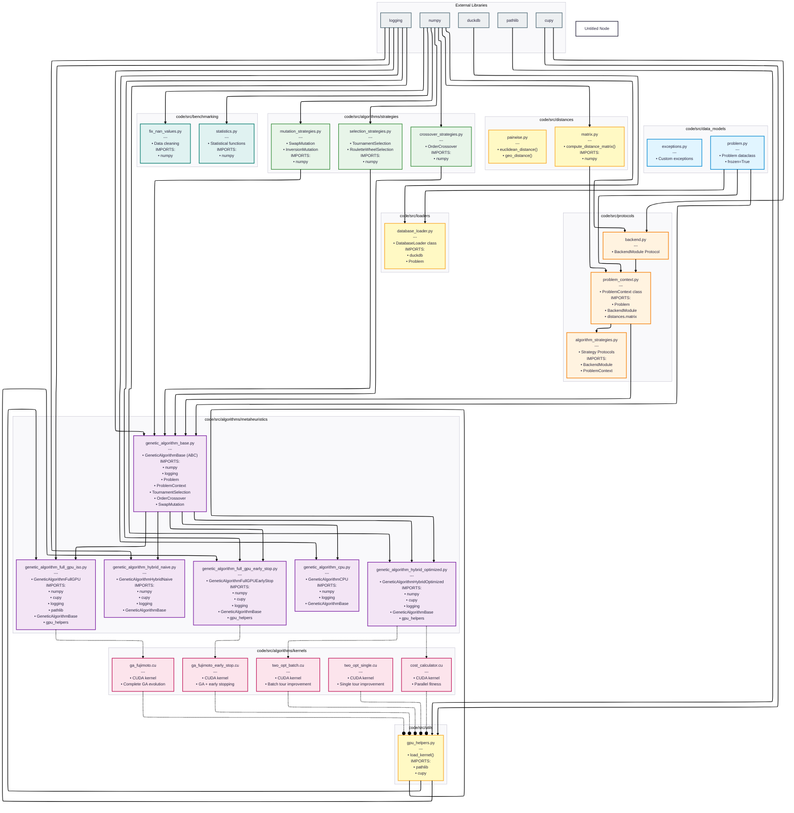

# Module Import and Dependency Graph

This diagram shows all import relationships and dependencies between modules in the `code/src` directory.



## Import Analysis

### Top-Level Module Structure

```
code/src/
├── data_models/          # Immutable data structures
├── protocols/            # Interface definitions
├── utils/                # Helper functions
├── distances/            # Distance calculations
├── loaders/              # Data loading
├── algorithms/
│   ├── strategies/       # Strategy implementations
│   ├── metaheuristics/   # GA implementations
│   └── kernels/          # CUDA kernels (.cu files)
└── benchmarking/         # Statistical tools
```

### Critical Import Chains

#### 1. Algorithm Execution Chain

```
User Script
  → GeneticAlgorithm* (concrete variant)
    → GeneticAlgorithmBase (abstract)
      → TournamentSelection/OrderCrossover/SwapMutation
      → ProblemContext
        → Problem
        → distances.matrix
          → numpy/cupy
```

#### 2. GPU Kernel Loading Chain

```
GeneticAlgorithmHybridOptimized/FullGPU
  → gpu_helpers.load_kernel()
    → pathlib (find .cu file)
    → cupy.RawKernel (compile)
      → CUDA Runtime (execute)
```

#### 3. Data Loading Chain

```
Benchmark Script
  → DatabaseLoader
    → duckdb (query)
    → Problem (construct)
```

### Import Dependencies by Module

#### genetic_algorithm_base.py

```python
import numpy as np
import logging
from typing import List, Tuple, Dict, Any, Optional

from src.data_models.problem import Problem
from src.protocols.problem_context import ProblemContext
from src.algorithms.strategies.selection_strategies import TournamentSelection
from src.algorithms.strategies.crossover_strategies import OrderCrossover
from src.algorithms.strategies.mutation_strategies import SwapMutation
```

#### genetic_algorithm_cpu.py

```python
import numpy as np
import logging
from typing import Any

from src.algorithms.metaheuristics.genetic_algorithm_base import (
    GeneticAlgorithmBase,
)
```

#### genetic_algorithm_full_gpu_iso.py

```python
import numpy as np
import cupy as cp
import logging
import time
from typing import Any, Optional
from pathlib import Path

from src.algorithms.metaheuristics.genetic_algorithm_base import (
    GeneticAlgorithmBase,
)
from src.utils.gpu_helpers import load_kernel
```

#### problem_context.py

```python
import numpy as np
from typing import Optional

from ..data_models.problem import Problem
from ..protocols.backend import BackendModule
from ..distances.matrix import compute_distance_matrix

try:
    import cupy as cp
    CUPY_AVAILABLE = True
except ImportError:
    cp = None
    CUPY_AVAILABLE = False
```

#### gpu_helpers.py

```python
from pathlib import Path
import cupy as cp

def load_kernel(kernel_filename: str, kernel_function_name: str, caller_file_path: str):
    # Navigate to algorithms/kernels/ from any algorithm subdirectory
    caller_dir = Path(caller_file_path).parent
    kernel_dir = caller_dir.parent / "kernels"
    kernel_path = kernel_dir / kernel_filename
    
    kernel_source = kernel_path.read_text()
    return cp.RawKernel(kernel_source, kernel_function_name)
```

### Circular Dependency Prevention

The architecture prevents circular dependencies through:

1. **Layered Architecture**: Dependencies flow in one direction (bottom-up)
   - Data Models → Protocols → Strategies → Algorithms

2. **Protocol-Based Design**: Interfaces defined separately from implementations
   - `BackendModule` protocol allows NumPy/CuPy abstraction
   - Strategy protocols in `algorithm_strategies.py`

3. **Dependency Injection**: Backend and context passed as parameters
   - No hardcoded backend references
   - ProblemContext injected into algorithms

### Module Responsibilities

| Module | Responsibility | Imports From |
|--------|---------------|--------------|
| `data_models/` | Data structures | None (leaf nodes) |
| `protocols/` | Interface definitions | `data_models/`, external libs |
| `distances/` | Distance calculations | `numpy` |
| `loaders/` | Data loading | `duckdb`, `data_models/` |
| `strategies/` | GA operators | `numpy`, `protocols/` |
| `metaheuristics/` | GA algorithms | All layers above |
| `utils/` | Helper functions | `cupy`, `pathlib` |
| `kernels/` | CUDA code | None (compiled by CuPy) |

### Key Design Decisions

1. **Protocols over Inheritance**: Strategy protocols enable duck typing
2. **Lazy Loading**: ProblemContext delays computation until needed
3. **Kernel Consolidation**: All CUDA kernels in single `kernels/` directory
4. **No Circular Dependencies**: Strict bottom-up dependency flow
5. **Optional GPU Support**: `try/except` for CuPy imports

## Imports Visualization by File

### Most Imported Modules (Dependencies)

1. **numpy** - Used by 90% of modules
2. **logging** - Used by all GA variants
3. **GeneticAlgorithmBase** - Parent of all variants
4. **Problem** - Core data structure
5. **ProblemContext** - Backend abstraction

### Most Importing Modules (Dependents)

1. **GeneticAlgorithmBase** - Imports 8 different modules
2. **GeneticAlgorithmFullGPU** - Imports 7 modules + kernels
3. **ProblemContext** - Imports 4 modules

### Minimal Import Modules

- **Problem** - Zero imports (frozen dataclass)
- **BackendModule** - Protocol-only definition
- **CUDA kernels** - Standalone C++ files

## Academic References

- **Martin (2017)**: "Clean Architecture" - Dependency rule and layered design
- **Fowler (2002)**: "Patterns of Enterprise Application Architecture" - Lazy loading pattern
- **PEP 544**: "Protocols: Structural subtyping" - Protocol-based design in Python
