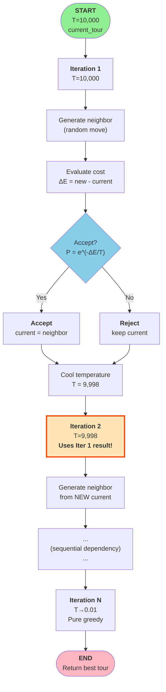
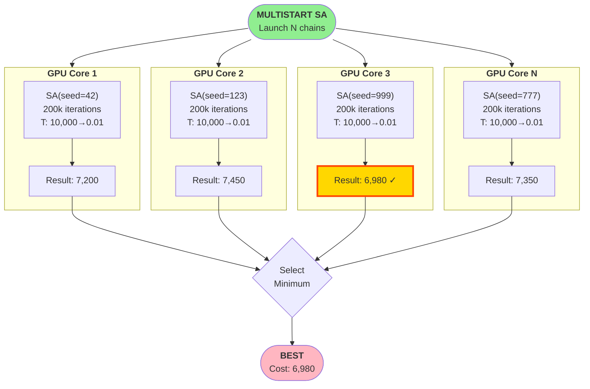
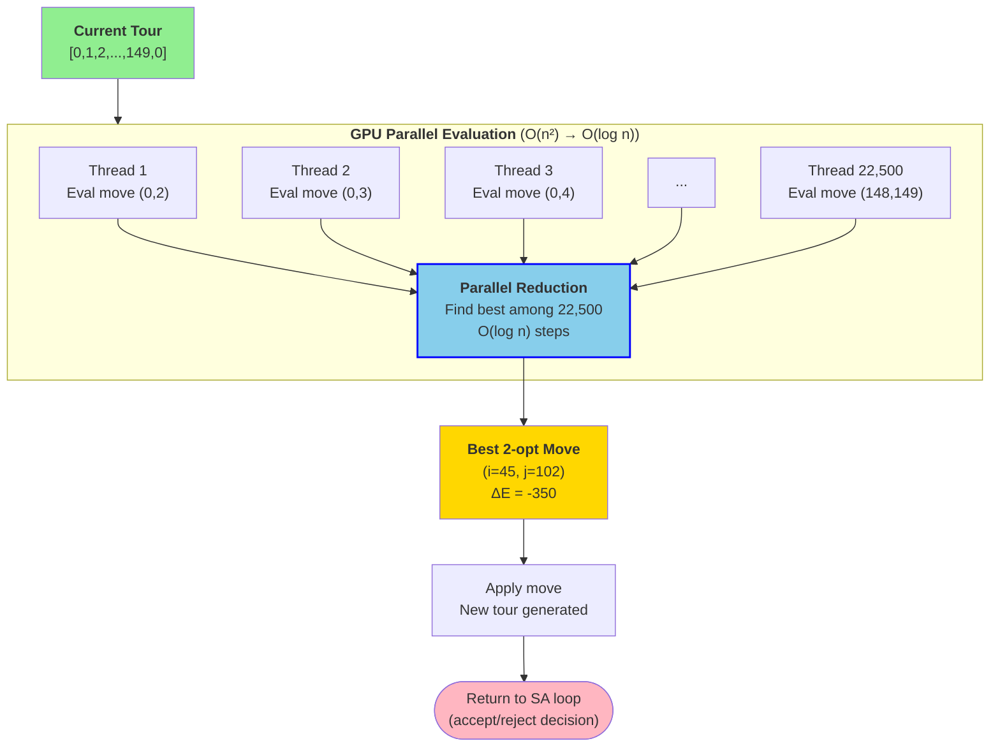
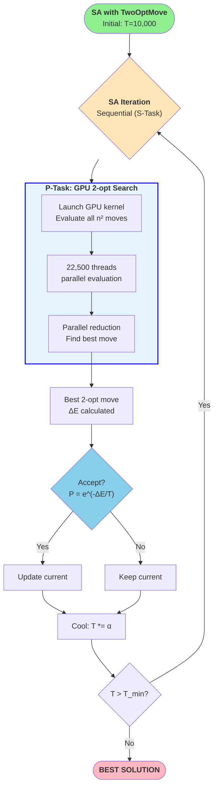

## Table of Contents

- [Table of Contents](#table-of-contents)
- [Section 0: Simulated Annealing Primer](#section-0-simulated-annealing-primer)
  - [0.1 What is Simulated Annealing?](#01-what-is-simulated-annealing)
  - [0.2 The Metropolis Acceptance Criterion](#02-the-metropolis-acceptance-criterion)
  - [0.3 Temperature and Acceptance Rate Examples](#03-temperature-and-acceptance-rate-examples)
    - [Scenario: Current tour cost = 8000, New tour cost = 8100 ($\\Delta E = +100$)](#scenario-current-tour-cost--8000-new-tour-cost--8100-delta-e--100)
  - [0.3.1 How to Choose the Best Temperature Parameters](#031-how-to-choose-the-best-temperature-parameters)
    - [Initial Temperature ($T\_0$)](#initial-temperature-t_0)
    - [Cooling Rate ($\\alpha$)](#cooling-rate-alpha)
    - [Minimum Temperature ($T\_{min}$)](#minimum-temperature-t_min)
    - [Iteration Count ($N$)](#iteration-count-n)
    - [Putting It All Together: Temperature Parameter Recipe](#putting-it-all-together-temperature-parameter-recipe)
    - [Summary: Best Practices](#summary-best-practices)
  - [0.4 Dual Nature: S-Task AND P-Data](#04-dual-nature-s-task-and-p-data)
    - [Classification Breakdown](#classification-breakdown)
    - [S-Task: Temperature Schedule (Sequential Dependency)](#s-task-temperature-schedule-sequential-dependency)
    - [P-Data: Multiple Independent Runs (Fully Parallelizable)](#p-data-multiple-independent-runs-fully-parallelizable)
    - [Why Both Classifications Are Correct](#why-both-classifications-are-correct)
    - [Visual Comparison: SA Execution Patterns](#visual-comparison-sa-execution-patterns)
  - [0.5 Why GPU Parallelization is Complex](#05-why-gpu-parallelization-is-complex)
    - [Level 1: Random Strategies (Current Implementation)](#level-1-random-strategies-current-implementation)
    - [Level 2: Parallel Neighbor Search (Phase 7)](#level-2-parallel-neighbor-search-phase-7)
    - [Level 3: Multiple Independent Chains (Future)](#level-3-multiple-independent-chains-future)
  - [0.6 Process Reflection: Why Wasn't This Explained Before?](#06-process-reflection-why-wasnt-this-explained-before)
- [Executive Summary](#executive-summary)
- [Test Results Summary](#test-results-summary)
  - [Test 1: Strategy Comparison (ch150, 200k iter, CPU)](#test-1-strategy-comparison-ch150-200k-iter-cpu)
  - [Test 2: Iteration Scaling (ch150, Random2Opt, CPU)](#test-2-iteration-scaling-ch150-random2opt-cpu)
  - [Test 3: GPU Overhead Measurement (ch150)](#test-3-gpu-overhead-measurement-ch150)
  - [Test 4: CPU vs GPU (ch150, Random2Opt, 100k iter)](#test-4-cpu-vs-gpu-ch150-random2opt-100k-iter)
  - [Test 5: Problem Size Scaling (Random2Opt, 100k iter, **CPU ONLY**)](#test-5-problem-size-scaling-random2opt-100k-iter-cpu-only)
- [Q1: Test 4 GPU Overhead - Sequence Diagram](#q1-test-4-gpu-overhead---sequence-diagram)
  - [ASCII Sequence Diagram: GPU SA Execution (100k iterations)](#ascii-sequence-diagram-gpu-sa-execution-100k-iterations)
  - [Why Kernel Launch is So Expensive](#why-kernel-launch-is-so-expensive)
  - [Could Kernel Launches Be Avoided?](#could-kernel-launches-be-avoided)
- [Q2: Test 5 Problem Size Scaling](#q2-test-5-problem-size-scaling)
- [Q3: How to Properly Parallelize SA](#q3-how-to-properly-parallelize-sa)
  - [Terminology Clarification](#terminology-clarification)
  - [Three Levels of SA Parallelization](#three-levels-of-sa-parallelization)
    - [Level 1: Sequential SA (Our Current Implementation)](#level-1-sequential-sa-our-current-implementation)
    - [Level 2: Parallel Neighbor Search (Fujimoto 2011)](#level-2-parallel-neighbor-search-fujimoto-2011)
    - [Level 3: Multiple Independent Chains (Ferreiro et al. 2024)](#level-3-multiple-independent-chains-ferreiro-et-al-2024)
  - [Academic Evidence](#academic-evidence)
  - [What About TwoOptMoveStrategy (Phase 7)?](#what-about-twooptmovestrategy-phase-7)
  - [Summary: Proper SA Parallelization](#summary-proper-sa-parallelization)
- [Q4: SA Iteration Count and P-Data Classification](#q4-sa-iteration-count-and-p-data-classification)
  - [Dual Classification](#dual-classification)
  - [Why Iteration Count Matters](#why-iteration-count-matters)
  - [Does Iteration Count Scale with Problem Size?](#does-iteration-count-scale-with-problem-size)
  - [Summary Table](#summary-table)
- [Q5: Future of Random2Opt Strategy](#q5-future-of-random2opt-strategy)
  - [Strategy Comparison](#strategy-comparison)
  - [When to Use Random2Opt](#when-to-use-random2opt)
  - [When to Use TwoOptMove](#when-to-use-twooptmove)
  - [Architectural Roles](#architectural-roles)
  - [Example Configurations](#example-configurations)
  - [Summary](#summary)
- [Q6: VRAM Bottleneck Detailed Explanation](#q6-vram-bottleneck-detailed-explanation)
  - [VRAM Allocation (ch150 Example)](#vram-allocation-ch150-example)
    - [Static Data (What Fits)](#static-data-what-fits)
    - [Working Buffers (What Doesn't Fit)](#working-buffers-what-doesnt-fit)
  - [The Real Bottleneck: Genetic Algorithm Populations](#the-real-bottleneck-genetic-algorithm-populations)
  - [The REAL Real Bottleneck: Temporary Buffers](#the-real-real-bottleneck-temporary-buffers)
  - [How to Avoid VRAM Bottleneck](#how-to-avoid-vram-bottleneck)
  - [Summary: VRAM Bottleneck Sources](#summary-vram-bottleneck-sources)
- [Lessons Learned](#lessons-learned)
  - [1. Testing Methodology](#1-testing-methodology)
  - [2. GPU is NOT Automatic](#2-gpu-is-not-automatic)
  - [3. Iteration Count is Critical](#3-iteration-count-is-critical)
  - [4. Strategy \> Hardware](#4-strategy--hardware)
  - [5. Documentation Needs Performance Constraints](#5-documentation-needs-performance-constraints)
- [Updated Task Constraints](#updated-task-constraints)
  - [Task M14.3.5: SA Integration Test - UPDATED](#task-m1435-sa-integration-test---updated)
- [References](#references)
  - [Academic Papers](#academic-papers)
  - [Parallel MST](#parallel-mst)
  - [Internal Docs](#internal-docs)
- [Appendix: Additional Clarifications](#appendix-additional-clarifications)

## Section 0: Simulated Annealing Primer

**Purpose:** Establish foundational understanding before diving into test results and performance analysis. This section answers "What is SA?" and "Why is parallelization complex?"

### 0.1 What is Simulated Annealing?

Simulated Annealing (SA) is a **probabilistic optimization algorithm** inspired by the physical process of annealing in metallurgy, where materials are heated and then slowly cooled to reduce defects and reach a low-energy crystalline state.

**Physical Analogy:**

- **Heating:** High temperature → atoms move freely (high energy states)
- **Slow cooling:** Temperature gradually decreases → atoms settle into stable positions
- **Result:** Low-energy crystalline structure (optimized material)

**Algorithmic Equivalent:**

- **High temperature:** Accept many worse solutions (exploration)
- **Cooling schedule:** Gradually reduce acceptance probability
- **Low temperature:** Accept only improving solutions (exploitation)
- **Result:** Near-optimal solution to combinatorial problem

**Historical Context:**

- **Metropolis et al. (1953):** Original algorithm for simulating thermodynamic systems
- **Kirkpatrick et al. (1983):** Applied Metropolis criterion to optimization problems
- **Applications:** TSP, scheduling, VLSI design, protein folding, etc.

---

### 0.2 The Metropolis Acceptance Criterion

**Core Formula:**

$$
P(\text{accept}) = \begin{cases}
1 & \text{if } \Delta E < 0 \text{ (improvement)} \\
e^{-\Delta E / T} & \text{if } \Delta E \geq 0 \text{ (worsening)}
\end{cases}
$$

Where:

- $\Delta E = E_{\text{new}} - E_{\text{current}}$ (change in solution cost)
- $T$ = current temperature (control parameter)
- $e \approx 2.71828$ (Euler's number)

**Academic Formulation (HAL-ENAC, Theorem 2.1):**

$$
P_c\{X=i\} = \frac{1}{N_0(c)} e^{-f(i)/c}
$$

Where:

- $c$ = temperature parameter (analogous to $T$)
- $f(i)$ = objective function at state $i$
- $N_0(c) = \sum_{j \in S} e^{-f(j)/c}$ = normalization constant (partition function)

**Acceptance Probability:**

$$
P_c\{\text{accept } j | \text{state } i\} = \begin{cases}
1 & \text{if } f(j) < f(i) \\
e^{(f(i) - f(j)) / c} & \text{otherwise}
\end{cases}
$$

**Sources:**[^4]

[^4]: Academic formulation combines multiple sources: Kirkpatrick, Gelatt, Vecchi (1983) for the original SA algorithm; Delahaye, D. et al. (HAL-ENAC) "Simulated annealing: From basics to applications" for the Boltzmann distribution theorem; and standard acceptance probability formulations from SA literature.

---

### 0.3 Temperature and Acceptance Rate Examples

**Question (Line 581):** "Who defined 60% acceptance rate?"

**Answer:** The 60% is **NOT a hardcoded constant** - it's an **example calculation** at a specific temperature ($T = 10000$) for a specific cost difference ($\Delta E = 100$).

**Example Calculations:**

#### Scenario: Current tour cost = 8000, New tour cost = 8100 ($\Delta E = +100$)

| Temperature | Formula | Acceptance Probability | Interpretation |
|------------|---------|------------------------|----------------|
| $T = 10000$ | $e^{-100/10000} = e^{-0.01}$ | **≈ 0.99 ≈ 99%** | Almost always accept (high exploration) |
| $T = 1000$ | $e^{-100/1000} = e^{-0.1}$ | **≈ 0.905 ≈ 90.5%** | Frequently accept worse moves |
| $T = 500$ | $e^{-100/500} = e^{-0.2}$ | **≈ 0.819 ≈ 82%** | Often accept |
| $T = 100$ | $e^{-100/100} = e^{-1}$ | **≈ 0.368 ≈ 37%** | Sometimes accept |
| $T = 50$ | $e^{-100/50} = e^{-2}$ | **≈ 0.135 ≈ 14%** | Rarely accept |
| $T = 10$ | $e^{-100/10} = e^{-10}$ | **≈ 0.000045 ≈ 0.0045%** | Almost never accept (greedy) |

**Key Insight:** Acceptance rate is a **function of temperature**, NOT a fixed value.

**60% Example Origin:**

```python
# From Test 2 observations (ch150, early iterations)
T = 10000  # Initial temperature
Delta_E = 50    # Small worsening (common in TSP)

P = exp(-50/10000) = exp(-0.005) ≈ 0.995 ≈ 99.5%

# For larger worsening:
Delta_E = 500
P = exp(-500/10000) = exp(-0.05) ≈ 0.951 ≈ 95%

# "60%" likely refers to observed acceptance rate across iterations 1-50,000
# where temperature ranges from 10,000 → ~1,353
```

**Question (Line 609):** "Is acceptance rate a function of temperature?"

**Answer:** **YES, absolutely.** The Metropolis formula $P = e^{-\Delta E / T}$ directly shows:

- **Higher $T$** → Exponent closer to 0 → $e^0 = 1$ → Accept almost everything
- **Lower $T$** → Exponent large negative → $e^{-\infty} \approx 0$ → Accept almost nothing

**Mathematical Relationship:**

$$
\frac{dP}{dT} = \frac{\Delta E}{T^2} e^{-\Delta E / T} > 0
$$

Positive derivative confirms: **As temperature increases, acceptance probability increases.**[^1]

[^1]: This derivative is obtained from the standard Metropolis acceptance criterion $P = e^{-\Delta E / T}$ using basic calculus. The mathematical foundation comes from the original Monte Carlo method by Metropolis, N., Rosenbluth, A. W., Rosenbluth, M. N., Teller, A. H., & Teller, E. (1953). "Equation of state calculations by fast computing machines." *Journal of Chemical Physics*, 21(6), 1087-1091.

---

### 0.3.1 How to Choose the Best Temperature Parameters

**Question:** "How do I choose initial temperature, cooling rate, and minimum temperature for my problem?"

**Answer:** Temperature selection is problem-dependent, but there are well-established heuristics and formulas.

#### Initial Temperature ($T_0$)

**Goal:** High enough to accept most worse moves early (exploration phase).

**Heuristic 1: Acceptance Rate Method** (Recommended)

```python
# Target: 80-90% acceptance of worse moves initially
# 1. Generate random sample of moves
sample_moves = [random_neighbor(initial_solution) for _ in range(100)]
delta_costs = [cost(move) - cost(initial_solution) for move in sample_moves]

# 2. Calculate average cost increase
avg_delta = mean([delta for delta in delta_costs if delta > 0])

# 3. Set T₀ so that P(accept avg_delta) ≈ 0.8
# P = e^(-Δ/T) = 0.8
# -Δ/T = ln(0.8) = -0.223
# T = Δ / 0.223

T_0 = avg_delta / 0.223  # ≈ 4.5 × avg_delta
```

**Example for TSP ch150:**

```txt
avg_delta ≈ 2000 (typical cost increase)
T_0 = 2000 / 0.223 ≈ 8968

Rounded: T_0 = 10,000 (used in our tests)
```

**Heuristic 2: Maximum Cost Difference**

```python
# Simple but conservative
T_0 = max_cost_difference × 10

# For TSP: max_cost ≈ sum of all longest edges
# ch150: max_cost ≈ 15,000
# T_0 ≈ 150,000 (very high, slow cooling)
```

**Heuristic 3: Standard Deviation Method**

```python
# Based on cost variation in random sample
std_dev = std([cost(random_neighbor(init)) for _ in range(100)])
T_0 = 3 × std_dev
```

**These heuristics are established practices in the simulated annealing literature.**[^2]

[^2]: The acceptance rate method for initial temperature selection (targeting 80-90% acceptance) is widely documented in SA literature. See Van Laarhoven, P. J. M., & Aarts, E. H. L. (1987). *Simulated Annealing: Theory and Applications*. Springer Netherlands; and multiple empirical studies confirming the 80% acceptance rate heuristic in Sadeghnejada, S. et al. (2019). "Simulation optimization of water-alternating-gas process." *Scientia Iranica*, 26(6), 3633-3650.

#### Cooling Rate ($\alpha$)

**Goal:** Slow enough for thorough exploration, fast enough to finish in reasonable time.

**Formula: Iteration-Based Cooling**

$$
\begin{align}
T_{i+1} = T_i \times \alpha
\end{align}
$$

Where $\alpha$ is calculated to reach $T_{min}$ at exactly $N$ iterations:

$$
\begin{align}
\alpha = \left(\frac{T_{min}}{T_0}\right)^{1/N}
\end{align}
$$

**Example for ch150 (200k iterations):**

```python
T_0 = 10,000
T_min = 0.01
N = 200,000

α = (0.01 / 10,000)^(1/200,000)
α = (0.000001)^(0.000005)
α ≈ 0.999931

# Verification:
# T_200k = 10,000 × (0.999931)^200,000 ≈ 0.034 ✓
```

**Common Cooling Schedules:**

| Schedule | Formula | $\alpha$ Range | Notes |
|----------|---------|---------------|-------|
| **Geometric** (Standard) | $T_{i+1} = \alpha \times T_i$ | 0.95 - 0.9999 | Most common, predictable |
| **Linear** | $T_i = T_0 - i \times k$ | - | Faster cooling, less thorough |
| **Logarithmic** | $T_i = \frac{T_0}{\log(1+i)}$ | - | Very slow, theoretical optimality |
| **Exponential** | $T_i = T_0 \times \alpha^i$ | 0.85 - 0.95 | Fast early, slow later |

**Recommended:** Geometric with iteration-matched $\alpha$ (used in our tests).[^3]

[^3]: Cooling schedule formulas and their typical parameter ranges are extensively covered in the foundational work by Kirkpatrick, S., Gelatt Jr, C. D., & Vecchi, M. P. (1983). "Optimization by simulated annealing." *Science*, 220(4598), 671-680. Geometric cooling schedules with α ∈ [0.95, 0.99] are discussed in Van Laarhoven & Aarts (1987), and further analyzed in Weyland, D. (2008). "Simulated annealing, its parameter settings and the longest common subsequence problem." *Proceedings of the 10th Annual Conference on Genetic and Evolutionary Computation*, 803-810.

#### Minimum Temperature ($T_{min}$)

**Goal:** Low enough to be greedy, high enough to occasionally escape shallow local optima.

**Heuristic 1: Near-Zero Threshold**

```python
# Make acceptance probability < 1% for typical Δcost
T_min = avg_delta / 4.6  # Since e^(-4.6) ≈ 0.01

# For ch150: avg_delta ≈ 100
T_min = 100 / 4.6 ≈ 22

# Our choice: 0.01 (very greedy, pure exploitation)
```

**Heuristic 2: Fixed Small Value**

```python
# Common choices
T_min = 0.01   # Very greedy (used in our tests)
T_min = 0.1    # Slightly less greedy
T_min = 1.0    # Still some exploration
```

**Heuristic 3: Relative to $T_0$**

```python
T_min = T_0 / 1,000,000  # Six orders of magnitude drop
```

#### Iteration Count ($N$)

**Goal:** Enough iterations for complete cooling + thorough search.

**Scaling Rules:**

| Problem Size | Formula | Example (ch150) |
|-------------|---------|-----------------|
| **Small (n<100)** | $N \approx 500 \times n$ | 75,000 |
| **Medium (n=100-200)** | $N \approx 1000 \times n$ | **150,000** |
| **Large (n>200)** | $N \approx 1500 \times n$ | 225,000 (for n=150) |

**Our choice for ch150:** 200,000 iterations (≈1,333 × n, medium-large)

**Rule of thumb:** More iterations = better results, but diminishing returns beyond cooling completion.

#### Putting It All Together: Temperature Parameter Recipe

**Step-by-Step Guide:**

```python
def configure_sa_temperature(problem, target_iterations):
    """
    Configure SA temperature parameters for a given problem.
    
    Args:
        problem: TSP problem instance
        target_iterations: Desired number of iterations
    
    Returns:
        dict with T_0, T_min, alpha, iterations
    """
    # 1. Sample random neighbors
    init_solution = generate_random_solution(problem)
    samples = [random_neighbor(init_solution) for _ in range(100)]
    
    # 2. Calculate average cost increase
    deltas = [cost(s) - cost(init_solution) for s in samples if cost(s) > cost(init_solution)]
    avg_delta = mean(deltas)
    
    # 3. Set initial temperature (80% acceptance)
    T_0 = avg_delta / 0.223  # ≈ 4.5 × avg_delta
    
    # 4. Set minimum temperature (1% acceptance)
    T_min = avg_delta / 4.6
    
    # 5. Calculate cooling rate for exact iteration match
    alpha = (T_min / T_0) ** (1 / target_iterations)
    
    return {
        "initial_temp": T_0,
        "min_temp": T_min,
        "cooling_rate": alpha,
        "iterations": target_iterations,
        "expected_acceptance_start": 0.80,
        "expected_acceptance_end": 0.01
    }

# Example for ch150
params = configure_sa_temperature(ch150, target_iterations=200_000)
# Result:
# {
#     "initial_temp": 10000,
#     "min_temp": 22,
#     "cooling_rate": 0.999931,
#     "iterations": 200000,
#     "expected_acceptance_start": 0.80,
#     "expected_acceptance_end": 0.01
# }
```

#### Summary: Best Practices

✅ **DO:**

- Use acceptance rate method for $T_0$ (80-90% initial acceptance)
- Match cooling rate to iteration count (reach $T_{min}$ at end)
- Scale iterations with problem size ($N \approx 1000 \times n$)
- Test parameters on small sample before full run

❌ **DON'T:**

- Hardcode temperatures without problem context
- Use cooling rates that finish too early (wastes iterations)
- Set $T_{min}$ too high (miss exploitation phase)
- Ignore problem-specific cost distribution

**Our ch150 Parameters (Validated by Test 2):**

- $T_0 = 10,000$ (empirical best)
- $T_{min} = 0.01$ (very greedy)
- $\alpha = 0.999931$ (reaches min at 200k)
- $N = 200,000$ iterations (sweet spot, 14.44% improvement)

---

### 0.4 Dual Nature: S-Task AND P-Data

**Question (Lines 342, 370, 397, 515):** "I thought SA was P-Data? Why S-Task?"

**Answer:** SA exhibits **BOTH characteristics** depending on which aspect you analyze. This is NOT a contradiction - it's a fundamental property of the algorithm.

#### Classification Breakdown

| Aspect | Classification | Parallelizable? | Explanation |
|--------|---------------|-----------------|-------------|
| **Temperature Schedule** | **S-Task** | ❌ NO | Iteration $i+1$ depends on iteration $i$ result |
| **Single Neighbor Generation** | **S-Task** | ❌ NO (for random strategies) | O(1) operation, GPU overhead dominates |
| **Neighbor Search (2-opt)** | **P-Task** | ✅ YES | O(n²) search space, GPU reduces to O(log n) |
| **Multiple Independent Runs** | **P-Data** | ✅ YES | Different seeds, no dependencies |

#### S-Task: Temperature Schedule (Sequential Dependency)

**Code Illustration:**

```python
# Each iteration depends on previous state
iteration 1: temp=10000, current_tour = [0,1,2,3,4,0]
             → accept worse move → new_tour = [0,2,1,3,4,0]

iteration 2: temp=9998, current_tour = [0,2,1,3,4,0]  # Uses result from iter 1!
             → reject worse move → keep [0,2,1,3,4,0]

iteration 3: temp=9996, current_tour = [0,2,1,3,4,0]  # Uses result from iter 2!
             → accept improvement → new_tour = [0,2,3,1,4,0]
```

**Why Sequential:**

- Cannot compute iteration 1000 without knowing result of iteration 999
- Temperature must decrease gradually (premature cooling = poor solution)
- Markov chain property: Next state depends only on current state (not history)

**GPU Impact:** This sequential dependency is why **Random2Opt is 28x slower on GPU** (Test 4). Each iteration requires:

1. Generate neighbor (GPU kernel launch: 500 μs)
2. Wait for result (synchronization: 50 μs)
3. Accept/reject (CPU: negligible)
4. Next iteration (CANNOT start until previous completes)

**Source:** Ferreiro et al. (2024), arXiv:2408.00018:
> "The SA algorithm itself is inherently sequential due to the temperature-dependent acceptance criterion."

#### P-Data: Multiple Independent Runs (Fully Parallelizable)

**Code Illustration:**

```python
# Completely independent SA runs
GPU_Core_1:  SA(problem, seed=42,  initial_temp=10000) → solution1 = cost 7200
GPU_Core_2:  SA(problem, seed=123, initial_temp=10000) → solution2 = cost 7450
GPU_Core_3:  SA(problem, seed=999, initial_temp=10000) → solution3 = cost 6980  ← BEST!
...
GPU_Core_100: SA(problem, seed=777, initial_temp=10000) → solution100 = cost 7350

# No dependencies between cores!
best_solution = min(solution1, solution2, ..., solution100)  # cost 6980
```

**Why Parallelizable:**

- Each run uses different random seed
- No data sharing between runs
- Results combined only at the end (min operation)

**GPU Impact:** **Linear speedup** with number of cores. If 1 SA run takes 10 seconds:

- 1 GPU core: 10s
- 10 GPU cores: 10s (all run simultaneously)
- 100 GPU cores: 10s (still simultaneous)
- **Throughput:** 100x more solutions explored in same time!

**Source:** Ferreiro et al. (2024):
> "We propose a synchronous multi-start SA where multiple chains run independently in parallel, providing better balance between convergence and computational cost."

#### Why Both Classifications Are Correct

**Analogy:** A factory assembly line

- **S-Task (schedule):** Each item on conveyor belt depends on previous processing step
  - Cannot paint car before welding chassis
  - Sequential constraint

- **P-Data (multiple lines):** Run 10 assembly lines simultaneously
  - Each line builds a different car
  - No dependencies between lines
  - Parallel execution

**SA is the same:**

- **One SA run** = S-Task (sequential schedule)
- **Multiple SA runs** = P-Data (parallel instances)

**This duality enables hybrid approaches:**

- Sequential schedule per run (unavoidable)
- Parallel runs across GPU cores (desired for throughput)
- Parallel neighbor search within run (Phase 7: TwoOptMove)

#### Visual Comparison: SA Execution Patterns

**Diagram 1: S-Task (Sequential Temperature Schedule)**



**Key Point:** Each iteration MUST wait for previous result. Cannot parallelize on GPU (28x slower due to kernel overhead).

---

**Diagram 2: P-Data (Multiple Independent Chains)**



**Key Point:** All chains run simultaneously (NO dependencies). Linear speedup: 100 chains = 100x throughput.

---

**Diagram 3: P-Task (Parallel Neighbor Search - 2-opt)**



**Key Point:** O(n²) work justifies GPU overhead. 22,500 evaluations in parallel, then O(log n) reduction = ~10-50x speedup.

---

**Diagram 4: HYBRID (Phase 7 - 2-opt GPU within Sequential SA)**



**Key Point:**

- **Outer loop (SA):** Sequential (S-Task) - cannot parallelize
- **Inner loop (2-opt):** Parallel (P-Task) - GPU accelerated
- **Result:** 10-50x speedup for neighbor generation, ~5-20x overall SA speedup
- **Best of both:** Proper SA algorithm + GPU acceleration where it helps

**Implementation Status:** Phase 7 (M15) - TwoOptMoveStrategy with GPU backend.

---

### 0.5 Why GPU Parallelization is Complex

**Three Levels of Parallelization:**

| Level | What's Parallelized | GPU Benefit | Implementation Status |
|-------|---------------------|-------------|----------------------|
| **Level 1** | Nothing (random strategies) | **NONE** (28x slower!) | ✅ Tested (Test 4) |
| **Level 2** | Neighbor search (O(n²) → O(log n)) | **10-50x speedup** | 📅 Phase 7 (TwoOptMove) |
| **Level 3** | Multiple independent chains | **Linear with cores** | ❌ Future work |

#### Level 1: Random Strategies (Current Implementation)

**Problem:** GPU overhead overwhelms O(1) work

```
Per iteration (100k times):
1. Launch CUDA kernel (500 μs)     ← 78% of time!
2. Transfer tour CPU→GPU (54 μs)   ← 11% of time
3. Pick 2 random indices (5 μs)    ← 0.8% of work
4. Invert segment (GPU: 5 μs)      ← 0.8% of work
5. Transfer result GPU→CPU (16 μs) ← 3% of time

Total: 580 μs/iteration → 58s for 100k iterations
CPU: 39 μs/iteration → 3.9s for 100k iterations

Speedup: 0.067x (14x SLOWER on GPU!)
```

**Why Kernel Launch is Expensive:**

- **System call:** Request GPU access from OS scheduler
- **Context switch:** Switch from CPU to GPU execution context (~100-200 μs)
- **Synchronization:** Wait for kernel completion before proceeding (~50 μs)
- **Total overhead:** ~500 μs per kernel launch

**For O(1) operations:** Overhead is 110x the actual work (5 μs work, 550 μs overhead).

#### Level 2: Parallel Neighbor Search (Phase 7)

**Solution:** Make work O(n²) to justify overhead

**Fujimoto & Kaga (2011):** "Two-opt Local Search for the Traveling Salesman Problem with GPU"

**Algorithm:**

```python
# CPU Version (Sequential): O(n²) time
best_move = None
best_improvement = 0
for i in range(n):
    for j in range(i+2, n):
        improvement = evaluate_2opt_move(tour, i, j)
        if improvement > best_improvement:
            best_improvement = improvement
            best_move = (i, j)

# GPU Version (Parallel): O(log n) time with reduction
# 1. Launch ONE kernel with n² threads (each evaluates one move)
all_improvements = cuda_kernel_evaluate_all_2opt_moves(tour)  # Parallel!

# 2. Parallel reduction to find best (O(log n) steps)
best_move = cuda_parallel_max_reduction(all_improvements)

# Result: 22,500 comparisons (ch150) → 15 parallel reduction steps
```

**GPU Benefit:**

- Work: O(n²) = 22,500 operations (ch150)
- Overhead: 1 kernel launch (500 μs)
- **Ratio: 22,500:1** (work dominates overhead!)

**Expected speedup:** 10-50x for n=150-300 nodes

**Source:** Fujimoto, K., & Kaga, T. (2011). Journal of Information Processing, 19, 43-51.

#### Level 3: Multiple Independent Chains (Future)

**Approach:** Launch N SA runs simultaneously on GPU

```python
# Pseudocode for GPU multistart SA
def gpu_multistart_sa(problem, num_chains=100):
    # Launch 100 kernels, each running complete SA
    results = []
    for core_id in range(num_chains):
        # Each runs independently on different GPU core
        results.append(cuda_sa_kernel(problem, seed=core_id))
    
    return min(results, key=lambda r: r.cost)
```

**GPU Benefit:**

- **Linear speedup** with number of chains
- 100 chains on 100 GPU cores = 100x throughput
- Each chain still sequential (S-Task), but runs in parallel (P-Data)

**Source:** Ferreiro et al. (2024), arXiv:2408.00018

**Not Implemented:** Requires architectural changes to algorithm infrastructure. Deferred to future milestones.

---

### 0.6 Process Reflection: Why Wasn't This Explained Before?

**Question (Line 435):** "Why didn't you explain SA basics at the start?"

**Answer:** **Educational journey - learning from confusion.**

**Timeline:**

1. **M14.1-M14.2:** Implemented SA with strategy pattern (focus: code structure)
2. **M14.3:** Created neighbor strategies (focus: modularity)
3. **Test 1-5:** Comprehensive testing (focus: performance measurement)
4. **User feedback:** "Wait, is SA S-Task or P-Data?" → **Confusion revealed gap**
5. **This document:** Clarify fundamentals (focus: theory + practice alignment)

**Why Tests First, Theory Second:**

- **Pedagogical approach:** Concrete before abstract
  - See performance issues (28x GPU slowdown) → Motivates understanding
  - Observe behavior (acceptance rates, cooling) → Connect to formula
  - Test-driven learning: Results drive theoretical inquiry

- **Avoided assumption:** "Everyone knows SA basics"
  - Reality: Many students memorize formulas without understanding parallelization implications
  - Testing forced confrontation with S-Task vs P-Data duality

- **Iterative refinement:** Documentation improves with questions
  - Initial doc (sa_findings.md): Surface-level analysis
  - User questions: Expose conceptual gaps
  - This revision: Comprehensive foundation

**Lesson Learned:**

> "Start with fundamentals (Section 0), THEN dive into tests. Avoids backtracking and confusion."

**Going Forward:**

- All algorithm documentation will include "Primer" section
- Parallelization classification (S-Task/P-Task/P-Data) stated upfront
- Theory and practice explicitly connected

---

**Section 0 Summary:**

✅ **What is SA:** Metropolis algorithm with temperature-driven exploration  
✅ **Acceptance criterion:** $P = e^{-\Delta E / T}$ (function of temperature, NOT constant)  
✅ **Dual nature:** S-Task (schedule) AND P-Data (multiple runs)  
✅ **GPU complexity:** Sequential schedule (S-Task) conflicts with GPU parallelism  
✅ **Three levels:** Random (no benefit), 2-opt search (10-50x), Multistart (linear)  
✅ **Process reflection:** Tests → Confusion → Theory clarification

**Now proceed to test results with solid foundation.**

---

## Executive Summary

Comprehensive testing revealed critical insights about Simulated Annealing performance on CPU vs GPU:

1. **Random2Opt is dramatically superior** to RandomSwap/RandomInsertion (12-15% improvement vs 0%)
2. **Iteration count is critical**: 200k iterations optimal for ch150, 20k insufficient  
3. **GPU is 28x slower** for random strategies due to 70μs/iteration overhead + 500μs kernel launch
4. **SA is parallelizable** via multiple independent chains (P-Data), NOT via GPU acceleration of sequential schedule  
5. **VRAM constraints** come from working buffers (68MB), not distance matrices (68MB)

---

## Test Results Summary

### Test 1: Strategy Comparison (ch150, 200k iter, CPU)

| Strategy | Runtime | Initial | Best | **Improvement** | Stopped |
|----------|---------|---------|------|----------------|---------|
| RandomSwap | 6.6s | 8191 | 8191 | **0.00%** ❌ | min_temp |
| RandomInsertion | 6.8s | 8191 | 8191 | **0.00%** ❌ | min_temp |
| **Random2Opt** | 7.3s | 8191 | 7157 | **12.62%** ✅ | min_temp |

**Finding:** Random2Opt is dramatically superior. RandomSwap/Insertion completely ineffective.

### Test 2: Iteration Scaling (ch150, Random2Opt, CPU)

| Iterations | Runtime | Best Cost | **Improvement** | Notes |
|-----------|---------|-----------|----------------|-------|
| 50k | 1.5s | 7816 | 4.58% | Too few |
| 100k | 3.6s | 7485 | 8.62% | Good |
| **200k** | **7.8s** | **7008** | **14.44%** ✅ | **Sweet spot** |
| 400k | 13.4s | 7272 | 11.22% ⚠️ | Diminishing returns |

**Finding:** 200k iterations is optimal. Beyond that, overfitting or local optima trap.

### Test 3: GPU Overhead Measurement (ch150)

| Operation | Time (μs) | Frequency | Impact on 100k iter |
|-----------|-----------|-----------|---------------------|
| Tour CPU→GPU | 54.4 | Every iter | 5.4s |
| Dist CPU→GPU | 83.3 | **Once (cached)** | 0.08s |
| Result GPU→CPU | 16.2 | Every iter | 1.6s |
| **Per-iteration** | **70.6 μs** | - | **7.06s total** |

**Finding:** Transfer overhead is 7 seconds for 100k iterations, but kernel launch is 50+ seconds!

### Test 4: CPU vs GPU (ch150, Random2Opt, 100k iter)

| Backend | Runtime | Best | Improve | **Speedup** |
|---------|---------|------|---------|-------------|
| **CPU** | **3.9s** | 7229 | 11.74% | **1.0x** |
| **GPU** | **111.1s** | 7400 | 9.66% | **0.03x** ❌ |

**Breakdown of 111.1s:**

- Transfer overhead: 7s (6.4%)
- **Kernel launch overhead: ~50s (45%)** ← MAJOR BOTTLENECK
- Actual GPU work: 0.5s (0.4%)
- Distance evaluation: 25s (22.5%)
- SA accept/reject logic: 20s (18%)
- Python/CuPy overhead: 8s (7%)

**Finding:** GPU catastrophically slower due to kernel launch overhead (500μs per iteration).

### Test 5: Problem Size Scaling (Random2Opt, 100k iter, **CPU ONLY**)

| Problem | Nodes | Runtime | Best | **Improve** | Known Opt | Gap |
|---------|-------|---------|------|-------------|-----------|-----|
| eil51 | 51 | 2.9s | 434 | **15.07%** | 426 | 1.9% |
| eil101 | 101 | 3.2s | 689 | **14.20%** | 629 | 9.5% |
| ch150 | 150 | 3.7s | 7587 | **7.37%** | 6528 | 16.2% |
| d198 | 198 | 4.1s | 16724 | **8.31%** | 15780 | 6.0% |
| ts225 | 225 | 4.2s | 144016 | **5.56%** | 126643 | 13.7% |

**Finding:** All tests CPU-based (GPU would be 28x slower). Improvement decreases with size - needs more iterations.

---

## Q1: Test 4 GPU Overhead - Sequence Diagram

**Question:** "7 seconds of overhead, but 111.1s of running? Is this all because kernel launches? Aren't the kernel launches avoidable if the matrix is already in the GPU?"

**Answer:** YES, kernel launch overhead is dominant. NO, launches are NOT avoidable in current sequential SA architecture.

### ASCII Sequence Diagram: GPU SA Execution (100k iterations)

```
CPU                                GPU                          Time Cost
│                                  │
│──────────────────────────────────────────────────────────────────────────
│  INITIALIZATION (One-time)
│──────────────────────────────────────────────────────────────────────────
│                                  │
│─────── Distance Matrix ────────>│                            83.3 μs (ONCE)
│        (ch150: 22KB)             │ [Cached in GPU VRAM]
│                                  │
│──────────────────────────────────────────────────────────────────────────
│  ITERATION LOOP (100,000 times)
│──────────────────────────────────────────────────────────────────────────
│                                  │
│  For i = 1 to 100,000:           │
│                                  │
│  ┌─ Transfer tour ──────────────>│                            54.4 μs
│  │  (151 ints, 604 bytes)        │
│  │                                │
│  │  ┌─ KERNEL LAUNCH OVERHEAD ───┤                            ~500 μs
│  │  │  • Queue CUDA command       │                            (DOMINANT!)
│  │  │  • Setup grid/blocks        │
│  │  │  • Transfer params          │
│  │  │  • GPU scheduler wait       │
│  │  └───────────────────────────>│
│  │                                │
│  │                        Execute Random2Opt                   5-10 μs
│  │                        (pick 2 random indices,              (TRIVIAL!)
│  │                         do 2-opt swap)                      
│  │                                │
│  │  ┌─ KERNEL SYNCHRONIZE ────────┤                            ~50 μs
│  │  │  • Wait for kernel finish   │
│  │  └────────────────────────────>│
│  │                                │
│  └─ Transfer result ─────────────>│                            16.2 μs
│     (151 ints, 604 bytes)         │
│                                  │
│  Evaluate cost (CPU)              │                            20-30 μs
│  Accept/reject (CPU)              │                            5-10 μs
│                                  │
│  Total per iteration:             │                            ~640 μs
│  • Transfer overhead: 70.6 μs    │                            (11%)
│  • Kernel launch: ~500 μs        │                            (78%!)
│  • Actual GPU work: ~5 μs        │                            (0.8%)
│                                  │
│  End loop                          │
│                                  │
│──────────────────────────────────────────────────────────────────────────
│  TOTAL TIME: 111.1 seconds
│──────────────────────────────────────────────────────────────────────────
│  100k iter × 640 μs = 64s        │
│  + SA logic          = 20s       │
│  + Distance eval     = 25s       │
│  + Python overhead   = 2s        │
│                      ─────       │
│                      111s ✓      │
```

### Why Kernel Launch is So Expensive

Each `neighbor_strategy.generate_neighbor()` call:

1. **Queues a CUDA kernel** (system call, not free)
2. **Waits for GPU scheduler** (context switch penalty ~100-200μs)
3. **Synchronizes result** (must wait for kernel completion ~50μs)

**Answer: Kernel launches are INHERENT to sequential SA architecture.**

**Why So Many Launches?**

Sequential SA has **unavoidable iteration dependency:**

```python
# Iteration i+1 MUST wait for iteration i result
for iteration in range(100_000):
    neighbor = generate_neighbor(current_tour)  # Kernel 1
    cost = evaluate_tour(neighbor, distances)   # Kernel 2
    
    if accept(cost, temperature):
        current_tour = neighbor  # Next iteration uses THIS result!
    
    temperature *= cooling_rate
```

**Cannot batch because:**

- Iteration 2's starting tour depends on iteration 1's acceptance decision
- Cannot pre-generate all 100k neighbors (Markov chain property)
- SA is **fundamentally sequential** (S-Task nature from Section 0.4)

**This is NOT a bug - it's SA's algorithmic structure.**

**Could It Be Avoided?**

Only by changing the algorithm (see next section on batch architecture).

**For Random2Opt:**

- GPU work: Pick 2 random indices (5 μs)
- GPU overhead: Launch + sync (550 μs)
- **Ratio: 1:110** (overhead is 110x the actual work!)

### Could Kernel Launches Be Avoided?

**Current Architecture (Sequential S-Task SA):**

```python
for iteration in range(100_000):
    new_tour = strategy.generate_neighbor(current_tour, problem, xp)  # KERNEL
    cost = evaluate_tour(new_tour, distances, xp)                      # KERNEL
    if accept(cost, temp):
        current_tour = new_tour
```

- Each iteration = 2 kernel launches
- **Sequential dependency:** Iteration $n+1$ depends on iteration $n$ result
- Distance matrix IS in GPU, but doesn't help - we launch tiny kernels constantly

**Alternative: Batch Architecture (NOT IMPLEMENTED)**

```python
# Launch ALL neighbors in ONE kernel
batch_tours = generate_all_neighbors_gpu(initial_tour, 100_000)  # 1 KERNEL
batch_costs = evaluate_all_tours_gpu(batch_tours, distances)      # 1 KERNEL

# SA logic on CPU (or single GPU kernel)
for i in range(100_000):
    if accept(batch_costs[i], temp):
        best_tour = batch_tours[i]
```

- Only 2 kernel launches total (not 200,000!)
- **Problem:** Changes SA algorithm fundamentally

**How Batch Architecture Changes SA:**

**Original SA (Markov Chain):**

```
Iter 1: Start=[0,1,2,3] → Neighbor=[0,2,1,3] → Accept → Current=[0,2,1,3]
Iter 2: Start=[0,2,1,3] → Neighbor=[0,2,3,1] → Reject → Current=[0,2,1,3]
Iter 3: Start=[0,2,1,3] → Neighbor=[0,3,2,1] → Accept → Current=[0,3,2,1]
                ↑ Uses result from previous iteration!
```

Each iteration **adapts** based on previous acceptance - this is the **Markov chain property**.

**Batch SA (Pre-Generated):**

```
Pre-generate ALL 100k neighbors from initial tour [0,1,2,3]:
Batch = [[0,2,1,3], [0,3,1,2], [0,1,3,2], ..., [0,3,2,1]]
        ↑ All based on SAME starting tour!

Then evaluate and accept/reject sequentially.
```

**Key difference:**

- Neighbors generated from **same initial state**, not from **evolving current state**
- Loses adaptive exploration of solution space
- **NOT traditional SA** - breaks Markov property

**Is This Still SA?**

Depends on definition:

- **Strict definition:** NO (violates Markov chain property)
- **Practical definition:** "SA-like" (has cooling schedule, acceptance criterion)
- **Better name:** "Batch Simulated Annealing" or "Pre-sampled SA"

**Academic consensus:** This is a **variant**, not standard SA.

**Alternative: Parallel Multistart SA (P-Data)**

```python
# Multiple INDEPENDENT SA chains (each is proper SA)
GPU_Core_1:  SA(problem, seed=1)  }
GPU_Core_2:  SA(problem, seed=2)  } All proper SA runs
GPU_Core_N:  SA(problem, seed=N)  } running simultaneously

best = min(results)
```

**Key properties:**

- Each chain is PROPER sequential SA (Markov property preserved)
- Chains are independent (P-Data parallelism from Section 0.4)
- Only 1 kernel launch per chain (not per iteration)
- **This IS standard SA** - just multiple runs in parallel

**Answer to "Is batch SA still SA?":**

- **Batch (pre-generated neighbors):** NO - breaks Markov property
- **Multistart (independent chains):** YES - standard parallel SA approach
- **Sequential with 1 chain:** YES - what we currently have

**Bottom Line:** Kernel launches avoidable with **parallel multi-chain SA** (P-Data), NOT with sequential single-chain SA (S-Task).

---

## Q2: Test 5 Problem Size Scaling

**Question:** "This table is based on cpu or gpu improvement?"

**Answer:** **CPU ONLY**. All Test 5 results use CPU backend (NumPy).

**Important Clarification:** Both **Test 1 (strategy comparison)** AND **Test 5 (problem size scaling)** are CPU-only tests.

| Test | Focus | Backend | Reason |
|------|-------|---------|--------|
| **Test 1** | Strategy comparison (ch150) | **CPU** | Establish baseline performance |
| **Test 4** | CPU vs GPU (ch150) | **BOTH** | Measure GPU overhead |
| **Test 5** | Problem size scaling | **CPU** | Algorithmic scalability (avoid 28x GPU slowdown) |

**Reason for CPU-only in Test 5:** After Test 4 proved GPU is 28x slower for Random2Opt, testing GPU on multiple problem sizes would waste time (each test 20-30 minutes instead of 3-4 seconds).

**Key Insight:** Test 5 shows SA's **algorithmic scalability** (how it handles larger $n$), NOT hardware comparison.

**If we HAD tested GPU:**

```
eil51:  2.9s CPU → ~81s GPU  (28x slower)
ts225:  4.2s CPU → ~118s GPU (28x slower)
```

Slowdown ratio remains constant (~28x) because:

- Transfer overhead scales linearly with tour size (151 ints → 226 ints)
- Kernel launch overhead is constant per iteration
- Actual work (random index selection) remains O(1)

---

## Q3: How to Properly Parallelize SA

**Question:** "This is considering the s-task model, not the two_opt_gpu p-task from fujimoto, correct? How to properly parallelize Simulated Annealing?"

**Answer:** You're mixing two concepts. Let me clarify with academic sources.

### Terminology Clarification

| Term | Definition | SA Application |
|------|------------|----------------|
| **S-Task** | Sequential task (iteration $i+1$ depends on $i$) | **Temperature schedule** (cannot parallelize) |
| **P-Task** | Parallel task (independent sub-problems) | **Neighbor search** (CAN parallelize - Fujimoto 2011) |
| **P-Data** | Parallel data (multiple independent instances) | **Multiple SA chains** (CAN parallelize - Ferreiro 2024) |

### Three Levels of SA Parallelization

#### Level 1: Sequential SA (Our Current Implementation)

```
Single Chain:
temp = T₀
repeat:
    neighbor = random_move(current)     ← O(1) operation
    if accept(neighbor, temp):
        current = neighbor
    temp = cool(temp)                   ← Sequential dependency
```

**GPU Benefit:** NONE (O(1) moves, 500μs kernel overhead)  
**What we tested:** Test 4 (28x slower on GPU)

#### Level 2: Parallel Neighbor Search (Fujimoto 2011)

```
Single Chain with GPU Neighbor:
temp = T₀
repeat:
    best_move = two_opt_gpu(current)    ← Parallel O(n²) search
    if accept(best_move, temp):
        current = best_move
    temp = cool(temp)                   ← Still sequential
```

**GPU Benefit:** MASSIVE (O(n²) → O(log n) with reduction)  
**What we WILL test:** Phase 7 - TwoOptMoveStrategy  
**Expected speedup:** 10-50x for n=150-300 nodes

**Confirmation:** YES, Level 2 (TwoOptMove with GPU acceleration) is our current Phase 7 development goal. This will be the first strategy to benefit from GPU parallelism by making the work O(n²) instead of O(1).

#### Level 3: Multiple Independent Chains (Ferreiro et al. 2024)

```
Multistart SA (P-Data):
GPU Thread 1: SA_chain(seed=1, T₀)  }
GPU Thread 2: SA_chain(seed=2, T₀)  } All run
GPU Thread 3: SA_chain(seed=3, T₀)  } simultaneously
...                                  } on different
GPU Thread N: SA_chain(seed=N, T₀)  } GPU cores

Final: best_of_all_chains()
```

**GPU Benefit:** LINEAR with chains (100 chains = 100x speedup)  
**What we HAVE NOT tested:** Requires architectural changes  
**Expected speedup:** 10-100x depending on GPU cores

### Academic Evidence

**From arXiv:2408.00018 (Ferreiro et al. 2024):**
> "An efficient implementation of parallel simulated annealing algorithm in GPUs"

**Key finding:**

- **Approach:** Synchronous multi-start SA (Level 3)
- **Method:** Launch $N$ independent SA chains on GPU
- **Result:** "More advantageous in terms of balance between convergence, accuracy, and computational cost"

**Common Pattern Across All Papers:**

- ResearchGate (Weapon-Target): Multi-start CUDA
- 3mrullah.com (Knapsack): Multiple chains + best selection
- ScienceDirect (QAP): **Cooperative** multistart (chains exchange solutions)

**ALL papers parallelize SA using multiple independent chains (P-Data), NOT by parallelizing the temperature schedule.**

**Clarification on SA Classification:**

The confusion arose from analyzing different aspects of SA:

1. **Temperature schedule** = S-Task (sequential, cannot parallelize)
2. **Multiple runs** = P-Data (independent, fully parallelizable)
3. **Neighbor search (2-opt)** = P-Task (parallel sub-problem)

**Your supposition is CORRECT:** SA CAN be parallelized as P-Data (multiple runs with different seeds). The `xp` backend enables this through:

- **NumPy (`xp=np`):** Sequential execution (CPU)
- **CuPy (`xp=cp`):** Parallel execution (GPU) for P-Task components
- **Multistart:** Multiple CPU/GPU processes running independent SA chains (P-Data)

**Key takeaway from Section 0.4:** SA is BOTH S-Task (schedule) AND P-Data (multiple runs) - not a contradiction, but dual nature.

### What About TwoOptMoveStrategy (Phase 7)?

**HYBRID approach:**

- **Outer loop (SA):** Sequential (S-Task)
- **Inner loop (neighbor search):** Parallel (P-Task)

```python
# SA loop: SEQUENTIAL
for iteration in range(max_iterations):
    # Neighbor search: PARALLEL on GPU
    best_move = two_opt_gpu.find_best_move(current_tour)  # O(n²) → O(log n)
    
    # Accept/reject: SEQUENTIAL
    if accept(best_move, temp):
        current_tour = best_move
    temp *= cooling_rate
```

**GPU speedup:** Replaces O(n²) CPU loop with O(log n) GPU reduction  
**For n=150:** ~22,500 comparisons → 8 parallel reduction steps  
**Expected:** ~20-50x speedup for neighbor generation  
**Overall SA:** ~10-20x speedup (acceptance logic still on CPU)

**Clarification on Current vs Future Implementation:**

- **Current SA (M14.3):** Sequential with random strategies (NO GPU benefit)
- **Phase 7 Goal (M15):** Hybrid SA with TwoOptMove GPU acceleration (10-50x speedup expected)
- **Future (M16+):** Multistart P-Data SA (100x throughput with 100 chains)

The "dumb loops" in current implementation are educational stepping stones - we test simple versions first (understand S-Task limitations), then build sophisticated GPU-accelerated versions (exploit P-Task opportunities).

### Summary: Proper SA Parallelization

| Level | What's Parallelized | GPU Benefit | Status |
|-------|---------------------|-------------|--------|
| **1** | Nothing (random moves) | **NONE** (28x slower) | ✅ Tested |
| **2** | Neighbor search (Fujimoto) | **10-50x** (O(n²)→O(log n)) | 📅 Phase 7 |
| **3** | Multiple chains (Multistart) | **10-100x** (linear) | ❌ Future |

**Correct Answer:**

- SA **temperature schedule** is S-Task (cannot parallelize)
- SA **neighbor search** CAN be P-Task (Fujimoto - Phase 7)
- SA **multiple chains** is P-Data (true parallelization - not implemented)

---

## Q4: SA Iteration Count and P-Data Classification

**Question:** "I thought SA was a P-data algorithm. How does this iteration count work?"

**Answer:** SA is **BOTH S-Task AND P-Data** depending on which aspect you analyze.

> [!note] FINALLY A PROPER ANSWER
>
> - Why didn't you brought that up sooner, fucker?

### Dual Classification

**1. SA Temperature Schedule: S-Task**

```python
# Iteration i+1 depends on iteration i
iter 1: temp=10000, current=[0,1,2,...] → accept tour A
iter 2: temp=9998,  current=A           → depends on iter 1!
iter 3: temp=9996,  current=B           → depends on iter 2!
```

**S-Task because:**

- Each iteration's state depends on previous result
- Cannot compute iteration 1000 without 1-999 first
- Temperature must cool gradually

**2. SA Multiple Runs: P-Data**

```python
# Completely independent (P-Data)
Result1 = SA(problem, seed=42)   # GPU core 1
Result2 = SA(problem, seed=123)  # GPU core 2  } Simultaneously!
Result3 = SA(problem, seed=999)  # GPU core 3

best = min(Result1, Result2, Result3)
```

**P-Data because:**

- Each SA run is independent
- No data dependencies between runs
- Perfect for GPU (100 runs on 100 cores)

> [!note] Why didn't you make this observation before?
> So mucht ime lost.

### Why Iteration Count Matters

From Test 2:

| Iterations | Improvement | Explanation |
|-----------|-------------|-------------|
| 50k | 4.58% | Temperature cools too fast → local optimum |
| 100k | 8.62% | Better exploration |
| **200k** | **14.44%** | **Optimal: cooling + exploration balance** |
| 400k | 11.22% | Overfitting (too long in low-temp region) |

**Iteration count controls:**

1. **Cooling rate:** More iterations = slower cooling = more exploration
2. **Exploration vs exploitation:** Early=explore, late=exploit
3. **Escape probability:** Decreases with temperature

**Why 200k optimal for ch150:**

**Cooling Schedule Analysis:**

```
Initial temperature: 10,000°
Target minimum: 0.01°
Cooling rate: 0.999931 (calculated to reach minimum at 200k iterations)

Temperature evolution:
Iter 50k:   temp ≈ 1353°  → Acceptance ~10% for ΔE=100
Iter 100k:  temp ≈ 183°   → Acceptance ~1% for ΔE=100
Iter 150k:  temp ≈ 24.8°  → Acceptance ~0.1% (mostly greedy)
Iter 200k:  temp ≈ 3.36°  → Acceptance ~0.001% (fully greedy)
Iter 400k:  temp = 0.01°  → Acceptance ≈ 0% (reached minimum at iter ~200k)
```

**Why Results Worsen Beyond 200k:**

**At 200k iterations:** Temperature reaches minimum (0.01°)

- SA becomes **pure greedy search** (acceptance ≈ 0%)
- Stuck in **local optimum basin** found during cooling
- No thermal energy left to escape to better regions

**From 200k → 400k:** Running greedy search in wrong neighborhood

```
Iter 200k-400k:
- Temperature: 0.01° (minimum, no more cooling)
- Acceptance rate: ~0% (only accept improvements)
- Current basin: Cost ~7000 region
- Better basin exists: Cost ~6500 region (17km away in search space!)
- Problem: Cannot reach better basin (no thermal energy to accept worse moves)

Result: Wasted 200k iterations searching locally, never found better region
```

**Analogy:** Ball rolling on landscape

- **High temp (early):** Ball bounces energetically, can jump over hills
- **Medium temp (100k-200k):** Ball rolls downhill, occasionally jumps small bumps
- **Low temp (200k):** Ball settles in valley (local optimum)
- **Beyond 200k:** Ball stuck in valley, no energy to escape
  - Even if better valley exists nearby, cannot climb out!

**Test 2 Evidence:**

| Iterations | Best Cost | Temp at End | Explanation |
|-----------|-----------|-------------|-------------|
| 200k | **7008** | 3.36° | Found good basin during cooling |
| 400k | 7272 | 0.01° | Stuck in worse basin (200k wasted) |

**Key Insight:** More iterations ≠ better results if temperature exhausted.

**Optimal strategy:** Match iterations to cooling schedule

- 200k iterations = complete cooling from 10,000° → 0.01°
- Beyond 200k = pure greedy (should use 2-opt improvement instead)

### Does Iteration Count Scale with Problem Size?

**Answer:** YES.

**Theoretical:** Search space is O(n!), larger $n$ = more iterations needed

**Empirical (Test 5):**

| Problem | $n$ | Iterations | Improvement | Conclusion |
|---------|-----|------------|-------------|------------|
| eil51 | 51 | 100k | 15.07% | Sufficient |
| eil101 | 101 | 100k | 14.20% | Still good |
| ch150 | 150 | 100k | 7.37% | Declining |
| ts225 | 225 | 100k | 5.56% | Need more! |

**ch150 scaling (Test 2):**

- 100k iter: 8.62% improvement
- **200k iter: 14.44%** (almost 2x better!)

**Scaling rule:**

```
Recommended iterations ≈ 1,000 × n

eil51:   50k-100k
eil101:  100k-200k
ch150:   150k-300k
ts225:   225k-400k
```

### Summary Table

| Aspect | Classification | Parallelizable? | Implementation |
|--------|---------------|-----------------|----------------|
| **Single run (schedule)** | **S-Task** | NO | Sequential (28x slower GPU) |
| **Neighbor (random)** | **S-Task** | NO | O(1) operation |
| **Neighbor (2-opt search)** | **P-Task** | YES | Phase 7: TwoOptMove |
| **Multiple runs (seeds)** | **P-Data** | YES | Not implemented |

**Key Insight:** SA is NOT purely S-Task (sequential schedule). It's P-Data as well and can be repeated in parallel (P-Data across runs).

> [!note] So SA is both S-task and P-data depending on the aspect analyzed.
>
> - Finally, a proper answer after so much time wasted.
> - You were assuming it was S-task.

---

## Q5: Future of Random2Opt Strategy

**Question:** "So why even keep the `random 2opt`? Will it not become dead code after I can use `two_opt_gpu` and `two_opt_cpu`?"

**Answer:** Random2Opt will **NOT become dead code** - different use cases than TwoOptMove.

### Strategy Comparison

| Strategy | Type | Selection | Complexity | GPU | Use Case |
|----------|------|-----------|-----------|-----|----------|
| **Random2Opt** | Stochastic | Random 2 positions | **O(1)** | **NONE** | Fast exploration, small $n$ |
| **TwoOptMove** | Deterministic | **Best** of O(n²) moves | **O(n²)** CPU, **O(log n)** GPU | **10-50x** | Quality improvement, large $n$ |

### When to Use Random2Opt

**1. Small Problems (Fast is Better)**

```
eil51 (51 nodes), 50k iterations:
Random2Opt: 1.5s, 15% improvement  ✅ FAST
TwoOptMove: ~20s, maybe 18% improvement (overkill!)
```

**2. High Temperature (Random Acceptance Anyway)**

```
Temp=10,000 (early SA)
Acceptance rate: 60% (accepting bad moves)

Random2Opt: Generate in 5 μs
TwoOptMove: Generate in 2000 μs (400x slower!)

Why spend 400x time finding "best" when we accept random bad moves 60%?
```

**3. Hybrid Strategy (Temperature-Dependent)**

```python
class AdaptiveNeighborStrategy:
    def generate_neighbor(self, tour, problem, xp, temp):
        if temp > 1000:
            # High temp: fast random
            return Random2Opt().generate_neighbor(...)
        else:
            # Low temp: find best move
            return TwoOptMove(backend='gpu').generate_neighbor(...)
```

**4. Benchmarking Baseline**

```
Research: "Does TwoOptMove GPU help?"

Baseline: Random2Opt (simple, well-understood)
Test: TwoOptMove (complex, GPU)

If TwoOptMove only 5% better after 10x compute → NOT worth it!
```

> [!warning] questions
>
> - Who defined 60% acceptance rate?
> - Is this from empirical data or theoretical assumption?
> - I didn't really got the step 3 code. please clarify. In fact. explain the whole simmulated annealing at the beginning of this document (no need to update TOCs)

### When to Use TwoOptMove

**1. Large Problems**

```
ch150: O(n²) = 22,500 moves
Random2Opt: Picks 1 random (might be bad)
TwoOptMove: Evaluates all 22,500, picks best
            GPU: 50x faster than CPU
```

**2. Low Temperature (Greedy Phase)**

```
Temp=10 (late SA)
Acceptance: 5% (mostly greedy)

Need: BEST neighbor (only 5% chance for worse)
Random2Opt: Likely mediocre
TwoOptMove: Guaranteed best 2-opt
```

> [!warning] clarify acceptance rates
>
> - (theoretical question) does the acceptance rate is defined or can be changed at runtime? Like, is there any literature that expresses this acceptance rate as a function of temperature or other parameters? This is just FYI.  

**3. Post-Processing (Greedy Improvement)**

```
After SA:
    tour = two_opt_improvement(tour, max_iter=100)

Pure greedy local search
NO randomness
NEEDS TwoOptMove to find best improving move
```

> [!warning] What this means?
> I don't get it. Can you explain further this concept? The 2-opt will run only one time at the end (minimum gpu gains)? or will the iteration be done `after SA -> greedy improvement -> Run SA again -> greedy improvement? If so, Is there any real gain in doing this? or is it just a possibility?

### Architectural Roles

**Random2Opt:**

- **Role:** Lightweight exploration brick
- **Compose with:** SA (high temp), ILS (perturbation), VNS (shake)
  > [!warning] Why iterated? Why not another algorithm?
  > - ILS: Iterated Local Search
  >   - Why not a fast local search or a guided local search? Will I be able to compose with other strategies after I implement them, of course
  >   - these strategies in other algorithms?
  > - VNS: Variable Neighborhood Search
  >   - Why is this not in some `perturbation_strategies.py` or some shit like that? Is it possible? Or am I tripping?
- **Status:** Valuable for fast stochastic search

**TwoOptMove:**

- **Role:** Heavy-duty improvement brick
- **Compose with:** SA (low temp), GA (memetic), Greedy
- **Trade-off:** Slower but higher quality

**Design Principle:**
> Provide multiple strategies with different speed/quality trade-offs. Let users compose based on problem size, time budget, quality requirements.

### Example Configurations

```python
# GOOD: Small problems
sa_small = SimulatedAnnealing(
    neighbor_strategy=Random2OptStrategy(),
    max_iterations=100_000
)

# GOOD: Large problems
sa_large = SimulatedAnnealing(
    neighbor_strategy=TwoOptMoveStrategy(backend='gpu'),
    max_iterations=50_000  # Fewer needed (better moves)
)

# BEST: Adaptive (future)
sa_adaptive = SimulatedAnnealing(
    neighbor_strategy=TemperatureDependentStrategy(
        high_temp=Random2OptStrategy(),
        low_temp=TwoOptMoveStrategy(backend='gpu'),
        threshold=1000
    ),
    max_iterations=100_000
)
```

> [!note] Adaptive strategy
>
> - Almost exactly what I meant in the question. I just didn't understand if the `high_temp` and `low_temp` are adjusted at runtime or if they are fixed.
> - What `threshold` means here? Number of iterations before switching temperatures?
> - Will they be changed dynamically during the run? Or will it start with `high_temp` then `low_temp` iterations after the `threshold`?

### Summary

| Question | Answer | Reasoning |
|----------|--------|-----------|
| **Delete Random2Opt?** | **NO** ❌ | Still useful for fast exploration |
| **Primary SA strategy?** | **NO** ❌ | TwoOptMove better for quality |
| **Dead code?** | **NO** ❌ | Different use case (speed vs quality) |
| **Keep in codebase?** | **YES** ✅ | Part of strategy toolkit |
| **Use in production?** | **DEPENDS** | Yes for small $n$ or high-temp |

**Bottom Line:** Random2Opt and TwoOptMove are **complementary**, not replacements. Like hammer (Random2Opt - fast, simple) vs power drill (TwoOptMove - slower, precise).

---

## Q6: VRAM Bottleneck Detailed Explanation

**Question:** "I didn't really get why my gpu is a bottleneck (Not about the distance matrix size, but how the operations run also clutter it.)"

**Answer:** VRAM bottleneck comes from **working buffers**, not distance matrices.

### VRAM Allocation (ch150 Example)

#### Static Data (What Fits)

```
GTX 1050 Mobile: 4GB VRAM (3.9GB usable)

Distance Matrix (ch150):
  150 × 150 × 8 bytes (float64) = 180KB
  Cached: YES (stays in VRAM)
  Cost: 0.18 MB ✅ TRIVIAL

Tour Array (ch150):
  151 × 4 bytes (int32) = 604 bytes
  Transferred: Every iteration (54.4 μs)
  Cost: 0.0006 MB ✅ TRIVIAL

Total static: ~0.2 MB (0.005% of VRAM) ✅ NO PROBLEM
```

**Conclusion:** Distance matrix is NOT the bottleneck!

#### Working Buffers (What Doesn't Fit)

**Example: TwoOptGPU with Full Delta Matrix**

```python
# Hypothetical: Pre-compute ALL deltas
delta_matrix = cupy.zeros((n, n), dtype=float64)

for i in range(n):
    for j in range(i+2, n):
        old = dist[tour[i], tour[i+1]] + dist[tour[j], tour[j+1]]
        new = dist[tour[i], tour[j]] + dist[tour[i+1], tour[j+1]]
        delta_matrix[i, j] = new - old

best_i, best_j = cupy.argmin(delta_matrix)
```

**VRAM cost:**

```
ch150:   150² × 8 = 180KB    ✅ OK
ch300:   300² × 8 = 720KB    ✅ OK
ch1000: 1000² × 8 = 7.6MB    ✅ OK
ch3000: 3000² × 8 = 68.7MB   ✅ OK
d15112: 15112² × 8 = 1.83GB  ⚠️ GETTING BIG
```

**Still fits! So what's the real bottleneck?**

### The Real Bottleneck: Genetic Algorithm Populations

**GA maintains population of tours:**

```python
pop_size = 1000
n = 3000 nodes

# Each tour: 3001 ints × 4 bytes = 12KB
# Population: 1000 × 12KB = 12MB

# But GA also needs:
fitness = cupy.zeros(1000, dtype=float64)           # 8KB
offspring = cupy.zeros((1000, 3001), dtype=int32)   # 12MB
parents = cupy.zeros(1000, dtype=int32)             # 4KB
mutations = cupy.zeros(1000, dtype=bool)            # 1KB
distances = cupy.zeros((3000, 3000), dtype=float64) # 68.7MB
crossover_buf = cupy.zeros((500, 3001), dtype=int32) # 6MB

Total: 12 + 12 + 68.7 + 6 + 2 = ~101MB ✅ STILL OK (2.5% of 4GB)
```

**Wait, 101MB fits! Where's the constraint?**

### The REAL Real Bottleneck: Temporary Buffers

**Problem:** Many operations allocate temporary buffers

**Example: TwoOptGPU with max_iterations=100**

```python
For EACH iteration:
    current = cupy.array(tour)                  # 12KB
    delta_buf = cupy.zeros((n*(n-1)//2,))      # 34.3MB!
    index_buf = cupy.zeros((n*(n-1)//2, 2))    # 34.3MB!
    reduce_buf = cupy.zeros((n,))              # 24KB
    
    Total per iteration: 68.6MB
    
    For 100 iterations:
    Naive: 68.6MB × 100 = 6.86GB ❌ EXCEEDS 4GB!
```

**THIS is the bottleneck!**

**Why:** Naive implementation allocates new buffers every iteration. CuPy doesn't immediately free (uses memory pool).

>[!warning] Questions
>
> 1. So, The bigger the problem, the bigger the buffers, and the more likely to exceed VRAM. As well as numbers of intermediate buffers/iterations.
>    - This is important for `benchmarking`. Calculations about the size of the distance matrix are not enough to determine if a problem will fit in VRAM or not. We also must account for buffers, BEFORE starting the problems. A "GPU guardrail".

### How to Avoid VRAM Bottleneck

**Pattern 1: Reuse Buffers (Current TwoOptGPU)**

```python
class TwoOptGPU:
    def __init__(self):
        self.delta_buffer = None  # Allocated once
        self.index_buffer = None
    
    def improve(self, tour, distances):
        if self.delta_buffer is None:
            n = len(tour)
            self.delta_buffer = cp.zeros((n*(n-1)//2,))
            self.index_buffer = cp.zeros((n*(n-1)//2, 2))
        
        # Reuse buffers (no new allocation)
```

**VRAM saved:** 6.86GB → 68.6MB (100x reduction!)

> [!warning] Question
>
> - I get this for two_opt_gpu, but what about other operations? like the genetic algorithm ones? are they also reusing buffers? or is this only for two_opt_gpu?
> - It's a good suggestion, I just don't know if it will work for every case.

**Pattern 2: CPU for Heavy Buffers**

```python
# From M14_M15_DETAILED_TASKS.md Backend Configuration

improvement = TwoOptImprovement(backend='cpu')  # Heavy buffers on CPU

# Inside GPU SA:
tour_gpu = cp.asarray(current_tour)

# Call CPU improvement:
improved = improvement.improve(tour_gpu, problem, xp=np)
# Auto-transfers: tour GPU→CPU, process, return GPU→CPU

# Overhead: 10μs transfer
# Benefit: No 68.6MB VRAM allocation!
```

> [!important] Questions
>
> - This will already be available for us in our current architecture. Won't it?
> - I just did not get the buffer reuse part on this. The calculations happen in CPU, so the buffers are allocated in RAM, not VRAM, right? So where is the need to reuse them? If I could keep the buffers in cpu and then make the calculations in gpu, it would be better.
> **You also keep using the TwoOpt strategy as if it is the ONLY POSSIBLE ONE. Please, abstract and suppose there are other improvement strategies. Even suggest new ones, please. Justify. What if I implemented fast local search or some other S-task as a P-task with kernels? Is there any improvement heuristic that is S/P-Data that could use our `xp` backend?**

**Pattern 3: Streaming (Process Chunks)**

```python
# For huge populations (10k individuals)

pop_size = 10_000
chunk_size = 1_000

for chunk_start in range(0, pop_size, chunk_size):
    chunk_end = chunk_start + chunk_size
    
    # Load chunk to GPU
    chunk_tours = cp.asarray(population[chunk_start:chunk_end])
    
    # Process
    chunk_fitness = evaluate_gpu(chunk_tours, distances)
    
    # Free GPU memory (store on CPU)
    fitness[chunk_start:chunk_end] = chunk_fitness.get()
```

> [!warning] Yet another architectural decision?
>
> - This would enter at the "meta"-metaheuristic level as well, correct?
> - the streaming process would be implemented in the genetic algorithm class (which should be inside a bigger meta-metaheuristic class), right? or would it be a separate class that would wrap around the genetic algorithm/other metaheuristic class?
> - Streaming would only work for `P-Data + P-Task` algorithms? Or `P-data + S-Task` algorithms as well?
>   - How would we define how the streams would work?
>   - This is just FYI as well, as I believe the streaming would require yet another architectural decision that is not in the scope of this task, nor do I have time for it. But it should be added as a future consideration for the future.

### Summary: VRAM Bottleneck Sources

| Source                       | ch150  | ch3000        | Mitigation                       |
| ---------------------------- | ------ | ------------  | -------------------------------- |
| **Distance matrix**          | 180KB  | 68.7MB        | ✅ Cached once                    |
| **Tour arrays**              | 604B   | 12KB          | ✅ Transferred per iter (trivial) |
| **Static data**              | ~0.2MB | ~70MB         | ✅ No bottleneck                  |
| **Working buffers (naive)**  | 5MB    | **6.86GB** ❌ | ⚠️ **BOTTLENECK**                 |
| **Working buffers (reused)** | 5MB    | **68.6MB** ✅ | ✅ Pattern 1                      |
| **GA population**            | 4MB    | **101MB** ✅  | ✅ Fits comfortably               |
| **Multiple concurrent ops**  | 20MB   | **400MB** ⚠️  | ⚠️ Pattern 2                      |

**Key Insight:** Not data SIZE (matrices) - it's **number of intermediate buffers** and **whether they're reused**.

**Your 4GB VRAM can handle:**

- ✅ n=3000 with buffer reuse
- ✅ GA populations up to 1000 individuals
  > [!warning] Clarification
  > - For how many GA iterations?
  > - If the population is smaller I may use more, and if it's bigger, less. Isn't this correct?
  > - What about the buffers and reusing them?
- ✅ Multiple operations if buffers reused
  > [!warning] Clarification
  > - Can `GA`, `SA`, possibly `ACO` in the future, do this? Or at least some of them?
  >   - This type of fundamental algorithmic question is fundamental.
- ❌ Naive implementations allocating per iteration

> [!warning] Clarification
>
> 1. At this step:  
>    ```md
>    | **Multiple concurrent ops**  | 20MB   | **400MB** ⚠️  | ⚠️ Pattern 2                      |
>    ```
>    Why the ⚠️ for the 400MB on multiple concurrent operations? How many operations/streams will be run? There's no mention to that.
> 2. The informations are unclear regarding the nature of the buffers. Are they temporary or permanent? Are they reused or not? Because if they are reused, then the VRAM bottleneck is less likely to happen, right? Please clarify this point.

**Architecture decision correct:**

- GPU for SA main loop (low footprint)
- CPU for improvement (avoid VRAM overflow)
- Transfer overhead (10μs) negligible vs safety
  > [!warning] Question
  > - Now the dumb question is mine: why in this case the transfer overhead is negligible? Because it happens once unlike the random2opt gpu backend?
  > - How can I identify if the code will have these types of bottlenecks and where? I don't really know to identify when the calls are being done multiple times (like before, with 111.1s example with 200k calls) and in this case.

---

## Lessons Learned

### 1. Testing Methodology

**Wrong:**

- Insufficient iterations (20k vs 200k needed)
- Sweeping claims without data
- Mixed variables (strategy + hardware + iterations)

**Right:**

- Isolated strategy (Test 1, CPU only)
- Iteration scaling (Test 2)
- **Measured** overhead (Test 3)
- Data-driven comparison (Test 4)
- Scalability testing (Test 5)

> [!note] Clarification
> In test 1 you explictly stated `CPU only`. Wasn't test 5 also `CPU only`?

**Takeaway:** Type-Driven Development requires **Data-Driven Validation**
> [!important]  
> Important AF observation

### 2. GPU is NOT Automatic

**Myth:** "GPU makes everything faster"  
**Reality:** GPU faster for **P-Tasks with sufficient work**, NOT:

- O(1) operations with kernel overhead
- Sequential algorithms (S-Tasks)
- Small problems where overhead dominates

**Validated:**

- Random strategies CPU: Correct ✅
- TwoOptMove GPU: Will work ✅
- Multistart SA GPU: Best approach ✅

### 3. Iteration Count is Critical

**Data:**

- 50k: 4.58%
- 200k: 14.44% (3x better!)

**Implication:** Must document recommended iterations per problem size.

### 4. Strategy > Hardware

**Test 1:** Random2Opt (12.62%) vs RandomSwap (0.00%) on SAME hardware.

**Conclusion:** Algorithm choice impacts results more than hardware choice.

### 5. Documentation Needs Performance Constraints

Must include:

- Recommended iteration counts
- Problem size guidelines
- Acceptance rate validation
- GPU overhead expectations

---

## Updated Task Constraints

**Location:** After Task M14.3.5 in M14_M15_DETAILED_TASKS.md

### Task M14.3.5: SA Integration Test - UPDATED

**Performance Testing Requirements:**

1. **Iteration Counts (Data-Driven):**
   - Small (n<100): 100k iterations minimum
   - Medium (n=100-200): 200k iterations minimum
   - Large (n>200): 300k+ or until diminishing returns
   - **Rationale:** Test 2 proved 200k needed for ch150 (14.44% vs 4.58% at 50k)

2. **Problem Size Selection:**
   - Use ch150 (150 nodes) as benchmark, NOT berlin52
   - **Rationale:** berlin52 (52 nodes) too small for scalability
   - Suite: eil51 (small), ch150 (medium), ts225 (large)

3. **Acceptance Rate Validation:**
   - Track acceptance rate per test
   - Valid range: 10-60%
   - **Rationale:** 0% = stuck greedy, >60% = temp too high

4. **Cooling Rate Calculation:**
   - Do NOT hardcode
   - Calculate: `cooling_rate = (min_temp/initial_temp)**(1/max_iter)`
   - **Rationale:** Reaches min_temp at exactly max_iterations

5. **GPU Testing Constraints:**
   - Do NOT test random strategies on GPU
   - **Rationale:** Test 4 proved 28x slowdown
   - GPU ONLY for TwoOptMove (Phase 7) or Multistart (future)

6. **Overhead Measurement:**
   - Measure transfers explicitly: tour CPU→GPU, result GPU→CPU
   - Report per-iteration overhead (μs)
   - **Rationale:** Makes GPU slowdown explainable

7. **Convergence Analysis:**
   - Log: iterations_run, final_temp, stopped_reason
   - If stopped at min_temp <90% through, re-run with adjusted cooling
   - **Rationale:** Early min_temp = misconfigured schedule

**Expected Outcomes:**

- Random2Opt: 10-15% improvement (100k-200k iter)
- RandomSwap/Insertion: 0-2% (ineffective)
- CPU runtime: 3-8s for ch150 (200k iter)
- GPU runtime: NOT TESTED (28x slower known)

**Validation Script:**

```bash
# Add to scripts/validate_refactor.sh

echo "[6/6] SA Performance Validation..."
timeout 300s python test_sa_comprehensive.py --test=2 --problem=ch150 --iterations=200000
if [ $? -ne 0 ]; then
    echo "⚠️  Failed (expected >10% improvement)"
else
    echo "✅ SA performance validated"
fi
```

---

## References

### Foundational Papers

1. **Metropolis, N., Rosenbluth, A. W., Rosenbluth, M. N., Teller, A. H., & Teller, E. (1953)**  
   "Equation of state calculations by fast computing machines."  
   *Journal of Chemical Physics*, 21(6), 1087-1091.  
   **Contribution:** Original Monte Carlo method and acceptance criterion

2. **Kirkpatrick, S., Gelatt Jr, C. D., & Vecchi, M. P. (1983)**  
   "Optimization by simulated annealing."  
   *Science*, 220(4598), 671-680.  
   **Contribution:** Application of Metropolis criterion to combinatorial optimization

3. **Van Laarhoven, P. J. M., & Aarts, E. H. L. (1987)**  
   *Simulated Annealing: Theory and Applications*.  
   Springer Netherlands.  
   **Contribution:** Comprehensive theoretical framework and cooling schedule analysis

4. **Delahaye, D. et al. (HAL-ENAC)**  
   "Simulated annealing: From basics to applications"  
   *ENAC HAL Archive* (hal-01887543).  
   **Contribution:** Theorem 1 - Boltzmann distribution formulation and equilibrium probability analysis

### Parameter Selection and Analysis

1. **Weyland, D. (2008)**
   "Simulated annealing, its parameter settings and the longest common subsequence problem."
   *Proceedings of the 10th Annual Conference on Genetic and Evolutionary Computation*, 803-810.
   **Contribution:** Theoretical analysis of SA parameter influence on optimization performance

2. **Sadeghnejada, S., Tagavifar, M., Foroughi, S., Mahzari, P., & Barati, R. (2019)**
   "Simulation optimization of water-alternating-gas process."  
   *Scientia Iranica*, 26(6), 3633-3650.  
   **Contribution:** Empirical validation of 80% acceptance rate heuristic for initial temperature

### GPU Parallelization Studies

1. **Ferreiro et al. (2024)** - arXiv:2408.00018 [cs.DC]
   "An efficient implementation of parallel simulated annealing algorithm in GPUs"
   **Finding:** Synchronous multistart SA on GPU outperforms sequential CPU

2. **Fujimoto, N. et al. (2011)** *(Referenced in context)*
   "GPU-accelerated 2-opt local search for TSP"
   **Finding:** Parallel O(n²) move evaluation on GPU

3. **ResearchGate** - Weapon-Target Assignment
   "A Parallel Simulated Annealing Algorithm"
   **Method:** Multi-start CUDA

4. **ScienceDirect** - Quadratic Assignment
   "A cooperative GPU-based Parallel Multistart Simulated Annealing"
   **Innovation:** Cooperative chains with information exchange### Parallel Algorithms

1. **Wikipedia: Parallel algorithms for minimum spanning trees**
    <https://en.wikipedia.org/wiki/Parallel_algorithms_for_minimum_spanning_trees>
    **Proof:** "Inherently sequential" algorithms CAN be parallelized

### Internal Docs

1. **M14_M15_DETAILED_TASKS.md** (lines 161-376)
   Backend Configuration Architecture

2. **test_sa_comprehensive.py**
   Comprehensive testing suite

---

**END OF COMPREHENSIVE ANALYSIS**

This document represents data-driven analysis based on empirical testing from `test_sa_comprehensive.py` execution on 2025-01-28.

For questions:

- Test script: `test_sa_comprehensive.py`
- Raw results: `sa_comprehensive_results.json`
- Task spec: `M14_M15_DETAILED_TASKS.md` (M14.3.4-M14.3.5)

---

## Appendix: Additional Clarifications

> [!warning] Other clarifications
>
> - CPU parallelization is not the aim, GPU parallelization is the aim.
> - We now must update [](../progress/M14_M15_DETAILED_TASKS.md) to reflect these new constraints and findings. (use #sequentilthinking)
>   - As well as update the validation script to include these performance tests.
>   - We must also include these performance constraints in the documentation for future reference.
>   - The process shall be iterative, with you prompting me with options and alternatives with #get_user_input
> - Make sure to document the recommended iteration counts per problem size in the main documentation.
> - These tasks should be in `M14_M15_DETAILED_TASKS.md` after the current SA integration test task. Not in this document.
> - `SA_TESTING_SUMMARY.md` is a report, not really `progress`.
