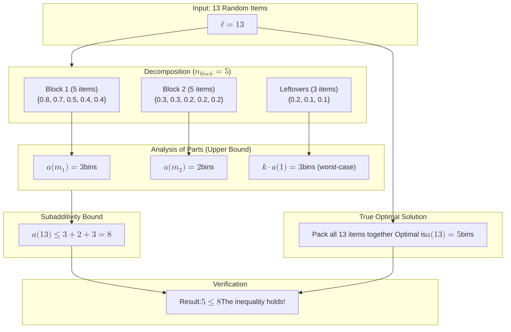
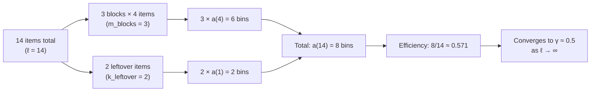

# 5

## 5.1 intro

The core idea of this chapter is to shift our perspective from preparing for the absolute worst-case scenario to understanding what happens on a typical day.

### Contrasting Worst-Case and Average-Case Analysis

**Worst-case analysis**, covered in Chapter 4, is like buying insurance for a cataclysmic event. It gives you a powerful guarantee that no matter how strange or malicious the problem instance is, your heuristic's performance will not exceed a certain bound. This is a valuable promise.

However, it has a significant drawback: a heuristic that performs exceptionally well in practice might still have a poor worst-case rating because of one or more "pathological" instances that are highly unlikely to ever occur in the real world. It's like judging a professional athlete based only on their single worst game of the season.

To get a more realistic picture, researchers developed **probabilistic analysis**, which characterizes the *average* performance of a heuristic.

### The Role of Probability and Asymptotic Analysis

Instead of assuming an adversary is crafting the worst possible problem, we now assume the problem data is generated randomly from a known probability distribution. For example:

- In the **Bin-Packing Problem**, the item sizes $w_1, w_2, ...$ are considered independent random variables drawn from a distribution $\Phi$ on $(0, 1]$.
- In the **Traveling Salesman Problem**, the city locations $x_1, x_2, ...$ are independent random variables drawn from a distribution $\mu$ in the Euclidean plane.

Analyzing this average performance is often extremely difficult, so the analysis is usually **asymptotic**. This means we study the behavior of the heuristic only when the problem size, $n$, becomes extremely large. This approach is useful because:

1. It provides a framework for comparing how heuristics will perform on large, industrial-scale problems.
2. If the convergence to the average is fast, the asymptotic result can explain the performance we see on more reasonably-sized problems.

### Subadditivity

**Subadditivity (in plain language):** If you split a big packing problem into smaller parts, the total number of bins you need to pack everything together is never more than the sum of the bins needed for each part separately. In other words, "packing together is at least as efficient as packing separately."

It’s a *property* of the optimal solution to a problem.

> “Packing everything together is at least as efficient as packing in separate groups.”  
>
> Formally, for any two groups of items of sizes $n$ and $m$:
> $$
> a(n + m) \leq a(n) + a(m)
> $$
> where $a(x)$ is the *minimum* number of bins needed for $x$ items.

#### Complete Symbol Reference

**⚠️ Read This First**: All symbols are defined here once. Subscripts with $\text{text}$ distinguish different concepts clearly.

---

**Problem Setup:**

- $w_i$: Size/weight of item $i$ (random variable, $i = 1, 2, 3, \ldots$)
- $\Phi$: Probability distribution for item sizes on interval $(0, 1]$
- $\ell$: Total number of items in the problem (grows to $\infty$ in asymptotic analysis)

**Block Decomposition (Analytical Tool):**

- $n_{\text{block}}$: Block size = number of items per block (fixed parameter we choose)
- $m_{\text{blocks}}$: Number of complete blocks = $\lfloor \ell / n_{\text{block}} \rfloor$
- $k_{\text{leftover}}$: Number of leftover items = $\ell \bmod n_{\text{block}}$ (range: $0 \le k_{\text{leftover}} < n_{\text{block}}$)
- **Decomposition formula**: $\ell = n_{\text{block}} \cdot m_{\text{blocks}} + k_{\text{leftover}}$

**Bin Counting (What We Minimize):**

- $a(x)$: **Function** giving optimal number of bins needed to pack $x$ items
  - Example values: $a(1) = 1$, $a(4) = 2$, $a(14) = 8$
- $B^*_x$: Alternative notation for $a(x)$ (same meaning, different books use different symbols)

**Convergence and Analysis:**

- $\gamma$: Asymptotic packing efficiency (bins per item as $x \to \infty$)
  $$\gamma = \lim_{x \to \infty} \frac{a(x)}{x}$$
- $\epsilon$: Error tolerance in convergence analysis (arbitrary small positive number)

**Mathematical Operations:**

- $\lfloor x \rfloor$: Floor function = largest integer $\le x$ (e.g., $\lfloor 3.7 \rfloor = 3$)
- $x \bmod y$: Modulo operation = remainder when $x$ divided by $y$ (e.g., $14 \bmod 4 = 2$)

**Conceptual Entities (Not Variables):**

- **Block**: Analytical grouping of $n_{\text{block}}$ items (math tool, not physical)
- **Bin/Box**: Physical container with capacity 1 that holds items (what we count/minimize)
- **Item**: Thing being packed with size $w_i$

---

#### **The Proof in Clear Terms**

The proof's goal is to show that as you pack more and more items ($\ell \to \infty$), the average number of bins needed *per item* converges to a stable constant, $\gamma$.

**Textbook Formulation (Theorem 5.2.1):**

Let $\gamma = \lim_{x\to\infty} \frac{a(x)}{x}$. For a given $\epsilon > 0$, select a block size $n_{\text{block}}$ such that:

$$
\begin{equation}
\frac{a(n_{\text{block}})}{n_{\text{block}}} \le \gamma + \epsilon
\end{equation}
$$

For any $k_{\text{leftover}}$ with $0 \le k_{\text{leftover}} < n_{\text{block}}$, define $\ell = n_{\text{block}} \cdot m_{\text{blocks}} + k_{\text{leftover}}$. Then by subadditivity:

$$
\begin{equation}
a(\ell) \le a(n_{\text{block}} \cdot m_{\text{blocks}}) + k_{\text{leftover}} \cdot a(1)
\end{equation}
$$

Dividing both sides by $\ell = n_{\text{block}} \cdot m_{\text{blocks}} + k_{\text{leftover}}$:

$$
\begin{equation}
\frac{a(\ell)}{\ell} \le \frac{a(n_{\text{block}} \cdot m_{\text{blocks}}) + k_{\text{leftover}} \cdot a(1)}{n_{\text{block}} \cdot m_{\text{blocks}} + k_{\text{leftover}}} \le \gamma + \epsilon + \frac{a(1)}{m_{\text{blocks}}}
\end{equation}
$$

Taking the limit with respect to $m_{\text{blocks}} \to \infty$:

$$
\begin{equation}
\lim_{\ell\to\infty} \frac{a(\ell)}{\ell} \le \gamma + \epsilon
\end{equation}
$$

Since $\epsilon$ was arbitrary, we conclude that $\lim_{\ell\to\infty} \frac{a(\ell)}{\ell} = \gamma$.

##### Real-World Analogy: Shipping Manager

Imagine you are a shipping manager for a large company.

- **Items (`w_i`)**: Packages of various sizes and weights.
- **Bins**: Delivery trucks, each with a maximum weight capacity (e.g., 10,000 lbs).
- **Cost**: The cost is per truck sent out. Your goal is to minimize the number of trucks used per day.

The subadditivity property, $a(n+m) \le a(n) + a(m)$, means:
> **"The minimum number of trucks needed to ship today's and tomorrow's packages *together* is less than or equal to the minimum trucks needed for today's packages plus the minimum trucks needed for tomorrow's packages."**

> [!important] Why? Because by combining the shipments, you get more flexibility. A large, heavy item from today might be perfectly paired with a small, light item from tomorrow, allowing them to share a truck and save space that would have been wasted if you dispatched them on separate days.

##### The Logic of the Proof Explained

The proof analyzes a huge list of $\ell$ items by dividing it into $m_{\text{blocks}}$ medium-sized blocks (each containing $n_{\text{block}}$ items).

###### A More Realistic Example: The Power of the Bound

Let's use a messier, more realistic set of items to show why subadditivity is so powerful. The items are **not** in a repeating pattern.

**Problem:** Suppose we have $\ell = 13$ items with the following weights drawn randomly:
`{0.8, 0.7, 0.5, 0.4, 0.4, 0.3, 0.3, 0.2, 0.2, 0.2, 0.2, 0.1, 0.1}`

**Analysis Setup:**

- We choose a block size of $n_{\text{block}} = 5$.
- This decomposes our 13 items into:
  - **Block 1:** `{0.8, 0.7, 0.5, 0.4, 0.4}` ($m_1$)
  - **Block 2:** `{0.3, 0.3, 0.2, 0.2, 0.2}` ($m_2$)
  - **Leftovers:** `{0.2, 0.1, 0.1}` ($k$)

**Step 1: Find the Optimal Packing for Each Part Separately**

- **Packing Block 1 ($a(m_1)$):**
  - Bin 1: `[0.8, 0.2]` (Not possible, no 0.2 available) -> `[0.8, 0.1]` (Not possible) -> `[0.8]`
  - Bin 2: `[0.7, 0.3]` (Not possible) -> `[0.7]`
  - Bin 3: `[0.5, 0.4, 0.1]` (Not possible) -> `[0.5, 0.4]`
  - Bin 4: `[0.4]`
  - Let's try a better packing: `[0.7, 0.4]`, `[0.8]`, `[0.5, 0.4]`. Still 3 bins.
  - Optimal for Block 1 is 3 bins: `[0.8]`, `[0.7]`, `[0.5, 0.4, 0.4]`. So, $a(m_1) = 3$.

- **Packing Block 2 ($a(m_2)$):**
  - Items: `{0.3, 0.3, 0.2, 0.2, 0.2}`
  - Optimal is 2 bins: `[0.3, 0.3, 0.2, 0.2]` and `[0.2]`. So, $a(m_2) = 2$.

- **Packing Leftovers (Worst-Case Bound):**
  - Items: `{0.2, 0.1, 0.1}`. There are 3 items.
  - The worst-case bound is $k_{\text{leftover}} \cdot a(1) = 3 \cdot 1 = 3$ bins.
  - (The *actual* optimal for leftovers is 1 bin: `[0.2, 0.1, 0.1]`, but the proof uses the safe upper bound).

**Step 2: Apply the Subadditivity Inequality**

The property states: $a(\ell) \le a(m_1) + a(m_2) + k_{\text{leftover}} \cdot a(1)$.

$$ a(13) \le 3 + 2 + 3 = 8 $$

This gives us a **guaranteed upper bound**: The optimal solution for all 13 items, whatever it is, cannot possibly require more than 8 bins.

**Step 3: Find the True Optimal Solution for All 13 Items ($a(\ell)$)**

Now, let's forget the blocks and pack all 13 items together optimally.

- Bin 1: `[0.8, 0.2]`
- Bin 2: `[0.7, 0.3]`
- Bin 3: `[0.5, 0.3, 0.2]`
- Bin 4: `[0.4, 0.4, 0.2]`
- Bin 5: `[0.2, 0.1, 0.1]`

The true optimal solution is $a(13) = 5$ bins.

**Conclusion: The Inequality Holds and is Useful**

- Our result: $a(13) = 5$.
- Our bound: $a(13) \le 8$.
- **Verification:** $5 \le 8$. The inequality holds!

This example shows the point of the proof: even with random items and non-identical blocks, subadditivity provides a solid, mathematical upper bound that is always true, which is essential for the rest of the convergence proof.

#### Step-by-Step Breakdown

1. **Choose an efficient block size**: Pick $n_{\text{block}}$ large enough so that packing $n_{\text{block}}$ items is very efficient, with bins-per-item ratio ($\frac{a(n_{\text{block}})}{n_{\text{block}}}$) close to the ultimate efficiency $\gamma$ (within error margin $\epsilon$).

2. **Divide the total items into blocks**: Take your huge list of $\ell$ items and conceptually divide it into:
   - $m_{\text{blocks}}$ complete blocks (each containing $n_{\text{block}}$ items)
   - $k_{\text{leftover}}$ leftover items that don't form a complete block
   - Relationship: $\ell = n_{\text{block}} \cdot m_{\text{blocks}} + k_{\text{leftover}}$ where $0 \le k_{\text{leftover}} < n_{\text{block}}$

3. **Apply subadditivity**: The total bins needed for all $\ell$ items ($a(\ell)$) is at most the sum of:
   - Bins for the $m_{\text{blocks}}$ blocks: $m_{\text{blocks}} \cdot a(n_{\text{block}})$ (each block needs $a(n_{\text{block}})$ bins)
   - Bins for the $k_{\text{leftover}}$ leftovers: $k_{\text{leftover}} \cdot a(1)$ (worst case: 1 bin per item)
   - Therefore: $a(\ell) \le m_{\text{blocks}} \cdot a(n_{\text{block}}) + k_{\text{leftover}} \cdot a(1)$

4. **Compute efficiency**: Divide both sides by $\ell = n_{\text{block}} \cdot m_{\text{blocks}} + k_{\text{leftover}}$:

   $$
   \begin{equation}
   \frac{a(\ell)}{\ell} \le \frac{m_{\text{blocks}} \cdot a(n_{\text{block}}) + k_{\text{leftover}} \cdot a(1)}{n_{\text{block}} \cdot m_{\text{blocks}} + k_{\text{leftover}}}
   \end{equation}
   $$

5. **Show convergence**: As $\ell$ grows large, $m_{\text{blocks}}$ also grows large (since $\ell = n_{\text{block}} \cdot m_{\text{blocks}} + k_{\text{leftover}}$), making the inefficient leftover term ($\frac{k_{\text{leftover}} \cdot a(1)}{n_{\text{block}} \cdot m_{\text{blocks}} + k_{\text{leftover}}}$) negligible, and the efficiency converges to $\gamma$.

---

#### **Custom Exercise: Subadditivity in Action**

**Problem Setup:**
Let's work with items from the uniform distribution. Suppose we have items of sizes $\{0.6, 0.6, 0.4, 0.4\}$.

**Step 1: Define our block size**

- Block size: $n_{\text{block}} = 4$ items per block
- Optimal packing of 4 items: 2 bins arranged as $[0.6, 0.4]$ and $[0.6, 0.4]$
- Therefore: $a(4) = 2$ bins
- Efficiency of this block: $\frac{a(4)}{4} = \frac{2}{4} = 0.5$ bins per item
- This efficiency approaches our asymptotic constant: $\gamma \approx 0.5$

**Step 2: Analyze a larger problem**

Now suppose we have $\ell = 14$ total items:

- 12 items that form 3 complete blocks (same pattern as above: $\{0.6, 0.6, 0.4, 0.4\}$ repeated 3 times)
- 2 leftover items: $\{0.6, 0.6\}$

**Step 3: Apply the decomposition**

- Total items: $\ell = 14$
- Block size: $n_{\text{block}} = 4$ items per block
- Number of complete blocks: $m_{\text{blocks}} = \lfloor 14/4 \rfloor = 3$ blocks
- Leftover items: $k_{\text{leftover}} = 14 \bmod 4 = 2$ items
- Verify: $\ell = n_{\text{block}} \cdot m_{\text{blocks}} + k_{\text{leftover}} = 4 \cdot 3 + 2 = 14$ ✓

**Step 4: Count bins**

- Bins for the 3 complete blocks: $m_{\text{blocks}} \cdot a(n_{\text{block}}) = 3 \cdot a(4) = 3 \cdot 2 = 6$ bins
- Bins for the 2 leftover items: $k_{\text{leftover}} \cdot a(1) = 2 \cdot 1 = 2$ bins (worst case: 1 bin per item)
- Total bins: $a(14) = 6 + 2 = 8$ bins

**Step 5: Verify the subadditivity inequality**

The key inequality is: $a(\ell) \le m_{\text{blocks}} \cdot a(n_{\text{block}}) + k_{\text{leftover}} \cdot a(1)$

Substituting our values:

- $a(14) \le 3 \cdot a(4) + 2 \cdot a(1)$
- $8 \le 3 \cdot 2 + 2 \cdot 1$
- $8 \le 6 + 2$
- $8 \le 8$ ✓ The inequality holds!

**Step 6: Check efficiency convergence**

- Efficiency for 14 items: $\frac{a(14)}{14} = \frac{8}{14} \approx 0.571$ bins per item
- This is close to our block efficiency $\gamma = 0.5$
- As $\ell$ grows even larger (more blocks, larger $m_{\text{blocks}}$), this ratio approaches $0.5$

**Visual Summary:**

**Key Insight:** The "blocks" are groups of items we use for analysis, while "bins" are the containers we're trying to minimize. As we pack more items (larger $\ell$, larger $m_{\text{blocks}}$), the inefficiency from leftover items becomes negligible, and the average bins per item converges to $\gamma$.

---

### 2. Martingale Inequality: Bounding the "Surprise"

This concept is used to prove that while the number of bins might fluctuate, it's extremely unlikely to fluctuate *a lot*. It proves the solution **concentrates** around the average.

> [!tip] "We know the average number of bins needed, but how likely is it that a single, random set of items will require a number of bins that is far from that average?".

**The "Fair Game" Analogy:**

Imagine you're trying to guess the final number of bins needed for 1,000 items. Your initial guess is $E[b^*_{1000}] = 1000 \times 0.5 = 500$ bins.

- You are then shown the items one by one.
- After seeing item #1 ($w_1 = 0.9$, a huge item), you update your guess. You might think, "That was an unlucky draw, I'll probably need more bins now." Your new expectation, given $w_1$, might be 501.
- The "surprise" from item #1 was $+1$.
- Then you see item #2 ($w_2 = 0.1$, a tiny item). You might think, "Oh, that's lucky, it will probably pair with something." Your expectation, given $w_1$ and $w_2$, might drop back to 500.5.
- The "surprise" from item #2 was $-0.5$.

A **martingale difference sequence** ($D_i$) is this series of "surprises" or updates to your expectation as each new piece of information ($w_i$) is revealed.

**Azuma's Inequality (Lemma 5.2.3) Explained:**

This theorem provides a hard guarantee on the sum of all these surprises.

$$\Pr\left(\left|\sum_{i=1}^n D_i\right| > t\right) \le 2 \exp\left(\frac{-t^2}{2 \sum ||D_i||^2_\infty}\right)$$

**Symbol Definitions:**

- $D_i$: The martingale difference (surprise) from revealing item $i$.
- $\sum_{i=1}^n D_i$: This is the sum of all surprises, equal to the **final actual outcome minus your initial guess** ($b^*_n - E[b^*_n]$).
- $t$: The **deviation** from the average you're curious about (e.g., "What's the chance the final number of bins is off by more than $t=100$?").
- $||D_i||_\infty$: The absolute **maximum possible surprise** from seeing a single new item. In bin packing, revealing one more item can, in the worst case, increase the required number of bins by just 1. So, this value is 1.
- $b^*_n$: The optimal number of bins for $n$ items (same as $a_n$).
- $E[b^*_n]$: The expected number of bins for $n$ items.

The formula tells you that the probability of the total deviation being larger than $t$ drops off exponentially fast as $t$ increases. It's a very strong guarantee that the final result will "hug" the average.
