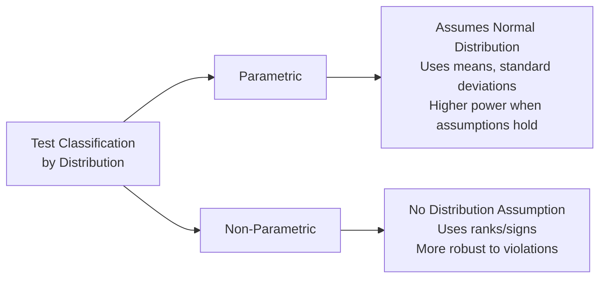
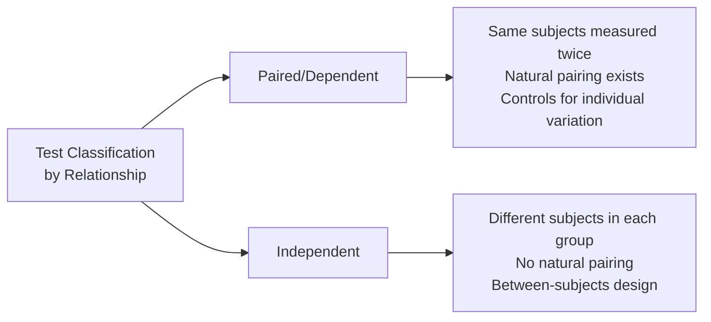

# Understanding Test Classifications and Your Data Structure

Let me clarify the two **orthogonal** (independent) classification systems in statistics and how they apply to your GPU benchmark data.

---

## Two Independent Classification Dimensions

### Dimension 1: **Parametric vs Non-Parametric**

**What it classifies**: The mathematical assumptions about data distribution



**Key Question**: "Does my data follow a normal distribution?"

- **YES** → Use parametric (t-test, ANOVA)
- **NO** → Use non-parametric (Wilcoxon, Friedman)

---

### Dimension 2: **Paired (Dependent) vs Independent**

**What it classifies**: The relationship between measurements



**Key Question**: "Are the two measurements naturally linked?"

- **YES** → Use paired test (paired t-test, Wilcoxon signed-rank)
- **NO** → Use independent test (independent t-test, Mann-Whitney U)

---

## The 2×2 Classification Matrix

These dimensions combine to create **4 test categories**:

| | **Parametric** (Normal Data) | **Non-Parametric** (Non-Normal) |
|---|---|---|
| **Paired** (Same subjects) | Paired t-test | Wilcoxon signed-rank |
| **Independent** (Different subjects) | Independent t-test | Mann-Whitney U |

**Your GPU benchmark uses**: **Paired design** (same problem, different algorithms)

- If normal → Paired t-test
- If non-normal → Wilcoxon signed-rank

---

## Your Data Structure: 38 Problems × 15 Runs × 4 Algorithms

Let me break down what you actually have:

```python
# Conceptual structure of your data
data_structure = {
    "berlin52": {
        "CPU": [run1, run2, ..., run15],          # 15 measurements
        "HybridNaive": [run1, run2, ..., run15],
        "HybridOptimized": [run1, run2, ..., run15],
        "FullGPU": [run1, run2, ..., run15]
    },
    "eil51": { ... },  # Same structure for 37 more problems
    # ... 36 more problems
}
```

---

## Three Levels of Analysis in Your Data

### Level 1: **Within-Problem Analysis** (15 runs per algorithm)

**Question**: "Is GPU faster than CPU on berlin52?"

```python
# Data for ONE problem
cpu_times = [28.19, 29.22, 32.38, ...]  # 15 runs
gpu_times = [0.082, 0.086, 0.089, ...]  # 15 runs

# Analysis
differences = cpu_times - gpu_times  # PAIRED (same berlin52 instance)
# Check normality of differences
shapiro_test(differences)  # → p=0.58 (normal)
# Use paired t-test
paired_ttest(cpu_times, gpu_times)  # → t=24.92, p<0.001
```

**Classification**:

- ✅ **Paired**: Same berlin52 problem, two algorithms (natural pairing)
- ✅ **Parametric**: Differences are normal (Shapiro-Wilk p=0.58)
- ✅ **Sample size**: n=15 runs is adequate for large effects (d=6.43)

---

### Level 2: **Across-Problem Meta-Analysis** (38 problems)

**Question**: "Is GPU consistently faster across ALL problem types?"

This is what you're currently **missing** but should add!

```python
# Aggregate results from 38 problems
effect_sizes = []
p_values = []

for problem in all_38_problems:
    cpu_times = data[problem]["CPU"]  # 15 runs
    gpu_times = data[problem]["GPU"]  # 15 runs
    
    # Within-problem analysis (paired, n=15)
    t_stat, p_val = paired_ttest(cpu_times, gpu_times)
    cohen_d = calculate_cohens_d(cpu_times - gpu_times)
    
    effect_sizes.append(cohen_d)
    p_values.append(p_val)

# Now analyze the 38 effect sizes (INDEPENDENT problems)
mean_effect_size = np.mean(effect_sizes)  # Average d across problems
ci_effect_size = bootstrap_ci(effect_sizes)  # 95% CI
consistency = np.std(effect_sizes)  # Variability across problems
```

**Classification**:

- ✅ **Independent**: 38 different problems (berlin52, eil51, ch130, ...)
- ✅ **Each problem analyzed independently**: 15 paired runs per problem
- ✅ **Meta-analysis**: Aggregates results across 38 independent experiments

**What this tells you**:

- **Level 1** (within-problem): GPU faster on berlin52? → Yes (p<0.001, d=6.43)
- **Level 2** (across-problem): GPU consistently faster? → Check if mean(d) > 0.8 with tight CI

---

### Level 3: **Multiple Algorithm Comparison** (k=4 algorithms)

**Question**: "Which algorithm is best across all problems?"

```python
# Use Friedman test (non-parametric repeated measures ANOVA)
# Each problem = 1 "block", each algorithm = 1 "treatment"

# Data structure: 38 problems × 4 algorithms × 15 runs
# Aggregate: Use MEDIAN or MEAN of 15 runs per (problem, algorithm) pair

results_matrix = np.zeros((38, 4))  # 38 problems × 4 algorithms

for i, problem in enumerate(all_38_problems):
    results_matrix[i, 0] = np.median(data[problem]["CPU"])
    results_matrix[i, 1] = np.median(data[problem]["HybridNaive"])
    results_matrix[i, 2] = np.median(data[problem]["HybridOptimized"])
    results_matrix[i, 3] = np.median(data[problem]["FullGPU"])

# Friedman test: Are rankings consistent across 38 problems?
friedman_test(results_matrix)  # → Q=45.2, p<0.001

# Post-hoc: Which pairs differ?
nemenyi_test(results_matrix)  # → FullGPU > HybridOpt > HybridNaive > CPU
```

**Classification**:

- ✅ **Repeated measures**: Same 38 problems tested with all 4 algorithms (paired design)
- ✅ **Non-parametric**: Friedman test (doesn't assume normal rankings)
- ✅ **Multiple comparisons**: k=4 algorithms → 6 pairwise comparisons

---

## Correcting Your Misconceptions

### Misconception 1: "15 runs is parametric or non-parametric?"

❌ **Wrong framing**: Sample size (n=15) doesn't determine parametric vs non-parametric.
✅ **Correct**: **Normality** determines this. With n=15:

- If Shapiro-Wilk p≥0.05 → Data is normal → Use parametric (paired t-test)
- If Shapiro-Wilk p<0.05 → Data non-normal → Use non-parametric (Wilcoxon)

**Example**:

```python
differences = cpu_times - gpu_times  # 15 values
W, p = shapiro(differences)  # W=0.9542, p=0.58

if p >= 0.05:
    print("Use paired t-test (parametric)")  # ← berlin52 falls here
else:
    print("Use Wilcoxon (non-parametric)")
```

---

### Misconception 2: "37 other problems are independent and parametric?"

Partially correct but **conflating two concepts**:

✅ **Independent**: Yes, berlin52 and eil51 are independent problems (different graphs)
❌ **Parametric**: This depends on normality **within each problem**, not across problems

**Correct analysis**:

```python
for problem in [berlin52, eil51, ch130, ...]:  # 38 INDEPENDENT problems
    cpu_times = data[problem]["CPU"]
    gpu_times = data[problem]["GPU"]
    
    differences = cpu_times - gpu_times  # PAIRED within problem
    W, p_norm = shapiro(differences)
    
    if p_norm >= 0.05:
        # This problem has normal differences → parametric
        t, p = paired_ttest(cpu_times, gpu_times)
    else:
        # This problem has non-normal differences → non-parametric
        W, p = wilcoxon(cpu_times, gpu_times)
```

**Key insight**: Each of 38 problems gets its own paired analysis (t-test or Wilcoxon). The 38 problems are independent experiments, but **within** each problem, the comparison is paired.

---

## What Your Current Analysis is Missing

### ❌ Currently: Only within-problem analysis

```python
# You analyze berlin52 in isolation
paired_ttest(berlin52_cpu, berlin52_gpu)  # → p<0.001 ✅
# But what about the OTHER 37 problems?
```

### ✅ Should add: Across-problem meta-analysis

```python
# Aggregate results from ALL 38 problems
effect_sizes = []

for problem in all_38_problems:
    d = cohens_d(data[problem]["CPU"], data[problem]["GPU"])
    effect_sizes.append(d)

# Meta-analysis
mean_d = np.mean(effect_sizes)  # Average effect across problems
se_d = np.std(effect_sizes) / np.sqrt(38)  # Standard error
ci_d = [mean_d - 1.96*se_d, mean_d + 1.96*se_d]  # 95% CI

print(f"GPU speedup: d={mean_d:.2f}, 95% CI={ci_d}")
# Example: d=5.8, CI=[5.2, 6.4] → Consistently huge effect
```

### ✅ Should add: Multiple algorithm comparison

```python
# Which algorithm is best OVERALL?
results = np.array([
    [median(berlin52_CPU), median(berlin52_HybNaive), ...],
    [median(eil51_CPU), median(eil51_HybNaive), ...],
    # ... 36 more rows
])

Q, p = friedmanchisquare(*results.T)  # Test rankings
if p < 0.05:
    nemenyi_posthoc(results)  # Which pairs differ
```

---

## Summary: How to Analyze Your Data

### Step 1: Within-Problem Paired Analysis (38 times)

For **each** of 38 problems:

```python
cpu_times = [15 runs]
gpu_times = [15 runs]

# Check normality
W, p_norm = shapiro(cpu_times - gpu_times)

# Choose test
if p_norm >= 0.05:
    t, p = paired_ttest(cpu_times, gpu_times)  # Parametric
else:
    W, p = wilcoxon(cpu_times, gpu_times)  # Non-parametric

# Compute effect size
d = cohens_d_paired(cpu_times, gpu_times)
```

**Result**: 38 independent p-values and 38 effect sizes

---

### Step 2: Meta-Analysis Across Problems (1 time)

```python
# Aggregate 38 effect sizes
effect_sizes = [d1, d2, ..., d38]

# Test if mean effect > 0
t, p = ttest_1samp(effect_sizes, popmean=0)  # One-sample t-test

# Or use bootstrap for CI
ci = bootstrap_ci(effect_sizes, statistic=np.mean)

print(f"Mean effect: {np.mean(effect_sizes):.2f}")
print(f"95% CI: {ci}")
print(f"Consistency: σ={np.std(effect_sizes):.2f}")
```

**Result**: Overall GPU advantage with confidence interval

---

### Step 3: Friedman + Nemenyi for k=4 Algorithms (1 time)

```python
# Create 38×4 matrix (problems × algorithms)
results = np.zeros((38, 4))
for i, problem in enumerate(all_38_problems):
    results[i, 0] = np.median(data[problem]["CPU"])
    results[i, 1] = np.median(data[problem]["HybridNaive"])
    results[i, 2] = np.median(data[problem]["HybridOptimized"])
    results[i, 3] = np.median(data[problem]["FullGPU"])

# Friedman test
Q, p = friedmanchisquare(*results.T)

if p < 0.05:
    # Post-hoc pairwise comparisons
    p_matrix = posthoc_nemenyi_friedman(results)
    print(p_matrix)
```

**Result**: Ranking of algorithms with statistical evidence

---

## Final Clarification: Your Questions Answered

### Q1: "What is parametric vs non-parametric?"

**A**: Classification by **distribution assumption**:

- **Parametric**: Assumes normal distribution (t-test, ANOVA)
- **Non-parametric**: No distribution assumption (Wilcoxon, Friedman)

**Determined by**: Shapiro-Wilk test on your data (not sample size)

---

### Q2: "What is dependent vs independent?"

**A**: Classification by **measurement relationship**:

- **Paired/Dependent**: Same subjects measured twice (berlin52 with CPU, then GPU)
- **Independent**: Different subjects in groups (berlin52 vs eil51)

**Your design**: **Paired** (same problem, different algorithms)

---

### Q3: "Are 15 repetitions parametric?"

**A**: Sample size doesn't determine this! Check normality:

```python
if shapiro_test(differences).pvalue >= 0.05:
    print("Normal → Use parametric (paired t-test)")
else:
    print("Non-normal → Use non-parametric (Wilcoxon)")
```

---

### Q4: "Are 37 other problems independent and parametric?"

**A**:

- ✅ **Independent**: Yes (berlin52, eil51, ch130 are separate experiments)
- ⚠️ **Parametric**: Depends on normality **within each problem**
- ✅ **Should analyze**: All 38 problems individually, then meta-analyze

---

### Q5: "Are these being taken into account in our solution?"

**A**: ❌ **Not fully**. Current guide focuses on single-problem analysis. You should add:

1. **Across-problem meta-analysis**: Aggregate 38 effect sizes
2. **Consistency check**: Variance of effect sizes across problems
3. **Friedman + Nemenyi**: Compare k=4 algorithms across 38 problems

---

## Recommended Addition to Your Guide

Add a new section: **"Multi-Problem Meta-Analysis"**

````markdown
## Multi-Problem Meta-Analysis

### Scenario: 38 Independent Problems

When you have **multiple independent problems** (berlin52, eil51, ..., pr1002), analyze in two stages:

**Stage 1: Within-Problem Analysis** (38 paired tests)
```python
results = []
for problem in all_38_problems:
    cpu = data[problem]["CPU"]  # 15 runs
    gpu = data[problem]["GPU"]  # 15 runs
    
    # Paired analysis (CPU vs GPU on same problem)
    d = cohens_d_paired(cpu, gpu)
    t, p = paired_ttest(cpu, gpu) if normal else wilcoxon(cpu, gpu)
    
    results.append({"problem": problem, "d": d, "p": p})
```

**Stage 2: Meta-Analysis** (aggregate 38 results)
```python
effect_sizes = [r["d"] for r in results]

# Test if mean effect significantly > 0
mean_d = np.mean(effect_sizes)
se_d = np.std(effect_sizes) / np.sqrt(38)
t_stat = mean_d / se_d
p_value = stats.t.sf(abs(t_stat), df=37) * 2  # Two-tailed

# Bootstrap CI for robustness
ci = bootstrap_ci(effect_sizes, statistic=np.mean)

print(f"Mean GPU speedup: d={mean_d:.2f} (95% CI: {ci})")
print(f"Consistency: σ_d={np.std(effect_sizes):.2f}")
```

**Interpretation**:
- **Mean d**: Average effect across all problems
- **CI width**: Precision of estimate (narrower with more problems)
- **σ_d**: Variability (small σ_d → consistent speedup)

**Example Output**:
```
Mean GPU speedup: d=5.83 (95% CI: [5.21, 6.45])
Consistency: σ_d=1.92
→ GPU consistently faster, d ranges from 2.8 to 8.5 across problems
```
````

This addition would complete your statistical framework by properly handling the **38 independent problems** you actually have!
