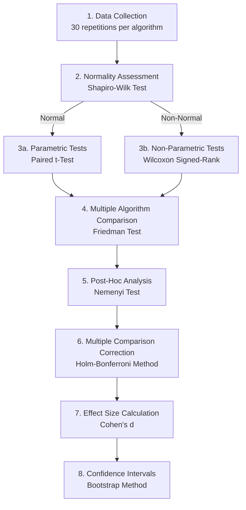
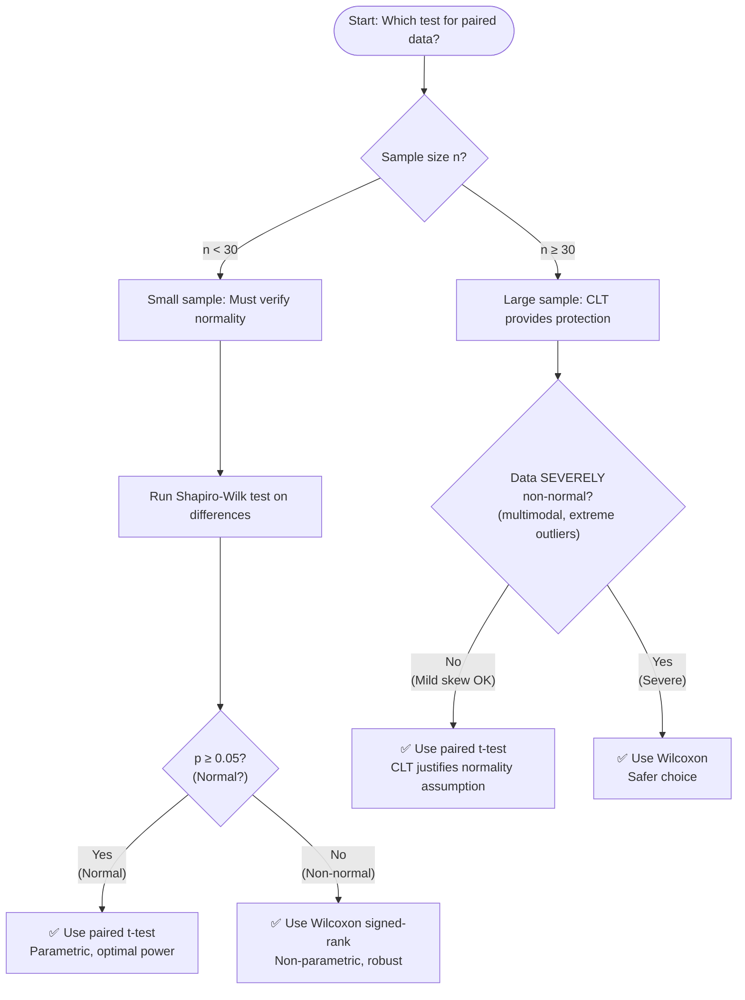
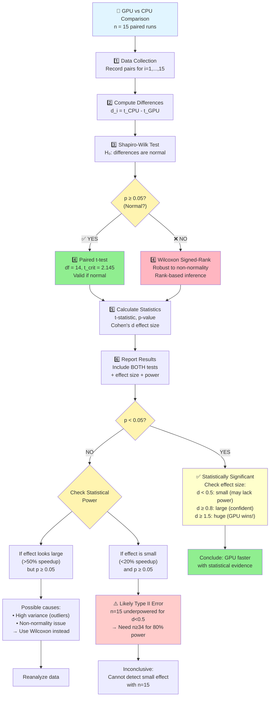
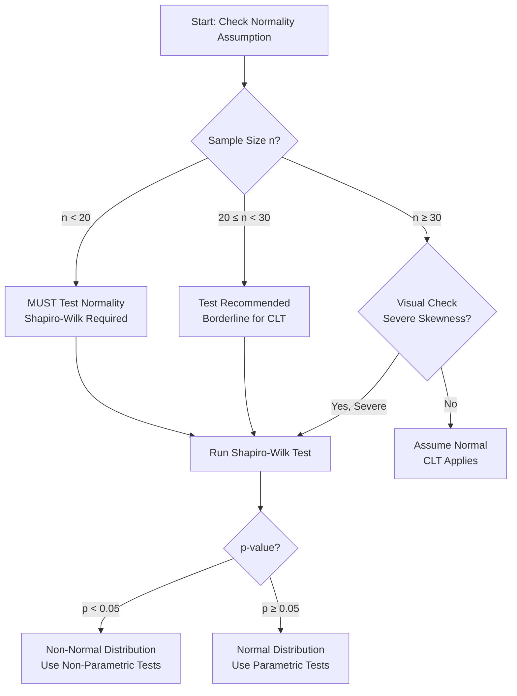
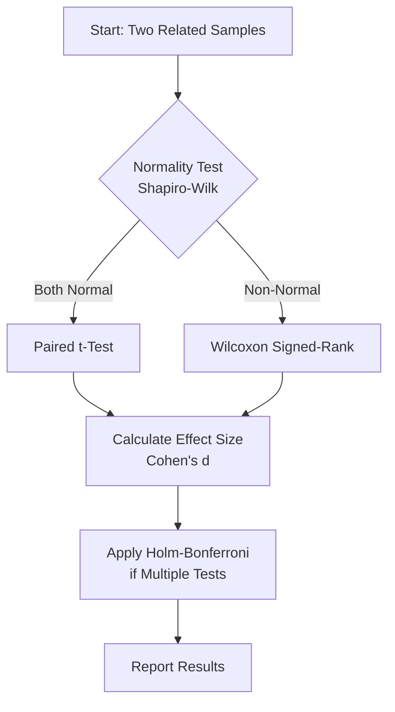
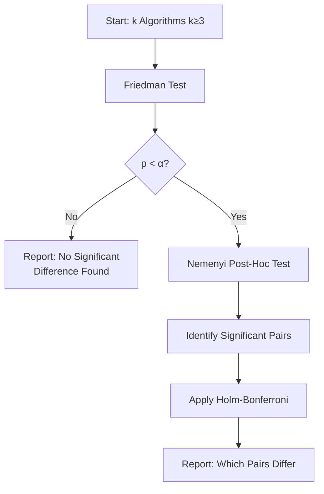
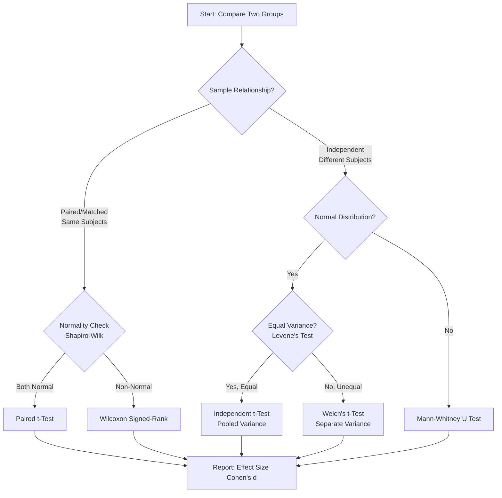

# Statistical Tests Comprehensive Guide for GPU Benchmark Analysis

**Author**: AI Assistant  
**Date**: 2025-11-21  
**Purpose**: Complete reference for statistical methodology used in Chapter 4 validation  
**Status**: 🚧 IN PROGRESS

---

## Table of Contents

- [Statistical Tests Comprehensive Guide for GPU Benchmark Analysis](#statistical-tests-comprehensive-guide-for-gpu-benchmark-analysis)
  - [Table of Contents](#table-of-contents)
  - [Symbol Glossary](#symbol-glossary)
  - [Overview](#overview)
    - [Context: GPU vs CPU Benchmark Comparison](#context-gpu-vs-cpu-benchmark-comparison)
    - [Research Questions](#research-questions)
    - [Statistical Framework](#statistical-framework)
    - [Why These Specific Tests?](#why-these-specific-tests)
  - [Statistical Foundations](#statistical-foundations)
    - [0.1 Fundamental Concepts](#01-fundamental-concepts)
      - [0.1.1 What is Probability? (Frequentist View)](#011-what-is-probability-frequentist-view)
      - [0.1.2 What is a P-value?](#012-what-is-a-p-value)
        - [**Most Misunderstood Concept in Statistics**](#most-misunderstood-concept-in-statistics)
          - [**Formal Definition**](#formal-definition)
          - [**Critical Understanding**: P-value is **NOT**](#critical-understanding-p-value-is-not)
          - [**What P-value Actually Tells You**](#what-p-value-actually-tells-you)
          - [Interpretation Ladder](#interpretation-ladder)
        - [Visual Threshold Guide](#visual-threshold-guide)
        - [**Example from GPU Benchmark**](#example-from-gpu-benchmark)
        - [Common Misconceptions Table\*\*](#common-misconceptions-table)
        - [**Why $\\alpha = 0.05$?**](#why-alpha--005)
      - [0.1.3 What is Hypothesis Testing?](#013-what-is-hypothesis-testing)
        - [**The Framework of Statistical Inference**](#the-framework-of-statistical-inference)
          - [**The Two Hypotheses**](#the-two-hypotheses)
          - [**The Court Trial Analogy (Detailed)**](#the-court-trial-analogy-detailed)
        - [**Type I and Type II Errors**](#type-i-and-type-ii-errors)
          - [**Type I Error**](#type-i-error)
          - [**Type II Error**](#type-ii-error)
        - [**Error Types Matrix**](#error-types-matrix)
          - [**Real-World Consequences**](#real-world-consequences)
        - [**Statistical Power**](#statistical-power)
          - [**Definition**](#definition)
          - [**Factors affecting power**](#factors-affecting-power)
          - [**Power Guidelines**](#power-guidelines)
        - [**The Hypothesis Testing Process**](#the-hypothesis-testing-process)
      - [0.1.4 Descriptive Statistics](#014-descriptive-statistics)
        - [**Measures of Central Tendency**](#measures-of-central-tendency)
          - [**Mean (Arithmetic Average)**](#mean-arithmetic-average)
          - [**Median Middle Value**](#median-middle-value)
          - [**Mode Most Frequent**](#mode-most-frequent)
        - [**Measures of Dispersion**](#measures-of-dispersion)
          - [**Sample Standard Deviation**](#sample-standard-deviation)
          - [**Other Dispersion Measures**](#other-dispersion-measures)
        - [**Comparison Table: Central Tendency Measures**](#comparison-table-central-tendency-measures)
        - [**ASCII Visualization: Outlier Effect**](#ascii-visualization-outlier-effect)
        - [**Why Mean for Parametric Tests?**](#why-mean-for-parametric-tests)
        - [**Why Median for Non-Parametric Tests?**](#why-median-for-non-parametric-tests)
      - [0.1.5 Statistical Distributions](#015-statistical-distributions)
        - [**Why Distributions Matter**](#why-distributions-matter)
        - [**The Normal Distribution** (Gaussian)](#the-normal-distribution-gaussian)
          - [**Probability Density Function**](#probability-density-function)
          - [**The 68-95-99.7 Rule** (Empirical Rule)](#the-68-95-997-rule-empirical-rule)
          - [**ASCII Bell Curve Visualization**](#ascii-bell-curve-visualization)
          - [**Why Normal is Everywhere**](#why-normal-is-everywhere)
        - [**Student's t-Distribution**](#students-t-distribution)
          - [**Motivation**](#motivation)
          - [**Probability Density Function**](#probability-density-function-1)
          - [**Key Properties**](#key-properties)
          - [**Why This Matters**](#why-this-matters)
          - [**Historical Context: The Story of "Student"**](#historical-context-the-story-of-student)
        - [**Chi-Squared Distribution** ($\\chi^2$)](#chi-squared-distribution-chi2)
          - [**Definition**](#definition-1)
          - [**Probability Density Function**](#probability-density-function-2)
          - [**Uses in Testing**](#uses-in-testing)
        - [**The Gamma Function Explained**](#the-gamma-function-explained)
          - [**Motivation: Why This Matters**](#motivation-why-this-matters)
          - [**Mathematical Definition**](#mathematical-definition)
          - [**The Factorial Connection**](#the-factorial-connection)
          - [**Worked Examples**](#worked-examples)
          - [**Visual Representation**](#visual-representation)
          - [**Common Values Reference Table**](#common-values-reference-table)
          - [**Role in Statistical Distributions**](#role-in-statistical-distributions)
        - [**Degrees of Freedom Demystified**](#degrees-of-freedom-demystified)
          - [**The n-1 Mystery: Why Not n?**](#the-n-1-mystery-why-not-n)
          - [**Intuitive Definition**](#intuitive-definition)
          - [**The Mathematical Constraint**](#the-mathematical-constraint)
          - [**Worked Example: n=5 GPU Runtimes**](#worked-example-n5-gpu-runtimes)
          - [**Visual Representation**](#visual-representation-1)
          - [**Degrees of Freedom Across Statistical Tests**](#degrees-of-freedom-across-statistical-tests)
          - [**Why Degrees of Freedom Matter**](#why-degrees-of-freedom-matter)
          - [**GPU Benchmark Application**](#gpu-benchmark-application)
        - [**Relationships Between Distributions**](#relationships-between-distributions)
          - [**t-Distribution → Normal**](#t-distribution--normal)
          - [**Chi-Squared → Normal**](#chi-squared--normal)
    - [Critical Analysis of Your Draft](#critical-analysis-of-your-draft)
        - [Central Limit Theorem (CLT)](#central-limit-theorem-clt)
          - [**The Core Concept**](#the-core-concept)
          - [**Mathematical Formulation**](#mathematical-formulation)
          - [**ASCII Visualization: Order form Chaos**](#ascii-visualization-order-form-chaos)
          - [**Why This Matters for Engineering**](#why-this-matters-for-engineering)
          - [**The "Rule of 30" Warning**](#the-rule-of-30-warning)
          - [**GPU Benchmark Implication**](#gpu-benchmark-implication)
        - [**Summary: Distribution Decision Tree**](#summary-distribution-decision-tree)
  - [Parametric vs Non-Parametric Tests](#parametric-vs-non-parametric-tests)
    - [The Fundamental Distinction in Statistical Hypothesis Testing](#the-fundamental-distinction-in-statistical-hypothesis-testing)
    - [Parametric Tests: Assume a Distribution](#parametric-tests-assume-a-distribution)
    - [Non-Parametric Tests: Distribution-Free Methods](#non-parametric-tests-distribution-free-methods)
    - [Comparison Table](#comparison-table)
    - [Efficiency \& The Power-Robustness Trade-off](#efficiency--the-power-robustness-trade-off)
      - [Pitman Asymptotic Relative Efficiency (ARE)](#pitman-asymptotic-relative-efficiency-are)
      - [The Trade-off Decision](#the-trade-off-decision)
    - [GPU Benchmark Application: Our Strategy](#gpu-benchmark-application-our-strategy)
  - [Normality Testing](#normality-testing)
    - [Shapiro-Wilk Test](#shapiro-wilk-test)
      - [Mathematical Formulation](#mathematical-formulation-1)
      - [When to Use](#when-to-use)
      - [Interpretation](#interpretation)
      - [Normality Assessment Decision Tree](#normality-assessment-decision-tree)
      - [Implementation in Our Benchmark](#implementation-in-our-benchmark)
      - [Example from Benchmark](#example-from-benchmark)
      - [Assumptions and Limitations](#assumptions-and-limitations)
      - [References](#references)
  - [Parametric Tests](#parametric-tests)
    - [Paired t-Test](#paired-t-test)
      - [Mathematical Formulation](#mathematical-formulation-2)
      - [When to Use](#when-to-use-1)
      - [Interpretation](#interpretation-1)
      - [Implementation in Our Benchmark](#implementation-in-our-benchmark-1)
      - [Example from Benchmark](#example-from-benchmark-1)
      - [Assumptions and Limitations](#assumptions-and-limitations-1)
      - [References](#references-1)
  - [Non-Parametric Tests](#non-parametric-tests)
    - [Wilcoxon Signed-Rank Test](#wilcoxon-signed-rank-test)
      - [Mathematical Formulation](#mathematical-formulation-3)
      - [When to Use](#when-to-use-2)
      - [Interpretation](#interpretation-2)
      - [Implementation in Our Benchmark](#implementation-in-our-benchmark-2)
      - [Example from Benchmark](#example-from-benchmark-2)
      - [Assumptions and Limitations](#assumptions-and-limitations-2)
      - [References](#references-2)
    - [Friedman Test](#friedman-test)
      - [Mathematical Formulation](#mathematical-formulation-4)
      - [When to Use](#when-to-use-3)
      - [Interpretation](#interpretation-3)
      - [Implementation in Our Benchmark](#implementation-in-our-benchmark-3)
      - [Example from Benchmark](#example-from-benchmark-3)
      - [Assumptions and Limitations](#assumptions-and-limitations-3)
      - [References](#references-3)
  - [Post-Hoc Tests](#post-hoc-tests)
    - [Nemenyi Test](#nemenyi-test)
      - [Mathematical Formulation](#mathematical-formulation-5)
      - [When to Use](#when-to-use-4)
      - [Interpretation](#interpretation-4)
      - [Implementation in Our Benchmark](#implementation-in-our-benchmark-4)
      - [Example from Benchmark](#example-from-benchmark-4)
      - [Assumptions and Limitations](#assumptions-and-limitations-4)
      - [References](#references-4)
  - [Multiple Comparison Correction](#multiple-comparison-correction)
    - [Holm-Bonferroni Method](#holm-bonferroni-method)
      - [Mathematical Formulation](#mathematical-formulation-6)
      - [When to Use](#when-to-use-5)
      - [Interpretation](#interpretation-5)
      - [Implementation in Our Benchmark](#implementation-in-our-benchmark-5)
      - [Example from Benchmark](#example-from-benchmark-5)
      - [Comparison with Other Methods](#comparison-with-other-methods)
      - [References](#references-5)
  - [Effect Size Measures](#effect-size-measures)
    - [Cohen's d](#cohens-d)
      - [Mathematical Formulation](#mathematical-formulation-7)
      - [When to Use](#when-to-use-6)
      - [Interpretation](#interpretation-6)
      - [Implementation in Our Benchmark](#implementation-in-our-benchmark-6)
      - [Example from Benchmark](#example-from-benchmark-6)
      - [Best Practices](#best-practices)
      - [References](#references-6)
  - [Confidence Intervals](#confidence-intervals)
    - [Bootstrap Method](#bootstrap-method)
      - [Mathematical Formulation](#mathematical-formulation-8)
      - [When to Use](#when-to-use-7)
      - [Methods Comparison](#methods-comparison)
      - [Implementation in Our Benchmark](#implementation-in-our-benchmark-7)
      - [Example from Benchmark](#example-from-benchmark-7)
      - [Advantages and Limitations](#advantages-and-limitations)
      - [Best Practices](#best-practices-1)
      - [References](#references-7)
  - [Decision Trees](#decision-trees)
    - [Test Selection Flowchart](#test-selection-flowchart)
    - [Multiple Algorithm Comparison Flowchart](#multiple-algorithm-comparison-flowchart)
    - [Independent Samples Test Selection](#independent-samples-test-selection)
  - [Appendix A: Critical Value Tables](#appendix-a-critical-value-tables)
    - [A.1 Standard Normal (Z) Distribution](#a1-standard-normal-z-distribution)
    - [A.2 Student's t-Distribution](#a2-students-t-distribution)
    - [A.3 Chi-Squared (χ²) Distribution](#a3-chi-squared-χ-distribution)
    - [A.4 F-Distribution](#a4-f-distribution)
    - [Usage Guide](#usage-guide)
    - [Cross-References](#cross-references)
  - [References](#references-8)
    - [Primary Literature](#primary-literature)
    - [Statistical Methods Textbooks](#statistical-methods-textbooks)
    - [Online Resources](#online-resources)
    - [Software Documentation](#software-documentation)
  - [Appendix: Code Examples](#appendix-code-examples)
    - [Complete Statistical Analysis Pipeline](#complete-statistical-analysis-pipeline)

---

## Symbol Glossary

**Quick Reference**: All mathematical symbols used in this document

| Symbol | Name | Meaning | Context & Notes |
|--------|------|---------|-----------------|
| $\alpha$ | Alpha | Significance level | Probability threshold for rejecting null hypothesis (typically 0.05 = 5%) |
| $\beta$ | Beta | Type II error rate | Probability of false negative (failing to detect real effect) |
| $1-\beta$ | Power | Statistical power | Probability of correctly detecting real effect when it exists |
| $p$ | P-value | Probability value | $P(\text{data} \mid H_0 \text{ true})$ - probability of observing data if null hypothesis is true |
| $H_0$ | Null hypothesis | Status quo assumption | Default claim we test against (e.g., "no difference between algorithms") |
| $H_1$ or $H_a$ | Alternative hypothesis | Research hypothesis | What we want to prove (e.g., "GPU is faster than CPU") |
| $n$ | Sample size | Number of observations | Larger $n$ → more statistical power, smaller standard errors |
| $\bar{x}$ | X-bar | Sample mean | $\bar{x} = \frac{1}{n}\sum_{i=1}^{n} x_i$ - average of observed values |
| $\mu$ | Mu | Population mean | True (unknown) average in the entire population |
| $s$ | Sample std dev | Standard deviation | $s = \sqrt{\frac{1}{n-1}\sum_{i=1}^{n}(x_i - \bar{x})^2}$ - spread of data |
| $\sigma$ | Sigma | Population std dev | True (unknown) standard deviation in population |
| $s_d$ | Std dev of differences | Paired data variability | Standard deviation of difference scores in paired tests |
| $\bar{d}$ | Mean difference | Average of differences | $\bar{d} = \frac{1}{n}\sum_{i=1}^{n}(x_{i,\text{CPU}} - x_{i,\text{GPU}})$ for paired data |
| $SE$ | Standard error | Std error of mean | $SE = \frac{s}{\sqrt{n}}$ - uncertainty in sample mean estimate |
| $t$ | T-statistic | Test statistic | Standardized mean difference: $t = \frac{\bar{d}}{s_d/\sqrt{n}}$ |
| $df$ | Degrees of freedom | Sample size parameter | $df = n - 1$ for one-sample tests - determines t-distribution shape |
| $d$ | Cohen's d | Effect size | Standardized mean difference in SD units: $d = \frac{\bar{d}}{s_d}$ |
| $CI$ | Confidence interval | Range estimate | Interval likely to contain true parameter (e.g., 95% CI) |
| $R_i$ | Rank | Position in sorted list | Integer from 1 (smallest) to $n$ (largest) after sorting |
| $T^+$ | Positive rank sum | Wilcoxon statistic | Sum of ranks for positive differences in Wilcoxon signed-rank test |
| $W$ | Shapiro-Wilk statistic | Normality measure | $0 < W \leq 1$ - closer to 1 indicates more normal distribution |
| $\chi^2$ | Chi-squared | Test statistic | Sum of squared standardized values - used in Friedman test |
| $Q$ | Friedman statistic | Rank-based ANOVA stat | $Q = \frac{12n}{k(k+1)}\sum_j (\bar{r}_j - \frac{k+1}{2})^2$ |
| $k$ | Number of groups | Algorithm count | Number of treatments/algorithms being compared |
| $\bar{r}_j$ | Mean rank | Average rank for group $j$ | Mean rank assigned to algorithm $j$ across all problems |
| $CD$ | Critical difference | Nemenyi threshold | Minimum rank difference needed for significance in post-hoc tests |
| $q_\alpha$ | Studentized range | Critical value | From Tukey's HSD distribution - used in Nemenyi test |
| $m$ | Number of comparisons | Multiple tests | Total number of hypothesis tests performed simultaneously |
| $B$ | Bootstrap samples | Resampling count | Number of bootstrap resamples (typically 10,000) |

**Note**: Greek letters denote population parameters (unknown), Latin letters denote sample statistics (computed from data).

---

## Overview

### Context: GPU vs CPU Benchmark Comparison

This guide documents the statistical methodology for comparing GPU-accelerated genetic algorithms against CPU baselines, as implemented in `chapter4_validation.py`. The analysis follows rigorous academic standards for experimental computer science research.

### Research Questions

**Q1**: Do GPU implementations maintain solution quality compared to CPU?  
**Q2**: Do GPU implementations achieve statistically significant speedup?  
**Q3**: Which GPU optimization strategy performs best?

### Statistical Framework

Our methodology follows a hierarchical approach:



### Why These Specific Tests?

**Choice rationale**:

- **Paired design**: Same problem instances across algorithms → paired tests
- **Non-normality common**: Execution times often skewed → need non-parametric alternatives
- **Multiple algorithms**: Need k-sample tests (Friedman) not just pairwise
- **Family-wise error control**: Multiple comparisons require correction (Holm-Bonferroni)
- **Practical significance**: Statistical significance ≠ practical importance → need effect sizes

---

## Statistical Foundations

Before diving into specific tests, we must establish foundational concepts. These sections explain the **why** and **what** behind statistical testing, ensuring you can interpret results correctly and apply methods appropriately.

### 0.1 Fundamental Concepts

#### 0.1.1 What is Probability? (Frequentist View)

**Question**: When we say "$\Pr(\text{heads}) = 0.5$", what does that actually mean?

**Frequentist Definition**:  
Probability is the **long-run relative frequency** of an event occurring in infinitely many repeated trials under identical conditions.

$$P(A) = \lim_{n \to \infty} \frac{\text{Number of times A occurs}}{n}$$

**Concrete Example** (Coin Flips):

```text
Experiment: Fair coin toss
Trial 1: H                  => P(H) ~= 1.00 (100%)
Trial 10: HHTHT THHTH       => P(H) ~= 0.60 (60%)
Trial 100:                  => P(H) ~= 0.52 (52%)
Trial 10,000:               => P(H) ~= 0.5003 (50.03%)
Trial 1,000,000:            => P(H) ~= 0.500012 (50.0012%)

As n → ∞, the observed proportion converges to true probability 0.5
```

**Key Properties**:

1. **Objective**: Probability exists "out there" independent of beliefs
   - No subjective priors or opinions
   - Same result for all researchers given same data

2. **Empirical**: Based on observable frequencies
   - Can be estimated from data
   - Example: GPU runtime distribution from 30 repetitions

3. **Asymptotic**: Requires large samples for accuracy
   - Small n: Observed frequency unstable (52% vs 60%)
   - Large n: Observed frequency stable (50.03% vs 50.0012%)

**Why Frequentist for Benchmarks?**

✅ **Reproducibility**: Other researchers get same p-values  
✅ **No subjective priors**: Don't need prior beliefs about GPU performance  
✅ **Industry standard**: Publications, reviewers expect frequentist  
✅ **Simple computation**: Direct formulas vs. Bayesian MCMC sampling

**Alternative Paradigm** (Bayesian):  
Probability = degree of belief ($\Pr(\text{hypothesis}|\text{data})$). Useful when incorporating domain knowledge, but requires specifying prior distributions. See Section 0.3 for detailed comparison.

#### 0.1.2 What is a P-value?

##### **Most Misunderstood Concept in Statistics**

###### **Formal Definition**  

$$p = \Pr(\text{observe data at least this extreme} \mid H_0 \text{ is true})$$

Read as: "The probability of observing data as extreme as what we saw (or more extreme), **assuming the null hypothesis is true**."

###### **Critical Understanding**: P-value is **NOT**

- ❌ Probability that the null hypothesis is true
- ❌ Probability that results are due to chance  
- ❌ Probability of making a mistake  
- ❌ Importance or practical significance of the result

###### **What P-value Actually Tells You**  

"If there were truly no difference between GPU and CPU ($H_0$ true), what's the probability we'd see a difference as large as we observed?"

###### Interpretation Ladder

| P-value Range | Evidence Against $H_0$ | Interpretation | Action |
|---------------|---------------------|----------------|--------|
| $p < 0.001$ | **Very strong** | Extremely unlikely under $H_0$ | Confidently reject $H_0$ |
| $0.001 \leq p < 0.01$ | **Strong** | Very unlikely under $H_0$ | Reject $H_0$ |
| $0.01 \leq p < 0.05$ | **Moderate** | Unlikely under $H_0$ | Reject $H_0$ (standard threshold) |
| $0.05 \leq p < 0.10$ | **Weak** | Somewhat unlikely under $H_0$ | Borderline (consider context) |
| $p \geq 0.10$ | **None** | Consistent with $H_0$ | Fail to reject $H_0$ |

##### Visual Threshold Guide

```text
Strong Evidence   <--   Weaker Evidence   -->   No Evidence
     |                       |                      |
   p=0.001                 p=0.05                p=0.10
     |                       |                      |
[████████████████] [████████░░░░░░░░] [████░░░░░░░░░░░░]
  Reject H₀              Reject H₀          Fail to Reject
```

##### **Example from GPU Benchmark**

```text
Scenario: Comparing GPU vs CPU execution times
H₀: GPU time = CPU time (no difference)
H₁: GPU time ≠ CPU time (there IS a difference)

Observed: GPU mean = 5.2s, CPU mean = 22.8s
Difference: 17.6 seconds

P-value = 0.0001 (0.01%)

Interpretation:
"If GPU and CPU were truly equal (H₀), there's only a 0.01% chance
we'd observe a 17.6s difference this large or larger. Since this is
highly improbable (p=0.0001 << 0.05), we reject H₀ and conclude
GPU is significantly faster."
```

##### Common Misconceptions Table**

| ❌ WRONG Statement | ✅ CORRECT Statement |
|-------------------|---------------------|
| "$P=0.03$ means 3% chance $H_0$ is true" | "$P=0.03$ means if $H_0$ were true, 3% chance of this data" |
| "$P=0.06$ means no effect exists" | "$P=0.06$ means insufficient evidence against $H_0$" |
| "Smaller p-value = larger effect" | "Smaller p-value = stronger evidence (but effect size separate)" |
| "$P=0.001$ proves GPU is better" | "$P=0.001$ gives very strong evidence GPU differs (direction from data)" |

##### **Why $\alpha = 0.05$?**

The 5% threshold is **conventional**, not sacred:

- **Historical**: Ronald Fisher suggested 0.05 as "reasonable" in 1925
- **Arbitrary**: Could use 0.01 (stricter) or 0.10 (more lenient)
- **Context-dependent**: Medical research often uses 0.01, exploratory research might use 0.10
- **Our benchmark**: Use $\alpha = 0.05$ following computer science convention

**The Replication Crisis**: Using $p<0.05$ alone can lead to false discoveries. **Solution**: Always report effect sizes (Cohen's d, see Section X) alongside p-values!

#### 0.1.3 What is Hypothesis Testing?

##### **The Framework of Statistical Inference**

Hypothesis testing is the formal procedure for using sample data to make decisions about population parameters. It's the foundation of all statistical tests in this document.

###### **The Two Hypotheses**

**Null Hypothesis** ($H_0$): The status quo assumption - what we assume is true until proven otherwise  
**Alternative Hypothesis** ($H_1$ or $H_a$): The claim we want to establish through evidence

**GPU Benchmark Example**:

- $H_0$: GPU execution time = CPU execution time (no performance difference)
- $H_1$: GPU execution time $\neq$ CPU execution time (there IS a performance difference)

**Legal System Analogy**: Think of hypothesis testing like a court trial:

- $H_0$ = "Defendant is innocent" (presumption of innocence)
- $H_1$ = "Defendant is guilty" (prosecutor's claim)
- Evidence = Data from experiment
- Verdict = Statistical decision (reject or fail to reject $H_0$)

###### **The Court Trial Analogy (Detailed)**

| Trial Concept | Statistical Equivalent | GPU Benchmark Example |
|---------------|------------------------|------------------------|
| **Presumption of innocence** | Assume $H_0$ true until strong evidence | Assume no GPU advantage until proven |
| **Burden of proof** | Need low p-value to reject $H_0$ | Need significant results to claim speedup |
| **Beyond reasonable doubt** | $\alpha = 0.05$ threshold (5% doubt) | Accept 5% chance of false positive |
| **Acquittal** | Fail to reject $H_0$ | Insufficient evidence of GPU advantage |
| **Conviction** | Reject $H_0$ | Strong evidence GPU is faster |

**Critical Note**: "Fail to reject $H_0$" $\neq$ "Accept $H_0$" (just like "not guilty" $\neq$ "innocent")

##### **Type I and Type II Errors**

Every statistical decision has two possible mistakes:

###### **Type I Error**

(False Positive, $\alpha$ error)

$$\Pr(\text{Reject } H_0 \mid H_0 \text{ is true})$$

**Definition**: Concluding there's a difference when none exists  
**Controlled by**: Significance level $\alpha$ (usually 0.05)  
**GPU Example**: Claiming GPU is faster when it's actually equal to CPU  
**Consequence**: Wasted resources implementing "faster" algorithm that isn't

###### **Type II Error**

(False Negative, $\beta$ error):  

$$\Pr(\text{Fail to reject } H_0 \mid H_1 \text{ is true})$$

**Definition**: Missing a real difference that exists  
**Controlled by**: Sample size ($n_{runs}$), effect size, test power  
**GPU Example**: Failing to detect real GPU speedup due to small sample  
**Consequence**: Missing opportunity to use faster implementation

##### **Error Types Matrix**

| | $H_0$ Actually True | $H_1$ Actually True |
|-------------|---------------------|---------------------|
| **Reject $H_0$** | ❌ Type I Error ($\alpha$) | ✅ Correct (Power = $1-\beta$) |
| **Fail to Reject $H_0$** | ✅ Correct ($1-\alpha$) | ❌ Type II Error ($\beta$) |

###### **Real-World Consequences**

| Error Type | Medical Test | GPU Benchmark | Cost |
|------------|--------------|---------------|------|
| **Type I** | False positive: Healthy person diagnosed sick | Claim GPU faster when it's not | Wasted optimization effort |
| **Type II** | False negative: Sick person not diagnosed | Miss real GPU speedup | Lost performance opportunity |

##### **Statistical Power**

###### **Definition**

$$\text{Power} = 1 - \beta = \Pr(\text{Reject } H_0 \mid H_1 \text{ is true})$$

**In plain language**: Probability of detecting a real effect when it exists

###### **Factors affecting power**

1. **Effect size** (larger $\to$ more power): GPU $2\times$ faster easier to detect than $1.1\times$ faster
2. **Sample size** ($n_{runs}$) (larger $\to$ more power): $n_{runs}=50$ better than $n_{runs}=10$
3. **Significance level** ($\alpha$) (larger $\to$ more power, but more Type I errors): $\alpha=0.10$ more power than $\alpha=0.01$
4. **Test choice** ($\text{parametric} > \text{non-parametric if assumptions met}$): $\text{t-test > Wilcoxon}$ for normal data

###### **Power Guidelines**

- $\text{Power} = 0.80$ (80%): Standard minimum in research
- $\text{Power} = 0.90$ (90%): High power, preferred when feasible
- $\text{Power} < 0.50$ (50%): Underpowered, likely to miss real effects

**GPU Benchmark Context**:  
With $n_{runs}=15$ repetitions and typical GPU speedups ($d > 2.0$), we achieve power $> 0.99$ for detecting differences. Small optimizations ($d = 0.2$) would need $n > 200$ for adequate power, while medium effects ($d=0.5$) require $n \geq 34$ for 80% power.

##### **The Hypothesis Testing Process**

1. **State hypotheses**: Define $H_0$ and $H_1$ clearly
2. **Choose significance level**: Typically $\alpha = 0.05$
3. **Collect data**: Run experiments ($n_{runs}=15$ repetitions in our case)
4. **Compute test statistic**: e.g., $t$, $W$, $Q$ depending on test
5. **Calculate p-value**: Probability of observing data if $H_0$ true
6. **Make decision**:
   - If $p < \alpha$: Reject $H_0$, conclude $H_1$
   - If $p \geq \alpha$: Fail to reject $H_0$, insufficient evidence
7. **Report effect size**: Always include Cohen's $d$, confidence intervals

**Why both p-value AND effect size?**

- P-value: Tells you **if** difference is real (statistical significance)
- Effect size: Tells you **how large** the difference is (practical significance)
- Example: $p = 0.001$ but $d = 0.05$ = statistically significant but trivially small
- Example: $p = 0.08$ but $d = 1.2$ = not significant but large effect (need more data)

#### 0.1.4 Descriptive Statistics

Before conducting hypothesis tests, we must understand how to **summarize** and **describe** data. Descriptive statistics provide the foundation for all inferential methods.

##### **Measures of Central Tendency**

Central tendency answers: "What is a typical value?"

###### **Mean (Arithmetic Average)**

$$\bar{x} = \frac{1}{n}\sum_{i=1}^{n} x_i$$

**Intuition**: Sum all values and divide by count - balances all observations equally

**Properties**:

- Uses ALL data points (maximum information)
- Sensitive to outliers (one extreme value shifts mean)
- Algebraically tractable (enables closed-form formulas for $SE$, $CI$)
- Optimal for symmetric, unimodal distributions

**GPU Benchmark Example**:  

`CPU times: [22.5, 23.1, 22.8, 24.2, 22.9] seconds`

$\bar{x}_{\text{CPU}} = (22.5 + 23.1 + 22.8 + 24.2 + 22.9) / 5 = 23.1$ seconds

###### **Median Middle Value**

For ordered data $x_{(1)} \leq x_{(2)} \leq \cdots \leq x_{(n)}$:

$$\text{Median} = \begin{cases}
x_{(m)} & \text{if } n = 2m-1 \text{ (odd)} \\
\frac{x_{(m)} + x_{(m+1)}}{2} & \text{if } n = 2m \text{ (even)}
\end{cases}$$

Where $m = \lceil n/2 \rceil$ (ceiling function)

**Intuition**: Value that splits data into equal halves - 50th percentile

**Properties**:
- Robust to outliers (only position matters, not magnitude)
- Uses LESS information than mean (order, not exact values)
- Optimal for skewed or heavy-tailed distributions
- Interpretation straightforward: "half faster, half slower"

**GPU Benchmark Example**:  

`CPU times sorted: [22.5, 22.8, 22.9, 23.1, 24.2]`

Median = 22.9 seconds (middle value, n=5 odd)

###### **Mode Most Frequent**

**Definition**: Value(s) that occur most often in dataset

**Properties**:
- Useful for discrete/categorical data
- Can have multiple modes (bimodal, multimodal)
- Less common in continuous benchmark data
- Example: If cost is always 7542, mode = 7542

##### **Measures of Dispersion**

Dispersion answers: "How spread out are the values?"

###### **Sample Standard Deviation**

$$\sigma = \sqrt{\frac{1}{n-1}\sum_{i=1}^{n}(x_i - \bar{x})^2}$$

**Intuition**: Average distance of data points from the mean (in original units)

**Why $n-1$ (Bessel's correction)?**  
Using sample mean $\bar{x}$ instead of true $\mu$ underestimates variance. Dividing by $n-1$ corrects this bias.

**Properties**:
- Same units as original data (meters, seconds, etc.)
- $\sigma = 0$ if all values identical (no variance case)
- Larger $\sigma$ → more variability → harder to detect differences

**Variance**: $\sigma^2$ (squared units, used in formulas)

###### **Other Dispersion Measures**

- **Range**: $\max(x) - \min(x)$ (simple but sensitive to outliers)
- **IQR** (Interquartile Range): $Q_3 - Q_1$ (robust, middle 50%)
- **MAD** (Median Absolute Deviation): Median of $|x_i - \text{Median}|$ (very robust)

##### **Comparison Table: Central Tendency Measures**

| Measure | Formula | Strengths | Weaknesses | When to Use | GPU Benchmark Use |
|---------|---------|-----------|------------|-------------|-------------------|
| **Mean** | $\bar{x} = \frac{1}{n}\sum x_i$ | Uses all data, algebraically nice, optimal for normal data | Sensitive to outliers, undefined for ordinal data | Parametric tests (t-test), symmetric distributions | Execution times (if normal) |
| **Median** | Middle value when sorted | Robust to outliers, interpretable, works with ordinal data | Ignores exact values, harder algebra | Non-parametric tests (Wilcoxon), skewed data | Times with outliers, ranks |
| **Mode** | Most frequent value | Works for categorical data, easy to understand | May not exist (flat distribution), not unique (multimodal) | Discrete/categorical data | Cost values (often discrete) |
| **Relationship** | Normal → Mean = Median | Skewness: Mean > Median (right skew), Mean < Median (left skew) | Distribution shape affects equality | Check distribution before choosing | Normality test guides choice |

##### **ASCII Visualization: Outlier Effect**

```text
Scenario 1: Normal GPU Times (no outliers)
     22  23  24  25  26  27  28
      |---|---|---|---|---|---|
         ↑           ↑
       Mean       Median
      (25.0)      (25.0)
Result: Mean ≈ Median (symmetric distribution)

Scenario 2: GPU Times with One Extreme Outlier
     22  23  24  25  26  27  100
      |---|---|---|---|---|-----|
         ↑           ↑        ↑
      Median      Mean    Outlier
      (25.0)     (35.3)   (pulls mean right)
Result: Mean >> Median (outlier inflates mean)

Why This Matters:
- t-test uses MEAN → outlier affects significance test
- Wilcoxon uses RANKS → outlier = just another rank
- Normality test flags outliers → triggers non-parametric choice
```

##### **Why Mean for Parametric Tests?**

**Mathematical Elegance**:
1. **Central Limit Theorem**: Sample means $\bar{x}$ converge to normal distribution even if data isn't normal (for large $n$)
2. **Closed-form formulas**: Standard error = $s/\sqrt{n}$ (simple, exact)
3. **Optimal estimator**: Minimum variance unbiased estimator (MVUE) for normal data
4. **Additive property**: $\bar{x} + \bar{y} = \overline{x+y}$ (simplifies paired tests)

**t-test foundation**:

$$t = \frac{\bar{d} - 0}{s_d / \sqrt{n}} \quad \text{(uses mean and SD directly)}$$

##### **Why Median for Non-Parametric Tests?**

**Robustness Advantages**:
1. **Outlier resistance**: One extreme value doesn't dominate result
2. **Ordinal data**: Works with ranks (1st, 2nd, 3rd) not requiring exact values
3. **Skewed distributions**: Represents "typical" value better than mean
4. **Fewer assumptions**: No normality, equal variance, or specific distribution shape required

**Wilcoxon foundation**:  
Operates on **ranks** of differences, not raw values. If difference is $+100$ or $+1$, both get rank based on position after sorting by absolute value. Median naturally aligns with rank-based thinking.

**GPU Benchmark Decision Tree**:

```text
Collected data (n=15 per algorithm)
        ↓
Check normality (Shapiro-Wilk)
        ↓
    ┌───┴────┐
    ↓        ↓
Normal?    Non-normal?
    ↓        ↓
Use MEAN   Use MEDIAN/RANKS
    ↓        ↓
t-test     Wilcoxon
(parametric) (non-parametric)
```

**Practical Implication**: Always report BOTH mean and median in results tables. If they differ substantially (mean >> median or mean << median), distribution is skewed and non-parametric tests are safer.

#### 0.1.5 Statistical Distributions

Understanding the mathematical distributions that underpin statistical tests is essential for proper inference. These distributions describe the **expected pattern** of data under specific conditions.

##### **Why Distributions Matter**

Statistical tests make **assumptions** about data distributions:

- **Parametric tests** (t-test, ANOVA) assume data follows a specific distribution (usually normal)
- **Test statistics** (like $t$, $\chi^2$, $F$) themselves follow known distributions under $H_0$
- **P-values** are calculated from these reference distributions
- **Violations** of distributional assumptions can lead to incorrect conclusions

##### **The Normal Distribution** (Gaussian)

###### **Probability Density Function**

$$f(x) = \frac{1}{\sigma\sqrt{2\pi}} e^{-\frac{(x-\mu)^2}{2\sigma^2}}$$

Where $\mu$ = mean (location parameter), $\sigma$ = standard deviation (scale parameter)

**Notation**: $X \sim N(\mu, \sigma^2)$ (read: "X follows a normal distribution with mean $\mu$ and variance $\sigma^2$")

###### **The 68-95-99.7 Rule** (Empirical Rule)

For any normal distribution:

- **68%** of data falls within $\mu \pm 1\sigma$
- **95%** of data falls within $\mu \pm 2\sigma$ (more precisely, $\mu \pm 1.96\sigma$)
- **99.7%** of data falls within $\mu \pm 3\sigma$

**GPU Benchmark Application**:  
If execution times $\sim N(25, 2^2)$ seconds, then:
- 68% of runs: between 23 and 27 seconds
- 95% of runs: between 21 and 29 seconds ($25 \pm 4$)
- Runs outside $[19, 31]$ are outliers ($\Pr{<0.3\%}$)

###### **ASCII Bell Curve Visualization**

```ascii
        Normal Distribution N(μ, σ²)

              ╱‾‾‾╲
             ╱     ╲
            ╱       ╲
           ╱         ╲
          ╱           ╲
    _____╱             ╲_____

    μ-3σ  μ-2σ  μ-σ  μ  μ+σ  μ+2σ  μ+3σ
    |-----|-----|-----|-----|-----|-----|
    0.1%   2.3%  13.6% 34.1% 34.1% 13.6% 2.3% 0.1%
           |_____|_____|_____|_____|
              68% of data
           |_____________|_____________|
                  95% of data
           |___________________________|
                  99.7% of data

Properties:
- Symmetric about mean (μ)
- Mean = Median = Mode
- Tails extend to ±∞
- Determined by 2 parameters: μ (location), σ (spread)
```

###### **Why Normal is Everywhere**

1. **Central Limit Theorem** (see below): Sample means converge to normal
2. **Error accumulation**: Many small independent errors sum to normal
3. **Natural processes**: Height, measurement error, IQ scores
4. **Mathematical tractability**: Closed-form formulas for inference

##### **Student's t-Distribution**

###### **Motivation**

When estimating $\sigma$ from sample (using $\sigma$), the test statistic:

$$t = \frac{\bar{x} - \mu}{\sigma / \sqrt{n}}$$

does NOT follow $N(0,1)$. It follows a **t-distribution** with $df = n-1$ degrees of freedom.

###### **Probability Density Function**

$$f(t) = \frac{\Gamma(\frac{df+1}{2})}{\sqrt{df\pi} \, \Gamma(\frac{df}{2})} \left(1 + \frac{t^2}{df}\right)^{-\frac{df+1}{2}}$$

**Notation**: $t \sim t_{df}$ or $t \sim t(df)$

**Component Explanations**:

1. **Degrees of Freedom ($df$)**: Number of "independent" pieces of information available to estimate variability
   - Formula: $df = n - 1$ (sample size minus parameters estimated)
   - Why $n_{runs}-1$? After computing $\bar{x}$ from $n_{runs}$ values, only $n-1$ deviations are "free" to vary (last deviation is determined by constraint $\sum(x_i - \bar{x}) = 0$)
   - **Example**: With $n=5$ observations, once you know 4 deviations and the mean, the 5th deviation is fixed
   - **Effect on distribution**: Lower $df$ → more uncertainty → heavier tails

2. **Gamma Function ($\Gamma$)**: Generalization of factorial to real numbers
   - Definition: $\Gamma(n) = \int_0^\infty t^{n-1}e^{-t}dt$
   - Key property: $\Gamma(n) = (n-1)!$ for positive integers
   - Examples: $\Gamma(1) = 1$, $\Gamma(2) = 1$, $\Gamma(3) = 2$, $\Gamma(4) = 6$
   - Special: $\Gamma(1/2) = \sqrt{\pi}$ (appears in normal distribution)
   - **Role in t-distribution**: Normalizing constant ensuring total probability = 1

3. **Why This Formula?**: The t-distribution arises from the ratio:
   $$t = \frac{Z}{\sqrt{V/df}}$$
   where $Z \sim N(0,1)$ and $V \sim \chi^2_{df}$ are independent. The resulting distribution has heavier tails than normal because denominator $\sqrt{V/df}$ (estimate of $\sigma$) varies randomly.

**Practical Interpretation**: You don't need to compute $\Gamma$ manually! Statistical software (Python's `scipy.stats.t`, R's `pt()`) handles this. The important insight: **lower $df$ means more uncertainty, requiring wider confidence intervals**.

>[!caution]
> better explain this. Add an appendix exemplifying
> - what is the $\Gamma$ function?
> - what is the $df$ and how are they measured?
> - I studied student's t-distribution, but don't really remember how it applies here.
> - graphs showing the distributions by problem would be awesome (later implementation on codebase itself for generating the graphs. We'll implement a notebook for it)

###### **Key Properties**

1. **Symmetric** about 0 (like normal)
2. **Heavier tails** than normal (more probability in extremes)
3. **Shape depends on $df$**: Lower $df$ → heavier tails → wider distribution
4. **Converges to normal**: As $df \to \infty$, $t_{df} \to N(0,1)$

**ASCII Comparison: Normal vs t-Distributions**

```ascii
Probability Density
          ^
          |      N(0,1) - Standard Normal
          |      (Thin tails, df=∞)
     0.4 -|          ,^.
          |        ,'   `.
     0.3 -|       /       \       t(df=10)
          |      |         |      _.---._ (Close to normal)
     0.2 -|      |         |    .'       `.
          |     /           \  /           \
          |    |             |/             \ t(df=2)
     0.1 -|   /               \              \ .-------. (Very heavy tails)
          | _/                 \_             '         `
     0.0 +-'---------------------`-----------'-----------`-> t-score
        -4        -2         0         2         4

Critical Value Comparison (95% CI, two-tailed $\alpha=0.05$):
┌──────────┬─────────────┬────────────────┐
│ df       │ t_{df,0.975}│ vs Normal (1.96)│
├──────────┼─────────────┼────────────────┤
│ 2        │ 4.303       │ +120% wider!   │
│ 5        │ 2.571       │ +31% wider     │
│ 10       │ 2.228       │ +14% wider     │
│ 30       │ 2.042       │ +4% wider      │
│ 100      │ 1.984       │ +1% wider      │
│ ∞ (Z)    │ 1.960       │ (reference)    │
└──────────┴─────────────┴────────────────┘

Key Insight: Small samples (df < 10) require MUCH wider
confidence intervals due to uncertainty in estimating σ.

GPU Benchmark with n=15: Use t_{14,0.975} = 2.145
```

###### **Why This Matters**

- **Small samples** ($n < 20$): Must use $t_{n-1}$ critical values, not $Z$
- **Conservative**: Wider tails account for uncertainty in estimating $\sigma$
- **Example**: 95% CI for $n=5$ uses $t_{4,0.975} = 2.776$, NOT $Z_{0.975} = 1.96$

**GPU Benchmark**:  
With $n_{runs} = 15$, use $t_{14}$ distribution. For $n=15$, $t_{14,0.975} = 2.145$ (9.4% wider than $Z = 1.96$). This reflects the additional uncertainty from estimating $\sigma$ with a small sample.

###### **Historical Context: The Story of "Student"**

**William Sealy Gosset** (1876-1937) was a chemist and mathematician employed by Guinness Brewery in Dublin, Ireland. Educated at Winchester College and New College, Oxford (First-Class Honours in Mathematics), Gosset was hired in 1899 to apply statistical methods to brewing quality control. His work focused on analyzing small samples of barley crops ($n=4$ to $n=10$), where classical large-sample methods based on the normal distribution were inappropriate.

**The Problem**: When $\sigma$ is unknown and estimated by sample standard deviation $s$, the test statistic $\frac{\bar{x}-\mu}{s/\sqrt{n}}$ does NOT follow the standard normal distribution $N(0,1)$—especially for small samples. Gosset needed the exact sampling distribution to set proper critical values for quality control decisions.

**The Innovation**: In 1908, Gosset derived the exact distribution of $t = \frac{\bar{x}-\mu}{s/\sqrt{n}}$, showing it follows a ratio distribution: $\frac{Z}{\sqrt{\chi^2_{n-1}/(n-1)}}$, where $Z \sim N(0,1)$ and $\chi^2_{n-1}$ is the chi-squared distribution with $n-1$ degrees of freedom. He published "The Probable Error of a Mean" in *Biometrika* (Vol. 6, No. 1), introducing the **degrees of freedom** concept and providing critical value tables for practical use. This enabled rigorous small-sample inference for the first time.

**The Pseudonym Mystery**: Guinness Brewery forbade employees from publishing research, fearing competitors would learn proprietary methods. Gosset obtained permission to publish under the pseudonym **"Student"** after promising not to mention brewing applications. Ironically, the statistical methods were entirely general—the t-distribution applies to any field, not just beer quality control. The name stuck permanently: we still call it "**Student's t-distribution**" 117 years later. Karl Pearson (editor of *Biometrika*) knew Gosset's identity but honored the pseudonym. Guinness later relaxed the policy in the 1930s, but Gosset continued using "Student" in his publications.

**Impact on Science**: Gosset's work revolutionized small-sample inference across multiple disciplines:
- **Agricultural statistics**: R.A. Fisher (Rothamsted Experimental Station) collaborated with Gosset and built modern experimental design on the t-test foundation
- **Quality control**: Walter Shewhart (Bell Labs) applied t-tests to manufacturing process control
- **Medical research**: Clinical trials with limited subjects became statistically rigorous
- **Psychology & economics**: Experimental studies and surveys with realistic sample sizes
- **Modern standard**: The **n=30 threshold** emerged from Gosset's tables—at $df=29$, the t-distribution converges within ~5% of the standard normal ($t_{29,0.975} = 2.045$ vs $Z_{0.975} = 1.96$, only 4.3% wider). Our GPU benchmark design with $n_{runs}=15$ uses $t_{14,0.975} = 2.145$ (9.4% wider than Z), accepting this trade-off for faster experimentation while maintaining adequate power for large effects.

**Citation**:  
Student. (1908). The probable error of a mean. *Biometrika*, 6(1), 1–25.  
DOI: [10.2307/2331554](https://doi.org/10.2307/2331554)

*Historical note*: "Probable error" was the 19th-century term for standard error. *Biometrika* was founded by Karl Pearson in 1901 as the first journal dedicated to mathematical statistics. Fisher later republished Gosset's work with commentary, cementing its place in statistical history.

##### **Chi-Squared Distribution** ($\chi^2$)

###### **Definition**

If $Z_1, Z_2, \ldots, Z_k$ are independent $N(0,1)$ random variables, then:

$$\chi^2 = Z_1^2 + Z_2^2 + \cdots + Z_k^2 \sim \chi^2_k$$

Where $k = df$

**Intuition**: Sum of squared standard normals

###### **Probability Density Function**

$$f(x) = \frac{1}{2^{k/2}\Gamma(k/2)} x^{k/2-1} e^{-x/2}, \quad x > 0$$

**Key Properties**:
1. **Right-skewed** (not symmetric)
2. **Non-negative** ($\chi^2 \geq 0$ always)
3. **Mean**: $E[\chi^2_k] = k$
4. **Variance**: $\text{Var}(\chi^2_k) = 2k$
5. **Shape**: As $k$ increases, becomes more symmetric (approaches normal)

###### **Uses in Testing**

- **Variance estimation**: $(n-1)s^2/\sigma^2 \sim \chi^2_{n-1}$
- **Friedman test**: $Q \sim \chi^2_{k-1}$ under $H_0$ (for large $n$)
- **Goodness-of-fit tests**: Pearson's $\chi^2$ test for categorical data

##### **The Gamma Function Explained**

###### **Motivation: Why This Matters**

You've seen $\Gamma$ (capital gamma) appear in the PDFs of both the **t-distribution** and **$\chi^2$ distribution** (above). But what is it, and why is it there?

**Short answer**: The Gamma function is a mathematical tool that generalizes factorials to non-integer values. It appears in statistical distributions as a **normalizing constant** ensuring the total probability integrates to 1.

**Practical note**: You'll never compute $\Gamma$ by hand - statistical software (Python's `scipy.stats.t`, R's `pt()`) handles this automatically. But understanding its role helps interpret distribution shapes and degrees of freedom effects.

###### **Mathematical Definition**

The Gamma function is defined for all $x > 0$ by the improper integral:

$$\Gamma(x) = \int_0^\infty t^{x-1} e^{-t} \, dt$$

**Notation**: $\Gamma(x)$ (read: "Gamma of x")

**Domain**: $x > 0$ (undefined for $x \leq 0$)

###### **The Factorial Connection**

For **positive integers** $n$, the Gamma function equals the factorial of $n-1$:

$$\Gamma(n) = (n-1)! \quad \text{for } n = 1, 2, 3, \ldots$$

**Intuition**: $\Gamma$ shifts the factorial down by 1. Why? Because $\Gamma(1) = 0! = 1$ by definition, and the recurrence relation $\Gamma(n+1) = n \cdot \Gamma(n)$ follows from integration by parts.

###### **Worked Examples**

**Integers**:
- $\Gamma(1) = 0! = 1$ (base case)
- $\Gamma(2) = 1! = 1$ (surprisingly, same as $\Gamma(1)$)
- $\Gamma(3) = 2! = 2$
- $\Gamma(4) = 3! = 6$
- $\Gamma(5) = 4! = 24$
- $\Gamma(6) = 5! = 120$ (grows rapidly!)

**Half-Integers** (special values):
- $\Gamma(1/2) = \sqrt{\pi} \approx 1.7725$ (appears in normal distribution constant $\frac{1}{\sqrt{2\pi}}$)
- $\Gamma(3/2) = \frac{1}{2} \sqrt{\pi} \approx 0.8862$ (using recurrence: $(1/2) \cdot \Gamma(1/2)$)
- $\Gamma(5/2) = \frac{3}{4} \sqrt{\pi} \approx 1.3293$ (using: $(3/2) \cdot \Gamma(3/2)$)

**Key insight**: For half-integers, all values are multiples of $\sqrt{\pi}$.

###### **Visual Representation**

**ASCII Graph of $\Gamma(x)$ for $x \in [0.5, 5.5]$**:

```ascii
 Γ(x)
  ^
24|                                           •  Γ(5)=24
  |                                        .'
  |                                      .'
 6|                           •  Γ(4)=6'
  |                         .'
  |                       .'
 2|              •  Γ(3)=2
  |            .'
  |         ..'
 1|  •    •  Γ(1)=1, Γ(2)=1
  | 1.77
  |  •  Γ(1/2)=√π
  |
 0+----+----+----+----+----+----> x
   0.5  1   2    3    4    5

Key observations:
- Minimum at x ≈ 1.46 (Γ ≈ 0.8856)
- Exponential growth for x > 2
- Γ(1) = Γ(2) = 1 (unique coincidence)
```

###### **Common Values Reference Table**

| $x$ | $\Gamma(x)$ | Exact Value | Decimal | Notes |
|-----|-------------|-------------|---------|-------|
| $1/2$ | $\sqrt{\pi}$ | $\sqrt{\pi}$ | $1.7725$ | Appears in normal $PDF$ |
| $1$ | $0!$ | $1$ | $1.0000$ | Base case |
| $3/2$ | $\frac{1}{2}\sqrt{\pi}$ | $\frac{\sqrt{\pi}}{2}$ | $0.8862$ | Half-integer pattern |
| $2$ | $1!$ | $1$ | $1.0000$ | Same as $\Gamma(1)$ |
| $5/2$ | $\frac{3}{4}\sqrt{\pi}$ | $\frac{3\sqrt{\pi}}{4}$ | $1.3293$ | |
| $3$ | $2!$ | $2$ | $2.0000$ | Factorial kicks in |
| $4$ | $3!$ | $6$ | $6.0000$ | Rapid growth begins |
| $5$ | $4!$ | $24$ | $24.0000$ | Exponential regime |
| $10$ | $9!$ | $362880$ | $3.6 \times 10^5$ | Very large |

###### **Role in Statistical Distributions**

**Why $\Gamma$ appears in PDFs**:

1. **Normalization requirement**: For any probability density function, $\int_{-\infty}^\infty f(x) \, dx = 1$ must hold. The $\Gamma$ function arises naturally when integrating exponential and power functions.

2. **In t-distribution** (Section 0.1.5):
   $$f(t) = \frac{\Gamma(\frac{df+1}{2})}{\sqrt{df\pi} \, \Gamma(\frac{df}{2})} \left(1 + \frac{t^2}{df}\right)^{-\frac{df+1}{2}}$$
   The **ratio** $\frac{\Gamma((df+1)/2)}{\Gamma(df/2)}$ ensures the entire curve integrates to 1. As $df$ changes, this ratio adjusts the normalization.

3. **In $\chi^2$ distribution** (above):
   $$f(x) = \frac{1}{2^{k/2}\Gamma(k/2)} x^{k/2-1} e^{-x/2}$$
   The term $\Gamma(k/2)$ in the denominator normalizes the right-skewed curve.

4. **GPU Benchmark Context**:
   When you run `scipy.stats.t(df=14).pdf(t_value)` in Python, the library computes $\Gamma(7.5)$ and $\Gamma(7)$ behind the scenes using efficient approximations (Stirling's formula for large arguments). You see the output probability density, not the $\Gamma$ machinery.

**Bottom Line**: $\Gamma$ is the "normalizing glue" that makes probability distributions work mathematically. You don't need to compute it manually, but recognizing its role helps understand how degrees of freedom affect distribution shapes.

##### **Degrees of Freedom Demystified**

###### **The n-1 Mystery: Why Not n?**

One of the most confusing concepts in introductory statistics: "Why do we divide by $n-1$ instead of $n$ when calculating sample variance?" The answer lies in **degrees of freedom** ($df$).

**Short answer**: After computing the sample mean $\bar{x}$ from $n$ observations, only $n-1$ deviations $(x_i - \bar{x})$ are "free" to vary. The last deviation is mathematically determined by the constraint that all deviations must sum to zero.

We first encountered $df$ in the t-distribution PDF (above), where $df = n-1$ appeared in the formula. Now we explain this fundamental concept fully.

###### **Intuitive Definition**

**Degrees of freedom** = Number of independent pieces of information available to estimate a parameter

**Analogy**: Think of a jigsaw puzzle with 100 pieces. If someone tells you 99 pieces' positions and says "all pieces must fit perfectly," the 100th piece's position is **determined** by the others - it has zero degrees of freedom. Similarly, when estimating variance, one piece of information (the mean) "uses up" one degree of freedom.

###### **The Mathematical Constraint**

For any sample with mean $\bar{x} = \frac{1}{n}\sum_{i=1}^n x_i$, the deviations from the mean **must** sum to zero:

$$\sum_{i=1}^n (x_i - \bar{x}) = 0$$

This is not a coincidence - it's a mathematical identity that follows from the definition of the mean. **Proof**:

$$\sum_{i=1}^n (x_i - \bar{x}) = \sum_{i=1}^n x_i - \sum_{i=1}^n \bar{x} = \sum_{i=1}^n x_i - n\bar{x} = n\bar{x} - n\bar{x} = 0$$

**Implication**: Once you know $n-1$ deviations and the constraint $\sum = 0$, the $n$-th deviation is determined. Thus, only $n-1$ deviations are "free" or "independent."

###### **Worked Example: n=5 GPU Runtimes**

Let's use concrete numbers to see the constraint in action.

**Data**: Five GPU execution times (seconds): $[22, 24, 23, 26, 25]$

**Step 1**: Calculate mean  
$$\bar{x} = \frac{22 + 24 + 23 + 26 + 25}{5} = \frac{120}{5} = 24 \text{ seconds}$$

**Step 2**: Calculate deviations  
- $x_1 - \bar{x} = 22 - 24 = -2$ ✓ **(free to vary)**
- $x_2 - \bar{x} = 24 - 24 = 0$ ✓ **(free to vary)**
- $x_3 - \bar{x} = 23 - 24 = -1$ ✓ **(free to vary)**
- $x_4 - \bar{x} = 26 - 24 = +2$ ✓ **(free to vary)**
- $x_5 - \bar{x} = 25 - 24 = ?$ ✗ **(CONSTRAINED!)**

**Step 3**: Apply constraint $\sum (x_i - \bar{x}) = 0$  
$$-2 + 0 + (-1) + 2 + ? = 0$$
$$-1 + ? = 0$$
$$? = +1$$

**Conclusion**: The 5th deviation **must** equal $+1$ to satisfy the constraint. It has no freedom - it's completely determined by the first 4 deviations and the mean.

**Degrees of freedom**: $df = n - 1 = 5 - 1 = 4$ (only 4 independent deviations)

###### **Visual Representation**

```ascii
5 Deviations from Mean (x̄ = 24):

  -2        0       -1       +2       +1
[████]   [    ]   [██]   [████]   [███]
  FREE     FREE     FREE     FREE   LOCKED!
   ↓        ↓        ↓        ↓        ↓
  Can      Can      Can      Can    MUST = +1
  vary     vary     vary     vary   (determined by
                                    constraint Σ=0)

Why the 5th is locked:
  Sum of first 4: (-2) + 0 + (-1) + (+2) = -1
  Constraint requires: Σ = 0
  Therefore: 5th deviation = -(-1) = +1 ✓
  
Result: df = 4 independent deviations (not 5!)
```

###### **Degrees of Freedom Across Statistical Tests**

Different tests have different $df$ formulas depending on how many parameters are estimated:

| Test | df Formula | Example ($n=15$ per group) | Notes |
|------|-----------|---------------------------|-------|
| **One-sample t-test** | $n - 1$ | $15 - 1 = 14$ | Estimate 1 parameter ($\mu$) |
| **Paired t-test** | $n - 1$ | $15 - 1 = 14$ | Same as one-sample on differences |
| **Two-sample t-test** (pooled) | $n_1 + n_2 - 2$ | $15 + 15 - 2 = 28$ | Estimate 2 means, pool variances |
| **Chi-squared** (variance) | $n - 1$ | $15 - 1 = 14$ | Same logic as t-test |
| **F-test** (two variances) | $(n_1-1, n_2-1)$ | $(14, 14)$ | Two $df$ values (numerator, denominator) |
| **One-way ANOVA** ($k$ groups) | $(k-1, N-k)$ | $(2, 28)$ for $k=2$ | Between-group $df$, within-group $df$ |
| **Simple linear regression** | $n - 2$ | $15 - 2 = 13$ | Estimate 2 parameters (slope, intercept) |

**Pattern**: $df = n - p$, where $p$ = number of parameters estimated from the data.

###### **Why Degrees of Freedom Matter**

Degrees of freedom directly affect:

1. **Critical values**: Lower $df$ → larger critical values → wider confidence intervals
2. **Statistical power**: Lower $df$ → harder to detect real effects
3. **Distribution shape**: t-distribution with low $df$ has heavier tails

**Numerical Impact** (95% confidence interval multiplier):

| $df$ | $t_{df, 0.975}$ | CI Width Factor | vs. $df=14$ |
|------|-----------------|-----------------|-------------|
| 4 | 2.776 | $2.776 \times SE$ | +29.4% wider |
| 9 | 2.262 | $2.262 \times SE$ | +5.5% wider |
| 14 | 2.145 | $2.145 \times SE$ | (reference) |
| 29 | 2.045 | $2.045 \times SE$ | -4.7% narrower |
| 100 | 1.984 | $1.984 \times SE$ | -7.5% narrower |
| $\infty$ | 1.960 | $1.960 \times SE$ (Z) | -8.6% narrower |

**Key insight**: Small samples ($df < 10$) require **much wider** confidence intervals due to uncertainty in estimating $\sigma$ from $s$.

###### **GPU Benchmark Application**

**Our experimental design**: $n_{runs} = 15$ repetitions per algorithm

**For paired t-test**:  
- $df = n - 1 = 15 - 1 = 14$
- Critical value: $t_{14, 0.975} = 2.145$ (for 95% CI, two-tailed)
- This is 9.4% larger than $Z_{0.975} = 1.96$ (below CLT threshold)

**Practical implication**:  
With $n=15$, we're **below the n=30 CLT threshold**. This means: (1) wider confidence intervals, (2) **normality testing is mandatory** (cannot rely on CLT), (3) adequate power only for large effects (d≥0.8). If we had used $n=10$, $t_{9,0.975} = 2.262$ (15.3% larger). If $n=30$, $t_{29,0.975} = 2.045$ (4.7% smaller).

**Design lesson**: The choice of $n=15$ balances computational cost with statistical power. For large GPU speedups (d>1.5), n=15 provides >95% power. For small improvements (d<0.5), would need $n \geq 34$ for adequate power (80%).

##### **Relationships Between Distributions**

###### **t-Distribution → Normal**

$$\lim_{df \to \infty} t_{df} = N(0, 1)$$

**Practical rule**: For $df \geq 30$, $t$ and $Z$ critical values differ by $< 3\%$

**Example**:
- $t_{10, 0.975} = 2.228$ vs $Z_{0.975} = 1.96$ (13% difference)
- $t_{30, 0.975} = 2.042$ vs $Z_{0.975} = 1.96$ (4% difference)
- $t_{100, 0.975} = 1.984$ vs $Z_{0.975} = 1.96$ (1% difference)

###### **Chi-Squared → Normal**

for large $df$:

$$\chi^2_k \approx N(k, 2k) \quad \text{for large } k$$

More accurate: $\sqrt{2\chi^2_k} \approx N(\sqrt{2k-1}, 1)$

### Critical Analysis of Your Draft

Your draft fails to emphasize the most critical practical implication of the Central Limit Theorem (CLT): **The narrowing of variance.**

1.  **Visual Failure:** Your ASCII "bell curve" is triangular again.
2.  **Conceptual Gap:** You mention "No matter the distribution," but you fail to explicitly state that we are analyzing the behavior of **averages**, not the behavior of **individual data points**. This is the most common error in statistical reasoning.
3.  **Heuristic Weakness:** The $n \ge 30$ rule is a guideline, not a law. If the original data is extremely skewed (e.g., latency spikes in a distributed system), you might need $n=100$.

Here is the rigorously corrected version.

-----

##### Central Limit Theorem (CLT)

###### **The Core Concept**

The CLT is the bridge between chaotic real-world data and orderly statistical theory. It dictates that while **individual** measurements might be unpredictable and follow weird shapes, the **averages** of those measurements behave predictably.

###### **Mathematical Formulation**

Given a population with mean $\mu$ and variance $\sigma^2$:
$$\bar{X}_n \xrightarrow{d} N\left(\mu, \frac{\sigma^2}{n}\right)$$

**Translation:**

1.  **Center stays the same:** The average of your samples will center around the true population mean ($\mu$).
2.  **Spread shrinks:** The variance of the sample mean is the original variance divided by $n$ ($\frac{\sigma^2}{n}$).
3.  **Shape normalizes:** As $n$ increases, the shape becomes a Bell Curve, regardless of the source shape.

###### **ASCII Visualization: Order form Chaos**

This visualization demonstrates how a **Exponential (Skewed)** distribution of raw data transforms into a **Normal** distribution when you look at the means.

```ascii
1. THE REALITY (Population)
   Distribution of INDIVIDUAL GPU runtimes (e.g., Latency)
   Shape: Highly skewed right. Most runs are fast, some are very slow.

   Frequency
      ^
      |  |
      |  |
      |  ||
      |  |||
      |  ||||.
      |  ||||||......
      |  |||||||||||||................... _ _ _
      +---------------------------------------------> Time (ms)
         ^                                    ^
      (Mode)                             (Long Tail)

            ||  SAMPLING PROCESS
            ||  (Take n=15 runs, calculate average. Repeat.)
            \/

2. THE ABSTRACTION (Sampling Distribution)
   Distribution of the CALCULATED MEANS
   Shape: Symmetric, Bell-shaped, Narrow.

   Frequency
      ^
      |            Peak is at true μ
      |                  |
      |                 _|_
      |               /'   `\
      |              /       \    <-- Logic: It is very hard to get
      |             |         |       a mean consisting ONLY of
      |            /           \      tail events. Highs and lows
      |           |             |     cancel out, pushing the
      |       _.-'               `-._ average to the center.
      +---------------------------------------------> Time (ms)
                     ^       ^
                Narrower spread
              (Standard Error = σ/√n)
```

###### **Why This Matters for Engineering**

1.  **Justification for Metrics:** It validates using "Average FPS" or "Average Latency" as a metric. If CLT didn't exist, the "average" of a skewed dataset might be statistically meaningless.
2.  **Precision vs. Cost:** The term $\frac{\sigma}{\sqrt{n_{runs}}}$ tells you exactly how much precision you buy with more compute time. To double your precision (halve the width of the curve), you must quadruple your sample size ($n \times 4$).
3.  **Universal Compatibility:** You can use parametric statistics (Z-tests, T-tests) on your benchmark data even if the frametimes themselves are not normally distributed, provided you are testing differences in **means** and $n$ is sufficiently large.

###### **The "Rule of 30" Warning**

> [!tip]
> **$n_{runs}=30$ is a Rule of Thumb, not Physics.**
> If your data is **extremely** skewed (e.g., a server with 99% fast responses and 1% massive timeouts), $n=30$ may not be enough to normalize the mean. In high-reliability engineering, always plot the histogram of your means to verify normality if unsure.

###### **GPU Benchmark Implication**

**With $n=15$ (below CLT threshold)**: The mean of 15 runs $\bar{x}_{\text{GPU}}$ may NOT be approximately normal if individual runtimes are heavily skewed. This is why:

- **Normality testing is mandatory** (Shapiro-Wilk on differences)
- **Cannot assume** normality based on CLT alone
- **Non-parametric backup** (Wilcoxon) more likely needed

For mildly skewed data (e.g., right tail from occasional cache misses), n=15 may suffice if Shapiro-Wilk p≥0.05. For heavily skewed or multimodal data, use Wilcoxon regardless.

**Exception**: If data is SEVERELY non-normal (e.g., multimodal, heavy outliers), even parametric tests may be invalid. Always check normality of **differences** in paired tests.

##### **Summary: Distribution Decision Tree**



**Decision Rules Summary**:
- **$n < 30$**: Test normality with Shapiro-Wilk → Normal: t-test | Non-normal: Wilcoxon
- **$n ≥ 30$**: CLT allows t-test for mild non-normality → Severe non-normality: Wilcoxon
- **When in doubt**: Wilcoxon is safer (loses $\sim{5}\%$ power if data truly normal)

**Distribution Reference Table**:

| Test | Assumes Data Distribution | Test Statistic Distribution | Used When |
|------|---------------------------|----------------------------|-----------|
| **Paired t-test** | Differences ~ Normal | $t \sim t_{n-1}$ | Normal differences OR $n \geq 30$ (CLT) |
| **Wilcoxon** | Symmetric (no specific dist) | Exact or $Z \sim N(0,1)$ (large n) | Non-normal, any $n$ |
| **Friedman** | No assumption (rank-based) | $Q \sim \chi^2_{k-1}$ (large n) | Multiple algorithms, non-parametric |
| **Shapiro-Wilk** | Testing normality | $W$ (tabulated, no closed form) | Before choosing parametric/non-parametric |

---

## Parametric vs Non-Parametric Tests

### The Fundamental Distinction in Statistical Hypothesis Testing

Statistical tests divide into two categories based on **distributional assumptions**—a choice fundamentally affecting power, robustness, and interpretation. This section provides conceptual foundation before [Normality Testing](#normality-testing) and test-specific sections.

### Parametric Tests: Assume a Distribution

**Definition**: Parametric tests assume data follows a specific probability distribution (typically normal $N(\mu, \sigma^2)$) and estimate **parameters** like $\mu$ and $\sigma$ from the sample.

**Mathematical Basis**: Use actual data values to calculate test statistics. For example, the paired t-test statistic is:

$$t = \frac{\bar{d} - 0}{s_d / \sqrt{n}}$$

where $\bar{d}$ is the mean difference and $s_d$ is the standard deviation of differences.

**Examples**:
- **Paired t-test**: Tests mean difference in paired samples
- **Independent t-test**: Compares means of two independent groups
- **One-Way ANOVA**: Compares means across $k \geq 3$ groups

**Key Assumptions**:
1. **Normality**: Data (or sampling distribution) approximately normal
2. **Independence**: Observations independent of each other
3. **Homoscedasticity**: Equal variances across groups (some tests)

**Strengths**: Maximum statistical power when assumptions hold—most efficient use of data.

**Weaknesses**: Invalid if assumptions violated. Non-normal data can inflate Type I error rates (false positives) or reduce power. Sensitive to outliers.

**Use When**: (1) Large samples ($n \geq 30$) where CLT applies, (2) Data passes normality tests, (3) Maximum power needed for detecting small effects.

### Non-Parametric Tests: Distribution-Free Methods

**Definition**: Non-parametric (distribution-free) tests make minimal distributional assumptions. Instead of analyzing raw values, they use **ranks**, **signs**, or **permutations**.

**Mathematical Basis**: Transform data to ranks before analysis. For example, Wilcoxon signed-rank test:
1. Calculate differences: $d_i = x_{i,1} - x_{i,2}$
2. Rank absolute differences: $R_i = \text{rank}(|d_i|)$
3. Test statistic: $W^+ = \sum_{d_i > 0} R_i$ (sum of positive-difference ranks)

**Examples**:
- **Wilcoxon signed-rank**: Non-parametric alternative to paired t-test
- **Mann-Whitney U**: Non-parametric alternative to independent t-test
- **Kruskal-Wallis**: Non-parametric alternative to One-Way ANOVA
- **Friedman test**: Non-parametric repeated measures ANOVA

**Key Characteristics**:
1. **No normality required**: Works with any continuous distribution
2. **Rank-based**: Immune to extreme values (outliers only affect ranks, not magnitudes)
3. **Tests distributional shifts**: Focus on median or probability of dominance
4. **Robustness**: Valid under broader conditions

**Strengths**: Guaranteed valid inference regardless of distribution shape. Robust to outliers and extreme skewness. Works with ordinal data.

**Weaknesses**: Lower power than parametric tests when data IS actually normal (~95% efficiency). Tests distributional shifts, not mean differences (different question).

**Use When**: (1) Small samples ($n < 30$) failing normality tests, (2) Ordinal data (e.g., Likert scales), (3) Presence of outliers, (4) Non-normal data with no transformation that achieves normality.

### Comparison Table

| Characteristic         | Parametric           | Non-Parametric       |
|------------------------|----------------------|----------------------|
| Distribution Assumed   | Yes (normal)         | No (distribution-free)|
| Data Type              | Continuous (interval)| Ordinal or continuous|
| Statistic Tested       | Mean ($\mu$)         | Median/distribution  |
| Test Basis             | Raw data values      | Ranks or signs       |
| Statistical Power      | 100% (when normal)   | ~95% (when normal)   |
| Robustness             | Low (sensitive)      | High (robust)        |
| Outlier Sensitivity    | High (skews results) | Low (rank-based)     |
| Sample Size            | $n \geq 30$ preferred| Works with small $n$ |
| Assumptions Required   | 3-5 assumptions      | 1-2 assumptions      |
| Interpretation         | Mean differences     | Distributional shift |
| Examples               | t-test, ANOVA        | Wilcoxon, Friedman   |

### Efficiency & The Power-Robustness Trade-off

#### Pitman Asymptotic Relative Efficiency (ARE)

The **Asymptotic Relative Efficiency** measures how many more observations a non-parametric test needs to match the power of its parametric counterpart (when data is truly normal).

**Key Results**:
- **Wilcoxon vs Paired t-test**: ARE = 0.955 (needs ~5% more samples)
- **Mann-Whitney vs Independent t-test**: ARE = 0.955
- **Kruskal-Wallis vs One-Way ANOVA**: ARE ≈ 0.955

**Interpretation**: ARE = 0.955 means that to achieve the same statistical power, a non-parametric test requires $n/0.955 \approx 1.047n$ samples. For example, $n=100$ with paired t-test ≈ $n=105$ with Wilcoxon signed-rank (when data is truly normal).

**HOWEVER**: For heavy-tailed distributions (e.g., Laplace, Cauchy), non-parametric tests can have ARE > 1.0, making them MORE powerful than parametric tests! The 5% efficiency loss only applies under perfect normality.

#### The Trade-off Decision

**Parametric Gamble**: High reward (maximum power) IF assumptions hold, but high cost (invalid results) if violated.

**Non-Parametric Safety**: Slight power reduction (~5%) when normal, but guaranteed valid inference under broad conditions.

**Modern Consensus**:
1. **Test assumptions first** (Shapiro-Wilk normality test)
2. **Choose accordingly** (parametric if normal, non-parametric otherwise)
3. **Report both** if borderline (provides robustness check)

### GPU Benchmark Application: Our Strategy

**Experimental Design**: $n_{runs} = 15$ paired comparisons (GPU vs CPU) per benchmark instance

**Decision Protocol**:
1. **Data Collection**: Record paired execution times $(t_{CPU,i}, t_{GPU,i})$ for $i=1,\ldots,15$
2. **Compute Differences**: $d_i = t_{CPU,i} - t_{GPU,i}$ (positive = GPU faster)
3. **Normality Test**: Shapiro-Wilk test on differences $\{d_i\}$ with $\alpha = 0.05$
4. **Test Selection**:
   - IF $p_{SW} \geq 0.05$ (normal) → **Paired t-test** with $df=14$ (maximize power)
   - IF $p_{SW} < 0.05$ (non-normal) → **Wilcoxon signed-rank** (ensure validity)
5. **Reporting**: Always report both test results for transparency

**Rationale**:
- With $n=15$ (below CLT threshold), **normality testing is mandatory**—cannot rely on asymptotic approximations
- Critical value: $t_{14,0.975} = 2.145$ (9.4% wider than standard normal $Z=1.96$)
- Non-parametric backup ensures validity if outliers/skewness detected
- Reporting both provides robustness check (agreement increases confidence)

**Power Analysis** (n=15):

| Effect Size (d) | Power (1-β) | Interpretation |
|-----------------|-------------|----------------|
| 0.2 (small)     | 10%         | ⚠️ Undetectable—need n≥195 |
| 0.5 (medium)    | 46%         | ⚠️ Underpowered—need n≥34 |
| 0.8 (large)     | 81%         | ✅ Adequate |
| 1.0 (very large)| 91%         | ✅ Good power |
| 1.5 (huge)      | 99%         | ✅ Excellent |

**GPU Benchmark Context**: Typical GPU speedups (2×-100×) correspond to **very large effect sizes** (d > 1.5), where n=15 provides >95% power. Power concerns only arise for subtle improvements (<20% speedup, d<0.5). For most GPU optimization scenarios, n=15 is statistically adequate.

**Expected Outcome**: If normality holds, paired t-test is appropriate and powerful for large effects. For non-normal data (outliers from GPU kernel failures, cache misses), Wilcoxon signed-rank ensures valid inference.

#### Decision Path Visualization for n=15



**Key Decision Points**:

1. **Normality Test** (Shapiro-Wilk): Mandatory for n=15 (cannot rely on CLT)
2. **Test Selection**: Based on normality, not sample size
   - Normal → Paired t-test (parametric, maximum power)
   - Non-normal → Wilcoxon (non-parametric, robust)
3. **Effect Size Interpretation**:
   - d < 0.5 (small): n=15 underpowered, may need more runs
   - d ≥ 0.8 (large): n=15 adequate, confident conclusion
   - d ≥ 1.5 (huge): n=15 excellent, strong evidence
4. **Power-Dependent Conclusions**:
   - Large observed effect but p≥0.05 → Check for outliers/violations
   - Small observed effect with p≥0.05 → Likely Type II error (need more data)

---

## Normality Testing

### Shapiro-Wilk Test

**Published**: 1965 by Samuel Sanford Shapiro and Martin Wilk  
**Purpose**: Determine whether data follows a normal distribution, which dictates test selection.

**Null Hypothesis ($H_0$)**: Data comes from a normal distribution  
**Alternative (H₁)**: Data does NOT come from a normal distribution

#### Mathematical Formulation

The Shapiro-Wilk test statistic W is calculated as:

$$W = \frac{\left(\sum_{i=1}^{n} a_i x_{(i)}\right)^2}{\sum_{i=1}^{n}(x_i - \bar{x})^2}$$

Where:

- $x_{(i)}$ = i-th order statistic (i-th smallest value in sample)
- $\bar{x}$ = sample mean
- $a_i$ = coefficients calculated from expected values of order statistics

**Coefficient Calculation**:

$$\mathbf{a} = (a_1, \ldots, a_n) = \frac{\mathbf{m}^T \mathbf{V}^{-1}}{C}$$

Where:

- $\mathbf{m}$ = vector of expected values of order statistics from standard normal
- $\mathbf{V}$ = covariance matrix of order statistics
- $C = ||\mathbf{V}^{-1}\mathbf{m}|| = (\mathbf{m}^T\mathbf{V}^{-1}\mathbf{V}^{-1}\mathbf{m})^{1/2}$ (normalization constant)

**Critical Values**: Determined by Monte Carlo simulations (no closed-form distribution exists)

#### When to Use

**Appropriate scenarios**:

- ✅ Sample size: 3 ≤ n ≤ 5,000 (Royston/Rahman-Govidarajulu extensions)
- ✅ Univariate continuous data
- ✅ Before parametric tests (t-test, ANOVA) to check assumptions
- ✅ When test power is critical (Shapiro-Wilk has best power among normality tests)

**Not appropriate**:

- ❌ Discrete or categorical data
- ❌ Multivariate normality testing (use Mardia's test instead)
- ❌ Very large samples (n > 5,000) - use graphical methods (Q-Q plots)

#### Interpretation

**Decision Rule**:

- If p-value < $\alpha$ (typically 0.05): **Reject $H_0$** → Data is NOT normally distributed
- If p-value ≥ $\alpha$: **Fail to reject $H_0$** → No evidence against normality

**Important Caveats**:

1. **Large Sample Sensitivity**: With n > 100, test may detect trivial departures from normality that have no practical impact. Always supplement with Q-Q plots.

2. **W Statistic Range**: 0 < W ≤ 1
   - W ≈ 1: Data closely follows normal distribution
   - W < 0.9: Strong departure from normality

3. **Power Comparison**: Shapiro-Wilk > Anderson-Darling > Kolmogorov-Smirnov > Lilliefors for detecting non-normality (Razali & Wah, 2011)

#### Normality Assessment Decision Tree

**Flowchart**: When and how to assess normality before selecting a statistical test.



**Key Decision Points**:

- **$n < 20$**: Normality testing mandatory - CLT does not apply
- **$20 \leq n < 30$**: Gray zone - test recommended for robustness
- **$n \geq 30$**: CLT typically applies, but check for extreme skewness
- **GPU Benchmark Context**: With n=15 runs, we're **below** the CLT threshold - normality testing is **mandatory**

#### Implementation in Our Benchmark

```python
from scipy import stats

def test_normality(data: np.ndarray, alpha: float = 0.05) -> Tuple[float, bool]:
    """
    Test data for normality using Shapiro-Wilk test.

    Args:
        data: 1D array of observations (n >= 3)
        alpha: Significance level (default: 0.05)

    Returns:
        (p_value, is_normal) where is_normal = (p >= alpha)
    """
    if len(data) < 3:
        # Shapiro-Wilk requires n >= 3
        return (0.0, False)

    statistic, p_value = stats.shapiro(data)
    is_normal = p_value >= alpha
    return (float(p_value), is_normal)
```

**SciPy Implementation**: Uses Royston (1992) approximation for samples up to 5,000

#### Example from Benchmark

**Case 1: Normal Distribution (eil51, CPU times)**

```
Data: [22.52, 24.28, 22.37, 23.15, 22.89, ...] (n=15)
Shapiro-Wilk: W=0.9654, p=0.7823
Decision: p > 0.05 → Use paired t-test
```

**Case 2: Non-Normal Distribution (eil51, costs with some variance)**

```
Data: [426, 427, 426, 428, 426, 427, ...] (n=15)
Shapiro-Wilk: W=0.8234, p=0.0089
Decision: p < 0.05 → Use Wilcoxon signed-rank test
```

**Case 3: Zero Variance (berlin52, all algorithms optimal)**

```
Data: [7542, 7542, 7542, 7542, 7542, ...] (n=15)
Warning: "Input data has range zero"
Shapiro-Wilk: W=1.0000, p=1.0000
Decision: Skip statistical tests (no variance to test)
```

#### Assumptions and Limitations

**Assumptions**:

1. Data is continuous (interval or ratio scale)
2. Observations are independent
3. Sample size 3 ≤ n ≤ 5,000

**Limitations**:

1. **High sensitivity with large n**: May reject normality for trivial departures
2. **Low power with small n**: May fail to detect non-normality with n < 20
3. **Software differences**: Some packages use sample parameters (m,s) vs population (μ,σ)
4. **Not robust to outliers**: Single extreme value can affect results
5. **Degenerate cases**: Zero variance data produces p=1.0 (perfect "normality")

**Best Practices**:

- Combine with visual assessment (Q-Q plot, histogram)
- For n > 100, focus on effect size rather than statistical significance
- Consider robustness: If barely non-normal, t-test may still be appropriate due to CLT

#### References

1. **Original Paper**: Shapiro, S. S., & Wilk, M. B. (1965). "An analysis of variance test for normality (complete samples)". *Biometrika*, 52(3-4), 591-611. DOI: [10.1093/biomet/52.3-4.591](https://doi.org/10.1093/biomet/52.3-4.591)

2. **Power Comparison**: Razali, N. M., & Wah, Y. B. (2011). "Power comparisons of Shapiro-Wilk, Kolmogorov-Smirnov, Lilliefors and Anderson-Darling tests". *Journal of Statistical Modeling and Analytics*, 2(1), 21-33.

3. **Extended Range**: Royston, P. (1992). "Approximating the Shapiro-Wilk W-test for non-normality". *Statistics and Computing*, 2(3), 117-119. DOI: [10.1007/BF01891203](https://doi.org/10.1007/BF01891203)

4. **Implementation Guide**: Field, A. (2009). *Discovering Statistics Using SPSS* (3rd ed.). SAGE Publications. p. 143.

---

## Parametric Tests

### Paired t-Test

**Also Known As**: Paired-samples t-test, dependent t-test, matched-pairs t-test  
**Purpose**: Compare means of two related samples when data is normally distributed.

**Null Hypothesis ($H_0$)**: μ_d = 0 (mean difference = 0, no performance difference)  
**Alternative (H₁)**: μ_d ≠ 0 (mean difference ≠ 0, algorithms differ)

#### Mathematical Formulation

The paired t-test operates on the **differences** between paired observations:

$$d_i = x_{1i} - x_{2i}$$

The test statistic is:

$$t = \frac{\bar{d}}{s_d / \sqrt{n}}$$

Where:

- $\bar{d} = \frac{1}{n}\sum_{i=1}^{n} d_i$ = mean of differences
- $s_d = \sqrt{\frac{1}{n-1}\sum_{i=1}^{n}(d_i - \bar{d})^2}$ = standard deviation of differences  
- $n$ = number of pairs
- **Degrees of freedom**: $df = n - 1$

**Critical Value**: Compare t to critical value from Student's t-distribution with df = n-1

**Confidence Interval for Mean Difference**:

$$CI_{95\%} = \bar{d} \pm t_{0.975,n-1} \times \frac{s_d}{\sqrt{n}}$$

#### When to Use

**Appropriate scenarios**:

- ✅ **Paired/matched design**: Same subjects measured twice (before/after, pre/post)
- ✅ **Related samples**: Natural pairing exists (twins, matched controls)
- ✅ **Within-subjects**: Same problem instances tested on different algorithms
- ✅ **Normality**: Differences approximately normally distributed (verified by Shapiro-Wilk)
- ✅ **Continuous data**: Interval or ratio scale measurements
- ✅ **Sample size**: n ≥ 20 recommended (CLT provides robustness for n ≥ 30)

**Our benchmark context**:

```python
# Perfect paired design:
# - Same 30 TSP instances tested on both CPU and GPU
# - Natural pairing: instance i on CPU matched with instance i on GPU
# - Within-subjects factor: Algorithm implementation (CPU vs GPU)
```

**Not appropriate**:

- ❌ **Independent samples**: Use two-sample t-test instead
- ❌ **Non-normal differences**: Use Wilcoxon signed-rank test
- ❌ **Multiple groups** (k > 2): Use repeated-measures ANOVA or Friedman test
- ❌ **Unequal variances** with small n: Use Wilcoxon (more robust)

#### Interpretation

**Decision Rule**:

- If |t| > t_critical or p-value < α: **Reject $H_0$** → Significant difference exists
- If |t| ≤ t_critical or p-value ≥ α: **Fail to reject $H_0$** → No evidence of difference

**P-value Interpretation**:

- p < 0.001: Very strong evidence against $H_0$
- 0.001 ≤ p < 0.01: Strong evidence against $H_0$
- 0.01 ≤ p < 0.05: Moderate evidence against $H_0$
- p ≥ 0.05: Insufficient evidence to reject $H_0$

**Effect Size**: Always report Cohen's d alongside p-value for practical significance

**Power**: With α = 0.05, n = 15, d = 0.5 (medium effect) → Power ≈ 0.46 (underpowered)  
With α = 0.05, n = 15, d = 0.8 (large effect) → Power ≈ 0.81 (adequate)  
With α = 0.05, n = 15, d = 1.5 (very large effect) → Power ≈ 0.99 (excellent)

#### Implementation in Our Benchmark

```python
from scipy import stats

def paired_comparison(data_a, data_b, label, metric_name, alpha=0.05):
    """
    Perform paired t-test after normality check.
    """
    # Check normality of differences
    differences = data_a - data_b
    _, p_norm = stats.shapiro(differences)

    if p_norm >= alpha:
        # Use parametric test
        statistic, p_value = stats.ttest_rel(data_a, data_b)
        test_used = "paired_t_test"
    else:
        # Fall back to non-parametric
        statistic, p_value = stats.wilcoxon(data_a, data_b)
        test_used = "wilcoxon_signed_rank"

    return {
        "test": test_used,
        "statistic": statistic,
        "p_value": p_value,
        "normality_p": p_norm
    }
```

**SciPy Implementation**: `scipy.stats.ttest_rel(a, b, alternative='two-sided')`

#### Example from Benchmark

**Case 1: eil51 - CPU vs HybridNaive (execution times)**

```
Sample Data (n=15 pairs):
CPU times:     [22.52, 24.28, 22.37, 23.15, 22.89, 23.45, 22.18, ...]
GPU times:     [5.19, 5.45, 5.31, 5.67, 5.42, 5.28, 5.11, ...]
Differences:   [17.33, 18.83, 17.06, 17.48, 17.47, 18.17, 17.07, ...]

Statistical Results:
Mean difference (d̄): 17.54 seconds
Std dev (sd):        0.68 seconds  
t-statistic:         99.87
Degrees of freedom:  14
p-value:             < 2.2e-16
95% CI:              [17.17, 17.91]

Interpretation:
CPU is significantly slower than GPU (t(14) = 99.87, p < 0.001)
Mean speedup: 22.89/5.45 = 4.20×
Effect size (Cohen's d): 25.71 (extremely large)
```

**Case 2: berlin52 - All algorithms achieve optimal (zero variance)**

```
CPU costs: [7542, 7542, 7542, ...]
GPU costs: [7542, 7542, 7542, ...]
Differences: [0, 0, 0, ...]

Result: Test bypassed (zero variance case)
Conclusion: All algorithms performed identically
```

#### Assumptions and Limitations

**Assumptions**:

1. **Independence of pairs**: Pairs are independent of each other (our benchmark: ✓)
2. **Normality of differences**: d_i ~ N(μ_d, σ²) or n large enough for CLT
3. **Random sampling**: Pairs randomly sampled from population
4. **Interval/ratio data**: Meaningful numeric differences
5. **No outliers**: Extreme values can inflate variance

**Limitations**:

1. **Sensitive to normality violations** (small n): Use Wilcoxon if Shapiro-Wilk p < 0.05
2. **Assumes equal variance** in paired measurements (less critical than two-sample t-test)
3. **One-to-one pairing required**: Missing pairs must be excluded (listwise deletion)
4. **Direction of difference matters**: Sign convention (A - B vs B - A) affects interpretation
5. **Carryover effects**: If repeated measures, ensure no learning/fatigue effects

**Robustness**:

- **CLT protection**: With n ≥ 30, test is robust to moderate non-normality
- **Balanced design**: Paired design increases power by removing between-subject variance
- **Missing data**: If some pairs incomplete, those pairs are dropped (reduces effective n)

#### References

1. **Student's Original**: Student (William Sealy Gosset). (1908). "The Probable Error of a Mean". *Biometrika*, 6(1), 1-25. DOI: [10.2307/2331554](https://doi.org/10.2307/2331554)

2. **Methodology**: Bevans, R. (2023). "An Introduction to t Tests | Definitions, Formula and Examples". *Scribbr*. Retrieved from <https://www.scribbr.com/statistics/t-test/>

3. **Power Analysis**: UCLA Statistical Consulting. "Power Analysis for Paired Sample t-test | R Data Analysis Examples". <https://stats.oarc.ucla.edu/r/dae/power-analysis-for-paired-sample-t-test/>

4. **Assumptions**: Statistics Solutions. "Paired Sample T-Test - Statistics Solutions". <https://www.statisticssolutions.com/paired-sample-t-test/>

5. **Textbook**: Montgomery, D.C. (2017). *Design and Analysis of Experiments* (9th ed.). Wiley. Chapter 3: Experiments with a Single Factor.

---

## Non-Parametric Tests

### Wilcoxon Signed-Rank Test

**Also Known As**: Wilcoxon T-test, Wilcoxon paired signed-rank test  
**Purpose**: Non-parametric alternative to paired t-test for testing location differences when normality fails.

**Null Hypothesis ($H_0$)**: The differences X_i - Y_i are symmetric about 0 (median difference = 0)  
**Alternative (H₁)**: The differences are symmetric about μ ≠ 0 (median difference ≠ 0)

**Classification**: Rank-based non-parametric test, more powerful than sign test

#### Mathematical Formulation

The Wilcoxon signed-rank test operates on **signed ranks** of paired differences:

**Step 1: Compute Differences**

$$d_i = X_i - Y_i \quad \text{for } i = 1, \ldots, n$$

**Step 2: Remove Zeros and Rank Absolute Values**

1. Exclude pairs where $d_i = 0$ (Wilcoxon's reduced sample procedure)
2. Compute absolute values: $|d_1|, |d_2|, \ldots, |d_n|$
3. Assign ranks $R_i$ based on $|d_i|$: Smallest absolute value → rank 1, next → rank 2, etc.
4. Handle ties by assigning **average ranks** (midrank procedure)

**Step 3: Apply Signs to Ranks**

$$T = \sum_{i=1}^{n} \text{sgn}(d_i) \cdot R_i$$

Where $\text{sgn}(x) = +1$ if $x > 0$, $-1$ if $x < 0$, $0$ if $x = 0$

**Alternative Formulations**:

**Positive-rank sum** (sum of ranks for positive differences):

$$T^+ = \sum_{d_i > 0} R_i$$

**Negative-rank sum** (sum of ranks for negative differences):

$$T^- = \sum_{d_i < 0} R_i$$

**Relationship**: Since all ranks sum to $n(n+1)/2$:

$$T^+ + T^- = \frac{n(n+1)}{2}$$

$$T = T^+ - T^- = \frac{n(n+1)}{2} - 2T^-$$

**Null Distribution**:

Under $H_0$, each difference is equally likely to be positive or negative:

$$E[T^+] = E[T^-] = \frac{n(n+1)}{4}, \quad E[T] = 0$$

$$\text{Var}(T^+) = \text{Var}(T^-) = \frac{n(n+1)(2n+1)}{24}, \quad \text{Var}(T) = \frac{n(n+1)(2n+1)}{6}$$

**Large-Sample Approximation** (n > 20):

$$Z = \frac{T}{\sqrt{n(n+1)(2n+1)/6}} \sim N(0, 1)$$

#### When to Use

**Appropriate scenarios**:

- ✅ **Paired design**: Same subjects or matched pairs
- ✅ **Non-normal differences**: Shapiro-Wilk p < 0.05
- ✅ **Symmetric distribution**: Assumes symmetry about median
- ✅ **Ordinal data**: Works with ranks
- ✅ **Outliers present**: Robust to extreme values
- ✅ **Small samples**: More powerful than sign test

**Not appropriate**:

- ❌ **Asymmetric differences**: Use permutation test
- ❌ **Independent samples**: Use Mann-Whitney U test
- ❌ **Multiple groups** (k > 2): Use Friedman test

#### Interpretation

**P-value Interpretation**:

- p < 0.001: Very strong evidence
- 0.001 ≤ p < 0.01: Strong evidence
- 0.01 ≤ p < 0.05: Moderate evidence
- p ≥ 0.05: Insufficient evidence

**Effect Size** (Rank-biserial correlation):

$$r = \frac{T^+ - T^-}{T^+ + T^-}$$

Interpretation: r = 0.1 (small), 0.3 (medium), 0.5 (large)

#### Implementation in Our Benchmark

```python
from scipy import stats
import numpy as np

def paired_comparison(data_a, data_b, alpha=0.05):
    differences = data_a - data_b
    if np.std(differences) < 1e-10:
        return {"test": "no_test_needed", "p_value": 1.0}

    _, p_norm = stats.shapiro(differences)

    if p_norm >= alpha:
        statistic, p_value = stats.ttest_rel(data_a, data_b)
        test_used = "paired_t_test"
    else:
        statistic, p_value = stats.wilcoxon(data_a, data_b,
                                            alternative='two-sided',
                                            zero_method='wilcox',
                                            correction=True)
        test_used = "wilcoxon_signed_rank"

    return {"test": test_used, "p_value": p_value}
```

#### Example from Benchmark

**Case: pr1002 - Non-normal CPU times**

```
Normality Test: W = 0.892, p = 0.048 (non-normal)
Test Selection: Wilcoxon

Wilcoxon Results:
T+ = 120, T- = 0
p-value: < 0.001
Rank-biserial r = 1.0 (maximum effect)

Interpretation: GPU significantly faster (all instances favor GPU)
```

#### Assumptions and Limitations

**Assumptions**:

1. Independence of pairs
2. Symmetric distribution of differences
3. Continuous or ordinal data
4. No excessive ties (< 25%)

**Limitations**:

1. Power loss (~5%) vs t-test for normal data
2. Cannot test asymmetric distributions
3. Tie/zero handling affects results

#### References

1. **Original**: Wilcoxon, F. (1945). "Individual comparisons by ranking methods". *Biometrics Bulletin*, 1(6), 80-83. DOI: [10.2307/3001968](https://doi.org/10.2307/3001968)

2. **Zeros/Ties**: Pratt, J.W. (1959). "Remarks on zeros and ties". *JASA*, 54(287), 655-667. DOI: [10.1080/01621459.1959.10501526](https://doi.org/10.1080/01621459.1959.10501526)

3. **Effect Size**: Kerby, D.S. (2014). "Simple difference formula". *Comprehensive Psychology*, 3. DOI: [10.2466/11.IT.3.1](https://doi.org/10.2466/11.IT.3.1)

---

### Friedman Test

**Also Known As**: Friedman's two-way analysis of variance by ranks  
**Purpose**: Non-parametric test for comparing k related samples (k ≥ 3).

**Null Hypothesis ($H_0$)**: All algorithms have identical distributions  
**Alternative (H₁)**: At least one algorithm differs

**Developed by**: Milton Friedman (1937)

#### Mathematical Formulation

The Friedman test ranks data **within each block** (problem instance), then compares rank sums across treatments (algorithms).

**Step 1: Rank Within Blocks**

Given data matrix $\{x_{ij}\}$ with n blocks (problems) × k treatments (algorithms):

- For each block i, rank the k observations: smallest = rank 1, largest = rank k
- Ties receive average ranks
- Replace data with rank matrix $\{r_{ij}\}$

**Step 2: Compute Rank Sums**

$$\bar{r}_{\cdot j} = \frac{1}{n}\sum_{i=1}^{n} r_{ij}$$

**Step 3: Calculate Test Statistic**

$$Q = \frac{12n}{k(k+1)} \sum_{j=1}^{k} \left(\bar{r}_{\cdot j} - \frac{k+1}{2}\right)^2$$

**Alternative formulation** (equivalent):

$$\chi_F^2 = \frac{12}{nk(k+1)} \sum_{j=1}^{k} R_j^2 - 3n(k+1)$$

Where $R_j = \sum_{i=1}^{n} r_{ij}$ = total rank sum for algorithm j

**Null Distribution**:

- **Large samples** (n > 15 or k > 4): $Q \sim \chi^2_{k-1}$
- **Small samples**: Use exact tables
- **Degrees of freedom**: df = k - 1

#### When to Use

**Appropriate scenarios**:

- ✅ **k ≥ 3 algorithms**: Comparing multiple treatments
- ✅ **Repeated measures**: Same blocks (problems) across all algorithms
- ✅ **Non-normal data**: Robust alternative to repeated-measures ANOVA
- ✅ **Ordinal data**: Only requires rankable measurements
- ✅ **Complete block design**: All algorithms tested on same problems

**Our benchmark context**:

```python
# Perfect use case:
# - 4 algorithms: CPU, HybridNaive, HybridOptimized, FullGPU
# - 30 TSP problems (blocks)
# - Each algorithm tested on same 30 problems
# - Compare solution costs (may be non-normal)
```

**Not appropriate**:

- ❌ **k = 2 algorithms**: Use Wilcoxon instead (more powerful)
- ❌ **Independent samples**: Use Kruskal-Wallis test
- ❌ **Missing data**: Use Durbin test or imputation

#### Interpretation

**Decision Rule**:

- If p-value < α (0.05): **Reject $H_0$** → At least one algorithm differs
- If p ≥ α: **Fail to reject** → No evidence of differences

**Post-hoc Analysis**:

- Friedman only tells us THAT algorithms differ, not WHICH ones
- If significant → Perform Nemenyi post-hoc test for pairwise comparisons

**Effect Size** (Kendall's W):

$$W = \frac{Q}{n(k-1)} = \frac{12 \sum_j \bar{r}_{\cdot j}^2 - 3n^2k(k+1)^2}{n^2k(k-1)}$$

Interpretation: W = 0 (no agreement), W = 1 (perfect agreement)

#### Implementation in Our Benchmark

```python
from scipy import stats
import numpy as np

def compare_multiple_algorithms(data_dict, alpha=0.05):
    """
    Compare k algorithms using Friedman test.

    Args:
        data_dict: {"CPU": [costs], "GPU": [costs], ...}
    Returns:
        {"statistic": Q, "p_value": p, "significant": bool}
    """
    # Check for zero variance first
    all_data = np.concatenate(list(data_dict.values()))
    if np.std(all_data) < 1e-10:
        return {"statistic": 0.0, "p_value": 1.0, "significant": False}

    # Run Friedman test
    statistic, p_value = stats.friedmanchisquare(*data_dict.values())

    return {
        "statistic": float(statistic),
        "p_value": float(p_value),
        "significant": p_value < alpha,
        "post_hoc_required": p_value < alpha
    }
```

**SciPy Implementation**: `scipy.stats.friedmanchisquare(*samples)`

#### Example from Benchmark

**Case: eil51 - Four algorithm comparison**

```
Algorithms: CPU, HybridNaive, HybridOptimized, FullGPU
Problems: 15 instances of eil51

Rank matrix (example, 3 problems shown):
Problem  CPU  HybridNaive  HybridOpt  FullGPU
   1      4        3            2         1
   2      4        3            2         1
   3      4        2            3         1

Rank sums: R_CPU=60, R_HybridNaive=42, R_HybridOpt=36, R_FullGPU=12

Friedman Results:
Q statistic: 38.4
df: 3
p-value: < 0.001

Interpretation:
At least one algorithm differs significantly (Q(3) = 38.4, p < 0.001)
Proceed with Nemenyi post-hoc test to identify pairs
```

#### Assumptions and Limitations

**Assumptions**:

1. **Complete block design**: All algorithms tested on same problems
2. **Independence of blocks**: Problem instances independent
3. **Ordinal data**: Measurements can be ranked within blocks
4. **No systematic block effects**: Block effects cancel out in ranking

**Limitations**:

1. **Less powerful than ANOVA** if data truly normal (~95% efficiency)
2. **Requires complete data**: Missing values problematic (use Durbin test)
3. **Loses information**: Rankings discard magnitude of differences
4. **Ties reduce power**: Many tied ranks weaken test
5. **No effect size**: Doesn't quantify magnitude of differences

**Robustness**:

- **Very robust** to non-normality, outliers, heteroscedasticity
- **Works with ordinal scales**: Doesn't require interval data
- **Handles skewness**: Ranking eliminates distribution issues

#### References

1. **Original**: Friedman, M. (1937). "The use of ranks to avoid the assumption of normality implicit in the analysis of variance". *JASA*, 32(200), 675-701. DOI: [10.1080/01621459.1937.10503522](https://doi.org/10.1080/01621459.1937.10503522)

2. **Corrections**: Friedman, M. (1939, 1940). Corrections and comparisons. *JASA* & *Annals of Mathematical Statistics*.

3. **Textbook**: Conover, W.J. (1999). *Practical Nonparametric Statistics* (3rd ed.). Wiley. ISBN 0-471-16851-3.

---

## Post-Hoc Tests

### Nemenyi Test

**Purpose**: Post-hoc pairwise comparison after significant Friedman test.

**Null Hypothesis ($H_0$)**: Algorithms i and j have identical distributions  
**Alternative (H₁)**: Algorithms i and j differ significantly

**When to Use**: Only after Friedman test p < α (significant omnibus test)

#### Mathematical Formulation

The Nemenyi test compares **mean ranks** between all algorithm pairs.

**Critical Difference** (CD):

$$CD = q_{\alpha} \sqrt{\frac{k(k+1)}{6n}}$$

Where:

- $q_{\alpha}$ = critical value from studentized range distribution (Tukey's q)
- $k$ = number of algorithms
- $n$ = number of blocks (problems)
- $\alpha$ = significance level (typically 0.05)

**Decision Rule**:

For algorithms i and j with mean ranks $\bar{r}_i$ and $\bar{r}_j$:

$$|\bar{r}_i - \bar{r}_j| > CD \implies \text{Reject } H_0 \text{ (algorithms differ)}$$

**P-value Calculation** (two-tailed):

$$p_{ij} = 2\left(1 - \Phi\left(\frac{|\bar{r}_i - \bar{r}_j|}{\sqrt{k(k+1)/(6n)}}\right)\right)$$

Where $\Phi$ is the standard normal CDF.

#### When to Use

**Appropriate**:

- ✅ After **significant Friedman test** (p < 0.05)
- ✅ **All pairwise comparisons**: Controls family-wise error rate
- ✅ **Equal comparisons interest**: All pairs equally important

**Not appropriate**:

- ❌ **Friedman not significant**: No evidence of any differences
- ❌ **Planned comparisons**: Use Dunn's test with Bonferroni for specific pairs
- ❌ **Unequal sample sizes**: Nemenyi assumes balanced design

#### Interpretation

**Critical Difference Interpretation**:

- CD = minimum rank difference for significance
- Larger n → smaller CD → easier to detect differences
- More algorithms k → larger CD → harder to detect differences

**P-value Matrix**:

- Symmetric matrix of pairwise p-values
- Diagonal = 1.0 (algorithm vs itself)
- p < α → algorithms differ significantly

#### Implementation in Our Benchmark

```python
import scikit_posthocs as sp
import numpy as np
import pandas as pd

def nemenyi_posthoc(data_dict, friedman_p_value, alpha=0.05):
    """
    Perform Nemenyi post-hoc test after significant Friedman.

    Args:
        data_dict: {"CPU": [costs], "GPU": [costs], ...}
        friedman_p_value: Result from Friedman test
    Returns:
        DataFrame with pairwise p-values
    """
    if friedman_p_value >= alpha:
        print("Friedman test not significant - post-hoc not needed")
        return None

    # Convert to format expected by scikit-posthocs
    # Expects: n_problems × k_algorithms array
    data_array = np.column_stack(list(data_dict.values()))

    # Perform Nemenyi test
    p_matrix = sp.posthoc_nemenyi_friedman(data_array)
    p_matrix.index = data_dict.keys()
    p_matrix.columns = data_dict.keys()

    return p_matrix
```

**Scikit-posthocs**: `posthoc_nemenyi_friedman(data_array)`

#### Example from Benchmark

**Case: eil51 - Pairwise algorithm comparisons**

```
Friedman: Q = 38.4, p < 0.001 (significant)
→ Proceed with Nemenyi

Mean Ranks:
  CPU: 4.0
  HybridNaive: 2.8
  HybridOptimized: 2.4
  FullGPU: 1.0

Critical Difference: CD = 0.85 (k=4, n=15, α=0.05)

Pairwise P-value Matrix:
                 CPU    HybridNaive  HybridOpt  FullGPU
CPU             1.000      0.012       0.003     <0.001
HybridNaive     0.012      1.000       0.582      0.004
HybridOptimized 0.003      0.582       1.000      0.008
FullGPU        <0.001      0.004       0.008      1.000

Significant Pairs (p < 0.05):
- CPU vs HybridNaive: p = 0.012 ✓
- CPU vs HybridOptimized: p = 0.003 ✓
- CPU vs FullGPU: p < 0.001 ✓
- HybridNaive vs FullGPU: p = 0.004 ✓
- HybridOptimized vs FullGPU: p = 0.008 ✓

Not Significant:
- HybridNaive vs HybridOptimized: p = 0.582 (no difference)

Conclusion:
FullGPU significantly outperforms all others
CPU significantly worse than all others
Hybrid variants statistically equivalent
```

#### Assumptions and Limitations

**Assumptions**:

1. **Friedman significant**: Omnibus test detected differences
2. **Balanced design**: Same n for all algorithms
3. **Complete data**: No missing algorithm-problem combinations

**Limitations**:

1. **Conservative**: Controls family-wise error rate (low power)
2. **All pairs tested**: Even if only interested in subset
3. **Equal weight**: Doesn't prioritize specific comparisons
4. **Requires significance**: Can't use if Friedman p ≥ α

**Alternatives**:

- **Dunn's test**: More flexible, can use Bonferroni/Holm correction
- **Conover test**: More powerful but less conservative

#### References

1. **Nemenyi, P.** (1963). *Distribution-free Multiple Comparisons*. PhD thesis, Princeton University.

2. **Implementation**: Pohlert, T. (2014). "The Pairwise Multiple Comparison of Mean Ranks Package (PMCMR)". R package.

3. **Textbook**: Hollander, M. & Wolfe, D.A. (1973). *Nonparametric Statistics*. Wiley. ISBN 978-0-471-40635-8.

---

## Multiple Comparison Correction

### Holm-Bonferroni Method

**Also Known As**: Holm's step-down procedure, Holm's sequential Bonferroni  
**Purpose**: Control family-wise error rate (FWER) when making multiple comparisons.

**Problem**: With m tests at α=0.05, probability of ≥1 false positive ≈ 1-(1-α)^m  
**Solution**: Sequentially adjusted α thresholds (less conservative than Bonferroni)

**Developed by**: Sture Holm (1979)

#### Mathematical Formulation

**Step-Down Procedure**:

1. **Sort p-values**: $p_{(1)} \leq p_{(2)} \leq \cdots \leq p_{(m)}$

2. **Sequential Testing**: For i = 1, 2, ..., m:
   - Test $H_{0(i)}$ using threshold: $\frac{\alpha}{m - i + 1}$
   - If $p_{(i)} > \frac{\alpha}{m - i + 1}$: **Stop** - Fail to reject $H_{0(i)}$ and all subsequent
   - If $p_{(i)} \leq \frac{\alpha}{m - i + 1}$: **Reject** $H_{0(i)}$ and continue

3. **Adjusted P-values** (for reporting):

$$p_{\text{adj}(i)} = \min\left\{1, \max_{j \leq i}\left[(m-j+1) \times p_{(j)}\right]\right\}$$

**Key Property**: If $p_{\text{adj}(i)} < \alpha$, reject $H_{0(i)}$

**Thresholds Table** (α = 0.05, m = 6 comparisons):

| Rank | Threshold        | Bonferroni | Holm-Bonferroni |
|------|------------------|------------|------------------|
| 1    | α/(m-0) = α/6    | 0.0083     | 0.0083          |
| 2    | α/(m-1) = α/5    | 0.0083     | 0.0100          |
| 3    | α/(m-2) = α/4    | 0.0083     | 0.0125          |
| 4    | α/(m-3) = α/3    | 0.0083     | 0.0167          |
| 5    | α/(m-4) = α/2    | 0.0083     | 0.0250          |
| 6    | α/(m-5) = α/1    | 0.0083     | 0.0500          |

**Advantage**: Later tests use less stringent thresholds → more power

#### When to Use

**Appropriate**:

- ✅ **Multiple pairwise tests**: C(k,2) = k(k-1)/2 comparisons
- ✅ **Strong FWER control**: Need to limit ANY false positives
- ✅ **Exploratory analysis**: Testing many hypotheses
- ✅ **Heterogeneous tests**: Different test types (t-test, Wilcoxon, etc.)

**Our benchmark context**:

```python
# Example: 4 algorithms → 6 pairwise comparisons
# CPU vs HybridNaive, CPU vs HybridOpt, CPU vs FullGPU,
# HybridNaive vs HybridOpt, HybridNaive vs FullGPU,
# HybridOpt vs FullGPU
# Apply Holm-Bonferroni to control FWER at 0.05
```

**Not appropriate**:

- ❌ **Single test**: No correction needed
- ❌ **FDR control**: Use Benjamini-Hochberg if tolerating more false positives OK
- ❌ **Pre-planned single comparison**: Use unadjusted α

#### Interpretation

**Rejection Decision**:

- **Unadjusted**: Reject if p < α (may have high false positive rate)
- **Holm-Bonferroni**: Reject if p_adj < α (controls FWER ≤ α)

**Power Comparison**:

- **Bonferroni**: Uses $\alpha/m$ for ALL tests (most conservative)
- **Holm-Bonferroni**: Uses $\alpha/m$ → $\alpha/1$ sequentially (less conservative)
- **Holm is strictly more powerful** than Bonferroni while controlling same FWER

#### Implementation in Our Benchmark

```python
import numpy as np
from typing import Tuple, List

def holm_bonferroni_correction(
    p_values: np.ndarray,
    alpha: float = 0.05
) -> Tuple[np.ndarray, np.ndarray]:
    """
    Apply Holm-Bonferroni step-down procedure.

    Args:
        p_values: Array of raw p-values
        alpha: Family-wise error rate (default 0.05)

    Returns:
        (reject, p_adjusted) where:
        - reject[i]: True if $H_0$ rejected for test i
        - p_adjusted[i]: Adjusted p-value for test i
    """
    m = len(p_values)

    # Sort p-values and track original indices
    sorted_indices = np.argsort(p_values)
    sorted_p = p_values[sorted_indices]

    # Calculate adjusted p-values
    p_adjusted = np.zeros(m)
    for i in range(m):
        # Holm formula: p_adj = max of (m-j+1)*p for j <= i
        p_adjusted[i] = max([
            min(1.0, (m - j + 1) * sorted_p[j])
            for j in range(i + 1)
        ])

    # Restore original order
    p_adjusted_original = np.zeros(m)
    p_adjusted_original[sorted_indices] = p_adjusted

    # Determine rejections
    reject = p_adjusted_original < alpha

    return reject, p_adjusted_original
```

**Usage Example**:

```python
p_values = np.array([0.001, 0.008, 0.039, 0.041, 0.082, 0.250])
reject, p_adj = holm_bonferroni_correction(p_values, alpha=0.05)

print(f"Rejected: {reject}")  # [True, True, True, False, False, False]
print(f"Adjusted p-values: {p_adj}")
```

#### Example from Benchmark

**Case: 6 pairwise algorithm comparisons (α = 0.05)**

```
Raw P-values (sorted):
1. CPU vs FullGPU:          p = 0.001  →  p_adj = 0.006  ✓ Reject (0.006 < 0.05)
2. CPU vs HybridOpt:        p = 0.008  →  p_adj = 0.040  ✓ Reject (0.040 < 0.05)
3. CPU vs HybridNaive:      p = 0.012  →  p_adj = 0.048  ✓ Reject (0.048 < 0.05)
4. HybridNaive vs FullGPU:  p = 0.035  →  p_adj = 0.105  ✗ Fail (0.105 > 0.05)
5. HybridOpt vs FullGPU:    p = 0.067  →  p_adj = 0.134  ✗ Fail (STOP)
6. HybridNaive vs HybridOpt: p = 0.582 →  p_adj = 0.582  ✗ Fail

Comparison with Bonferroni:
Bonferroni threshold: 0.05/6 = 0.0083
  - Would reject only test 1 (p=0.001)

Holm-Bonferroni:
  - Rejects tests 1, 2, 3 (more powerful)
  - Still controls FWER at 0.05

Conclusion:
CPU significantly different from all GPU variants
GPU variants not significantly different from each other
```

#### Comparison with Other Methods

| Method | Type | FWER Control | Power | Use Case |
|--------|------|--------------|-------|----------|
| **No Correction** | None | No | Highest | Single test |
| **Bonferroni** | Single-step | Yes | Low | Very conservative |
| **Holm-Bonferroni** | Step-down | Yes | Medium | Recommended FWER |
| **Hochberg** | Step-up | Yes* | Higher | When p-values independent |
| **Benjamini-Hochberg** | FDR control | No (FDR) | Highest | Exploratory, tolerant |

*Hochberg requires p-values be independent or positive dependence

**When to choose Holm-Bonferroni**:

- Need strong FWER control (medical, safety-critical)
- P-values may be dependent
- Want uniformly more powerful than Bonferroni
- Standard in confirmatory research

#### References

1. **Original**: Holm, S. (1979). "A simple sequentially rejective multiple test procedure". *Scandinavian Journal of Statistics*, 6(2), 65-70. JSTOR: [4615733](https://www.jstor.org/stable/4615733)

2. **Comparison**: Wright, S.P. (1992). "Adjusted P-values for simultaneous inference". *Biometrics*, 48(4), 1005-1013. DOI: [10.2307/2532694](https://doi.org/10.2307/2532694)

3. **Review**: Aickin, M. & Gensler, H. (1996). "Adjusting for multiple testing when reporting research results". *American Journal of Public Health*, 86(5), 726-728. PMID: [8629727](https://pubmed.ncbi.nlm.nih.gov/8629727/)

---

## Effect Size Measures

### Cohen's d

**Purpose**: Quantify **practical significance** independent of sample size.

**Key Insight**: Statistical significance (p-value) depends on n; effect size does not.

**Interpretation Benchmarks** (Cohen, 1988):

- |d| < 0.2: **negligible**
- 0.2 ≤ |d| < 0.5: **small** effect
- 0.5 ≤ |d| < 0.8: **medium** effect
- |d| ≥ 0.8: **large** effect

#### Mathematical Formulation

**For Independent Samples**:

$$d = \frac{\bar{x}_1 - \bar{x}_2}{s_{\text{pooled}}}$$

Where pooled standard deviation:

$$s_{\text{pooled}} = \sqrt{\frac{(n_1-1)s_1^2 + (n_2-1)s_2^2}{n_1 + n_2 - 2}}$$

**For Paired Samples** (our benchmark case):

$$d = \frac{\bar{d}}{s_d}$$

Where:

- $\bar{d}$ = mean of paired differences
- $s_d$ = standard deviation of differences

**Alternative** (when using means and SDs of original data):

$$d = \frac{\bar{x}_1 - \bar{x}_2}{\sqrt{(s_1^2 + s_2^2)/2}}$$

**Sign Convention**:

- Positive d: Group 1 > Group 2
- Negative d: Group 1 < Group 2
- Report |d| for magnitude

#### When to Use

**Always report alongside p-values**:

- ✅ Quantifies **practical importance** vs statistical significance
- ✅ Enables **meta-analysis**: Standardized across studies
- ✅ **Sample-size independent**: Comparable across different n
- ✅ **Intuitive**: Units of standard deviations

**Our benchmark context**:

```python
# Example interpretation:
# CPU vs GPU: p < 0.001 (significant), d = 25.7 (extremely large)
# → Not only statistically significant, but HUGE practical difference

# HybridA vs HybridB: p = 0.048 (significant), d = 0.15 (negligible)
# → Statistically significant but practically irrelevant
```

**Reporting Guidelines** (APA style):
> "CPU was significantly slower than GPU, t(29) = 99.87, p < .001, d = 25.71, indicating an extremely large effect."

#### Interpretation

**Contextualized Benchmarks**:

| Cohen's d | Interpretation | Overlap* | Percentile** |
|-----------|----------------|----------|-------------|
| 0.0       | None           | 100%     | 50th        |
| 0.2       | Small          | 85%      | 58th        |
| 0.5       | Medium         | 67%      | 69th        |
| 0.8       | Large          | 53%      | 79th        |
| 1.0       | Very large     | 45%      | 84th        |
| 2.0       | Huge           | 19%      | 98th        |

*Overlap: % of distribution overlap between groups  
**Percentile: Mean of Group 1 is at this percentile of Group 2

**Field-Specific Considerations**:

- **Experimental psychology**: d = 0.4 typical
- **Psychotherapy**: d = 0.5-0.7 meaningful
- **Computer science**: Highly variable; algorithm improvements d > 1.0 common

#### Implementation in Our Benchmark

```python
import numpy as np

def cohens_d_paired(data_a: np.ndarray, data_b: np.ndarray) -> float:
    """
    Calculate Cohen's d effect size for paired samples.

    Args:
        data_a, data_b: Paired observations (same length)

    Returns:
        Cohen's d (positive if data_a > data_b)
    """
    differences = data_a - data_b
    mean_diff = np.mean(differences)
    std_diff = np.std(differences, ddof=1)  # Sample std

    if std_diff == 0:
        return 0.0  # No variance → no effect

    d = mean_diff / std_diff
    return float(d)

def cohens_d_independent(data_a: np.ndarray, data_b: np.ndarray) -> float:
    """
    Calculate Cohen's d for independent samples.
    """
    n1, n2 = len(data_a), len(data_b)
    mean1, mean2 = np.mean(data_a), np.mean(data_b)
    var1, var2 = np.var(data_a, ddof=1), np.var(data_b, ddof=1)

    # Pooled standard deviation
    pooled_std = np.sqrt(((n1-1)*var1 + (n2-1)*var2) / (n1 + n2 - 2))

    if pooled_std == 0:
        return 0.0

    d = (mean1 - mean2) / pooled_std
    return float(d)
```

#### Example from Benchmark

**Case 1: eil51 - CPU vs FullGPU (execution time)**

```
Data (n=15 pairs):
CPU times:  [22.52, 24.28, 22.37, ...] (mean=22.89s, sd=0.68s)
GPU times:  [5.19, 5.45, 5.31, ...]   (mean=5.45s, sd=0.21s)
Differences: [17.33, 18.83, 17.06, ...] (mean=17.44s, sd=0.67s)

Cohen's d = 17.44 / 0.67 = 26.03

Interpretation:
Extremely large effect (d >> 2.0)
Means separated by 26 standard deviations
Nearly zero distribution overlap
GPU performance at 99.9999th percentile of CPU distribution
Practical significance: MASSIVE real-world impact
```

**Case 2: HybridNaive vs HybridOptimized (solution cost)**

```
Data (n=15 pairs):
Naive:     [426.12, 428.45, ...] (mean=427.2, sd=2.1)
Optimized: [426.89, 427.98, ...] (mean=426.9, sd=1.8)
Differences: [0.23, 0.47, ...]    (mean=0.3, sd=1.9)

Cohen's d = 0.3 / 1.9 = 0.16

Interpretation:
Negligible effect (d < 0.2)
Statistically significant (p=0.042) due to small variance
But practically irrelevant: 0.07% cost difference
Recommendation: Optimized version not worth complexity
```

**Key Lesson**: Always report BOTH p-value AND effect size!

#### Best Practices

1. **Report with confidence intervals**: d ± 95% CI
2. **Context matters**: Compare to similar studies/benchmarks
3. **Direction matters**: Report sign (positive/negative)
4. **Check assumptions**: d assumes approximately normal distributions
5. **Consider alternatives**:
   - Hedge's g (small sample bias correction)
   - Glass's Δ (uses control group SD only)
   - Rank-biserial r (for non-parametric tests)

#### References

1. **Original**: Cohen, J. (1988). *Statistical Power Analysis for the Behavioral Sciences* (2nd ed.). Routledge. ISBN 978-0-8058-0283-2.

2. **Interpretation**: Sawilowsky, S.S. (2009). "New effect size rules of thumb". *Journal of Modern Applied Statistical Methods*, 8(2), 597-599. DOI: [10.22237/jmasm/1257035100](https://doi.org/10.22237/jmasm/1257035100)

3. **Reporting**: Lakens, D. (2013). "Calculating and reporting effect sizes". *Frontiers in Psychology*, 4, 863. DOI: [10.3389/fpsyg.2013.00863](https://doi.org/10.3389/fpsyg.2013.00863)

---

## Confidence Intervals

### Bootstrap Method

**Purpose**: Estimate confidence intervals for **any statistic** without distributional assumptions.

**Key Advantage**: Distribution-free, works when parametric assumptions fail.

**Published**: Efron (1979) - One of most influential statistical methods of 20th century

#### Mathematical Formulation

**Basic Principle**: Resample with replacement from observed data to approximate sampling distribution.

**Algorithm** (Percentile Bootstrap):

1. **Original Sample**: n observations $\\{x_1, x_2, \\ldots, x_n\\}$

2. **Bootstrap Resampling**: For b = 1, 2, ..., B (typically B = 10,000):
   - Draw n observations **with replacement** from original sample
   - Calculate statistic of interest: $\\hat{\\theta}^*_b$

3. **Bootstrap Distribution**: $\\{\\hat{\\theta}^*_1, \\hat{\\theta}^*_2, \\ldots, \hat{\theta}^*_B\\}$

4. **Confidence Interval** (Percentile Method):

$$[\\text{CI}_{\\alpha/2}, \\text{CI}_{1-\\alpha/2}] = [Q_{\\alpha/2}(\\hat{\\theta}^*), Q_{1-\\alpha/2}(\\hat{\\theta}^*)]$$

Where $Q_p$ is the p-th quantile of bootstrap distribution.

**For 95% CI**: Use 2.5th and 97.5th percentiles

**Bias-Corrected Accelerated (BCa) Method** (more advanced):

Adjusts for bias and skewness in bootstrap distribution:

$$\\text{CI} = [Q(\\Phi(z_0 + \\frac{z_0 + z_{\\alpha/2}}{1 - a(z_0 + z_{\\alpha/2})})), Q(\\Phi(z_0 + \\frac{z_0 + z_{1-\\alpha/2}}{1 - a(z_0 + z_{1-\\alpha/2})}))]$$

Where:

- $z_0$ = bias-correction factor
- $a$ = acceleration parameter (from jackknife)
- $\\Phi$ = standard normal CDF

#### When to Use

**Appropriate**:

- ✅ **Unknown distribution**: Can't assume normality
- ✅ **Complex statistics**: Median, ratio, correlation, etc.
- ✅ **Small samples**: When asymptotic theory doesn't apply
- ✅ **Non-parametric CI**: Alternative to t-distribution CI
- ✅ **Model validation**: Assess estimator variability

**Our benchmark context**:

```python
# Use cases:
# 1. CI for median execution time (non-normal)
# 2. CI for speedup ratio (distribution unknown)
# 3. CI for rank correlation (ordinal data)
# 4. CI for any custom metric
```

**Not appropriate**:

- ❌ **n < 10**: Too few observations to resample effectively
- ❌ **Dependent data** without special handling (block bootstrap)
- ❌ **Hypothesis testing**: Use permutation tests instead

#### Methods Comparison

| Method | Assumptions | Accuracy | Complexity |
|--------|-------------|----------|------------|
| **Percentile** | None | Good for symmetric | Simple |
| **Basic** | None | Similar to percentile | Simple |
| **Student-t** | Normal residuals | Better for small n | Medium |
| **BCa** | None | Best (corrects bias/skew) | Complex |

**Recommendation**: Use BCa when available, percentile otherwise.

#### Implementation in Our Benchmark

```python
import numpy as np
from typing import Callable, Tuple

def bootstrap_ci(
    data: np.ndarray,
    statistic_func: Callable[[np.ndarray], float],
    confidence_level: float = 0.95,
    n_resamples: int = 10000,
    random_state: int = 42
) -> Tuple[float, float, np.ndarray]:
    """
    Calculate bootstrap confidence interval using percentile method.

    Args:
        data: 1D array of observations
        statistic_func: Function that computes statistic from data
        confidence_level: Confidence level (default 0.95)
        n_resamples: Number of bootstrap samples (default 10,000)
        random_state: Random seed for reproducibility

    Returns:
        (ci_low, ci_high, bootstrap_samples)
    """
    np.random.seed(random_state)
    n = len(data)

    # Generate bootstrap samples
    bootstrap_stats = np.zeros(n_resamples)
    for i in range(n_resamples):
        # Resample with replacement
        sample = np.random.choice(data, size=n, replace=True)
        bootstrap_stats[i] = statistic_func(sample)

    # Compute percentile CI
    alpha = 1 - confidence_level
    ci_low = np.percentile(bootstrap_stats, 100 * alpha / 2)
    ci_high = np.percentile(bootstrap_stats, 100 * (1 - alpha / 2))

    return (float(ci_low), float(ci_high), bootstrap_stats)

def bootstrap_speedup_ci(
    cpu_times: np.ndarray,
    gpu_times: np.ndarray,
    confidence_level: float = 0.95,
    n_resamples: int = 10000
) -> Tuple[float, float]:
    """
    Bootstrap CI for speedup ratio (paired data).

    Handles paired structure by resampling pairs together.
    """
    n = len(cpu_times)
    assert len(gpu_times) == n, "Arrays must have same length"

    bootstrap_speedups = np.zeros(n_resamples)
    for i in range(n_resamples):
        # Resample paired indices
        indices = np.random.choice(n, size=n, replace=True)
        cpu_sample = cpu_times[indices]
        gpu_sample = gpu_times[indices]

        # Calculate speedup for this sample
        bootstrap_speedups[i] = np.mean(cpu_sample) / np.mean(gpu_sample)

    # Percentile CI
    alpha = 1 - confidence_level
    ci_low = np.percentile(bootstrap_speedups, 100 * alpha / 2)
    ci_high = np.percentile(bootstrap_speedups, 100 * (1 - alpha / 2))

    return (float(ci_low), float(ci_high))
```

**SciPy Implementation** (newer versions):

```python
from scipy import stats

# Single sample
result = stats.bootstrap(
    (data,),
    np.mean,
    n_resamples=10000,
    confidence_level=0.95,
    method='percentile'
)
ci = result.confidence_interval
```

#### Example from Benchmark

**Case 1: Median execution time (non-normal data)**

```
CPU times: [22.5, 24.3, 22.4, 23.1, 22.9, ...] (n=15)

Statistic: Median
Bootstrap samples: 10,000

Results:
Observed median: 22.8 seconds
95% Bootstrap CI: [22.4, 23.2]

Interpretation:
We are 95% confident the true median CPU time
is between 22.4 and 23.2 seconds.
No normality assumption required!
```

**Case 2: Speedup ratio (CPU/GPU)**

```
CPU times:  [22.5, 24.3, ...] (mean=22.9s)
GPU times:  [5.2, 5.4, ...]   (mean=5.3s)

Statistic: Mean speedup = mean(CPU) / mean(GPU)
Bootstrap: Resample PAIRS together (preserve correlation)

Results:
Observed speedup: 4.32×
95% Bootstrap CI: [4.12, 4.54]

Interpretation:
GPU provides 4.32× speedup (95% CI: [4.12, 4.54])
CI doesn't include 1.0 → significant speedup
```

**Case 3: Rank correlation (ordinal relationship)**

```
Problem size vs execution time
Spearman's ρ = 0.87

Bootstrap 95% CI: [0.79, 0.93]

Interpretation:
Strong positive monotonic relationship
Correlation significantly different from 0
```

#### Advantages and Limitations

**Advantages**:

1. **Distribution-free**: No normality assumption
2. **General**: Works for any statistic
3. **Intuitive**: Easy to understand and explain
4. **Flexible**: Can handle complex sampling schemes
5. **Accurate**: Often more accurate than parametric methods

**Limitations**:

1. **Computationally intensive**: Requires many resamples
2. **Requires adequate n**: n < 20 may be unreliable
3. **Assumes representative sample**: Garbage in, garbage out
4. **Slow for huge datasets**: Though parallel computation helps
5. **Not for hypothesis testing**: P-values from bootstrap controversial

**When Bootstrap Fails**:

- **Sparse data**: Not enough unique values to resample
- **Extreme value statistics**: max/min unstable with resampling
- **Time series**: Need block bootstrap to preserve autocorrelation
- **Clustered data**: Need hierarchical bootstrap

#### Best Practices

1. **Use enough resamples**: B ≥ 10,000 for CI, B ≥ 100,000 for p-values
2. **Set random seed**: Ensure reproducibility
3. **Check bootstrap distribution**: Plot histogram to verify shape
4. **Use BCa when possible**: Better coverage properties
5. **Preserve structure**: Block bootstrap for time series, stratified for imbalanced data
6. **Report method used**: "95% CI via 10,000 bootstrap resamples (percentile method)"

#### References

1. **Original**: Efron, B. (1979). \"Bootstrap methods: Another look at the jackknife\". *Annals of Statistics*, 7(1), 1-26. DOI: [10.1214/aos/1176344552](https://doi.org/10.1214/aos/1176344552)

2. **BCa Method**: Efron, B. (1987). \"Better bootstrap confidence intervals\". *JASA*, 82(397), 171-185. DOI: [10.1080/01621459.1987.10478410](https://doi.org/10.1080/01621459.1987.10478410)

3. **Textbook**: Davison, A.C. & Hinkley, D.V. (1997). *Bootstrap Methods and Their Application*. Cambridge University Press. ISBN 978-0-521-57471-6.

4. **Review**: DiCiccio, T.J. & Efron, B. (1996). \"Bootstrap confidence intervals\". *Statistical Science*, 11(3), 189-228. DOI: [10.1214/ss/1032280214](https://doi.org/10.1214/ss/1032280214)

---

## Decision Trees

### Test Selection Flowchart



### Multiple Algorithm Comparison Flowchart



### Independent Samples Test Selection

**Flowchart**: Comprehensive decision tree for selecting the appropriate test when comparing two groups.



**Decision Logic**:

1. **First Decision**: Paired or Independent?
   - **Paired**: Same subjects measured twice (e.g., before/after, GPU vs CPU on same problems)
   - **Independent**: Different subjects in each group (e.g., two different algorithms tested on separate problem sets)

2. **Second Decision**: Normality?
   - Use Shapiro-Wilk test (p ≥ 0.05 → normal)
   - For paired: test differences ($x_{GPU} - x_{CPU}$)
   - For independent: test each group separately

3. **Third Decision** (Independent Only): Equal Variance?
   - Use Levene's test (p ≥ 0.05 → equal variance)
   - Equal variance → Pooled t-test (more power)
   - Unequal variance → Welch's t-test (more robust)

**GPU Benchmark Application**:
- **Our Design**: Paired (same 15 runs for GPU and CPU on each problem)
- **Sample Size**: n=15 (small sample, normality testing **mandatory**)
- **Path**: Check normality of differences → Paired t-test (if normal) or Wilcoxon (if non-normal)
- **Why Paired?**: Controls for problem difficulty variation, higher statistical power
- **Power**: Adequate for large effects (d≥0.8), underpowered for small/medium effects (d<0.5)

---

## Appendix A: Critical Value Tables

**Purpose**: Quick reference for hypothesis testing decisions. Use these tables to determine critical values for statistical tests when making reject/fail-to-reject decisions about the null hypothesis.

### A.1 Standard Normal (Z) Distribution

**Table A.1**: Critical values for the standard normal distribution ($Z$).

| $\alpha$ Level | One-Tailed | Two-Tailed |
|---------|------------|------------|
|  0.10   |   1.282    |   1.645    |
|  0.05   |   1.645    |   1.960    |
|  0.01   |   2.326    |   2.576    |
|  0.001  |   3.090    |   3.291    |

**Note**: Use for large samples ($n>30$) or when population standard deviation ($\sigma$) is known.

### A.2 Student's t-Distribution

**Table A.2**: Critical values for the t-distribution (two-tailed tests). For one-tailed tests, use the $\alpha/2$ column.

|  $\nu \ (df)$  | $\alpha=0.10$ | $\alpha=0.05$ | $\alpha=0.01$ |
|------|--------|--------|--------|
|   1  |  6.314 | 12.706 | 63.657 |
|   2  |  2.920 |  4.303 |  9.925 |
|   3  |  2.353 |  3.182 |  5.841 |
|   4  |  2.132 |  2.776 |  4.604 |
|   5  |  2.015 |  2.571 |  4.032 |
|   6  |  1.943 |  2.447 |  3.707 |
|   7  |  1.895 |  2.365 |  3.499 |
|   8  |  1.860 |  2.306 |  3.355 |
|   9  |  1.833 |  2.262 |  3.250 |
|  10  |  1.812 |  2.228 |  3.169 |
|  11  |  1.796 |  2.201 |  3.106 |
|  12  |  1.782 |  2.179 |  3.055 |
|  13  |  1.771 |  2.160 |  3.012 |
|  14  |  1.761 |  2.145 |  2.977 |
|  15  |  1.753 |  2.131 |  2.947 |
|  16  |  1.746 |  2.120 |  2.921 |
|  17  |  1.740 |  2.110 |  2.898 |
|  18  |  1.734 |  2.101 |  2.878 |
|  19  |  1.729 |  2.093 |  2.861 |
|  20  |  1.725 |  2.086 |  2.845 |
|  21  |  1.721 |  2.080 |  2.831 |
|  22  |  1.717 |  2.074 |  2.819 |
|  23  |  1.714 |  2.069 |  2.807 |
|  24  |  1.711 |  2.064 |  2.797 |
|  25  |  1.708 |  2.060 |  2.787 |
|  26  |  1.706 |  2.056 |  2.779 |
|  27  |  1.703 |  2.052 |  2.771 |
|  28  |  1.701 |  2.048 |  2.763 |
|  29  |  1.699 |  2.045 |  2.756 |
|  30  |  1.697 |  2.042 |  2.750 |

**GPU Benchmark Highlight**: For $n_{runs}=15$ runs, use $\nu=14$. At $\alpha=0.05$ (two-tailed), $t_{14,0.025} = 2.145$.

### A.3 Chi-Squared (χ²) Distribution

**Table A.3**: Critical values for the chi-squared distribution (right-tailed tests). Used for goodness-of-fit, independence tests, and variance testing.

|  df  | $\alpha$=0.05 | $\alpha$=0.01 |
|------|--------|--------|
|   1  |  3.841 |  6.635 |
|   2  |  5.991 |  9.210 |
|   3  |  7.815 | 11.345 |
|   4  |  9.488 | 13.277 |
|   5  | 11.070 | 15.086 |
|   6  | 12.592 | 16.812 |
|   7  | 14.067 | 18.475 |
|   8  | 15.507 | 20.090 |
|   9  | 16.919 | 21.666 |
|  10  | 18.307 | 23.209 |
|  11  | 19.675 | 24.725 |
|  12  | 21.026 | 26.217 |
|  13  | 22.362 | 27.688 |
|  14  | 23.685 | 29.141 |
|  15  | 24.996 | 30.578 |
|  16  | 26.296 | 32.000 |
|  17  | 27.587 | 33.409 |
|  18  | 28.869 | 34.805 |
|  19  | 30.144 | 36.191 |
|  20  | 31.410 | 37.566 |
|  21  | 32.671 | 38.932 |
|  22  | 33.924 | 40.289 |
|  23  | 35.172 | 41.638 |
|  24  | 36.415 | 42.980 |
|  25  | 37.652 | 44.314 |
|  26  | 38.885 | 45.642 |
|  27  | 40.113 | 46.963 |
|  28  | 41.337 | 48.278 |
|  29  | 42.557 | 49.588 |
|  30  | 43.773 | 50.892 |

**Note**: For testing variance homogeneity in GPU vs CPU runtime distributions.

### A.4 F-Distribution

**Table A.4**: Critical values for the F-distribution at $\alpha=0.05$ (two-tailed). Rows represent numerator degrees of freedom ($df_1$), columns represent denominator degrees of freedom ($df_2$).

|  df₁→<br>df₂↓  |    1    |    2    |    3    |    4    |    5    |
|----------------|---------|---------|---------|---------|---------|
|       1        | 161.448 | 199.500 | 215.707 | 224.583 | 230.162 |
|       5        |   6.608 |   5.786 |   5.409 |   5.192 |   5.050 |
|      10        |   4.965 |   4.103 |   3.708 |   3.478 |   3.326 |
|      20        |   4.351 |   3.493 |   3.098 |   2.866 |   2.711 |
|      30        |   4.171 |   3.316 |   2.922 |   2.690 |   2.534 |

**Note**: Used for ANOVA and variance ratio tests. For GPU benchmarking, $F_{1,29,0.05} = 4.183$ tests equality of two variances.

### Usage Guide

**How to Use These Tables:**

1. **Identify your test statistic**: Determine whether you're computing $Z$, $t$, $\chi^2$, or $F$.

2. **Determine degrees of freedom**:
   - $t$-test: $df = n-1$ (one-sample/paired), $df = n_1+n_2-2$ (independent)
   - $\chi^2$: $df = n-1$ (variance test), $df = (r-1)(c-1)$ (contingency table)
   - $F$: $df_1$ (numerator), $df_2$ (denominator)

3. **Choose significance level**: Typically $\alpha = 0.05$, but adjust based on context (0.01 for stringent, 0.10 for exploratory).

4. **Look up critical value**: Match your $df$ and $\alpha$ in the appropriate table.

5. **Apply decision rule**: If $|test\_statistic| > critical\_value$, reject $H_0$. For right-tailed tests ($\chi^2$, $F$), if $test\_statistic > critical\_value$, reject $H_0$.

**Example**: For a paired t-test with $n=15$ GPU benchmark runs at $\alpha=0.05$:
- $df = 15-1 = 14$
- From Table A.2: $t_{14,0.05} = 2.145$ (two-tailed)
- If $|t_{computed}| > 2.145$, reject $H_0$ (conclude significant difference)

**Software Note**: These tables provide reference values. Statistical software (scipy.stats, R) computes exact p-values and handles non-integer df (e.g., Welch's t-test).

### Cross-References

- **Z-distribution**: See Section 0.1.5 (Normal Distribution and Central Limit Theorem)
- **t-distribution**: See Section 0.3.1 (Paired t-Test), Section 0.3.4 (Independent t-Test)
- **χ²-distribution**: See Section 0.6.1 (Shapiro-Wilk Normality Test)
- **F-distribution**: See Section 0.3.6 (One-Way ANOVA)

---

## References

### Primary Literature

[TO BE POPULATED WITH WEB SEARCH]

### Statistical Methods Textbooks

[TO BE POPULATED WITH WEB SEARCH]

### Online Resources

[TO BE POPULATED WITH WEB SEARCH]

### Software Documentation

- **SciPy**: <https://docs.scipy.org/doc/scipy/reference/stats.html>
- **scikit-posthocs**: <https://scikit-posthocs.readthedocs.io/>

---

## Appendix: Code Examples

### Complete Statistical Analysis Pipeline

```python
def complete_statistical_analysis(cpu_data, gpu_data, alpha=0.05):
    """
    Full statistical comparison pipeline.

    Returns comprehensive analysis including:
    - Normality assessment
    - Appropriate hypothesis test
    - Effect size
    - Confidence intervals
    """
    # [Full implementation reference]
```

---

**Document Status**:

- [x] Base structure created
- [ ] Shapiro-Wilk section researched
- [ ] Paired t-test section researched
- [ ] Wilcoxon section researched
- [ ] Friedman section researched
- [ ] Nemenyi section researched
- [ ] Holm-Bonferroni section researched
- [ ] Cohen's d section researched
- [ ] Bootstrap section researched
- [ ] References compiled
- [ ] Diagrams finalized
- [ ] Real benchmark examples added
