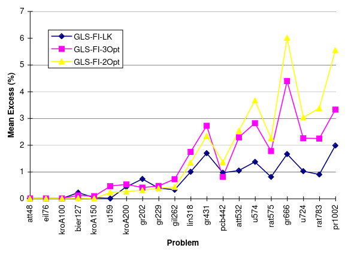
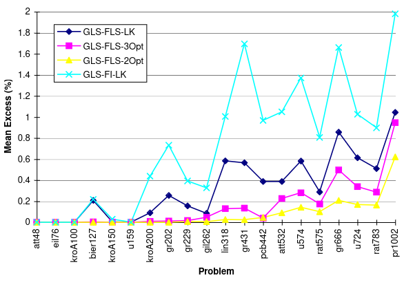
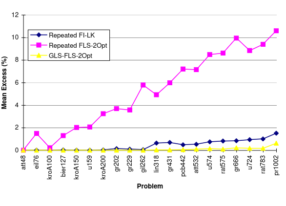
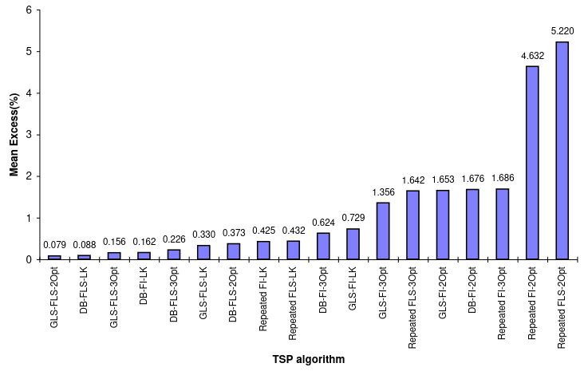

# Codes and pseudocodes

- [Codes and pseudocodes](#codes-and-pseudocodes)
  - [Guided Local Search](#guided-local-search)
    - [GLS pseudocode](#gls-pseudocode)
    - [GLS Python code](#gls-python-code)
      - [Key Adjustments](#key-adjustments)
  - [Fast Local Search + GLS](#fast-local-search--gls)
    - [FLS+GLS pseudocode](#flsgls-pseudocode)
  - [Results](#results)
    - [Results](#results-1)
    - [Algorithm comparison](#algorithm-comparison)
  - [Where to search for other implementations](#where-to-search-for-other-implementations)
    - [Full solutions](#full-solutions)
    - [Heuristics](#heuristics)

## Guided Local Search

### GLS pseudocode

```pseudocode
procedure GuidedLocalSearch(S, g, lambda, [I_1, ...,I_M], [c_1,...,c_M], M)

begin
  
  k = 0;
  s_0 = random or heuristically generated solution in S;
  
  for i = 1; i=M; do /* set all penalties to 0 */
    p_i = 0;
  
  /*; i= here are just initialization steps /*


  while StoppingCriterion do
  begin
    h = g + lambda * sum(p_i *I_i); /* should do another for here? /*
    s_k+1 = LocalSearch(s_k, h); /* finds a solution with a cost
  
    for i=1; i=M; do
      utility = I_i(s_k+1) * c_i / (1+p_i);
    
    for each i such that utility is maximum do /* should do another for here? Is this the right indentation? */
      p_i = p_i + 1;
    
    k = k+1;
  
  end
  s* = best solution found with respect to cost function g;
  return s*;
end
```

### GLS Python code

```python
import random

def guided_local_search(S, g, lambda_, I, c, M, stopping_criterion):
    # Initialize variables
    k = 0
    s_0 = random.choice(S)  # Assuming S is a list of possible solutions or a generator function

    # Initialize penalties
    p = [0] * M

    s_k = s_0

    while not stopping_criterion(k, s_k):
        # Calculate modified cost function h
        h = g(s_k) + lambda_ * sum(p[i] * I[i](s_k) for i in range(M))

        # Perform local search
        s_k_plus_1 = local_search(s_k, h)

        # Calculate utility for each feature
        utilities = [I[i](s_k_plus_1) * c[i] / (1 + p[i]) for i in range(M)]

        # Find the maximum utility value
        max_utility = max(utilities)

        # Update penalties for features with maximum utility
        for i in range(M):
            if utilities[i] == max_utility:
                p[i] += 1

        # Update the current solution and iteration counter
        s_k = s_k_plus_1
        k += 1

    # Return the best solution found with respect to cost function g
    return s_k

# Assuming you have a function for LocalSearch
def local_search(s, h):
    # Implement your local search logic here
    pass

# Example usage:
# Define your cost function g, indicator functions I, costs c, and stopping criterion
```

---

```python
import random
from typing import Callable, List, Any

def guided_local_search(
    S: List[Any],
    g: Callable[[Any], float],
    lambda_: float,
    I: List[Callable[[Any], float]],
    c: List[float],
    M: int,
    is_local_minimum: Callable[[Any], bool]
) -> Any:
    """
    Performs the Guided Local Search algorithm.

    :param S: A list of possible solutions.
    :param g: A cost function that evaluates a solution.
    :param lambda_: A parameter to balance between original cost and penalties.
    :param I: A list of indicator functions for features.
    :param c: A list of costs associated with each feature.
    :param M: The number of features.
    :param is_local_minimum: A function to determine if s_k is at a local minimum.
    :return: The best solution found with respect to cost function g.
    """
    
    # Initialize variables
    k = 0
    s_k = random.choice(S)  # Assuming S is a list of possible solutions

    # Initialize penalties
    p = [0] * M

    while True:
        # Calculate modified cost function h
        h = g(s_k) + lambda_ * sum(p[i] * I[i](s_k) for i in range(M))

        # Perform local search
        s_k_plus_1 = local_search(s_k, h)

        # Check if s_k_plus_1 is at a local minimum
        if not is_local_minimum(s_k_plus_1):
            break

        # Calculate utility for each feature
        utilities = [I[i](s_k_plus_1) * c[i] / (1 + p[i]) for i in range(M)]

        # Find the maximum utility value
        max_utility = max(utilities)

        # Update penalties for features with maximum utility
        for i in range(M):
            if utilities[i] == max_utility:
                p[i] += 1

        # Update the current solution and iteration counter
        s_k = s_k_plus_1
        k += 1

    # Return the best solution found with respect to cost function g
    return s_k

# Assuming you have a function for LocalSearch
def local_search(s: Any, h: float) -> Any:
    """
    A placeholder function for local search logic.

    :param s: The current solution.
    :param h: The modified cost function value.
    :return: A new solution found by local search.
    """
    # Implement your local search logic here
    pass

# Example usage:
# Define your cost function g, indicator functions I, costs c, and a function to check if at local minimum
```

#### Key Adjustments

- **Stopping Criterion Function**: Replace `stopping_criterion` with `is_local_minimum`, which should be defined to check if `s_k` is at a local minimum.

- **Loop Condition**: The loop now breaks when `s_k_plus_1` is not at a local minimum, aligning more closely with your intended logic from the pseudocode.

This setup assumes you have implemented logic within `is_local_minimum` to correctly identify when a solution is at a local minimum based on your problem's specifics.

---

```python
import random

def guided_local_search(S, g, lambda_, I, c, M):
    # Initialize variables
    k = 0
    s_0 = random.choice(S)  # Randomly choose an initial solution or use a heuristic
    p = [0] * M  # Initialize all penalties to 0

    def augmented_cost(s):
        return g(s) + lambda_ * sum(p_i * I_i(s) for p_i, I_i in zip(p, I))

    def utility(s_star):
        return [I_i(s_star) * c_i / (1 + p_i) for I_i, c_i, p_i in zip(I, c, p)]

    s_k = s_0
    while True:
        # Perform local search to find a local minimum with respect to the augmented cost function
        s_k_plus_1 = local_search(s_k, augmented_cost)

        # Check if a stopping criterion is met (e.g., max iterations or improvement threshold)
        if stopping_criterion_met(s_k_plus_1):
            break

        # Calculate utility for each feature
        utilities = utility(s_k_plus_1)

        # Find the maximum utility and update penalties for those features
        max_utility = max(utilities)
        for i in range(M):
            if utilities[i] == max_utility:
                p[i] += 1

        # Update current solution
        s_k = s_k_plus_1
        k += 1

    # Return the best solution found with respect to the original cost function g
    return min(S, key=g)

def local_search(s, cost_function):
    # Implement your local search algorithm here.
    # This could be a simple hill climbing or more sophisticated technique.
    pass

def stopping_criterion_met(s):
    # Implement your stopping criterion here.
    # This could be based on iterations, time limit, or solution quality.
    pass

# Example usage:
# Define your search space S, cost function g, lambda parameter,
# indicator functions I (as a list of functions), feature costs c,
# and number of features M.
```

---

```python
def guided_local_search(initial_solution, g, lambda_, I, c, M):
    # Initialize variables
    k = 0
    s_k = initial_solution
    p = [0] * M  # Initialize all penalties to 0

    def augmented_cost(s):
        return g(s) + lambda_ * sum(p_i * I_i(s) for p_i, I_i in zip(p, I))

    while not stopping_criterion_met():
        # Perform local search to find a local minimum with respect to augmented cost function
        s_k_plus_1 = local_search(s_k, augmented_cost)

        # Calculate utility for each feature
        utilities = [I_i(s_k_plus_1) * c_i / (1 + p_i) for I_i, c_i, p_i in zip(I, c, p)]

        # Find features with maximum utility and update penalties
        max_utility = max(utilities)
        for i in range(M):
            if utilities[i] == max_utility:
                p[i] += 1

        # Update current solution
        s_k = s_k_plus_1
        k += 1

    # Return the best solution found with respect to original cost function g
    return s_k

# Define your initial solution generation method,
# local_search function,
# and stopping criterion based on your specific problem.
```

## Fast Local Search + GLS

### FLS+GLS pseudocode

```pseudocode
procedure GuidedFastLocalSearch(S, g, λ, [I_1, ..., I_M], [c_1,...,c_M], M, L)
begin
    k = 0; 
    s_0 = random or heuristically generated solution in S;

    for i=1; i=M; i++ do
        pi = 0; /* set all penalties to 0 */
    
    for i=1; i=L; i++ do 
        bit_i = 1; /* set all sub-neighborhoods to the active state */
    
    while StoppingCriterion do
    begin
        h = g + λ * sum(p_i*I_i) ;
        s_k_next = FastLocalSearch(s_k, h,[bit_1, …,bit_L], L);
    
        for i=1; i=M; i++ do 
            utility = I_i(s_k_next) * c_i / (1+p_i);

        for each i such that max(utility) do
        begin
            pi = pi + 1;
            SetBits = SubNeighbourhoodsForFeature(i);
            /* activate sub-neighborhoods relating to feature i penalized */
            for each bit b in SetBits do b = 1;
        end
        k = k+1;
    end
    s* = best solution found with respect to cost function g;
    return s*;
end

procedure FastLocalSeach(s, h, [bit1, …,bitL], L)
begin
    while $bit, bit = l do
    for i =1; i= L do
    begin
    if biti = 1 then /* search sub-neighborhood for improving moves */
    begin
    Moves = set of moves in sub-neighborhood i;
    for each move m in Moves do
    begin
    s¢ = m(s);
    /* s¢ is the solution generated by move m when applied to s */
    if h(s¢) < h(s) then /* for minimization */
    begin
    biti = 1;
    SetBits = SubNeighbourhoodsForMove(m);
    /* spread activation to other sub-neighborhoods */
    for each bit b in SetBits do b = 1;
    s = s¢;
    goto ImprovingMoveFound
    end
    end
    biti = 0; /* no improving move found */
    end
    ImprovingMoveFound: continue;
    end;
    return s;
end
```

## Results

### Results

<center>



</center>

Here, ***Guided Local Search with Lin-Kernighan and first improvement*** obtained the best results when compared to other ***GLS first improvement*** methods.

<center>



</center>

Then when compared with ***GLS-FLS*** methods, it's shown that ***GLS-FI-LK*** gets behind in comparison for larger problems.

Another This may be explained by ***GLS-FLS-2opt*** performing more penalty cycles than its counterparts. More penalty cycles seem to increase efficiency at a level which outweighs the benefits from using a more sophisticated local search procedure as ***3-opt and LK***

<center>



</center>

### Algorithm comparison



## Where to search for other implementations

### Full solutions

1. GLS + BI-2opt: [41, 42]
2. Iterated Lin-Kernighan (same consistency in finding optimal results): [20, 21, 24, 42], [as proposed by Lin and Kernighan 32]
3. modified LK: [33]
4. Simmulated annealing + local search : [34]
5. Simmulated annealing 2-opt: [20: algorithm description, 22: algorithm stoppage with counter], [1, 9, 22, 23, 26, 28]
6. Tabu search 2-opt: [27: algorithm by aspiration test]

### Heuristics

1. 3-opt: [3]
