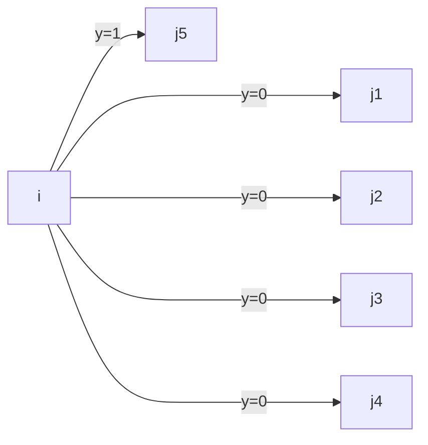

# Review

- [Review](#review)
  - [Acronyms](#acronyms)
  - [Abstract](#abstract)
  - [Constraints](#constraints)
    - [Physical constraints](#physical-constraints)
    - [Temporal constraints](#temporal-constraints)
    - [Variable type constraints](#variable-type-constraints)
  - [Variables](#variables)
  - [Objective function](#objective-function)
  - [Nodes](#nodes)
  - [Arcs](#arcs)
    - [Feasibility of an Arc](#feasibility-of-an-arc)
  - [Node Expansion](#node-expansion)
  - [Cost of an Arc](#cost-of-an-arc)
  - [Proposed algorithm](#proposed-algorithm)
    - [A\* Heuristics](#a-heuristics)
  - [Pruning the state-space graph](#pruning-the-state-space-graph)
    - [Definition 1](#definition-1)
    - [Definition 2](#definition-2)
    - [Proposition](#proposition)
  - [The algorithm](#the-algorithm)
  - [Schematics](#schematics)
  - [Important assumptions](#important-assumptions)
  - [Explaining the symbols](#explaining-the-symbols)
    - [indexes](#indexes)
    - [variables](#variables-1)
    - [Domains](#domains)
  - [Proposed heuristics](#proposed-heuristics)

## Acronyms

VRDSP-IS
: Vehicle routing and truck driver scheduling problem with intermediate stops

VRDSP-HOS
: Vehicle routing and truck driver scheduling problem with hours of service

## Abstract

The article presents the implementation of regulatoru frameworks must be considered as mandated hourly driven coupled with refueling, resting and eating ability options along alternative routes can materially impacts and travel times, affecting the economy of long-haul transportaiton in differtent ways  for independent drivers and trucking companues.
In-vehicle tuck route guidance systems are time-sensitive and ideally should provide quick real-time repsonses taking into consideration stoppage infrstructure alternatives.

What the article is addressing is the long-haul point-to-point variant of the VRDSP-IS when subject to the VRDSP-HOS, meaning the

## Constraints

- limit in continuous hours at wheel
- establish upper bounds in daily and weekly driver engagement times.

> This conditions usually include mandated driving interruptions of different durations.

### Physical constraints

Physical constraints relate to flow conservation, existence of an origin and a final destinations and the requirement that there not be more than one stop at any given location.

Following equation ensures flow conservation given a $N$ set of all possible allowed stop locations.

$$
\begin{align}
&\sum_k \sum_{j | (i, j)\in A} y^{k}_{i,j} = \sum_k \sum_{j | (j, i)\in A} y^{k}_{j,i} &\qquad\forall i \in N-\{s, t\} \label{eq1}
\\
&\sum_i y^1_{si}=1 \label{eq2}
\\
&\sum_k\sum_{i|(i,t)\in A}y_{it}^{k}=1 \label{eq3}
\\
&\sum_{j|(j, i)\in A}y_{ji}^{k} = \sum_{p\in P}W_{ip}^{k} &\qquad\forall i \in N-\{s, t\}, \forall k \label{eq4}
\\
&\sum_k\sum_{p\in P}W_{ip}^{k} \leq 1 &\qquad\forall i \in N \label{eq5}
\end{align}
$$

### Temporal constraints

Depending on stoppage category atributes, there are several HOS requirements, which are the temporal constraints for the formulation.

$$
\begin{align}
&h_k = \sum_{(i,j) \in A}t(i,j)y^{k}_{i,j} \qquad \forall k \label{hours_worked}
\\
&h_k \leq L_{nor} + L_{ovr} \qquad \forall k \label{eq:2}
\\
&d_i \geq a+i + \sum_k\sum_p
T(p)W^k_{i,p} \qquad \forall i \in N-\{s, t\}
\\
&d_s \geq W_1^{start(day)}
\\
&a_j \geq d_i + \sum_k t(i,j)y^{k}_{i,j} \qquad \forall (i,j) \in A \\
&d_i \geq W_1^{start(day)} + M(W^k_{i3}-1) \qquad \forall i \in N \quad \forall k
\\
&a_i \geq W_k^{start(meal)}+M(W^{k}_{i2}-1) \qquad \forall i \in N \quad \forall k
\\
&a_i \geq W_k^{end(meal)}+M(1-W^{k}_{i2}) \qquad \forall i \in N \quad \forall k
\\
&M \sum_{i \in N}W^k_{i2} \leq h_k \qquad \forall k
\\
&M \sum_{i \in N}W^k_{i3} \leq h_k \qquad \forall k \label{eq15}
\\
\end{align}
$$

Where $L_{nor}$ and $L_{ovr}$ in eq 7 are the accumulaed daily travel time to the maximum permitted daily driving in normal and overtime labor hours conditions.
$T(p)$ in eq 8 is the minimum length of time associated with the respective stop type $p$.
Eq 9 sets the departure time.

### Variable type constraints

Equations to identify the types of variables (i.e., wether binary, integer or continuous).

$$
\begin{align}
&y^k_{ij}\in \{0, 1\} \qquad \forall (i, j) \in A, \forall k
\\
&W^k_{ip}\in \{0, 1\} \qquad \forall i \in N, \forall p \in P, \forall k
\\
&a_i \geq 0 \qquad \forall i \in N
\\
&d_i \ge 0 \qquad \forall i \in N
\\
&h_k \geq 0 \qquad \forall i \in N
\\
\end{align}
$$

## Variables

$\mathbf{y^{k}_{i,j}}$ is a decision variable indicaitng wether travel between a given pair of locations $i$ and $j$ occurs on th $k^{th}$ day with travel time $t(c, j)$ and cost $c(i, j)$, where $\mathbf{y^{k}_{i,j}}$ is one if the driver decides to go from $i$ to $j$ on the $k^{th}$ day and zero otherwise.

$W^{k}_{i,p} \in \{0,1\}$ is a decision variable indicating wehter location i is used for a stop of type $p \in P$ on day $k$ where $p \in \{1, 2, 3, 4 \}$ represents the four types of stops: refueling, resting, overnight and weekend downtime, where $W^{k}_{i,p}$ is 1 if the driver decides to stop at location i for reason p on day k, and 0 otherwise.

$h_k$ is a continuous decision variable directly resulted from the number of hours driven in day $k$.

$a_i$ is the arrival time in location $i$ and $d_i$ is the departure time from location $i$ and these are 2 continuous decision variables

## Objective function

The objective of the problem is to minimize the costs incurred from the travel and stops, while satisfying the HOS constraints.

The first cost category of the objective function comprises travel displacement costs excluding driving labor. It's expressed as the sum of displacemnt costs $c(i,j)$ associatde with each trip segment.
Second cost category comprises all types of stoppage costs and is the sum of all costs incurred during stops. A cost $d(i, p)$ is associated with each stop at location $i$ for reason $p$.
The third cost category comprises driving labor costs, and is expressed by $\eta(h_k)$. If driveing time is less than a normal daily work time in a given workday the driver still receives a base salary. Overtime pay when neccessary, also provides discontinuity. This cost category is a function of $h_k$, the number of hours driving during the $ k^{th}$ day.
A fourth cost category $\phi(d_s, a_t)$ is the opportunity of having a truck in use, the forgone cotribution to operating profits of a transportation asset (in this case, the truck) not being utilized in another task. This cost function of the time each truck is not in use, namely the difference between the departure time from a a stoppage and the respective arrival.

$$
\begin{align}
\begin{split}
\min{Z} &= \sum_{k}\sum_{(i,j)\in A}c(i,j)y^{k}_{i,j} + \sum_{k}\sum_{i\in N}\sum_{p\in P}d(i,p)W^{k}_{i,p} + \sum_{k}\eta(h_k) \\&+ \phi(d_s, a_t)
\end{split}
\end{align}
$$

## Nodes

Identified by $x_n$, a node is defined as a nine-tuple containing all the information necessary to identify a stoppage configuration.

$$
\begin{align}
&x_n = (i_n, p_n, k_n, h^1_n, h^2_n, h^3_n, a_n, d_n, \delta_n)
\end{align}
$$

**where:**

- $i_n$ is the stoppage time location ID associated with node $x_n$
- $p_n$ is the type of stop associated with node $x_n$, where the value of $p \in \{1,2,3,4\}$, corresponding directly to **short rest stop**, **meal**, **overnight stay* or the **required weekly rest**.
- $k_n$ is the current trabel day in node $x_n$, counted sequentially beggining the departure from the origine ($k_n=1$ is the first day).
- $h^1_n$  is the driving time since previous rest stop.
- $h^2_n$ is the driving time that day.
- $h^3_n$ is the driving time that week.
- $a_n$ is the arrival time at node $x_n$.
- $d_n$ is the departure time from node $x_n$.
- $\delta_n (\delta_n = 1)$ if the main meal of the day has happened or (\delta_n = 0) if it has not.

The spatial location of  the stop is only one of nine different parameters or dimension defining the node or state because the state of the node is defined by stoppage attributes (discrete) or temporal markers (continuous).

## Arcs

if node $x_m$ precedes node $x_n$, the latter is one of the nodes obtained by **expanding** node $x_m$ and these two nodes are linked by an arc. Let $t(i_m, i_n, d_m)$ be the travel time between location $i_m$ and $i_n$ given departure time $d_m$, and consider that after stopping at $i_m$ the driver will make a subsequent stop at $i_n$ and that this stop will be of type $p_n \in \{1,2,3,4\}$. The following equations define the addtional seven parameters characterizing the successor node:

$$
\begin{align}
    &k_n =
        \begin{cases}
            k_m, & \text{if } p_m \in \{1,2\}, \\
            k_m + 1, & \text{if } p_m = 3, \\
            k_m + 2, & \text{if } p_m = 4
        \end{cases} \label{eq24}
\\
    &h^1_n = t(i_m, i_n, d_m) \label{eq24}
\\
    &h^2_n =
    \begin{cases}
        h^2_m + t(i_m, i_n, d_m), & \text{if } p_m \in \{1,2,3\}, \\
        t(i_m, i_n, d_m), & \text{if } p_m = 4
    \end{cases} \label{eq25}
\\
    &h^3_n =
    \begin{cases}
        h^3_m + t(i_m, i_n, d_m), & \text{if } p_m \in \{1,2,3\}, \\
        t(i_m, i_n, d_m), & \text{if } p_m = 4
    \end{cases} \label{eq26}
\\
    &a_n = d_m + t(i_m, i_n, d_m) \label{eq27}
\\
&d_n \geq
    \begin{cases}
        a_n + t_1, & \text{if } p_n = 1, \\
        \max{[a_n, W^{start(meal)}_{k_n}]} + T_2, & \text{if } p_n = 2, \\
        \max{[a_n + T_3, W^{start(day)}_{k_n+1}]} , & \text{if } p_n = 3, \\
        \max{[a_n + T_4, W^{start(day)}_{k_n+2}]} , & \text{if } p_n = 4
    \end{cases} \label{eq28}
\\
&\delta_n =
    \begin{cases}
        0, & \text{if } p_n \in \{3,4\}, \\
        \delta_m, & \text{if } p_n = 1, \\
        1, & \text{if } p_n = 2
    \end{cases} \label{eq29}
\end{align}
$$

**where:**

Node $x_n$ suceeds node $x_m$ after expanding node $x_m$ and these two nodes are linked by an arc.

- $\{T_1,\dots,T_4\}$ are the minimum required time length at the different types of stops.
- $\ref{eq23}{Equation 23}$ determine the day in which a stop described in node $x_n$ occurs, counting from the beginning of the route (node $x_m$)
- $\ref{eq24}{Equation 24}$ requires that uninterrupted driving time be the elapsed time between two consecutive stops.
  - **$h^1$ is the time between router.** only registers the current travel.
- $\ref{eq25}{Equation 25}$ defines the total time driven during the day. Reinitialize every day.
  - **$h^2$ is the total time spent driving in a workday.** It grows iteratively through the day.
- $\ref{eq26}{Equation 26}$ is analogous to $\ref{eq25}{equation 25}$, but for the total time spent driving in a workweek.
  - **$h^3$ is the total time spent driving during the week.** It grows iteratively through the week. Reinitializes every week (or when the total week hours are obtained).
- $\ref{eq27}{Equation 27}$ determines the arrival time $i_n$ associated with node $x_n$, considering the driver left the previous location $i_m$ at $d_m$ time.
- $\ref{eq28}{Equation 28}$ determines if the departure time $d_n$ from chosen stoppage configuration described by node $x_n$ is feasible.
- $\ref{eq29}{Equation 29}$ determines if the driver has eaten a meal during the day.
- $p_n \in \{1,2,3,4\}$

The existence of an arc from node $x_m$ to node $x_n$ is conditioned to $\{h^1_n, h^2_n, h^3_n\}$ satifying the driving time requirements:

$$
\begin{align}
&h^1_n \leq L_{drv} \label{eq30}
\\
&h^2_n \leq L_{nor} + L_{ovr} \label{eq31}
\\
&h^3_n \leq L_{week} \label{eq32}
\end{align}
$$

**where:**

- $L_{drv}$ is maximum allowed continuous driving (without rest) time.
- $L_{nor}+L_{ovr}$ is maximum allowed driving time during a workday (normal+overtime).
- $L_{week}$ is maximum allowed driving time during a workweek.

**The time of the main meal in the $k^{th}_n$ day of the week need to occur between $\bold{\begin{bmatrix}W_{k_n}^{start(meal)}, &W_{K_n}^{end(meal)}\end{bmatrix}}$ time window. This means that a stop configuration $\delta_n=0$ on the $k^{th}_n$ workday is only feasible if arrival occurs bifore $W_{k_n}^{end(meal)}$, that is:**

$$
\begin{align}
&a_n \leq W_{k_n}^{end(meal)} \qquad if \quad \delta_n = 0 \label{eq34}
\end{align}
$$

### Feasibility of an Arc

**The feasibility of an arc is determined by the following constraints:**

1. ***Time constraints***: the time of arrival at the expanded node must be before the respective HOS deadline.
2. ***Driver availability***: the driver must be available at the time of departure from the current node.
3. ***Truck availability***: the truck must be available at the time of departure from the current node.
4. ***Driver rest constraints***: the driver must have had enough rest time before the departure from the current node.
5. ***Driver driving time constraints***: the driver must not have driven for more than the maximum allowed continuous driving time.
6. ***Driver on-duty time constraints***: the driver must not have been on duty for more than the maximum allowed on-duty time.
7. ***Truck maintenance constraints***: the truck must not have driven for more than the maximum allowed continuous driving time without maintenance.

## Node Expansion

A Node $x_ind$ is composed by 9 states: $(i_{ind}, p_{ind}, k_{ind}, h^1_{ind}, h^2_{ind}, h^3_{ind}, d_{ind}, a_{ind}, \delta_{ind})$

Equations 23-33 determine the **feasibility** of a transition from one stoppage to another. Two nodes $(x_m, x_n)$ are connected by an arc if and only if it is feasible for the driver to transition from the node with states $x_m$ to the node with states $x_n$.  
From this, we can find the set of nodes with feasible states from any node $x_m$ represented by adjacent nodes $\begin{bmatrix}x_n, &x_{n+1}, &x_{n+2}, &\dots\end{bmatrix}$ by expanding $x_m$.

Given the continuity of time-dependent elments or parameters in the nine-state node, the state-space graph has an unlimited number of successor nodes. To avoid this, we can limit the number of successor nodes by node pruning to generate only the most promising successor nodes during an expansion.

> **<h3> :notebook: Node Pruning</h3>**
>The node pruning process is used to limit the number of successor nodes generated during the expansion of a node. This is done by defining a set of pruning rules that determine which successor nodes are discarded and which are kept for further expansion. **The pruning rules are based on the feasibility of the transition from the current node to the successor node, as well as the optimality criteria of the problem.**

Node expansion is the set of stoppage configurations that are feasibly reached from a given stoppage configuration $s_m$. To obtain it:

1. Examining the Cartesian product of all possible stoppage type $p \in \{1,2,3,4\}$ and locations $i_n$ which can be reached from $i_m$ in $\leq L_{drv}$ (maximum allowed continuous driving time), **considering as departure time only the minimum feasible value $d_m$**.  
    > This option stems from the fact that less stoppage time is better than more because there are costs that increase with the total duration of the trip

2. Eliminating all options that do not satisfy one or more eqs. 23-33.

The process of expanding node $x_m$ is represented by a successor operator $\Gamma$ applied to a node $x_m$ building out the graph through sequential applications of $\Gamma$:

$$
\begin{align}
\Gamma(x_m) = \{x_n, x_{n+1}, x_{n+2}, \dots\}
\end{align}
$$

## Cost of an Arc

**The cost component of an arc is as follows:**

1. ***Driver compensation***: including driver benefits, **which is function** of hours on the job, hours of overtime driving, social security and other taxes, and benefits such as health insurance, and other components.
2. ***Truck expenses***: fuel, lubricants, tires, etc., which are usually a function of the distance traveled.
3. ***Vehicle fixed costs***: depreciation, immobilized capital, taxes, insurances, usually proportional to total elapsed time of each activity or trip leg.
4. ***Costs of service***: incurred in stoppage locations which are not cherged per unit of time (meals, overnight stars, etc.).
5. Opportunity costsfor the allocation of the vehicle to this trip, **proportional to the total elapsed travel time and represents the expected value of any lost revenue incurred for not assigning that particular truck to another job.
6. ***Penalty costs***: to express the need to arrive at the location of the expanded node before the respective HOS deadline.

In summary, the cost of an arc is the sum of truck displacement costs from one location to the next, time dependent stoppage costs, non-time depedent stoppage costs, truck's opportunity costs, a penalty for regulations not met and driver labor costs.

$\therefore$, the cost $c(x_m, x_n)$ of an arc from $x_m$ to $x_n \in \Gamma (x_m)$ is:

$$
\begin{equation}
\begin{split}
c(x_m, x_n) &= c_1t(i_m, i_n, d_m) + c_2(i_n) [d_n-a_n] + c_3(i_n, p_n) + c_4[a_n-d_m] \\ &+ c_5\max[0, a-n-\max(T_{max}, a_m)] + c_6(h^2_m, h^2_n, p_m)
\end{split}
\end{equation}
$$

**where:**

- $c_1$ is the cost of truck displacement expressed as $/hour;
- $c_2(i_n)$ is the stoppage cost per unit of time in location i_n expressed as $/hour;
- $c_3(i_n, p_n)$ is the cost of non-time-dependent services incurred in stoppage location $i_n$ during a stop of type $p_n$;
- $c_4$ is, without loss of generality, the opportunity cost applied to the time incurred between departure from stoppage $i_m$ and arrival at stoppage $i_n$ and described above, considered to be linear in time;
- $c_5$ is the penalty cost per hour incurred if deadline $T_{max}$is not respected;
- $c_6(h^2_m, h^2_n, p_m)$ is the daily labor cost which include costs described above and is calculated as:

    $$
    \begin{equation}
        c_6(h^2_m, h^2_n, p_m) =
        \begin{cases}
            S(h^2_n) - S(h^2_m), & \text{if} \quad p_m \in \{1, 2\} \\
            S{h^2_n} , & \text{if} \quad p_m \in \{3, 4\} \\
        \end{cases}
    \end{equation}
    $$
    where $S(h)$ is the driver cost for $h$ hours of work in respective day, given by:

    $$
    \begin{equation}
        S(h) =
        \begin{cases}
            S_{nor}L_{nor}, & \text{if} \quad h \leq L_{nor} \\
            S_{nor}L_{nor} + S_{ovr}(h-L_{nor}), & \text{if} \quad L_{nor} < h \leq L_{nor} + L_{ovr} \\
        \end{cases}
    \end{equation}
    $$
    With $S_{nor}$ and $S_{ovr}$ being the normal and overtime labor driving costs (including benefits) and $L_{nor}$ and $L_{ovr}$ being the normal and overtime labor driving hours.

## Proposed algorithm

### A* Heuristics

**$\textit{A*}$ algorithm is label-setting shortest path in the same vein as Dijkstra's algorithm**, associating wach ode $x_n \in X$ with a label $[\hat{g}(x_n), pred(x_n)]$, where $\hat{g}(x_n)$ was the *current* lowest cost sequence of nodes connecting the origin $x_s$ to node $x_n$ and $pred(x_n)$ is the node that precedes $x_n$ in this sequence. Hart et al. (1968) introduced a heuristic approach ($\textit{A*}$ algorithm) with the objective of reducing processing time while losing little or nothing in terms of optimality. **${A*}$ replaced the test for labeling a node based only on costs already incurred with a test that adds *to* the incurred cost an estimated cost remaining from each labeled node to the final destination.**

In $\textit{A*}$ algorithm, the expansion of a node is made based not only on the lowest cost between the origin and the respective node $x \in X, \hat{g}(x)$, but also on adding an estimate of the cost $\hat{h}(x)$ between this node and the final destination $x_t$.

Let $\hat{f}(x_m) = \hat{g}(x_m) + \hat{h}(x_m)$ be an estimate of the lowest cost path connecting the origin node to the destination node through node $x_m$. Instead of selecting node $x$ with the lowest cost $\hat{g}(x)$, an alternative node $x_m \in X_T$ with the lowest value of $\hat{f}(x_m)$ (i.e. $\hat{f}(x_m) = \min_{x_m \in X_T} \hat{f}(x)$) is selected. if $\hat{f}(x)$ is an optimistic estimate, i.e. the estimated costs undercuts the actual cost for every alternative in the complete grpah, optimality in the shortest path is guaranteed. However, if the heuristic estimate $\hat{h}(x)$ does not undercut the lowest cost in the graph, there is no guarantee of optimality, but the cost of the respective solution will not exceed the cost of the optimal solution by more than the ratio by which the estimate $\hat{h}(x)$ exceeds the exact $h(x)$.  
$\therefore \hat{f}_{opt}(x) = \frac{h^*(x)}{h(x)}\hat{f}(x)$

**where:**

- $\hat{h}(x)$ is an estimate of the cost between node $x$ and final destination $t$.
- $\hat{g}(x_n)$ is the current lowest cost sequence of nodes connecting the origin $x_s$ to node $x_n$

**Three solutions are proposed in the paper:**

- $\hat{h}_I(x_n)$ has no information added to the search process, making it behave like Dijkstra's algorithm.
- $\hat{h}_{II}(x_n)$ estimates the cost from any node to the destination node in the simplest possible way.
  - Considering the remaining distance to be covered in a straight line.
  - The truck covers the distance in ideal speed conditions, without any restins stops.
  - **The heuristics become then $\hat{h}_{II}(x_n) = \alpha dist(i_n, t)$**, where $\alpha$ is a constant based on the vehicle's displacement operating cost and $dist(i_n, t)$ is the straight line distance from the location associated with the stop $i_n$.
- $\hat{h}_{III}(x_n)$ estimates the remaining displacement and rest stop costs by **extrapolating** the cost patterns tha have been expericend up to the give trip stage.
  - Assumes that the cost patterns in the route going forward will not be inferior to the costs on the route up to that specific point
    > the remainder of the route will be covered with displacement and a pattern of stoppages with costs greater or equal to those experienced up to that point.

We consider that for a node already expanded, labeled as $\text{permanent}(x_n \in X_p)$, there is a pair of values $[dist(s,I_n), \hat{g}(x_n)]$, where $dist(s, i_n)$ is the straight line distance from the beginning of the trip to location $i_n$ and $\hat{g}(x_n)$ is the current lowest cost sequence of nodes realized to reach node $x_n$.

The [figure](#fig-lower_bound) represents a case for 2500km. The continuous line is the lower bound envelope that optimistically estimates displacement and rest costs for different distances covered in a straight line from the origin. It can be used to **estimate $\hat{h}_{III}(x_n)$** becuase lowest costs realized until this moment in the search process (up to each location in the $permanent$ subset) are a reasonable estimate of costs to be incurred going forward for the same distance in a straigth line trajectory, and in particular until the final destination is reached.  
The envelope is constructed progressively, beginning with the few rest stops which are in vicinity of the origin trip (low values of $dit(s, i_n)$) and continuing throughout the process, in an uncomplicated way. First the domain of the stright line distance is divided at regular intervals: $[0, \Delta], [\Delta, 2\Delta], \dots, [(r-1)\Delta, r\Delta], \dots$.  
Each pair $[dist(s,i_n), \hat{g}(x_n)]$ corresponds to a point in the chart depicted in [figure](#fig-lower_bound) and is associated with a specific interval index calculated as $r=\min \{k \in Z_+|k \geq \frac{dist(s,i_n)}{\Delta} \}$. For this interval, $\alpha_r$ is:

$$
\begin{align}
    \alpha_r =
        \begin{cases}
            \frac{\hat{g}(x_n)}{dist(s,i_n)} & \text{if} \quad \alpha_r \quad \text{is not defined} \\
            \min \left[\alpha_r, \frac{\hat{g}(x_n)}{dist(s, i_n)} \right] & \text{otherwise}
        \end{cases}
\end{align}
$$

$\alpha_r$ is used to estimate $\hat{h}_{III}(x_n)$ **as function of the straight line distance of stoppage location $i_n$ to the trip destination$t$, denoted by $dist(i_n, t)$. These interval is now calculated as $r=\max \{k \in Z_+|k \leq \frac{dist(s,i_n)}{\Delta} \}$

## Pruning the state-space graph

### Definition 1

Two node $x_m$ and $x_n$ are defined as similar elements $(i, p)$, represented by the notation $x_m \overset{i,p}{\thicksim}x_n$ if and only if $i_m=i_n$ and $p_m=p_n$
> two stoppage configurations are similar in elements $(i,p)$ if the stop occurs in the same location and the type of the stop will be the same. Nodes that are similar in elemnts, likely will have different arrival times and different costs $\hat{g}(x)$ because incurred time is a continuous variable and any difference in elapsed time will lead to different costs.

### Definition 2

$x_m$ weakly dominates $x_n$, if and only if $x_m \overset{i,p}{\thicksim}x_n$ and $\hat{g}(x_m) < \hat{g}(x_n)$.

### Proposition

Consider the functions $[\hat{h}_{I}(x), \hat{h}_{II}(x), \hat{h}_{III}(x)]$ and that $x_m \overset{i,p}{\thicksim}x_n$. If $x_m$ weakly dominates $x_n$ ($\hat{g}(x_m) < \hat{g}(x_n)$), there is noevidence that the lowest cost path between the origin and the destination configurations includes node $x_n$.

## The algorithm

1. S1 initialization: set variables to zero
2. S2 Node expansion:
   1. For each node $x_n \in \Gamma(x_m)$:
        1. if $\exists x_k \in X_P|x_k \overset{i,p}{\thicksim} x_n$ (if exists an $x_k$ in $X_P$ such that $x_k$ is similar or equivalent to $x_n$ under parameters $(i, p)$), **discard $\bold{x_n}$**.
        2. Otherwise calculate $\beta \leftarrow\hat{g}(x_m)+c(x_m,x_n)$
             1. If the nodes are similar and $\beta \geq \hat{g}(x_k)$, discard $x_n$
             2. Else if the $\beta \leq \hat{g}(x_k)$, update the node $x_n$ as the main node from $x_m$
             3. Else, the two nodes aren't similar, expand the node.
3. Node selection
   1.

## Schematics

## Important assumptions

Every $h_index$ is a variable for the node. A state of the node, not a property.

- what are the nodes properties?

## Explaining the symbols

### indexes

- $n$ is the index of the next node during an arc.
- $m$ is the index of the last node during an arc.
- $k_n$ is the index of the day of the week.
- $i$ is the node index.
- $j$ is also the node index. But it is a future possible node.
- $s$ is the index of a trip start/day start.
- $t$ is the index of a trip end/day end.

### variables

- $h^1_n$ is the time between router. only registers the current travel.
- $h^2_n$ is the total time spent driving in a workday. It grows iteratively through the day
- $h^3_n$ is the total time spent driving during the week. It grows iteratively through the week. Reinitializes every week (or when the total week hours are obtained).

### Domains

- $X_T$ is the $X$ temporary domain of the possible solutions?
- $X_P$ is the domain of $permanent$ nodes, already expanded.

## Proposed heuristics
