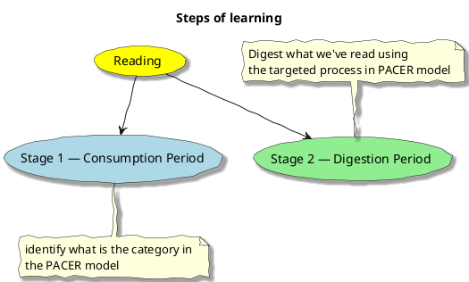
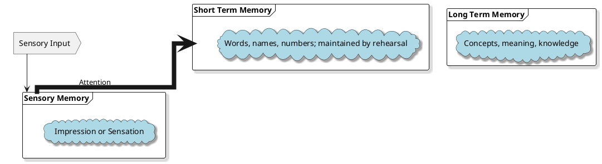
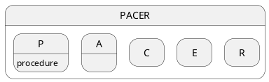

- [How to Remember Everything You Read](#how-to-remember-everything-you-read)

# How to Remember Everything You Read

```puml
@startuml
title Steps of learning
top to bottom direction
skinparam handwritten true
skinparam shadowing true

"Reading" as (r) #yellow
"Stage 1 — Consumption Period" as (cp) #lightblue
"Stage 2 — Digestion Period" as (dp) #lightgreen

note bottom of cp
  identify what is the category in 
  the PACER model
end note

note "Digest what we've read using \nthe targeted process in PACER model" as n2

r --> cp
r --> dp
n2 --> dp

@enduml
```

```puml
@startuml

skinparam componentStyle folder
skinparam shadowing true

skinparam ranksep 10.2
skinparam linetype ortho
skinparam ArrowMessageAlignment left

together {
action "Sensory Input" as SI
frame "Sensory Memory" as SM {
  cloud "Impression or Sensation" as IS #lightblue
  }
}
frame "Short Term Memory" as STM {
  cloud "Words, names, numbers; maintained by rehearsal" as WNN #lightblue
}
frame "Long Term Memory" as LTM {
  cloud "Concepts, meaning, knowledge" as CMK #lightblue
}

SI -down-> SM
STM <-[thickness=8,hidden]- SM
STM <-[thickness=8,hidden]- SM
STM <-[thickness=8]- SM : "Attention"

@enduml
```

```puml
@startuml
hide empty description

state PACER {
  state P: procedure
  state A: 
  state C
  state E
  state R
}


@enduml
```

