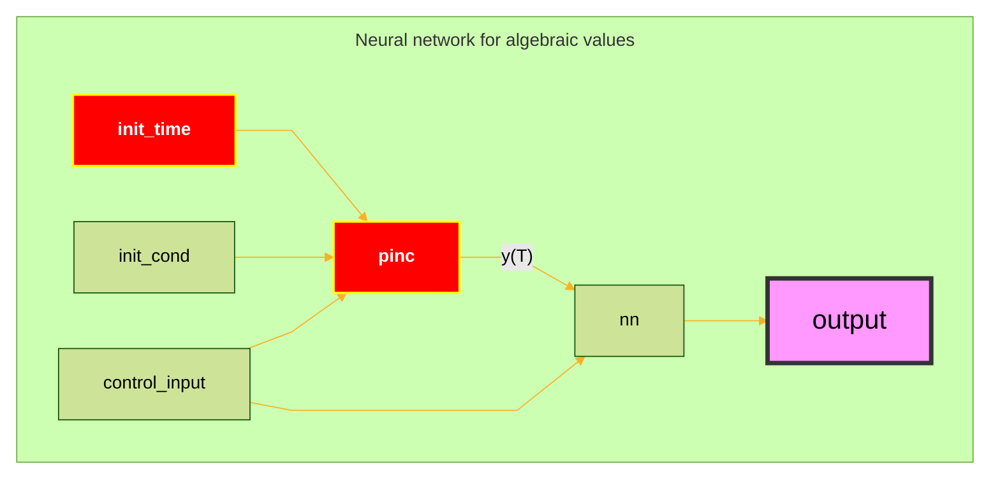
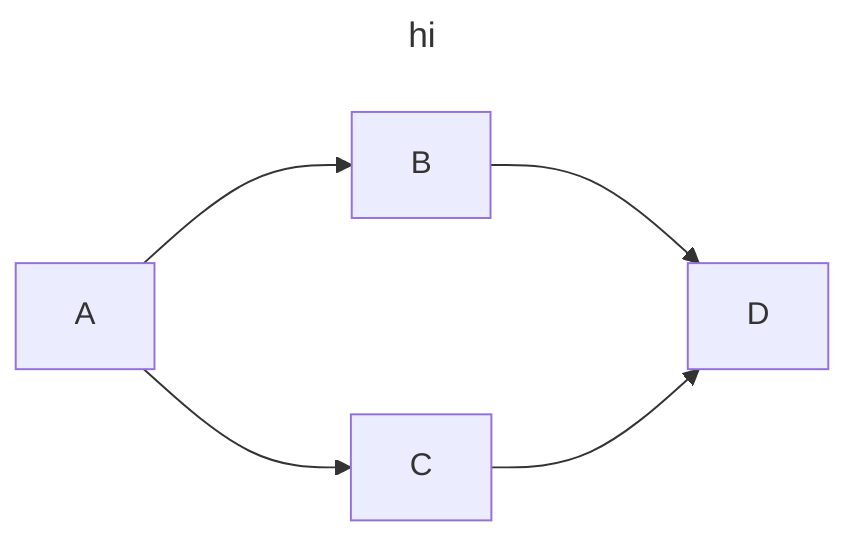
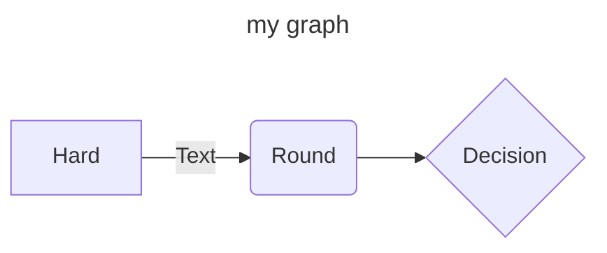
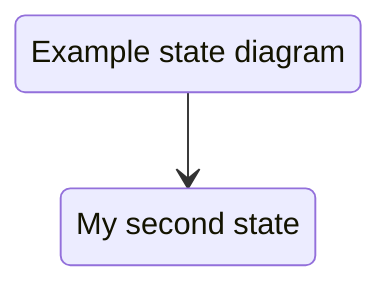
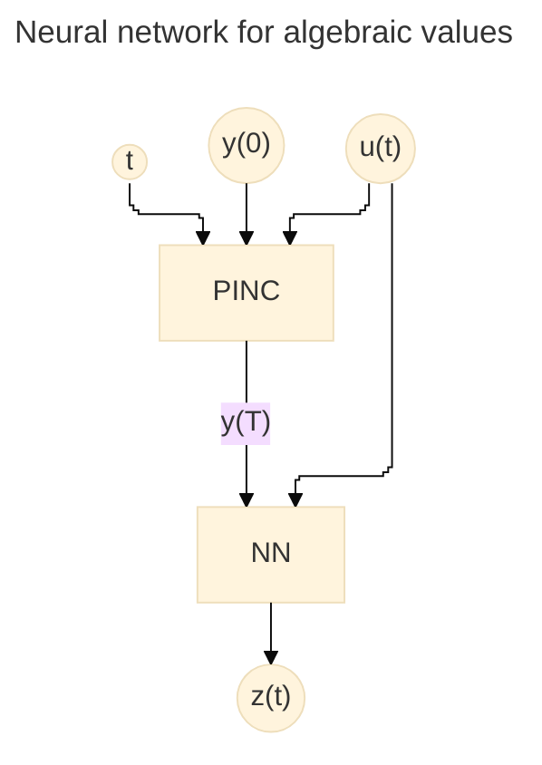
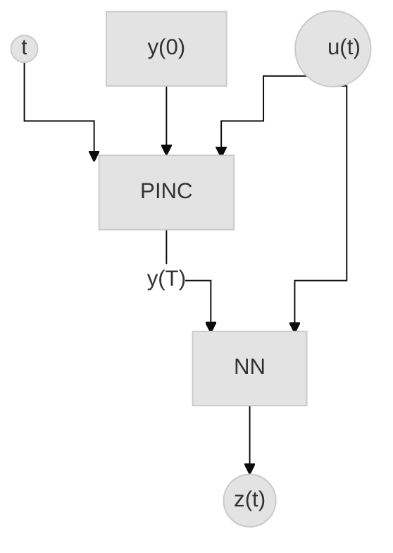
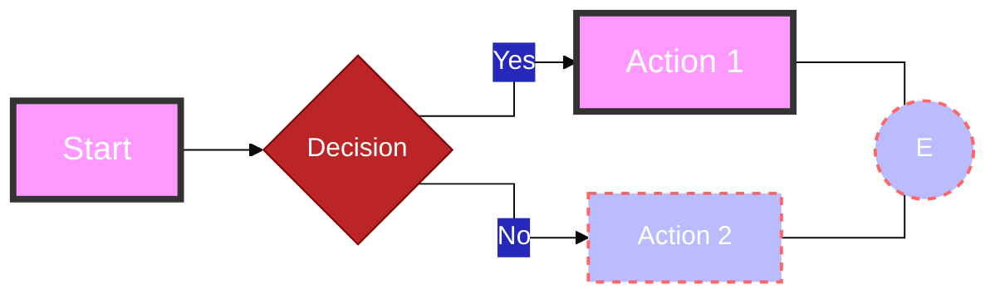

```plantuml
@startuml
circle "t" as init_time
circle "y(0)" as init_cond
init_time --> init_cond
@enduml
```

```plantuml
@startuml
left to right direction

skinparam defaulFontSize 16
skinparam defaultFontName Verdana
skinparam defaultFontColor #2B4162
skinparam defaultTextgather*ment center
skinparam node {
 BackgroundColor #A2C5E8
 BorderColor #2B4162
 BorderThickness 10
}
skinparam circle {
 FontSize 20
 Padding 20
}

circle "  t  " as init_time
rectangle "y(0)" as init_cond
rectangle "u(t)" as control_input
rectangle "PINC" as pinc
rectangle "NN" as nn
rectangle "z(t)" as output

init_time --> pinc
init_cond --> pinc
control_input --> pinc
pinc "y(T)" --> nn
nn --> output
control_input --> nn

@enduml
```



## Making nodes bigger in mermaid

1. Open a [sample flowchart](https://mermaid.live/edit)
2. Go to the element you want to see the properties and click on inspect element. There you'll see the properties of the element.
   1. Other option is directly opening the svg file and inspect the element as a whole.
3. Inspect the possible svg parameters you wanna change

Example using arrays

$$
\begin {array}{l}
\left\{
    \begin{array}{l}
        U =\quad \phi(W^1X + b^1) \\
        V =\quad \phi(W^2X + b^2)
    \end{array}
\right. \\
\left\{
    \begin{array}{l}
        Z^{(1)} = \phi(W^{z,1}X + b^{z,1})\\
        A^{(1)} = (1-Z^{(1)})\odot U + Z^{(1)}\odot V
    \end{array}
\right.\\
\left\{
    \begin{array}{l}
        Z^{(k)} = \phi(W^{z,k}A^{(k-1)} + b^{z,k}) \\
        A^{(k)} = (1-Z^{(k)})\odot U + Z^{(k)}\odot V,\quad k=2,\dots,N_L
    \end{array}
\right.\\
y= WA^{(N_L)} + b
\end {array}
$$

The secret is to use an array of arrays by beginnning an array at the start of the thing.

## all equations to the left
  
```math
\begin{align}
    &k_n =
    \left\{
        \begin{array}{l}
            k_m, if \quad p_m \in \{1,2\}, \\
            k_m +1 if \quad p_m = 3, \\
            k_m+2 if \quad p_m = 4 &
            \end{array}
    \right.
    \\
    &h^1_n=t(i_m, i_n, d_m)
    \\
    &h^2_n =
    \left\{
    \begin{array}{lrl}
    h^2_m + t(i_m, i_n, d_m), if \quad p_m \in \{1,2,3\}, \\
    t(i_m, i_n, d_m), if \quad p_m = 4
    \end{array}
    \right.
    \\
    &h^3_n =
    \left\{
    \begin{array}{lrl}
    h^3_m + t(i_m, i_n, d_m), if \quad p_m \in \{1,2,3\}, \\
    t(i_m, i_n, d_m), if \quad p_m = 4
    \end{array}
    \right.
\\
    \end{align}
```
