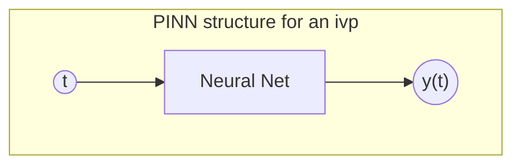
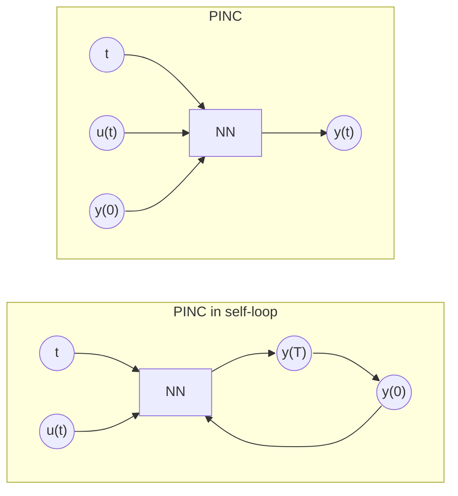
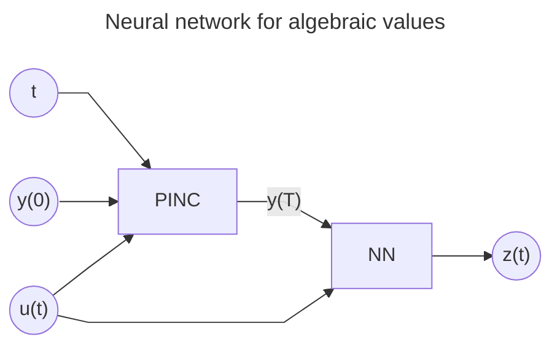
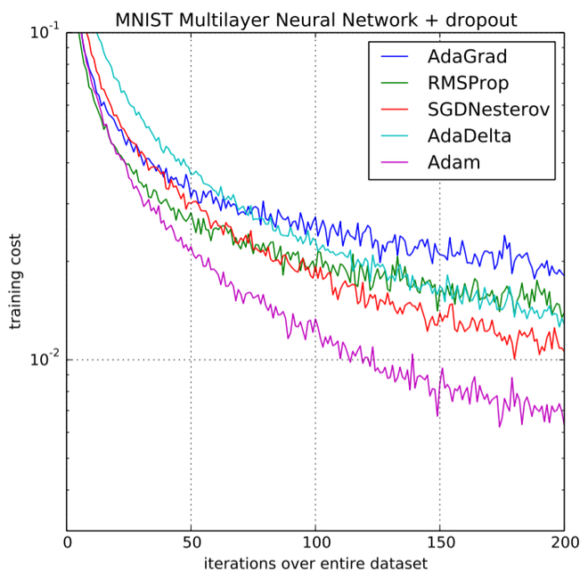

# PINN with skip connections abstract

Understanding the paper ["Physics-Informed Neural Networks with Skip Connections for Modeling and Control of Gas-Lifted Oil Wells"](./physics_informed_neural_networks_pinc.md) by Jonas Ekeland Kittelsen, Eric Aislan Antonelo, Eduardo Camponogara and Lars Struen Imsland

## acronym list

PINN
: Physics Informed Neural Network

PINC
: Physics Informed Neural Nets-based Control

ODE
: Ordinary Differential Equation

PDE
: Partial Differential Equation

MPC
: Model Predictive Control

IVP
: Initial Value Problem

ADAM optimizer
: Adaptive Moment Estimation Optimizer

RMSP
: Root Mean Square Propagation

BFGS
: Broyden-Fletcher-Goldfarb-Shanno

L-BFGS
: Limited-memory Broyden-Fletcher-Goldfarb-Shanno

IAE
: Integral of Absolute Error

## What should I look more into to understand the article

- PINNs by Raissi et al[^PINN].

## abstract

PINN allows neural nets to reason with physics and calculus by incorporating physics laws into the [loss function](#loss-function). This allows them applicable to solving ODEs and PDEs.  
Recently, PINC framework extends PINNs to control problems. PINC alloes for open-ended long-range prediction and control of dynamic systems. The paper proposes an enhancement for PINC in modeling highly nonlinear systems by using skip connections. The focus is on Gas-Lifted Oil Wells and shows how skip connections and some tweaks in ODEs terms improve the model's validation prediction error reducing it by 67%.  
It increases the gradient flow through network layers. Shows the efficacy of MPC, specially in regulating the bottom-hole oil pressure.

## intro

PINNs can increase speed up the process of calculus by orders of magnitude in comparison with traditional numerical methods. Even though they have no access directly to the solurion of ODEs or PDEs, once trained they can provide accurate predictions. The equations are used only during the training phase by designing a loss function that considers a **measure of the deviation of the derivatives of the neural network output from the physics laws given by the ODE/PDEs**. The training is done so the output not only satisfies the physics constraints, in addition to the traditional data loss for regression (mean squared error of the data points).

Though PINNs can highly improve calculations, it cannot extrapolate the predictions for time periods longer than the training.

PINC was develoed to extend PINNs to control problems. It allows for open-ended long-range prediction and control of dynamic systems[^PINC].  
It's faster than traditional numerical methods and better suited for MPC. MPC is widely used for multivariate control in both industry and academia.

### Some mathematical formulation on PINNs and data loss

> 

> Suppose a differential equation given by:
>
>$(\mathcal{N}[u(x)]) = 0$  
> where $\mathcal{N}$ is a differential operator and  $u(x)$ is the solution we want to approximate using a neural network $\hat{u}(x;\theta)$.
>
> The loss function could then be expressed $\mathcal{L}$ as a combination of the data loss $L_{data}$ and the physics loss $L_{physics}$:
>
> $ \mathcal{L}(\theta) = \mathcal{L}_{data}(\theta) + \lambda \mathcal{L}_{physics}(\theta) $
>
> 

The data loss term ($\mathcal{L}_{data}$) measure the discrepancy between the network predictions and the actual data. For regression models:

>\[
> \mathcal{L}_{data}(\theta) = \frac{1}{N} \sum_{i=1}^{N} \left( \hat{u}(x_i; \theta) - u_{true}(x_i) \right)^2
>\]

The physics loss term ($\mathcal{L}_{physics}$) measures the deviation of the derivatives of the neural network output from the physics laws given by the ODE/PDEs. It enforces the constraints by penalizing the deviation of the net's output from the differential equation. $x_i$ are the input data points and $u_{true}(x_i)$ are the corresponding target values.

>\[
> \mathcal{L}_{physics}(\theta) = \frac{1}{M} \sum_{j=1}^{M} \left( \mathcal{N}[\hat{u}(x_j; \theta)] \right)^2
>\]

Where $M$ is the number of collocation points, $x_j$ are the points where the physics loss is evaluated. $\lambda$ is a hyperparameter that balances the importance of the data loss and the physics loss.

In the article, this is done differently. First, a function $MSE_y=\frac{1}{N}|| y(0) - \hat{y_0} ||^2$ is defined as the mean squared error between the predicted and actual outputs.
The author then samples random $N_f$ random points, ${t^k: k= 1,\dots,N_f}$, covering the whole time horizon $[0, T]$, genreating a dataset of collocation points. For each collocation point, a PINN calcultaion is perfromed to generate the output ${y}(t^k)$.
We can calculate the deviation from the ODE in a residual function $\bold{\mathbf{F}}$:
\[
\bold{\mathbf{F}}:=\frac{\partial{y}}{\partial{t}} - \bold{f}(y)
\]
The first term is the NN calculated result differentiated at $t^k$ — the derivative is obtained using automatic differentiation with tensorflow, for example — and the second term is the result of the ODE.
Then, the physics loss is defined as
\[
    MSE_{F}=\frac{1}{N_f}\sum_{k=1}^{N_f}\frac{1}{N_y}|| \bold{\mathbf{F}}(y(t^k)) ||^2
\]
In my opinion this solution is smarter than the proposed above.

### PINC

Showed effectiveness when used for a Van der Pol oscilator. It represents nonlinear dynamics, but its dynamic equations are smooth functions that may not represent the real world[^PINC].  
It didn't work, because:

1. magnitude of the phisycs-loss $L_{physics}$ was too low for the training to progress.
2. some ODE equations did included functions not defined for negative numbers.
3. Highly nonlinear and nonsmooth terms of the ODE can influence negatively the training of PINC.

The improved version aimed at a real problem with nonsmooth dynamics: Gas-Lifted Oil Wells.  
The oil well was too complex not only by its nonsmoothness, but also:

1. by the size of the model, which has 3 state equations and 34 algebraic equations.
2. nonlinear mappings between variables.
3. Functions that are not defined for negative numbers such as square root and logarithm,

#### Well model

The model has several variables, similar in nature but for different locations. Subscript notations are used widely through to refer to the phases (gas or liquid) and locations.

##### States

System state is characterized by the mass of gas in the annulus $\.m_{G,an}$, mass of gas in the tubbing $\.m_{G, tb}$ and the mass of liquid in the annulus $\.m_{L, tb}$.

\[
\.m_{G,an} = w_{g, in} - w_{g, out}\\
\.m_{G, tb} = w_{G, inj} + w_{G, res} - w_{G, out}\\
\.m_{L, an} = w_{L, res} - w_{L, out}
\]

#### Using PINN

we are interested in obtaining the solution y(t) on some interval $t \in [0, T ]$. For some $f(y)$, the IVP can be solved analytically, while for others, obtaining an analytic solution is not possible or practical, in which case we have the choice of using numerical methods, e.g., Runge-Kutta method. PINNs offer an alternative way of solving such problems.

##### Training

PINNs must minimize the loss function. Commonly employ 2 strategies:

1. Adam Optimizer (Adaptive): Avoid local minima [^adam3]
2. BFGS Optimizer (Quasi-Newton): Faster convergence. Utilizes a Hessian matrix to determine the optimization direction, yielding more preciser results by considering the curvature of a high-dimensional space.

If the BFGS is applied directly, without the Adam Optimizer, there's a chance of rapid convergence to a local minima. To avoid this, the Adam optimizer is used initially to navigate away from local minima and subsequently refine the solution using the more accurate BFGS.

### De-facto PINC

Traditional PINN frameworks use a fixed initial condition and does not support varying control input. Antonelo proposes in this work to add the initial condition and control signal inputs to the PINN, leading to the PINC.

This approach increases the input dimension, along with the time required for training, enabling the NN to make predictions from any initial condition and control input.

### MPC

Formulation for the problem:

$$\min\sum_{i=1}^N (y[k+i]-y^{ref})^T\bold{Q}(y[k+i]-y^{ref}) + \sum_{i=0}^{N_u-1}\Delta u[k+i]^T\bold{R}\Delta u[k+i]$$

Subject to:

$x[k+j+1] = \bold{F}(x[k+j], u[k+j]), j=0,...,N-1$  
$y[k+j] = \bold{F_y}(x[k+j], u[k+j-1]), j=1,...,N$  
$u[k+j] = u[k+j-1] + \Delta u[k+j], j=0,...,N_u-1$  
$u[k+j] = u[k+N_u-1], j=N_u,...,N-1$  
$h(x[k+j], y[k+j], u[k+j-1]) \leq 0, j=1,...,N$

### Neural networks for algebraic values

### Skip connections

Gradients can vanish during training, decreasing prediction performance. Any strategy that improves the magnitude of gradients is to use skip connections. This allows for a fully connected dense network, the proposed structure adds 2 more layers called encoders. The input to the encoders are also the neural network input. The output of the encoders is used to calculate the activation of each layer in the connected network, except for the final layer.

Skip-connection structures ensures that the output of each layero is connected to the input layer. This allows for improvement the magnitude of gradients.

$$
\begin{array}{l}
\left\{
    \begin{array}{l}
        U = \phi(W^1X + b^1) \\
        V = \phi(W^2X + b^2)
    \end{array}
\right.\\
\left\{
    \begin{array}{l}
        Z^{(1)} = \phi(W^{z,1}X + b^{z,1}) \\ &
        A^{(1)} = (1-Z^{(1)})\odot U + Z^{(1)}\odot V
    \end{array}
\right.\\
\left\{
    \begin{array}{l}
        Z^{(k)} = \phi(W^{z,k}A^{(k-1)} + b^{z,k}) \\
        A^{(k)} = (1-Z^{(k)})\odot U + Z^{(k)}\odot V,\quad k=2,\dots,N_L
    \end{array}
\right.\\
y= WA^{(N_L)}
\end{array}
$$

the $\odot$ operator is the element-wise product. This means that:

$$
\begin{bmatrix}
a & b \\
c & d
\end{bmatrix} \odot \begin{bmatrix}
e & f \\
g & h
\end{bmatrix} = \begin{bmatrix}
a\cdot e & b\cdot f \\
c\cdot g & d\cdot h
\end{bmatrix}
$$

### Evaluation of prediction and control

The evaluation is done by iterating the PINC in self-loop mode. Starting from random initial conditions $X$ and random sequence of control inputs $U$, comparing them to the Runge-Kutta simulation of the system.  
Since the ODE is considered to represent the system perfectly, the Runge-Kutta simulation will represent the actual behaviour of the well.

Performance can be evaluated both visually and quantitatively by using the Integral of Absolute Error (IAE) on the C sampling points, given by:
$$
IAE = \frac1{C}\sum_{k=1}^C\frac1{N_y}||y[k]-r[k]||
$$

where $N_y$ is the number of output variables, $y[k]$ is the predicted output at time $k$ and $r[k]$ is the Runge-Kutta at time $k$.

## Definitions

### loss function

The loss function is fundamental in neural networks. Crucial for the training by quantifying how well the model is performing.

#### What is a loss function?

Difference between the prediction outputs and the actual values. A numerical value of how bad the model is.  
The main objective is to reduce the loss function. Achieved through an optimization method, typically like gradient descent. Which adjusts the model's wights and biases to minimize the loss function.

**Types of loss functions:**

1. Mean Squared Error (MSE): **regression tasks**, calculates the average squared difference between the predicted and actual values.
2. Cross-Entropy Loss: **classification tasks**, measures the difference between the predicted probabilities and the actual labels (represented as one-hot encoded vector)
3. Hinge Loss: **support vector machines**, used for classification tasks, it measures the margin of error between the predicted and actual labels.
4. Kullback-Leibler Divergence: used for probability distributions, measures the difference between two probability distributions.
5. Huber Loss: regression tasks, it is less sensitive to outliers than the MSE.
6. Log-Cosh Loss: regression tasks, it is less sensitive to outliers than the MSE and it is smooth and differentiable.

Choosing the right loss function depends on the problem at hand.

To impose the initial condition on the neural network, we create a training data point $(t, \hat{y})$ consisting of an input $t = 0$ to the neural network and a corresponding target $\hat{y}_0 = y_0$ for its output. Then, $MSE_y$ is calculated as follows:
\[
MSEy = \frac{1}{N_y}∥y(0) − \hat{y}_0∥^2
\]
where: $y(0)$ is the predicted output of the neural network for input $t = 0$; $Ny$ is the dimension of y or the number of system states; and ∥·∥ is the ℓ2-norm.

$\ell_{2}$ norm is the Euclidean norm, which is the square root of the sum of the squares of the elements of a vector.

Understanding the $\ell_2$ norm

1. Definition: For a vector $(\mathbf{v} = (v_1, v_2, \ldots, v_n))$ in $(\mathbb{R}^n)$, the $(\ell_2)$-norm is defined as:
\[
    |\mathbf{v}|_2 = \sqrt{v_1^2 + v_2^2 + \cdots + v_n^2}
\]
It represents the "length" or "magnitude" of the vector $(\mathbf{v})$.

2. Geometric Interpretation: In two-dimensional space, the $\ell_2$-norm corresponds to the straight-line distance from the origin to the point $(v_1, v_2)$. In three-dimensional space, it is the distance from the origin to the point $(v_1, v_2, v_3)$, and so on for higher dimensions.

3. Properties:
Non-negativity: $|\mathbf{v}|_2 \geq 0$, and $|\mathbf{v}|_2 = 0$ if and only if $\mathbf{v} = \mathbf{0}$.
Scalability: $|\alpha \mathbf{v}|_2 = |\alpha| |\mathbf{v}|_2$ for any scalar $\alpha$.
Triangle Inequality: $|\mathbf{u} + \mathbf{v}|_2 \leq |\mathbf{u}|_2 + |\mathbf{v}|_2$.

**For the given context:**

In the context of the provided excerpt, the $\ell_2$-norm is used to calculate the Mean Squared Error $(MSE_y)$ between the predicted output of the neural network at (t = 0) and the initial condition $\hat{y}_0 = y_0$. Specifically, the expression:

$MSE_y = \frac{1}{N_y} ||y(0) - \hat{y}_0||^2$

$y(0)$: This is the predicted output of the neural network when the input is $t = 0$.
$\hat{y}_0$: This is the target value, representing the initial condition of the system.
$|y(0) - \hat{y}_0|^2$: The $\ell_2$-norm of the difference between the predicted and target values, squared. This measures the squared Euclidean distance between the predicted and actual initial conditions, providing a sense of how far off the prediction is from the target.
By minimizing this $MSE_y$, the neural network is trained to satisfy the initial condition accurately, ensuring that its predictions align with the known state of the system at $t = 0$. This is crucial in physics-informed neural networks, where respecting initial and boundary conditions is essential for accurate modeling of physical systems.

### Optimizers

#### Adam Optimizer

Algorithm for optimization technique for gradient descent. Really efficient when working wirh large problems with lots of data or parameters.  
Intuitively, it's a combination of "gradient descent with momentum algorithm and "RMSP" algorithm.[^adam][^adam2]

##### Gradient Descent with Momentum

Algorithm is used to accelerate the gradient descent algorithm by taking into consideration the "exponentially
weighted average" of the gradients. Using the averages makes the algorithm converge towards
the minima in a faster pace.

$w_{t+1} = w_t - \alpha \cdot m_t$  
$m_t = \beta \cdot m_{t-1} + (1 - \beta) [\frac{\delta L}{\delta w_t}]$

where:  

- $m_t$ = aggregate of gradients at time $t$ \[current] (initially, $m_t=0$)
- $m_{t-1}$ = aggregate of gradients at time $t-1$ \[previous]
- $w_t$ = weights at time $t$
- $w_{t+1}$ = weights at time $t+1$
- $\alpha$ = learning rate at time t
- $\beta$ = momentum term or moving average parameter
- $\delta L$ = derivative of the loss function
- $\delta w_t$ = derivative of weights at time t
- $\frac{\delta L}{\delta w_t}$ = gradient of the loss function with respect to the weights at time $t$

##### RMSP

Rot mean Square Prop or RMSProp is and adaptive learning
algorithm that tries to improve AdaGrad. AdaGrad is a simple stochastic gradient
descent with learning rate that adapts itself based on how frequently a weight has been updated in the past.

Instead of taking the cumulative sum of squared gradients like in AdaGrad, it takes the "exponential moving average".

$w_{t+1} = w_t - \frac{\alpha_{t}}{\sqrt{v_t + \epsilon}} \cdot m_t$  
$v_t = \beta \cdot v_{t-1} + (1 - \beta) [\frac{\delta L}{\delta w_t}]^2$

where:

- $w_t$ = weights at time $t$
- $w_{t+1}$ = weights at time $t+1$
- $\alpha_{t}$ = learning rate at time t
- $\beta$ = momentum term or moving average parameter (const, 0.9)
- $\delta L$ = derivative of the loss function
- $\delta w_t$ = derivative of weights at time t
- $\frac{\delta L}{\delta w_t}$ = gradient of the loss function with respect to the weights at time $t$
- $\epsilon$ = small value to prevent division by zero
- $v_t$ = sum of square of past gradients. \[i.e. the $\sum(\frac{\delta L}{\delta w_{t-1}})^2$].
Exponential moving average of the squared gradients

##### Adam

The Adam Optimizer inherits the strengths of the positive attributes of both methods and builds upon them
to give a more optimized gradient descent. Controlling teh gradient descent in such a way there's minimal
oscillation when reaching the global minimum, while avoiding the hurdles along the way.

Taking the two equations from before:

$w_{t+1} = w_t - \frac{\alpha_{t}}{\sqrt{v_t + \epsilon}} \cdot m_t$  
$v_t = \beta_1 \cdot v_{t-1} + (1 - \beta_1) [\frac{\delta L}{\delta w_t}]^2$

$m_t = \beta_2 \cdot m_{t-1} + (1 - \beta_2) [\frac{\delta L}{\delta w_t}]$

Both $m_t$ and $v_t$ are initialized as zero and they gain a tendency to be "biased towards zero" as $\beta_{1}, \beta_{2}$
are close to 1.

This optimizer fixes the problem by computing bias-corrected first and second moment estimates ($m_t, v_t$).  
This is also done to control weights while reaching the global minimum to prevent high oscillations when near it.
The formulas used are:

$\hat{m_t} = \frac{m_t}{1 - \beta_2^t}$  
$\hat{v_t} = \frac{v_t}{1 - \beta_1^t}$

This means we're adapting the gradient descent after every itereation, so that it remains controlled and unbiased, hence the name ADAM.

Now, instead of using ou normal parameters $m_t$ and $v_t$, we use the corrected ones $\hat{m_t}$ and $\hat{v_t}$:

$w_{t+1} = w_t - \frac{\alpha_{t}}{\sqrt{\hat{v_t} + \epsilon}} \cdot \hat{m_t}$

##### Performance comparison

## curse of dimensionality

## universal approximation theorem

the curse of dimensionality refers to the fact that the volume of the space increases so fast that the available data become sparse as the number of dimensions increases. Unit cube $10^3$ spaced by $0.1$ data points yields $1000$ data points, while a 10-dimensional unit cube yields $10^{10}$ data points.

In machine learning, a rule of thumb is that at least 5 training examples per degree of freedom are needed to train a model.  
Insofar as predictive performance is concerned, the curse of dimensionality is used interchangeably with the peaking phenomenon, which is also known as Hughes phenomenon. This phenomenon states that with a fixed number of training samples, the average (expected) predictive power of a classifier or regressor first increases as the number of dimensions or features used is increased but beyond a certain dimensionality it starts deteriorating instead of improving steadily.

About the distance function in higher dimensions[^distfunc]

## Example of the application of the formulation

Example Setup
Let's assume we have a simple system where we want to control the temperature of a room using a heater. The goal is to keep the temperature close to a desired reference temperature over a prediction horizon.

Prediction Horizon $N$: 5 steps (i.e., $i = 0, \ldots, 4$)
Control Horizon $N_u$: 3 steps (i.e., control inputs can change for the first 3 steps)

### Matrix Representation

States and Control Inputs:

States $x$: Represent the temperature at each time step.  
Control Inputs $u$: Represent the heater setting at each time step.

Example Matrices  
State Matrix:
\[
    \begin{bmatrix} x[k] \ x[k+1] \ x[k+2] \ x[k+3] \ x[k+4] \ x[k+5] \end{bmatrix}
    \]

Control Input Matrix:
\[
    \begin{bmatrix} u[k] \ u[k+1] \ u[k+2] \ u[k+3] \ u[k+4] \ u[k+5] \end{bmatrix}
    \]

Cost Function
The cost function evaluates how well the predicted temperatures match the reference temperature over the prediction horizon:

Cost Function:
\[
    \sum_{i=0}^{4} (y[k+i] - y^{ref})^2 + \sum_{i=0}^{2} (\Delta u[k+i])^2
    \]
Constraints
The constraints ensure that the system dynamics are followed and that the control inputs remain within bounds:

System Dynamics:
\[
    x[k+j+1] = x[k+j] + u[k+j], \quad j = 0, \ldots, 4
    \]

Control Input Changes:
\[
    u[k+j] = u[k+j-1] + \Delta u[k+j], \quad j = 0, \ldots, 2
\]

Constant Control Input:
\[
    u[k+j] = u[k+2], \quad j = 3, \ldots, 4
\]

Explanation

$ j $ as Time Steps: Each $j $ represents a specific time step where the state and control input are evaluated. For example, $ x[k+1] $ and $ u[k+1] $ are evaluated at $ j = 1 $.

$i$ in Cost Function: The index $ i $ is used to sum over the prediction horizon in the cost function. It evaluates the performance of the system from $ k $ to $ k+4 $.

Control Horizon: The control inputs can change for the first 3 steps ($ N_u = 3 $), after which they remain constant.

Conclusion

Both $ i $ and $ j $ are related to time steps, but they serve different purposes in the MPC framework. $ j $ is used to evaluate constraints at each specific time step, while $ i $ is used to sum over the prediction horizon in the cost function. This separation allows for a structured approach to optimizing control inputs over a finite horizon.

### Would this calculations would yield a 2d matrix given by $i\times j$ matrix?

In the context of Model Predictive Control (MPC), the calculations involving $ i $ and $ j $ do not directly yield a simple $ i \times j $ matrix. Instead, they are used to structure the optimization problem, which involves matrices and vectors that represent the system's states, control inputs, and constraints over the prediction horizon.

Understanding the Structure  
State and Control Input Vectors:

The states and control inputs are typically represented as vectors over the prediction horizon. For example, if you have a prediction horizon of $ N = 5 $, your state vector might look like this:
\[
    \mathbf{x} = \begin{bmatrix} x[k] \ x[k+1] \ x[k+2] \ x[k+3] \ x[k+4] \ x[k+5] \end{bmatrix}
    \]
Similarly, the control input vector would be:
\[
    \mathbf{u} = \begin{bmatrix} u[k] \ u[k+1] \ u[k+2] \ u[k+3] \ u[k+4] \ u[k+5] \end{bmatrix}
    \]

Cost Function:

The cost function is typically a scalar value that is minimized. It involves summing over the prediction horizon, which uses the index $ i $. The cost function can be expressed in a quadratic form:
\[
    J = \sum_{i=0}^{4} (y[k+i] - y^{ref})^T \mathbf{Q} (y[k+i] - y^{ref}) + \sum_{i=0}^{2} \Delta u[k+i]^T \mathbf{R} \Delta u[k+i]
    \]
Here, $\mathbf{Q}$ and $\mathbf{R}$ are weight matrices, and the terms are summed over the prediction horizon.

System Dynamics and Constraints:

The system dynamics and constraints are applied at each time step $ j $. These are typically represented using matrices that describe how each state depends on the previous state and control input. For example, the system dynamics might be represented as:
\[
     \mathbf{x}_{k+1} = \mathbf{A} \mathbf{x}_k + \mathbf{B} \mathbf{u}_k
\]
Constraints are often expressed as matrix inequalities:
\[
    \mathbf{G} \mathbf{u} \leq \mathbf{h}
    \]

Matrix Representation

While the indices $ i $ and $ j $ are used to structure the problem, the resulting optimization problem is typically expressed in terms of matrices and vectors that capture the entire prediction horizon:

- State Transition Matrix: Captures how states evolve over time.
- Control Matrix: Describes how control inputs affect the states.
- Constraint Matrix: Represents the constraints applied to states and control inputs.

## Graphs

### How was the NN trained

## Questions

1. How does those graphics work? What are they plotting?
2. Why the MPC has a period of 50min? does it need to be so long?
3. Difference validation and training loss
4. Why not use collected real data (if there is some kind of sensor to measure this)?
5. How much time the training took?

## References

[^distfunc]: <https://en.wikipedia.org/wiki/Curse_of_dimensionality#Distance_function>

[^PINN]: [pinn, Raissi et al.](./physics_informed_neural_networks_raissi-2019.pdf)

[^PINC]: [pinc, Antonelo et al.](./Physics-Informed%20Neural%20Nets%20for%20Control%20of%20Dynamical%20Systems.pdf)

[^adam]: <towardsdatascience.com/adam-latest-trends-in-deep-learning-optimization-6be9a291375c>
>
[^adam2]: <https://www.geeksforgeeks.org/adam-optimizer/>

[^adam3]: [#adam-optimizer](#adam-optimizer)
