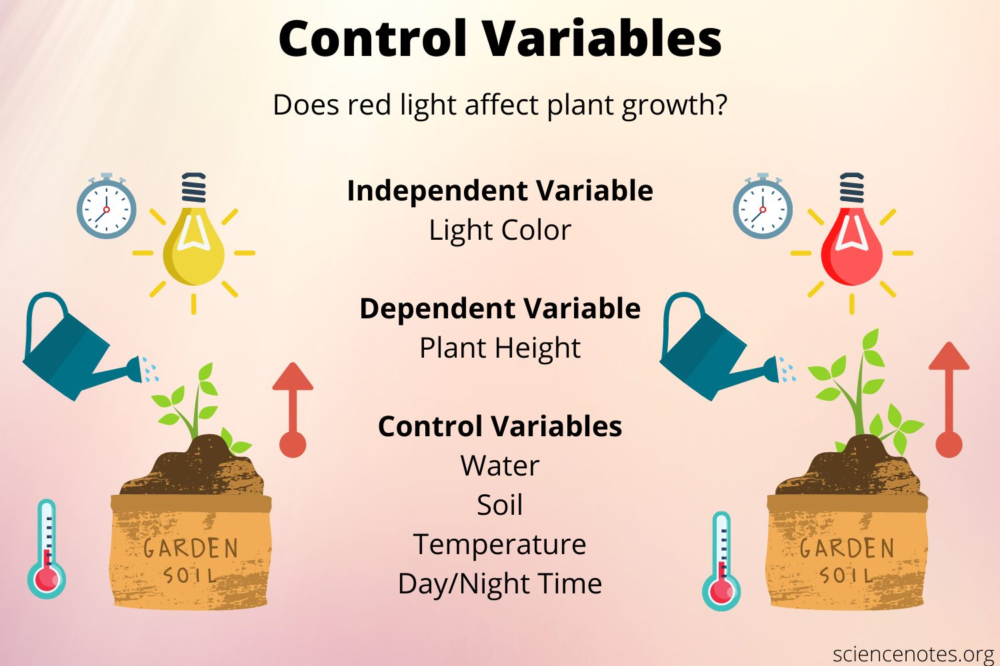

# Types of Variables in Systems

**State variables** represent the properties or conditions of a system at a particular time. They define the state of the system and are crucial in fields like control theory, optimization, physics, and system modeling.

For example:

* In **physics**, state variables might include **position, velocity, and temperature.**
* In system modeling or **optimization**, state variables can represent **inventory levels, resource allocations, or the state of a machine.**

State variables are typically determined by **state equations**, which describe how these variables evolve over time or under specific conditions.

---

## Types of Variables

### 1 State Variables

* **Define** the current state of the system.
* **Evolve** according to system dynamics.
* Examples: energy in a capacitor, velocity of a vehicle, population in a city.

### 2 **Control Variables**

* **Inputs** you can manipulate to influence the system's behavior.
* Often used in optimization problems or control systems.
* Examples: throttle position in a car, production rate in a factory.

### 3 **Decision Variables**

* Variables that you directly control in optimization problems.
* They _often_ overlap with control variables in optimization contexts.
* Examples: investment amounts, transportation routes, staffing levels.

### 4 **Algebraic Variables**

* Variables that are **not dynamic** but are **determined by algebraic relationships** between other variables.
* **Often used in combination with state variables to describe a system.**
* Examples: power output based on torque and speed in a motor. $P = T \omega$.

### 5 **Exogenous Variables**

* External inputs that **affect** the system but are **not controlled by it.**
* These can be considered "environmental" influences.
* Examples: weather conditions, market demand, ambient temperature.

### 6 **Parameters**

* Fixed quantities that define specific characteristics of the system.
* They do not change during the system’s operation but can be modified in simulations or experiments.
* Examples: spring constant in mechanics, interest rates in economics.

### 7 **Output Variables**

* Represent the measurable outputs of a system.
* Often derived from state variables or other components of the system.
* Examples: speed in a cruise control system, voltage in a circuit.

### 8 **Auxiliary Variables**

* Variables introduced to simplify complex systems or models.
* Often intermediate calculations or abstractions.
* Examples: effective resistance in an electrical network, normalized scores in a dataset.

---

### Key Relationships Between Variables

* **State vs. Control Variables:** State variables describe the "what is happening", while control variables dictate "what should change.".

<figure>

<figcaption>Example of Variables</figcaption>
</figure>

* **Decision vs. Parameters:** Decision variables are adjusted within the model, whereas parameters are constants during a simulation or optimization.

## Examples of Variables in Different Systems

### 1 Example: Simple Pendulum

* **State Variables:** Angular displacement $\theta$, angular velocity $\omega$.
* **Control Variable:** Initial angle of release $\theta_0$.
* **Output Variable:** Angular displacement over time $\theta(t)$.
* **Algebraic Variable:** Angular acceleration $\alpha = -\frac{g}{L} \sin(\theta)$.
* **Exogenous Variable:** Gravitational force $g$.
* **Parameter:** Length of the pendulum $L$.

### 2 Example: Economic Model

* **State Variables:** GDP, unemployment rate.
* **Control Variables:** Government spending, tax rates.
* **Output Variable:** GDP growth rate.
* **Exogenous Variable:** Population growth, global commodity prices (less ambiguous), inflation rate, interest rates.
* **Parameter:** Coefficients in the economic model (like the effect of tax rates on consumption or investment).

### 3 Example: Power System

* **State Variables:** Voltage $V$, frequency $f$.
* **Control Variables:** Generator setpoints $P_{gen}$, load shedding $P_{shed}$.
* **Output Variable:** Voltage at specific buses $V_{bus}$.
* **Exogenous Variable:** Weather conditions, demand patterns $P_{demand}$.
* **Parameter:** Line impedance $L$, transformer ratios $a = \frac{N_p}{N_s}$.

### 6 Example: Supply Chain

* **State Variables:** Inventory levels, order backlog.
* **Control Variables:** Production rates, shipping schedules.
* **Output Variable:** Customer satisfaction, on-time delivery.
* **Exogenous Variable:** Demand patterns, transportation delays.
* **Parameter:** Lead times, holding costs.

### 7 Example: Climate Model

* **State Variables:** Temperature, atmospheric CO2 concentration.
* **Control Variables:** Emissions rates, solar radiation management.
* **Output Variable:** Global temperature change.
* **Exogenous Variable:** Volcanic activity, ocean currents.
* **Parameter:** Climate sensitivity, albedo.

### 8 Example: Vehicle Cruise Control

* **State Variables:** Current speed, engine RPM.
* **Control Variable:** Throttle position.
* **Output Variable:** Speed displayed on the dashboard.
* **Algebraic Variable:** Engine torque based on RPM and throttle position.
* **Exogenous Variable:** Road slope, wind resistance.
* **Parameter:** Vehicle mass.

This categorization helps organize and understand how different variables interact within a system.

---

### Fluid Mechanics Problem

**Modeling the flow of water through a pipe.**

Water is pumped through a horizontal pipe with varying cross-sectional areas. We aim to describe the system using relevant variables, including state, control, exogenous, and others.

#### Problem Variables

1. **State Variables**

    * Represent the current state of the fluid at specific points in the pipe.
    * **Examples:**
        > * Pressure **$P(x,t)$**: Pressure at position $x$ along the pipe at time $t$.
        > * Velocity **$v(x,t)$**: Fluid velocity at position $x$ and time $t$.
        > * Density **$\rho(x,t)$**: Fluid density at position $x$ and time $t$.
    * These evolve over time and space according to the **Navier-Stokes equations** or similar governing equations.

2. **Control Variables**

    * **Variables you can manipulate to influence the flow behavior.**
    * **Examples:**
        >* Pump speed or power **$u(t)$**: Controls the amount of water entering the pipe.
        >* Valve opening **$\theta(t)$**: Controls the flow rate by adjusting resistance.

3. **Exogenous Variables**

    * External inputs to the system that cannot be controlled but affect it.
    * **Examples:**
        >* Inlet fluid temperature **$T_{in}(t)$**: Affects the fluid properties like viscosity.
        >* Ambient pressure **$P_{atm}$**: Influences the pressure drop along the pipe.

4. **Output Variables**

    * Variables **derived from the state** or directly measurable quantities.
    * **Examples:**
        > * Flow rate **$Q(x,t) = v(x,t) \cdot A(x)$**: Product of velocity and cross-sectional area.
        > * Outlet pressure **$P_{out}(t)$**: Pressure at the pipe's exit.

5. **Algebraic Variables**

    * **Intermediate variables computed from relationships among other variables.**
    * **Examples:**
        > * Reynolds number **$Re = \frac{\rho v D}{\mu}$**: Describes flow regime (laminar or turbulent).
        > * Head loss **$h_f = f \frac{L}{D} \frac{v^2}{2g}$**: Pressure loss due to friction.
6. **Parameters**

    * Constants that define system characteristics.
    * **Examples:**
        > * Pipe length **$L$**, pipe diameter **$D(x)$**: Define the pipe geometry.
        > * Fluid viscosity **$\mu$**: Defines the resistance to flow.
        > * Roughness coefficient **$\epsilon$**: Affects friction in turbulent flow.

#### **Equations Governing the Problem**

1. **Continuity Equation**  
    Ensures mass conservation:

    $$\frac{\partial \rho}{\partial t} + \nabla \cdot (\rho \mathbf{v}) = 0$$

2. **Momentum Equation (Navier-Stokes)**  
    Describes how momentum evolves in the flow:

    $$\rho \left( \frac{\partial \mathbf{v}}{\partial t} + (\mathbf{v} \cdot \nabla) \mathbf{v} \right) = -\nabla P + \mu \nabla^2 \mathbf{v} + \mathbf{f}$$

3. **Energy Equation** (if heat transfer is involved)  
    Relates changes in temperature or energy to fluid flow:

    $$\rho C_p \left( \frac{\partial T}{\partial t} + \mathbf{v} \cdot \nabla T \right) = k \nabla^2 T$$

#### Example Interpretation

Imagine controlling the pump speed to maintain a desired flow rate at the outlet, considering the effects of pipe geometry and ambient pressure.

* **State Variables** (e.g., $P(x,t), v(x,t)$) _evolve_ based on the **continuity** and **momentum equations**.
* **Control Variables** (e.g., pump speed $u(t)$) influence the boundary conditions (inlet pressure or flow).
* **Exogenous Variables** (e.g., $T_{\text{in}}(t)$, $P_{\text{atm}}$) provide environmental constraints but are beyond control.
* **Output Variables** (e.g., $Q(x,t), P_{\text{out}}$) are computed to monitor the system's performance.
* **Parameters** (e.g., $D, L, \mu$) define the fixed characteristics of the system.

## References

* [Control Variable](https://sciencenotes.org/what-is-a-control-variable-definition-and-examples/)
