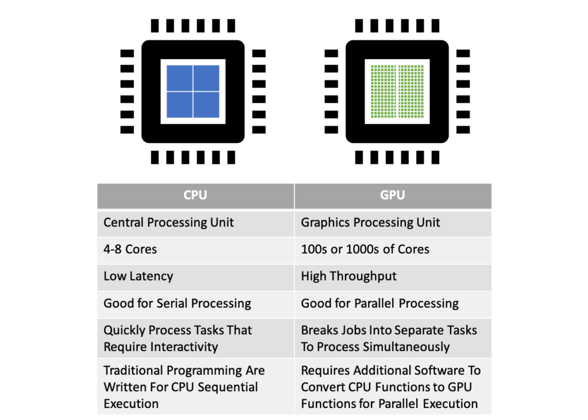
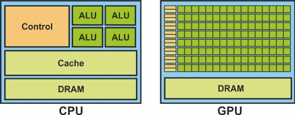
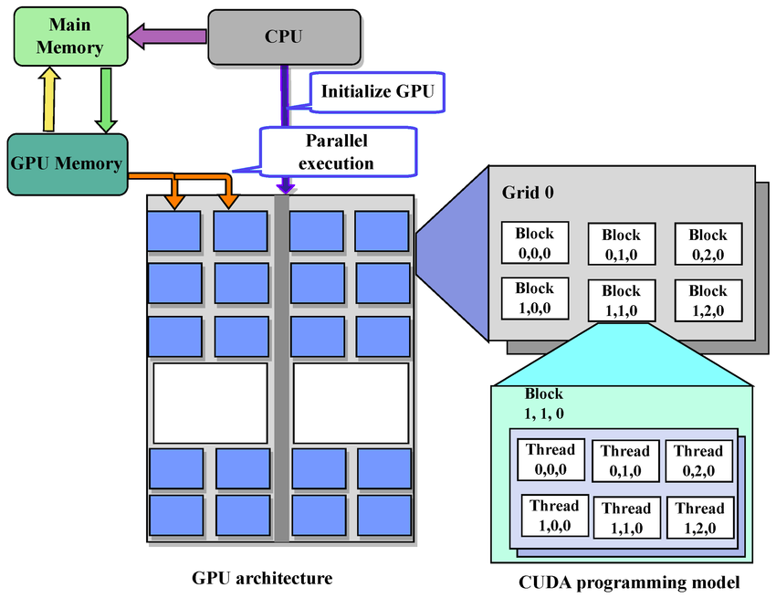
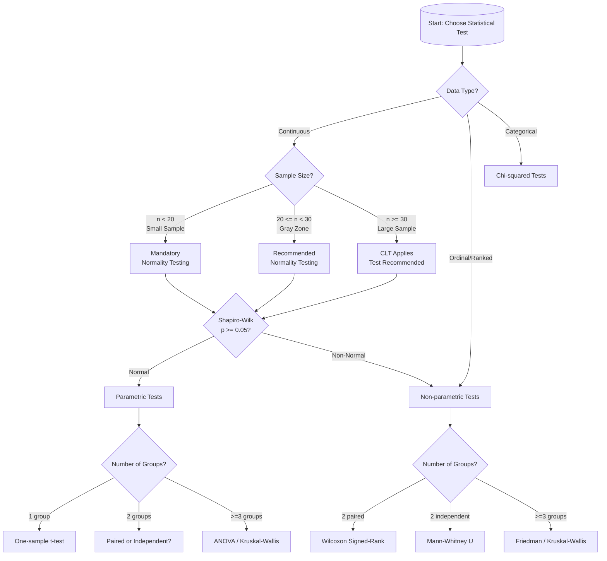

- [Capítulo 1 – Introdução {#cap1-introducao}](#capítulo-1--introdução-cap1-introducao)
  - [1.1 Contexto e motivação {#sec-11-contexto-e-motivacao}](#11-contexto-e-motivação-sec-11-contexto-e-motivacao)
  - [1.2 Problema de pesquisa {#sec-12-problema-de-pesquisa}](#12-problema-de-pesquisa-sec-12-problema-de-pesquisa)
  - [1.3 Objetivo geral {#sec-13-objetivo-geral}](#13-objetivo-geral-sec-13-objetivo-geral)
  - [1.4 Objetivos específicos {#sec-14-objetivos-especificos}](#14-objetivos-específicos-sec-14-objetivos-especificos)
  - [1.5 Justificativa {#sec-15-justificativa}](#15-justificativa-sec-15-justificativa)
- [Capítulo 2 - Revisão bibliográfica {#cap2-revisao-bibliografica}](#capítulo-2---revisão-bibliográfica-cap2-revisao-bibliografica)
  - [2. Fundamentação teórica e revisão bibliográfica {#sec-2-fundamentacao-e-revisao}](#2-fundamentação-teórica-e-revisão-bibliográfica-sec-2-fundamentacao-e-revisao)
    - [2.1 Otimização combinatória e o Problema do Caixeiro Viajante {#sec-21-otimizacao-tsp}](#21-otimização-combinatória-e-o-problema-do-caixeiro-viajante-sec-21-otimizacao-tsp)
    - [2.2 Heurísticas para o TSP {#sec-22-heuristicas-tsp}](#22-heurísticas-para-o-tsp-sec-22-heuristicas-tsp)
      - [2.2.1 Entendendo o algoritmos $2$-opt {#sec-221-2opt}](#221-entendendo-o-algoritmos-2-opt-sec-221-2opt)
    - [2.3 Algoritmos genéticos {#sec-23-algoritmos-geneticos}](#23-algoritmos-genéticos-sec-23-algoritmos-geneticos)
    - [2.4 Heurísticas híbridas {#sec-24-heuristicas-hibridas}](#24-heurísticas-híbridas-sec-24-heuristicas-hibridas)
    - [2.5 Algoritmos meméticos {#sec-25-algoritmos-memeticos}](#25-algoritmos-meméticos-sec-25-algoritmos-memeticos)
      - [2.5.1 Algoritmo Genético + $2$-opt {#sec-251-ga-2opt}](#251-algoritmo-genético--2-opt-sec-251-ga-2opt)
    - [2.6 Computação em GPU e paralelização de meta-heurísticas {#sec-26-gpu-metaheuristicas}](#26-computação-em-gpu-e-paralelização-de-meta-heurísticas-sec-26-gpu-metaheuristicas)
      - [2.6.1 Taxonomia de paralelização segundo Crainic e Toulouse {#sec-261-taxonomia-paralelizacao}](#261-taxonomia-de-paralelização-segundo-crainic-e-toulouse-sec-261-taxonomia-paralelizacao)
      - [2.6.2 Aplicações de GPU a meta-heurísticas para o TSP {#sec-262-gpu-aplicacoes-tsp}](#262-aplicações-de-gpu-a-meta-heurísticas-para-o-tsp-sec-262-gpu-aplicacoes-tsp)
      - [2.6.3 Contraste arquitetural: CPU vs GPU {#sec-263-cpu-vs-gpu}](#263-contraste-arquitetural-cpu-vs-gpu-sec-263-cpu-vs-gpu)
    - [2.7 Comparação estatística de algoritmos de otimização {#sec-27-comparacao-estatistica}](#27-comparação-estatística-de-algoritmos-de-otimização-sec-27-comparacao-estatistica)
      - [2.7.1 Comparações pareadas {#sec-271-comparacoes-pareadas}](#271-comparações-pareadas-sec-271-comparacoes-pareadas)
      - [2.7.2 Comparações múltiplas {#sec-272-comparacoes-multiplas}](#272-comparações-múltiplas-sec-272-comparacoes-multiplas)
- [Capítulo 3 – Materiais e Métodos {#cap3-materiais-metodos}](#capítulo-3--materiais-e-métodos-cap3-materiais-metodos)
  - [3.1 Ambiente computacional e framework experimental {#sec-31-ambiente-framework}](#31-ambiente-computacional-e-framework-experimental-sec-31-ambiente-framework)
    - [3.1.1 Hardware e sistema operacional](#311-hardware-e-sistema-operacional)
    - [3.1.2 Ambiente de software](#312-ambiente-de-software)
    - [3.1.3 Arquitetura do framework experimental](#313-arquitetura-do-framework-experimental)
  - [3.2 Arquitetura do framework e variantes algorítmicas {#sec-32-arquitetura-variantes}](#32-arquitetura-do-framework-e-variantes-algorítmicas-sec-32-arquitetura-variantes)
    - [3.2.1 O Algoritmo Genético Base (GA + 2-opt)](#321-o-algoritmo-genético-base-ga--2-opt)
    - [3.2.2 Estratégias de Paralelização (As 4 Variantes)](#322-estratégias-de-paralelização-as-4-variantes)
  - [3.3 Seleção de instâncias e protocolo experimental {#sec-33-selecao-instancias}](#33-seleção-de-instâncias-e-protocolo-experimental-sec-33-selecao-instancias)
  - [3.4 Protocolo de análise estatística {#sec-34-protocolo-estatistico}](#34-protocolo-de-análise-estatística-sec-34-protocolo-estatistico)

# Capítulo 1 – Introdução {#cap1-introducao}

## 1.1 Contexto e motivação {#sec-11-contexto-e-motivacao}

O Problema do Caixeiro Viajante (Traveling Salesman Problem – TSP) é um dos problemas mais estudados em otimização combinatória [@cook2012pursuit]. Tem esse nome devida a sua história clássica: um vendedor precisa visitar um conjunto de cidades, passando por cada uma exatamente uma vez, e deseja minimizar a distância total percorrida.

O objetivo é encontrar um ciclo hamiltoniano (ciclo onde deve-se passar por todos os vértices uma vez e retornar ao vértice original). Apesar de sua formulação simples, o TSP é NP-difícil (que é um problema sem solução em tempo polinomial) e, na sua formulação de decisão: "existe um tour com custo menor ou igual a $B$?", é NP-completo: não se conhece algoritmo em tempo polinomial que o resolva em geral, embora seja fácil verificar o custo de uma solução candidata. Cook [@cook2012pursuit] argumenta que essa combinação de simplicidade, dificuldade teórica e rica estrutura geométrica faz do TSP um estudo de caso central tanto para a teoria da complexidade quanto para desenvolvimento de métodos exatos e heurísticos.

Na prática, variantes do TSP aparecem em domínios como roteirização de veículos, planejamento de inspeções, manufatura e testes de circuitos, genômica e astronomia, entre outros [@cook2012pursuit]. Exemplos clássicos incluem o posicionamento e ordenamento de furos em placas de circuito impresso, logística e problemas de mapeamento genético. Mesmo quando modelos reais são mais complexos (com janelas de tempo, múltiplos veículos ou restrições de capacidade), é comum validar ideias de projeto e análise de algoritmos primeiro em instâncias clássicas do TSP, justamente pela ampla disponibilidade de referências, testes padronizados e de soluções ótimas conhecidas.

Paralelamente, a evolução do hardware trouxe processadores gráficos (GPUs) como plataforma acessível para computação de alto desempenho (HPC) [@nvidia2024cuda] e com a popularização e acessibilidade, pesquisas nestas áreas cresceram rapidamente. As IAs generativas são totalmente dependentes desse tipo de hardware, por exemplo.

GPUs oferecem milhares de núcleos relativamente simples, organizados em um modelo de execução massivamente paralelo, mais próximo do paradigma SIMD/SIMT descrito por Flynn e extensões modernas [@flynn1972taxonomy]. Em troca de um controle mais restrito nos fluxos de processo e memória, essas arquiteturas entregam uma grande largura de banda de memória (comunicação entre CPUs e GPUs) e uma grande taxa de operações aritméticas por segundo (FLOPs), desde que o problema ofereça operações semelhantes que possam ser executadas em paralelo, sejam elas utilizando paralelismos funcionais (mais complexos) e paralelismos de dados (mais simples). Isso torna GPUs particularmente atrativas para tarefas como o cálculo de matrizes (ganho exponencial, como demonstrado nesse trabalho), a avaliação de grandes populações de soluções e a aplicação de movimentos de vizinhança independentes em heurísticas de melhoria.

Do ponto de vista das meta-heurísticas, Crainic e Toulouse propõem uma taxonomia de paralelização que distingue, em linhas gerais, paralelismo em dados, paralelismo funcional e esquemas com múltiplas trajetórias cooperativas [@crainic2003parallel; @crainic2010parallel]. De forma simplificada, pode-se falar em três tipos:

1. paralelismo *dados* (por exemplo, várias soluções de uma população sendo avaliadas em paralelo);
2. paralelismo em *tarefas* dentro de uma mesma trajetória de busca (por exemplo, vizinhanças sendo exploradas em paralelo para uma solução corrente);  
3. paralelismo que mantêm várias trajetórias completas de busca (estratégias de início simultâneo, modelos em ilhas, busca cooperativa).

O projeto desta monografia explora principalmente  algoritmos do tipo 1, ao explorar paralelismo em dados em vizinhanças de $2$-opt e na avaliação de populações em algoritmos genéticos, em linha com estudos recentes sobre heurísticas para TSP em GPU [@schulz2013gpu; @tsp_gpu; @fujimoto2011highly].

Ainda assim, nem todo algoritmo se beneficia automaticamente de uma migração para GPU. Inicializações de kernels, movimentação de dados entre CPU e GPU podem anular ganhos de paralelismo, especialmente em problemas de porte pequeno ou em implementações que realizam pouco trabalho por inicializações de kernel [@van2013gpu; @luong2013gpu]. Limitações de memória (VRAM) devem ser cuidadosamente calculadas para que a memória total ocupada não passe do limite do hardware. Nesses cenários, uma comparação direta entre versões em CPU e GPU exige cuidado extra: deve-se isolar o impacto da plataforma de execução sem confundir o efeito com mudanças na lógica do algoritmo. Ao longo deste trabalho, esses desafios são documentados explicitamente em estudos de caso, onde kernels são chamados de forma não cautelosa e versões otimizadas (Capítulos 3 e 4), bem como em notas técnicas específicas sobre *overhead* de lançamentos de kernel e padrões de redução em GPU.

Este trabalho insere-se nesse contexto, investigando como acelerar, utilizando GPU, um Algoritmo Genético (Genetic Algorithm – GA) híbrido com $2$-opt para o TSP, de forma controlada e estatisticamente fundamentada, usando instâncias clássicas da biblioteca TSPLIB [@reinelt1991tsplib] e um protocolo experimental com um número adequado de repetições $n_{reps}$ e testes estatísticos apropriados (detalhado no [Capítulo 3]). A combinação entre GA e busca local é um exemplo de algoritmo memético amplamente estudado na literatura [@larranaga1999genetic; @goldberg1989genetic], em que operadores evolutivos globais são complementados por heurísticas de melhoria como $2$-opt [@croes1958method] ou Lin–Kernighan [@lin1973efficient]. Neste Trabalho de Conclusão de Curso, usarei a nomenclatura em inglês para alguns termos técnicos como "$2$-opt", "TSPLIB", "GPU", "CPU" e "GA".

## 1.2 Problema de pesquisa {#sec-12-problema-de-pesquisa}

Muitos estudos em computação de alto desempenho comparam algoritmos em CPU e GPU utilizando implementações que diferem não apenas na plataforma de execução, mas também em detalhes relevantes da lógica do algoritmo (por exemplo, operadores distintos, parâmetros diferentes ou vizinhanças não equivalentes) [@schulz2013gpu; @van2013gpu; @benaini2018genetic]. Isso torna difícil atribuir ganhos de desempenho exclusivamente ao uso da GPU, uma vez que alterações no desenho algorítmico ou na parametrização podem, por si só, explicar diferenças observadas. Neste trabalho, os parâmetros e operadores são mantidos fixos entre as variantes, e as diferenças de desempenho observadas são discutidas à luz do protocolo experimental apresentado no [Capítulo 3].

Neste trabalho, busquei implementar as variantes do algoritmo sob as mesmas condições. A estrutura dos algoritmos é projetada para ser idêntica e otimizada tanto para CPU quanto para GPU, de forma justa, para todos os Algoritmos Genéticos e para o algoritmo de busca local $2$-opt, variando apenas a forma como cada "módulo" estrutural do algoritmo é executado (em CPU ou em GPU) e o grau de paralelismo utilizado. A pergunta central pode ser formulada da seguinte forma:

> **Como comparar, de forma fiel, o impacto de diferentes estratégias de paralelização utilizando GPU no desempenho de um algoritmo memético (GA+$2$-opt) para o Problema do Caixeiro Viajante?**

Responder a essa pergunta exige, ao mesmo tempo, um desenho experimental cuidadoso de hiperparâmetros e validade estatística (número significativo de instâncias, número adequado de repetições, métricas de qualidade e tempo). Os parâmetros básicos do GA — como tamanho de população $n_{pop}$, taxa de mutação $p_{\text{mut}}$, tamanho do torneio $k_{\text{trnmt}}$, número de iterações de $2$-opt por indivíduo $n_{2\text{-opt}}$ e número de repetições por combinação algoritmo–instância $n_{reps}$ — são escolhidos com base em recomendações da literatura de algoritmos evolutivos [@eiben2015introduction; @goldberg1989genetic] e em análises específicas documentadas nos relatórios técnicos do projeto. Esses valores e sua motivação são apresentados em detalhe no [Capítulo 3].

## 1.3 Objetivo geral {#sec-13-objetivo-geral}

O objetivo geral deste trabalho é investigar e quantificar o impacto de diferentes estratégias de paralelização em processadores gráficos, com foco em:

- **Tempo de execução**: medir e comparar o tempo requerido para cada variante do algoritmo memético GA+$2$-opt;
- **Qualidade das soluções**: avaliar o custo final das rotas obtidas e o *gap* relativo ao ótimo conhecido, validando a viabilidade da solução;
- **Manutenção de equivalência funcional**: garantir que as quatro variantes (GA-CPU, GA-Híbrido-Ingênuo, GA-Híbrido-Otimizado, GA-FullGPU) implementem exatamente a mesma lógica algorítmica, diferindo apenas na plataforma de execução e no grau de paralelismo;
- **Metodologia estatística padronizada**: aplicar testes de hipótese apropriados (testes de normalidade, pareados e rankings) conforme recomendações da literatura proposta por Demšar [@demsar2006statistical];
- **Alinhamento com taxonomia de paralelização**: situar as estratégias adotadas no contexto da taxonomia proposta por Crainic e Toulouse [@crainic2003parallel; @crainic2010parallel].

## 1.4 Objetivos específicos {#sec-14-objetivos-especificos}

Para viabilizar o objetivo geral, definem-se os seguintes objetivos específicos:

1. **Implementar quatro variações "isoalgorítmicas"[^isoalgorithm-disambiguation] de um Algoritmo Genético híbrido com $2$-opt para o TSP, que diferem apenas na forma e no local de execução (CPU ou GPU):
   [^isoalgorithm-disambiguation]: O termo isoalgorítmico será utilizada neste trabalho para refletir variantes estruturalmente similares em sua composição.
   - uma versão executada puramente na CPU (**GA-CPU**), em que todas as operações (seleção, cruzamento, mutação, $2$-opt e cálculo de custo) são executadas com NumPy, servindo como base em CPU para as comparações. Na prática, essa versão é utilizada como base principalmente para instâncias de menor porte (por exemplo, com $n_{coords} \leq 100$); para instâncias maiores, a comparação de tempo passa a considerar como referência a versão híbrida, conforme discutido no Capítulo 3.
   - uma versão híbrida com $2$-opt executada na GPU e avaliação em CPU (**GA-Híbrido-Ingênuo[^ingenuity-disambiguation]**), que inicia kernels **individualmente** para cada rota e transfere as soluções (ou circuitos) completos entre CPU e GPU a cada iteração;
   - uma versão híbrida otimizada (**GA-Híbrido-Otimizado**), em que $2$-opt e o cálculo de custos são executados em GPU em lote (*batch*), reduzindo o número de lançamentos de kernel e o volume de dados transferidos;
   - uma versão totalmente em GPU (**GA-FullGPU**), na qual população, operadores genéticos, busca local e avaliação permanecem residentes na GPU durante toda a evolução.

   Os nomes utilizados aqui seguem as implementações `GeneticAlgorithmCPU`, `GeneticAlgorithmHybridNaive`, `GeneticAlgorithmHybridOptimized` e `GeneticAlgorithmFullGPU` do framework experimental, cujos detalhes arquiteturais são apresentados no [Capítulo 3].
   [^ingenuity-disambiguation]: Na literatura, o termo "naive" (ingênuo) é frequentemente utilizado para descrever implementações simples que não exploram otimizações avançadas.

2. **Selecionar um conjunto de instâncias da TSPLIB** com diferentes faixas de tamanho (pequenas $n_{coords} \leq 100$, médias $100 < n_{coords} \leq 400$ e grandes $n_{coords} > 400$), de forma a demonstrar os ganhos de desempenho que podem ser atingidos e garantir diversidade suficiente para analisar ganhos em escala, adotando uma divisão de faixas inspirada em estudos prévios com a TSPLIB [@reinelt1991tsplib], mas levemente ajustada para refletir o foco deste trabalho nas instâncias pequenas, médias e grandes selecionadas. O ajuste consiste em adotar explicitamente o número de coordnadas $n_{coords} = 100$ e $n_{coords} = 400$ como limites entre as faixas, em linha com o limiar prático utilizado para a comparação CPU/GPU e com a distribuição de tamanhos das instâncias efetivamente utilizadas nos experimentos.

3. **Definir um protocolo experimental reprodutível**, incluindo número de repetições por instância e algoritmo, critérios de parada, parâmetros do GA e limites práticos impostos pela capacidade de memória da GPU. O desenho desse protocolo segue recomendações da literatura de comparação de algoritmos e de testes estatísticos [@demsar2006statistical] e é detalhado no [Capítulo 3].

4. **Aplicar um conjunto de testes estatísticos apropriados** para comparação de algoritmos, incluindo testes de normalidade (Shapiro–Wilk), testes pareados paramétricos (teste *t-pareado*) e não paramétricos (Wilcoxon), análise de rankings em múltiplas instâncias (teste de Friedman com pós-teste de Nemenyi) e medidas de tamanho de efeito (Cohen *d*), conforme recomendações em @demsar2006statistical e literatura correlata de teste de hipóteses. A metodologia estatística completa é apresentada no [Capítulo 3].

5. **Analisar os resultados obtidos**, discutindo as possíveis condições em que cada variante algorítmica é vantajosa — como por exemplo, tamanho da instância $n_{coords}$, relação entre custos de comunicação e custo computacional, acesso à memória e volume de dados transferidos entre CPU e GPU nas direções host-to-device (H2D ou CPU->GPU) e device-to-host (D2H GPU->CPU) [@nvidia2024cuda] —, limites práticos do uso de GPUs para o contexto de recursos limitados (paralelismo em uma placa gráfica já defasada e limitada) e as implicações para o projeto de algoritmos de roteamento em cenários reais, seguindo as taxonomias de paralelização de meta-heurísticas propostas por Crainic & Toulouse [@crainic2003parallel; @alba2005parallel] e de estudos de caso em problemas de roteamento utilizando GPUs [@schulz2013gpu; @tsp_gpu; @fujimoto2011highly].

## 1.5 Justificativa {#sec-15-justificativa}

Do ponto de vista científico, o TSP continua sendo um problema de referência para avaliar novas ideias em heurísticas e meta-heurísticas [@cook2012pursuit]. A vasta disponibilidade de estudos, instâncias utilizadas em larga escala e muitas soluções ótimas conhecidas, em particular as fornecidas pela TSPLIB [@reinelt1991tsplib], na qual o projeto se baseia, permite medir o desempenho de diferentes algoritmos tanto em termos de qualidade quanto em tempo de execução. Ao longo deste trabalho, será utilizada a notação $n_{coords}$ para o número de coordenadas (cidades) de cada instância, $n_{pop}$ para o tamanho da população do GA, $n_{reps}$ para o número de repetições por combinação algoritmo–instância, $T$ para tempos de execução médios e $B_{\mathrm{H2D}}$, $B_{\mathrm{D2H}}$ para os volumes totais de dados transferidos entre CPU e GPU nas direções host-to-device e device-to-host, respectivamente. Os detalhes de como esses elementos se relacionam com os limites de memória de cada variante são discutidos no [Capítulo 3].
<!-- TODO (Capítulo 3): adicionar cálculos e explicação para controle de memória de cada algoritmo. -->

No campo da computação de alto desempenho, diferentes trabalhos relatam ganhos relevantes ao portar heurísticas de melhoria e algoritmos evolutivos para GPU, inclusive em variantes do TSP [@schulz2013gpu; @tsp_gpu; @fujimoto2011highly]. Esses resultados indicam que GPUs são um hardware promissor para esse tipo de algoritmo, mas também evidenciam um problema recorrente: em muitas comparações, as versões em CPU e GPU diferem não apenas na plataforma de execução, mas também em detalhes de implementação e parametrização, o que dificulta isolar o efeito específico da paralelização.

Além disso, para que conclusões sobre desempenho sejam confiáveis, não basta observar poucos experimentos isolados. É necessário adotar um desenho experimental com múltiplas repetições, tanto para instâncias quanto para, medidas de dispersão e testes de hipótese adequados, como discutido na literatura de comparação de algoritmos [@demsar2006statistical]. Neste trabalho, esses cuidados são incorporados ao experimento, de modo que as diferenças observadas entre variantes em CPU e GPU possam ser atribuídas, com maior segurança, às estratégias de paralelização avaliadas.

Este trabalho justifica-se por combinar três elementos que, em conjunto, fortalecem a contribuição científica:

1. **Implementação de heurísticas clássicas em GPU** (particularmente $2$-opt e operadores do AG), explorando o paralelismo de forma explícita.
2. **Comparação entre variantes funcionalmente equivalentes do algoritmo em CPU e GPU**, mantendo fixos operadores, parâmetros e critérios de parada, de modo a isolar o efeito da plataforma de execução. [^small-variations]
   [^small-variations]: Algumas variações dentro deste contexto são esperadas, mas de modo geral, o algoritmos segue a mesma estrutura. Sempre há a possibilidade de haver pequenas variações, mas o autor busca manter, ao máximo, a consistência entre as variantes.
3. **Aplicação de metodologia estatística rigorosa**, com múltiplas repetições por instância, testes de hipótese adequados e medidas de tamanho de efeito.

Os capítulos seguintes discutem em que condições cada variante é vantajosa, quais os limites práticos do uso de GPUs e recursos limitados e como os resultados dialogam com estudos prévios de heurísticas em GPU.

> [!note] ainda verei se usarei ou não essa nota
>
> ## 1.6 Organização do trabalho
>
> Este texto está organizado da seguinte forma:
>
> - **Capítulo 2 – Fundamentação Teórica / Revisão Bibliográfica**: apresenta os conceitos básicos de otimização combinatória e do TSP, revisa heurísticas de construção e melhoria (com ênfase em $2$-opt), discute algoritmos genéticos e meta-heurísticas híbridas, introduz princípios de computação em GPU e paralelização de meta-heurísticas, e resume abordagens estatísticas para comparação de algoritmos.
> - **Capítulo 3 – Materiais e Métodos**: descreve o ambiente computacional, a arquitetura do framework desenvolvido (incluindo abstrações de backend e estratégias isoalgorítmicas), os detalhes do Algoritmo Genético híbrido com $2$-opt nas quatro variantes consideradas, o conjunto de instâncias TSPLIB utilizado, os parâmetros experimentais e o protocolo estatístico adotado.
> - **Capítulo 4 – Resultados**: apresenta os resultados numéricos dos experimentos, incluindo estatísticas por instância, análises agregadas por faixa de tamanho, medidas de speedup e qualidade das soluções, além da interpretação dos testes estatísticos aplicados.
> - **Capítulo 5 – Discussão**: interpreta criticamente os resultados à luz da literatura, discute as implicações dos achados para o projeto de algoritmos de roteamento em GPU e analisa limitações do estudo.
> - **Capítulo 6 – Conclusões e Trabalhos Futuros**: sintetiza as principais contribuições do trabalho, responde explicitamente aos objetivos propostos e indica possíveis extensões, como a aplicação do framework a problemas de roteirização mais complexos.
> - Elementos pós-textuais, como referências, glossário, apêndices técnicos e anexos com tabelas completas de resultados, são apresentados ao final do documento, conforme normas da instituição.

# Capítulo 2 - Revisão bibliográfica {#cap2-revisao-bibliografica}

## 2. Fundamentação teórica e revisão bibliográfica {#sec-2-fundamentacao-e-revisao}

Este capítulo apresenta conceitos teóricos e a bibliografia utilizada para contextualizar o problema estudado e as escolhas metodológicas adotadas. São discutidos o Problema do Caixeiro Viajante (TSP) no contexto da otimização combinatória [@cook2012pursuit; @rosenkrantz1977analysis], sua importância geral e exemplos de utilização. Também são apresentadas generalizações do problema e sua relação com problemas de roteamento de veículos e variantes correlatas [@raff1983routing; @bodin1981state; @tan2021vehicle], heurísticas e meta-heurísticas clássicas para o TSP [@croes1958method; @lin1973efficient; @voudouris1999tsp], aprofundando-se então no tópico de algoritmos genéticos e algoritmos meméticos [@larranaga1999genetic; @goldberg1989genetic], princípios de computação em GPU [@nvidia2024cuda; @schulz2013gpu; @tsp_gpu], taxonomias de paralelização de meta-heurísticas [@crainic2003parallel; @crainic2010parallel; @alba2005parallel] e de comparação estatística de algoritmos de otimização [@demsar2006statistical].

### 2.1 Otimização combinatória e o Problema do Caixeiro Viajante {#sec-21-otimizacao-tsp}

O TSP pode ser formulado, na versão simétrica[^ATSP], como um problema de encontrar um ciclo hamiltoniano de custo mínimo — podendo este ser a distância percorrida, combustível gasto, ou mesmo uma combinação de fatores. Para fins deste trabalho, o custo será também chamado de distância — em um grafo completo não direcionado $G = (V, E)$, no qual cada vértice em $V$ representa uma cidade e cada aresta $(i, j) \in E$ possui um custo $c_{ij} \geq 0$ entre as cidades $i$ e $j$ [@cook2012pursuit]. O objetivo é determinar uma combinação das cidades que minimize a soma total dos custos, retornando à cidade de origem. Geralmente em aplicações práticas assume-se que a matriz de custos é métrica e euclidiana, isto é, os custos derivam de distâncias euclidianas entre coordenadas no plano.

[^ATSP]: Na versão assimétrica do TSP, os custos de viagem entre pares de cidades podem diferir dependendo da direção (ou seja, $c_{ij} \neq c_{ji}$). Em TSPs simétricos, o custo do cálculo de distâncias pode ser representado por uma matriz triangular que armazena apenas uma das metades (superior ou inferior) sem a diagonal, o que reduz o número de entradas únicas de $n^2$ para $n(n-1)/2$.

Do ponto de vista da complexidade, o TSP é um problema NP-difícil em sua forma de otimização e NP-completo em sua forma de decisão [@cook2012pursuit]. Isso significa que, em geral, não se conhece um algoritmo em tempo polinomial que resolva instâncias arbitrárias em grande escala. Mesmo que seja relativamente fácil verificar o custo de uma ou várias soluções candidatas, não podemos afirmar que esta é solução a exata em tempo polinomial. Algoritmos modernos como `Held-Karp` [@held1962dynamic] com uma complexidade temporal $O(n^2 2^n)$ e o algoritmo `Concorde` [@cook2012pursuit] com uma complexidade temporal indefinida, conseguem resolver instâncias com milhares de cidades [^held-karp], mas seu tempo de execução cresce exponencialmente (ainda melhor que a força bruta (n-1)) com o tamanho do problema, tornando-os impraticáveis para instâncias muito grandes.

[^held-karp]: O algoritmo Held-Karp "troca" a complexidade temporal da força bruta $O(n!)$ por uma complexidade espacial $O(n 2^n)$, tornando sua viabilidade limitada a $\sim{40}$ problemas. Já o algoritmo Concorde, baseado em técnicas de ramificação e corte, é capaz de resolver instâncias com até 85.900 cidades, mas seu desempenho depende fortemente da estrutura específica da instância [@cook2012pursuit].

Ao longo das últimas décadas, o TSP consolidou-se também como um padrão de avaliação empírica de algoritmos, graças à disponibilidade de coleções de instâncias padronizadas, como a TSPLIB [@reinelt1991tsplib]. Essas coleções incluem instâncias com diferentes tamanhos, estruturas e origens (geográficas, sintéticas, industriais), a maioria delas com soluções ótimas conhecidas e obtidas por métodos exatos. No presente trabalho, são utilizadas algumas dessas instâncias como base para avaliar e comparar heurísticas e variantes paralelas de um algoritmo memético (combinações de algoritmos evolutivos com busca local) [@larranaga1999genetic; @fujimoto2011highly].

### 2.2 Heurísticas para o TSP {#sec-22-heuristicas-tsp}

Devido à dificuldade de resolver instâncias grandes do TSP exatamente, uma vasta literatura de heurísticas tem sido desenvolvida para produzir boas soluções em tempos de computação aceitáveis [@cook2012pursuit]. De forma geral, heurísticas podem ser agrupadas em dois grandes tipos: heurísticas de construção e heurísticas de melhoria.

Heurísticas de construção produzem uma solução viável “do zero”, frequentemente seguindo regras simples, também algoritmos gulosos, como escolher iterativamente o vizinho mais próximo ou inserir cidades em posições que causem o menor aumento de custo. Exemplos incluem a heurística do vizinho mais próximo (nearest neighbor — NN), heurísticas de inserção (insertion heuristics) e variantes baseadas em árvores de extensão mínimas (Minimum Spanning Trees — MSTs), como o Algoritmo de Christofides. Embora rápidas e fáceis de implementar, essas estratégias tendem a gerar soluções de qualidade moderada, servindo sobretudo como ponto de partida para métodos mais sofisticados. Resultados clássicos da literatura mostram que, em instâncias métricas, heurísticas baseadas em MST e em Christofides podem oferecer garantias de aproximação sobre o custo ótimo de $\frac{3}{2}B^*$, aspecto discutido em textos de referência em logística e roteamento [@simchi2005logic].

Heurísticas de melhoria partem de uma solução inicial e aplicam sucessivos movimentos locais que procuram reduzir seu custo. Entre essas, as chamadas $k$-opt são particularmente influentes: um movimento $2$-opt consiste em remover duas arestas de um circuito e reconectar os segmentos resultantes, escolhendo a reconexão que produz um circuito ainda viável e de menor comprimento [@croes1958method]. Em instâncias euclidianas é comum interpretar o $2$-opt como um mecanismo para eliminar cruzamentos, mas, genericamente, ele também pode melhorar circuitos que não apresentam interseções evidentes, ao substituir pares de arestas por combinações de menor custo [@croes1958method]. Movimentos $3$-opt e extensões mais complexas, como o algoritmo de Lin–Kernighan, generalizam essa ideia [@lin1973efficient]. Estas e outras heurísticas de melhoria desempenham papel central em muitos algoritmos modernos para TSP, tanto como procedimentos isolados quanto como componentes de meta-heurísticas, sendo utilizadas como procedimentos de busca local.

Neste trabalho, a heurística $2$-opt é utilizada como busca local básica acoplada ao Algoritmo Genético, em linha com estudos que combinam heurísticas de construção simples com procedimentos de melhoria mais complexas para obter soluções de alta qualidade em tempo razoável [@voudouris1999tsp; @larranaga1999genetic; @fujimoto2011highly].

#### 2.2.1 Entendendo o algoritmos $2$-opt {#sec-221-2opt}

A formulação básica de um movimento $2$-opt pode ser descrita da seguinte forma [@croes1958method]: dado um circuito $C = (v_0, v_1, \dots, v_{n-1}, v_0)$ e dois índices $i$ e $j$ tais que $0 \leq i < j < n-1$, considera-se a remoção das arestas $(v_i, v_{i+1})$ e $(v_j, v_{j+1})$ e a inserção das arestas $(v_i, v_j)$ e $(v_{i+1}, v_{j+1})$. A variação de custo associada ao movimento é dada por

$$
\Delta C = \bigl(c_{i,j} + c_{i+1,j+1}\bigr)
          - \bigl(c_{i,i+1} + c_{j,j+1}\bigr),
$$

onde $c_{i,j}$ denota o custo (ou distância) entre as cidades $i$ e $j$. Um movimento $2$-opt é aceitável quando $\Delta C < 0$, isto é, quando a substituição das arestas reduz o comprimento total do circuito [@croes1958method].

Em implementações práticas, percorrem-se pares de índices $(i,j)$ em alguma ordem predefinida até que nenhum movimento que gere um custo menor seja encontrado ou até que um **limite máximo de iterações** seja atingido. O conceito de "iteração" no contexto de $2$-opt refere-se a uma passagem completa sobre a vizinhança do circuito: em cada iteração, examina-se um conjunto de pares $(i,j)$ e aplicam-se todos os movimentos que reduzem o custo.

Quando determinamos "$\Kappa=10$ iterações em $2$-opt", significa que o algoritmo realizará até 10 dessas passagens completas, parando antes se não houver mais melhorias possíveis. Sem um limite máximo, o algoritmo continuaria até atingir um ótimo local — o que pode ser custoso computacionalmente em circuitos grandes [@lin1973efficient]. No contexto de algoritmos meméticos ([Seção 2.5](#25-algoritmos-meméticos-sec-25-algoritmos-memeticos)), o número de iterações de $2$-opt por indivíduo é um parâmetro crucial que equilibra intensidade da busca local com custo computacional: muitas iterações podem refinar excessivamente cada solução — o alto custo computacional despendido segue a lei dos rendimentos decrescentes —, enquanto poucas podem deixar melhorias óbvias sem explorar.

De forma mais detalhada, o algoritmo $2$-opt clássico pode ser descrito como um procedimento iterativo de busca local aplicada a um único circuito. Em linhas gerais, o algoritmo segue os passos:

1. Começar com um circuito viável inicial $C$ (obtido por uma heurística de construção qualquer).
2. Definir uma ordem de varredura para pares de índices $(i,j)$ com $0 \leq i < j < n-1$. No presente trabalho, utiliza-se a ordem lexicográfica padrão, em que para cada $i$, varia-se $j = i+2$ até $n-1$ (a restrição $j \geq i+2$ evita movimentos triviais[^trivial] e garante que o segmento a ser revertido tenha comprimento mínimo [@croes1958method]).
   [^trivial]: Movimentos triviais são aqueles que não alteram efetivamente o circuito, como tentar reverter um seguimento de $i$ a $i+1$, pois $c_{i, i+1}=c_{i+1, i}$ é uma aresta única e sua reversão não muda o circuito, no caso do TSP clássico explorado nest documento. O mesmo não se aplica para o ATSP.
3. Para cada par $(i,j)$, calcular $\Delta C$ conforme a expressão acima.
4. Se $\Delta C < 0$, aplicar o movimento $2$-opt correspondente, o que equivale a reverter o segmento $(v_{i+1}, \dots, v_j)$ do circuito, obtendo um novo circuito $C'$, e marcar que houve melhora.
5. Repetir o processo de varredura enquanto forem encontrados movimentos com $\Delta C < 0$ (isto é, até atingir um ótimo local em relação à vizinhança $2$-opt) ou até que um número máximo de iterações seja alcançado.

Em uma implementação ingênua, a vizinhança $2$-opt de um circuito com $n$ cidades possui ordem $O(n^2)$ movimentos possíveis, o que implica um custo potencialmente elevado quando todos os pares $(i,j)$ são examinados de forma exaustiva. Diversas otimizações são discutidas na literatura, como o uso de listas de vizinhança, estruturas de dados para poda de movimentos claramente não promissores e estratégias de parada antecipada [@lin1973efficient; @larranaga1999genetic]. No contexto desta monografia, o foco recai principalmente na forma como esse procedimento é paralelizado e acoplado ao Algoritmo Genético, mais do que em otimizações finas da vizinhança em CPU.

A @fig:2opt-flowchart ilustra a lógica do algoritmo $2$-opt clássico: o laço externo continua enquanto houver melhorias e o número de iterações não exceder o limite. Em cada iteração, todos os pares $(i,j)$ são examinados; movimentos com $\Delta C < 0$ são aplicados imediatamente, revertendo o segmento do circuito.

```{.mermaid #fig:2opt-flowchart}
flowchart TD
    Start(["Início: Circuito C"]) --> Init["Iteração ← 0<br/>melhorou ← verdadeiro"]
    Init --> CheckIter{"iteração < max<br/>E melhorou?"}
    CheckIter -->|Não| End(["Fim: Retorna C"])
    CheckIter -->|Sim| ResetFlag["melhorou ← falso<br/>iteração ← iteração + 1"]
    ResetFlag --> LoopI["Para i = 0 até n-3"]
    LoopI --> LoopJ["Para j = i+2 até n-1"]
    LoopJ --> CalcDelta["Calcular ΔC = (c_ij + c_i+1,j+1)<br/>- (c_i,i+1 + c_j,j+1)"]
    CalcDelta --> CheckDelta{"ΔC < 0?"}
    CheckDelta -->|Sim| Apply["Reverter segmento (i+1..j)<br/>melhorou ← verdadeiro"]
    CheckDelta -->|Não| NextJ
    Apply --> NextJ["Próximo j"]
    NextJ -->|Mais j| LoopJ
    NextJ -->|Fim j| NextI["Próximo i"]
    NextI -->|Mais i| LoopI
    NextI -->|Fim i| CheckIter

```


```algorithm
Input: Initial tour C, max_iterations
Output: Optimized tour C

iteration = 0
improved = true

while improved and iteration < max_iterations do
    improved = false
    iteration = iteration + 1
    
    for i = 0 to n-3 do
        for j = i+2 to n-1 do
            delta = dist(i, j) + dist(i+1, j+1) - (dist(i, i+1) + dist(j, j+1))
            
            if delta < 0 then
                Reverse segment C[i+1...j]
                improved = true
            end if
        end for
    end for
end while

return C
```
### 2.3 Algoritmos genéticos {#sec-23-algoritmos-geneticos}

Algoritmos Genéticos (Genetic Algorithms – GAs) são meta-heurísticas inspiradas em princípios de evolução biológica, nas quais uma população de soluções candidatas é iterativamente modificada por operadores análogos à seleção natural, recombinação e mutação [@goldberg1989genetic; @eiben2015introduction]. Na sua forma mais simples, um AG mantém uma população de indivíduos representando soluções para o problema; em cada geração, indivíduos são selecionados com base em uma função de aptidão (fitness), recombinados por operadores de cruzamento e perturbados por operadores de mutação. A nova população resultante substitui total ou parcialmente a anterior, e o processo se repete até que um critério de parada seja satisfeito.

No contexto do TSP, é comum representar cada solução como uma permutação das cidades, utilizar operadores de cruzamento especializados para rotas — como Order Crossover (OX), Partially Mapped Crossover (PMX), entre outros — e empregar mutações que preservem a viabilidade da permutação, como trocas de posição entre duas cidades [@larranaga1999genetic]. Estudos clássicos mostram que GAs podem produzir soluções competitivas para o TSP quando combinados com operadores e parâmetros adequados [@goldberg1989genetic].

Do ponto de vista formal, um GA opera sobre uma população $P(t) = \{x_1^{(t)}, x_2^{(t)}, \dots, x_{n_{pop}}^{(t)}\}$ de indivíduos (soluções candidatas) na geração $t$. Cada indivíduo $x_i$ possui um valor de aptidão (*fitness*) $f(x_i)$ que mede a qualidade da solução; no caso do TSP, $f(x_i)$ corresponde ao custo do circuito representado por $x_i$, e busca-se minimizar esse valor. A cada geração, o GA aplica três operadores principais [@goldberg1989genetic; @eiben2015introduction]:

1. **Seleção**: escolhe indivíduos de $P(t)$ com probabilidade proporcional (ou baseada em ranking/torneio) à sua aptidão, favorecendo soluções de melhor qualidade. Formalmente, a probabilidade de selecionar $x_i$ pode ser dada por $p_i = f(x_i) / \sum_{j=1}^{n_{pop}} f(x_j)$ (seleção proporcional) ou por esquemas de torneio, nos quais um subconjunto aleatório de indivíduos compete e o melhor é escolhido.

2. **Cruzamento (recombinação)**: combina pares de indivíduos selecionados ("pais") para produzir descendentes. No TSP, operadores como OX e PMX preservam a viabilidade das permutações, herdando subsequências de um dos pais e preenchendo as posições restantes com a ordem do outro [@larranaga1999genetic]. A taxa de cruzamento $p_c$ controla a fração de pares submetidos a esse operador.

3. **Mutação**: introduz pequenas perturbações aleatórias em indivíduos, mantendo diversidade na população. No TSP, mutações típicas incluem troca de duas cidades ou reversão de segmentos. A taxa de mutação $p_{\text{mut}}$ controla a probabilidade de cada indivíduo sofrer mutação.

Após aplicar esses operadores, forma-se a nova população $P(t+1)$ por meio de um esquema de substituição (geracional, com elitismo, steady-state, etc.). O processo se repete até que um critério de parada seja satisfeito (número máximo de gerações, convergência, custo-alvo, etc.). A @fig:ga-flowchart ilustra o fluxo geral de um GA [@goldberg1989genetic; @eiben2015introduction]: a população evolui iterativamente por meio de seleção (escolha de pais com base em aptidão), cruzamento (combinação de pares de pais gerando descendentes), e mutação (perturbações para diversidade), até que um critério de parada seja atingido.

```pseudocode
BEGIN AGA
   Make initial population at random.
   WHILE NOT stop DO
      BEGIN
         Select parents from the population.
         Produce children from the selected parents.
         Mutate the individuals.
         Extend the population adding the children to it.
         Reduce the extend population.
      END
   Output the best individual found.
END AGA
```

```{.mermaid #fig:ga-flowchart}
flowchart TD
    Start(["Início"]) --> InitPop["Gerar população inicial P(0)<br/>aleatória ou heurística"]
    InitPop --> Eval0["Avaliar aptidão f(x_i)<br/>para cada indivíduo"]
    Eval0 --> SetT["t ← 0"]
    SetT --> CheckStop{"Critério de<br/>parada<br/>satisfeito?"}
    CheckStop -->|Sim| Output(["Fim: Retorna<br/>melhor solução"])
    CheckStop -->|Não| Selection["Seleção: escolher pais<br/>de P(t) com base em f(x_i)"]
    Selection --> Crossover["Cruzamento: combinar pares<br/>de pais (taxa p_c) gerando<br/>descendentes"]
    Crossover --> Mutation["Mutação: perturbar indivíduos<br/>(taxa p_mut) para diversidade"]
    Mutation --> EvalNew["Avaliar aptidão dos<br/>novos indivíduos"]
    EvalNew --> Replace["Substituição: formar P(t+1)<br/>combinando P(t) e descendentes<br/>(com ou sem elitismo)"]
    Replace --> IncT["t ← t + 1"]
    IncT --> CheckStop
```


```algorithm
Input: Population size N, mutation rate p_mut, crossover rate p_cross
Output: Best solution found

Initialize population P(0) randomly
Evaluate fitness of all individuals in P(0)
t = 0

while not stop_condition do
    P_new = {}
    
    // Elitism: keep best individuals
    Add best of P(t) to P_new
    
    while size(P_new) < N do
        // Selection
        parent1 = TournamentSelection(P(t))
        parent2 = TournamentSelection(P(t))
        
        // Crossover
        if random() < p_cross then
            child = OrderCrossover(parent1, parent2)
        else
            child = parent1
        end if
        
        // Mutation
        if random() < p_mut then
            SwapMutation(child)
        end if
        
        Add child to P_new
    end while
    
    P(t+1) = P_new
    Evaluate fitness of P(t+1)
    t = t + 1
end while

return Best of P(t)
```

### 2.4 Heurísticas híbridas {#sec-24-heuristicas-hibridas}

De forma ampla, heurísticas híbridas combinam duas ou mais estratégias de busca, procurando explorar sinergias entre métodos com forças complementares. No contexto de problemas de roteamento e, em particular, do TSP, é comum combinar heurísticas de construção (como vizinho mais próximo, inserções ou heurísticas baseadas em MST) com heurísticas de melhoria (como movimentos $k$-opt) ou com meta-heurísticas populacionais (como GAs), de modo que uma componente forneça boas soluções iniciais e outra detalhe a exploração de vizinhanças [@voudouris1999tsp].

Diversos autores classificam heurísticas híbridas em categorias como: (i) **hibridização em nível de solução**, na qual uma meta-heurística utiliza sistematicamente uma busca local (ou outro procedimento) para melhorar indivíduos candidatos; (ii) **hibridização em nível de algoritmo**, em que diferentes técnicas (por exemplo, um método exato e um heurístico) são combinadas em fases distintas ou em esquemas de cooperação; e (iii) **hibridizações multiestágio**, nas quais diferentes heurísticas atuam em momentos distintos do processo de resolução (inicialização, intensificação, diversificação, etc.) [@larranaga1999genetic; @voudouris1999tsp]. Essas categorias ajudam a organizar o espectro de abordagens híbridas reportadas na literatura, embora nem sempre haja consenso absoluto sobre as fronteiras entre elas.

Uma extensão importante dessa ideia é o conceito de algoritmos meméticos, nos quais operadores evolutivos (seleção, cruzamento, mutação) são combinados com heurísticas de busca local aplicadas a indivíduos da população, de forma sistemática [@larranaga1999genetic]. Em problemas de roteamento, isso resulta em esquemas GA+LS, nos quais um GA guia a exploração global do espaço de soluções e um procedimento de melhoria, como $2$-opt ou Lin–Kernighan, refina soluções promissoras. Esses algoritmos tendem a oferecer melhor equilíbrio entre exploração e intensificação do que GAs “puros”, ao custo de maior tempo computacional por iteração.

Trabalhos como o de Fujimoto e Tsutsui [@fujimoto2011highly] exploram justamente essa combinação GA+busca local para o TSP em ambientes de computação paralela, motivando a adoção de uma abordagem semelhante neste estudo. A [próxima subseção](#sec-25-algoritmos-memeticos) aprofunda o conceito de algoritmos meméticos e a [subseção 2.5.1](#sec-251-ga-2opt) descreve, em linhas gerais, o esquema GA+$2$-opt adotado nesta monografia.

### 2.5 Algoritmos meméticos {#sec-25-algoritmos-memeticos}

Algoritmos meméticos podem ser vistos como uma família de meta-heurísticas evolutivas que incorporam, explicitamente, operadores de busca local ao ciclo de evolução populacional [@larranaga1999genetic]. A metáfora usual associa o termo “meme” a unidades de informação que se propagam e se transformam, de modo análogo a genes, mas em um nível mais alto de organização: além da recombinação e mutação de indivíduos, há um processo de “aprendizado” local que modifica soluções de forma dirigida.

Em um algoritmo memético típico, a cada geração, parte dos indivíduos (por exemplo, os mais aptos ou uma amostra da população) é submetida a uma busca local, que pode ser uma heurística de melhoria como $2$-opt, $3$-opt ou Lin–Kernighan no caso do TSP. Esse procedimento permite refinar soluções já boas, acelerando a convergência em direção a ótimos locais de alta qualidade. O GA fornece a diversidade global por meio de operadores de cruzamento e mutação, enquanto a busca local intensifica a exploração em torno de regiões promissoras do espaço de soluções.

O desenho de um algoritmo memético envolve decisões importantes, como: (i) **quais indivíduos** serão submetidos à busca local (apenas a elite, um subconjunto aleatório, toda a população); (ii) **com que frequência** a busca local será aplicada (toda geração, gerações alternadas, fases específicas do processo); e (iii) **com que intensidade** cada chamada de busca local será executada (por exemplo, número máximo de iterações de $2$-opt). Essas escolhas impactam o balanço entre qualidade das soluções e custo computacional, bem como a diversidade mantida na população.

Estudos fundamentais, como o de Larrañaga et et al., indicam que os algoritmos meméticos são extremamente eficientes para o Problema do Caixeiro Viajante (TSP). Estes métodos funcionam melhor quando combinam o cruzamento de rotas com técnicas de melhoria intensiva. Neste trabalho, utilizamos um **Algoritmo Genético adaptado para rotas**, que possui as seguintes características:

1. **Representação Numérica:** Cada solução é um circuito $C$ denotando uma sequência de números inteiros representando a ordem das cidades.
2. **Seleção por Torneio:** Os "pais" são escolhidos através de competições diretas entre pequenos grupos de indivíduos.
3. **Cruzamento Ordenado (OX):** Um operador que preserva a ordem relativa das cidades herdadas dos pais.
4. **Mutação por Troca:** Pequenas alterações feitas trocando duas cidades de posição na rota.
5. **Substituição com Elitismo:** A nova geração substitui a antiga, mas preserva obrigatoriamente as melhores soluções encontradas até o momento.
6. **Hibridização:** Após essas etapas, aplica-se uma rotina de busca local ($2$-opt) para refinar os resultados.

A viabilidade de acelerar esse processo usando placas de vídeo (GPU) foi comprovada por Fujimoto e Tsutsui. Eles implementaram este algoritmo em uma GPU (modelo GTX285) utilizando técnicas eficientes de soma paralela para gerenciar os dados. Ao comparar o desempenho contra um processador tradicional operando com **apenas um núcleo** (*single-core*), observaram que a GPU foi até **24,2 vezes mais rápida** na instância `ts225`. Embora a comparação tenha sido feita contra um processador mais antigo, o resultado prova que problemas de tamanho médio (200-300 cidades) conseguem tirar proveito do paralelismo massivo da GPU.

O processo formal de refinamento segue a lógica abaixo:

1. Considere uma população inicial $P(t)$.
2. Aplique os operadores genéticos (cruzamento e mutação) para criar descendentes.
3. Execute a função de **Busca Local Truncada**, denotada por $\mathcal{L}(x, \kappa)$.
4. Esta função aplica melhorias na rota ($2$-opt) repetidamente até que:
    - A rota não possa mais ser melhorada (ótimo local); **OU**
    - O número máximo de varreduras ($\kappa$) seja atingido.
5. O parâmetro $\kappa$ serve como um "freio": ele limita o tempo gasto refinando cada solução para evitar que o algoritmo fique lento demais, garantindo um equilíbrio entre qualidade e velocidade, mantendo a eficiência do algoritmo.

#### 2.5.1 Algoritmo Genético + $2$-opt {#sec-251-ga-2opt}

O esquema GA+$2$-opt adotado neste trabalho segue a linha de algoritmos meméticos padrões para o TSP [@larranaga1999genetic], nos quais um Algoritmo Genético opera sobre uma população de permutações de cidades e, em momentos específicos do ciclo evolutivo, aplica-se uma rotina de busca local $2$-opt a alguns indivíduos. Em alto nível, cada iteração (geração) do algoritmo pode ser descrita pelos seguintes passos:

1. **Inicialização ($t=0$)**: gerar uma população inicial $P(0)$ de rotas, por exemplo, a partir de permutações aleatórias ou de heurísticas de construção simples (vizinho mais próximo, inserções).
2. **Avaliação (*fitness*)**: calcular o custo (comprimento) $f(x_i)$ de cada rota $x_i \in P(t)$, que servirá como medida de aptidão.
3. **Seleção**: escolher indivíduos para reprodução com base em seus valores de aptidão, utilizando seleção por torneio de tamanho $k_{\text{trnmt}}$, favorecendo soluções de menor custo.
4. **Cruzamento**: combinar pares de indivíduos selecionados por meio de Order Crossover (OX), produzindo descendentes que preservam a estrutura de permutação e herdam subsequências de ambos os pais.
5. **Mutação**: aplicar perturbações leves às rotas (trocas de posição de cidades, com taxa $p_{\text{mut}}$) para manter diversidade genética.
6. **Busca local $2$-opt**: para cada descendente (ou um subconjunto, conforme a estratégia), aplicar $\mathcal{L}(x, n_{2\text{-opt}})$ — isto é, executar até $n_{2\text{-opt}}$ iterações de $2$-opt — de modo a refinar localmente as rotas resultantes. Esta etapa é o que transforma o GA em um algoritmo memético, introduzindo intensificação explícita da busca.
7. **Substituição**: formar a nova população $P(t+1)$ combinando os melhores indivíduos de $P(t)$ (elitismo) com os descendentes refinados, garantindo que as melhores soluções sejam preservadas ao longo das gerações.

O processo repete-se até que um critério de parada seja satisfeito (número máximo de gerações, estagnação da aptidão ou atingimento do custo ótimo conhecido). A @fig:ga2opt-flowchart ilustra o fluxo completo do GA+$2$-opt memético [@larranaga1999genetic]: a busca local de $2$-opt (etapa destacada) é aplicada após os operadores genéticos (seleção por torneio, cruzamento OX, mutação swap), refinando cada descendente com até $n_{2\text{-opt}}$ iterações de $2$-opt ($\mathcal{L}(x, n_{2\text{-opt}})$) antes da formação da nova população. Esse acoplamento caracteriza o algoritmo como memético, combinando exploração global (GA) e intensificação local ($2$-opt).

```{.mermaid #fig:ga2opt-flowchart}
flowchart TD
    Start(["Início"]) --> Init["Gerar população inicial P(0)<br/>(qualquer tipo de heurística construtica)"]
    Init --> Eval0["Avaliar f(x_i) para cada<br/>indivíduo em P(0)"]
    Eval0 --> SetT["gen ← 0"]
    SetT --> CheckStop{"Critério de<br/>parada?"}
    CheckStop -->|Sim| Output(["Fim: Retorna melhor solução"])
    CheckStop -->|Não| Selection["Seleção por torneio<br/>(k_trnmt) de pais"]
    Selection --> Crossover["Cruzamento (OX)<br/>gerar descendentes"]
    Crossover --> Mutation["Mutação (swap)<br/>taxa p_mut"]
    Mutation --> LocalSearch["Busca Local: aplicar<br/>n_2opt iterações de 2-opt<br/>a cada descendente<br/>(ℒ(x, n_2opt))"]
    LocalSearch --> EvalNew["Avaliar f(x_i) dos<br/>descendentes refinados"]
    EvalNew --> Replace["Substituição: formar P(gen+1)<br/>com elitismo (melhores de P(gen)<br/>+ descendentes)"]
    Replace --> IncT["gen ← gen + 1"]
    IncT --> CheckStop
```


No contexto deste trabalho, essa etapa de busca local será posteriormente mapeada para diferentes implementações em CPU e GPU (GA-CPU, GA-Híbrido-Ingênuo, GA-Híbrido-Otimizado, GA-FullGPU), mantendo a mesma lógica de aplicação de $2$-opt (mesma vizinhança, mesmos limites de iterações $n_{2\text{-opt}}$), de forma a preservar o caráter estrutralmente equivalente das variantes. Os detalhes operacionais, incluindo a forma precisa de parametrizar $n_{2\text{-opt}}$, $n_{pop}$, $p_{\text{mut}}$ e os critérios de parada do GA, são apresentados no [Capítulo 3](#3-capitulo-fix-link-later).

### 2.6 Computação em GPU e paralelização de meta-heurísticas {#sec-26-gpu-metaheuristicas}

Processadores gráficos (GPUs) evoluíram, nas últimas décadas, de dispositivos voltados principalmente para renderização gráfica para plataformas de computação de uso geral (GPGPU - General-purpose computing on GPUs), amplamente utilizadas em aplicações científicas e de inteligência artificial [@nvidia2024cuda]. O modelo de programação CUDA, por exemplo, organiza o trabalho em grades (*grids*) de blocos de threads, seguindo um paradigma de execução massivamente paralelo próximo ao SIMT (Single Instruction, Multiple Threads), relacionado às classificações de arquiteturas de Flynn [@flynn1972taxonomy]. Nessa configuração, milhares de threads executam o mesmo kernel sobre dados distintos, o que é adequado a tarefas com alto grau de paralelismo em dados.
>[!caution]
> refinar explicação, adicionar warps etc. ao [capítulo 2.6.3](#sec-263-cpu-vs-gpu)

#### 2.6.1 Taxonomia de paralelização segundo Crainic e Toulouse {#sec-261-taxonomia-paralelizacao}

É importante distinguir **estratégias de paralelização** (que dizem respeito a *como* o trabalho computacional é distribuído entre processadores ou threads) de **estratégias de hibridização** (discutidas na [Seção 2.4](#sec-24-heuristicas-hibridas), que tratam de *combinar* diferentes métodos de busca). Crainic e Toulouse propuseram uma taxonomia para paralelização de meta-heurísticas que as distingue em três grandes tipos, de acordo com a **fonte principal de paralelismo** [@crainic2003parallel; @crainic2010parallel; @crainic2012designing]:

- **Tipo 1 (paralelismo em dados / baixo nível)**: avaliações de soluções, cálculos de custo e procedimentos de busca local são distribuídos entre vários processadores ou threads, explorando principalmente o paralelismo inerente aos dados (múltiplas soluções avaliadas simultaneamente, múltiplos movimentos de vizinhança testados em paralelo). A lógica da meta-heurística permanece essencialmente a mesma da versão sequencial; apenas a parte “pesada” do cálculo é acelerada. GPUs são particularmente adequadas a esse tipo de paralelismo devido ao seu grande número de threads.

- **Tipo 2 (decomposição das variáveis / do domínio)**: o conjunto de variáveis de decisão é particionado em subconjuntos (subproblemas), e a meta-heurística é aplicada em paralelo a cada subproblema. Em cada processo, as variáveis fora do seu subconjunto são tratadas como fixas enquanto a busca ocorre naquele pedaço do espaço de soluções; periodicamente, um processo “mestre” recompõe uma solução global a partir das soluções parciais ou redefine a partição [@crainic2003parallel]. Um exemplo clássico é dividir a rota de um TSP ou VRP em segmentos e deixar cada processo melhorar apenas as arestas do seu segmento, sincronizando depois a rota completa. Estas abordagens podem ser eficazes quando o problema é grande e pode ser naturalmente dividido, mas exigem cuidado para manter a coerência global das soluções. Técnicas exatas, como divide-and-conquer são exemplos de decomposição, mas meta-heurísticas também podem ser adaptadas para esse esquema.

- **Tipo 3 (múltiplas trajetórias cooperativas)**: várias buscas completas são executadas em paralelo sobre o mesmo problema — seja a *mesma* meta-heurística com parâmetros distintos, seja meta-heurísticas diferentes (por exemplo, GA, Busca Tabu e Recozimento Simulado). Essas buscas podem ser independentes (*multi-start*) ou cooperar entre si por meio de migração de indivíduos, compartilhamento de soluções em uma memória central, ou coordenação hierárquica. Exemplos incluem múltiplas instâncias de Busca Tabu para VRP que trocam periodicamente suas melhores rotas, ou um “pool” central de soluções onde diferentes threads escrevem e leem soluções promissoras. No contexto deste trabalho, um exemplo de paralelismo do Tipo 3 seria executar múltiplas instâncias independentes do GA+$2$-opt em paralelo, cada uma com uma semente aleatória diferente, e selecionar a melhor solução final entre todas as execuções.

De forma resumida, a @fig:crainic-taxonomy coloca lado a lado esses três tipos: a partir de uma meta-heurística sequencial, pode-se paralelizar apenas a avaliação de vizinhança/população (Tipo 1), decompor o conjunto de variáveis em subproblemas (Tipo 2) ou rodar várias buscas completas em paralelo, independentes ou cooperativas (Tipo 3).

```{.mermaid #fig:crainic-taxonomy}
flowchart LR
    MH["Meta-heurística sequencial"] --> T1["Tipo 1<br/>(paralelismo em dados)<br/>Avaliar vizinhança/população em paralelo"]
    MH --> T2["Tipo 2<br/>(decomposição do domínio)<br/>Subproblemas com subconjuntos de variáveis"]
    MH --> T3["Tipo 3<br/>(múltiplas trajetórias)<br/>Buscas completas em paralelo<br/>independentes ou cooperativas"]
```


No contexto deste trabalho, as quatro variantes do GA+$2$-opt se enquadram principalmente no **paralelismo do tipo 1** de Crainic e Toulouse: avaliações de rotas e movimentos de $2$-opt são distribuídas entre threads (na CPU ou na GPU), mantendo uma única população global e a mesma lógica de busca da versão sequencial. Não há execução simultânea de múltiplas populações ou heurísticas cooperando entre si durante uma mesma execução, de modo que não exploramos explicitamente paralelismo dos tipos 2 ou 3; essas extensões ficam como possibilidades de trabalhos futuros (por exemplo, combinar várias populações GA+$2$-opt em um esquema cooperativo do Tipo 3).

#### 2.6.2 Aplicações de GPU a meta-heurísticas para o TSP {#sec-262-gpu-aplicacoes-tsp}

Aplicações de GPU a meta-heurísticas para o TSP exploram principalmente paralelismo em dados, seja na avaliação em massa de rotas em algoritmos genéticos (por exemplo, via cálculos de redução em GPU), seja aplicando paralelismo a movimentos de vizinhança em heurísticas de melhoria [@schulz2013gpu; @tsp_gpu; @fujimoto2011highly]. Outros trabalhos investigam paralelização de Recozimento Simulado, Colônias de Formigas (ACO) e outras meta-heurísticas em GPU, geralmente aproveitando o grande número de threads para explorar múltiplas soluções ou vizinhanças em cada passo da busca [@binjubier2024gpu; @rey2018cpu; @abdelatti2020improvedgpuheuristic].
Esses estudos motivam o uso de GPUs como plataforma para acelerar algoritmos meméticos, mas também evidenciam desafios relacionados à movimentação de dados entre CPU e GPU, à escolha de granularidade adequada de kernels, à ocupação dos multiprocessadores e às limitações de memória (VRAM). Esses aspectos são retomados no [Capítulo 3](#3-capitulo-fix-link-later), ao descrever o desenho dos kernels de $2$-opt e as estratégias de controle de memória adotadas neste trabalho.

#### 2.6.3 Contraste arquitetural: CPU vs GPU {#sec-263-cpu-vs-gpu}

As figuras @fig:cpu-gpu-contrast, @fig:cpu-gpu-detail e @fig:gpu-internal ajudam a visualizar, de forma simples, como CPUs e GPUs foram pensadas para resolver problemas diferentes. De maneira geral, CPUs têm poucos núcleos mais complexos e flexíveis. Uma parte grande da área do chip é usada para controle de fluxo, previsão de desvios e vários níveis de cache, o que favorece programas sequenciais, com muitas decisões e acesso irregular à memória. Nas GPUs acontece o contrário: a maior parte da área é ocupada por muitas unidades aritméticas simples (ALUs), organizadas em centenas ou milhares de núcleos em paralelo. Elas abrem mão de um controle sofisticado para ganhar vazão (*throughput*) quando muitas threads executam a mesma sequência de instruções sobre dados diferentes. Essa diferença é o motivo pelo qual GPUs funcionam bem para tarefas com muito paralelismo em dados, como avaliar muitas rotas de uma vez ou aplicar $2$-opt em vários indivíduos em paralelo.

{#fig:cpu-gpu-contrast width=80%}

A @fig:cpu-gpu-detail mostra esse contraste na divisão da área do chip. Em uma CPU típica, poucos núcleos complexos dividem espaço com grandes caches e lógica de controle. Em uma GPU, o desenho é o inverso: a maior parte da área é dedicada a conjuntos de núcleos de processamento paralelos (por exemplo, *CUDA cores* em GPUs NVIDIA ou *stream processors* em GPUs AMD) e à memória de alta largura de banda. O controle é mais simples, mas o número de operações por segundo é muito maior quando o problema é bem mapeado para esse tipo de arquitetura [@paz2011gpucpuimage].

{#fig:cpu-gpu-detail width=80%}

A @fig:gpu-internal resume como esses recursos aparecem na organização interna de uma GPU moderna. A memória global (DRAM) oferece grande largura de banda, mas latência alta; cada *streaming multiprocessor* (SM) possui memórias compartilhadas menores e registradores, usados pelas threads de um mesmo bloco. As threads são agrupadas em *warps* (tipicamente 32 threads nas GPUs NVIDIA) que executam a mesma instrução ao mesmo tempo, seguindo o modelo SIMT [@shah2023gpuarchitectureimage]. Quando as threads de um warp seguem caminhos de controle diferentes ou acessam a memória de forma muito irregular, parte dessa paralelização é perdida; quando o acesso é organizado e o fluxo de controle é parecido, o ganho de desempenho é grande.

{#fig:gpu-internal width=80%}

Essas três figuras servem como pano de fundo para as decisões de projeto dos kernels CUDA apresentados no Capítulo 3: explorar paralelismo em dados (tipo 1) mapeando threads para indivíduos ou movimentos $2$-opt, evitar ao máximo divergência dentro de um mesmo warp e organizar as leituras e gravações de memória global para aproveitar melhor a largura de banda disponível.

### 2.7 Comparação estatística de algoritmos de otimização {#sec-27-comparacao-estatistica}

Meta-heurísticas estocásticas, como GAs e algoritmos meméticos, produzem resultados que variam de execução para execução devido ao uso de aleatoriedade em diversos pontos (inicialização, seleção, mutação, entre outros). Por esse motivo, a comparação de algoritmos de otimização não pode se basear em uma única execução por instância, tampouco apenas em médias simples sem análise de variabilidade. A literatura de comparação de algoritmos enfatiza a importância de utilizar múltiplas instâncias de teste, múltiplas repetições por combinação algoritmo–instância e métricas que considerem tanto qualidade da solução quanto tempo de execução [@demsar2006statistical].

Demšar [@demsar2006statistical] discute procedimentos estatísticos apropriados para comparar algoritmos em vários problemas, recomendando o uso de testes de hipótese pareados (como o teste *t-pareado* ou o teste de Wilcoxon) quando se deseja comparar dois algoritmos em uma coleção de instâncias, e testes baseados em rankings, como o teste de Friedman seguido de pós-testes de Nemenyi, quando mais de dois algoritmos são avaliados simultaneamente. Medidas de tamanho de efeito, como o *d* de Cohen, complementam a análise ao quantificar a magnitude prática das diferenças observadas.

Neste trabalho, esses princípios gerais orientam o desenho experimental e a análise dos resultados apresentados nos capítulos seguintes, garantindo que as comparações entre variantes em CPU e GPU sejam realizadas de forma estatisticamente fundamentada. De maneira mais concreta, para cada combinação algoritmo–instância (4 algoritmos vs 38 instâncias), são executadas múltiplas repetições independentes, registrando-se, no mínimo, medidas de qualidade da solução (custo final ou *gap* em relação ao melhor valor conhecido) e de tempo de execução.

#### 2.7.1 Comparações pareadas {#sec-271-comparacoes-pareadas}

Para comparações **par a par** entre duas variantes (por exemplo, GA-CPU versus uma versão em GPU) ao longo de várias instâncias, adota-se uma rotina em duas etapas: (i) verificação de normalidade das distribuições de interesse por meio do teste de Shapiro–Wilk [@shapiro1965analysis] e (ii) aplicação de um teste pareado apropriado. Quando a hipótese de normalidade é considerada aceitável, utiliza-se o teste *t-pareado* de Student [@student1908probable]; caso contrário, recorre-se ao teste não paramétrico de Wilcoxon para amostras pareadas [@wilcoxon1945individual]. Em ambos os casos, medidas de tamanho de efeito, como o *d* de Cohen [@cohen1988statistical], são utilizadas para qualificar a relevância prática das diferenças detectadas. Valores típicos de *d* de Cohen são interpretados como: $|d| < 0.2$ (efeito negligenciável), $0.2 \le |d| < 0.5$ (efeito pequeno), $0.5 \le |d| < 0.8$ (efeito médio), e $|d| \ge 0.8$ (efeito grande). Estas comparações seguem as diretrizes de testes de "Statistical Comparisons of Classifiers
over Multiple Data Sets" [@demsar2006statistical], e as fórmulas são de fácil implementação utilizando biblotecas em `python`.

#### 2.7.2 Comparações múltiplas {#sec-272-comparacoes-multiplas}

Quando três ou mais algoritmos são comparados simultaneamente em um conjunto de instâncias (como ocorre com as quatro variantes isoalgorítmicas GA-CPU, GA-Híbrido-Ingênuo, GA-Híbrido-Otimizado e GA-FullGPU), emprega-se o teste de Friedman [@friedman1937use] sobre os rankings médios dos algoritmos em cada problema, seguido de pós-testes de Nemenyi [@nemenyi1963distribution] quando apropriado, conforme as recomendações de Demšar [@demsar2006statistical]. Esse procedimento permite identificar, com controle de erro tipo I, quais pares de algoritmos apresentam diferenças estatisticamente significativas em termos de desempenho médio. O teste de Friedman verifica a hipótese nula de que todos os algoritmos têm desempenho equivalente, enquanto o pós-teste de Nemenyi ajusta os valores-p para múltiplas comparações, reduzindo o risco de falsos positivos.

Os detalhes específicos de parametrização desses testes, bem como o conjunto exato de métricas analisadas (tempo, qualidade, *speedup*, entre outras), são apresentados no [Capítulo 3](#capítulo-3--materiais-e-métodos-cap3-materiais-metodos) ao descrever o protocolo experimental, e retomados no [Capítulo 4](4-capitulo-fix-link-later) ao discutir os resultados obtidos.

# Capítulo 3 – Materiais e Métodos {#cap3-materiais-metodos}

Este capítulo descreve o ambiente computacional, o *framework* experimental e o protocolo de execução utilizados para comparar as quatro variantes do algoritmo memético GA+$2$-opt apresentadas na [Seção 1.4](#sec-14-objetivos-especificos). O objetivo é permitir que outros pesquisadores reproduzam, com o máximo de precisão possível, os experimentos discutidos no [Capítulo 4](#cap4-resultados), respeitando as limitações de hardware disponíveis.

## 3.1 Ambiente computacional e framework experimental {#sec-31-ambiente-framework}

Esta seção detalha as características do hardware e do software utilizados, bem como a arquitetura do framework experimental desenvolvido para garantir a integridade e a reprodutibilidade das comparações.

### 3.1.1 Hardware e sistema operacional

Os experimentos foram conduzidos em um computador portátil equipado com processador **Intel Core i7-7700HQ** e uma GPU **NVIDIA GeForce GTX 1050 Mobile**. A escolha deste hardware, classificado como de entrada (arquitetura Pascal), é deliberada: busca-se avaliar o desempenho de estratégias de paralelização em um cenário de recursos restritos, comum em laboratórios de ensino e pesquisa, em contraste com o uso de aceleradores de alto custo, como as séries A100 ou H100 utilizadas para Computação de alto desempenho (HPC - *High Performance Computing*).

As especificações relevantes da GPU para este estudo são:

- **Memória de Vídeo (VRAM):** $4\text{GB}$ GDDR5. A capacidade de memória define o limite teórico para o tamanho das instâncias e das populações que podem ser processadas inteiramente na GPU.
- **Largura de Banda de Memória:** Aproximadamente $112\text{GB/s}$. Este é um gargalo crítico para algoritmos híbridos que exigem transferências frequentes de dados entre a memória principal (RAM) e a memória da GPU, mas para o propósito deste trabalho, demonstrando como alterações e otimizações
- **Núcleos CUDA:** 640 núcleos (Compute Capability 6.1), permitindo o paralelismo massivo na avaliação de movimentos do 2-opt.

### 3.1.2 Ambiente de software

O framework foi desenvolvido em **Python 3.10**, utilizando um conjunto de bibliotecas selecionadas para garantir a equivalência funcional entre as implementações em CPU e GPU:

- **NumPy**: Utilizado para a implementação de referência em CPU (GA-CPU).
- **CuPy**: Utilizado para as implementações aceleradas (Híbridas e FullGPU). A compatibilidade de API entre CuPy e NumPy foi fundamental para assegurar que a lógica dos algoritmos permanecesse idêntica ("isoalgorítmica"), alterando apenas o *backend* de execução.
- **SciPy e scikit-posthocs**: Empregados para a análise estatística dos resultados, incluindo testes de normalidade (Shapiro-Wilk) e testes não-paramétricos de comparação múltipla (Friedman e Nemenyi).

### 3.1.3 Arquitetura do framework experimental

Para garantir comparações justas, o código foi estruturado em uma arquitetura modular que separa a lógica dos algoritmos da orquestração dos experimentos. O framework opera em três camadas distintas:

1. **Camada de Algoritmos:** Contém as implementações das quatro variantes do algoritmo memético. Todas compartilham a mesma estrutura de classes e os mesmos operadores genéticos, diferindo apenas na estratégia de gerenciamento de memória e paralelismo.
2. **Camada de Orquestração (Benchmark):** Responsável por carregar as configurações experimentais (parâmetros, instâncias), gerenciar a execução das repetições independentes e garantir o isolamento entre testes. Esta camada implementa mecanismos de *checkpoint* para salvar o estado de cada execução, permitindo a recuperação em caso de falhas e a auditoria posterior dos dados.
3. **Camada de Análise:** Scripts dedicados ao processamento dos arquivos de *checkpoint*, consolidação dos dados em banco de dados (DuckDB) e geração automática de tabelas e relatórios estatísticos.

Esta separação assegura que as métricas de tempo e qualidade sejam coletadas de forma consistente para todas as variantes, eliminando vieses que poderiam surgir de implementações *ad hoc* para cada plataforma.

## 3.2 Arquitetura do framework e variantes algorítmicas {#sec-32-arquitetura-variantes}

A premissa central deste trabalho é a comparação **isoalgorítmica**: todas as variantes implementam exatamente a mesma meta-heurística, com os mesmos operadores e hiperparâmetros. As diferenças residem exclusivamente em *onde* (CPU ou GPU) e *como* (sequencial, paralelo por indivíduo ou paralelo em lote) as operações computacionalmente intensivas são executadas.

### 3.2.1 O Algoritmo Genético Base (GA + 2-opt)

O algoritmo base é um Algoritmo Genético (GA) geracional com elitismo, hibridizado com uma busca local 2-opt truncada. Esta combinação, frequentemente denominada Algoritmo Memético, equilibra a exploração global do espaço de busca (via operadores genéticos) com a exploração local intensiva (via 2-opt).

Os componentes e parâmetros fundamentais, mantidos constantes em todas as variantes, são:

- **Representação:** Permutação de inteiros representando a sequência de cidades visitadas.
- **População Inicial:** Gerada aleatoriamente. O tamanho da população ($N_{pop}$) é adaptativo, definido como $2 \times N$, onde $N$ é o número de cidades da instância.
- **Seleção:** Torneio (*Tournament Selection*), favorecendo indivíduos com menor custo (distância total).
- **Cruzamento (Crossover):** *Order Crossover* (OX), escolhido por preservar a ordem relativa das cidades e gerar permutações válidas.
- **Mutação:** *Swap Mutation*, que troca a posição de duas cidades aleatórias no cromossomo.
- **Busca Local (2-opt):** Aplicada a cada indivíduo da população ao final de cada geração. Para controlar o custo computacional, a busca local é **truncada**: limita-se a um número fixo de iterações de melhoria (configurado como 10 passos) por indivíduo, em vez de buscar o ótimo local completo (2-opt *full*).
- **Critérios de Parada:** O algoritmo encerra sua execução se atingir o ótimo conhecido (com tolerância de 1%), se não houver melhoria na melhor solução por um número de gerações definido pela "paciência" ($2 \times \sqrt{N}$), ou se atingir o limite máximo de gerações ($2 \times N \times \sqrt{N}$).

### 3.2.2 Estratégias de Paralelização (As 4 Variantes)

Para investigar o impacto da GPU, o algoritmo base foi instanciado em quatro variantes distintas, representando diferentes níveis de utilização do hardware:

1. **GeneticAlgorithmCPU (Baseline):**
    Execução inteiramente na CPU utilizando NumPy. A avaliação dos movimentos 2-opt é vetorizada para aproveitar as instruções SIMD do processador, mas o processamento dos indivíduos ocorre de forma sequencial. Esta variante serve como linha de base para medir o *speedup* absoluto.

2. **GeneticAlgorithmHybridNaive (Híbrido Ingênuo):**
    Mantém a população e os operadores genéticos na CPU, mas transfere cada indivíduo para a GPU para executar a busca local 2-opt. Esta abordagem é considerada "ingênua" pois realiza transferências de memória (Host-to-Device e Device-to-Host) para *cada indivíduo* em *cada geração*, expondo o gargalo da largura de banda do barramento PCIe.

3. **GeneticAlgorithmHybridOptimized (Híbrido Otimizado):**
    Também mantém a lógica genética na CPU, mas otimiza a comunicação enviando a população inteira (ou grandes lotes) para a GPU de uma única vez. O kernel 2-opt processa todos os indivíduos em paralelo na GPU, e os resultados são retornados em lote. Esta estratégia visa amortizar o custo de latência das transferências de memória.

4. **GeneticAlgorithmFullGPU (Totalmente em GPU):**
    Implementa a estratégia de "GPU residente". A população é inicializada na VRAM e permanece lá durante todo o processo evolutivo. Todos os operadores (seleção, cruzamento, mutação e 2-opt) são executados via kernels CUDA (através do CuPy), eliminando quase completamente a necessidade de comunicação com a CPU, exceto para coleta de estatísticas e verificação de critérios de parada.

## 3.3 Seleção de instâncias e protocolo experimental {#sec-33-selecao-instancias}

Para garantir a relevância estatística dos resultados, foram selecionadas 38 instâncias da biblioteca **TSPLIB** [@reinelt1991tsplib], variando de 51 a 1002 cidades. O conjunto inclui problemas com diferentes características geométricas, permitindo avaliar a robustez dos algoritmos em diversos cenários.

O protocolo de execução seguiu as diretrizes para comparação de algoritmos estocásticos:

- **Repetições:** Cada par (algoritmo, instância) foi executado **30 vezes** independentemente.
- **Sementes Aleatórias:** As sementes foram fixadas e registradas para garantir a reprodutibilidade, mas variaram entre as 30 repetições para amostrar adequadamente o comportamento estocástico.
- **Threshold de CPU:** Devido ao tempo proibitivo de execução, a variante **GeneticAlgorithmCPU** foi executada apenas para instâncias com $N \le 100$. Para instâncias maiores, as comparações de *speedup* tomam como base a variante híbrida mais simples ou comparam as variantes GPU entre si.

## 3.4 Protocolo de análise estatística {#sec-34-protocolo-estatistico}

A análise dos resultados adota a metodologia recomendada por Demšar [@demsar2006statistical] para comparação de múltiplos classificadores/algoritmos em múltiplos datasets:

1. **Verificação de Normalidade:** Aplicação do teste de **Shapiro-Wilk** nas distribuições de tempo e qualidade das soluções.
2. **Testes Pareados:** Para comparações diretas entre duas variantes (ex: HybridNaive vs. FullGPU), utiliza-se o **Teste t pareado** (se a distribuição for normal) ou o teste de **Wilcoxon Signed-Rank** (se não normal).
3. **Comparação Múltipla:** Para comparar as quatro variantes simultaneamente, aplica-se o teste de **Friedman** (não-paramétrico) para detectar se há diferenças significativas nos rankings dos algoritmos.
4. **Análise Post-Hoc:** Em caso de rejeição da hipótese nula no teste de Friedman, utiliza-se o teste de **Nemenyi** para identificar quais pares de algoritmos diferem significativamente entre si.
5. **Tamanho de Efeito:** O **d de Cohen** é calculado para quantificar a magnitude da diferença de desempenho, permitindo distinguir entre melhorias estatisticamente significativas mas irrelevantes na prática, e melhorias com impacto real no tempo de execução.

