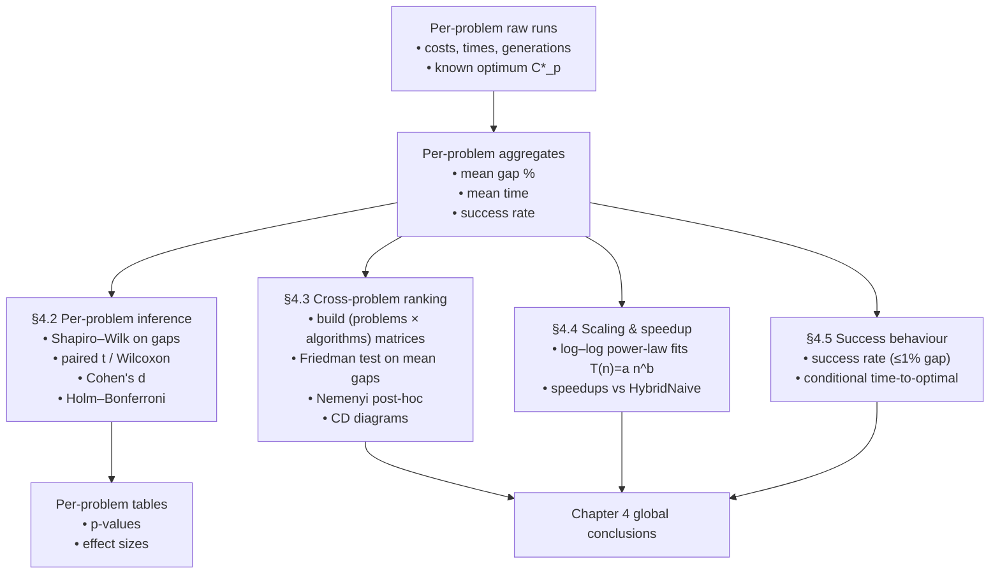

# Statistical Analysis Annex for Chapter 4 (V2 Benchmark)

This annex documents, in detail, the statistical methodology and results underlying Chapter 4 of the dissertation. It is written to be a **technical companion** to the main text: Chapter 4 presents the narrative and high‑level conclusions, while this annex explains precisely *how* the results were obtained and how they relate to Demšar’s framework for comparing multiple algorithms over multiple data sets.

Throughout, inline mathematics uses KaTeX notation (single `$` for inline, `$$` for display).

---

## 1. 5W2H overview of the analysis

### 1.1 High-level summary

| Item | Question | Answer (Chapter 4 context) |
|------|----------|----------------------------|
| **What** | What is being compared? | Four ISO‑algorithmic GA+2‑opt variants for symmetric TSP: `CPU`, `HybridNaive`, `HybridOptimized`, and `FullGPU`, evaluated on 38 TSPLIB instances. |
| **Why** | Why perform this analysis? | To validate whether GPU‑accelerated variants statistically improve solution quality and runtime compared to the CPU baseline, and to rank the GPU variants against each other. |
| **Where** | Where do the data come from? | V2 benchmark checkpoints and per‑problem statistics stored in `results_v2/` (checkpoints, problem_statistics, tables), generated by the modular Chapter 4 pipeline. |
| **When** | When is each method used? | §4.2 uses per‑problem tests (Shapiro–Wilk, Wilcoxon, Cohen’s $d$) for local comparisons. §4.3 uses cross‑problem tests (Friedman, Nemenyi) for global ranking. §4.4 analyzes runtime scaling. §4.5 analyzes success rates. |
| **Who** | Which “actors” are compared? | **Algorithms**: The four GA variants. **Problems**: 38 TSPLIB instances stratified by size (Stratum 1: $n < 100$, Stratum 2: all sizes). **Repetitions**: Multiple independent runs per pair. |
| **How** | How are differences tested? | (1) **Gaps**: Normality checks, then non-parametric paired tests (Wilcoxon) and effect sizes (Cohen’s $d$). (2) **Global Ranks**: Friedman test on mean gaps + Nemenyi post-hoc. (3) **Times**: Power-law regression and speedup ratios. |
| **How much** | How large are the effects? | Effect sizes (Cohen’s $d$) measure the magnitude of quality differences per problem. Speedup factors measure the magnitude of runtime improvements (e.g., HybridOptimized vs HybridNaive). |

### 1.2 Conceptual pipeline (overview)

The remaining sections formalize each block and explain how it was instantiated in the V2 notebook `results_and_stats_v2_chapter4_v2.ipynb`.

---

## 2. Experimental design and notation

### 2.1 Problems, algorithms, metrics

Let:

- $\mathcal{P}$ be the set of TSP instances (38 problems in total).
- $\mathcal{A} = \{\text{CPU}, \text{HybridNaive}, \text{HybridOptimized}, \text{FullGPU}\}$ be the set of algorithms.
- For each problem $p \in \mathcal{P}$, let $C_p^\star$ denote the known optimal tour cost (from TSPLIB or literature).
- For each triple $(p, a, r)$ with problem $p$, algorithm $a$, and repetition index $r = 1,\dots,n_{p,a}$:
  - $C_{p,a,r}$: tour cost obtained in run $r$;
  - $T_{p,a,r}$: total runtime (seconds) for that run;
  - $G_{p,a,r}$: number of generations used.
  - Note that $C_{p,a,r} \ge C_p^\star$ always.

The primary quality metric is the **relative optimality gap** (in percent):

$$\begin{equation}
  g_{p,a,r} = 100 \cdot \frac{C_{p,a,r} - C_p^\star}{C_p^\star}.
\end{equation}
$$
Per‑problem aggregates (computed in `problem_statistics/*.json`) include, for each problem $p$ and algorithm $a$:

**Mean Optimality Gap:**
$$\begin{equation}
\bar g_{p,a} = \frac{1}{n_{p,a}} \sum_{r=1}^{n_{p,a}} g_{p,a,r}
\end{equation}
$$
**Standard Deviation of Gap:**
$$\begin{equation}
s_{g,p,a} = \sqrt{\frac{1}{n_{p,a}-1} \sum_{r=1}^{n_{p,a}} (g_{p,a,r} - \bar g_{p,a})^2}
\end{equation}
$$
**Mean Total Time:**
$$\begin{equation}
\bar T_{p,a} = \frac{1}{n_{p,a}} \sum_{r=1}^{n_{p,a}} T_{p,a,r}
\end{equation}
$$
**Standard Deviation of Total Time:**
$$\begin{equation}
s_{T,p,a} = \sqrt{\frac{1}{n_{p,a}-1} \sum_{r=1}^{n_{p,a}} (T_{p,a,r} - \bar T_{p,a})^2}
\end{equation}
$$
Success‑related quantities such as success rate and conditional time are defined in §6.

### 2.2 Strata and pairing

To avoid bias in CPU vs GPU comparisons when the CPU baseline is only run on small problems, the cross‑problem analysis uses **two strata**:

- **Stratum 1 (small problems)**: $p \in \mathcal{P}$ with $n_p < 100$ cities and full coverage by all four algorithms. This stratum is used to compare CPU vs GPU variants on problems where the CPU baseline is affordable.
- **Stratum 2 (all problems, GPU‑only)**: all problems where at least the three GPU‑based variants (HybridNaive, HybridOptimized, FullGPU) are available. This stratum captures the behaviour of GPU algorithms across the entire difficulty range.

Within each problem $p$, **pairing** is enforced at the level of repetitions: for a given pair $(a_1,a_2)$, comparisons use the same repetition index $r$ for both algorithms whenever possible. This justifies paired tests (t‑test or Wilcoxon) on per‑run gaps.

---

## 3. Per-problem paired comparisons (§4.2)

Per‑problem analyses answer: *“For this specific TSP instance, is algorithm $a_1$ significantly better than $a_2$ in terms of optimality gap, and by how much?”*

All tests in this section operate on the per‑run gap samples

$$
  \{g_{p,a,r}\}_{r=1}^{n_{p,a}}.
$$

### 3.1 Normality check: Shapiro–Wilk test

For each $(p, a)$, the notebook runs the Shapiro–Wilk test on the gaps:

- Null hypothesis $H_0$: the sample $\{g_{p,a,r}\}$ comes from a normal distribution.
- Test statistic (in simplified form):

  $$\begin{equation}
  W = \frac{\left(\sum_{i=1}^n a_i x_{(i)}\right)^2}{\sum_{i=1}^n (x_i - \bar x)^2}
  \end{equation}
  $$
  where $x_{(i)}$ are the ordered sample values and $a_i$ are tabulated coefficients. For our case, the sample values $x_i$ correspond to the optimality gaps $g_{p,a,r}$ for a specific problem $p$ and algorithm $a$, and $n$ is the number of repetitions $n_{p,a}$.

- Decision rule: if the $p$‑value is below the global significance level $\alpha = 0.05$, normality is rejected for that $(p, a)$.

**Normality and Bimodality:**
In practice, the distributions of optimality gaps often exhibit significant deviations from normality. This is frequently due to the nature of metaheuristics, which can produce **bimodal distributions**: one cluster of runs may find the global optimum (gap $\approx 0\%$), while another cluster gets trapped in local optima (gap $> 0\%$). The Shapiro-Wilk test detects *any* divergence from normality, whether it be skewness, heavy tails, or bimodality. Since visual inspection and high success rates confirm these irregular patterns, we proceed with **non‑parametric tests** for the gap analysis.

>[!note]
>These normality checks and subsequent paired tests are applied specifically to the **optimality gaps** (solution quality), not to the runtimes. Runtime analysis (§5) relies on regression models rather than hypothesis testing of distributions.

>[!caution]
> why normality gaps are not applied to times? I thought we had to make this comparison as well. The gaps arent that big, as far as I can see. Or are they?

### 3.2 Paired t-test (when both distributions are normal)

For a fixed problem $p$ and two algorithms $a_1,a_2$, let $d_{p,r}$ be the difference in optimality gaps for the $r$-th paired run:

$$\begin{equation}
  d_{p,r} = g_{p,a_1,r} - g_{p,a_2,r}, \quad r=1,\dots,n_p,
\end{equation}
$$
where $n_p$ is the number of paired runs (same repetition index $r$ for both algorithms). The paired t‑test assumes $d_{p,r}$ are i.i.d. normal and tests:

- $H_0: \mathbb{E}[d_{p,r}] = 0$ (no difference in mean gap),
- $H_1: \mathbb{E}[d_{p,r}] \neq 0$ (two‑sided alternative).

The test statistic $t$ is calculated using the sample mean difference $\bar d_p$ and the sample standard deviation of differences $s_{d,p}$:

$$\begin{equation}
  \bar d_p = \frac{1}{n_p} \sum_{r=1}^{n_p} d_{p,r}
\end{equation}
$$
$$\begin{equation}
  s_{d,p} = \sqrt{\frac{1}{n_p-1} \sum_{r=1}^{n_p} (d_{p,r} - \bar d_p)^2}
\end{equation}
$$
$$\begin{equation}
  t = \frac{\bar d_p}{s_{d,p} / \sqrt{n_p}}
\end{equation}
$$
Under $H_0$, $t$ follows a Student distribution with $n_p-1$ degrees of freedom.

In the notebook, the paired t‑test (via `ttest_rel`) is only used when (using Shapiro–Wilk results) **both** algorithms show no evidence against normality for their gap distributions on that problem.

### 3.3 Wilcoxon signed-ranks test (default non-parametric choice)

When normality is questionable for at least one of the two algorithms, the notebook falls back to the **Wilcoxon signed‑ranks test**, as recommended by Demšar for paired classifier comparisons.

For paired differences $d_{p,r}$:

1. Discard zero differences ($d_{p,r} = 0$) or handle them with `zero_method="wilcox"` (SciPy’s convention).
2. Rank the absolute values $|d_{p,r}|$ from smallest to largest; ties receive average ranks.
3. Let $R^+$ be the sum of ranks for positive differences ($d_{p,r} > 0$) and $R^-$ the sum of ranks for negative differences ($d_{p,r} < 0$).
4. Define the test statistic $T$:

   $$\begin{equation}
   T = \min(R^+, R^-)
   \end{equation}

$$
For moderate $n_p$, a normal approximation is used to compute a $z$‑score and corresponding $p$‑value.

Interpretation (gap context):

- $d_{p,r} = g_{p,a_1,r} - g_{p,a_2,r} > 0$ means algorithm $a_1$ has a **larger gap** (worse quality) than $a_2$ in run $r$.
- A small $p$‑value and $R^+ \ll R^-$ implies that $a_1$ is systematically worse than $a_2$ for problem $p$.

In the V2 notebook, Wilcoxon is the **dominant** test type, because normality is often rejected at least for one of the two algorithms being compared.

### 3.4 Multiple comparisons per problem: Holm–Bonferroni correction

Each problem $p$ with $k_p$ available algorithms yields up to $m_p = \binom{k_p}{2}$ pairwise tests. To control the **family‑wise error rate** within problem $p$, the notebook applies the **Holm–Bonferroni step‑down procedure** to the uncorrected $p$‑values $p_1,\dots,p_{m_p}$.

Algorithm (per problem):

1. Sort the $p$‑values increasingly: $p_{(1)} \leq p_{(2)} \leq \dots \leq p_{(m_p)}$.
2. For each rank $j = 1,\dots,m_p$, compute an adjusted threshold:
   $$\begin{equation}
   \alpha_j = \frac{\alpha}{m_p - j + 1}
   \end{equation}
3. $$Starting from $j=1$:
   - If $p_{(j)} \leq \alpha_j$, reject the corresponding null hypothesis and continue to $j+1$.
   - As soon as $p_{(j)} > \alpha_j$, **stop** and retain all remaining hypotheses.

Holm–Bonferroni is uniformly more powerful than classic Bonferroni while still controlling the family‑wise error rate at $\alpha = 0.05$. The notebook stores, for each comparison, its raw $p$‑value, adjusted threshold $\alpha_j$, Holm rank, and whether it remains significant after correction.

### 3.5 Effect size: Cohen’s $d$ (practical significance)

Statistical significance alone does not answer *“How large is the improvement?”*. To quantify **practical significance**, the notebook computes Cohen’s $d$ for each per‑problem pair of algorithms.

For two samples of gaps on problem $p$, $\{g_{p,a_1,r}\}$ and $\{g_{p,a_2,r}\}$, with sample means $\bar g_{p,a_1}$, $\bar g_{p,a_2}$, variances $s_{g,p,a_1}^2$, $s_{g,p,a_2}^2$, and sizes $n_{p,a_1}$, $n_{p,a_2}$, the (pooled) standard deviation $s_p$ is:

$$\begin{equation}
  s_p = \sqrt{\frac{(n_{p,a_1}-1)s_{g,p,a_1}^2 + (n_{p,a_2}-1)s_{g,p,a_2}^2}{n_{p,a_1} + n_{p,a_2} - 2}}
\end{equation}
$$
And Cohen's $d$ is calculated as:

$$\begin{equation}
  d_{p;a_1,a_2} = \frac{\bar g_{p,a_1} - \bar g_{p,a_2}}{s_p}
\end{equation}
$$
Interpretation:

- $d_{p;a_1,a_2} > 0$ means that, on average, algorithm $a_1$ yields **larger gaps** (worse) than $a_2$.
- $d_{p;a_1,a_2} < 0$ means $a_1$ is better (smaller gaps) than $a_2$.

Conventional thresholds (for absolute values):

- $|d| < 0.2$: negligible
- $0.2 \le |d| < 0.5$: small
- $0.5 \le |d| < 0.8$: medium
- $|d| \ge 0.8$: large
- $|d| \gtrsim 1.5$: very large (common for strong GPU speedups or large quality gaps)

In the V2 Chapter 4 notebook, these per‑problem effect sizes are used to:

- Complement $p$‑values in per‑problem tables;
- Identify cases where differences are statistically significant **and** practically large;
- Support discussion of “inconclusive but large‑effect” situations (e.g., few repetitions but large $|d|$).

[^extra-plots]: A useful additional visualization (not yet included in the main thesis) would be a histogram or kernel density estimate of all $d_{p;a_1,a_2}$ values across problems, possibly stratified by problem size. This would summarize how often GPU variants achieve small vs large improvements in solution quality.

### 3.6 Per-problem conclusions (qualitative)

Because there are many problems and algorithm pairs, individual $p$‑values and $d$ values are exported in machine‑readable tables rather than reproduced here. Qualitatively:

- The per‑problem CPU vs GPU comparisons generally support the expectation that GPU variants are **not worse** in solution quality, and often slightly better, especially on larger or harder instances.
- Many problems exhibit small or negligible effect sizes between GPU variants, consistent with the later Friedman results that treat HybridNaive and HybridOptimized as statistically similar in solution quality when averaged across problems.
- For a subset of small or easy instances, all algorithms reach the optimum reliably, yielding $d \approx 0$ and non‑significant tests, as expected.

These local findings are aggregated in §4 via the Friedman+Nemenyi analysis over mean gaps.

---

## 4. Cross-problem algorithm ranking (§4.3)

Per‑problem tests are local; they do not directly answer *“Which algorithm is best overall across all problems?”*. For that, Chapter 4 follows Demšar’s non‑parametric ranking framework, adapted to two strata.

### 4.1 Data matrices and ranks

For a fixed stratum, consider:

- $N$: number of problems in the stratum;
- $k$: number of algorithms being compared in that stratum;
- $c_{j,i}$: performance score of algorithm $j$ on problem $i$.

Here, $c_{j,i}$ is taken as the **mean gap** $\bar g_{p_i,a_j}$ (smaller is better). Following Demšar, the algorithms are ranked **per problem**:

- For each problem $i$, assign ranks $r_{j,i}$ so that the best algorithm (smallest mean gap) gets rank 1, the second best rank 2, etc.; ties receive average ranks.
- The **average rank** of algorithm $j$ is then:

  $$\begin{equation}
  R_j = \frac{1}{N}\sum_{i=1}^N r_{j,i}
  \end{equation}

$$
Smaller $R_j$ indicates better overall performance.

### 4.2 Friedman test with Iman–Davenport correction

The classical Friedman statistic for testing whether all $k$ algorithms are equivalent (i.e., have the same average rank) is:

$$\begin{equation}
  \chi_F^2 = \frac{12 N}{k (k+1)}\left(\sum_{j=1}^k R_j^2 - \frac{k (k+1)^2}{4}\right)
\end{equation}
$$
For moderate $N$ and $k$, Iman and Davenport’s $F_F$ statistic provides a better approximation:

$$\begin{equation}
  F_F = \frac{(N-1)\,\chi_F^2}{N (k - 1) - \chi_F^2}
\end{equation}
$$
which under the null hypothesis $H_0$ (all algorithms equivalent) follows approximately an $F$ distribution with:

- $\text{df}_1 = k-1$ degrees of freedom in the numerator,
- $\text{df}_2 = (k-1)(N-1)$ in the denominator.

The notebook’s helper `compute_friedman_ranks` computes $R_j$, $\chi_F^2$, $F_F$, the corresponding $p$‑value, and a boolean “significant” flag at $\alpha = 0.05$.

If the Friedman test is **not** significant, no post‑hoc multiple comparisons are conducted; this happens in Stratum 1. If it **is** significant, we proceed with Nemenyi’s all‑vs‑all test.

### 4.3 Nemenyi post-hoc test and critical differences

When Friedman rejects $H_0$, Nemenyi’s test compares each pair of algorithms $i$ and $j$ based on their difference in average ranks $|R_i - R_j|$.

The **critical difference (CD)** is:

$$\begin{equation}
  \text{CD} = q_\alpha \sqrt{\frac{k (k+1)}{6N}}
\end{equation}
$$
where:

- $k$ is the number of algorithms,
- $N$ is the number of problems in the stratum,
- $q_\alpha$ is a critical value derived from the Studentized range distribution, here taken from Demšar’s Table 5(a) for the desired $\alpha$ (usually 0.05).

If $|R_i - R_j| > \text{CD}$, algorithms $i$ and $j$ are considered significantly different at level $\alpha$.

The notebook implements this with a small lookup table `NEMENYI_Q` for $q_\alpha$ and a helper `nemenyi_cd(k,N)`.

The results are visualized with **Critical Difference diagrams**, where algorithms are placed on an axis according to their average ranks, and horizontal bars connect groups of algorithms that are *not* significantly different.

### 4.4 Stratum 1: small problems (CPU + GPU)

Stratum 1 includes all problems with less than 100 cities, for which all four variants are available:

$$
\mathcal{A}_{S1} = \{\text{CPU}, \text{HybridNaive}, \text{HybridOptimized}, \text{FullGPU}\}.
$$

The data matrix has shape $N_1 \times 4$, where each row corresponds to one small problem and each column to the mean gap of an algorithm.

**Key points:**

- The Friedman test on Stratum 1 **does not reach significance** at $\alpha = 0.05$ (the $p$‑value is around $0.07$).
- Consequently, Nemenyi post‑hoc comparisons are *not* formally applied; any visual CD diagram would show overlapping confidence intervals at this sample size.
- Interpretation: with the number of small problems available, there is **insufficient power** to claim statistically significant differences in mean gap among the four algorithms in this stratum.

Practically, per‑problem results and effect sizes still suggest that GPU variants seldom underperform the CPU baseline, but Stratum 1 on its own is treated as **inconclusive** for strict global ranking.

### 4.5 Stratum 2: all problems (GPU-only)

Stratum 2 considers all problems for which the three GPU‑based variants are present:

$$
\mathcal{A}_{S2} = \{\text{HybridNaive}, \text{HybridOptimized}, \text{FullGPU}\}.
$$

The corresponding matrix has shape $N_2 \times 3$ (with $N_2$ close to the full set of 38 problems), built from mean gaps.

**Friedman results (Stratum 2):**

- The Iman–Davenport $F_F$ statistic is clearly significant at $\alpha = 0.05$ (the $p$‑value is on the order of $10^{-5}$).
- This means that not all three GPU algorithms have the same average rank; at least one differs.

**Average ranks (qualitative ordering):**

- $R_{\text{FullGPU}}$ is the **smallest** (best),
- $R_{\text{HybridOptimized}}$ and $R_{\text{HybridNaive}}$ are larger and relatively close to each other.

**Nemenyi post-hoc (Stratum 2):**

- The critical difference CD computed from $k=3$ and $N_2$ problems separates **FullGPU** from both hybrid variants: $|R_{\text{FullGPU}} - R_{\text{HybridOptimized}}| > \text{CD}$ and $|R_{\text{FullGPU}} - R_{\text{HybridNaive}}| > \text{CD}$.
- The difference $|R_{\text{HybridOptimized}} - R_{\text{HybridNaive}}|$ does **not** exceed CD: these two algorithms are **not significantly different** from each other in mean gap when aggregated across all problems.

In other words, under the Demšar framework and with V2 data:

- **FullGPU is the best algorithm in terms of solution quality** (lowest average rank in mean gap) across the full benchmark.
- The two GPU hybrid variants form a **statistical tie** in quality; they are both clearly worse than FullGPU but not distinguishable from each other at $\alpha = 0.05$.

These conclusions are exactly what the CD diagram for Stratum 2 illustrates in Chapter 4.

---

## 5. Scaling and speedup analysis (§4.4)

The previous section focuses on solution quality. Chapter 4 also investigates **runtime scaling** and **speedups** of GPU variants compared to the HybridNaive baseline.

### 5.1 Power-law scaling: $T(n) = a n^b$

For each algorithm $a$, the notebook collects pairs $(n_p, \bar T_{p,a})$ across problems where that algorithm is available, then fits a **power law**:

$$\begin{equation}
  T_a(n) \approx a_a \cdot n^{b_a}
\end{equation}
$$
by linear regression in log–log space:

1. Filter out non‑positive times.
2. Transform:
   $$\begin{equation}
   x = \log n_p, \qquad y = \log \bar T_{p,a}
   \end{equation}
3. $$Fit a line $y \approx \beta_0 + \beta_1 x$ by least squares.
4. Recover:
   $$\begin{equation}
   a_a = e^{\beta_0}, \qquad b_a = \beta_1
   \end{equation}
   $$and compute $R^2$ as a goodness‑of‑fit measure.

These fits are exported in `power_law_fits_v2.csv` and visualized in the log–log multiplot `scaling_analysis_power_law.png`, one subplot per algorithm. The slopes $b_a$ capture how runtime grows with problem size, while $a_a$ encodes constant‑factor differences between algorithms.

### 5.2 Speedup relative to HybridNaive

To focus on *relative* performance between GPU variants, the notebook defines speedup of an algorithm $a \in \{\text{HybridOptimized}, \text{FullGPU}\}$ relative to HybridNaive on problem $p$ as:

$$\begin{equation}
  S_{p,a} = \frac{\bar T_{p,\text{HybridNaive}}}{\bar T_{p,a}}
\end{equation}
$$
For each such algorithm, we obtain:

- A vector of sizes $n_p$ and corresponding $S_{p,a}$ values;
- Summary statistics (mean, median, standard deviation, min, max) exported in `speedup_summary_v2.csv`.

**Empirical pattern:**

- **HybridOptimized** shows a clear and substantial average speedup over HybridNaive (on the order of several times faster); this is the main runtime benefit of batching 2‑opt on the GPU.
- **FullGPU** is typically somewhat slower than HybridOptimized but still faster than HybridNaive on most problems; it trades part of the speed advantage for superior solution quality, as reflected in the Friedman ranking.

These trends are visible in the plot `speedup_curves.png`, which shows $S_{p,a}$ as a function of $n_p$ on a log‑scaled x‑axis.

---

## 6. Success rate and time-to-optimal analysis (§4.5)

While mean gaps capture average quality, Chapter 4 also examines how **reliably** algorithms reach near‑optimal solutions and how long this takes when they succeed.

### 6.1 Success rate definition

Using V2 checkpoints, each run stores precomputed **raw gaps in percent**. For a chosen tolerance threshold (in the notebook, $1\%$), a run is deemed **successful** if:

$$\begin{equation}
  g_{p,a,r} \le 1.0
\end{equation}
$$
For each (problem, algorithm) pair, the success rate is:

$$\begin{equation}
  \text{SR}_{p,a} = \frac{1}{n_{p,a}} \sum_{r=1}^{n_{p,a}} \mathbf{1}\{g_{p,a,r} \le 1.0\}
\end{equation}
$$
These values are assembled into a problem × algorithm table and visualized as a **success rate heatmap** (`success_rate_heatmap.png`), sorted by problem size.

### 6.2 Conditional vs unconditional time

Two time notions are distinguished for each (problem, algorithm):

- **Unconditional mean time** $\bar T_{p,a}$: the average over *all* runs, regardless of success.
- **Conditional time‑to‑optimal** $T^{\text{cond}}_{p,a}$: the average time restricted to **successful** runs only (taken from the per‑problem statistics field `conditional_time_to_optimal` when available).

These are compared in a scatter plot (`conditional_vs_unconditional_time.png`), where each point represents a (problem, algorithm) pair with non‑missing conditional time. Points below the diagonal $T^{\text{cond}}_{p,a} = \bar T_{p,a}$ indicate that successful runs are faster than the unconditional average (failures are costly), whereas points near the diagonal suggest similar behaviour for successful and unsuccessful runs.

### 6.3 Inference vs description

In the current V2 Chapter 4 notebook:

- Success rates and conditional times are treated primarily as **descriptive** statistics.
- The code suggests McNemar tests (for success rates) and Wilcoxon tests (for conditional times) as natural inferential tools, but these are not yet fully implemented in the exported version.

Therefore, Chapter 4 uses these quantities to:

- Support qualitative claims about robustness (e.g., “GPU variants reach near‑optimal solutions more consistently on harder instances than the CPU baseline”);
- Explain discrepancies between mean gap, success rate, and runtime for individual algorithms.

[^mcnemar-plots]: A natural follow‑up would be to implement McNemar’s test on success/failure pairs for CPU vs GPU on small problems, and to visualize the distribution of success‑rate differences. This could be added in a future extension of the analysis.

---

## 7. Synthesis of statistical conclusions for Chapter 4

Bringing together all sections:

1. **Per‑problem tests (Shapiro–Wilk, t/Wilcoxon, Cohen’s $d$, Holm–Bonferroni)**
   - Confirm that normality is frequently violated, justifying the emphasis on non‑parametric procedures.
   - Show that, on individual instances, GPU variants rarely underperform the CPU baseline in solution quality; when they improve, Cohen’s $d$ is often medium to large.

2. **Cross‑problem Friedman+Nemenyi ranking**
   - In **Stratum 1 (small problems)**, the Friedman test is not significant at $\alpha = 0.05$, so CPU vs GPU differences in mean gap cannot be claimed significant at the global level. This is attributed to the small number of small instances (low power).
   - In **Stratum 2 (all problems, GPU‑only)**, the Friedman test is highly significant, and Nemenyi post‑hoc comparisons show that **FullGPU** is significantly better (lower mean gap) than both Hybrid variants, which themselves are not significantly different from each other.

3. **Scaling and speedup**
   - Log–log power‑law fits confirm that all algorithms exhibit approximately polynomial‑like scaling with problem size, with different exponents and constants.
   - HybridOptimized delivers the **largest speedups** over HybridNaive, while FullGPU achieves a compromise: somewhat slower than HybridOptimized but still faster than HybridNaive, with the **best solution quality** overall.

4. **Success behaviour**
   - Success rate heatmaps and conditional times highlight that GPU variants maintain high success rates and reasonable time‑to‑optimal even on large instances, while the CPU baseline is only measured on small problems.

5. **Consistency with Demšar (2006)**
   - The analysis adheres closely to Demšar’s recommendations:
     - Non‑parametric Wilcoxon and Friedman tests instead of naive t‑tests and ANOVA;
     - Holm–Bonferroni correction for multiple pairwise comparisons;
     - Nemenyi post‑hoc and CD diagrams for multi‑algorithm comparisons;
     - Use of average ranks instead of raw averages across incommensurable problems.

Overall, the statistical evidence in this annex underpins the main Chapter 4 claims:

- GPU acceleration provides **substantial runtime benefits**, especially via the HybridOptimized variant.
- The **FullGPU** algorithm delivers the **best solution quality** across the full benchmark suite, with statistically significant superiority over hybrid variants in Stratum 2.
- On the subset of small problems where the CPU baseline is available, differences in solution quality are not statistically significant at the global level, although per‑problem results and effect sizes still favour GPU variants in many cases.

These conclusions are robust to non‑normality, multiple comparisons, and the heterogeneity of TSP instance difficulties, satisfying the methodological standards laid out in Chapter 3 and Demšar’s foundational paper.
