# Refined Statistical Analysis Flowchart

## GPU vs CPU Performance Comparison: Complete Statistical Protocol

This document presents a refined flowchart for conducting rigorous statistical analysis when comparing GPU and CPU performance in the context of GA+2-opt algorithms for TSP. The flowchart follows Demšar's recommendations [@demsar2006statistical] and incorporates best practices for paired comparisons.

```mermaid
flowchart TD
    Start["🎯 Start: GPU vs CPU Comparison<br/>Research Question: Is GPU significantly faster?"] 
    
    Start --> Planning["📋 Phase 1: Experimental Planning<br/>────────────────────────<br/>• Select n problems from TSPLIB<br/>• Determine repetitions per problem<br/>• Define stopping criteria<br/>• Control for algorithmic equivalence"]
    
    Planning --> Collection["📊 Phase 2: Data Collection<br/>────────────────────────<br/>For each problem i = 1,...,n:<br/>• Run CPU version r times → t_CPU_i,1,...,t_CPU_i,r<br/>• Run GPU version r times → t_GPU_i,1,...,t_GPU_i,r<br/>• Record: time, quality, stop_reason, generations"]
    
    Collection --> Aggregation["📈 Phase 3: Per-Problem Aggregation<br/>────────────────────────<br/>For each problem i:<br/>• Compute mean times: μ_CPU_i, μ_GPU_i<br/>• Compute standard deviations: σ_CPU_i, σ_GPU_i<br/>• Calculate differences: d_i = μ_CPU_i - μ_GPU_i"]
    
    Aggregation --> CheckSample{"❓ Sample Size Check<br/>────────────────────────<br/>Do we have n ≥ 15<br/>paired problems?"}
    
    CheckSample -->|"❌ NO<br/>n < 15"| InsufficientPower["⚠️ WARNING: Low Statistical Power<br/>────────────────────────<br/>• Cannot reliably detect effects<br/>• Results may be inconclusive<br/>• Consider collecting more data<br/>• Document limitation clearly"]
    
    CheckSample -->|"✅ YES<br/>n ≥ 15"| Normality["🔬 Phase 4: Normality Assessment<br/>────────────────────────<br/>Apply Shapiro-Wilk test to differences:<br/>H₀: d₁,...,d_n ~ Normal<br/>Compute W-statistic and p-value"]
    
    Normality --> NormalQ{"📊 Is distribution normal?<br/>────────────────────────<br/>p-value ≥ 0.05?"}
    
    NormalQ -->|"✅ YES: Normal<br/>p ≥ 0.05"| Parametric["📐 Phase 5a: Parametric Testing<br/>────────────────────────<br/>Paired t-test:<br/>• H₀: μ_d = 0 (no difference)<br/>• H₁: μ_d > 0 (CPU slower)<br/>• df = n - 1<br/>• Compute t-statistic = mean(d)/SE(d)<br/>• One-tailed test (directional)"]
    
    NormalQ -->|"❌ NO: Non-normal<br/>p < 0.05"| NonParametric["📊 Phase 5b: Non-parametric Testing<br/>────────────────────────<br/>Wilcoxon Signed-Rank test:<br/>• H₀: median(d) = 0<br/>• Rank absolute differences |d_i|<br/>• Sum ranks of positive differences<br/>• Robust to outliers and skewness<br/>• No normality assumption required"]
    
    Parametric --> EffectSize["📏 Phase 6: Effect Size Calculation<br/>────────────────────────<br/>Cohen's d = mean(d) / SD(d)<br/>Interpretation:<br/>• |d| < 0.2: negligible<br/>• 0.2 ≤ |d| < 0.5: small<br/>• 0.5 ≤ |d| < 0.8: medium<br/>• |d| ≥ 0.8: large<br/>• |d| ≥ 1.5: very large"]
    
    NonParametric --> EffectSize
    
    EffectSize --> Interpret{"🎯 Phase 7: Hypothesis Testing<br/>────────────────────────<br/>Is p-value < α?<br/>(typically α = 0.05)"}
    
    Interpret -->|"✅ YES<br/>p < 0.05"| Significant["✨ Statistically Significant Result<br/>────────────────────────<br/>Reject H₀: GPU is significantly faster"]
    
    Interpret -->|"❌ NO<br/>p ≥ 0.05"| NotSignificant["❌ Not Statistically Significant<br/>────────────────────────<br/>Fail to reject H₀<br/>Proceed to power analysis"]
    
    Significant --> CheckEffectSig{"📊 Practical Significance?<br/>────────────────────────<br/>Is effect size large?<br/>|d| ≥ 0.8?"}
    
    CheckEffectSig -->|"✅ YES<br/>Large effect"| StrongConclusion["🏆 STRONG CONCLUSION<br/>────────────────────────<br/>GPU demonstrates:<br/>• Statistically significant improvement<br/>• Large practical effect size<br/>• Robust evidence for speedup<br/>• Recommendation: Use GPU"]
    
    CheckEffectSig -->|"⚠️ NO<br/>Small/Medium"| WeakConclusion["⚠️ WEAK CONCLUSION<br/>────────────────────────<br/>Statistically significant BUT:<br/>• Small/medium practical effect<br/>• May not justify GPU overhead<br/>• Context-dependent decision<br/>• Report both statistical and practical significance"]
    
    NotSignificant --> PowerAnalysis{"🔋 Phase 8: Statistical Power Analysis<br/>────────────────────────<br/>Post-hoc power calculation:<br/>Given observed d, what was<br/>probability of detecting it?"}
    
    PowerAnalysis --> HighPower{"Power ≥ 0.80?<br/>(80% chance)"}
    
    HighPower -->|"✅ YES<br/>Adequate power"| TrueNull["✅ LIKELY TRUE NULL<br/>────────────────────────<br/>High-powered test found no effect:<br/>• GPU not meaningfully faster<br/>• Or differences negligible<br/>• Safe to conclude equivalence<br/>• Consider cost-benefit analysis"]
    
    HighPower -->|"❌ NO<br/>Low power"| TypeII["⚠️ TYPE II ERROR RISK<br/>────────────────────────<br/>Underpowered test:<br/>• May have missed real effect<br/>• Inconclusive result<br/>• Need larger sample (n ≥ 34 for d=0.5)<br/>• Or accept uncertainty"]
    
    StrongConclusion --> Reporting
    WeakConclusion --> Reporting
    TrueNull --> Reporting
    TypeII --> Reporting
    InsufficientPower --> Reporting
    
    Reporting["📝 Phase 9: Comprehensive Reporting<br/>────────────────────────<br/>Report ALL of the following:<br/>1. Sample size (n) and repetitions (r)<br/>2. Descriptive statistics (means, SDs)<br/>3. Normality test results (W, p)<br/>4. Primary test results (t or W, p)<br/>5. Effect size (Cohen's d) with CI<br/>6. Power analysis results<br/>7. Practical interpretation<br/>8. Limitations and assumptions<br/>9. Raw data availability"]
    
    Reporting --> Documentation["📚 Phase 10: Context Documentation<br/>────────────────────────<br/>Additional information:<br/>• Hardware specifications<br/>• Software versions<br/>• Problem characteristics<br/>• Stop reasons distribution<br/>• Outlier analysis<br/>• Sensitivity analyses<br/>• Replication information"]
    
    Documentation --> End["🏁 Complete Analysis<br/>────────────────────────<br/>Ready for:<br/>• Peer review<br/>• Publication<br/>• Replication<br/>• Meta-analysis"]

```



## Detailed Explanation of Each Phase

### Phase 1: Experimental Planning

**Purpose**: Establish rigorous experimental protocol before data collection.

**Key Decisions**:

- **Sample size (n)**: Number of distinct problems to test. Minimum n=15 for adequate power, n=30+ recommended.
- **Repetitions (r)**: Number of runs per algorithm per problem. Typically r=15-30 to estimate variability.
- **Stopping criteria**: Must be identical across CPU/GPU variants to ensure isoalgorithmic comparison.
- **Algorithmic equivalence**: Verify that CPU and GPU versions implement exactly the same logic.

**Why it matters**: Poor planning leads to underpowered experiments, confounded results, or wasted computational resources.

---

### Phase 2: Data Collection

**Purpose**: Execute experiments under controlled conditions.

**What to record**:

- **Execution time**: Primary metric for performance comparison.
- **Solution quality**: Cost/fitness to verify algorithmic equivalence.
- **Stop reason**: Why algorithm terminated (optimal found, patience limit, max generations).
- **Generations**: Number of iterations completed.

**Why it matters**: Complete data enables validation, debugging, and post-hoc stratification by stop conditions.

---

### Phase 3: Per-Problem Aggregation

**Purpose**: Summarize performance for each problem instance.

**Computations**:

- **Mean time**: μ = (1/r) Σ t_i represents expected performance.
- **Standard deviation**: σ = sqrt[(1/(r-1)) Σ(t_i - μ)²] quantifies variability.
- **Difference**: d = μ_CPU - μ_GPU is the paired comparison unit.

**Why it matters**: Pairing by problem controls for problem difficulty, increasing statistical power.

---

### Phase 4: Normality Assessment (Shapiro-Wilk Test)

**Purpose**: Determine if parametric tests are valid.

**Hypothesis**:

- **H₀**: Differences d₁,...,d_n follow a normal distribution.
- **H₁**: Distribution is non-normal (skewed, heavy-tailed, multimodal).

**Decision rule**:

- If p ≥ 0.05: Accept normality → Use paired t-test.
- If p < 0.05: Reject normality → Use Wilcoxon test.

**Why it matters**: Parametric tests assume normality; violating this assumption inflates Type I error rate.

---

### Phase 5a: Parametric Testing (Paired t-test)

**Purpose**: Test for significant difference assuming normal distribution.

**Hypothesis**:

- **H₀**: μ_d = 0 (no systematic difference).
- **H₁**: μ_d > 0 (CPU slower than GPU).

**Test statistic**:

- t = [mean(d) - 0] / [SD(d) / sqrt(n)]
- Degrees of freedom: df = n - 1
- One-tailed critical value at α=0.05: t_crit ≈ 1.761 (for n=15).

**Why it matters**: Most powerful test when normality holds; standard in experimental sciences.

---

### Phase 5b: Non-parametric Testing (Wilcoxon Signed-Rank)

**Purpose**: Test for significant difference without normality assumption.

**Procedure**:

1. Compute absolute differences |d_i|.
2. Rank them from smallest to largest.
3. Sum ranks of positive differences: W⁺.
4. Compare W⁺ to critical value from Wilcoxon table.

**Hypothesis**:

- **H₀**: Median(d) = 0 (no systematic shift).
- **H₁**: Median(d) > 0 (CPU slower).

**Why it matters**: Robust to outliers, skewness, and heavy tails; safer when normality violated.

---

### Phase 6: Effect Size (Cohen's d)

**Purpose**: Quantify magnitude of difference in standardized units.

**Formula**:

- d = mean(d) / SD(d)

**Interpretation** (Cohen's conventions):

- |d| < 0.2: **Negligible** — differences too small to matter.
- 0.2 ≤ |d| < 0.5: **Small** — noticeable but modest effect.
- 0.5 ≤ |d| < 0.8: **Medium** — clear practical impact.
- |d| ≥ 0.8: **Large** — substantial improvement.
- |d| ≥ 1.5: **Very large** — dramatic speedup.

**Why it matters**: p-values only indicate *if* difference exists; effect size indicates *how much* it matters.

---

### Phase 7: Hypothesis Testing (p-value Interpretation)

**Purpose**: Decide whether to reject null hypothesis.

**Decision**:

- If p < α (typically 0.05): Reject H₀ → GPU is significantly faster.
- If p ≥ α: Fail to reject H₀ → Cannot conclude GPU is faster.

**Important**: "Not significant" ≠ "equivalent"; absence of evidence ≠ evidence of absence.

**Why it matters**: Controls Type I error (false positive) at acceptable rate.

---

### Phase 8: Statistical Power Analysis

**Purpose**: Assess probability that test could detect true effects.

**Post-hoc power**:

- Given observed effect size d, sample size n, and α, compute:
  - Power = P(reject H₀ | H₁ is true)
  
**Guidelines**:

- Power ≥ 0.80: Adequate (80% chance of detecting effect if real).
- Power < 0.80: Underpowered (high Type II error risk).

**Sample size requirements** (for paired t-test, α=0.05, power=0.80):

- d = 0.2 (small): n ≈ 199
- d = 0.5 (medium): n ≈ 34
- d = 0.8 (large): n ≈ 15

**Why it matters**: Explains non-significant results: true null vs. insufficient power to detect effect.

---

### Phase 9: Comprehensive Reporting

**Purpose**: Enable scrutiny, replication, and meta-analysis.

**Essential elements**:

1. **Design**: n problems, r repetitions, hardware specs.
2. **Descriptives**: Means, SDs, medians, IQRs for both algorithms.
3. **Assumption checks**: Shapiro-Wilk results, QQ-plots.
4. **Primary test**: t-statistic or W-statistic, df, p-value.
5. **Effect size**: Cohen's d with 95% confidence interval.
6. **Power**: Post-hoc power analysis.
7. **Interpretation**: Practical significance, limitations.
8. **Data availability**: Link to raw data, code, reproduction scripts.

**Why it matters**: Transparency is foundation of scientific credibility.

---

### Phase 10: Context Documentation

**Purpose**: Situate findings within broader experimental context.

**Additional information**:

- **Hardware**: GPU model, VRAM, CUDA version; CPU model, cores, RAM.
- **Software**: NumPy, CuPy, Python versions.
- **Problems**: TSPLIB instance names, sizes, optimal costs.
- **Stop reasons**: How many runs hit optimal vs. patience limit.
- **Outliers**: Identify and analyze extreme values.
- **Sensitivity**: Re-run analyses excluding outliers or specific problems.

**Why it matters**: Contextualization aids interpretation and informs future work.

---

## Common Pitfalls and How to Avoid Them

### Pitfall 1: Low Statistical Power

**Problem**: With n < 15, tests lack sensitivity to detect moderate effects.

**Solution**:

- Collect data on more problems (aim for n ≥ 30).
- Or increase repetitions per problem (r ≥ 30).
- Or accept that only very large effects (d > 1.0) will be detectable.

### Pitfall 2: Ignoring Normality Violations

**Problem**: Using t-test on non-normal data inflates false positive rate.

**Solution**:

- Always run Shapiro-Wilk test.
- Use Wilcoxon test when p < 0.05.
- Report both tests for robustness.

### Pitfall 3: Confusing Statistical and Practical Significance

**Problem**: Small effect with large n can be "significant" but meaningless.

**Solution**:

- Always report effect size alongside p-value.
- Interpret practical importance independently of statistical significance.

### Pitfall 4: P-hacking

**Problem**: Trying multiple tests until one gives p < 0.05.

**Solution**:

- Pre-register analysis plan.
- Report all tests conducted, not just significant ones.
- Apply multiple testing corrections if appropriate (e.g., Bonferroni).

### Pitfall 5: Incomplete Reporting

**Problem**: Omitting negative results, effect sizes, or power analyses.

**Solution**:

- Follow complete reporting checklist (Phase 9).
- Publish raw data and code.
- Embrace transparency over "storytelling".

---

## References and Further Reading

### Foundational Statistical Methods

- Demšar, J. (2006). "Statistical Comparisons of Classifiers over Multiple Data Sets." *Journal of Machine Learning Research*, 7, 1-30.
- Cohen, J. (1988). *Statistical Power Analysis for the Behavioral Sciences* (2nd ed.). Routledge.
- Wilcoxon, F. (1945). "Individual Comparisons by Ranking Methods." *Biometrics Bulletin*, 1(6), 80-83.

### Benchmark Methodology

- Hooker, J. N. (1995). "Testing Heuristics: We Have It All Wrong." *Journal of Heuristics*, 1(1), 33-42.
- Barr, R. S., et al. (1995). "Designing and Reporting on Computational Experiments with Heuristic Methods." *Journal of Heuristics*, 1(1), 9-32.

### GPU Acceleration Context

- This methodology applies specifically to comparing CPU vs. GPU implementations where:
  - Algorithms are isoalgorithmic (identical logic).
  - Differences arise solely from execution platform.
  - Multiple problem instances provide replication.

---

## Summary

This refined flowchart provides a complete, rigorous protocol for comparing GPU and CPU performance in metaheuristic algorithms. By following all 10 phases, researchers can:

1. **Avoid Type I errors** (false positives) through proper statistical testing.
2. **Detect Type II errors** (false negatives) through power analysis.
3. **Quantify practical significance** through effect size measures.
4. **Enable replication** through comprehensive documentation.
5. **Advance the field** through transparent, credible science.

The flowchart balances statistical rigor with practical considerations, acknowledging real-world constraints (limited computational budget, variability in algorithm behavior) while maintaining scientific standards.

```mermaid
flowchart TD
    A[Part 0: Setup<br/>• Imports<br/>• Paths and configs<br/>• Utility functions] --> B

    subgraph PART1 [Part 1: Data ingestion & exploration]
        B[Load raw data<br/>• V1 DB and/or V2 checkpoints<br/>• Filter to selected algorithms/problems<br/>• Attach metadata n, opt_cost, stop_reason] --> C
        C[Basic sanity checks<br/>• Count runs per problem, algorithm<br/>• Check missing values<br/>• Check unique stop_reason values] --> D
        D[Exploratory plots<br/>• Histograms / KDE of times and gaps<br/>• Box/violin plots per algorithm<br/>• Scatter: time vs n, gap vs n] --> E
        E[Modality / shape inspection<br/>• Visual bimodality checks<br/>• Optionally dip/Silverman tests<br/>• Decide if distributions look normal-ish]
    end

    PART1 --> F

    subgraph PART2 [Part 2: Per‑problem statistical tests]
        F[Normality tests per problem<br/>• For each problem and metric e.g. gap, time<br/>• Shapiro–Wilk on paired differences<br/>• Store p_normalproblem, metric] --> G
        G[Test selection per problem<br/>IF p_normal ≥ α:<br/>  • Use paired t‑test<br/>ELSE:<br/>  • Use Wilcoxon signed‑rank] --> H
        H[Effect sizes per comparison<br/>• If t‑test: Cohen's d<br/>• If Wilcoxon: rank‑biserial r<br/>• Keep sign = direction of advantage] --> I
        I[Multiple comparison control<br/>• For each family e.g. all alg pairs on one metric<br/>• Apply Holm–Bonferroni<br/>• Mark which pairs stay significant] --> J
        J[Per‑problem summary tables<br/>• For each problem:<br/>  – mean/median metric per algorithm<br/>  – p‑values raw + adjusted<br/>  – effect sizes and directions]
    end

    PART2 --> K

    subgraph PART3 [Part 3: Cross‑problem Demšar analysis]
        K[Rank algorithms per problem<br/>• For each problem, rank algorithms by metric e.g. gap<br/>• Average rank across problems] --> L
        L[Friedman + Iman–Davenport<br/>• Test H0: all algorithms have same rank<br/>• If rejected, proceed to post‑hoc] --> M
        M[Nemenyi post‑hoc test<br/>• Compute critical difference CD<br/>• Compare avg ranks pairwise<br/>• Mark significant differences] --> N
        N[CD diagrams and rank plots<br/>• Visualize avg ranks and CD<br/>• Show which algorithms are statistically indistinguishable]
    end

    PART3 --> O

    subgraph PART4 [Part 4: Scaling and conditional analyses]
        O[Scaling models<br/>• Fit time vs n e.g. power law per algorithm<br/>• Log–log regression, R², residual checks] --> P
        P[Speedup curves<br/>• Compute speedup vs CPU baseline where available<br/>• Plot speedup vs n with CIs] --> Q
        Q[Stop‑reason‑aware views<br/>• Optionally stratify by stop_reason<br/>   – all runs vs hit_optimal‑only<br/>   – success rates vs n<br/>• Clarify what estimand each view represents]
    end

    PART4 --> R

    subgraph PART5 [Part 5: Export and reporting]
        R[Export tables<br/>• LaTeX/Markdown tables for thesis<br/>• CSVs for further processing] --> S
        S[Export figures<br/>• High‑res PNG/PDF plots<br/>• Consistent fonts/labels] --> T
        T[Documentation block<br/>• Record test choices t vs Wilcoxon<br/>• Record α, corrections used<br/>• Note any protocol mixing V1 vs V2, hit_optimal‑only, etc.]
    end
    ```