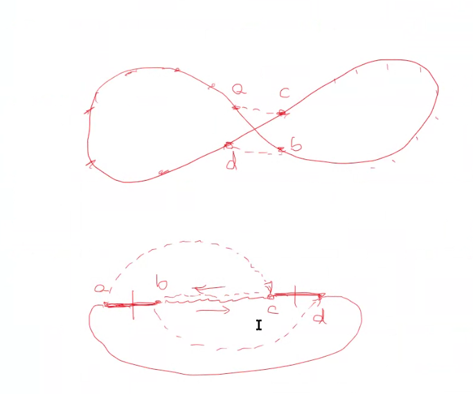
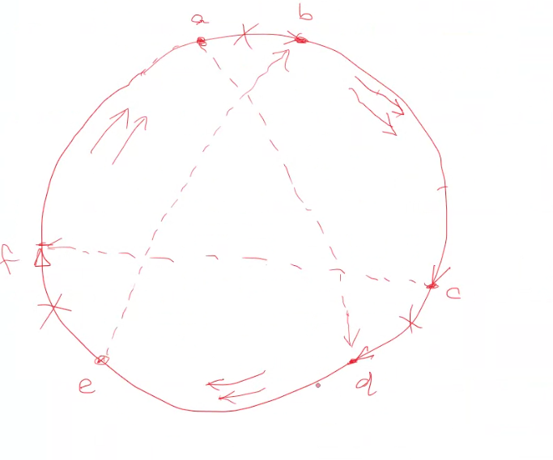

# meeting notes

- The current project focuses on a memetic algorithm that combines a genetic algorithm with a 2-opt local search algorithm being compared to each other with GPU utilization

  + what should I be reading to really implement? something more practical?
    >[!note]
    > É uma exploaração de performance computacional em relaçào à população, tempo, memória, e qualidade da solução
    > - Resultados significados melhores?
    > - Vairações em relação à otimização.
    >
    > modeFRONTIER

  + What is missing for an OR focused memetic algorithm?

    >[!note]
    > answer later

  + Is this a good project? what could be changed?

    >[!note]
    > answer later

  + should I proceed with this idea?
  + How should I simplificate?
  + How many meetings a week/month?

    >[!warning]
    >once a week

  + In how much time you feel I can accomplish my goals?

    >[!note]
    >answer later

  + should I present it in english?

    >[!note]
    >I can try

  + What do you expect?

    >[!note]
    >answer later

  + expected timeline

    >[!note]
    >answer later

## O que devo fazer

- Preparar uma apresentação para mostrar ao Mayerle. Urgente.

  >[!note] Panorama geral
  >+ Não explicar código
  >+ explicação mais ampla. Resultados coletados.
  >+ 30-40m.

- Pegar requisitos necessários para o TCC engenharia mecânica. Urgente.
  + A banca é montada com a ajuda de professores de outros departamentos.
  + Quais sào as regras para acomposiçào das bancas?
    - A depender de como são as bancas, orientador pode fazer parte da banca.
    - ir pensando em relação a isto.
- Estabelecer uma estrutura de como o texto vai ser apresentado.
  + checar documentos [aqui](./documents_tcc/disorganized_but_may_help/TCC/planning/critical_analysis/critical_analysis.md)
- revisào bibliográfica de forma efetiva. 
  + Abordar o que tenho feito e o que há na literatura?
  + Formas como implementei a paralelização. Teoria que suporta isto.
  + Apresentar minha proposta de solução.
- justificativa e valor de pesquisa. exemplo: `modeFRONTIER`, como algoritmos genéticos/evolucionários são utilizados para técnicas de modelagem, por exemplo, na aeronáutica ou outros.
- Escrever a nível em que meus colegas possam entender. Possibilidade de replicação. Falseabilidade.
  + Especificações sobre código?? Parte de código não é o principal. Pode estar no apêndice. Mas algumas variações, como por exemplo detalhes como utilziar float32.
  + Código pode estar linkado, mas não necessariamente precisa estar no corpo do texto.
  + Adicionar pseudocódigos?

## points

- memetic algorithm 
- Algoritmos genéticos são:
  + flexível
  + de fácil implementação
  + podem ser adaptados a outros projetos, como job scheduling

  >[!importan] problemas de localização de instalações
  > + localizações de p-medianos e suas variantes
  > +

### Dúvidas

- Por que 

## dicas

- Focar meu esforço. Por quê?
  + Em um das orientaçòes, aluna construiu algoritmo VRPTW. Usou técnica `scatter search`. em função das características do problema, ela percebeu que os resultados nào eram muito bons. Foi uma dificuldade enorme de terminar e deixar a entrega boa.
  + Resolver um problema que eu me sinta confortável.
  + Partir do entendimento do que é um TCC: escrita de um TCC vs mestrado vs doutorado tem uma estrutura similar. O que caracteriza? O nível de exigência. Pra quem eu estou escrevendo? Pra quem estou fazendo essa pesquisa.

    >[!note]
    >Não pensar em uma tese de doutorado (problema que tenha relevância, que apresente resultados, que seja "novo"). **Candidato a doutor deve ultrapassar a fronteira do conhecimento**. Público alvo são seus pares, outros doutores. Algo que pra eles valha a pena ler.

    >[!note]Mestrado **mostra que você foi ao limite do conhecimento. Deve demonstrar competəalizaç~ao de pesquisa e dominar uma área do conhecimento. Ir na literatura, fazer levantamento bibliográfico e ser capaz de aplicar os conhecimentos adquiridos.** Não é uma exigência ultrapassar a barreira do conhecimento, mas deve traduzir isto em algo útil. Público alvo são potenciais alunos.

    >[!note]
    >Já no TCC, **vai-se à fronteira do que se conhece, que se consiga mostrar que consegue aplicar o conhecimento adquirido. O nível de exigência muda.** Pares são meus colegas, para quem meus trabalhos podem servir de inspiração.

- Problema do caixeiro viajante é relevant pois é uma estrutura básica que serve para resoluçào de diversos problemas de aplicação prática. 
  + Satisfaz a questão da relevância. Deve mostrar a aplicaçào, não a teoria em si — não é tão fácil encontrar recursos para paralelismo, com demonstrações reais.

- 2-opt só consegue resolver problemas unidirecionais. Grafo é unidirecionado. 
  + Vão ter arcos onde não se tem custos bidirecionais.
  + Mais que isso precisa-se de 3-opt, pois este permite bidiriecionais. 4-opt permite bidirecional?
  + 
  + 
  + 2-opt -> apenas grafos não orientados.
  + 3-opt -> grafos orientados.

- Minha pesquisa pode ser em cima disso. algo que sirva para meus pares aplicarem isso e aprenderem com isso. 
