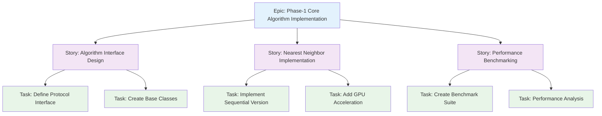
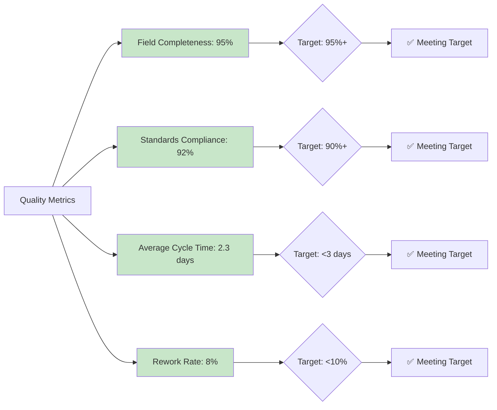
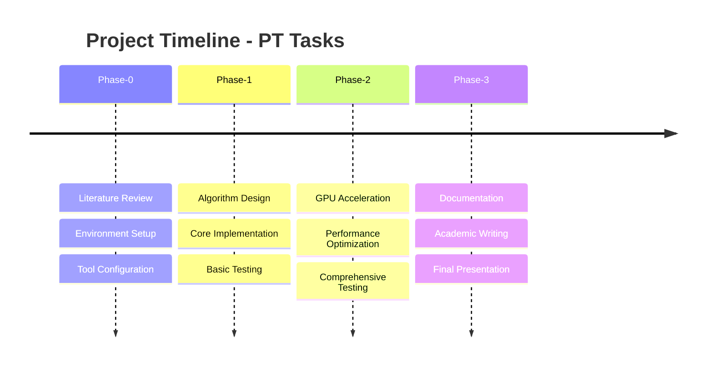
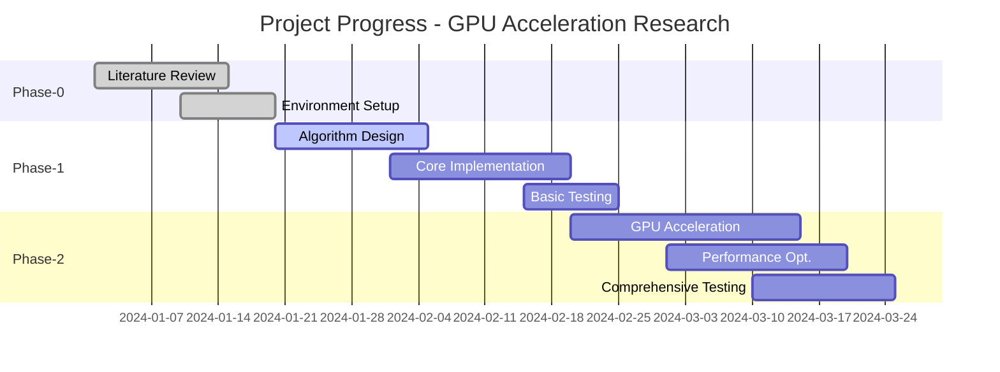

# JIRA Integration User Guide

> **Complete User Guide for JIRA Integration Tools**
>
> This guide provides step-by-step instructions for using the JIRA integration system in the GPU acceleration research project.

## Table of Contents

1. [Getting Started](#getting-started)
2. [Daily Workflows](#daily-workflows)
3. [Task Management](#task-management)
4. [Quality Assurance](#quality-assurance)
5. [Reporting and Analytics](#reporting-and-analytics)
6. [Troubleshooting](#troubleshooting)
7. [Advanced Features](#advanced-features)

---

## Getting Started

### Prerequisites

Before using the JIRA integration tools, ensure you have:

- Python 3.8+ installed
- Access to the project repository
- JIRA project permissions (if using live mode)
- Git configured for the repository

### Installation

1. **Navigate to the project directory**:
   ```bash
   cd /home/lucas_galdino/TCC-name_to_define/gpu_accelerated
   ```

2. **Install dependencies**:
   ```bash
   pip install -r requirements.txt
   ```

3. **Verify installation**:
   ```bash
   python -c "import jira.scripts.sync_jira_tasks_fixed; print('✅ Installation successful')"
   ```

### Initial Configuration

The system comes pre-configured for academic use with mock data. No additional setup is required for most users.

#### Configuration File

The default configuration is located at `project_management/jira/scripts/jira_sync_config.ini`:

```ini
[JIRA]
base_url = https://company.atlassian.net
username = your_email@company.com
api_token = your_api_token
project_key = PT

[SYNC]
mock_mode = true
validation_enabled = true
output_directory = output
cache_ttl_hours = 24
```

**Note**: Mock mode is enabled by default, providing a complete dataset for learning and development.

## Daily Workflows

### Basic Task Synchronization

#### Quick Sync (Most Common)

```bash
# Navigate to JIRA scripts directory
cd project_management/jira/scripts

# Run synchronization
python sync_jira_tasks_fixed.py
```

This will:

- ✅ Sync all PT project tasks
- ✅ Generate progress reports
- ✅ Create visualization diagrams
- ✅ Validate task quality
- ✅ Output results to console and files

#### Detailed Sync with Reports

```bash
# Run with detailed output
python sync_jira_tasks_fixed.py --verbose --include-diagrams
```

### Working with Tasks

#### View Current Tasks

```python
from jira.scripts.sync_jira_tasks_fixed import JIRATaskSynchronizer

sync = JIRATaskSynchronizer()
results = sync.sync_tasks()

# Display task summary
print(f"Total tasks: {len(results['tasks'])}")
for task in results['tasks']:
    print(f"  {task['key']}: {task['summary']} [{task['status']}]")
```

#### Filter Tasks by Status

```python
# Get tasks in progress
in_progress_tasks = sync.get_tasks_by_status("In Progress")
print(f"Tasks in progress: {len(in_progress_tasks)}")

# Get completed tasks
completed_tasks = sync.get_tasks_by_status("Done")
print(f"Completed tasks: {len(completed_tasks)}")
```

### Task Quality Validation

#### Manual Quality Check

```bash
# Run all validation scripts
python ../scripts/validate_structure.py
python ../scripts/validate_naming.py
python ../scripts/validate_academic.py
```

#### Automated Quality Enforcement

Quality validation runs automatically when:

- Creating or modifying tasks
- Running sync operations
- Making Git commits (if pre-commit hooks are enabled)

## Task Management

### Understanding Task Hierarchy

The project uses a three-level hierarchy:



### Task Types and Standards

#### Epic Standards

- **Format**: "Phase-X: High-level description"
- **Purpose**: Organize major project phases
- **Duration**: 2-4 weeks
- **Example**: "Phase-1: Core Algorithm Implementation"

#### Story Standards

- **Format**: User story or system capability
- **Purpose**: Define functional requirements
- **Duration**: 3-7 days
- **Example**: "As a researcher, I need GPU acceleration benchmarks"

#### Task Standards

- **Format**: Action-oriented description
- **Purpose**: Specific implementation work
- **Duration**: 1-8 hours
- **Example**: "Implement CuPy backend for distance calculations"

### Creating Quality Tasks

#### Required Information

Every task must include:

1. **Clear Summary** (10-100 characters)
2. **Detailed Description** (minimum 50 characters)
3. **Acceptance Criteria** (checklist format)
4. **Appropriate Labels** (snake_case format)
5. **Parent Relationship** (for stories and tasks)

#### Template Example

```yaml
Summary: "Implement CuPy backend for distance calculations"

Description: |
  ## Context
  Create CuPy-based implementation for parallel distance matrix computation
  to accelerate TSP solving on GPU hardware.
  
  ## Objectives
  - Implement CuPy backend class
  - Optimize memory access patterns
  - Achieve 10x performance improvement over NumPy
  
  ## Approach
  - Use CuPy arrays for GPU memory management
  - Implement vectorized distance calculations
  - Add proper error handling and validation
  
  ## Acceptance Criteria
  - [ ] CuPy backend class implemented with full API
  - [ ] Unit tests achieve 90% code coverage
  - [ ] Performance benchmarks show 10x improvement
  - [ ] Documentation includes usage examples
  
  ## References
  - CuPy documentation: https://cupy.dev/
  - Related issue: PT-2 (Algorithm Interface Design)

Labels: [phase-1, cupy, backend, performance]
Parent: PT-2
Priority: High
Story Points: 5
```

## Quality Assurance

### Automated Quality Checks

The system performs several automatic quality validations:

#### Structure Validation

- ✅ Repository structure compliance
- ✅ File organization standards
- ✅ Directory naming conventions

#### Content Validation

- ✅ Task description completeness
- ✅ Acceptance criteria format
- ✅ Label format compliance
- ✅ Parent-child relationships

#### Academic Standards

- ✅ Research methodology documentation
- ✅ Literature reference requirements
- ✅ TCC compliance standards

### Quality Metrics Dashboard

Track quality metrics over time:



### Manual Quality Review Checklist

#### Weekly Review Process

**Epic Review**:

- [ ] Clear phase objectives defined
- [ ] Research context documented
- [ ] Dependencies identified
- [ ] Timeline realistic

**Story Review**:

- [ ] User value articulated
- [ ] Technical requirements specified
- [ ] Acceptance criteria complete
- [ ] Testing strategy defined

**Task Review**:

- [ ] Actionable and specific
- [ ] Effort estimate reasonable (1-8 hours)
- [ ] Technical approach documented
- [ ] Success criteria measurable

## Reporting and Analytics

### Progress Reports

#### Generate Current Status Report

```python
from jira.scripts.sync_jira_tasks_fixed import JIRATaskSynchronizer

sync = JIRATaskSynchronizer()
report = sync.generate_progress_report("markdown")
print(report)
```

#### View Task Distribution

```python
# Get task distribution by status
results = sync.sync_tasks()
status_counts = {}

for task in results['tasks']:
    status = task['status']
    status_counts[status] = status_counts.get(status, 0) + 1

print("Task Distribution:")
for status, count in status_counts.items():
    print(f"  {status}: {count} tasks")
```

### Visualization and Diagrams

The system automatically generates several types of diagrams:

#### Timeline View



#### Progress Tracking



### Performance Analytics

#### Task Completion Velocity

Track how quickly tasks are completed:

```python
# Calculate completion velocity
completed_tasks = sync.get_tasks_by_status("Done")
velocity_data = []

for task in completed_tasks:
    created = datetime.fromisoformat(task['created'])
    completed = datetime.fromisoformat(task['updated'])
    duration = (completed - created).days
    velocity_data.append(duration)

avg_duration = sum(velocity_data) / len(velocity_data)
print(f"Average task completion time: {avg_duration:.1f} days")
```

## Troubleshooting

### Common Issues

#### Sync Failures

**Issue**: "Connection timeout when syncing tasks"
**Solution**: Verify mock mode is enabled or check network connectivity
**Prevention**: Use mock mode for development and testing

#### Validation Errors

**Issue**: "Task description too short"
**Solution**: Expand description to minimum 50 characters
**Prevention**: Use task templates with guided prompts

#### Missing Dependencies

**Issue**: "ModuleNotFoundError: No module named 'requests'"
**Solution**: Install missing dependencies

```bash
pip install requests pyyaml
```

#### File Permission Errors

**Issue**: "Permission denied writing to output directory"
**Solution**: Check directory permissions or use different output path

```bash
chmod 755 output/
```

### Debugging Tools

#### Enable Verbose Logging

```python
import logging
logging.basicConfig(level=logging.DEBUG)

sync = JIRATaskSynchronizer()
# Now sync operations will show detailed logs
```

#### Validate Configuration

```python
from jira.scripts.sync_jira_tasks_fixed import JIRATaskSynchronizer

sync = JIRATaskSynchronizer()
config_valid = sync.validate_configuration()
if not config_valid:
    print("Configuration issues found")
```

#### Test Connection (Live Mode Only)

```python
# Only works with valid JIRA credentials
sync = JIRATaskSynchronizer(mock_mode=False)
try:
    connection_ok = sync.test_connection()
    print("✅ JIRA connection successful")
except Exception as e:
    print(f"❌ Connection failed: {e}")
```

## Advanced Features

### Custom Filters and Queries

#### Filter by Labels

```python
def get_tasks_by_label(label: str):
    """Get tasks with specific label."""
    results = sync.sync_tasks()
    filtered = []
    
    for task in results['tasks']:
        if label in task.get('labels', []):
            filtered.append(task)
    
    return filtered

# Get all GPU-related tasks
gpu_tasks = get_tasks_by_label('gpu')
print(f"GPU tasks: {len(gpu_tasks)}")
```

#### Complex Queries

```python
def get_high_priority_open_tasks():
    """Get high-priority tasks that are not completed."""
    results = sync.sync_tasks()
    filtered = []
    
    for task in results['tasks']:
        if (task.get('priority') == 'High' and 
            task.get('status') not in ['Done', 'Cancelled']):
            filtered.append(task)
    
    return filtered
```

### Custom Report Generation

#### Create Custom Progress Report

```python
def generate_custom_report():
    """Generate custom progress report."""
    results = sync.sync_tasks()
    
    # Analyze task distribution
    phases = {}
    for task in results['tasks']:
        labels = task.get('labels', [])
        phase_labels = [l for l in labels if l.startswith('phase-')]
        
        for phase in phase_labels:
            if phase not in phases:
                phases[phase] = {'total': 0, 'done': 0}
            phases[phase]['total'] += 1
            if task['status'] == 'Done':
                phases[phase]['done'] += 1
    
    # Generate report
    print("## Custom Progress Report")
    print()
    for phase, data in phases.items():
        completion = (data['done'] / data['total']) * 100
        print(f"**{phase.title()}**: {completion:.1f}% complete ({data['done']}/{data['total']})")
    
    return phases
```

### Integration with External Tools

#### Export to Excel

```python
import pandas as pd

def export_to_excel():
    """Export task data to Excel format."""
    results = sync.sync_tasks()
    
    # Convert to DataFrame
    df = pd.DataFrame(results['tasks'])
    
    # Save to Excel
    df.to_excel('task_export.xlsx', index=False)
    print("✅ Exported to task_export.xlsx")
```

#### Integration with Git Hooks

For automatic validation on commit:

```bash
# .git/hooks/pre-commit
#!/bin/bash
echo "Running JIRA task validation..."
python project_management/jira/scripts/sync_jira_tasks_fixed.py --validate-only
if [ $? -ne 0 ]; then
    echo "❌ Task validation failed"
    exit 1
fi
echo "✅ Task validation passed"
```

---

## Quick Reference

### Common Commands

```bash
# Basic sync
python project_management/jira/scripts/sync_jira_tasks_fixed.py

# Validate repository structure
python scripts/validate_structure.py

# Validate naming conventions
python scripts/validate_naming.py

# Run all validations
python scripts/validate_academic.py
```

### Key File Locations

- **Sync Script**: `project_management/jira/scripts/sync_jira_tasks_fixed.py`
- **Configuration**: `jira/scripts/jira_sync_config.ini`
- **Validation Scripts**: `scripts/validate_*.py`
- **Documentation**: `jira/docs/`
- **Output Directory**: `jira/scripts/output/`

### Support and Resources

- **Integration Guide**: `jira/docs/api/tasks/integration/README.md`
- **Quality Guide**: `project_management/jira/docs/guides/tasks/enforcing_tasks_quality/README.md`
- **API Documentation**: `jira/docs/api/README.md`
- **Project Management**: `project_management/TASK_BREAKDOWN_FRAMEWORK.md`

---

*This user guide is part of the comprehensive JIRA integration system documentation. For technical implementation details, refer to the developer guides and API documentation.*
