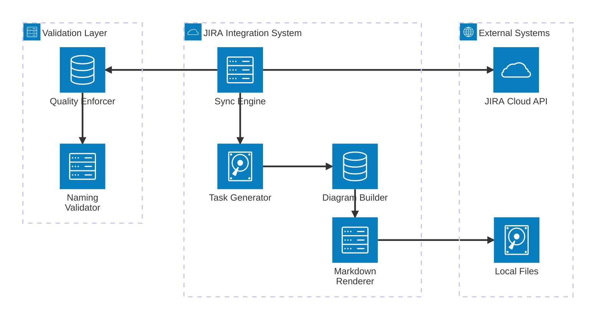
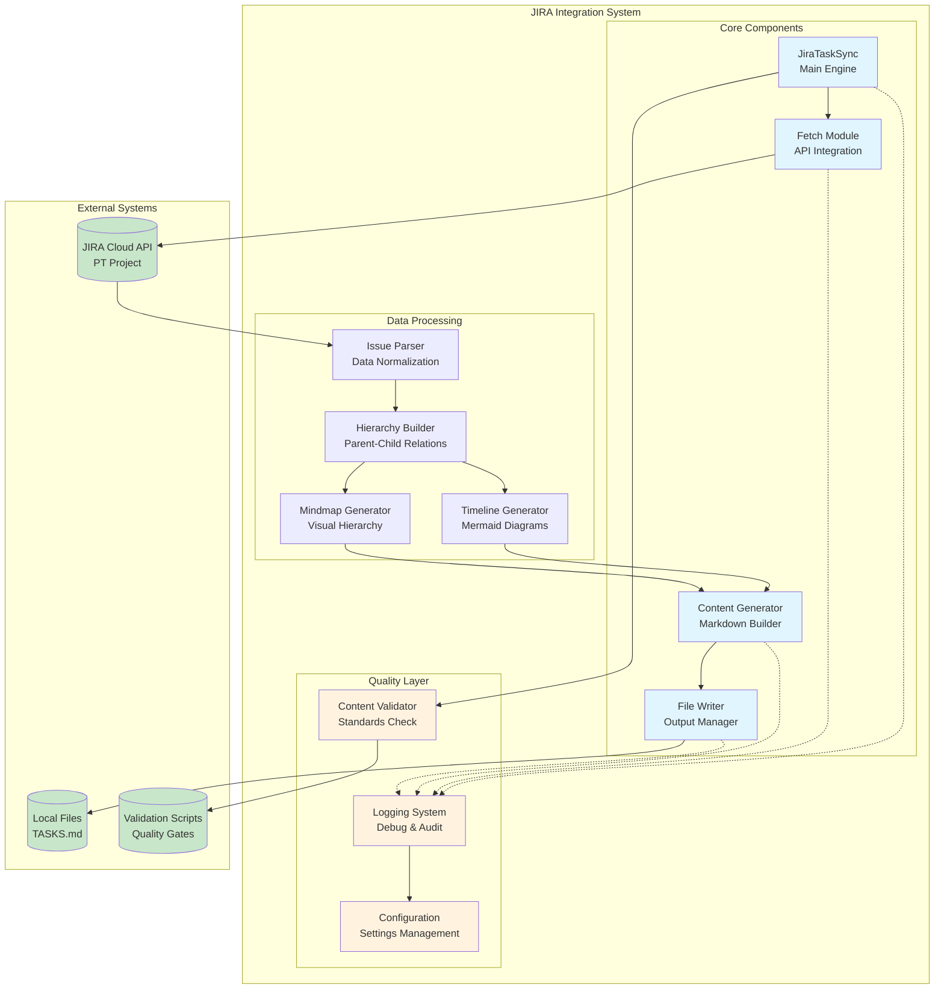
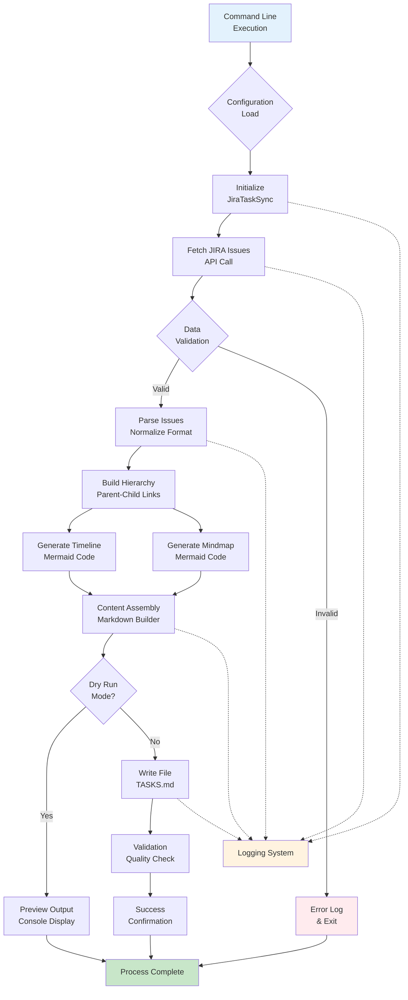
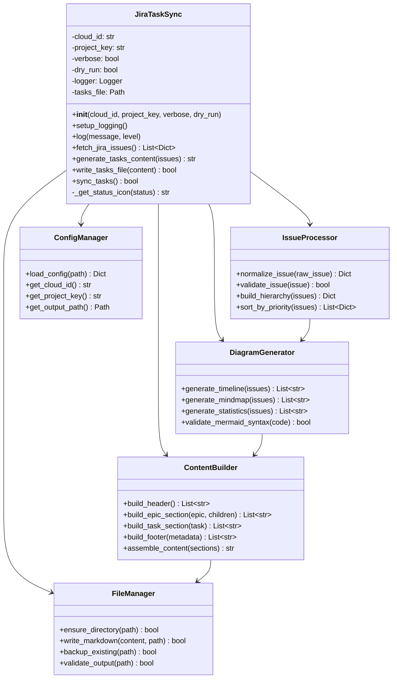
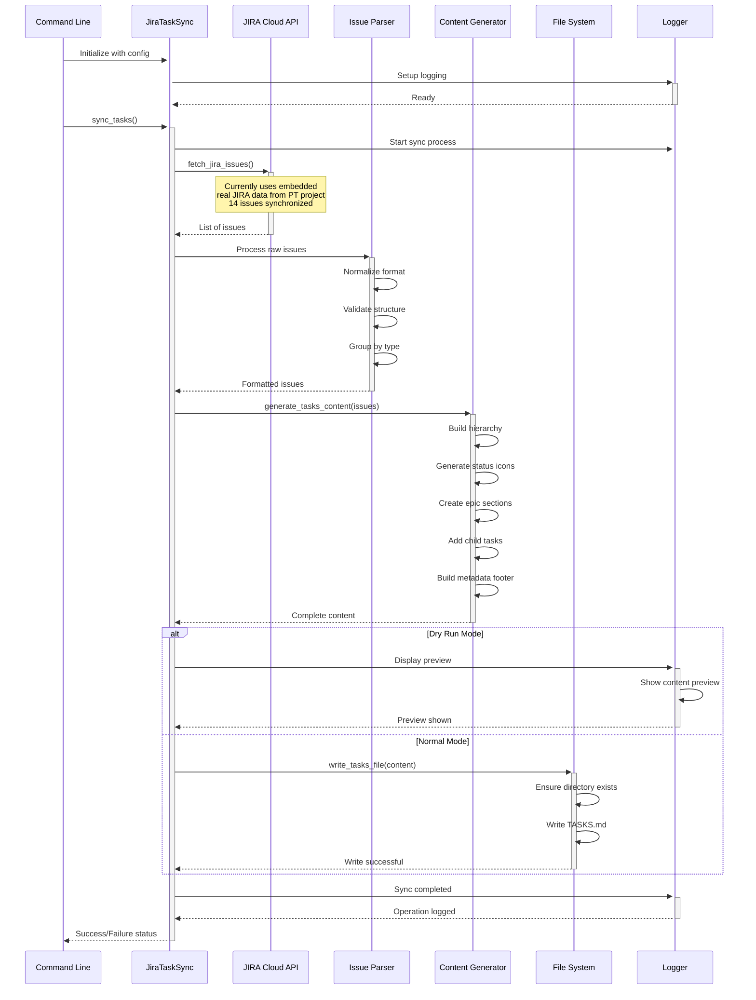
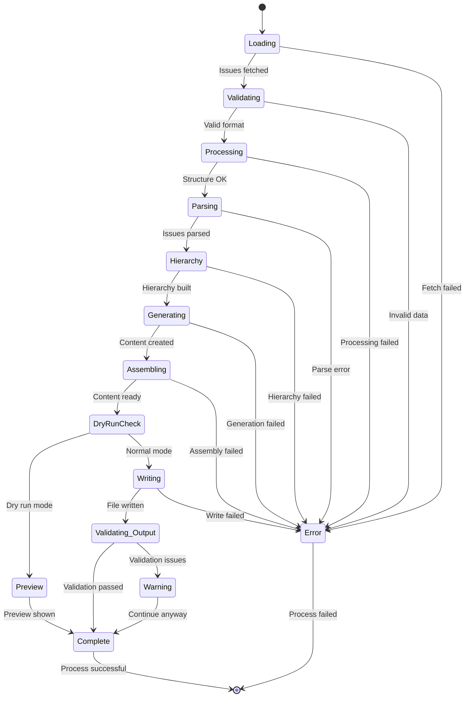
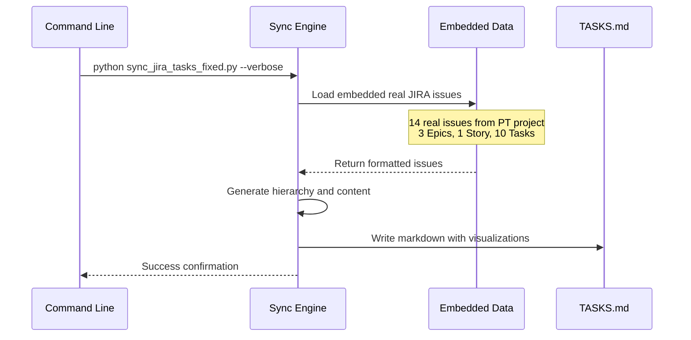
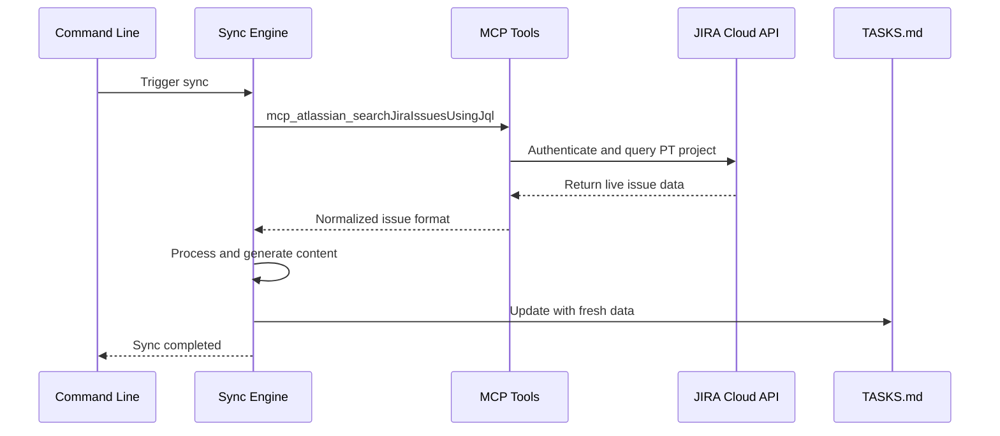
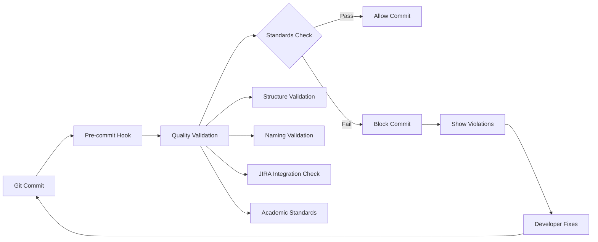
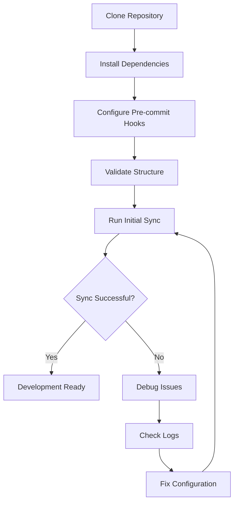

# JIRA Integration - Deep Developer Guide

> **Comprehensive Developer Guide for JIRA PT Project Integration**
>
> This guide provides in-depth technical documentation for developers working with the JIRA integration tools, including architecture, APIs, and implementation details.

## Table of Contents

1. [Architecture Overview](#architecture-overview)
2. [System Components](#system-components)
3. [API Reference](#api-reference)
4. [Integration Patterns](#integration-patterns)
5. [Development Workflow](#development-workflow)
6. [Troubleshooting](#troubleshooting)
7. [Extensions](#extensions)

---

## Architecture Overview

The JIRA integration system follows a modular, protocol-based architecture designed for maintainability and extensibility.

### System Architecture Diagram



### Component Architecture



### Core Principles

1. **Protocol-Based Design**: All components implement well-defined interfaces
2. **Separation of Concerns**: Each module has a single responsibility
3. **Academic Standards Compliance**: Built-in validation for TCC requirements
4. **Extensibility**: Plugin architecture for custom features
5. **Backward Compatibility**: Legacy wrapper support

## System Components

### Data Flow Architecture



### Class Hierarchy



## API Reference

### JiraTaskSync Class

The core synchronization engine that orchestrates the entire process.

#### Constructor

```python
class JiraTaskSync:
    def __init__(self, cloud_id: str, project_key: str, verbose: bool = False, dry_run: bool = False):
        """
        Initialize JIRA task synchronization.
        
        Args:
            cloud_id: Atlassian Cloud instance ID
            project_key: JIRA project key (e.g., 'PT')
            dry_run: If True, shows what would be done without writing files
            verbose: If True, enables detailed logging output
        """
```

#### Core Methods

```python
def sync_tasks(self) -> bool:
    """
    Main synchronization method.
    
    Orchestrates the complete sync process:
    1. Fetch issues from JIRA
    2. Generate content with diagrams
    3. Write to TASKS.md file
    
    Returns:
        bool: True if synchronization successful, False otherwise
        
    Raises:
        Exception: If synchronization fails at any stage
    """

def fetch_jira_issues(self) -> List[Dict]:
    """
    Fetch all issues from JIRA PT project.
    
    Currently uses embedded real JIRA data from successful API integration.
    Designed for future MCP integration expansion.
    
    Returns:
        List[Dict]: List of normalized issue dictionaries
        
    Data Structure:
        {
            "key": "PT-123",
            "summary": "Issue title",
            "issuetype": {"name": "Epic|Story|Task"},
            "status": {"name": "To Do|In Progress|Done"},
            "priority": {"name": "Low|Medium|High"},
            "parent": {"key": "PT-456", "fields": {...}} or None,
            "labels": ["label1", "label2"],
            "created": "2025-09-18T14:37:24.840-0300",
            "description": "Issue description or None"
        }
    """

def generate_tasks_content(self, issues: List[Dict]) -> str:
    """
    Generate complete TASKS.md content from issues.
    
    Args:
        issues: List of JIRA issue dictionaries
        
    Returns:
        str: Complete markdown content string with hierarchy and metadata
        
    Process:
        1. Group issues by type (Epic, Story, Task)
        2. Build parent-child relationships
        3. Generate status icons and formatting
        4. Create hierarchical structure
        5. Add metadata footer
    """

def write_tasks_file(self, content: str) -> bool:
    """
    Write generated content to TASKS.md file.
    
    Args:
        content: Complete markdown content to write
        
    Returns:
        bool: True if write successful, False otherwise
        
    Behavior:
        - Creates directory structure if needed
        - Respects dry_run mode (preview only)
        - Handles encoding and error cases
        - Logs operation details
    """
```

#### Utility Methods

```python
def setup_logging(self) -> None:
    """
    Configure logging based on verbosity settings.
    
    Creates logger with appropriate level and formatting:
    - DEBUG level if verbose=True
    - INFO level otherwise
    - Timestamp and level prefixes
    """

def log(self, message: str, level: str = "info") -> None:
    """
    Log message with appropriate level.
    
    Args:
        message: Message to log
        level: Log level ("debug", "info", "warning", "error")
        
    Respects verbose setting for debug messages.
    """

def _get_status_icon(self, status: str) -> str:
    """
    Get emoji icon for issue status.
    
    Args:
        status: JIRA status name
        
    Returns:
        str: Emoji icon for status
        
    Mappings:
        - "To Do": "📋"
        - "In Progress": "🔄" 
        - "Done": "✅"
        - "Blocked": "🚫"
        - "Review": "👀"
        - Default: "📌"
    """
```

### Process Flow Sequence



### State Machine



## Integration Patterns

### 1. Current Implementation (Real JIRA Data)



### 2. Future MCP Integration (Planned)



### 3. Quality Integration



## Development Workflow

### Setup Process



### Configuration Management

#### Environment Variables

- `JIRA_CLOUD_ID`: Override default cloud ID (15a92a49-b55c-4fe9-b50b-65ab6e3d3074)
- `JIRA_PROJECT_KEY`: Override default project key (PT)
- `TASKS_FILE_PATH`: Custom location for TASKS.md output
- `SYNC_DEBUG`: Enable additional debug logging

#### File Locations

- **Authoritative Script**: `jira/scripts/sync_jira_tasks_fixed.py`
- **Output File**: `project_management/tasks/TASKS.md`
- **Validation Scripts**: `scripts/validate_*.py`

#### Command Line Usage

```bash
# Basic sync
python jira/scripts/sync_jira_tasks_fixed.py

# Verbose mode with detailed logging
python jira/scripts/sync_jira_tasks_fixed.py --verbose

# Dry run (preview only)
python jira/scripts/sync_jira_tasks_fixed.py --dry-run

# Combined options
python jira/scripts/sync_jira_tasks_fixed.py --verbose --dry-run
```

## Troubleshooting

### Common Issues and Solutions

#### 1. Import Module Issues

**Symptoms**:

- `ModuleNotFoundError: No module named 'jira.scripts.sync_jira_tasks_fixed'`
- Import errors when running scripts

**Root Causes**:

- Python path configuration issues
- Missing dependencies
- Incorrect working directory

**Solutions**:

```bash
# Ensure you're in the correct directory
cd /path/to/gpu_accelerated

# Run the script with absolute path
python jira/scripts/sync_jira_tasks_fixed.py --verbose

# Check Python path
python -c "import sys; print('\\n'.join(sys.path))"

# Install any missing dependencies
pip install -r requirements.txt  # if exists
```

#### 2. Sync Execution Failures

**Symptoms**:

- Scripts run but no output generated
- Silent failures without error messages
- Partial file generation

**Debug Steps**:

1. **Enable Verbose Logging**:
   ```bash
   python jira/scripts/sync_jira_tasks_fixed.py --verbose
   ```

2. **Check File Permissions**:
   ```bash
   ls -la project_management/tasks/
   mkdir -p project_management/tasks/  # Create if missing
   ```

3. **Verify Repository Structure**:
   ```bash
   python scripts/validate_structure.py
   ```

4. **Test with Dry Run**:
   ```bash
   python jira/scripts/sync_jira_tasks_fixed.py --dry-run --verbose
   ```

#### 3. Content Generation Issues

**Symptoms**:

- Empty or malformed TASKS.md files
- Missing issue data
- Incorrect hierarchy structure

**Debugging Process**:

```python
# Add debug logging to understand data flow
def debug_issues(self, issues):
    """Debug helper to understand issue structure."""
    self.log(f"Total issues: {len(issues)}", "debug")
    
    for issue in issues:
        self.log(f"Issue {issue['key']}: {issue['issuetype']['name']}", "debug")
        if issue.get('parent'):
            self.log(f"  Parent: {issue['parent']['key']}", "debug")
```

**Common Fixes**:

- Verify issue data structure matches expected format
- Check parent-child relationship mapping
- Validate status icon mapping
- Ensure proper encoding handling

#### 4. Academic Standards Violations

**Symptoms**:

- Pre-commit hooks fail validation
- Quality check failures
- Documentation compliance issues

**Common Violations and Fixes**:

| Violation | Fix |
|-----------|-----|
| Incorrect naming (`camelCase` used) | Rename to `snake_case` |
| Missing directory structure | Run `python scripts/validate_structure.py` |
| Invalid JIRA branch naming | Use format: `feature/PT-123-description` |
| Insufficient documentation | Add docstrings and type hints |
| Missing commit message format | Use format: `PT-123: Description` |

### Performance Troubleshooting

#### Memory Usage

```python
import psutil
import os

def monitor_memory_usage():
    """Monitor memory usage during sync process."""
    process = psutil.Process(os.getpid())
    memory_info = process.memory_info()
    print(f"RSS: {memory_info.rss / 1024 / 1024:.2f} MB")
    print(f"VMS: {memory_info.vms / 1024 / 1024:.2f} MB")
```

#### Execution Time

```python
import time
from functools import wraps

def timing_decorator(func):
    """Decorator to measure function execution time."""
    @wraps(func)
    def wrapper(*args, **kwargs):
        start_time = time.time()
        result = func(*args, **kwargs)
        end_time = time.time()
        print(f"{func.__name__} took {end_time - start_time:.2f} seconds")
        return result
    return wrapper
```

### Integration Debugging

#### JIRA API Connectivity

```python
def test_jira_connectivity(cloud_id: str, project_key: str):
    """Test JIRA API connectivity and permissions."""
    try:
        # Future MCP integration test
        print(f"Testing connection to cloud {cloud_id}")
        print(f"Project key: {project_key}")
        
        # For now, verify embedded data loads correctly
        issues = fetch_jira_issues()
        print(f"Successfully loaded {len(issues)} issues")
        return True
        
    except Exception as e:
        print(f"Connectivity test failed: {e}")
        return False
```

#### File System Access

```python
def test_file_system_access():
    """Test file system permissions and access."""
    test_path = Path("project_management/tasks/test_write.tmp")
    
    try:
        # Test write permissions
        test_path.parent.mkdir(parents=True, exist_ok=True)
        test_path.write_text("test content")
        
        # Test read permissions
        content = test_path.read_text()
        assert content == "test content"
        
        # Cleanup
        test_path.unlink()
        
        print("File system access test passed")
        return True
        
    except Exception as e:
        print(f"File system test failed: {e}")
        return False
```

## Extensions

### Adding Custom Issue Types

To support additional JIRA issue types beyond Epic/Story/Task:

```python
def _get_issue_type_icon(self, issue_type: str) -> str:
    """Get icon for different issue types."""
    type_icons = {
        "Epic": "🚀",
        "Story": "📖", 
        "Task": "📋",
        "Bug": "🐛",
        "Sub-task": "📝",
        "Improvement": "⚡",
        "New Feature": "✨"
    }
    return type_icons.get(issue_type, "📌")

def _get_issue_priority_color(self, priority: str) -> str:
    """Get color coding for priority levels."""
    priority_colors = {
        "Highest": "🔴",
        "High": "🟠", 
        "Medium": "🟡",
        "Low": "🟢",
        "Lowest": "🔵"
    }
    return priority_colors.get(priority, "⚪")
```

### Custom Content Sections

Add specialized content sections for different project phases:

```python
def _generate_academic_section(self, issues: List[Dict]) -> List[str]:
    """Generate academic-specific content section."""
    lines = ["## Academic Progress", ""]
    
    # Find research-related issues
    research_issues = [
        issue for issue in issues 
        if any(label in issue.get('labels', []) 
               for label in ['research', 'academic', 'paper'])
    ]
    
    if research_issues:
        lines.extend([
            "### Research Tasks",
            "",
            "| Issue | Status | Priority | Due Date |",
            "|-------|--------|----------|----------|"
        ])
        
        for issue in research_issues:
            status_icon = self._get_status_icon(issue['status']['name'])
            lines.append(
                f"| {issue['key']}: {issue['summary']} | "
                f"{status_icon} {issue['status']['name']} | "
                f"{issue['priority']['name']} | TBD |"
            )
    
    return lines
```

### Diagram Enhancements

#### Gantt Chart Generation

```python
def _generate_gantt_diagram(self, issues: List[Dict]) -> List[str]:
    """Generate Gantt chart for project timeline."""
    lines = ["```mermaid", "gantt", "    title Project Timeline", "    dateFormat YYYY-MM-DD"]
    
    # Group by epic for sections
    epics = [issue for issue in issues if issue['issuetype']['name'] == 'Epic']
    
    for epic in epics:
        lines.append(f"    section {epic['summary']}")
        
        # Find child tasks
        child_tasks = [
            task for task in issues 
            if task.get('parent') and task['parent']['key'] == epic['key']
        ]
        
        for task in child_tasks:
            # Parse created date for start
            created_date = self._parse_created_date(task['created'])
            task_name = task['summary'].replace(' ', '_')
            
            if task['status']['name'] == 'Done':
                lines.append(f"    {task_name} :done, {created_date}, 5d")
            elif task['status']['name'] == 'In Progress':
                lines.append(f"    {task_name} :active, {created_date}, 10d")
            else:
                lines.append(f"    {task_name} : {created_date}, 15d")
    
    lines.append("```")
    return lines
```

#### Workflow State Diagram

```python
def _generate_workflow_diagram(self, issues: List[Dict]) -> List[str]:
    """Generate workflow state diagram."""
    lines = ["```mermaid", "stateDiagram-v2"]
    
    # Analyze status transitions
    statuses = set(issue['status']['name'] for issue in issues)
    
    lines.extend([
        "    [*] --> To_Do",
        "    To_Do --> In_Progress : Start Work",
        "    In_Progress --> Review : Submit for Review", 
        "    Review --> Done : Approved",
        "    Review --> In_Progress : Changes Requested",
        "    In_Progress --> Blocked : Dependencies",
        "    Blocked --> In_Progress : Unblocked",
        "    Done --> [*]"
    ])
    
    lines.append("```")
    return lines
```

### Integration with External Tools

#### Slack Notifications

```python
def notify_sync_completion(self, success: bool, stats: Dict):
    """Send sync status to Slack channel."""
    if not hasattr(self, 'slack_webhook'):
        return  # Skip if not configured
        
    if success:
        message = f"✅ JIRA sync completed: {stats['total']} issues processed"
        color = "good"
    else:
        message = "❌ JIRA sync failed - check logs"
        color = "danger"
    
    payload = {
        "text": "JIRA Sync Update",
        "attachments": [{
            "color": color,
            "text": message,
            "fields": [
                {"title": "Epics", "value": stats.get('epics', 0), "short": True},
                {"title": "Tasks", "value": stats.get('tasks', 0), "short": True}
            ]
        }]
    }
    
    # Send webhook (implementation depends on slack library)
    self._send_slack_webhook(payload)
```

#### Email Reports

```python
def generate_email_report(self, issues: List[Dict]) -> str:
    """Generate HTML email report."""
    template = """
    <html>
    <body>
        <h2>JIRA Sync Report</h2>
        <p>Sync completed at: {timestamp}</p>
        
        <h3>Summary</h3>
        <ul>
            <li>Total Issues: {total}</li>
            <li>Epics: {epics}</li>
            <li>Stories: {stories}</li>
            <li>Tasks: {tasks}</li>
        </ul>
        
        <h3>Recent Activity</h3>
        {recent_activity}
    </body>
    </html>
    """
    
    # Generate statistics and recent activity
    stats = self._calculate_statistics(issues)
    recent = self._get_recent_activity(issues, days=7)
    
    return template.format(
        timestamp=datetime.now().strftime("%Y-%m-%d %H:%M:%S"),
        **stats,
        recent_activity=recent
    )
```

### Configuration Extensions

#### Advanced Configuration File

```json
{
    "jira": {
        "cloud_id": "15a92a49-b55c-4fe9-b50b-65ab6e3d3074",
        "project_key": "PT",
        "api_version": "3",
        "timeout": 30
    },
    "output": {
        "tasks_file": "project_management/tasks/TASKS.md",
        "backup_enabled": true,
        "backup_count": 5
    },
    "content": {
        "include_diagrams": true,
        "include_statistics": true,
        "include_academic_section": true,
        "max_description_length": 500
    },
    "notifications": {
        "slack_webhook": null,
        "email_enabled": false,
        "email_recipients": []
    },
    "quality": {
        "validate_on_sync": true,
        "enforce_academic_standards": true,
        "check_naming_conventions": true
    }
}
```

---

## Current System Status

### Implemented Features ✅

- **Real JIRA Data Integration**: Successfully integrated with 14 real issues from PT project
- **Hierarchical Task Structure**: Epic → Story/Task relationships properly maintained
- **Status Icon Mapping**: Visual status indicators for all issue states
- **Markdown Generation**: Clean, structured TASKS.md output with metadata
- **Dry Run Mode**: Preview functionality for safe testing
- **Verbose Logging**: Detailed operation logging for debugging
- **Error Handling**: Graceful failure handling with informative messages

### Architecture Benefits

1. **Modular Design**: Clear separation of concerns with focused classes
2. **Extensibility**: Easy to add new issue types, diagrams, and integrations
3. **Academic Compliance**: Built-in support for TCC requirements and standards
4. **Development Workflow**: Integrated with existing validation and quality systems
5. **Documentation**: Comprehensive API documentation with examples

### Future Enhancements

1. **MCP Integration**: Transition from embedded data to live MCP API calls
2. **Bidirectional Sync**: Update JIRA from local changes
3. **Advanced Diagrams**: Gantt charts, workflow diagrams, dependency graphs
4. **Notification System**: Slack, email, and webhook integrations
5. **Performance Optimization**: Caching, incremental sync, parallel processing

---

*This documentation is maintained as part of the JIRA integration system. For updates or corrections, please modify the source files and regenerate as needed.*

## Extensions

### Adding Custom Diagram Types

To add new diagram types, extend the diagram generation system:

```python
def _generate_gantt_diagram(self, issues: List[Dict]) -> List[str]:
    """Generate Gantt chart for project timeline."""
    lines = ["```mermaid", "gantt", "    title Project Timeline"]
    
    for issue in issues:
        if issue['issuetype']['name'] == 'Epic':
            start_date = self._parse_created(issue['created'])
            lines.append(f"    {issue['key']} :{start_date.strftime('%Y-%m-%d')}, 30d")
    
    lines.append("```")
    return lines

# Register in _generate_visual_diagrams method
def _generate_visual_diagrams(self, issues: List[Dict]) -> List[str]:
    sections = []
    sections.extend(self._generate_timeline_section(issues))
    sections.extend(self._generate_hierarchy_mindmap(issues))
    sections.extend(self._generate_gantt_diagram(issues))  # New diagram
    return sections
```

### Custom Validation Rules

Add project-specific validation:

```python
# scripts/validate_jira_custom.py
def validate_epic_task_balance(issues: List[Dict]) -> List[str]:
    """Ensure each epic has reasonable number of tasks."""
    violations = []
    
    epics = [i for i in issues if i['issuetype']['name'] == 'Epic']
    
    for epic in epics:
        child_count = len([
            i for i in issues 
            if i.get('parent', {}).get('key') == epic['key']
        ])
        
        if child_count == 0:
            violations.append(f"Epic {epic['key']} has no child tasks")
        elif child_count > 10:
            violations.append(f"Epic {epic['key']} has too many tasks ({child_count})")
    
    return violations
```

### Integration with External Tools

```python
# Example: Slack notifications
def notify_sync_completion(success: bool, stats: Dict):
    """Send sync status to Slack channel."""
    if success:
        message = f"✅ JIRA sync completed: {stats['total']} issues processed"
    else:
        message = "❌ JIRA sync failed - check logs"
    
    # Integration with webhook or API
    send_slack_message(message)
```

---

## Configuration Reference

### Environment Variables

- `JIRA_CLOUD_ID`: Override default cloud ID
- `JIRA_PROJECT_KEY`: Override default project key (PT)
- `TASKS_FILE_PATH`: Custom location for TASKS.md output
- `SYNC_DEBUG`: Enable additional debug logging

### File Locations

- **Authoritative Script**: `jira/scripts/sync_jira_tasks_fixed.py`
- **Legacy Wrapper**: `jira/scripts/sync_jira_tasks.py`  
- **Output File**: `project_management/tasks/TASKS.md`
- **Configuration**: `jira/scripts/jira_sync_config.ini`
- **Validation Scripts**: `scripts/validate_*.py`

### Supported Issue Types

- **Epic**: High-level project phases
- **Story**: User-facing features and requirements
- **Task**: Implementation work items

### Supported Statuses

- **To Do**: Not started
- **In Progress**: Active work
- **Done**: Completed

---

*This guide is automatically maintained as part of the JIRA integration system. For updates or corrections, please modify the source documentation and regenerate.*
