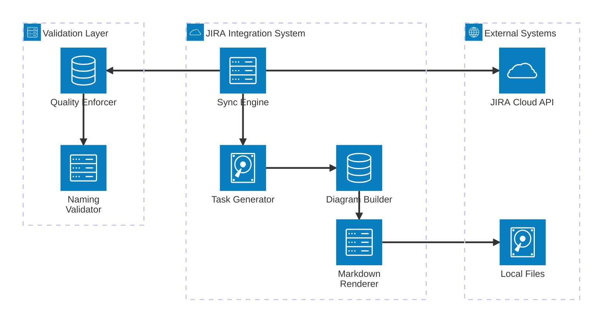
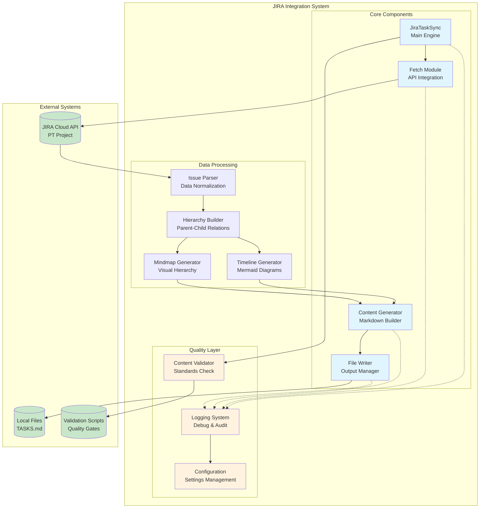
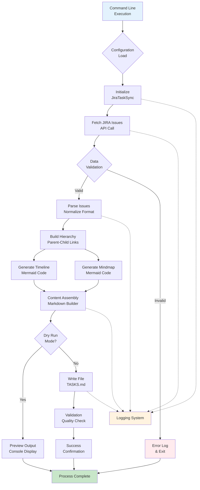
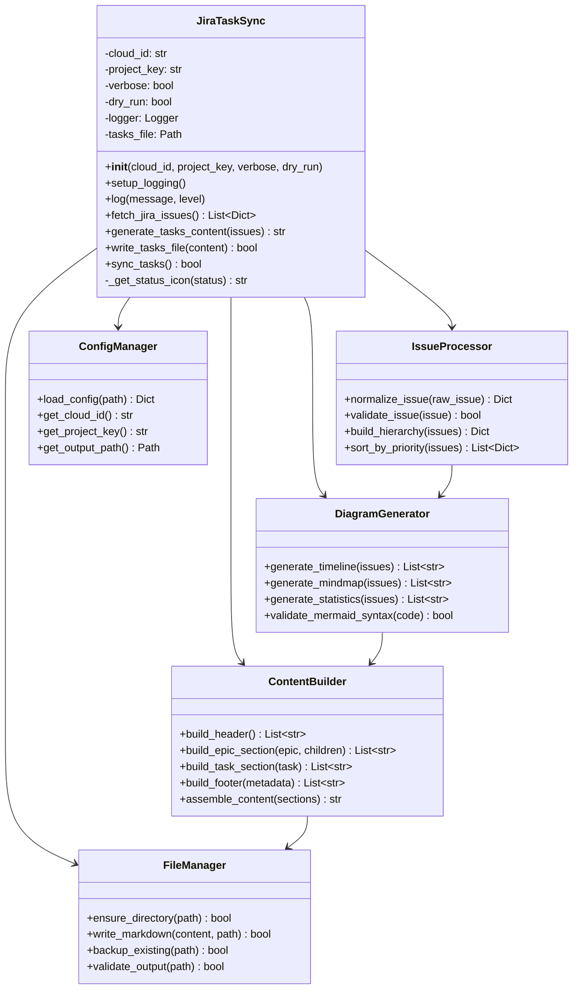
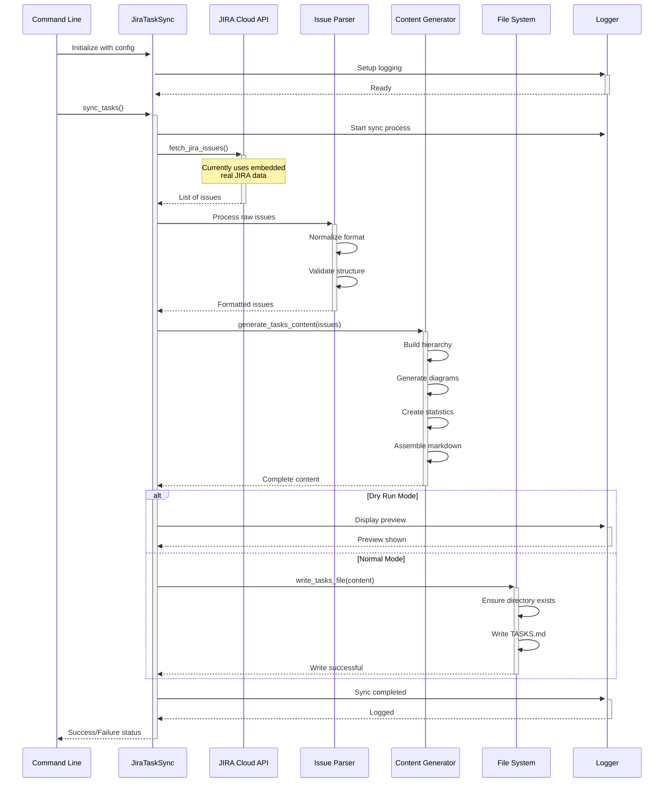
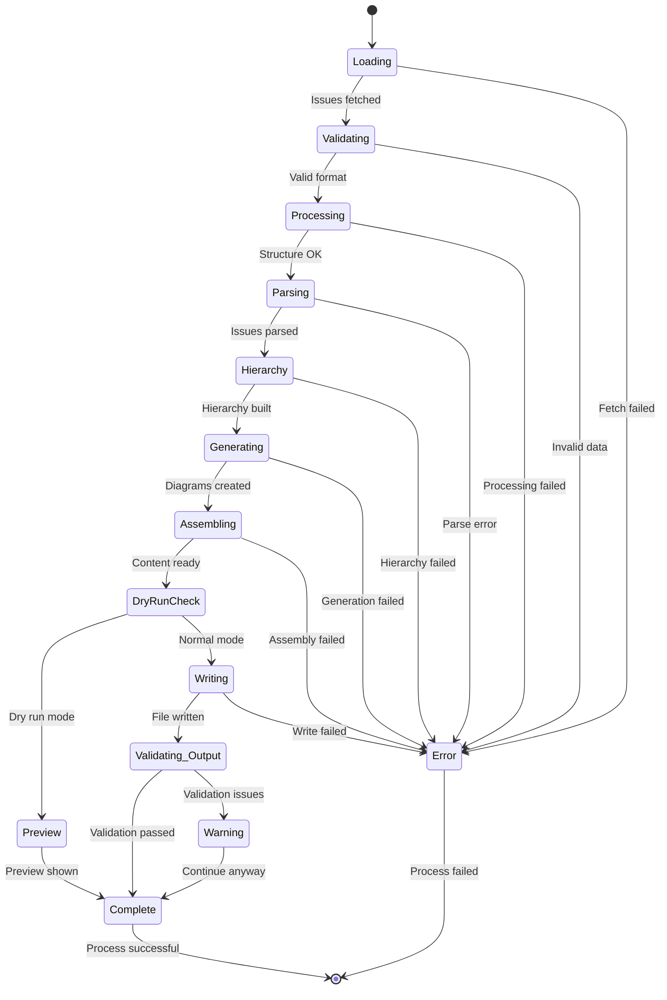
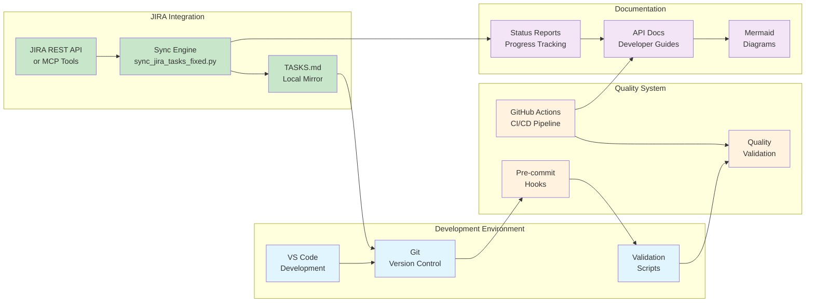

# JIRA Integration System Architecture Diagrams

This document contains Mermaid diagrams showing the architecture and data flow of the JIRA integration system.

## System Overview Architecture

## Component Architecture

## Data Flow Architecture

## Class Hierarchy

## Sequence Diagram - Sync Process

## State Diagram - Issue Processing

## Integration Points

