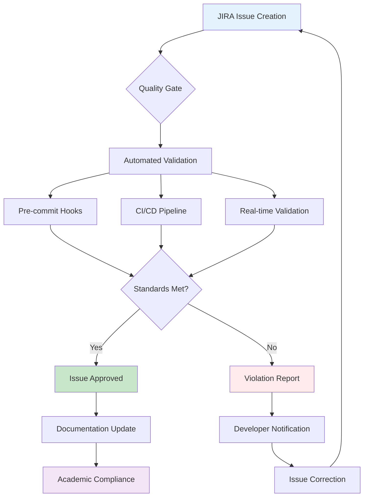
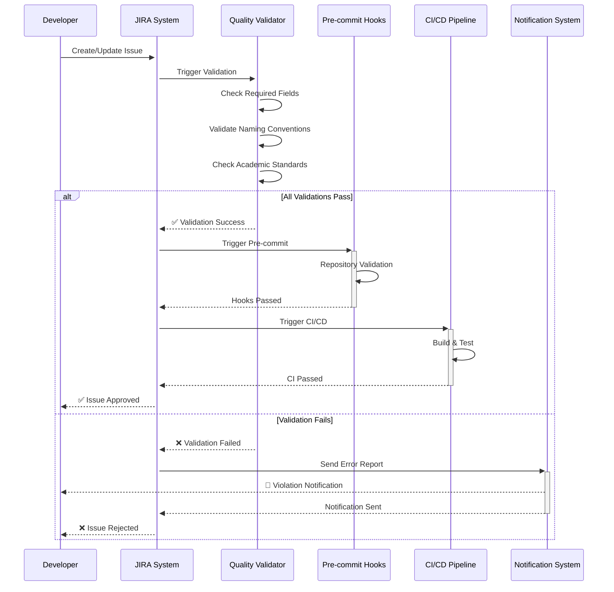
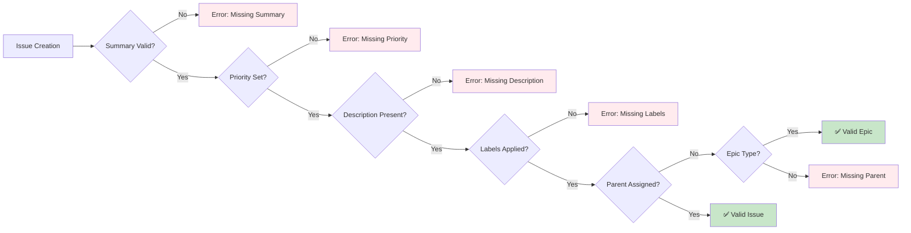
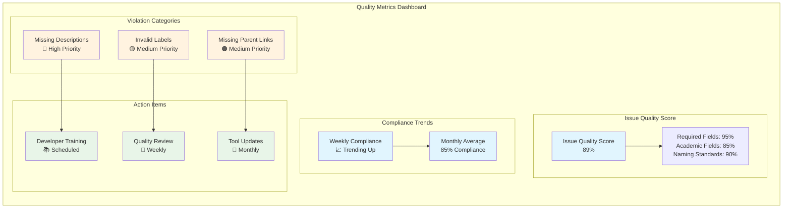
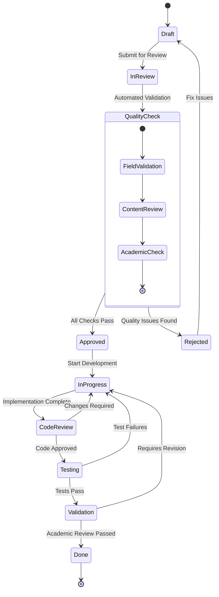
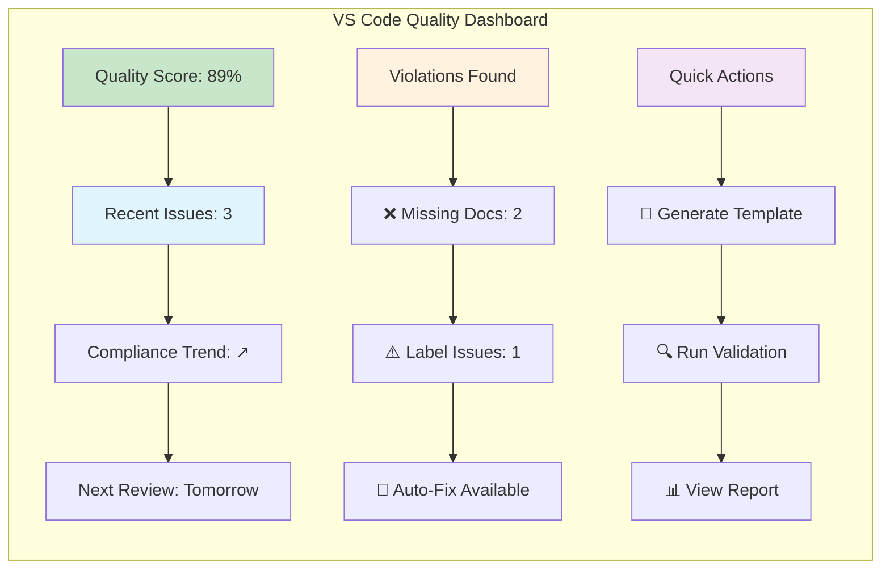
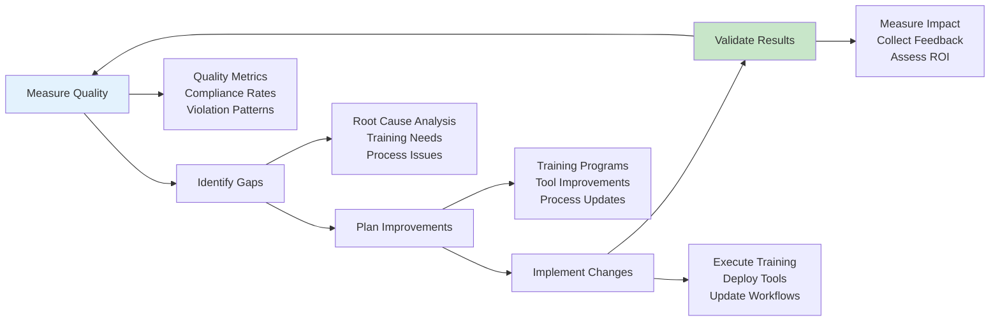
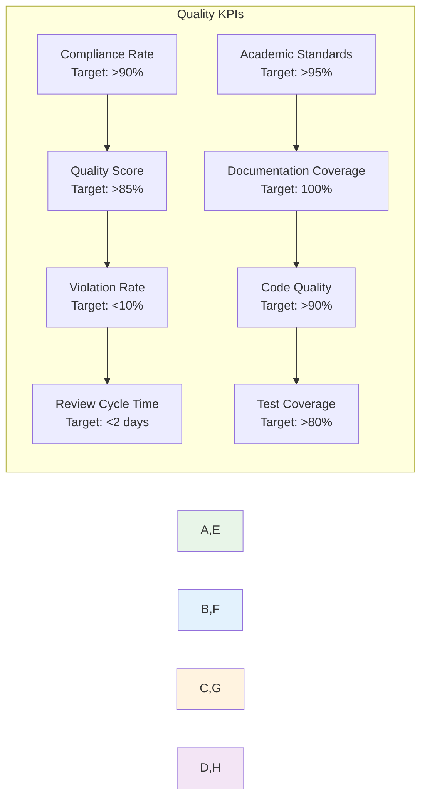

# Task Quality Enforcement Guide

> **User Guide for Maintaining High-Quality JIRA Tasks**
>
> This guide explains how to enforce task quality standards within the JIRA PT project, ensuring academic rigor and development excellence.

## Table of Contents

1. [Overview](#overview)
2. [Quality Standards](#quality-standards)
3. [Automated Enforcement](#automated-enforcement)
4. [Manual Quality Checks](#manual-quality-checks)
5. [Validation Tools](#validation-tools)
6. [Best Practices](#best-practices)
7. [Troubleshooting](#troubleshooting)

---

## Overview

Task quality enforcement ensures that all JIRA issues meet academic and development standards required for the TCC (Trabalho de Conclusão de Curso) project on GPU acceleration research.

### Quality Enforcement Architecture



### Quality Assurance Process Flow



## Quality Standards

### Required Fields Matrix

| Issue Type | Required Fields | Academic Fields | Optional Fields |
|------------|----------------|-----------------|-----------------|
| **Epic** | Summary, Priority, Description, Labels, Reporter, Assignee | Learning Objectives, Research Context | Sprint, Due Date |
| **Story** | Summary, Priority, Description, Labels, Reporter, Assignee, Parent | Acceptance Criteria, User Impact | Story Points, Sprint |
| **Task** | Summary, Priority, Description, Labels, Reporter, Assignee, Parent | Implementation Steps, Teaching Points | Original Estimate, Sprint |

### Field Validation Rules



### Academic Standards Requirements

#### 1. Learning-Oriented Content

All tasks must include educational components:

- **Learning Objectives**: Clear statement of what will be learned
- **Technical Context**: Why this work is important for the research
- **Implementation Steps**: Step-by-step breakdown with time estimates
- **Teaching Points**: Key concepts and best practices highlighted

#### 2. Research Compliance

Issues must align with TCC academic requirements:

- **Literature Context**: References to relevant academic sources
- **Methodology Documentation**: Clear experimental design
- **Validation Criteria**: How success will be measured
- **Reproducibility Notes**: Instructions for others to follow

#### 3. Documentation Standards

Comprehensive documentation requirements:

- **Technical Decision Records**: Rationale for implementation choices
- **Code Quality Standards**: Type hints, docstrings, testing requirements
- **Academic Citations**: Proper attribution and referencing
- **Progress Tracking**: Regular updates and reflection

## Automated Enforcement

### Pre-commit Hook Configuration

The quality enforcement system uses pre-commit hooks to validate changes:

```yaml
# .pre-commit-config.yaml
repos:
  - repo: local
    hooks:
      # JIRA Quality Validation
      - id: jira-task-quality
        name: Validate JIRA Task Quality
        entry: python scripts/validate_jira_quality.py
        language: system
        pass_filenames: false
        stages: [commit-msg, pre-push]
        
      # Academic Standards Check
      - id: academic-standards
        name: Check Academic Standards
        entry: python scripts/validate_academic_standards.py
        language: system
        pass_filenames: false
        
      # Repository Structure
      - id: repository-structure
        name: Validate Repository Structure
        entry: python scripts/validate_structure.py
        language: system
        pass_filenames: false
```

### Real-time Quality Dashboard



## Manual Quality Checks

### Quality Review Checklist

Use this checklist for manual review of JIRA issues:

#### ✅ Content Quality

- [ ] **Summary**: Clear, concise, and descriptive (10-100 characters)
- [ ] **Description**: Comprehensive with learning objectives and context
- [ ] **Acceptance Criteria**: Clear, testable, and measurable outcomes
- [ ] **Labels**: Appropriate taxonomy labels applied
- [ ] **Priority**: Correctly assigned based on project impact
- [ ] **Assignee**: Designated responsible person

#### ✅ Academic Standards

- [ ] **Learning Objectives**: Explicitly stated what will be learned
- [ ] **Research Context**: Connected to TCC objectives and GPU research
- [ ] **Implementation Steps**: Detailed breakdown with time estimates
- [ ] **Teaching Points**: Key concepts and best practices highlighted
- [ ] **Literature References**: Academic sources cited where appropriate
- [ ] **Validation Criteria**: Clear success metrics defined

#### ✅ Technical Requirements

- [ ] **Type Hints**: Required for all code components
- [ ] **Documentation**: Comprehensive docstrings and comments
- [ ] **Testing Strategy**: Unit, integration, and performance tests defined
- [ ] **Code Quality**: Linting, formatting, and type checking requirements
- [ ] **Git Integration**: Proper branch naming and commit message format

### Review Process Workflow



## Validation Tools

### Command-Line Validators

#### 1. Structure Validator

```bash
# Validate repository structure
python scripts/validate_structure.py

# Example output:
✅ Repository structure validation passed
✅ All required directories present
✅ Naming conventions followed
✅ Academic standards maintained
```

#### 2. JIRA Quality Validator

```bash
# Validate JIRA integration quality
python scripts/validate_jira_quality.py

# Example output:
🔍 Validating JIRA task quality...
✅ PT-101: Epic quality standards met
✅ PT-102: Story acceptance criteria complete  
❌ PT-103: Missing learning objectives
✅ PT-104: Task implementation steps defined
📊 Overall quality score: 89%
```

#### 3. Academic Standards Checker

```bash
# Check academic compliance
python scripts/validate_academic_standards.py

# Example output:
📚 Checking academic standards...
✅ Literature references present
✅ Methodology documented
✅ Learning objectives defined
❌ Statistical validation missing
✅ Reproducibility instructions complete
📈 Academic compliance: 85%
```

### VS Code Integration

#### Quality Dashboard Widget



## Best Practices

### 1. Issue Creation Best Practices

#### Template Usage

Always use the provided templates for consistent quality:

```markdown
# Epic Template
**Summary**: [Brief description of epic scope]

**Learning Objectives**:
- Objective 1: Understanding...
- Objective 2: Implementing...
- Objective 3: Validating...

**Research Context**:
- Academic relevance to TCC
- Connection to GPU acceleration research
- Literature references

**Success Criteria**:
- [ ] Criterion 1
- [ ] Criterion 2
- [ ] Academic validation complete

**Resource Planning**:
- Estimated effort: X hours
- Dependencies: [List dependencies]
- Prerequisites: [Required knowledge/tools]
```

#### Label Taxonomy Guidelines

Use standardized labels for consistency:

```yaml
# Label Categories and Values
Type Labels:
  - setup: Infrastructure and environment setup
  - development: Implementation and coding
  - research: Investigation and analysis
  - documentation: Writing and knowledge management
  - testing: Validation and quality assurance

Phase Labels:
  - phase-0: Foundation and environment setup
  - phase-1: Core architecture development
  - phase-2: Advanced implementation and optimization

Complexity Labels:
  - simple: < 4 hours, well-defined scope
  - medium: 4-16 hours, moderate complexity
  - complex: > 16 hours, research required

Domain Labels:
  - gpu: GPU computing and CUDA programming
  - algorithms: Optimization algorithms and data structures
  - architecture: System design and software patterns
  - quality: Testing, validation, and standards
```

### 2. Quality Improvement Strategies

#### Continuous Improvement Cycle



#### Quality Champions Program

Establish quality champions to drive improvement:

- **Role**: Quality advocates within development teams
- **Responsibilities**:
  - Mentor team members on quality standards
  - Review issues before submission
  - Provide feedback on quality tools and processes
  - Lead quality improvement initiatives

- **Training**: Regular sessions on:
  - Academic writing standards
  - JIRA best practices
  - Quality validation tools
  - Peer review techniques

### 3. Academic Excellence Standards

#### Research Integration Checklist

- [ ] **Literature Review**: Relevant academic sources identified and cited
- [ ] **Methodology**: Clear experimental design documented
- [ ] **Hypotheses**: Research questions and predictions stated
- [ ] **Variables**: Independent, dependent, and controlled variables defined
- [ ] **Data Collection**: Systematic approach to gathering evidence
- [ ] **Analysis Plan**: Statistical methods and validation criteria
- [ ] **Reproducibility**: Complete instructions for replication
- [ ] **Ethics**: Research ethics considerations addressed

#### Documentation Excellence

Follow academic writing standards:

```markdown
# Academic Documentation Template

## Abstract
[Brief summary of work and findings]

## Introduction
[Context, motivation, and objectives]

## Literature Review
[Related work and academic context]

## Methodology
[Detailed approach and experimental design]

## Implementation
[Technical details and code documentation]

## Results
[Findings with statistical analysis]

## Discussion
[Interpretation and implications]

## Conclusion
[Summary and future work]

## References
[Academic citations in proper format]
```

## Troubleshooting

### Common Quality Issues

#### 1. Missing Required Fields

**Problem**: Issues created without mandatory fields

**Solution**:

```bash
# Run field validation
python scripts/validate_jira_quality.py --check-fields

# Auto-fix template issues
python scripts/fix_missing_fields.py --issue PT-XXX
```

#### 2. Inconsistent Labeling

**Problem**: Labels don't follow taxonomy standards

**Solution**:

```bash
# Validate label usage
python scripts/validate_labels.py

# Suggest correct labels
python scripts/suggest_labels.py --issue PT-XXX
```

#### 3. Academic Standards Violations

**Problem**: Issues lack academic rigor

**Solution**:

```bash
# Check academic compliance
python scripts/validate_academic.py --comprehensive

# Generate academic checklist
python scripts/generate_academic_checklist.py --issue PT-XXX
```

### Error Resolution Workflow

```mermaid
flowchart TD
    A[Quality Violation Detected] --> B{Error Type}
    
    B -->|Field Missing| C[Auto-Fix Available?]
    B -->|Academic Standard| D[Generate Checklist]
    B -->|Label Issue| E[Suggest Corrections]
    B -->|Structure Problem| F[Repository Validation]
    
    C -->|Yes| G[Apply Auto-Fix]
    C -->|No| H[Manual Correction Required]
    
    D --> I[Review Academic Requirements]
    E --> J[Apply Label Suggestions]
    F --> K[Fix Structure Issues]
    
    G --> L[Validate Fix]
    H --> M[Developer Notification]
    I --> N[Update Documentation]
    J --> L
    K --> L
    
    L --> O{Validation Passed?}
    O -->|Yes| P[✅ Issue Resolved]
    O -->|No| Q[❌ Additional Issues Found]
    
    M --> R[Provide Guidance]
    N --> S[Academic Review]
    Q --> A
    
    style A fill:#ffebee
    style P fill:#c8e6c9
    style Q fill:#fff3e0
```



### Performance Monitoring

#### Quality Metrics Dashboard

Monitor these key performance indicators:



### Support and Resources

#### Getting Help

- **Documentation**: Check this guide and API documentation
- **Training**: Attend quality standards workshops
- **Support**: Contact quality champions for assistance
- **Tools**: Use automated validation scripts

#### Useful Commands

```bash
# Quick quality check
make quality-check

# Generate quality report
make quality-report

# Fix common issues
make quality-fix

# Run full validation suite
make validate-all
```

---

**Remember**: Quality enforcement is about enabling academic excellence and research integrity, not adding bureaucracy. Focus on creating value through rigorous standards that support learning and discovery.
